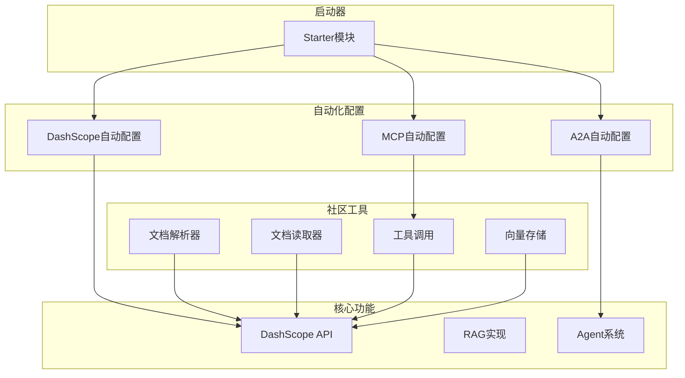
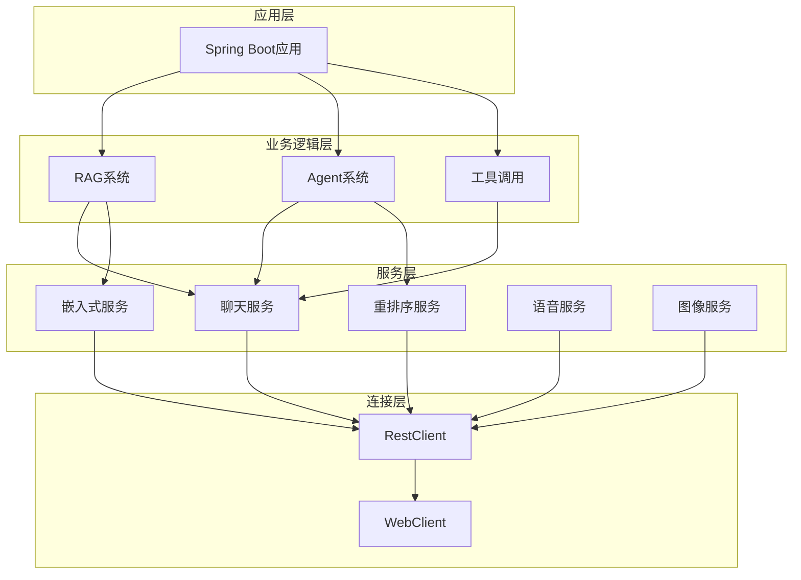
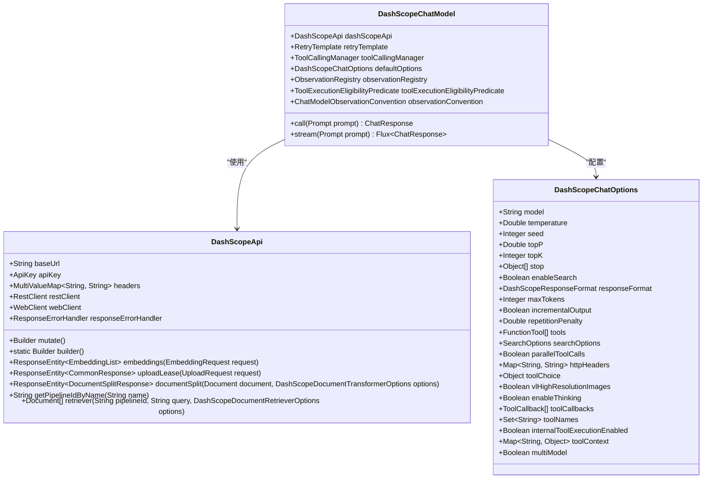
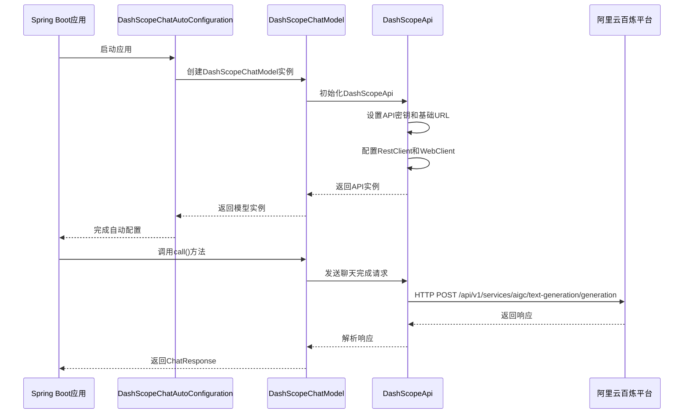
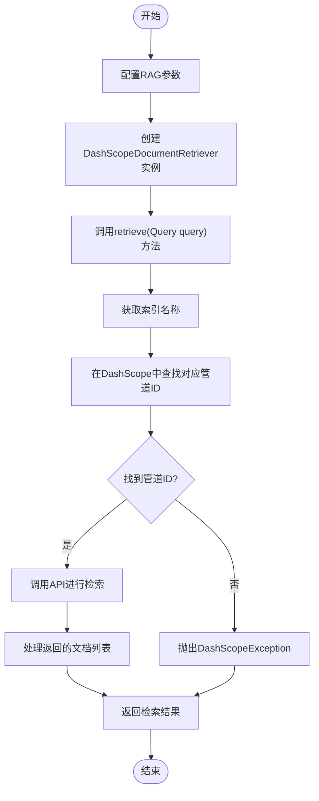
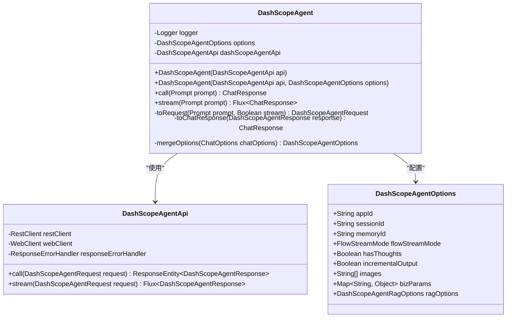
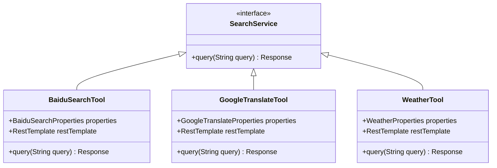
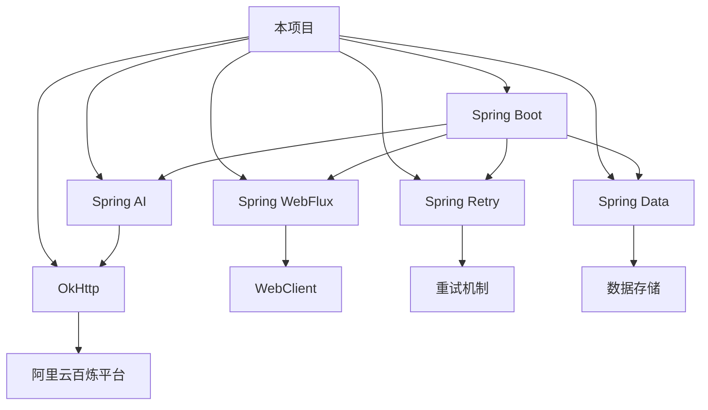

# AI服务集成

<cite>
**本文档引用的文件**
- [DashScopeChatAutoConfiguration.java](file://auto-configurations/spring-ai-alibaba-autoconfigure-dashscope/src/main/java/com/alibaba/cloud/ai/autoconfigure/dashscope/DashScopeChatAutoConfiguration.java)
- [DashScopeApi.java](file://spring-ai-alibaba-core/src/main/java/com/alibaba/cloud/ai/dashscope/api/DashScopeApi.java)
- [DashScopeChatProperties.java](file://auto-configurations/spring-ai-alibaba-autoconfigure-dashscope/src/main/java/com/alibaba/cloud/ai/autoconfigure/dashscope/DashScopeChatProperties.java)
- [DashScopeChatOptions.java](file://spring-ai-alibaba-core/src/main/java/com/alibaba/cloud/ai/dashscope/chat/DashScopeChatOptions.java)
- [DashScopeDocumentRetriever.java](file://spring-ai-alibaba-core/src/main/java/com/alibaba/cloud/ai/dashscope/rag/DashScopeDocumentRetriever.java)
- [DashScopeAgent.java](file://spring-ai-alibaba-core/src/main/java/com/alibaba/cloud/ai/dashscope/agent/DashScopeAgent.java)
- [SearchService.java](file://community/tool-calls/spring-ai-alibaba-starter-tool-calling-common/src/main/java/com/alibaba/cloud/ai/toolcalling/common/interfaces/SearchService.java)
</cite>

## 目录
1. [简介](#简介)
2. [项目结构](#项目结构)
3. [核心组件](#核心组件)
4. [架构概述](#架构概述)
5. [详细组件分析](#详细组件分析)
6. [依赖分析](#依赖分析)
7. [性能考虑](#性能考虑)
8. [故障排除指南](#故障排除指南)
9. [结论](#结论)

## 简介
本项目是一个基于Spring AI框架的阿里巴巴AI服务集成解决方案，专注于与阿里云百炼平台和DashScope服务的深度集成。该框架提供了自动配置、API封装和异步调用处理等核心功能，支持检索增强生成（RAG）等高级AI应用场景。系统设计遵循模块化原则，通过starter模式提供开箱即用的功能，同时支持灵活的扩展性以适应未来可能集成的其他AI服务。

## 项目结构
该项目采用多模块Maven结构，主要分为自动化配置、社区工具、核心功能和启动器等部分。自动化配置模块负责实现Spring Boot的自动装配机制，社区工具模块集成了多种外部AI服务，核心功能模块包含与DashScope服务交互的主要逻辑，而启动器模块则为开发者提供便捷的集成方式。

**图表来源**
- [DashScopeChatAutoConfiguration.java](file://auto-configurations/spring-ai-alibaba-autoconfigure-dashscope/src/main/java/com/alibaba/cloud/ai/autoconfigure/dashscope/DashScopeChatAutoConfiguration.java)
- [DashScopeApi.java](file://spring-ai-alibaba-core/src/main/java/com/alibaba/cloud/ai/dashscope/api/DashScopeApi.java)

**章节来源**
- [DashScopeChatAutoConfiguration.java](file://auto-configurations/spring-ai-alibaba-autoconfigure-dashscope/src/main/java/com/alibaba/cloud/ai/autoconfigure/dashscope/DashScopeChatAutoConfiguration.java)

## 核心组件
本项目的三大核心组件是DashScope集成、RAG实现和Agent系统。DashScope集成组件负责与阿里云百炼平台的通信，提供聊天、嵌入式和重排序等功能；RAG实现组件通过检索增强生成技术提升AI模型的知识广度和准确性；Agent系统则实现了复杂的任务分解和执行能力，支持深度思考和多步骤推理。

**章节来源**
- [DashScopeApi.java](file://spring-ai-alibaba-core/src/main/java/com/alibaba/cloud/ai/dashscope/api/DashScopeApi.java)
- [DashScopeDocumentRetriever.java](file://spring-ai-alibaba-core/src/main/java/com/alibaba/cloud/ai/dashscope/rag/DashScopeDocumentRetriever.java)
- [DashScopeAgent.java](file://spring-ai-alibaba-core/src/main/java/com/alibaba/cloud/ai/dashscope/agent/DashScopeAgent.java)

## 架构概述
系统采用分层架构设计，从下到上依次为连接层、服务层、业务逻辑层和应用层。连接层负责管理与外部AI服务的HTTP连接，服务层封装了具体的API调用逻辑，业务逻辑层实现了RAG、Agent等高级功能，应用层则通过Spring Boot Starter为开发者提供简便的集成方式。

**图表来源**
- [DashScopeApi.java](file://spring-ai-alibaba-core/src/main/java/com/alibaba/cloud/ai/dashscope/api/DashScopeApi.java)
- [DashScopeDocumentRetriever.java](file://spring-ai-alibaba-core/src/main/java/com/alibaba/cloud/ai/dashscope/rag/DashScopeDocumentRetriever.java)
- [DashScopeAgent.java](file://spring-ai-alibaba-core/src/main/java/com/alibaba/cloud/ai/dashscope/agent/DashScopeAgent.java)

## 详细组件分析

### DashScope集成分析
DashScope集成组件是整个系统的核心，它通过自动配置机制简化了与阿里云百炼平台的集成过程。该组件提供了完整的API封装，包括聊天、嵌入式、重排序等多种AI服务，并支持同步和异步两种调用模式。

#### 对于对象导向组件：

**图表来源**
- [DashScopeApi.java](file://spring-ai-alibaba-core/src/main/java/com/alibaba/cloud/ai/dashscope/api/DashScopeApi.java)
- [DashScopeChatModel.java](file://spring-ai-alibaba-core/src/main/java/com/alibaba/cloud/ai/dashscope/chat/DashScopeChatModel.java)
- [DashScopeChatOptions.java](file://spring-ai-alibaba-core/src/main/java/com/alibaba/cloud/ai/dashscope/chat/DashScopeChatOptions.java)

#### 对于API/服务组件：

**图表来源**
- [DashScopeChatAutoConfiguration.java](file://auto-configurations/spring-ai-alibaba-autoconfigure-dashscope/src/main/java/com/alibaba/cloud/ai/autoconfigure/dashscope/DashScopeChatAutoConfiguration.java)
- [DashScopeChatModel.java](file://spring-ai-alibaba-core/src/main/java/com/alibaba/cloud/ai/dashscope/chat/DashScopeChatModel.java)
- [DashScopeApi.java](file://spring-ai-alibaba-core/src/main/java/com/alibaba/cloud/ai/dashscope/api/DashScopeApi.java)

**章节来源**
- [DashScopeChatAutoConfiguration.java](file://auto-configurations/spring-ai-alibaba-autoconfigure-dashscope/src/main/java/com/alibaba/cloud/ai/autoconfigure/dashscope/DashScopeChatAutoConfiguration.java)
- [DashScopeChatModel.java](file://spring-ai-alibaba-core/src/main/java/com/alibaba/cloud/ai/dashscope/chat/DashScopeChatModel.java)

### RAG实现分析
检索增强生成（RAG）是提升AI模型知识广度和准确性的关键技术。本项目通过DashScopeDocumentRetriever组件实现了完整的RAG流程，包括文档索引、查询和检索等环节。

#### 对于复杂逻辑组件：

**图表来源**
- [DashScopeDocumentRetriever.java](file://spring-ai-alibaba-core/src/main/java/com/alibaba/cloud/ai/dashscope/rag/DashScopeDocumentRetriever.java)
- [DashScopeApi.java](file://spring-ai-alibaba-core/src/main/java/com/alibaba/cloud/ai/dashscope/api/DashScopeApi.java)

**章节来源**
- [DashScopeDocumentRetriever.java](file://spring-ai-alibaba-core/src/main/java/com/alibaba/cloud/ai/dashscope/rag/DashScopeDocumentRetriever.java)

### Agent系统分析
Agent系统是本项目最复杂的组件之一，它实现了基于深度思考的智能代理功能。通过DashScopeAgent组件，系统能够执行多步骤推理、任务分解和自我反思等高级认知功能。

**图表来源**
- [DashScopeAgent.java](file://spring-ai-alibaba-core/src/main/java/com/alibaba/cloud/ai/dashscope/agent/DashScopeAgent.java)
- [DashScopeAgentApi.java](file://spring-ai-alibaba-core/src/main/java/com/alibaba/cloud/ai/dashscope/api/DashScopeAgentApi.java)
- [DashScopeAgentOptions.java](file://spring-ai-alibaba-core/src/main/java/com/alibaba/cloud/ai/dashscope/agent/DashScopeAgentOptions.java)

**章节来源**
- [DashScopeAgent.java](file://spring-ai-alibaba-core/src/main/java/com/alibaba/cloud/ai/dashscope/agent/DashScopeAgent.java)

### 社区工具集成分析
社区工具模块展示了如何将外部AI服务集成到框架中。通过统一的SearchService接口，系统可以灵活地支持多种搜索引擎和工具调用服务。

**图表来源**
- [SearchService.java](file://community/tool-calls/spring-ai-alibaba-starter-tool-calling-common/src/main/java/com/alibaba/cloud/ai/toolcalling/common/interfaces/SearchService.java)

**章节来源**
- [SearchService.java](file://community/tool-calls/spring-ai-alibaba-starter-tool-calling-common/src/main/java/com/alibaba/cloud/ai/toolcalling/common/interfaces/SearchService.java)

## 依赖分析
系统依赖关系清晰，各模块之间耦合度低。核心依赖包括Spring Boot、Spring AI、OkHttp等开源框架，以及阿里云百炼平台的API服务。通过Maven BOM（Bill of Materials）管理，确保了版本的一致性和兼容性。

**图表来源**
- [pom.xml](file://pom.xml)
- [spring-ai-alibaba-bom/pom.xml](file://spring-ai-alibaba-bom/pom.xml)

**章节来源**
- [pom.xml](file://pom.xml)

## 性能考虑
在性能优化方面，系统采用了多项策略：使用RestClient和WebClient进行高效的HTTP通信，通过RetryTemplate实现可靠的重试机制，利用缓存减少重复请求，以及采用异步流式处理提高响应速度。此外，合理的连接池配置和超时设置也保证了系统的稳定性和可靠性。

## 故障排除指南
常见问题包括API密钥无效、网络连接失败、配额超限等。解决方法包括检查配置文件中的密钥是否正确，确认网络连接是否正常，监控API调用频率是否超过限制，以及查看日志文件获取详细的错误信息。对于复杂的集成问题，建议逐步调试，从简单的API调用开始，逐步增加复杂度。

**章节来源**
- [DashScopeApi.java](file://spring-ai-alibaba-core/src/main/java/com/alibaba/cloud/ai/dashscope/api/DashScopeApi.java)
- [DashScopeChatAutoConfiguration.java](file://auto-configurations/spring-ai-alibaba-autoconfigure-dashscope/src/main/java/com/alibaba/cloud/ai/autoconfigure/dashscope/DashScopeChatAutoConfiguration.java)

## 结论
本项目成功实现了与阿里云百炼平台的深度集成，提供了完整的AI服务解决方案。通过自动配置、API封装和异步调用处理等机制，大大简化了开发者的工作。RAG和Agent系统的实现展示了框架在处理复杂AI任务方面的强大能力。未来可以通过扩展社区工具模块，集成更多外部AI服务，进一步提升系统的功能和适用范围。