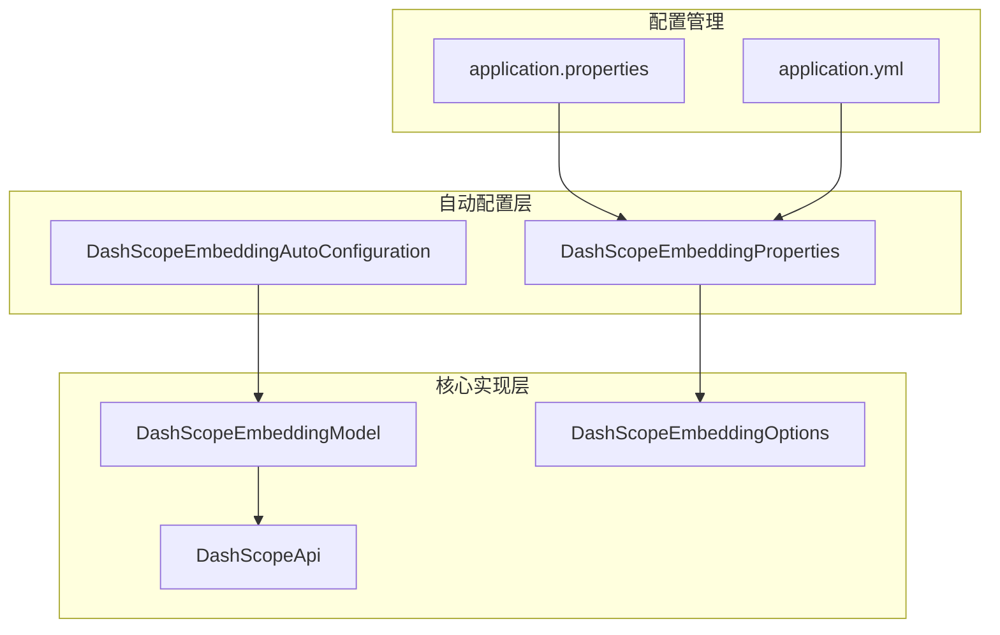
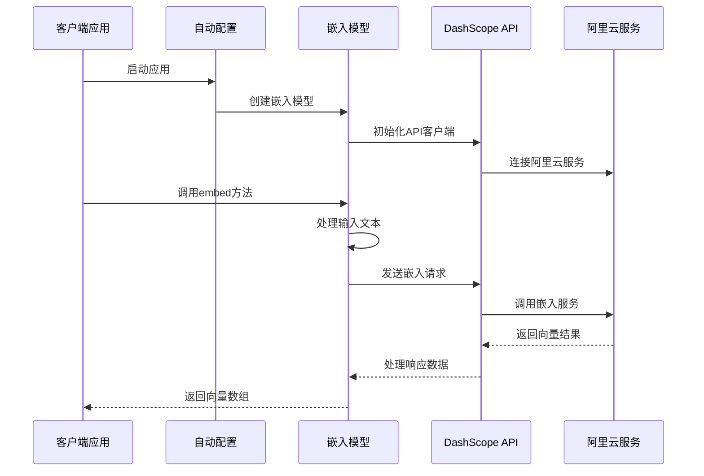
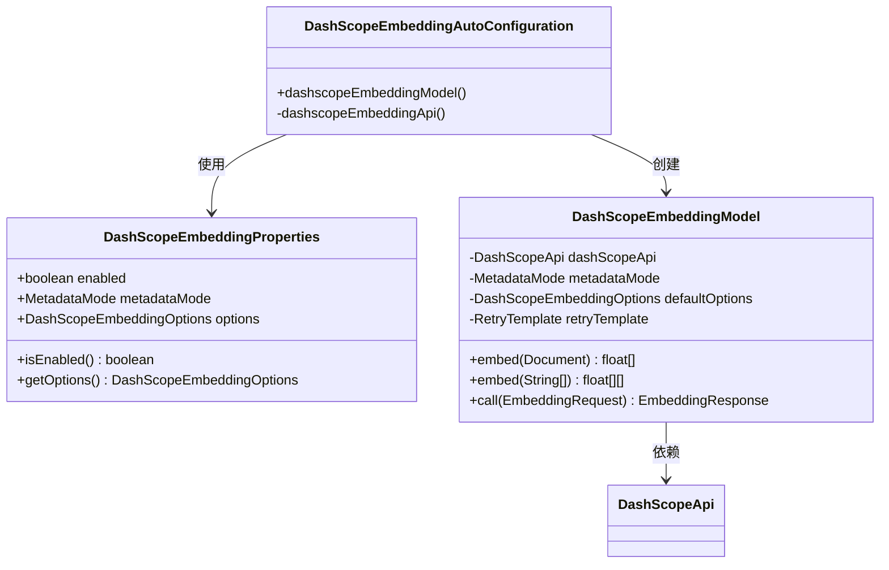
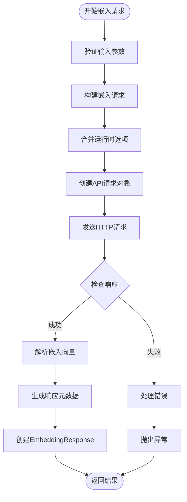
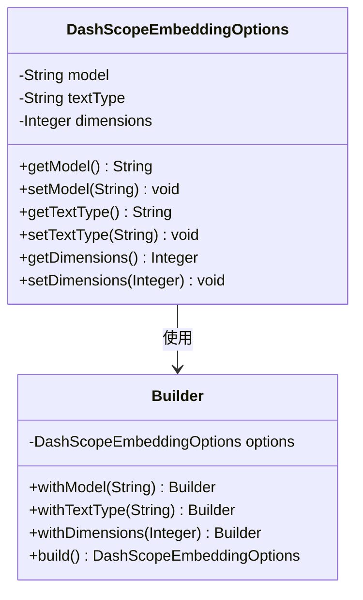

# DashScope嵌入功能详细文档

<cite>
**本文档引用的文件**
- [DashScopeEmbeddingAutoConfiguration.java](file://auto-configurations/spring-ai-alibaba-autoconfigure-dashscope/src/main/java/com/alibaba/cloud/ai/autoconfigure/dashscope/DashScopeEmbeddingAutoConfiguration.java)
- [DashScopeEmbeddingProperties.java](file://auto-configurations/spring-ai-alibaba-autoconfigure-dashscope/src/main/java/com/alibaba/cloud/ai/autoconfigure/dashscope/DashScopeEmbeddingProperties.java)
- [DashScopeEmbeddingModel.java](file://spring-ai-alibaba-core/src/main/java/com/alibaba/cloud/ai/dashscope/embedding/DashScopeEmbeddingModel.java)
- [DashScopeEmbeddingOptions.java](file://spring-ai-alibaba-core/src/main/java/com/alibaba/cloud/ai/dashscope/embedding/DashScopeEmbeddingOptions.java)
- [DashScopeApi.java](file://spring-ai-alibaba-core/src/main/java/com/alibaba/cloud/ai/dashscope/api/DashScopeApi.java)
- [DashScopeAutoConfigurationIT.java](file://auto-configurations/spring-ai-alibaba-autoconfigure-dashscope/src/test/java/com/alibaba/cloud/ai/autoconfigure/dashscope/DashScopeAutoConfigurationIT.java)
</cite>

## 目录
1. [简介](#简介)
2. [项目结构](#项目结构)
3. [核心组件](#核心组件)
4. [架构概览](#架构概览)
5. [详细组件分析](#详细组件分析)
6. [配置参数详解](#配置参数详解)
7. [使用案例](#使用案例)
8. [性能考量](#性能考量)
9. [故障排除指南](#故障排除指南)
10. [结论](#结论)

## 简介

DashScope嵌入功能是Spring AI Alibaba框架中用于生成文本向量表示的核心模块。该功能提供了自动装配的嵌入模型，支持多种嵌入模型（text-embedding-v1、text-embedding-v2、text-embedding-v3、text-embedding-v4），并具备批量处理能力、向量维度自定义、文本类型优化等特性。

嵌入功能主要用于将文本转换为高维向量表示，这些向量可以用于语义搜索、相似度计算、聚类分析等人工智能应用场景。

## 项目结构

DashScope嵌入功能在项目中的组织结构如下：



**图表来源**
- [DashScopeEmbeddingAutoConfiguration.java](file://auto-configurations/spring-ai-alibaba-autoconfigure-dashscope/src/main/java/com/alibaba/cloud/ai/autoconfigure/dashscope/DashScopeEmbeddingAutoConfiguration.java#L1-L100)
- [DashScopeEmbeddingProperties.java](file://auto-configurations/spring-ai-alibaba-autoconfigure-dashscope/src/main/java/com/alibaba/cloud/ai/autoconfigure/dashscope/DashScopeEmbeddingProperties.java#L1-L68)

## 核心组件

### 自动配置组件

DashScope嵌入功能通过Spring Boot的自动配置机制进行初始化，主要包含以下核心组件：

1. **DashScopeEmbeddingAutoConfiguration** - 主要的自动配置类
2. **DashScopeEmbeddingProperties** - 配置属性类
3. **DashScopeEmbeddingModel** - 嵌入模型实现类
4. **DashScopeEmbeddingOptions** - 嵌入选项配置类

**章节来源**
- [DashScopeEmbeddingAutoConfiguration.java](file://auto-configurations/spring-ai-alibaba-autoconfigure-dashscope/src/main/java/com/alibaba/cloud/ai/autoconfigure/dashscope/DashScopeEmbeddingAutoConfiguration.java#L1-L100)
- [DashScopeEmbeddingProperties.java](file://auto-configurations/spring-ai-alibaba-autoconfigure-dashscope/src/main/java/com/alibaba/cloud/ai/autoconfigure/dashscope/DashScopeEmbeddingProperties.java#L1-L68)

## 架构概览

DashScope嵌入功能采用分层架构设计，确保了良好的可扩展性和维护性：



**图表来源**
- [DashScopeEmbeddingModel.java](file://spring-ai-alibaba-core/src/main/java/com/alibaba/cloud/ai/dashscope/embedding/DashScopeEmbeddingModel.java#L94-L150)
- [DashScopeEmbeddingAutoConfiguration.java](file://auto-configurations/spring-ai-alibaba-autoconfigure-dashscope/src/main/java/com/alibaba/cloud/ai/autoconfigure/dashscope/DashScopeEmbeddingAutoConfiguration.java#L45-L75)

## 详细组件分析

### DashScopeEmbeddingAutoConfiguration 分析

自动配置类负责整个嵌入功能的初始化和依赖注入：



**图表来源**
- [DashScopeEmbeddingAutoConfiguration.java](file://auto-configurations/spring-ai-alibaba-autoconfigure-dashscope/src/main/java/com/alibaba/cloud/ai/autoconfigure/dashscope/DashScopeEmbeddingAutoConfiguration.java#L45-L75)
- [DashScopeEmbeddingModel.java](file://spring-ai-alibaba-core/src/main/java/com/alibaba/cloud/ai/dashscope/embedding/DashScopeEmbeddingModel.java#L50-L95)

自动配置类的关键特性：

1. **条件注解支持**：使用`@ConditionalOnClass`和`@ConditionalOnProperty`确保只有在适当条件下才创建bean
2. **依赖注入**：自动注入WebClient、RestClient、RetryTemplate等组件
3. **观察模式支持**：集成了Micrometer观测功能，支持性能监控

**章节来源**
- [DashScopeEmbeddingAutoConfiguration.java](file://auto-configurations/spring-ai-alibaba-autoconfigure-dashscope/src/main/java/com/alibaba/cloud/ai/autoconfigure/dashscope/DashScopeEmbeddingAutoConfiguration.java#L1-L100)

### DashScopeEmbeddingModel 实现分析

嵌入模型是整个功能的核心实现，继承自Spring AI的AbstractEmbeddingModel：



**图表来源**
- [DashScopeEmbeddingModel.java](file://spring-ai-alibaba-core/src/main/java/com/alibaba/cloud/ai/dashscope/embedding/DashScopeEmbeddingModel.java#L100-L160)

核心方法实现：

1. **单文档嵌入**：`embed(Document document)`
2. **批量文本嵌入**：`embed(List<String> texts)`
3. **完整请求处理**：`call(EmbeddingRequest request)`

**章节来源**
- [DashScopeEmbeddingModel.java](file://spring-ai-alibaba-core/src/main/java/com/alibaba/cloud/ai/dashscope/embedding/DashScopeEmbeddingModel.java#L100-L274)

### DashScopeEmbeddingOptions 配置分析

嵌入选项类提供了丰富的配置选项：



**图表来源**
- [DashScopeEmbeddingOptions.java](file://spring-ai-alibaba-core/src/main/java/com/alibaba/cloud/ai/dashscope/embedding/DashScopeEmbeddingOptions.java#L30-L98)

**章节来源**
- [DashScopeEmbeddingOptions.java](file://spring-ai-alibaba-core/src/main/java/com/alibaba/cloud/ai/dashscope/embedding/DashScopeEmbeddingOptions.java#L1-L99)

## 配置参数详解

### 默认配置值

系统预设了以下默认配置：

| 参数名称 | 默认值 | 描述 |
|---------|--------|------|
| 模型 | text-embedding-v3 | 嵌入模型版本 |
| 文本类型 | null | 查询或文档类型 |
| 维度 | null | 向量维度（可选） |
| 启用状态 | true | 功能开关 |

### 可配置参数

```yaml
spring:
  ai:
    dashscope:
      embedding:
        enabled: true
        metadata-mode: EMBED
        options:
          model: text-embedding-v3
          text-type: document
          dimensions: 512
```

**章节来源**
- [DashScopeEmbeddingProperties.java](file://auto-configurations/spring-ai-alibaba-autoconfigure-dashscope/src/main/java/com/alibaba/cloud/ai/autoconfigure/dashscope/DashScopeEmbeddingProperties.java#L25-L68)

## 使用案例

### 基础文本嵌入

```java
@Autowired
private EmbeddingModel embeddingModel;

public void basicEmbeddingExample() {
    String text = "Hello, world!";
    float[] embedding = embeddingModel.embed(text);
    System.out.println("向量维度: " + embedding.length);
}
```

### 批量文本处理

```java
public void batchEmbeddingExample() {
    List<String> texts = Arrays.asList(
        "第一段文本",
        "第二段文本",
        "第三段文本"
    );
    
    List<float[]> embeddings = embeddingModel.embed(texts);
    System.out.println("处理了 " + embeddings.size() + " 条文本");
}
```

### 自定义配置使用

```java
public void customizedEmbeddingExample() {
    // 创建自定义选项
    DashScopeEmbeddingOptions options = DashScopeEmbeddingOptions.builder()
        .withModel("text-embedding-v2")
        .withDimensions(1024)
        .withTextType("query")
        .build();
    
    // 使用自定义选项进行嵌入
    EmbeddingResponse response = embeddingModel.embedForResponse(
        List.of("查询文本"), options);
}
```

### 语义搜索集成

```java
@Service
public class SemanticSearchService {
    
    @Autowired
    private EmbeddingModel embeddingModel;
    
    @Autowired
    private VectorStore vectorStore;
    
    public void addDocumentToIndex(String id, String content) {
        // 生成文档向量
        float[] embedding = embeddingModel.embed(content);
        
        // 创建文档并添加到向量存储
        Document document = new Document(id, content);
        document.setEmbedding(embedding);
        vectorStore.add(document);
    }
    
    public List<Document> searchSimilar(String query, int topK) {
        // 生成查询向量
        float[] queryVector = embeddingModel.embed(query);
        
        // 执行相似度搜索
        return vectorStore.similaritySearch(queryVector, topK);
    }
}
```

**章节来源**
- [DashScopeAutoConfigurationIT.java](file://auto-configurations/spring-ai-alibaba-autoconfigure-dashscope/src/test/java/com/alibaba/cloud/ai/autoconfigure/dashscope/DashScopeAutoConfigurationIT.java#L156-L178)

## 性能考量

### 向量维度选择

不同的嵌入模型支持不同的向量维度：

| 模型版本 | 默认维度 | 最小维度 | 最大维度 | 特点 |
|---------|----------|----------|----------|------|
| text-embedding-v1 | 1536 | 1536 | 1536 | 固定维度，适合通用场景 |
| text-embedding-v2 | 1536 | 1536 | 1536 | 固定维度，高性能 |
| text-embedding-v3 | 1024 | 64 | 1024 | 可变维度，灵活配置 |
| text-embedding-v4 | 1024 | 64 | 2048 | 最新版本，最高精度 |

### 成本优化建议

1. **模型选择**：根据应用场景选择合适的模型版本
2. **维度控制**：仅在必要时使用高维度模型
3. **批量处理**：利用批量接口减少API调用次数
4. **缓存策略**：对重复文本进行向量缓存

### 性能监控

```java
@Component
public class EmbeddingMetrics {
    
    @EventListener
    public void handleEmbeddingEvent(Observation.Context context) {
        if (context instanceof EmbeddingModelObservationContext) {
            EmbeddingModelObservationContext embeddingContext = 
                (EmbeddingModelObservationContext) context;
            
            // 记录嵌入请求指标
            log.info("Embedding request processed: {} tokens, model: {}", 
                embeddingContext.getUsage().getTotalTokens(),
                embeddingContext.getProvider());
        }
    }
}
```

## 故障排除指南

### 常见问题及解决方案

1. **API密钥配置错误**
   ```properties
   # 确保正确配置API密钥
   spring.ai.dashscope.api-key=your-api-key
   ```

2. **模型不支持的维度**
   ```java
   // 错误示例
   DashScopeEmbeddingOptions.builder()
       .withModel("text-embedding-v1")
       .withDimensions(512) // text-embedding-v1不支持自定义维度
       .build();
   ```

3. **网络连接问题**
   - 检查网络连通性
   - 验证代理设置
   - 确认防火墙规则

### 错误处理机制

```java
@Component
public class EmbeddingErrorHandler {
    
    @EventListener
    public void handleError(Exception exception) {
        if (exception instanceof RuntimeException 
            && exception.getMessage().contains("Embedding failed")) {
            // 处理嵌入失败情况
            log.error("Embedding operation failed", exception);
        }
    }
}
```

**章节来源**
- [DashScopeEmbeddingModel.java](file://spring-ai-alibaba-core/src/main/java/com/alibaba/cloud/ai/dashscope/embedding/DashScopeEmbeddingModel.java#L140-L155)

## 结论

DashScope嵌入功能提供了完整的文本向量化解决方案，具有以下优势：

1. **自动配置**：零配置即可使用，支持Spring Boot自动装配
2. **多模型支持**：提供多个版本的嵌入模型，满足不同需求
3. **灵活配置**：支持向量维度、文本类型等参数定制
4. **高性能**：内置重试机制和批量处理能力
5. **可观测性**：集成Micrometer监控，便于运维管理

该功能适用于各种需要文本向量化的场景，如语义搜索、推荐系统、内容分类等，为开发者提供了强大而易用的嵌入工具。