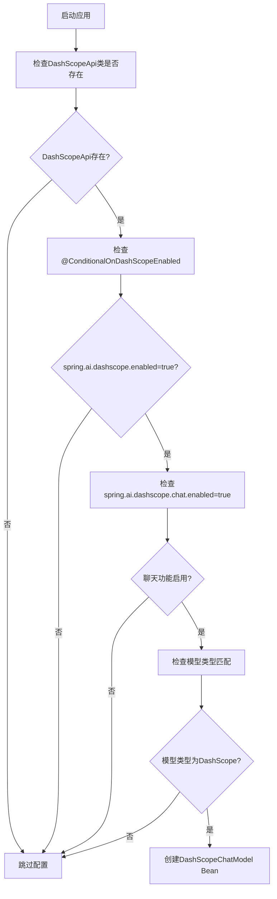
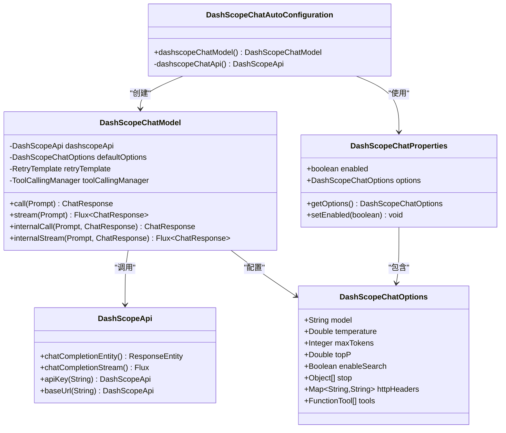
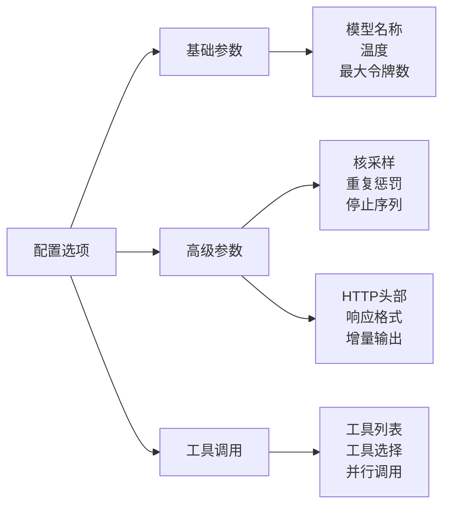
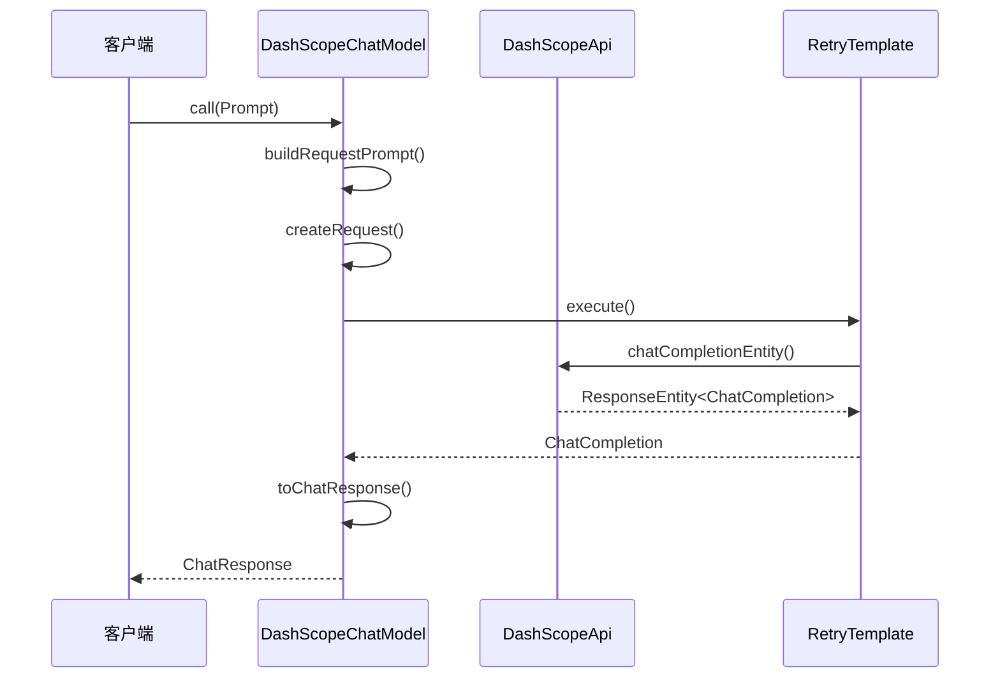
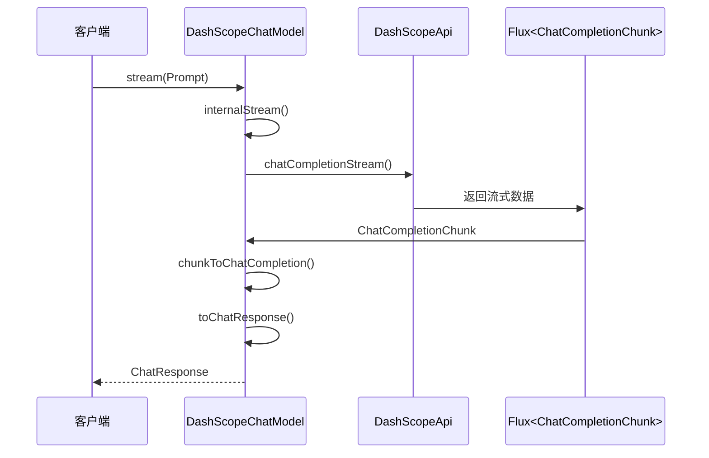
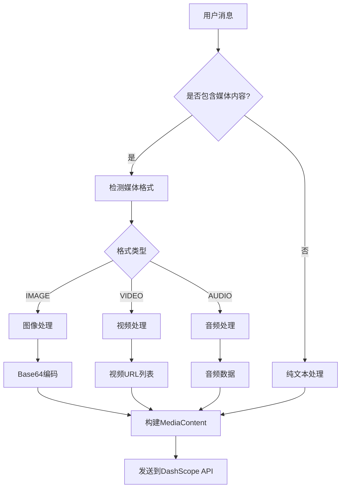
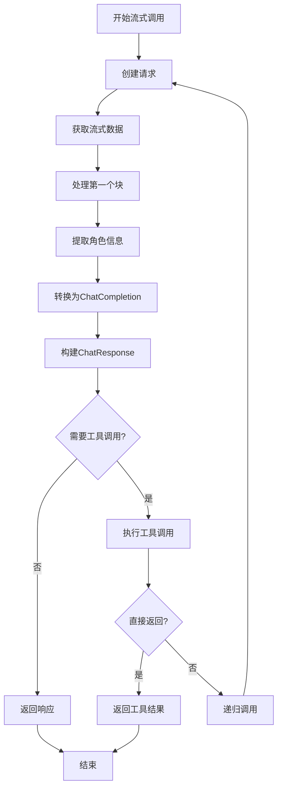
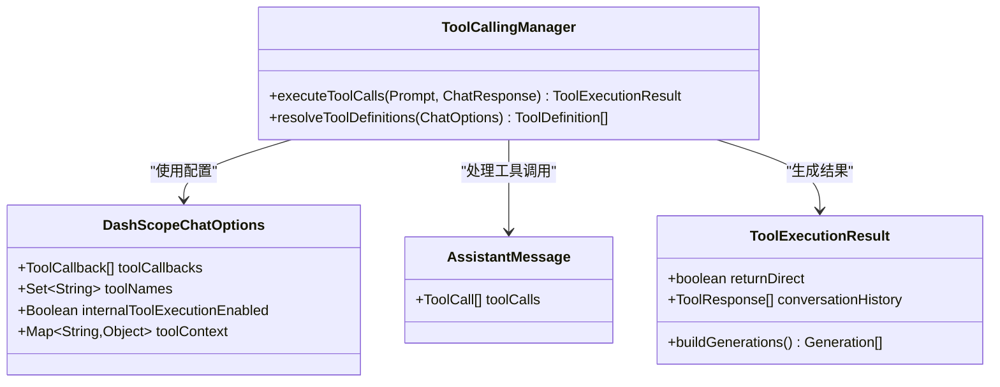
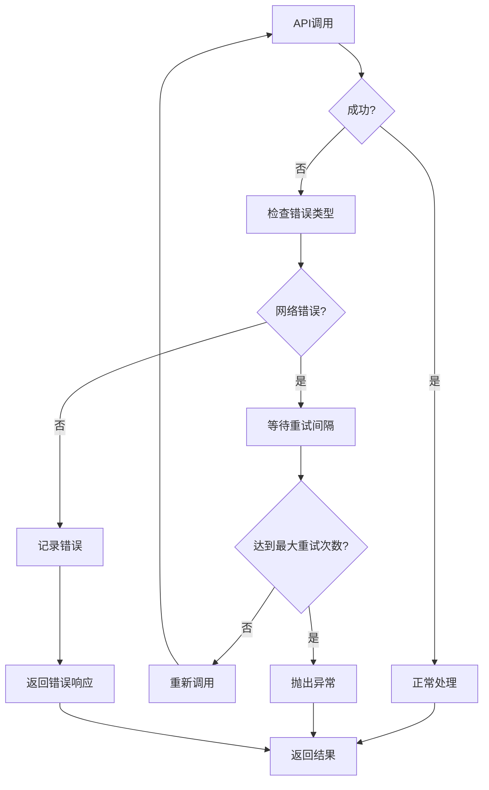
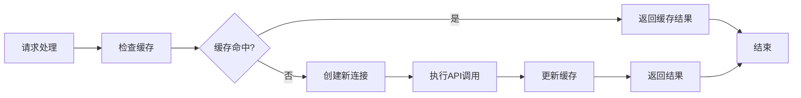

# 聊天功能

<cite>
**本文档中引用的文件**
- [DashScopeChatAutoConfiguration.java](file://auto-configurations/spring-ai-alibaba-autoconfigure-dashscope/src/main/java/com/alibaba/cloud/ai/autoconfigure/dashscope/DashScopeChatAutoConfiguration.java)
- [DashScopeChatProperties.java](file://auto-configurations/spring-ai-alibaba-autoconfigure-dashscope/src/main/java/com/alibaba/cloud/ai/autoconfigure/dashscope/DashScopeChatProperties.java)
- [DashScopeChatOptions.java](file://spring-ai-alibaba-core/src/main/java/com/alibaba/cloud/ai/dashscope/chat/DashScopeChatOptions.java)
- [DashScopeChatModel.java](file://spring-ai-alibaba-core/src/main/java/com/alibaba/cloud/ai/dashscope/chat/DashScopeChatModel.java)
- [ConditionalOnDashScopeEnabled.java](file://auto-configurations/spring-ai-alibaba-autoconfigure-dashscope/src/main/java/com/alibaba/cloud/ai/autoconfigure/dashscope/ConditionalOnDashScopeEnabled.java)
- [DashScopeAutoConfigurationIT.java](file://auto-configurations/spring-ai-alibaba-autoconfigure-dashscope/src/test/java/com/alibaba/cloud/ai/autoconfigure/dashscope/DashScopeAutoConfigurationIT.java)
</cite>

## 目录
1. [简介](#简介)
2. [自动配置机制](#自动配置机制)
3. [核心组件架构](#核心组件架构)
4. [配置属性详解](#配置属性详解)
5. [DashScopeChatModel实现](#dashscopechatmodel实现)
6. [消息格式处理](#消息格式处理)
7. [流式响应支持](#流式响应支持)
8. [工具调用集成](#工具调用集成)
9. [错误处理机制](#错误处理机制)
10. [性能优化策略](#性能优化策略)
11. [使用示例](#使用示例)
12. [故障排除指南](#故障排除指南)

## 简介

DashScope聊天功能是Spring AI Alibaba框架中基于阿里云DashScope API的智能对话服务实现。该功能提供了完整的聊天模型配置、消息处理、流式响应和工具调用支持，使开发者能够轻松地在Spring应用程序中集成强大的AI对话能力。

## 自动配置机制

### 条件注解系统

DashScope聊天功能采用Spring Boot的条件化自动配置机制，通过多个条件注解确保只有在满足特定条件时才会启用聊天功能：



**图表来源**
- [DashScopeChatAutoConfiguration.java](file://auto-configurations/spring-ai-alibaba-autoconfigure-dashscope/src/main/java/com/alibaba/cloud/ai/autoconfigure/dashscope/DashScopeChatAutoConfiguration.java#L50-L55)
- [ConditionalOnDashScopeEnabled.java](file://auto-configurations/spring-ai-alibaba-autoconfigure-dashscope/src/main/java/com/alibaba/cloud/ai/autoconfigure/dashscope/ConditionalOnDashScopeEnabled.java#L28-L32)

### 条件注解实现

```java
@ConditionalOnClass(DashScopeApi.class)
@ConditionalOnDashScopeEnabled
@ConditionalOnProperty(name = SpringAIModelProperties.CHAT_MODEL, 
    havingValue = SpringAIAlibabaModels.DASHSCOPE, matchIfMissing = true)
```

这些条件注解确保：
- 只有在项目中包含DashScope API依赖时才启用
- 需要显式启用DashScope功能
- 只有当配置的模型类型为DashScope时才激活

**章节来源**
- [DashScopeChatAutoConfiguration.java](file://auto-configurations/spring-ai-alibaba-autoconfigure-dashscope/src/main/java/com/alibaba/cloud/ai/autoconfigure/dashscope/DashScopeChatAutoConfiguration.java#L50-L55)
- [ConditionalOnDashScopeEnabled.java](file://auto-configurations/spring-ai-alibaba-autoconfigure-dashscope/src/main/java/com/alibaba/cloud/ai/autoconfigure/dashscope/ConditionalOnDashScopeEnabled.java#L28-L32)

## 核心组件架构

### 组件关系图



**图表来源**
- [DashScopeChatAutoConfiguration.java](file://auto-configurations/spring-ai-alibaba-autoconfigure-dashscope/src/main/java/com/alibaba/cloud/ai/autoconfigure/dashscope/DashScopeChatAutoConfiguration.java#L76-L110)
- [DashScopeChatModel.java](file://spring-ai-alibaba-core/src/main/java/com/alibaba/cloud/ai/dashscope/chat/DashScopeChatModel.java#L85-L120)

### 自动配置流程

```mermaid
sequenceDiagram
participant App as 应用启动
participant AutoConfig as DashScopeChatAutoConfiguration
participant Properties as DashScopeChatProperties
participant Model as DashScopeChatModel
participant Api as DashScopeApi
App->>AutoConfig : 检查条件注解
AutoConfig->>Properties : 加载配置属性
Properties-->>AutoConfig : 返回配置对象
AutoConfig->>Model : 创建DashScopeChatModel实例
Model->>Api : 初始化DashScopeApi
Api-->>Model : 返回API实例
Model-->>AutoConfig : 返回模型实例
AutoConfig-->>App : 注册到Spring容器
```

**图表来源**
- [DashScopeChatAutoConfiguration.java](file://auto-configurations/spring-ai-alibaba-autoconfigure-dashscope/src/main/java/com/alibaba/cloud/ai/autoconfigure/dashscope/DashScopeChatAutoConfiguration.java#L76-L110)

**章节来源**
- [DashScopeChatAutoConfiguration.java](file://auto-configurations/spring-ai-alibaba-autoconfigure-dashscope/src/main/java/com/alibaba/cloud/ai/autoconfigure/dashscope/DashScopeChatAutoConfiguration.java#L76-L110)

## 配置属性详解

### 基础配置属性

DashScopeChatProperties类提供了丰富的配置选项，支持灵活的模型参数定制：

```java
@ConfigurationProperties(DashScopeChatProperties.CONFIG_PREFIX)
public class DashScopeChatProperties extends DashScopeParentProperties {
    public static final String CONFIG_PREFIX = "spring.ai.dashscope.chat";
    public static final String DEFAULT_DEPLOYMENT_NAME = "qwen-plus";
    private static final Double DEFAULT_TEMPERATURE = 0.8d;
    
    private boolean enabled = true;
    @NestedConfigurationProperty
    private DashScopeChatOptions options = DashScopeChatOptions.builder()
        .withModel(DEFAULT_DEPLOYMENT_NAME)
        .withTemperature(DEFAULT_TEMPERATURE)
        .build();
}
```

### 核心配置参数

| 参数名称 | 类型 | 默认值 | 描述 |
|---------|------|--------|------|
| `enabled` | boolean | true | 启用或禁用DashScope聊天功能 |
| `options.model` | String | "qwen-plus" | 使用的模型名称 |
| `options.temperature` | Double | 0.8 | 控制生成文本的随机性 |
| `options.maxTokens` | Integer | null | 最大生成令牌数 |
| `options.topP` | Double | null | 核采样参数 |
| `options.topK` | Integer | null | 最高k个候选词 |
| `options.enableSearch` | Boolean | false | 是否启用网络搜索 |
| `options.enableThinking` | Boolean | false | 是否启用思考过程 |

### 高级配置选项



**章节来源**
- [DashScopeChatProperties.java](file://auto-configurations/spring-ai-alibaba-autoconfigure-dashscope/src/main/java/com/alibaba/cloud/ai/autoconfigure/dashscope/DashScopeChatProperties.java#L35-L83)

## DashScopeChatModel实现

### 核心实现架构

DashScopeChatModel是整个聊天功能的核心实现类，继承自Spring AI的ChatModel接口：

```java
public class DashScopeChatModel implements ChatModel {
    private static final Logger logger = LoggerFactory.getLogger(DashScopeChatModel.class);
    public static final String DEFAULT_MODEL_NAME = DashScopeApi.DEFAULT_CHAT_MODEL;
    public static final Double DEFAULT_TEMPERATURE = 0.7;
    
    private DashScopeChatOptions defaultOptions;
    private final DashScopeApi dashscopeApi;
    private final RetryTemplate retryTemplate;
    private final ObservationRegistry observationRegistry;
    private final ToolCallingManager toolCallingManager;
    private final ToolExecutionEligibilityPredicate toolExecutionEligibilityPredicate;
}
```

### 同步调用实现



**图表来源**
- [DashScopeChatModel.java](file://spring-ai-alibaba-core/src/main/java/com/alibaba/cloud/ai/dashscope/chat/DashScopeChatModel.java#L140-L180)

### 异步流式调用



**图表来源**
- [DashScopeChatModel.java](file://spring-ai-alibaba-core/src/main/java/com/alibaba/cloud/ai/dashscope/chat/DashScopeChatModel.java#L182-L220)

**章节来源**
- [DashScopeChatModel.java](file://spring-ai-alibaba-core/src/main/java/com/alibaba/cloud/ai/dashscope/chat/DashScopeChatModel.java#L85-L120)
- [DashScopeChatModel.java](file://spring-ai-alibaba-core/src/main/java/com/alibaba/cloud/ai/dashscope/chat/DashScopeChatModel.java#L140-L180)

## 消息格式处理

### 消息类型映射

DashScopeChatModel支持多种消息类型的转换，包括用户消息、助手消息和工具消息：

```java
private ChatCompletionRequest createRequest(Prompt prompt, boolean stream) {
    List<ChatCompletionMessage> chatCompletionMessages = prompt.getInstructions().stream().map(message -> {
        if (message.getMessageType() == MessageType.USER || message.getMessageType() == MessageType.SYSTEM) {
            // 处理用户消息和系统消息
            Object content = message.getText();
            if (message instanceof UserMessage userMessage) {
                if (!CollectionUtils.isEmpty(userMessage.getMedia())) {
                    content = convertMediaContent(userMessage);
                }
            }
            return List.of(new ChatCompletionMessage(content,
                    ChatCompletionMessage.Role.valueOf(message.getMessageType().name())));
        }
        else if (message.getMessageType() == MessageType.ASSISTANT) {
            // 处理助手消息
            var assistantMessage = (AssistantMessage) message;
            List<ToolCall> toolCalls = null;
            if (!CollectionUtils.isEmpty(assistantMessage.getToolCalls())) {
                toolCalls = assistantMessage.getToolCalls().stream()
                    .map(toolCall -> {
                        var function = new ChatCompletionFunction(toolCall.name(), toolCall.arguments());
                        return new ToolCall(toolCall.id(), toolCall.type(), function);
                    }).toList();
            }
            return List.of(new ChatCompletionMessage(assistantMessage.getText(),
                    ChatCompletionMessage.Role.ASSISTANT, null, null, toolCalls, null));
        }
        else if (message.getMessageType() == MessageType.TOOL) {
            // 处理工具消息
            ToolResponseMessage toolMessage = (ToolResponseMessage) message;
            return toolMessage.getResponses()
                .stream()
                .map(tr -> new ChatCompletionMessage(tr.responseData(), 
                    ChatCompletionMessage.Role.TOOL, tr.name(), tr.id(), null, null))
                .toList();
        }
    }).flatMap(List::stream).toList();
}
```

### 多媒体内容处理



**图表来源**
- [DashScopeChatModel.java](file://spring-ai-alibaba-core/src/main/java/com/alibaba/cloud/ai/dashscope/chat/DashScopeChatModel.java#L500-L550)

**章节来源**
- [DashScopeChatModel.java](file://spring-ai-alibaba-core/src/main/java/com/alibaba/cloud/ai/dashscope/chat/DashScopeChatModel.java#L450-L550)

## 流式响应支持

### 流式处理架构

DashScopeChatModel提供了完整的流式响应支持，允许实时接收和处理AI生成的内容：

```java
public Flux<ChatResponse> internalStream(Prompt prompt, ChatResponse previousChatResponse) {
    return Flux.deferContextual(contextView -> {
        ChatCompletionRequest request = createRequest(prompt, true);
        
        Flux<ChatCompletionChunk> completionChunks = this.retryTemplate
            .execute(ctx -> this.dashscopeApi.chatCompletionStream(request, 
                getAdditionalHttpHeaders(prompt)));
        
        // 用于存储角色信息的并发映射
        ConcurrentHashMap<String, String> roleMap = new ConcurrentHashMap<>();
        
        // 观察上下文和监控
        ChatModelObservationContext observationContext = ChatModelObservationContext.builder()
            .prompt(prompt)
            .provider(DashScopeApiConstants.PROVIDER_NAME)
            .build();
        
        // 将流式块转换为ChatCompletion并处理
        Flux<ChatResponse> chatResponse = completionChunks.map(this::chunkToChatCompletion)
            .switchMap(chatCompletion -> Mono.just(chatCompletion)
                .map(chatCompletion2 -> toChatResponse(chatCompletion2, 
                    previousChatResponse, request, roleMap)));
        
        // 工具调用处理逻辑
        return chatResponse.flatMap(response -> {
            if (toolExecutionEligibilityPredicate.isToolExecutionRequired(prompt.getOptions(), response)) {
                return Flux.deferContextual((ctx) -> {
                    ToolExecutionResult toolExecutionResult;
                    try {
                        ToolCallReactiveContextHolder.setContext(ctx);
                        toolExecutionResult = this.toolCallingManager.executeToolCalls(prompt, response);
                    } finally {
                        ToolCallReactiveContextHolder.clearContext();
                    }
                    // 处理工具执行结果
                    return handleToolExecutionResult(toolExecutionResult, prompt, response);
                }).subscribeOn(Schedulers.boundedElastic());
            }
            return Flux.just(response);
        });
    });
}
```

### 流式响应处理流程



**图表来源**
- [DashScopeChatModel.java](file://spring-ai-alibaba-core/src/main/java/com/alibaba/cloud/ai/dashscope/chat/DashScopeChatModel.java#L182-L220)

**章节来源**
- [DashScopeChatModel.java](file://spring-ai-alibaba-core/src/main/java/com/alibaba/cloud/ai/dashscope/chat/DashScopeChatModel.java#L182-L220)

## 工具调用集成

### 工具调用架构

DashScopeChatModel集成了完整的工具调用功能，支持函数调用和工具链式执行：



**图表来源**
- [DashScopeChatModel.java](file://spring-ai-alibaba-core/src/main/java/com/alibaba/cloud/ai/dashscope/chat/DashScopeChatModel.java#L100-L120)

### 工具调用处理逻辑

```java
// 在internalCall方法中处理工具调用
if (toolExecutionEligibilityPredicate.isToolExecutionRequired(prompt.getOptions(), response)) {
    var toolExecutionResult = this.toolCallingManager.executeToolCalls(prompt, response);
    if (toolExecutionResult.returnDirect()) {
        // 直接返回工具执行结果给客户端
        return ChatResponse.builder()
            .from(response)
            .generations(ToolExecutionResult.buildGenerations(toolExecutionResult))
            .build();
    }
    else {
        // 将工具执行结果发回模型进行进一步处理
        return this.internalCall(new Prompt(toolExecutionResult.conversationHistory(), 
            prompt.getOptions()), response);
    }
}
```

**章节来源**
- [DashScopeChatModel.java](file://spring-ai-alibaba-core/src/main/java/com/alibaba/cloud/ai/dashscope/chat/DashScopeChatModel.java#L150-L170)

## 错误处理机制

### 重试机制

DashScopeChatModel使用Spring Retry框架实现智能重试：

```java
// 在同步调用中使用重试模板
ResponseEntity<ChatCompletion> completionEntity = this.retryTemplate
    .execute(ctx -> dashscopeApi.chatCompletionEntity(request, getAdditionalHttpHeaders(prompt)));

// 在流式调用中同样使用重试
Flux<ChatCompletionChunk> completionChunks = this.retryTemplate
    .execute(ctx -> this.dashscopeApi.chatCompletionStream(request, getAdditionalHttpHeaders(prompt)));
```

### 错误处理策略



### 观察和监控

```java
// 使用观察模式记录调用信息
ChatModelObservationContext observationContext = ChatModelObservationContext.builder()
    .prompt(prompt)
    .provider(DashScopeApiConstants.PROVIDER_NAME)
    .build();

ChatResponse response = ChatModelObservationDocumentation.CHAT_MODEL_OPERATION
    .observation(this.observationConvention, DEFAULT_OBSERVATION_CONVENTION, () -> observationContext,
            this.observationRegistry)
    .observe(() -> {
        // 执行实际的API调用
        ResponseEntity<ChatCompletion> completionEntity = this.retryTemplate
            .execute(ctx -> dashscopeApi.chatCompletionEntity(request, getAdditionalHttpHeaders(prompt)));
        
        var completionResponse = completionEntity.getBody();
        ChatResponse chatResponse = toChatResponse(completionResponse, previousChatResponse, request, null);
        observationContext.setResponse(chatResponse);
        return chatResponse;
    });
```

**章节来源**
- [DashScopeChatModel.java](file://spring-ai-alibaba-core/src/main/java/com/alibaba/cloud/ai/dashscope/chat/DashScopeChatModel.java#L140-L160)

## 性能优化策略

### 连接池优化

```java
// 使用预配置的RestClient和WebClient构建器
@Bean
@ConditionalOnMissingBean
public DashScopeChatModel dashscopeChatModel(
    // ... 其他参数
    ObjectProvider<WebClient.Builder> webClientBuilderProvider,
    ObjectProvider<RestClient.Builder> restClientBuilderProvider,
    // ...
) {
    var dashscopeApi = dashscopeChatApi(
        commonProperties, chatProperties,
        restClientBuilderProvider.getIfAvailable(RestClient::builder),
        webClientBuilderProvider.getIfAvailable(WebClient::builder),
        responseErrorHandler,
        "chat"
    );
    // ...
}
```

### 并发处理优化

```java
// 使用Bounded Elastic调度器处理工具调用
return this.internalStream(new Prompt(toolExecutionResult.conversationHistory(), prompt.getOptions()), response)
    .subscribeOn(Schedulers.boundedElastic());
```

### 缓存和复用策略



**章节来源**
- [DashScopeChatAutoConfiguration.java](file://auto-configurations/spring-ai-alibaba-autoconfigure-dashscope/src/main/java/com/alibaba/cloud/ai/autoconfigure/dashscope/DashScopeChatAutoConfiguration.java#L76-L110)

## 使用示例

### 基本配置示例

```yaml
# application.yml
spring:
  ai:
    dashscope:
      enabled: true
      api-key: ${DASHSCOPE_API_KEY}
      base-url: https://dashscope.aliyuncs.com
      chat:
        enabled: true
        options:
          model: qwen-plus
          temperature: 0.7
          max-tokens: 1000
          enable-search: true
```

### 基本使用示例

```java
@Service
public class ChatService {
    
    private final DashScopeChatModel chatModel;
    
    public ChatService(DashScopeChatModel chatModel) {
        this.chatModel = chatModel;
    }
    
    public String simpleChat(String message) {
        return chatModel.call(message);
    }
    
    public Flux<ChatResponse> streamChat(String message) {
        return chatModel.stream(new Prompt(new UserMessage(message)));
    }
}
```

### 高级配置示例

```java
@Configuration
public class DashScopeChatConfig {
    
    @Bean
    @Primary
    public DashScopeChatModel customChatModel(
            DashScopeChatProperties chatProperties,
            ToolCallingManager toolCallingManager) {
        
        return DashScopeChatModel.builder()
            .defaultOptions(DashScopeChatOptions.builder()
                .withModel("qwen-max")
                .withTemperature(0.8)
                .withMaxToken(2000)
                .withEnableSearch(true)
                .build())
            .toolCallingManager(toolCallingManager)
            .build();
    }
}
```

### 工具调用示例

```java
@Component
public class WeatherTool {
    
    @Tool("获取指定城市的天气信息")
    public String getWeather(@ToolParam("城市名称") String city) {
        // 实现天气查询逻辑
        return String.format("当前%s的天气是晴朗，温度25°C", city);
    }
}

@Service
public class ToolChatService {
    
    private final DashScopeChatModel chatModel;
    
    public ToolChatService(DashScopeChatModel chatModel) {
        this.chatModel = chatModel;
    }
    
    public String chatWithTools(String message) {
        var options = DashScopeChatOptions.builder()
            .withToolName("WeatherTool.getWeather")
            .withInternalToolExecutionEnabled(true)
            .build();
            
        return chatModel.call(new Prompt(new UserMessage(message), options));
    }
}
```

**章节来源**
- [DashScopeAutoConfigurationIT.java](file://auto-configurations/spring-ai-alibaba-autoconfigure-dashscope/src/test/java/com/alibaba/cloud/ai/autoconfigure/dashscope/DashScopeAutoConfigurationIT.java#L50-L70)

## 故障排除指南

### 常见问题及解决方案

#### 1. API密钥配置问题

**问题**: `401 Unauthorized` 错误
**解决方案**:
```yaml
spring:
  ai:
    dashscope:
      api-key: ${DASHSCOPE_API_KEY}  # 确保环境变量正确设置
```

#### 2. 模型不可用

**问题**: 模型调用失败
**解决方案**:
```yaml
spring:
  ai:
    dashscope:
      chat:
        options:
          model: qwen-plus  # 确保使用有效的模型名称
```

#### 3. 网络连接问题

**问题**: 请求超时
**解决方案**:
```yaml
spring:
  ai:
    dashscope:
      chat:
        options:
          max-tokens: 500  # 减少最大令牌数
          temperature: 0.5  # 降低温度值
```

#### 4. 工具调用失败

**问题**: 工具执行异常
**解决方案**:
```java
@Bean
public ToolExecutionEligibilityPredicate customToolPredicate() {
    return (options, response) -> {
        // 自定义工具执行条件
        return options instanceof DashScopeChatOptions 
            && ((DashScopeChatOptions) options).getToolCallbacks() != null;
    };
}
```

### 调试和监控

#### 启用调试日志

```yaml
logging:
  level:
    com.alibaba.cloud.ai.dashscope: DEBUG
    org.springframework.ai.chat.model: DEBUG
```

#### 监控指标

```java
@Component
public class ChatMetrics {
    
    private final MeterRegistry meterRegistry;
    private final Counter callCounter;
    private final Timer callTimer;
    
    public ChatMetrics(MeterRegistry meterRegistry) {
        this.meterRegistry = meterRegistry;
        this.callCounter = Counter.builder("dashscope.chat.calls")
            .register(meterRegistry);
        this.callTimer = Timer.builder("dashscope.chat.duration")
            .register(meterRegistry);
    }
}
```

**章节来源**
- [DashScopeAutoConfigurationIT.java](file://auto-configurations/spring-ai-alibaba-autoconfigure-dashscope/src/test/java/com/alibaba/cloud/ai/autoconfigure/dashscope/DashScopeAutoConfigurationIT.java#L50-L223)