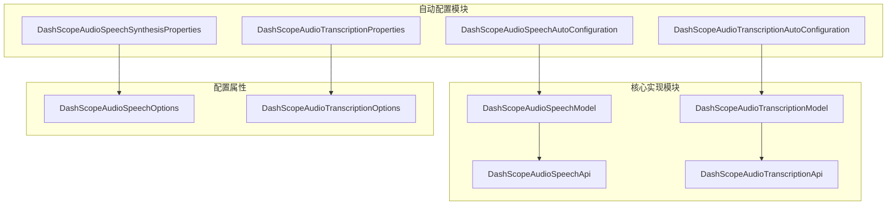
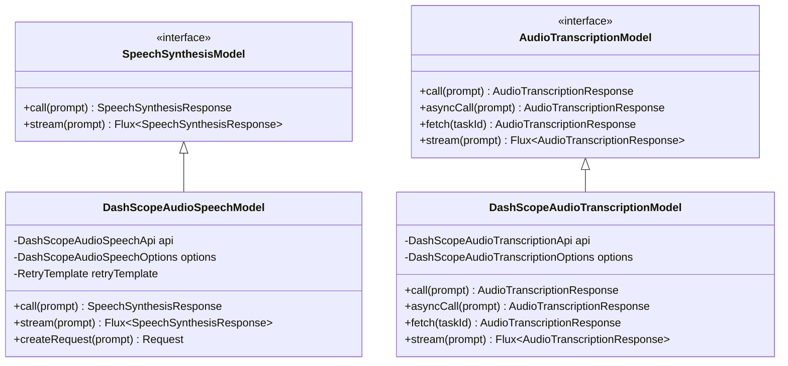
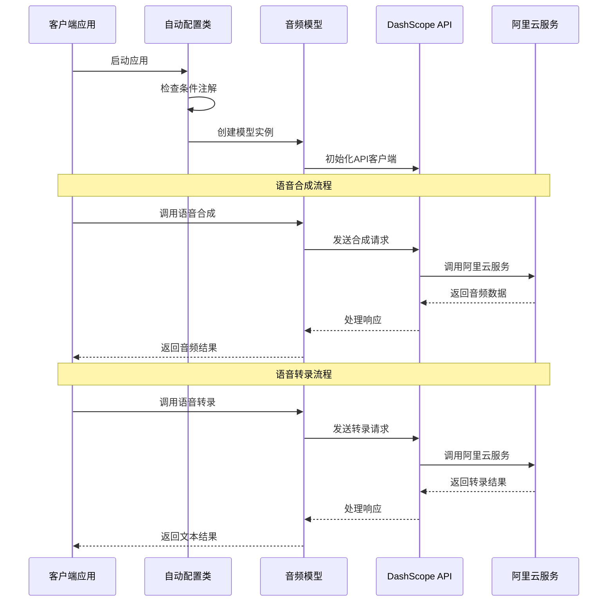
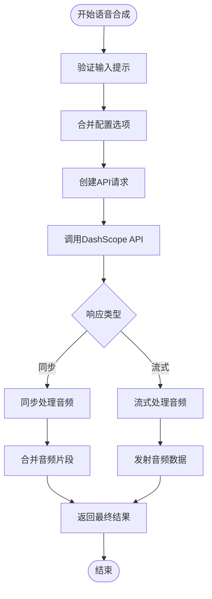
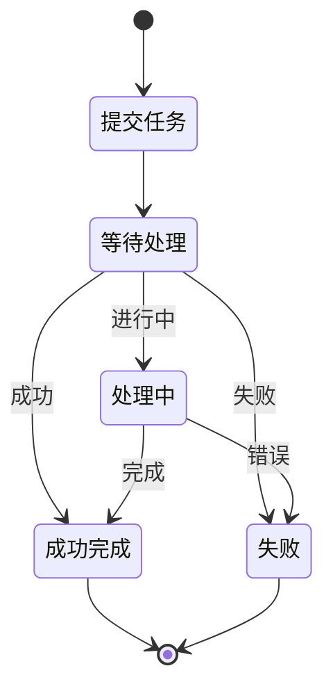
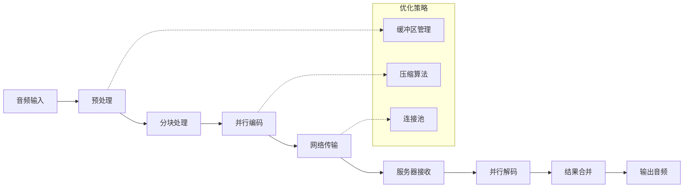

# DashScope语音功能详细文档

<cite>
**本文档引用的文件**
- [DashScopeAudioSpeechAutoConfiguration.java](file://auto-configurations/spring-ai-alibaba-autoconfigure-dashscope/src/main/java/com/alibaba/cloud/ai/autoconfigure/dashscope/DashScopeAudioSpeechAutoConfiguration.java)
- [DashScopeAudioTranscriptionAutoConfiguration.java](file://auto-configurations/spring-ai-alibaba-autoconfigure-dashscope/src/main/java/com/alibaba/cloud/ai/autoconfigure/dashscope/DashScopeAudioTranscriptionAutoConfiguration.java)
- [DashScopeAudioSpeechSynthesisProperties.java](file://auto-configurations/spring-ai-alibaba-autoconfigure-dashscope/src/main/java/com/alibaba/cloud/ai/autoconfigure/dashscope/DashScopeAudioSpeechSynthesisProperties.java)
- [DashScopeAudioTranscriptionProperties.java](file://auto-configurations/spring-ai-alibaba-autoconfigure-dashscope/src/main/java/com/alibaba/cloud/ai/autoconfigure/dashscope/DashScopeAudioTranscriptionProperties.java)
- [DashScopeAudioSpeechModel.java](file://spring-ai-alibaba-core/src/main/java/com/alibaba/cloud/ai/dashscope/audio/DashScopeAudioSpeechModel.java)
- [DashScopeAudioTranscriptionModel.java](file://spring-ai-alibaba-core/src/main/java/com/alibaba/cloud/ai/dashscope/audio/DashScopeAudioTranscriptionModel.java)
- [DashScopeAudioSpeechOptions.java](file://spring-ai-alibaba-core/src/main/java/com/alibaba/cloud/ai/dashscope/audio/DashScopeAudioSpeechOptions.java)
- [DashScopeAudioTranscriptionOptions.java](file://spring-ai-alibaba-core/src/main/java/com/alibaba/cloud/ai/dashscope/audio/DashScopeAudioTranscriptionOptions.java)
- [SpeechSynthesisModel.java](file://spring-ai-alibaba-core/src/main/java/com/alibaba/cloud/ai/dashscope/audio/synthesis/SpeechSynthesisModel.java)
- [DashScopeAutoConfigurationIT.java](file://auto-configurations/spring-ai-alibaba-autoconfigure-dashscope/src/test/java/com/alibaba/cloud/ai/autoconfigure/dashscope/DashScopeAutoConfigurationIT.java)
</cite>

## 目录
1. [简介](#简介)
2. [项目结构](#项目结构)
3. [核心组件](#核心组件)
4. [架构概览](#架构概览)
5. [详细组件分析](#详细组件分析)
6. [配置属性详解](#配置属性详解)
7. [使用示例](#使用示例)
8. [性能考虑](#性能考虑)
9. [故障排除指南](#故障排除指南)
10. [结论](#结论)

## 简介

DashScope语音功能是Spring AI Alibaba项目中的一个重要模块，提供了完整的语音合成（Text-to-Speech）和语音转录（Speech-to-Text）能力。该模块基于阿里云DashScope平台，为开发者提供了简单易用的API来实现高质量的语音处理功能。

语音功能模块包含两个主要子功能：
- **语音合成（Audio Speech Synthesis）**：将文本转换为自然流畅的语音输出
- **语音转录（Audio Transcription）**：将音频文件转换为文本内容

## 项目结构



**图表来源**
- [DashScopeAudioSpeechAutoConfiguration.java](file://auto-configurations/spring-ai-alibaba-autoconfigure-dashscope/src/main/java/com/alibaba/cloud/ai/autoconfigure/dashscope/DashScopeAudioSpeechAutoConfiguration.java#L1-L73)
- [DashScopeAudioTranscriptionAutoConfiguration.java](file://auto-configurations/spring-ai-alibaba-autoconfigure-dashscope/src/main/java/com/alibaba/cloud/ai/autoconfigure/dashscope/DashScopeAudioTranscriptionAutoConfiguration.java#L1-L89)

## 核心组件

### 自动配置类

系统提供了两个主要的自动配置类来管理语音功能的初始化：

1. **DashScopeAudioSpeechAutoConfiguration**：负责语音合成功能的自动配置
2. **DashScopeAudioTranscriptionAutoConfiguration**：负责语音转录功能的自动配置

这两个配置类都依赖于Spring Boot的条件注解，确保只有在满足特定条件时才会加载相应的组件。

### 模型接口



**图表来源**
- [DashScopeAudioSpeechModel.java](file://spring-ai-alibaba-core/src/main/java/com/alibaba/cloud/ai/dashscope/audio/DashScopeAudioSpeechModel.java#L32-L113)
- [DashScopeAudioTranscriptionModel.java](file://spring-ai-alibaba-core/src/main/java/com/alibaba/cloud/ai/dashscope/audio/DashScopeAudioTranscriptionModel.java#L40-L272)

**章节来源**
- [DashScopeAudioSpeechAutoConfiguration.java](file://auto-configurations/spring-ai-alibaba-autoconfigure-dashscope/src/main/java/com/alibaba/cloud/ai/autoconfigure/dashscope/DashScopeAudioSpeechAutoConfiguration.java#L1-L73)
- [DashScopeAudioTranscriptionAutoConfiguration.java](file://auto-configurations/spring-ai-alibaba-autoconfigure-dashscope/src/main/java/com/alibaba/cloud/ai/autoconfigure/dashscope/DashScopeAudioTranscriptionAutoConfiguration.java#L1-L89)

## 架构概览



**图表来源**
- [DashScopeAudioSpeechAutoConfiguration.java](file://auto-configurations/spring-ai-alibaba-autoconfigure-dashscope/src/main/java/com/alibaba/cloud/ai/autoconfigure/dashscope/DashScopeAudioSpeechAutoConfiguration.java#L45-L73)
- [DashScopeAudioTranscriptionAutoConfiguration.java](file://auto-configurations/spring-ai-alibaba-autoconfigure-dashscope/src/main/java/com/alibaba/cloud/ai/autoconfigure/dashscope/DashScopeAudioTranscriptionAutoConfiguration.java#L50-L89)

## 详细组件分析

### 语音合成组件分析

#### DashScopeAudioSpeechAutoConfiguration

这个自动配置类负责语音合成功能的初始化，它包含了以下关键特性：

```java
@AutoConfiguration(after = { RestClientAutoConfiguration.class, WebClientAutoConfiguration.class,
        SpringAiRetryAutoConfiguration.class })
@ConditionalOnClass(DashScopeAudioSpeechApi.class)
@ConditionalOnDashScopeEnabled
@ConditionalOnProperty(name = SpringAIModelProperties.AUDIO_SPEECH_MODEL, havingValue = SpringAIAlibabaModels.DASHSCOPE,
        matchIfMissing = true)
@EnableConfigurationProperties({ DashScopeConnectionProperties.class, DashScopeAudioSpeechSynthesisProperties.class })
```

该配置类确保只有在满足以下条件时才会生效：
- 存在DashScopeAudioSpeechApi类
- DashScope功能已启用
- 配置指定了使用DashScope作为语音合成模型

#### DashScopeAudioSpeechModel实现

语音合成模型实现了异步流式处理和同步调用两种模式：



**图表来源**
- [DashScopeAudioSpeechModel.java](file://spring-ai-alibaba-core/src/main/java/com/alibaba/cloud/ai/dashscope/audio/DashScopeAudioSpeechModel.java#L50-L113)

### 语音转录组件分析

#### DashScopeAudioTranscriptionAutoConfiguration

语音转录功能同样采用自动配置模式，支持同步和异步两种处理方式：

```java
@Bean
@ConditionalOnMissingBean
public DashScopeAudioTranscriptionModel dashScopeAudioTranscriptionModel(
        DashScopeConnectionProperties commonProperties,
        DashScopeAudioTranscriptionProperties audioTranscriptionProperties,
        ObjectProvider<RestClient.Builder> restClientBuilderProvider, 
        ResponseErrorHandler responseErrorHandler
) {
    // 配置和初始化逻辑
}
```

#### DashScopeAudioTranscriptionModel实现

语音转录模型支持多种处理模式：

1. **同步处理**：直接获取转录结果
2. **异步处理**：提交任务后轮询状态
3. **实时流式处理**：通过WebSocket进行实时转录



**图表来源**
- [DashScopeAudioTranscriptionModel.java](file://spring-ai-alibaba-core/src/main/java/com/alibaba/cloud/ai/dashscope/audio/DashScopeAudioTranscriptionModel.java#L80-L120)

**章节来源**
- [DashScopeAudioSpeechModel.java](file://spring-ai-alibaba-core/src/main/java/com/alibaba/cloud/ai/dashscope/audio/DashScopeAudioSpeechModel.java#L1-L113)
- [DashScopeAudioTranscriptionModel.java](file://spring-ai-alibaba-core/src/main/java/com/alibaba/cloud/ai/dashscope/audio/DashScopeAudioTranscriptionModel.java#L1-L272)

## 配置属性详解

### 语音合成配置

语音合成功能提供了丰富的配置选项，允许用户精确控制生成的语音质量：

```java
@ConfigurationProperties(DashScopeAudioSpeechSynthesisProperties.CONFIG_PREFIX)
public class DashScopeAudioSpeechSynthesisProperties extends DashScopeParentProperties {
    
    public static final String CONFIG_PREFIX = "spring.ai.dashscope.audio.synthesis";
    
    private final String DEFAULT_MODEL = DashScopeAudioSpeechApi.TTSModel.SAM_BERT_ZHICHU_V1.getValue();
    private static final Float SPEED = 1.0f;
    private static final String DEFAULT_VOICE = "longhua";
    private final DashScopeAudioSpeechApi.ResponseFormat DEFAULT_RESPONSE_FORMAT = DashScopeAudioSpeechApi.ResponseFormat.MP3;
}
```

#### 主要配置属性

| 属性名 | 类型 | 默认值 | 描述 |
|--------|------|--------|------|
| `model` | String | SAM_BERT_ZHICHU_V1 | 使用的语音合成模型 |
| `voice` | String | longhua | 语音声音类型 |
| `speed` | Float | 1.0 | 语速调节（0.5-2.0） |
| `volume` | Integer | 50 | 音量调节（0-100） |
| `pitch` | Double | 1.0 | 音高调节（0.5-2.0） |
| `sampleRate` | Integer | 48000 | 采样率 |
| `responseFormat` | ResponseFormat | MP3 | 输出格式 |

### 语音转录配置

语音转录功能支持多种音频格式和语言识别选项：

```java
@ConfigurationProperties(DashScopeAudioTranscriptionProperties.CONFIG_PREFIX)
public class DashScopeAudioTranscriptionProperties extends DashScopeParentProperties {
    
    public static final String CONFIG_PREFIX = "spring.ai.dashscope.audio.transcription";
    
    @NestedConfigurationProperty
    private DashScopeAudioTranscriptionOptions options = DashScopeAudioTranscriptionOptions.builder().build();
}
```

#### 支持的音频格式

语音转录支持以下音频格式：

- **PCM**：原始音频数据
- **WAV**：Wave格式音频
- **MP3**：压缩音频格式
- **OPUS**：高效音频编码
- **SPEEX**：语音专用编码
- **AAC**：高级音频编码
- **AMR**：自适应多速率编码

#### 语言识别配置

| 属性名 | 类型 | 默认值 | 描述 |
|--------|------|--------|------|
| `model` | String | paraformer-v2 | 使用的转录模型 |
| `languageHints` | List<String> | ["zh", "en"] | 语言提示列表 |
| `channelId` | List<Integer> | [0] | 声道ID列表 |
| `sampleRate` | Integer | null | 采样率 |
| `format` | AudioFormat | null | 输入音频格式 |
| `disfluencyRemovalEnabled` | Boolean | false | 是否启用流畅度移除 |

**章节来源**
- [DashScopeAudioSpeechSynthesisProperties.java](file://auto-configurations/spring-ai-alibaba-autoconfigure-dashscope/src/main/java/com/alibaba/cloud/ai/autoconfigure/dashscope/DashScopeAudioSpeechSynthesisProperties.java#L1-L67)
- [DashScopeAudioTranscriptionProperties.java](file://auto-configurations/spring-ai-alibaba-autoconfigure-dashscope/src/main/java/com/alibaba/cloud/ai/autoconfigure/dashscope/DashScopeAudioTranscriptionProperties.java#L1-L54)

## 使用示例

### 语音合成示例

以下是一个完整的语音合成使用示例：

```java
// 配置application.properties
spring.ai.dashscope.api-key=your-api-key
spring.ai.dashscope.base-url=https://dashscope.aliyuncs.com
spring.ai.dashscope.audio.synthesis.options.model=sam-bert-zhichu-v1
spring.ai.dashscope.audio.synthesis.options.voice=longhua
spring.ai.dashscope.audio.synthesis.options.speed=1.2
spring.ai.dashscope.audio.synthesis.options.response-format=mp3

// Java代码示例
@Autowired
private DashScopeAudioSpeechModel speechModel;

public void synthesizeSpeech() {
    // 创建语音合成提示
    SpeechSynthesisPrompt prompt = new SpeechSynthesisPrompt(
        "欢迎使用DashScope语音合成功能",
        DashScopeAudioSpeechOptions.builder()
            .voice("longhua")
            .speed(1.2f)
            .responseFormat(DashScopeAudioSpeechApi.ResponseFormat.MP3)
            .build()
    );
    
    // 同步调用
    SpeechSynthesisResponse response = speechModel.call(prompt);
    ByteBuffer audioData = response.getResult().getOutput().getAudio();
    
    // 流式调用
    Flux<SpeechSynthesisResponse> stream = speechModel.stream(prompt);
    stream.subscribe(audioResponse -> {
        ByteBuffer chunk = audioResponse.getResult().getOutput().getAudio();
        // 处理音频片段
    });
}
```

### 语音转录示例

以下是语音转录功能的使用示例：

```java
// 配置application.properties
spring.ai.dashscope.api-key=your-api-key
spring.ai.dashscope.base-url=https://dashscope.aliyuncs.com
spring.ai.dashscope.audio.transcription.options.model=paraformer-v2
spring.ai.dashscope.audio.transcription.options.language-hints=zh,en
spring.ai.dashscope.audio.transcription.options.format=mp3

// Java代码示例
@Autowired
private DashScopeAudioTranscriptionModel transcriptionModel;

public void transcribeAudio() {
    // 创建音频资源
    Resource audioFile = new ClassPathResource("speech/sample.mp3");
    
    // 创建转录提示
    AudioTranscriptionPrompt prompt = new AudioTranscriptionPrompt(audioFile);
    
    // 同步调用
    AudioTranscriptionResponse response = transcriptionModel.call(prompt);
    String transcript = response.getResult().getOutput();
    
    // 异步调用
    AudioTranscriptionResponse asyncResponse = transcriptionModel.asyncCall(prompt);
    String taskId = asyncResponse.getMetadata().getTaskId();
    
    // 轮询获取结果
    AudioTranscriptionResponse finalResponse = transcriptionModel.fetch(taskId);
    
    // 实时流式处理
    Flux<AudioTranscriptionResponse> stream = transcriptionModel.stream(prompt);
    stream.subscribe(transcriptionResponse -> {
        String partialText = transcriptionResponse.getResult().getOutput();
        // 处理实时转录结果
    });
}
```

### 高级配置示例

```java
// 通过Java代码动态配置
@Bean
public DashScopeAudioSpeechModel customSpeechModel() {
    // 创建自定义选项
    DashScopeAudioSpeechOptions options = DashScopeAudioSpeechOptions.builder()
        .model("custom-tts-model")
        .voice("custom-voice")
        .speed(1.0f)
        .volume(75)
        .pitch(1.1)
        .sampleRate(22050)
        .responseFormat(DashScopeAudioSpeechApi.ResponseFormat.WAV)
        .enableWordTimestamp(true)
        .enablePhonemeTimestamp(false)
        .build();
    
    // 创建API客户端
    DashScopeAudioSpeechApi api = new DashScopeAudioSpeechApi("your-api-key");
    
    // 创建模型实例
    return new DashScopeAudioSpeechModel(api, options);
}

// 通过编程方式配置转录选项
@Bean
public DashScopeAudioTranscriptionModel customTranscriptionModel() {
    DashScopeAudioTranscriptionOptions options = DashScopeAudioTranscriptionOptions.builder()
        .model("paraformer-realtime-8k-v2")
        .sampleRate(16000)
        .format(DashScopeAudioTranscriptionOptions.AudioFormat.MP3)
        .channelId(Arrays.asList(0, 1))
        .disfluencyRemovalEnabled(true)
        .languageHints(Arrays.asList("zh", "en", "ja"))
        .build();
    
    DashScopeAudioTranscriptionApi api = DashScopeAudioTranscriptionApi.builder()
        .apiKey(new SimpleApiKey("your-api-key"))
        .baseUrl("https://dashscope.aliyuncs.com")
        .model("paraformer-v2")
        .build();
    
    return new DashScopeAudioTranscriptionModel(api, options);
}
```

**章节来源**
- [DashScopeAutoConfigurationIT.java](file://auto-configurations/spring-ai-alibaba-autoconfigure-dashscope/src/test/java/com/alibaba/cloud/ai/autoconfigure/dashscope/DashScopeAutoConfigurationIT.java#L70-L100)

## 性能考虑

### 音频编解码性能

语音功能在处理大量音频数据时需要考虑以下性能因素：

1. **音频格式选择**：不同格式的编解码效率差异很大
   - MP3：压缩率高，适合网络传输
   - WAV：无损格式，处理速度快但文件大
   - PCM：原始数据，处理最快但占用空间最大

2. **采样率优化**：根据应用场景选择合适的采样率
   - 8kHz：电话质量，适合语音通话
   - 16kHz：广播质量，平衡音质和性能
   - 48kHz：CD质量，适合高质量音频

3. **并发处理**：支持多个音频流并行处理

### 带宽和延迟优化



### 内存管理

语音处理过程中需要注意内存使用：

1. **流式处理**：避免将整个音频文件加载到内存
2. **缓冲区大小**：合理设置音频缓冲区大小
3. **垃圾回收**：及时释放不再使用的音频数据

## 故障排除指南

### 常见问题及解决方案

#### 1. API密钥认证失败

**问题症状**：收到401未授权错误

**解决方案**：
```yaml
# 检查API密钥配置
spring.ai.dashscope.api-key=your-valid-api-key
# 或者使用环境变量
SPRING_AI_DASHSCOPE_API_KEY=your-valid-api-key
```

#### 2. 音频格式不支持

**问题症状**：转录请求失败或返回空结果

**解决方案**：
```yaml
# 确保使用支持的音频格式
spring.ai.dashscope.audio.transcription.options.format=mp3
# 或者在代码中指定
.options(format, DashScopeAudioTranscriptionOptions.AudioFormat.MP3)
```

#### 3. 语音合成超时

**问题症状**：语音合成请求超时

**解决方案**：
```yaml
# 增加超时时间配置
spring.ai.dashscope.connection.timeout=30s
# 或者调整重试策略
spring.ai.retry.max-attempts=3
spring.ai.retry.backoff-interval=1s
```

#### 4. 音频质量不佳

**问题症状**：生成的语音质量差或有噪音

**解决方案**：
```yaml
# 调整音频参数
spring.ai.dashscope.audio.synthesis.options.sample-rate=22050
spring.ai.dashscope.audio.synthesis.options.volume=80
spring.ai.dashscope.audio.synthesis.options.pitch=1.0
```

### 调试和监控

```java
// 启用调试日志
logging.level.com.alibaba.cloud.ai.dashscope=DEBUG

// 监控API调用统计
@Component
public class AudioProcessingMetrics {
    
    @EventListener
    public void handleAudioProcessingEvent(AudioProcessingEvent event) {
        // 记录处理时间、成功率等指标
    }
}
```

**章节来源**
- [DashScopeAudioSpeechModel.java](file://spring-ai-alibaba-core/src/main/java/com/alibaba/cloud/ai/dashscope/audio/DashScopeAudioSpeechModel.java#L50-L70)
- [DashScopeAudioTranscriptionModel.java](file://spring-ai-alibaba-core/src/main/java/com/alibaba/cloud/ai/dashscope/audio/DashScopeAudioTranscriptionModel.java#L80-L120)

## 结论

DashScope语音功能为Spring AI Alibaba项目提供了强大而灵活的语音处理能力。通过自动配置机制，开发者可以轻松集成语音合成和语音转录功能，而无需深入了解底层API细节。

### 主要优势

1. **开箱即用**：通过Spring Boot自动配置简化集成过程
2. **高度可配置**：丰富的配置选项满足不同业务需求
3. **性能优化**：支持流式处理和异步操作提升性能
4. **错误处理**：完善的异常处理和重试机制
5. **扩展性强**：清晰的接口设计便于功能扩展

### 最佳实践建议

1. **合理选择音频格式**：根据应用场景选择最适合的音频格式
2. **优化配置参数**：根据目标质量和性能要求调整相关参数
3. **实施监控**：建立完善的监控和告警机制
4. **缓存策略**：对重复的语音合成请求实施缓存
5. **错误恢复**：设计合理的错误恢复和重试策略

通过遵循这些最佳实践，开发者可以充分发挥DashScope语音功能的优势，构建高质量的语音应用系统。