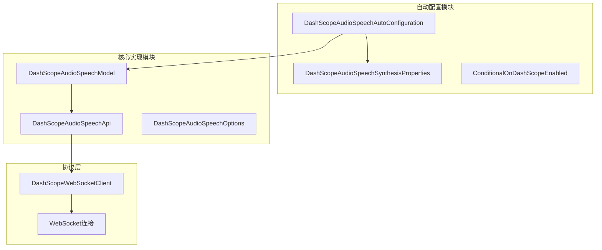
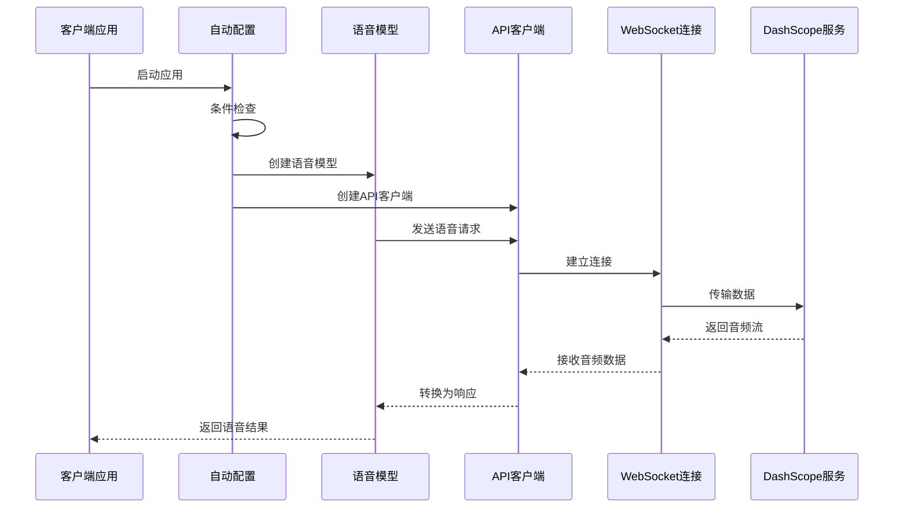
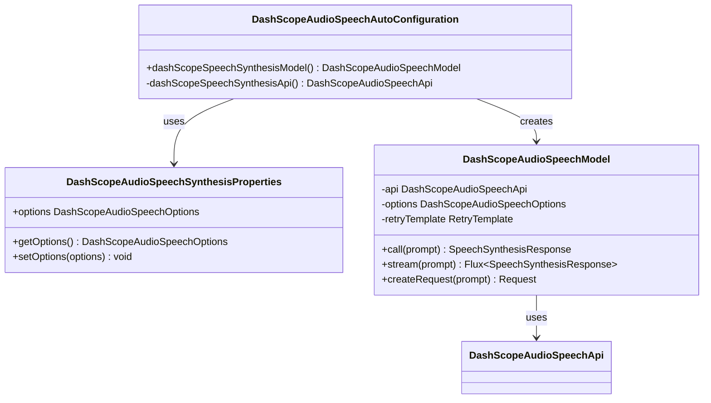
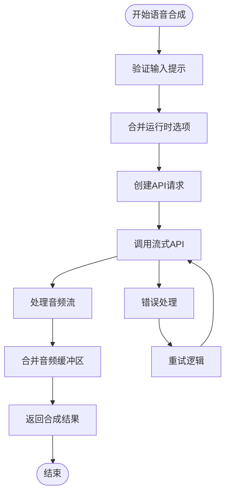
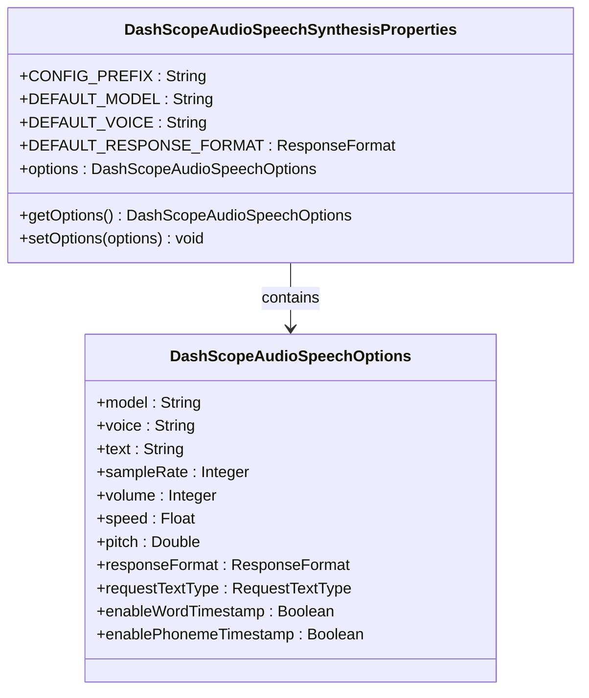

# DashScope语音合成功能详细文档

<cite>
**本文档引用的文件**
- [DashScopeAudioSpeechAutoConfiguration.java](file://auto-configurations/spring-ai-alibaba-autoconfigure-dashscope/src/main/java/com/alibaba/cloud/ai/autoconfigure/dashscope/DashScopeAudioSpeechAutoConfiguration.java)
- [DashScopeAudioSpeechSynthesisProperties.java](file://auto-configurations/spring-ai-alibaba-autoconfigure-dashscope/src/main/java/com/alibaba/cloud/ai/autoconfigure/dashscope/DashScopeAudioSpeechSynthesisProperties.java)
- [DashScopeAudioSpeechOptions.java](file://spring-ai-alibaba-core/src/main/java/com/alibaba/cloud/ai/dashscope/audio/DashScopeAudioSpeechOptions.java)
- [DashScopeAudioSpeechModel.java](file://spring-ai-alibaba-core/src/main/java/com/alibaba/cloud/ai/dashscope/audio/DashScopeAudioSpeechModel.java)
- [DashScopeAudioSpeechApi.java](file://spring-ai-alibaba-core/src/main/java/com/alibaba/cloud/ai/dashscope/api/DashScopeAudioSpeechApi.java)
- [DashScopePropertiesTests.java](file://auto-configurations/spring-ai-alibaba-autoconfigure-dashscope/src/test/java/com/alibaba/cloud/ai/autoconfigure/dashscope/DashScopePropertiesTests.java)
</cite>

## 目录
1. [简介](#简介)
2. [项目结构](#项目结构)
3. [核心组件](#核心组件)
4. [架构概览](#架构概览)
5. [详细组件分析](#详细组件分析)
6. [配置参数详解](#配置参数详解)
7. [使用示例](#使用示例)
8. [性能优化](#性能优化)
9. [故障排除指南](#故障排除指南)
10. [结论](#结论)

## 简介

DashScope语音合成功能是Spring AI Alibaba项目中的一个重要模块，提供了基于阿里云DashScope服务的文本到语音转换能力。该功能支持多种语音模型、音频格式和参数配置，能够满足不同场景下的语音合成需求。

主要特性包括：
- 支持多种语音模型（SAM-BERT系列）
- 多种音频输出格式（MP3、WAV、PCM）
- 可配置的语音参数（音量、语速、音调等）
- 流式音频传输
- 自动重试机制
- Spring Boot自动配置

## 项目结构



**图表来源**
- [DashScopeAudioSpeechAutoConfiguration.java](file://auto-configurations/spring-ai-alibaba-autoconfigure-dashscope/src/main/java/com/alibaba/cloud/ai/autoconfigure/dashscope/DashScopeAudioSpeechAutoConfiguration.java#L1-L73)
- [DashScopeAudioSpeechModel.java](file://spring-ai-alibaba-core/src/main/java/com/alibaba/cloud/ai/dashscope/audio/DashScopeAudioSpeechModel.java#L1-L113)

## 核心组件

### 1. 自动配置类 (DashScopeAudioSpeechAutoConfiguration)

这是整个语音合成功能的核心入口点，负责根据条件装配和注册相关Bean。

### 2. 配置属性类 (DashScopeAudioSpeechSynthesisProperties)

管理所有可配置的语音合成参数，支持Spring Boot的配置绑定机制。

### 3. 模型类 (DashScopeAudioSpeechModel)

实现了Spring AI的SpeechSynthesisModel接口，提供文本到语音的转换功能。

### 4. API客户端 (DashScopeAudioSpeechApi)

封装了与DashScope服务的通信逻辑，支持WebSocket流式传输。

**章节来源**
- [DashScopeAudioSpeechAutoConfiguration.java](file://auto-configurations/spring-ai-alibaba-autoconfigure-dashscope/src/main/java/com/alibaba/cloud/ai/autoconfigure/dashscope/DashScopeAudioSpeechAutoConfiguration.java#L1-L73)
- [DashScopeAudioSpeechSynthesisProperties.java](file://auto-configurations/spring-ai-alibaba-autoconfigure-dashscope/src/main/java/com/alibaba/cloud/ai/autoconfigure/dashscope/DashScopeAudioSpeechSynthesisProperties.java#L1-L67)

## 架构概览



**图表来源**
- [DashScopeAudioSpeechAutoConfiguration.java](file://auto-configurations/spring-ai-alibaba-autoconfigure-dashscope/src/main/java/com/alibaba/cloud/ai/autoconfigure/dashscope/DashScopeAudioSpeechAutoConfiguration.java#L45-L65)
- [DashScopeAudioSpeechModel.java](file://spring-ai-alibaba-core/src/main/java/com/alibaba/cloud/ai/dashscope/audio/DashScopeAudioSpeechModel.java#L74-L91)

## 详细组件分析

### DashScopeAudioSpeechAutoConfiguration 分析

这个自动配置类是整个语音合成功能的核心，它实现了条件化装配和Bean注册过程。



**图表来源**
- [DashScopeAudioSpeechAutoConfiguration.java](file://auto-configurations/spring-ai-alibaba-autoconfigure-dashscope/src/main/java/com/alibaba/cloud/ai/autoconfigure/dashscope/DashScopeAudioSpeechAutoConfiguration.java#L45-L65)
- [DashScopeAudioSpeechModel.java](file://spring-ai-alibaba-core/src/main/java/com/alibaba/cloud/ai/dashscope/audio/DashScopeAudioSpeechModel.java#L32-L72)

#### 条件装配机制

自动配置类使用了多个条件注解来确保只有在适当条件下才进行装配：

- `@ConditionalOnClass(DashScopeAudioSpeechApi.class)`：确保依赖的类存在
- `@ConditionalOnDashScopeEnabled`：自定义条件注解，检查DashScope是否启用
- `@ConditionalOnProperty`：检查特定配置属性

#### Bean注册过程

1. **API客户端创建**：通过`dashScopeSpeechSynthesisApi`方法创建DashScopeAudioSpeechApi实例
2. **模型创建**：使用API客户端、配置选项和重试模板创建DashScopeAudioSpeechModel
3. **条件检查**：确保没有其他相同类型的Bean存在

**章节来源**
- [DashScopeAudioSpeechAutoConfiguration.java](file://auto-configurations/spring-ai-alibaba-autoconfigure-dashscope/src/main/java/com/alibaba/cloud/ai/autoconfigure/dashscope/DashScopeAudioSpeechAutoConfiguration.java#L35-L73)

### DashScopeAudioSpeechModel 分析

这个类是语音合成功能的主要实现，它实现了Spring AI的SpeechSynthesisModel接口。



**图表来源**
- [DashScopeAudioSpeechModel.java](file://spring-ai-alibaba-core/src/main/java/com/alibaba/cloud/ai/dashscope/audio/DashScopeAudioSpeechModel.java#L55-L91)

#### 主要方法分析

1. **call方法**：同步语音合成，将流式响应合并为单个结果
2. **stream方法**：异步流式语音合成，支持实时音频传输
3. **createRequest方法**：构建API请求对象，处理选项合并

#### 错误处理机制

- 使用Spring Retry Template实现自动重试
- 支持指数退避策略
- 提供详细的错误信息

**章节来源**
- [DashScopeAudioSpeechModel.java](file://spring-ai-alibaba-core/src/main/java/com/alibaba/cloud/ai/dashscope/audio/DashScopeAudioSpeechModel.java#L55-L112)

## 配置参数详解

### DashScopeAudioSpeechSynthesisProperties

这个类继承自DashScopeParentProperties，专门用于配置语音合成相关的参数。

#### 核心配置属性



**图表来源**
- [DashScopeAudioSpeechSynthesisProperties.java](file://auto-configurations/spring-ai-alibaba-autoconfigure-dashscope/src/main/java/com/alibaba/cloud/ai/autoconfigure/dashscope/DashScopeAudioSpeechSynthesisProperties.java#L37-L65)
- [DashScopeAudioSpeechOptions.java](file://spring-ai-alibaba-core/src/main/java/com/alibaba/cloud/ai/dashscope/audio/DashScopeAudioSpeechOptions.java#L30-L110)

#### 关键配置参数说明

1. **model**：语音合成模型，默认为"sambert-zhichu-v1"
2. **voice**：语音类型，默认为"longhua"
3. **sampleRate**：采样率，默认48000Hz
4. **volume**：音量级别，默认50（范围0-100）
5. **speed**：语速，默认1.0倍速
6. **pitch**：音调，默认1.0
7. **responseFormat**：输出格式，默认MP3
8. **requestTextType**：输入文本类型，默认纯文本
9. **enableWordTimestamp**：是否启用词级时间戳
10. **enablePhonemeTimestamp**：是否启用音素级时间戳

#### 默认值配置

```java
// 默认配置
private final String DEFAULT_MODEL = DashScopeAudioSpeechApi.TTSModel.SAM_BERT_ZHICHU_V1.getValue();
private static final Float SPEED = 1.0f;
private static final String DEFAULT_VOICE = "longhua";
private final DashScopeAudioSpeechApi.ResponseFormat DEFAULT_RESPONSE_FORMAT = DashScopeAudioSpeechApi.ResponseFormat.MP3;
```

**章节来源**
- [DashScopeAudioSpeechSynthesisProperties.java](file://auto-configurations/spring-ai-alibaba-autoconfigure-dashscope/src/main/java/com/alibaba/cloud/ai/autoconfigure/dashscope/DashScopeAudioSpeechSynthesisProperties.java#L37-L65)
- [DashScopeAudioSpeechOptions.java](file://spring-ai-alibaba-core/src/main/java/com/alibaba/cloud/ai/dashscope/audio/DashScopeAudioSpeechOptions.java#L47-L110)

## 使用示例

### 基本使用示例

```java
// Spring Boot应用中的基本配置
@SpringBootApplication
@EnableDashScope
public class AudioSpeechApplication {
    
    public static void main(String[] args) {
        SpringApplication.run(AudioSpeechApplication.class, args);
    }
    
    @Bean
    public CommandLineRunner commandLineRunner(DashScopeAudioSpeechModel speechModel) {
        return args -> {
            // 创建语音合成提示
            SpeechSynthesisPrompt prompt = new SpeechSynthesisPrompt(
                List.of(new TextMessage("你好，欢迎使用阿里云语音合成服务")),
                new DashScopeAudioSpeechOptions.Builder()
                    .voice("longhua")
                    .speed(1.2f)
                    .volume(80)
                    .responseFormat(DashScopeAudioSpeechApi.ResponseFormat.WAV)
                    .build()
            );
            
            // 执行语音合成
            SpeechSynthesisResponse response = speechModel.call(prompt);
            
            // 获取音频数据
            ByteBuffer audioData = response.getResult().getOutput().getAudio();
            
            // 保存音频文件
            Path outputPath = Paths.get("output.wav");
            Files.write(outputPath, audioData.array());
        };
    }
}
```

### 配置文件示例

```yaml
spring:
  ai:
    dashscope:
      api-key: ${DASHSCOPE_API_KEY}
      base-url: https://dashscope.aliyuncs.com
      audio:
        synthesis:
          options:
            model: sambert-zhichu-v1
            voice: longhua
            speed: 1.0
            volume: 50
            response-format: mp3
            sample-rate: 48000
            pitch: 1.0
            enable-word-timestamp: false
            enable-phoneme-timestamp: false
```

### 流式传输示例

```java
@Service
public class StreamingSpeechService {
    
    private final DashScopeAudioSpeechModel speechModel;
    
    public StreamingSpeechService(DashScopeAudioSpeechModel speechModel) {
        this.speechModel = speechModel;
    }
    
    public void processStreamingSpeech(String text) {
        SpeechSynthesisPrompt prompt = new SpeechSynthesisPrompt(
            List.of(new TextMessage(text))
        );
        
        // 流式处理
        speechModel.stream(prompt)
            .doOnNext(response -> {
                ByteBuffer audioChunk = response.getResult().getOutput().getAudio();
                // 处理音频块
                processAudioChunk(audioChunk);
            })
            .doOnError(error -> {
                // 错误处理
                log.error("语音合成流式传输失败", error);
            })
            .subscribe();
    }
    
    private void processAudioChunk(ByteBuffer chunk) {
        // 实现音频块处理逻辑
        // 例如：播放音频、保存到文件等
    }
}
```

### 高级配置示例

```java
@Configuration
public class DashScopeAudioSpeechConfig {
    
    @Bean
    @Primary
    public DashScopeAudioSpeechModel customSpeechModel(
            RetryTemplate retryTemplate,
            DashScopeConnectionProperties connectionProps,
            DashScopeAudioSpeechSynthesisProperties speechProps) {
        
        // 自定义配置
        DashScopeAudioSpeechOptions customOptions = DashScopeAudioSpeechOptions.builder()
            .model("sambert-zhichu-v1")
            .voice("longhua")
            .speed(1.1f)
            .volume(60)
            .sampleRate(22050)
            .responseFormat(DashScopeAudioSpeechApi.ResponseFormat.PCM)
            .enableWordTimestamp(true)
            .enablePhonemeTimestamp(false)
            .build();
        
        speechProps.setOptions(customOptions);
        
        var api = new DashScopeAudioSpeechApi(
            connectionProps.getApiKey(),
            connectionProps.getWorkspaceId()
        );
        
        return new DashScopeAudioSpeechModel(api, customOptions, retryTemplate);
    }
}
```

**章节来源**
- [DashScopePropertiesTests.java](file://auto-configurations/spring-ai-alibaba-autoconfigure-dashscope/src/test/java/com/alibaba/cloud/ai/autoconfigure/dashscope/DashScopePropertiesTests.java#L120-L150)

## 性能优化

### 1. 预加载常用语音片段

```java
@Component
public class SpeechCacheManager {
    
    private final Map<String, ByteBuffer> cache = new ConcurrentHashMap<>();
    private final DashScopeAudioSpeechModel speechModel;
    
    public SpeechCacheManager(DashScopeAudioSpeechModel speechModel) {
        this.speechModel = speechModel;
    }
    
    public ByteBuffer getCachedSpeech(String text) {
        return cache.computeIfAbsent(text, this::generateSpeech);
    }
    
    private ByteBuffer generateSpeech(String text) {
        SpeechSynthesisPrompt prompt = new SpeechSynthesisPrompt(
            List.of(new TextMessage(text))
        );
        
        SpeechSynthesisResponse response = speechModel.call(prompt);
        return response.getResult().getOutput().getAudio();
    }
}
```

### 2. 带宽管理

```java
@Service
public class BandwidthManager {
    
    private final RateLimiter rateLimiter = RateLimiter.create(10); // 每秒10个请求
    
    public void processSpeechRequest(SpeechSynthesisPrompt prompt) {
        // 等待许可
        rateLimiter.acquire();
        
        // 处理请求
        processRequest(prompt);
    }
    
    private void processRequest(SpeechSynthesisPrompt prompt) {
        // 实现具体的语音合成逻辑
    }
}
```

### 3. 缓存策略

```java
@Configuration
public class CacheConfig {
    
    @Bean
    public CacheManager cacheManager() {
        SimpleCacheManager cacheManager = new SimpleCacheManager();
        cacheManager.setCaches(List.of(
            new ConcurrentMapCache("speech-cache")
        ));
        return cacheManager;
    }
    
    @Bean
    public CacheInterceptor cacheInterceptor(CacheManager cacheManager) {
        CacheInterceptor interceptor = new CacheInterceptor();
        interceptor.setCacheManager(cacheManager);
        interceptor.setCacheExpressionEvaluator(new DefaultCacheExpressionEvaluator());
        return interceptor;
    }
}
```

### 4. 并发处理优化

```java
@Service
public class ConcurrentSpeechProcessor {
    
    private final ExecutorService executorService = Executors.newFixedThreadPool(10);
    
    public CompletableFuture<List<ByteBuffer>> processMultipleSpeeches(List<String> texts) {
        List<CompletableFuture<ByteBuffer>> futures = texts.stream()
            .map(this::processSingleSpeech)
            .collect(Collectors.toList());
        
        return CompletableFuture.allOf(futures.toArray(new CompletableFuture[0]))
            .thenApply(v -> futures.stream()
                .map(CompletableFuture::join)
                .collect(Collectors.toList()));
    }
    
    private CompletableFuture<ByteBuffer> processSingleSpeech(String text) {
        return CompletableFuture.supplyAsync(() -> {
            // 实现语音合成逻辑
            return generateSpeech(text);
        }, executorService);
    }
}
```

## 故障排除指南

### 常见问题及解决方案

#### 1. API密钥配置错误

**问题症状**：出现认证错误或401状态码

**解决方案**：
```yaml
spring:
  ai:
    dashscope:
      api-key: ${DASHSCOPE_API_KEY}  # 确保环境变量正确设置
      # 或者直接在配置文件中设置
      # api-key: your-api-key-here
```

#### 2. 网络连接问题

**问题症状**：WebSocket连接超时或断开

**解决方案**：
```yaml
spring:
  ai:
    dashscope:
      audio:
        synthesis:
          options:
            # 增加超时时间
            timeout: 30s
```

#### 3. 音频格式不支持

**问题症状**：音频播放异常或格式错误

**解决方案**：
```java
// 确保选择支持的格式
DashScopeAudioSpeechApi.ResponseFormat format = DashScopeAudioSpeechApi.ResponseFormat.MP3;

// 或者在配置中指定
spring:
  ai:
    dashscope:
      audio:
        synthesis:
          options:
            response-format: mp3
```

#### 4. 内存溢出问题

**问题症状**：大段文本合成时内存不足

**解决方案**：
```java
// 使用流式处理避免大量数据堆积
speechModel.stream(prompt)
    .doOnNext(response -> {
        // 处理每个音频块而不是等待完整结果
        handleAudioChunk(response.getResult().getOutput().getAudio());
    })
    .subscribe();
```

#### 5. 重试机制失效

**问题症状**：网络波动时请求失败但不重试

**解决方案**：
```java
@Bean
public RetryTemplate retryTemplate() {
    RetryTemplate template = new RetryTemplate();
    
    ExponentialBackOffPolicy backOffPolicy = new ExponentialBackOffPolicy();
    backOffPolicy.setInitialInterval(1000);
    backOffPolicy.setMultiplier(2.0);
    backOffPolicy.setMaxInterval(10000);
    
    template.setBackOffPolicy(backOffPolicy);
    
    SimpleRetryPolicy retryPolicy = new SimpleRetryPolicy();
    retryPolicy.setMaxAttempts(3);
    
    template.setRetryPolicy(retryPolicy);
    
    return template;
}
```

### 调试和监控

```java
@Component
public class SpeechSynthesisMonitor {
    
    private static final Logger logger = LoggerFactory.getLogger(SpeechSynthesisMonitor.class);
    
    @EventListener
    public void handleSpeechEvent(SpeechSynthesisEvent event) {
        logger.info("语音合成事件: {}", event);
        
        // 记录性能指标
        Metrics.counter("speech_synthesis.requests").increment();
        Metrics.timer("speech_synthesis.duration").record(event.getDuration());
    }
}
```

**章节来源**
- [DashScopeAudioSpeechModel.java](file://spring-ai-alibaba-core/src/main/java/com/alibaba/cloud/ai/dashscope/audio/DashScopeAudioSpeechModel.java#L55-L72)

## 结论

DashScope语音合成功能提供了完整而强大的文本到语音转换能力，通过Spring Boot的自动配置机制，开发者可以轻松地在应用中集成语音合成功能。

### 主要优势

1. **易于集成**：通过Spring Boot自动配置，只需添加依赖即可使用
2. **灵活配置**：支持丰富的配置选项，满足不同场景需求
3. **高性能**：支持流式传输和并发处理，保证良好的用户体验
4. **可靠性**：内置重试机制和错误处理，确保服务稳定性
5. **扩展性**：支持自定义配置和高级功能定制

### 最佳实践建议

1. **合理配置参数**：根据应用场景选择合适的语音模型和音频格式
2. **实施缓存策略**：对常用文本进行缓存，减少重复请求
3. **监控和日志**：建立完善的监控体系，及时发现和解决问题
4. **性能优化**：使用流式处理和并发技术提升系统性能
5. **错误处理**：实现完善的错误处理和降级机制

通过遵循这些最佳实践，开发者可以充分发挥DashScope语音合成功能的优势，为用户提供优质的语音交互体验。