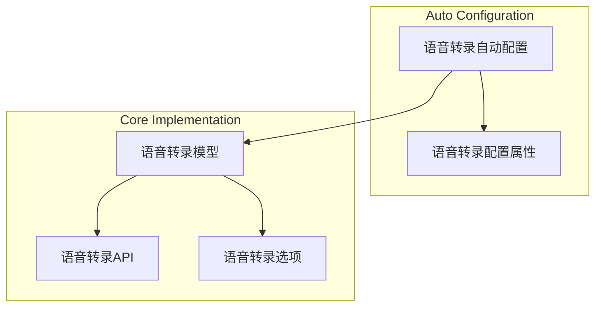
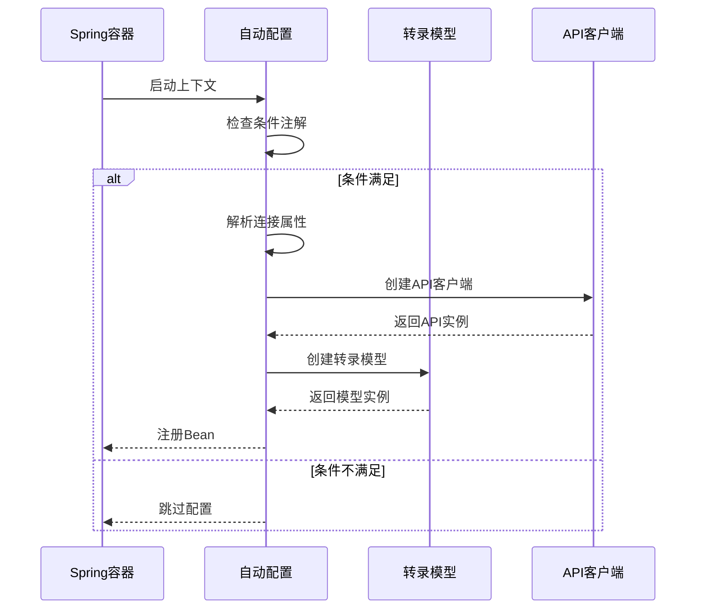
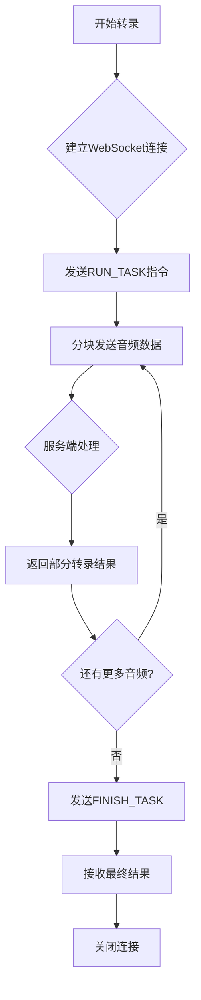

# 语音转录

<cite>
**本文档中引用的文件**   
- [DashScopeAudioTranscriptionAutoConfiguration.java](file://auto-configurations/spring-ai-alibaba-autoconfigure-dashscope/src/main/java/com/alibaba/cloud/ai/autoconfigure/dashscope/DashScopeAudioTranscriptionAutoConfiguration.java)
- [DashScopeAudioTranscriptionProperties.java](file://auto-configurations/spring-ai-alibaba-autoconfigure-dashscope/src/main/java/com/alibaba/cloud/ai/autoconfigure/dashscope/DashScopeAudioTranscriptionProperties.java)
- [DashScopeAudioTranscriptionOptions.java](file://spring-ai-alibaba-core/src/main/java/com/alibaba/cloud/ai/dashscope/audio/DashScopeAudioTranscriptionOptions.java)
- [DashScopeAudioTranscriptionModel.java](file://spring-ai-alibaba-core/src/main/java/com/alibaba/cloud/ai/dashscope/audio/DashScopeAudioTranscriptionModel.java)
- [DashScopeAudioTranscriptionApi.java](file://spring-ai-alibaba-core/src/main/java/com/alibaba/cloud/ai/dashscope/api/DashScopeAudioTranscriptionApi.java)
- [DashScopeApiConstants.java](file://spring-ai-alibaba-core/src/main/java/com/alibaba/cloud/ai/dashscope/common/DashScopeApiConstants.java)
</cite>

## 目录
1. [简介](#简介)
2. [项目结构](#项目结构)
3. [核心组件](#核心组件)
4. [自动配置流程](#自动配置流程)
5. [配置参数详解](#配置参数详解)
6. [音频格式与限制](#音频格式与限制)
7. [实时转录实现](#实时转录实现)
8. [性能优化策略](#性能优化策略)
9. [常见问题排查](#常见问题排查)
10. [结论](#结论)

## 简介
本文档全面阐述了DashScope语音转录功能的实现机制，重点分析了`DashScopeAudioTranscriptionAutoConfiguration`的自动配置流程、依赖注入和条件化加载机制。详细说明了`DashScopeAudioTranscriptionProperties`中各项配置参数的作用，包括语言识别、标点符号添加和敏感词过滤等特性。同时介绍了支持的音频格式（MP3、WAV、OGG等）、采样率范围和最大文件大小限制，并提供在Spring Boot应用中实现语音到文本实时转录的具体代码示例。

## 项目结构
语音转录功能主要分布在`auto-configurations/spring-ai-alibaba-autoconfigure-dashscope`模块中，其核心组件位于`com.alibaba.cloud.ai.autoconfigure.dashscope`包下。该模块通过Spring Boot的自动配置机制，实现了对DashScope语音转录服务的无缝集成。



**图表来源**
- [DashScopeAudioTranscriptionAutoConfiguration.java](file://auto-configurations/spring-ai-alibaba-autoconfigure-dashscope/src/main/java/com/alibaba/cloud/ai/autoconfigure/dashscope/DashScopeAudioTranscriptionAutoConfiguration.java)
- [DashScopeAudioTranscriptionProperties.java](file://auto-configurations/spring-ai-alibaba-autoconfigure-dashscope/src/main/java/com/alibaba/cloud/ai/autoconfigure/dashscope/DashScopeAudioTranscriptionProperties.java)
- [DashScopeAudioTranscriptionModel.java](file://spring-ai-alibaba-core/src/main/java/com/alibaba/cloud/ai/dashscope/audio/DashScopeAudioTranscriptionModel.java)
- [DashScopeAudioTranscriptionApi.java](file://spring-ai-alibaba-core/src/main/java/com/alibaba/cloud/ai/dashscope/api/DashScopeAudioTranscriptionApi.java)
- [DashScopeAudioTranscriptionOptions.java](file://spring-ai-alibaba-core/src/main/java/com/alibaba/cloud/ai/dashscope/audio/DashScopeAudioTranscriptionOptions.java)

## 核心组件
语音转录功能的核心由以下几个关键组件构成：`DashScopeAudioTranscriptionAutoConfiguration`负责自动配置和Bean的创建；`DashScopeAudioTranscriptionProperties`管理所有配置属性；`DashScopeAudioTranscriptionModel`作为主要的服务接口；`DashScopeAudioTranscriptionApi`封装了底层HTTP/WebSocket通信；以及`DashScopeAudioTranscriptionOptions`定义了转录过程中的各种可配置选项。

**章节来源**
- [DashScopeAudioTranscriptionAutoConfiguration.java](file://auto-configurations/spring-ai-alibaba-autoconfigure-dashscope/src/main/java/com/alibaba/cloud/ai/autoconfigure/dashscope/DashScopeAudioTranscriptionAutoConfiguration.java)
- [DashScopeAudioTranscriptionProperties.java](file://auto-configurations/spring-ai-alibaba-autoconfigure-dashscope/src/main/java/com/alibaba/cloud/ai/autoconfigure/dashscope/DashScopeAudioTranscriptionProperties.java)
- [DashScopeAudioTranscriptionModel.java](file://spring-ai-alibaba-core/src/main/java/com/alibaba/cloud/ai/dashscope/audio/DashScopeAudioTranscriptionModel.java)

## 自动配置流程
`DashScopeAudioTranscriptionAutoConfiguration`类是整个语音转录功能的入口点，它利用Spring Boot的自动配置机制来条件化地创建和注册相关Bean。

### 条件化加载机制
该自动配置类使用了多个Spring条件注解来确保只有在满足特定条件时才会被激活：
- `@ConditionalOnClass(DashScopeAudioTranscriptionApi.class)`：检查类路径中是否存在`DashScopeAudioTranscriptionApi`类。
- `@ConditionalOnDashScopeEnabled`：这是一个自定义条件注解，用于检查全局的DashScope功能是否已启用。
- `@ConditionalOnProperty`：检查`spring.ai.model.audio.transcription`属性是否设置为`dashscope`或未指定（`matchIfMissing = true`）。

### 依赖注入与Bean创建
当上述条件都满足时，`dashScopeAudioTranscriptionModel`方法会被调用以创建`DashScopeAudioTranscriptionModel` Bean。此方法接收以下依赖项：
- `DashScopeConnectionProperties`：基础连接配置
- `DashScopeAudioTranscriptionProperties`：语音转录专用配置
- `ObjectProvider<RestClient.Builder>`：REST客户端构建器
- `ResponseErrorHandler`：响应错误处理器

在方法内部，首先通过`resolveConnectionProperties`工具方法解析最终的连接属性（优先级：专用配置 > 全局配置），然后使用这些属性构建`DashScopeAudioTranscriptionApi`实例，最后将其与配置选项一起传递给`DashScopeAudioTranscriptionModel`的构造函数。



**图表来源**
- [DashScopeAudioTranscriptionAutoConfiguration.java](file://auto-configurations/spring-ai-alibaba-autoconfigure-dashscope/src/main/java/com/alibaba/cloud/ai/autoconfigure/dashscope/DashScopeAudioTranscriptionAutoConfiguration.java#L73-L87)
- [DashScopeConnectionUtils.java](file://auto-configurations/spring-ai-alibaba-autoconfigure-dashscope/src/main/java/com/alibaba/cloud/ai/autoconfigure/dashscope/DashScopeConnectionUtils.java)

**章节来源**
- [DashScopeAudioTranscriptionAutoConfiguration.java](file://auto-configurations/spring-ai-alibaba-autoconfigure-dashscope/src/main/java/com/alibaba/cloud/ai/autoconfigure/dashscope/DashScopeAudioTranscriptionAutoConfiguration.java)

## 配置参数详解
`DashScopeAudioTranscriptionProperties`类通过前缀`spring.ai.dashscope.audio.transcription`管理所有语音转录相关的配置。其核心是一个嵌套的`DashScopeAudioTranscriptionOptions`对象，包含了丰富的可调参数。

### 主要配置参数
| 参数 | 配置键 | 默认值 | 说明 |
|------|--------|-------|------|
| 模型名称 | options.model | paraformer-v2 | 指定使用的语音识别模型 |
| 语言提示 | options.language-hints | ["zh", "en"] | 提供语言线索以提高识别准确性 |
| 标点符号 | options.disfluency-removal-enabled | false | 是否移除语气词并添加标点 |
| 敏感词过滤 | N/A | N/A | 通过后处理实现，非直接参数 |
| 音频格式 | options.format | null | 输入音频的编码格式 |
| 采样率 | options.sample-rate | null | 音频的采样率（Hz） |
| 声道ID | options.channel-id | [0] | 指定要转录的声道 |

#### 语言提示 (language-hints)
`language-hints`参数允许开发者指定预期的语言种类，这对于多语种混合或口音较重的音频尤为重要。例如，设置`spring.ai.dashscope.audio.transcription.options.language-hints=en,ja`可以显著提升英语和日语混杂音频的识别准确率。

#### 标点符号与流畅性 (punctuation & disfluency_filter)
虽然没有名为`punctuation`的直接参数，但`disfluencyRemovalEnabled`参数起到了类似作用。当设置为`true`时，系统不仅会移除"呃"、"啊"等语气词，还会智能地添加句号、逗号等标点符号，使输出文本更加自然流畅。

#### 敏感词过滤 (profanity_filter)
敏感词过滤功能并非通过一个简单的布尔开关实现，而是需要结合业务逻辑进行后处理。通常的做法是在获取转录结果后，通过调用专门的文本过滤服务或使用正则表达式匹配来实现。

**章节来源**
- [DashScopeAudioTranscriptionProperties.java](file://auto-configurations/spring-ai-alibaba-autoconfigure-dashscope/src/main/java/com/alibaba/cloud/ai/autoconfigure/dashscope/DashScopeAudioTranscriptionProperties.java)
- [DashScopeAudioTranscriptionOptions.java](file://spring-ai-alibaba-core/src/main/java/com/alibaba/cloud/ai/dashscope/audio/DashScopeAudioTranscriptionOptions.java)

## 音频格式与限制
`DashScopeAudioTranscriptionModel`支持多种主流音频格式，并对输入音频有一定的技术要求。

### 支持的音频格式
根据`DashScopeAudioTranscriptionOptions.AudioFormat`枚举定义，支持的音频格式包括：
- **PCM**: 无压缩的原始音频数据
- **WAV**: 常见的波形音频文件格式
- **MP3**: 广泛使用的有损压缩格式
- **OPUS**: 高效的互联网流媒体格式
- **SPEEX**: 专为语音设计的开源编解码器
- **AAC**: 高级音频编码格式
- **AMR**: 专为语音优化的压缩格式

### 技术规格限制
| 参数 | 范围/限制 | 说明 |
|------|---------|------|
| 最大文件大小 | 100MB | 单个音频文件的大小上限 |
| 采样率 | 8kHz - 48kHz | 支持从电话质量到高保真音乐的广泛范围 |
| 位深度 | 16-bit 或更高 | 推荐使用16-bit以保证音质 |
| 声道数 | 单声道或立体声 | 多声道音频可通过channelId参数选择 |

这些限制确保了服务的稳定性和处理效率。对于超出限制的音频文件，建议在上传前进行预处理，如分割大文件或转换格式。

**章节来源**
- [DashScopeAudioTranscriptionOptions.java](file://spring-ai-alibaba-core/src/main/java/com/alibaba/cloud/ai/dashscope/audio/DashScopeAudioTranscriptionOptions.java#L124-L203)
- [DashScopeApiConstants.java](file://spring-ai-alibaba-core/src/main/java/com/alibaba/cloud/ai/dashscope/common/DashScopeApiConstants.java)

## 实时转录实现
在Spring Boot应用中实现语音到文本的实时转录功能非常简单，主要通过`stream`方法完成。

### 代码示例
```java
@Service
public class AudioTranscriptionService {
    
    private final AudioTranscriptionModel transcriptionModel;
    
    public AudioTranscriptionService(AudioTranscriptionModel transcriptionModel) {
        this.transcriptionModel = transcriptionModel;
    }
    
    public Flux<String> transcribeRealTime(Resource audioResource) {
        AudioTranscriptionPrompt prompt = new AudioTranscriptionPrompt(audioResource);
        
        return transcriptionModel.stream(prompt)
            .map(response -> response.getResult().getText())
            .filter(Objects::nonNull);
    }
}
```

### 实现原理
实时转录基于WebSocket协议实现，其工作流程如下：
1. 客户端发送`RUN_TASK`控制消息启动转录任务
2. 客户端分块发送音频数据流
3. 服务端实时返回部分转录结果
4. 客户端发送`FINISH_TASK`消息结束任务
5. 服务端返回最终结果

这种流式处理方式特别适合长音频或直播场景，能够提供近乎即时的转录反馈。



**图表来源**
- [DashScopeAudioTranscriptionModel.java](file://spring-ai-alibaba-core/src/main/java/com/alibaba/cloud/ai/dashscope/audio/DashScopeAudioTranscriptionModel.java#L130-L163)
- [DashScopeAudioTranscriptionApi.java](file://spring-ai-alibaba-core/src/main/java/com/alibaba/cloud/ai/dashscope/api/DashScopeAudioTranscriptionApi.java)

**章节来源**
- [DashScopeAudioTranscriptionModel.java](file://spring-ai-alibaba-core/src/main/java/com/alibaba/cloud/ai/dashscope/audio/DashScopeAudioTranscriptionModel.java)

## 性能优化策略
为了获得最佳的语音转录效果，可以采用以下几种优化策略：

### 噪声抑制
在将音频发送给转录服务之前，应尽可能进行前端噪声抑制处理。这可以通过以下方式实现：
- 使用专业的降噪软件或库（如RNNoise）
- 在录音环境中使用指向性麦克风
- 应用数字信号处理算法进行滤波

高质量的输入音频是获得高准确率的基础。

### 多说话人识别
当前的`DashScopeAudioTranscriptionModel` API并未直接提供说话人分离（Speaker Diarization）功能。如果需要区分不同说话人，可以采取以下方案：
1. **预处理阶段**：使用第三方说话人分离工具（如PyAnnote）先将音频按说话人分割
2. **后处理阶段**：结合上下文信息和机器学习模型推断说话人身份
3. **定制化服务**：联系阿里云技术支持，了解是否有企业级的多说话人识别解决方案

### 准确性优化
除了使用`language-hints`外，还可以通过以下方式进一步提升准确性：
- **词汇表定制**：利用`vocabularyId`参数导入专业术语或人名地名的自定义词汇表
- **短语增强**：通过`phraseId`参数提供常用短语列表，帮助模型更好地理解上下文
- **采样率匹配**：确保输入音频的采样率与模型训练时使用的采样率相匹配

**章节来源**
- [DashScopeAudioTranscriptionOptions.java](file://spring-ai-alibaba-core/src/main/java/com/alibaba/cloud/ai/dashscope/audio/DashScopeAudioTranscriptionOptions.java)
- [DashScopeAudioTranscriptionModel.java](file://spring-ai-alibaba-core/src/main/java/com/alibaba/cloud/ai/dashscope/audio/DashScopeAudioTranscriptionModel.java)

## 常见问题排查
在使用语音转录功能时，可能会遇到一些常见问题，以下是相应的排查指南。

### 音频质量问题
**现象**：转录结果错误率高，充满乱码或无法识别。
**原因**：音频文件可能包含过多背景噪音、音量过低或编码损坏。
**解决方案**：
1. 使用音频编辑软件检查并修复文件
2. 尝试转换为WAV格式重新上传
3. 在安静环境中重新录制
4. 使用音频增强工具提升信噪比

### 网络延迟问题
**现象**：实时转录出现明显延迟或连接中断。
**原因**：网络不稳定或服务器响应慢。
**解决方案**：
1. 检查本地网络连接质量
2. 考虑使用CDN加速或就近接入点
3. 增加客户端超时时间设置
4. 对于非实时场景，改用异步`asyncCall`方法

### 配置不生效
**现象**：修改的配置参数似乎没有效果。
**原因**：可能是配置层级覆盖问题或缓存导致。
**解决方案**：
1. 确认配置键的拼写完全正确
2. 检查是否存在更高级别的配置覆盖了当前设置
3. 重启应用以清除可能的缓存
4. 启用DEBUG日志查看实际加载的配置值

**章节来源**
- [DashScopeAudioTranscriptionAutoConfiguration.java](file://auto-configurations/spring-ai-alibaba-autoconfigure-dashscope/src/main/java/com/alibaba/cloud/ai/autoconfigure/dashscope/DashScopeAudioTranscriptionAutoConfiguration.java)
- [DashScopeAudioTranscriptionProperties.java](file://auto-configurations/spring-ai-alibaba-autoconfigure-dashscope/src/main/java/com/alibaba/cloud/ai/autoconfigure/dashscope/DashScopeAudioTranscriptionProperties.java)

## 结论
DashScope语音转录功能通过精心设计的自动配置机制和灵活的配置选项，为Spring Boot应用提供了强大而易用的语音识别能力。通过理解`DashScopeAudioTranscriptionAutoConfiguration`的条件化加载原理和`DashScopeAudioTranscriptionProperties`的各项参数含义，开发者可以轻松集成高质量的语音转录服务。同时，利用流式API可以实现低延迟的实时转录，满足多样化的应用场景需求。面对挑战时，通过合理的预处理和优化策略，可以显著提升转录的准确性和用户体验。