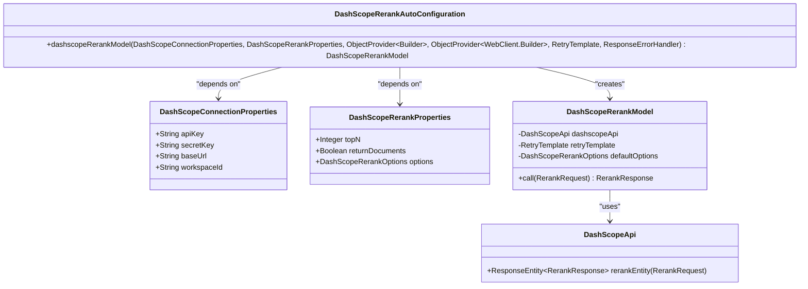
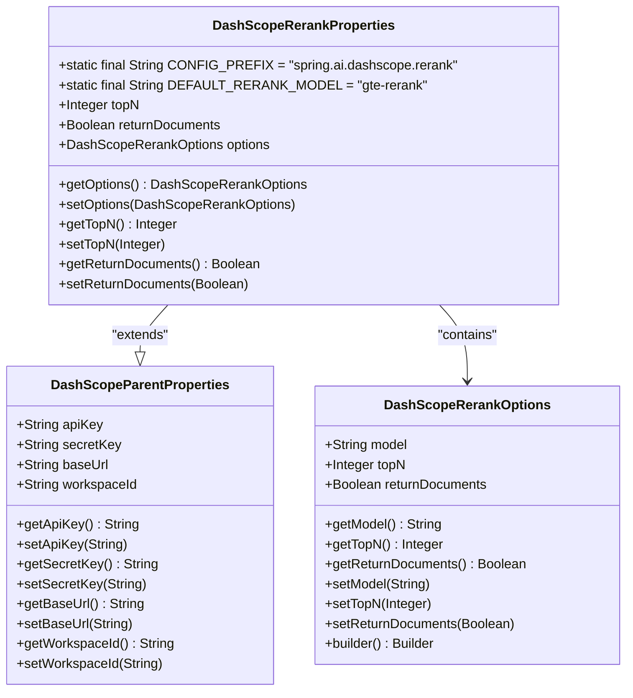
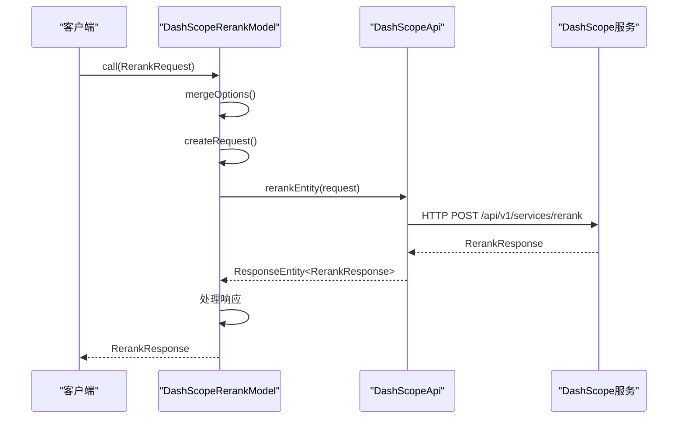
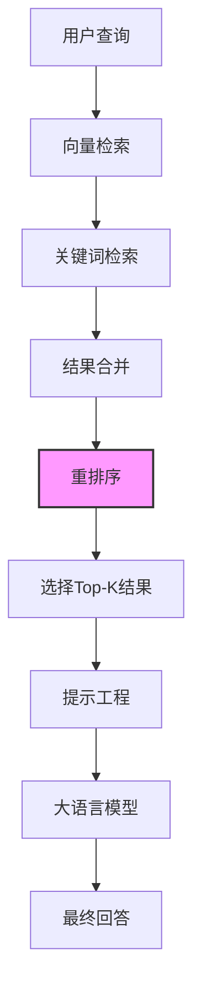
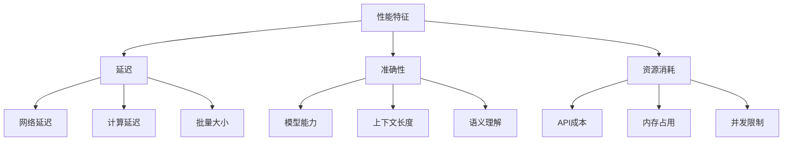
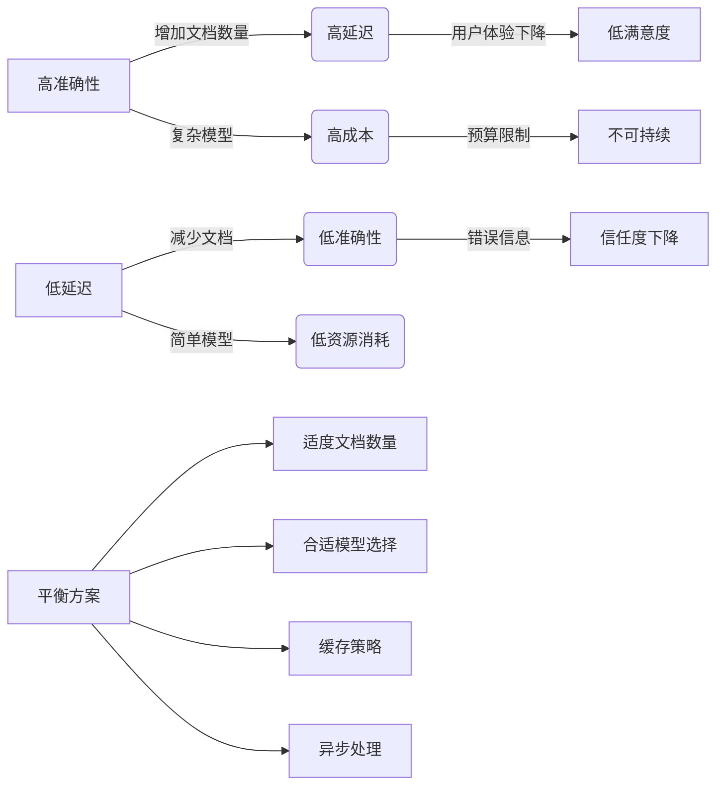

# 重排序功能

<cite>
**本文档引用的文件**   
- [DashScopeRerankAutoConfiguration.java](file://auto-configurations/spring-ai-alibaba-autoconfigure-dashscope/src/main/java/com/alibaba/cloud/ai/autoconfigure/dashscope/DashScopeRerankAutoConfiguration.java)
- [DashScopeRerankProperties.java](file://auto-configurations/spring-ai-alibaba-autoconfigure-dashscope/src/main/java/com/alibaba/cloud/ai/autoconfigure/dashscope/DashScopeRerankProperties.java)
- [DashScopeRerankModel.java](file://spring-ai-alibaba-core/src/main/java/com/alibaba/cloud/ai/dashscope/rerank/DashScopeRerankModel.java)
- [DashScopeRerankOptions.java](file://spring-ai-alibaba-core/src/main/java/com/alibaba/cloud/ai/dashscope/rerank/DashScopeRerankOptions.java)
- [DashScopeConnectionProperties.java](file://auto-configurations/spring-ai-alibaba-autoconfigure-dashscope/src/main/java/com/alibaba/cloud/ai/autoconfigure/dashscope/DashScopeConnectionProperties.java)
- [DashScopeParentProperties.java](file://auto-configurations/spring-ai-alibaba-autoconfigure-dashscope/src/main/java/com/alibaba/cloud/ai/autoconfigure/dashscope/DashScopeParentProperties.java)
- [DashScopeConnectionUtils.java](file://auto-configurations/spring-ai-alibaba-autoconfigure-dashscope/src/main/java/com/alibaba/cloud/ai/autoconfigure/dashscope/DashScopeConnectionUtils.java)
- [DashScopeApi.java](file://spring-ai-alibaba-core/src/main/java/com/alibaba/cloud/ai/dashscope/api/DashScopeApi.java)
</cite>

## 目录
1. [简介](#简介)
2. [自动配置逻辑](#自动配置逻辑)
3. [配置选项](#配置选项)
4. [工作机制](#工作机制)
5. [在RAG场景中的应用](#在rag场景中的应用)
6. [排序算法原理](#排序算法原理)
7. [性能特征](#性能特征)
8. [使用示例](#使用示例)
9. [权衡分析](#权衡分析)

## 简介
本文档详细阐述了Spring AI Alibaba框架中DashScope重排序功能的实现机制。该功能主要用于检索增强生成（RAG）场景，通过对初始检索结果进行重新排序来提高最终结果的相关性。文档将深入分析`DashScopeRerankAutoConfiguration`的自动配置逻辑、`DashScopeRerankProperties`中的配置选项以及`DashScopeRerankModel`的工作机制。

## 自动配置逻辑

`DashScopeRerankAutoConfiguration`类负责为DashScope重排序模型提供自动配置支持。该配置类通过一系列条件注解确保只有在满足特定条件时才会创建相应的Bean。



**图源**
- [DashScopeRerankAutoConfiguration.java](file://auto-configurations/spring-ai-alibaba-autoconfigure-dashscope/src/main/java/com/alibaba/cloud/ai/autoconfigure/dashscope/DashScopeRerankAutoConfiguration.java#L1-L82)
- [DashScopeRerankModel.java](file://spring-ai-alibaba-core/src/main/java/com/alibaba/cloud/ai/dashscope/rerank/DashScopeRerankModel.java#L1-L143)

**节源**
- [DashScopeRerankAutoConfiguration.java](file://auto-configurations/spring-ai-alibaba-autoconfigure-dashscope/src/main/java/com/alibaba/cloud/ai/autoconfigure/dashscope/DashScopeRerankAutoConfiguration.java#L1-L82)

## 配置选项

`DashScopeRerankProperties`类定义了重排序功能的所有可配置属性，这些属性可以通过`application.yml`或`application.properties`文件进行设置。

| 配置项 | 默认值 | 描述 |
|--------|-------|------|
| `spring.ai.dashscope.rerank.top-n` | 5 | 返回前N个最相关的文档 |
| `spring.ai.dashscope.rerank.return-documents` | false | 是否返回原始文档 |
| `spring.ai.dashscope.rerank.options.model` | gte-rerank | 使用的重排序模型名称 |
| `spring.ai.dashscope.api-key` | null | DashScope API密钥 |
| `spring.ai.dashscope.base-url` | https://dashscope.aliyuncs.com/api/v1 | API基础URL |

该类继承自`DashScopeParentProperties`，后者包含了API密钥、基础URL和工作区ID等通用连接属性。



**图源**
- [DashScopeRerankProperties.java](file://auto-configurations/spring-ai-alibaba-autoconfigure-dashscope/src/main/java/com/alibaba/cloud/ai/autoconfigure/dashscope/DashScopeRerankProperties.java#L1-L82)
- [DashScopeParentProperties.java](file://auto-configurations/spring-ai-alibaba-autoconfigure-dashscope/src/main/java/com/alibaba/cloud/ai/autoconfigure/dashscope/DashScopeParentProperties.java#L1-L62)
- [DashScopeRerankOptions.java](file://spring-ai-alibaba-core/src/main/java/com/alibaba/cloud/ai/dashscope/rerank/DashScopeRerankOptions.java#L1-L106)

**节源**
- [DashScopeRerankProperties.java](file://auto-configurations/spring-ai-alibaba-autoconfigure-dashscope/src/main/java/com/alibaba/cloud/ai/autoconfigure/dashscope/DashScopeRerankProperties.java#L1-L82)

## 工作机制

`DashScopeRerankModel`是重排序功能的核心实现类，它实现了`RerankModel`接口并封装了与DashScope API的交互逻辑。



当调用`call`方法时，系统会执行以下步骤：
1. 验证请求参数的有效性
2. 合并运行时选项和默认选项
3. 创建API请求对象
4. 通过`RetryTemplate`执行带重试机制的API调用
5. 处理API响应并构建返回结果

**图源**
- [DashScopeRerankModel.java](file://spring-ai-alibaba-core/src/main/java/com/alibaba/cloud/ai/dashscope/rerank/DashScopeRerankModel.java#L1-L143)
- [DashScopeApi.java](file://spring-ai-alibaba-core/src/main/java/com/alibaba/cloud/ai/dashscope/api/DashScopeApi.java#L1-L1936)

**节源**
- [DashScopeRerankModel.java](file://spring-ai-alibaba-core/src/main/java/com/alibaba/cloud/ai/dashscope/rerank/DashScopeRerankModel.java#L1-L143)

## 在RAG场景中的应用

在检索增强生成（RAG）架构中，重排序功能通常作为检索阶段的后处理步骤。其主要作用是对初始检索器返回的结果进行二次排序，以提高后续生成阶段输入的相关性。



典型的使用流程如下：
1. 用户提出问题
2. 通过向量数据库和/或关键词搜索获取初步候选文档
3. 将候选文档与原始查询一起提交给重排序模型
4. 根据相关性得分对文档重新排序
5. 选取排名靠前的文档用于构建提示词
6. 将构造好的提示词发送给大语言模型生成最终答案

这种两阶段的检索策略可以有效结合不同检索方法的优势，同时通过重排序进一步优化结果质量。

**图源**
- [DashScopeRerankModel.java](file://spring-ai-alibaba-core/src/main/java/com/alibaba/cloud/ai/dashscope/rerank/DashScopeRerankModel.java#L1-L143)

## 排序算法原理

DashScope重排序功能基于深度学习模型实现，具体采用的是经过专门训练的交叉编码器（Cross-Encoder）架构。与双塔编码器不同，交叉编码器能够同时处理查询和文档，从而捕捉更细粒度的语义匹配信号。

算法核心流程包括：
1. **输入表示**：将查询和每个候选文档拼接成一个序列
2. **上下文编码**：使用Transformer模型对拼接序列进行编码
3. **相关性计算**：从编码输出中提取相关性得分
4. **结果排序**：根据得分对所有候选文档进行降序排列

在实现层面，`createRequest`方法负责将`RerankRequest`转换为适合API调用的格式：

```java
private DashScopeApi.RerankRequest createRequest(RerankRequest request, DashScopeRerankOptions requestOptions) {
    List<String> docs = request.getInstructions().stream().map(Document::getText).toList();
    
    DashScopeApi.RerankRequestParameter parameter = new DashScopeApi.RerankRequestParameter(
            requestOptions.getTopN(), requestOptions.getReturnDocuments());
    var input = new DashScopeApi.RerankRequestInput(request.getQuery(), docs);
    return new DashScopeApi.RerankRequest(requestOptions.getModel(), input, parameter);
}
```

**节源**
- [DashScopeRerankModel.java](file://spring-ai-alibaba-core/src/main/java/com/alibaba/cloud/ai/dashscope/rerank/DashScopeRerankModel.java#L107-L141)

## 性能特征

重排序功能的性能受多个因素影响，主要包括：

### 延迟特性
- **网络延迟**：由于需要调用远程API，网络往返时间是主要延迟来源
- **计算延迟**：模型推理时间与文档数量呈线性关系
- **批量处理**：支持一次请求中包含多个文档，但过多文档会导致超时风险增加

### 准确性特征
- **模型能力**：`gte-rerank`模型在中文场景下表现优异
- **上下文长度**：单个文档过长可能被截断，影响评分准确性
- **多样性**：能够识别语义相似但表述不同的内容

### 资源消耗
- **API调用成本**：按请求次数和处理的文本量计费
- **内存占用**：客户端需要缓存所有候选文档
- **并发限制**：API服务端有QPS限制



**图源**
- [DashScopeRerankModel.java](file://spring-ai-alibaba-core/src/main/java/com/alibaba/cloud/ai/dashscope/rerank/DashScopeRerankModel.java#L1-L143)

## 使用示例

以下是一个完整的使用示例，展示如何将重排序功能与检索系统结合使用：

```java
@Configuration
public class RerankConfiguration {
    
    @Bean
    public RerankModel dashScopeRerankModel() {
        return new DashScopeRerankModel(dashScopeApi(), 
                DashScopeRerankOptions.builder()
                    .withModel("gte-rerank")
                    .withTopN(3)
                    .build());
    }
}

@Service
public class SearchService {
    
    private final RerankModel rerankModel;
    private final VectorStore vectorStore;
    
    public SearchService(RerankModel rerankModel, VectorStore vectorStore) {
        this.rerankModel = rerankModel;
        this.vectorStore = vectorStore;
    }
    
    public List<Document> searchWithRerank(String query) {
        // 第一阶段：向量检索
        List<Document> initialResults = vectorStore.similaritySearch(query, 10);
        
        // 第二阶段：重排序
        RerankRequest request = RerankRequest.builder()
            .withQuery(query)
            .withInstructions(initialResults)
            .withOptions(DashScopeRerankOptions.builder()
                .withTopN(5)
                .build())
            .build();
            
        RerankResponse response = rerankModel.call(request);
        
        return response.getResults().stream()
            .map(DocumentWithScore::getOutput)
            .collect(Collectors.toList());
    }
}
```

对应的配置文件示例：
```yaml
spring:
  ai:
    dashscope:
      api-key: ${DASHSCOPE_API_KEY}
      base-url: https://dashscope.aliyuncs.com/api/v1
      rerank:
        top-n: 5
        return-documents: true
        options:
          model: gte-rerank
```

**节源**
- [DashScopeRerankModel.java](file://spring-ai-alibaba-core/src/main/java/com/alibaba/cloud/ai/dashscope/rerank/DashScopeRerankModel.java#L1-L143)
- [DashScopeRerankProperties.java](file://auto-configurations/spring-ai-alibaba-autoconfigure-dashscope/src/main/java/com/alibaba/cloud/ai/autoconfigure/dashscope/DashScopeRerankProperties.java#L1-L82)

## 权衡分析

在实际应用中，需要在延迟、准确性和资源消耗之间做出合理权衡：



建议的优化策略包括：
1. **缓存机制**：对常见查询的重排序结果进行缓存
2. **异步处理**：在后台预计算可能的查询结果
3. **分级处理**：根据查询重要性动态调整topN参数
4. **混合策略**：结合多种重排序模型进行集成学习

**图源**
- [DashScopeRerankModel.java](file://spring-ai-alibaba-core/src/main/java/com/alibaba/cloud/ai/dashscope/rerank/DashScopeRerankModel.java#L1-L143)