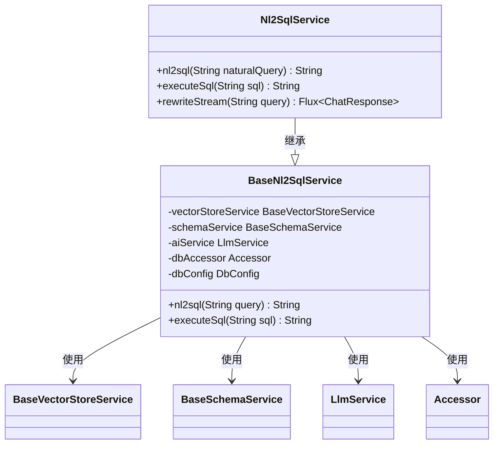
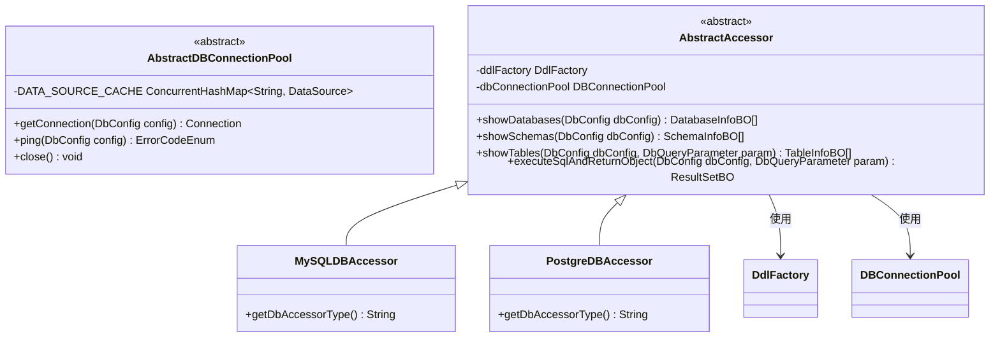
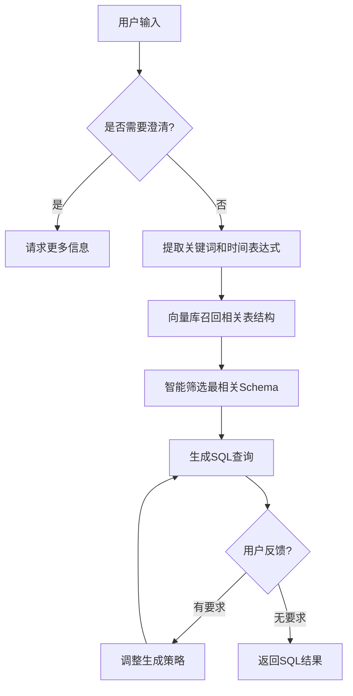

# 百炼平台集成

<cite>
**本文档引用的文件**
- [README.md](file://spring-ai-alibaba-nl2sql/README.md)
- [BaseNl2SqlService.java](file://spring-ai-alibaba-nl2sql/spring-ai-alibaba-nl2sql-chat/src/main/java/com/alibaba/cloud/ai/service/base/BaseNl2SqlService.java)
- [Nl2SqlService.java](file://spring-ai-alibaba-nl2sql/spring-ai-alibaba-nl2sql-chat/src/main/java/com/alibaba/cloud/ai/service/Nl2SqlService.java)
- [AbstractDBConnectionPool.java](file://spring-ai-alibaba-nl2sql/spring-ai-alibaba-nl2sql-common/src/main/java/com/alibaba/cloud/ai/connector/AbstractDBConnectionPool.java)
- [AbstractAccessor.java](file://spring-ai-alibaba-nl2sql/spring-ai-alibaba-nl2sql-common/src/main/java/com/alibaba/cloud/ai/connector/accessor/defaults/AbstractAccessor.java)
- [MySQLDBAccessor.java](file://spring-ai-alibaba-nl2sql/spring-ai-alibaba-nl2sql-common/src/main/java/com/alibaba/cloud/ai/connector/mysql/MySQLDBAccessor.java)
- [PostgreDBAccessor.java](file://spring-ai-alibaba-nl2sql/spring-ai-alibaba-nl2sql-common/src/main/java/com/alibaba/cloud/ai/connector/postgre/PostgreDBAccessor.java)
- [application.yml](file://spring-ai-alibaba-nl2sql/spring-ai-alibaba-nl2sql-management/src/main/resources/application.yml)
- [ChatController.java](file://spring-ai-alibaba-nl2sql/spring-ai-alibaba-nl2sql-management/src/main/java/com/alibaba/cloud/ai/controller/ChatController.java)
- [planner-nl2sql-only.txt](file://spring-ai-alibaba-nl2sql/spring-ai-alibaba-nl2sql-chat/src/main/resources/prompts/planner-nl2sql-only.txt)
- [SimpleVectorStoreService.java](file://spring-ai-alibaba-nl2sql/spring-ai-alibaba-nl2sql-chat/src/main/java/com/alibaba/cloud/ai/service/simple/SimpleVectorStoreService.java)
</cite>

## 目录
1. [简介](#简介)
2. [项目结构](#项目结构)
3. [NL2SQL核心组件](#nl2sql核心组件)
4. [数据库连接与访问](#数据库连接与访问)
5. [自然语言到SQL转换机制](#自然语言到sql转换机制)
6. [向量存储与模式匹配](#向量存储与模式匹配)
7. [查询执行与结果处理](#查询执行与结果处理)
8. [错误处理与安全考虑](#错误处理与安全考虑)
9. [与其他AI服务的协同工作](#与其他ai服务的协同工作)
10. [配置与部署](#配置与部署)

## 简介

百炼平台的NL2SQL功能允许用户使用自然语言直接查询数据库，而无需编写复杂的SQL语句。该功能基于Spring AI Alibaba框架构建，通过大模型技术将用户的自然语言问题转化为可执行的SQL查询，并返回格式化的结果。

该模块的核心能力源自阿里云析言GBI，经过模块化改造后提供轻量级的自然语言转SQL服务。系统能够理解用户意图，结合数据库Schema和业务逻辑解释（evidence），生成精准的SQL查询并执行，最终返回易于理解的结果。

**本模块被设计为可复用的服务层组件**，仅提供核心功能实现，不包含RESTful接口及独立启动能力，适用于集成到其他Spring Boot项目中使用。

## 项目结构

NL2SQL项目采用分层架构设计，主要由以下几个部分组成：

```
spring-ai-alibaba-nl2sql/
├── spring-ai-alibaba-nl2sql-management    # 管理端（可直接启动的Web应用）
├── spring-ai-alibaba-nl2sql-chat         # 核心功能（不能独立启动，供集成使用）
└── spring-ai-alibaba-nl2sql-common       # 公共代码
```

- **management模块**：提供完整的Web管理界面和API接口，用于创建、调试和发布智能体。
- **chat模块**：包含NL2SQL的核心业务逻辑，包括自然语言解析、SQL生成、执行等功能。
- **common模块**：提供数据库连接池、访问器、枚举等公共组件。

此外，项目还提供了`spring-ai-alibaba-nl2sql-web-ui`前端界面，通过Vue3构建，为用户提供友好的交互体验。

**Section sources**
- [README.md](file://spring-ai-alibaba-nl2sql/README.md#L1-L181)

## NL2SQL核心组件

NL2SQL功能的核心是`Nl2SqlService`类，它负责协调整个自然语言到SQL的转换流程。该服务继承自`BaseNl2SqlService`，并实现了具体的业务逻辑。

核心方法包括：
- `nl2sql(String naturalQuery)`：将自然语言查询转换为SQL语句
- `executeSql(String sql)`：执行生成的SQL并返回格式化结果
- `rewriteStream(String query)`：支持流式响应的查询重写

这些方法通过调用底层的大模型服务（aiService）、数据库访问器（dbAccessor）和向量存储服务来完成复杂的转换任务。



**Diagram sources**
- [Nl2SqlService.java](file://spring-ai-alibaba-nl2sql/spring-ai-alibaba-nl2sql-chat/src/main/java/com/alibaba/cloud/ai/service/Nl2SqlService.java#L59-L119)
- [BaseNl2SqlService.java](file://spring-ai-alibaba-nl2sql/spring-ai-alibaba-nl2sql-chat/src/main/java/com/alibaba/cloud/ai/service/base/BaseNl2SqlService.java#L128-L161)

**Section sources**
- [BaseNl2SqlService.java](file://spring-ai-alibaba-nl2sql/spring-ai-alibaba-nl2sql-chat/src/main/java/com/alibaba/cloud/ai/service/base/BaseNl2SqlService.java#L59-L94)
- [Nl2SqlService.java](file://spring-ai-alibaba-nl2sql/spring-ai-alibaba-nl2sql-chat/src/main/java/com/alibaba/cloud/ai/service/Nl2SqlService.java#L59-L119)

## 数据库连接与访问

NL2SQL模块支持多种数据库类型，包括MySQL和PostgreSQL。数据库连接管理通过抽象工厂模式实现，确保了良好的扩展性和维护性。

### 连接池管理

`AbstractDBConnectionPool`类实现了数据库连接池的抽象基类，使用Druid作为底层连接池实现。该类提供了以下特性：
- 连接缓存：基于连接参数生成缓存键，确保相同配置只创建一个DataSource实例
- 连接测试：在获取连接前进行连通性测试
- 资源清理：提供close方法清除所有缓存的DataSource实例

```java
public abstract class AbstractDBConnectionPool implements DBConnectionPool {
    private static final ConcurrentHashMap<String, DataSource> DATA_SOURCE_CACHE = new ConcurrentHashMap<>();
    
    public Connection getConnection(DbConfig config) {
        // 生成缓存键
        String cacheKey = generateCacheKey(jdbcUrl, config.getUsername(), config.getPassword());
        
        // 使用computeIfAbsent确保线程安全
        DataSource dataSource = DATA_SOURCE_CACHE.computeIfAbsent(cacheKey, key -> {
            return createdDataSource(jdbcUrl, config.getUsername(), config.getPassword());
        });
        
        return dataSource.getConnection();
    }
}
```

### 数据库访问器

数据库访问通过`AbstractAccessor`抽象类实现，该类定义了统一的数据库操作接口。具体实现包括：
- `MySQLDBAccessor`：针对MySQL数据库的访问器
- `PostgreDBAccessor`：针对PostgreSQL数据库的访问器

访问器通过策略模式选择相应的DDL执行器（DdlFactory），支持多种数据库方言。



**Diagram sources**
- [AbstractDBConnectionPool.java](file://spring-ai-alibaba-nl2sql/spring-ai-alibaba-nl2sql-common/src/main/java/com/alibaba/cloud/ai/connector/AbstractDBConnectionPool.java#L0-L168)
- [AbstractAccessor.java](file://spring-ai-alibaba-nl2sql/spring-ai-alibaba-nl2sql-common/src/main/java/com/alibaba/cloud/ai/connector/accessor/defaults/AbstractAccessor.java#L0-L135)
- [MySQLDBAccessor.java](file://spring-ai-alibaba-nl2sql/spring-ai-alibaba-nl2sql-common/src/main/java/com/alibaba/cloud/ai/connector/mysql/MySQLDBAccessor.java#L30)
- [PostgreDBAccessor.java](file://spring-ai-alibaba-nl2sql/spring-ai-alibaba-nl2sql-common/src/main/java/com/alibaba/cloud/ai/connector/postgre/PostgreDBAccessor.java#L30)

**Section sources**
- [AbstractDBConnectionPool.java](file://spring-ai-alibaba-nl2sql/spring-ai-alibaba-nl2sql-common/src/main/java/com/alibaba/cloud/ai/connector/AbstractDBConnectionPool.java#L0-L168)
- [AbstractAccessor.java](file://spring-ai-alibaba-nl2sql/spring-ai-alibaba-nl2sql-common/src/main/java/com/alibaba/cloud/ai/connector/accessor/defaults/AbstractAccessor.java#L0-L135)

## 自然语言到SQL转换机制

NL2SQL的核心功能是将用户的自然语言查询转换为可执行的SQL语句。这一过程涉及多个关键步骤：语义解析、模式匹配和查询生成。

### 转换流程

转换流程主要由`BaseNl2SqlService`类中的`nl2sql`方法实现，其执行步骤如下：

1. **证据提取**：从用户查询中提取关键信息和上下文证据
2. **模式选择**：根据证据和查询内容选择最相关的数据库表结构
3. **SQL生成**：结合Schema信息和用户意图生成最终的SQL查询

```java
public String nl2sql(String query) throws Exception {
    logger.info("Starting nl2sql conversion for query: {}", query);
    List<String> evidences = extractEvidences(query);
    logger.debug("Extracted {} evidences for nl2sql", evidences.size());
    SchemaDTO schemaDTO = select(query, evidences);
    String sql = generateSql(evidences, query, schemaDTO);
    logger.info("Nl2sql conversion completed. Generated SQL: {}", sql);
    return sql;
}
```

### 提示工程

系统使用精心设计的提示模板（prompt）来引导大模型准确理解用户意图并生成正确的SQL。`planner-nl2sql-only.txt`模板定义了严格的输出格式要求：

- 必须只输出有效的JSON对象
- 包含思维过程（thought_process）和执行计划（execution_plan）
- 执行计划中指定使用SQL_EXECUTE_NODE工具

模板还特别强调了对用户反馈的处理优先级，如果用户要求使用Python分析，则必须包含PYTHON_GENERATE_NODE步骤。

```json
{
  "thought_process": "A brief, narrative summary of how the SQL was constructed...",
  "execution_plan": [
    {
      "step": 1,
      "tool_to_use": "SQL_EXECUTE_NODE",
      "tool_parameters": {
        "sql_query": "The generated SQL query.",
        "description": "A human-readable description of what this SQL query does."
      }
    }
  ]
}
```



**Diagram sources**
- [planner-nl2sql-only.txt](file://spring-ai-alibaba-nl2sql/spring-ai-alibaba-nl2sql-chat/src/main/resources/prompts/planner-nl2sql-only.txt#L0-L109)

**Section sources**
- [BaseNl2SqlService.java](file://spring-ai-alibaba-nl2sql/spring-ai-alibaba-nl2sql-chat/src/main/java/com/alibaba/cloud/ai/service/base/BaseNl2SqlService.java#L128-L161)
- [planner-nl2sql-only.txt](file://spring-ai-alibaba-nl2sql/spring-ai-alibaba-nl2sql-chat/src/main/resources/prompts/planner-nl2sql-only.txt#L0-L109)

## 向量存储与模式匹配

为了提高Schema理解的准确性，系统采用了向量存储技术来实现高效的模式匹配。

### SimpleVectorStoreService

`SimpleVectorStoreService`是向量存储服务的核心实现，负责管理数据库Schema的向量表示。该服务的主要功能包括：

- Schema初始化：将数据库表结构转换为向量存储
- 相关性召回：根据用户查询召回最相关的表结构信息
- 混合检索：结合向量相似度和规则匹配进行综合排序

服务通过`schema`方法接收`SchemaInitRequest`请求，初始化向量库中的Schema信息。

```java
@RestController
@RequestMapping("nl2sql")
public class Nl2sqlController {
    
    @GetMapping("/search")
    public String search(@RequestParam String query) throws Exception {
        SchemaInitRequest schemaInitRequest = new SchemaInitRequest();
        schemaInitRequest.setDbConfig(dbConfig);
        schemaInitRequest.setTables(Arrays.asList("categories", "order_items", "orders", "products", "users", "product_categories"));
        simpleVectorStoreService.schema(schemaInitRequest);

        Optional<OverAllState> call = compiledGraph.call(Map.of(INPUT_KEY, query));
        OverAllState overAllState = call.get();
        return overAllState.value(RESULT).get().toString();
    }
}
```

### 模式匹配流程

模式匹配的流程如下：
1. 用户输入自然语言查询
2. 系统从向量库中召回与查询最相关的表结构和字段信息
3. 结合业务知识库（business knowledge）进行补充
4. 将匹配到的Schema信息传递给NL2SQL引擎生成SQL

这种基于向量的检索方式能够有效解决传统方法中Schema理解偏差的问题，特别是在处理复杂查询时表现出色。

**Section sources**
- [SimpleVectorStoreService.java](file://spring-ai-alibaba-nl2sql/spring-ai-alibaba-nl2sql-chat/src/main/java/com/alibaba/cloud/ai/service/simple/SimpleVectorStoreService.java)
- [Nl2sqlController.java](file://spring-ai-alibaba-nl2sql/spring-ai-alibaba-nl2sql-chat/README.md#L459-L523)

## 查询执行与结果处理

生成SQL后，系统会执行查询并将结果转换为用户友好的格式。

### SQL执行

`executeSql`方法负责执行生成的SQL查询，其主要步骤包括：
1. 创建数据库查询参数（DbQueryParameter）
2. 调用数据库访问器执行SQL
3. 将结果集转换为业务对象（ResultSetBO）
4. 生成Markdown格式的表格结果

```java
public String executeSql(String sql) throws Exception {
    logger.info("Executing SQL: {}", sql);
    try {
        DbQueryParameter param = DbQueryParameter.from(dbConfig).setSql(sql);
        logger.debug("Created DbQueryParameter for SQL execution");
        ResultSetBO resultSet = dbAccessor.executeSqlAndReturnObject(dbConfig, param);
        logger.debug("SQL executed successfully, generating table format");
        String result = MdTableGenerator.generateTable(resultSet);
        logger.info("SQL execution completed successfully, result rows: {}",
                resultSet.getData() != null ? resultSet.getData().size() : 0);
        return result;
    }
    catch (Exception e) {
        logger.error("Failed to execute SQL: {}", sql, e);
        throw e;
    }
}
```

### 结果展示

执行结果通过`MdTableGenerator`生成Markdown表格格式，便于在Web界面中展示。系统还会记录执行过程中的元数据，包括：
- 原始SQL查询
- 用户原始问题
- 执行时间和状态

在管理界面中，用户可以看到完整的查询分析过程，包括问题分析、SQL生成和执行结果。

**Section sources**
- [BaseNl2SqlService.java](file://spring-ai-alibaba-nl2sql/spring-ai-alibaba-nl2sql-chat/src/main/java/com/alibaba/cloud/ai/service/base/BaseNl2SqlService.java#L128-L161)

## 错误处理与安全考虑

系统实现了完善的错误处理机制和安全防护措施。

### 错误处理

错误处理分为多个层次：
1. **输入验证**：检查用户查询的意图是否清晰
2. **连接测试**：在执行查询前验证数据库连接
3. **异常捕获**：捕获SQL执行过程中的各种异常
4. **用户反馈**：向用户返回有意义的错误信息

当遇到模糊意图时，系统会抛出IllegalArgumentException：

```java
catch (IllegalArgumentException e) {
    response.setMessage("抱歉，" + e.getMessage());
    response.setMessageType("error");
    response.setError(e.getMessage());
    chatMessageService.saveAssistantMessage(sessionId, response.getMessage(), "error", null);
}
```

### 安全考虑

系统采取了多项安全措施防止SQL注入等攻击：
- **参数化查询**：虽然直接生成SQL，但通过严格的输入验证和模式匹配降低风险
- **连接隔离**：每个智能体使用独立的数据源配置
- **权限控制**：通过数据库用户的权限限制可访问的数据范围
- **输入过滤**：对用户输入进行必要的清洗和验证

值得注意的是，文档中提到Python节点默认启用模拟节点，可能造成幻觉问题。建议在生产环境中实际启动Python执行功能以确保安全性。

**Section sources**
- [ChatController.java](file://spring-ai-alibaba-nl2sql/spring-ai-alibaba-nl2sql-management/src/main/java/com/alibaba/cloud/ai/controller/ChatController.java#L125-L156)
- [README.md](file://spring-ai-alibaba-nl2sql/README.md#L524-L526)

## 与其他AI服务的协同工作

NL2SQL模块设计为可与其他AI服务协同工作的生态系统的一部分。

### 大模型集成

系统通过OpenAI兼容模式集成阿里云通义千问大模型：

```yaml
spring:
  ai:
    openai:
      base-url: https://dashscope.aliyuncs.com/compatible-mode
      api-key: ${AI_DASHSCOPE_API_KEY}
      model: qwen-max
      embedding:
        model: text-embedding-v4
```

这使得系统能够利用先进的大模型能力进行自然语言理解和SQL生成。

### MCP架构

系统支持MCP（Model Control Plane）架构，通过`spring-ai-alibaba-mcp`模块实现服务注册与发现。这允许NL2SQL服务与其他AI服务协同工作，形成更强大的AI应用网络。

### 可扩展性设计

系统采用模块化设计，便于与其他AI服务集成：
- **向量存储**：支持AnalyticDB等向量数据库
- **记忆存储**：可通过`spring-ai-alibaba-starter-memory`系列模块集成Redis、MongoDB等
- **工具调用**：支持多种外部工具如地图、翻译、搜索等

这种设计使得NL2SQL不仅可以独立使用，还可以作为更大AI系统中的一个重要组件。

**Section sources**
- [application.yml](file://spring-ai-alibaba-nl2sql/spring-ai-alibaba-nl2sql-management/src/main/resources/application.yml#L0-L113)

## 配置与部署

### 环境准备

1. **业务数据库**：准备MySQL或PostgreSQL数据库，并导入测试表和数据
2. **管理数据库**：配置`application.yml`中的数据库连接信息
3. **API密钥**：配置DashScope API Key

### 配置说明

主要配置项位于`application.yml`文件中：

```yaml
spring:
  datasource:
    url: jdbc:mysql://127.0.0.1:3306/nl2sql?useUnicode=true&characterEncoding=utf-8&zeroDateTimeBehavior=convertToNull&transformedBitIsBoolean=true&allowMultiQueries=true&allowPublicKeyRetrieval=true&useSSL=false&serverTimezone=Asia/Shanghai
    username: ${MYSQL_USERNAME:root}
    password: ${MYSQL_PASSWORD:root}
    driver-class-name: com.mysql.cj.jdbc.Driver
    type: com.alibaba.druid.pool.DruidDataSource
  sql:
    init:
      mode: always           # 默认：每次启动执行 schema.sql 与 data.sql
      schema-locations: classpath:sql/schema.sql
      data-locations: classpath:sql/data.sql
  ai:
    openai:
      base-url: https://dashscope.aliyuncs.com/compatible-mode
      api-key: ${AI_DASHSCOPE_API_KEY}
      model: qwen-max
```

### 启动步骤

1. 在`spring-ai-alibaba-nl2sql-management`目录下运行`Application.java`
2. 进入`spring-ai-alibaba-nl2sql-web-ui`目录，安装依赖并启动前端服务
3. 访问http://localhost:3000进行系统体验

**Section sources**
- [application.yml](file://spring-ai-alibaba-nl2sql/spring-ai-alibaba-nl2sql-management/src/main/resources/application.yml#L0-L113)
- [Application.java](file://spring-ai-alibaba-nl2sql/spring-ai-alibaba-nl2sql-management/src/main/java/com/alibaba/cloud/ai/Application.java#L0-L44)
- [README.md](file://spring-ai-alibaba-nl2sql/README.md#L1-L181)