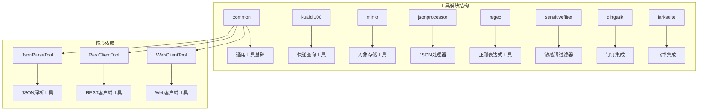
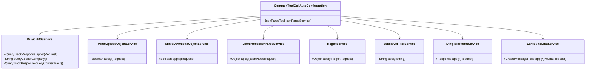
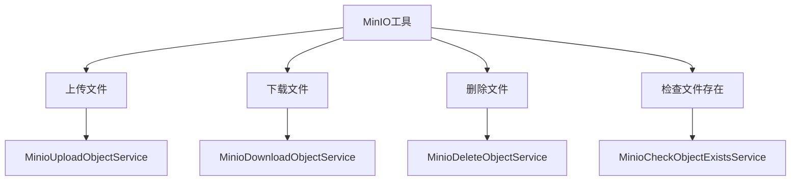
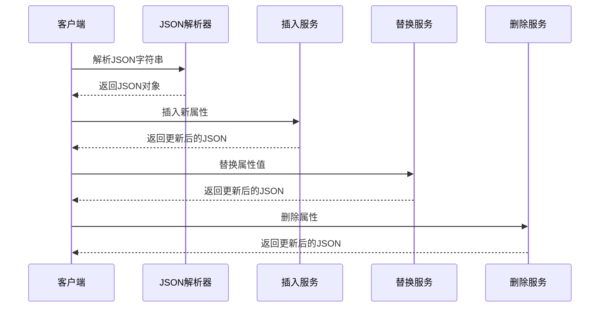
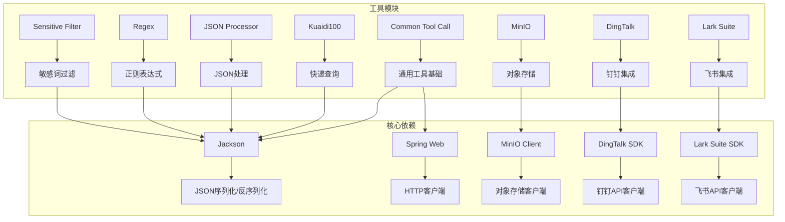

# 其他工具

<cite>
**本文档引用的文件**
- [CommonToolCallAutoConfiguration.java](file://community/tool-calls/spring-ai-alibaba-starter-tool-calling-common/src/main/java/com/alibaba/cloud/ai/toolcalling/common/CommonToolCallAutoConfiguration.java)
- [Kuaidi100Service.java](file://community/tool-calls/spring-ai-alibaba-starter-tool-calling-kuaidi100/src/main/java/com/alibaba/cloud/ai/toolcalling/kuaidi100/Kuaidi100Service.java)
- [Kuaidi100Properties.java](file://community/tool-calls/spring-ai-alibaba-starter-tool-calling-kuaidi100/src/main/java/com/alibaba/cloud/ai/toolcalling/kuaidi100/Kuaidi100Properties.java)
- [MinioUploadObjectService.java](file://community/tool-calls/spring-ai-alibaba-starter-tool-calling-minio/src/main/java/com/alibaba/cloud/ai/toolcalling/minio/MinioUploadObjectService.java)
- [MinioDownloadObjectService.java](file://community/tool-calls/spring-ai-alibaba-starter-tool-calling-minio/src/main/java/com/alibaba/cloud/ai/toolcalling/minio/MinioDownloadObjectService.java)
- [MinioProperties.java](file://community/tool-calls/spring-ai-alibaba-starter-tool-calling-minio/src/main/java/com/alibaba/cloud/ai/toolcalling/minio/MinioProperties.java)
- [JsonProcessorParseService.java](file://community/tool-calls/spring-ai-alibaba-starter-tool-calling-jsonprocessor/src/main/java/com/alibaba/cloud/ai/toolcalling/jsonprocessor/JsonProcessorParseService.java)
- [RegexService.java](file://community/tool-calls/spring-ai-alibaba-starter-tool-calling-regex/src/main/java/com/alibaba/cloud/ai/toolcalling/regex/RegexService.java)
- [SensitiveFilterService.java](file://community/tool-calls/spring-ai-alibaba-starter-tool-calling-sensitivefilter/src/main/java/com/alibaba/cloud/ai/toolcalling/sensitivefilter/SensitiveFilterService.java)
- [DingTalkRobotService.java](file://community/tool-calls/spring-ai-alibaba-starter-tool-calling-dingtalk/src/main/java/com/alibaba/cloud/ai/toolcalling/dingtalk/DingTalkRobotService.java)
- [LarkSuiteChatService.java](file://community/tool-calls/spring-ai-alibaba-starter-tool-calling-larksuite/src/main/java/com/alibaba/cloud/ai/toolcalling/larksuite/LarkSuiteChatService.java)
</cite>

## 目录
1. [简介](#简介)
2. [项目结构](#项目结构)
3. [核心组件](#核心组件)
4. [架构概览](#架构概览)
5. [详细组件分析](#详细组件分析)
6. [依赖关系分析](#依赖关系分析)
7. [性能考虑](#性能考虑)
8. [故障排除指南](#故障排除指南)
9. [结论](#结论)

## 简介

Spring AI Alibaba 提供了一套丰富的内置工具，涵盖了快递查询、对象存储、JSON处理器、正则表达式工具、敏感词过滤器、钉钉集成和飞书集成等多个领域。这些工具旨在简化开发者在构建AI应用时的各种常见任务，提供开箱即用的功能支持。

本文档将详细介绍这些工具的功能特性、配置参数、API端点和使用场景，并提供实际代码示例，展示如何在Spring Boot应用中启用和使用这些工具。

## 项目结构

Spring AI Alibaba 的工具模块采用模块化设计，每个工具都有独立的starter模块：



**图表来源**
- [CommonToolCallAutoConfiguration.java](file://community/tool-calls/spring-ai-alibaba-starter-tool-calling-common/src/main/java/com/alibaba/cloud/ai/toolcalling/common/CommonToolCallAutoConfiguration.java#L25-L35)

**章节来源**
- [CommonToolCallAutoConfiguration.java](file://community/tool-calls/spring-ai-alibaba-starter-tool-calling-common/src/main/java/com/alibaba/cloud/ai/toolcalling/common/CommonToolCallAutoConfiguration.java#L1-L35)

## 核心组件

### 通用工具基础

所有工具都基于通用的基础组件构建，提供了统一的配置管理和工具接口：

```java
@Configuration
public class CommonToolCallAutoConfiguration {
    @Bean
    @ConditionalOnMissingBean
    public JsonParseTool jsonParseService() {
        return new JsonParseTool();
    }
}
```

### 工具配置前缀

每个工具都有统一的配置前缀，便于管理和扩展：

```java
public static final String CONFIG_PREFIX = 
    CommonToolCallConstants.TOOL_CALLING_CONFIG_PREFIX + ".工具名称";
```

**章节来源**
- [CommonToolCallAutoConfiguration.java](file://community/tool-calls/spring-ai-alibaba-starter-tool-calling-common/src/main/java/com/alibaba/cloud/ai/toolcalling/common/CommonToolCallAutoConfiguration.java#L25-L35)

## 架构概览



**图表来源**
- [Kuaidi100Service.java](file://community/tool-calls/spring-ai-alibaba-starter-tool-calling-kuaidi100/src/main/java/com/alibaba/cloud/ai/toolcalling/kuaidi100/Kuaidi100Service.java#L33-L76)
- [MinioUploadObjectService.java](file://community/tool-calls/spring-ai-alibaba-starter-tool-calling-minio/src/main/java/com/alibaba/cloud/ai/toolcalling/minio/MinioUploadObjectService.java#L41-L68)
- [JsonProcessorParseService.java](file://community/tool-calls/spring-ai-alibaba-starter-tool-calling-jsonprocessor/src/main/java/com/alibaba/cloud/ai/toolcalling/jsonprocessor/JsonProcessorParseService.java#L33-L37)

## 详细组件分析

### 快递查询工具 (Kuaidi100)

#### 功能特性
- 实时快递跟踪查询
- 支持多种快递公司
- 自动识别快递单号类型
- MD5签名验证机制

#### 配置参数

```yaml
spring:
  ai:
    alibaba:
      plugin:
        kuaidi100:
          enabled: true
          api-key: ${KUAIDI100_KEY}
          app-id: ${KUAIDI100_CUSTOMER}
```

#### API端点

```java
public record Request(@JsonProperty(required = true, value = "num") String num) {}
```

#### 使用示例

```java
@Autowired
private Kuaidi100Service kuaidi100Service;

public void trackExpress() {
    Kuaidi100Service.QueryTrackResponse response = 
        kuaidi100Service.apply(new Kuaidi100Service.Request("YT2237659878059"));
    
    // 处理响应数据
    System.out.println("快递公司: " + response.com());
    System.out.println("物流状态: " + response.state());
    System.out.println("最新动态: " + response.data().get(0).context());
}
```

#### 认证方式
- API密钥认证
- 客户端ID认证
- MD5签名验证

#### 使用限制
- 每日调用次数限制
- 支持的快递公司列表有限制
- 需要有效的API密钥

**章节来源**
- [Kuaidi100Service.java](file://community/tool-calls/spring-ai-alibaba-starter-tool-calling-kuaidi100/src/main/java/com/alibaba/cloud/ai/toolcalling/kuaidi100/Kuaidi100Service.java#L33-L136)
- [Kuaidi100Properties.java](file://community/tool-calls/spring-ai-alibaba-starter-tool-calling-kuaidi100/src/main/java/com/alibaba/cloud/ai/toolcalling/kuaidi100/Kuaidi100Properties.java#L25-L42)

### 对象存储工具 (MinIO)

#### 功能特性
- 文件上传和下载
- 存储桶管理
- 对象存在性检查
- 文件删除操作

#### 支持的操作



**图表来源**
- [MinioUploadObjectService.java](file://community/tool-calls/spring-ai-alibaba-starter-tool-calling-minio/src/main/java/com/alibaba/cloud/ai/toolcalling/minio/MinioUploadObjectService.java#L41-L68)
- [MinioDownloadObjectService.java](file://community/tool-calls/spring-ai-alibaba-starter-tool-calling-minio/src/main/java/com/alibaba/cloud/ai/toolcalling/minio/MinioDownloadObjectService.java#L39-L62)

#### 配置参数

```yaml
spring:
  ai:
    alibaba:
      plugin:
        minio:
          enabled: true
          endpoint: http://localhost:9000
          access-key: minioadmin
          secret-key: minioadmin
```

#### 使用示例

```java
@Autowired
private MinioUploadObjectService uploadService;

@Autowired
private MinioDownloadObjectService downloadService;

public void manageFiles() {
    // 上传文件
    Boolean uploadResult = uploadService.apply(
        new MinioUploadObjectService.Request("bucket-name", "object-name", "local-file-path"));
    
    // 下载文件
    Boolean downloadResult = downloadService.apply(
        new MinioDownloadObjectService.Request("bucket-name", "object-name", "download-path"));
}
```

#### 依赖关系
- MinIO客户端库
- Jackson JSON处理库
- Spring Boot自动配置

**章节来源**
- [MinioUploadObjectService.java](file://community/tool-calls/spring-ai-alibaba-starter-tool-calling-minio/src/main/java/com/alibaba/cloud/ai/toolcalling/minio/MinioUploadObjectService.java#L1-L68)
- [MinioDownloadObjectService.java](file://community/tool-calls/spring-ai-alibaba-starter-tool-calling-minio/src/main/java/com/alibaba/cloud/ai/toolcalling/minio/MinioDownloadObjectService.java#L1-L62)
- [MinioProperties.java](file://community/tool-calls/spring-ai-alibaba-starter-tool-calling-minio/src/main/java/com/alibaba/cloud/ai/toolcalling/minio/MinioProperties.java#L1-L58)

### JSON处理器

#### 功能特性
- JSON对象解析
- 属性插入和替换
- 属性删除操作
- 嵌套JSON处理

#### 支持的操作



**图表来源**
- [JsonProcessorParseService.java](file://community/tool-calls/spring-ai-alibaba-starter-tool-calling-jsonprocessor/src/main/java/com/alibaba/cloud/ai/toolcalling/jsonprocessor/JsonProcessorParseService.java#L33-L37)

#### 使用示例

```java
@Autowired
private JsonProcessorParseService parseService;

@Autowired
private JsonProcessorInsertService insertService;

public void processJson() {
    String jsonContent = "{\"name\":\"John\",\"age\":30}";
    
    // 解析JSON属性
    String name = (String) parseService.apply(
        new JsonProcessorParseService.JsonParseRequest(jsonContent, "name"));
    
    // 插入新属性
    Object updatedJson = insertService.apply(
        new JsonProcessorInsertService.JsonInsertRequest(jsonContent, "city", "Beijing"));
}
```

**章节来源**
- [JsonProcessorParseService.java](file://community/tool-calls/spring-ai-alibaba-starter-tool-calling-jsonprocessor/src/main/java/com/alibaba/cloud/ai/toolcalling/jsonprocessor/JsonProcessorParseService.java#L1-L37)

### 正则表达式工具

#### 功能特性
- 正则表达式匹配
- 多个结果查找
- 分组捕获
- 灵活的模式配置

#### 使用示例

```java
@Autowired
private RegexService regexService;

public void findMatches() {
    String content = "Hello 123 World 456";
    Pattern pattern = Pattern.compile("\\d+");
    
    List<String> matches = (List<String>) regexService.apply(
        new RegexService.RegexRequest(content, pattern, 0));
    
    // matches: ["123", "456"]
}
```

**章节来源**
- [RegexService.java](file://community/tool-calls/spring-ai-alibaba-starter-tool-calling-regex/src/main/java/com/alibaba/cloud/ai/toolcalling/regex/RegexService.java#L1-L44)

### 敏感词过滤器

#### 功能特性
- 手机号码过滤
- 身份证号过滤
- 银行卡号过滤
- 邮箱地址过滤
- 自定义敏感词规则

#### 支持的过滤类型

```mermaid
graph LR
A[敏感词过滤器] --> B[手机号码]
A --> C[身份证号]
A --> D[银行卡号]
A --> E[邮箱地址]
A --> F[自定义规则]
B --> G[13912345678]
C --> H[110101199001011234]
D --> I[4123456789012345]
E --> J[zhangsan@example.com]
F --> K[自定义模式]
```

**图表来源**
- [SensitiveFilterService.java](file://community/tool-calls/spring-ai-alibaba-starter-tool-calling-sensitivefilter/src/main/java/com/alibaba/cloud/ai/toolcalling/sensitivefilter/SensitiveFilterService.java#L42-L81)

#### 配置示例

```yaml
spring:
  ai:
    alibaba:
      plugin:
        sensitivefilter:
          enabled: true
          replacement: "[已脱敏]"
          filter-phone-number: true
          filter-id-card: true
          filter-bank-card: true
          filter-email: true
          custom-patterns:
            - name: qq
              pattern: QQ[：:]?\\d{5,11}
              replacement: "[QQ号]"
              enabled: true
```

#### 使用示例

```java
@Autowired
private SensitiveFilterService filterService;

public void filterSensitiveData() {
    String text = """
        用户信息：
        姓名：张三
        手机：13912345678
        邮箱：zhangsan@example.com
        """;
    
    String filteredText = filterService.apply(text);
    // 输出：用户信息：姓名：张三 手机：[已脱敏] 邮箱：[已脱敏]
}
```

**章节来源**
- [SensitiveFilterService.java](file://community/tool-calls/spring-ai-alibaba-starter-tool-calling-sensitivefilter/src/main/java/com/alibaba/cloud/ai/toolcalling/sensitivefilter/SensitiveFilterService.java#L1-L81)

### 钉钉集成

#### 功能特性
- 自定义机器人消息发送
- 群聊消息通知
- 签名验证机制
- 多种消息格式支持

#### 配置参数

```yaml
spring:
  ai:
    alibaba:
      plugin:
        dingtalk:
          enabled: true
          custom-robot-access-token: ${DINGTALK_CUSTOM_ACCESS_TOKEN}
          custom-robot-signature: ${DINGTALK_CUSTOM_SIGNATURE}
```

#### 使用示例

```java
@Autowired
private DingTalkRobotService dingTalkService;

public void sendMessage() {
    DingTalkRobotService.Response response = dingTalkService.apply(
        new DingTalkRobotService.Request("系统告警：服务器负载过高"));
    
    if (response != null) {
        System.out.println("消息发送成功：" + response.message());
    }
}
```

**章节来源**
- [DingTalkRobotService.java](file://community/tool-calls/spring-ai-alibaba-starter-tool-calling-dingtalk/src/main/java/com/alibaba/cloud/ai/toolcalling/dingtalk/DingTalkRobotService.java#L39-L84)

### 飞书集成

#### 功能特性
- IM消息发送
- 多接收者支持
- 消息类型多样化
- 请求ID追踪

#### 使用示例

```java
@Autowired
private LarkSuiteChatService larkSuiteService;

public void sendLarkMessage() {
    CreateMessageResp response = larkSuiteService.apply(
        new LarkSuiteChatService.IMChatRequest(
            "ou_1234567890", // 接收者ID
            "open_id",       // 接收者类型
            "text",          // 消息类型
            "{\"text\":\"飞书消息测试\"}", // 消息内容
            "uuid-123456"    // 可选UUID
        ));
    
    if (response.success()) {
        System.out.println("飞书消息发送成功");
    }
}
```

**章节来源**
- [LarkSuiteChatService.java](file://community/tool-calls/spring-ai-alibaba-starter-tool-calling-larksuite/src/main/java/com/alibaba/cloud/ai/toolcalling/larksuite/LarkSuiteChatService.java#L37-L81)

## 依赖关系分析



**图表来源**
- [CommonToolCallAutoConfiguration.java](file://community/tool-calls/spring-ai-alibaba-starter-tool-calling-common/src/main/java/com/alibaba/cloud/ai/toolcalling/common/CommonToolCallAutoConfiguration.java#L25-L35)

**章节来源**
- [CommonToolCallAutoConfiguration.java](file://community/tool-calls/spring-ai-alibaba-starter-tool-calling-common/src/main/java/com/alibaba/cloud/ai/toolcalling/common/CommonToolCallAutoConfiguration.java#L1-L35)

## 性能考虑

### 缓存策略
- JSON解析结果缓存
- 正则表达式编译缓存
- 敏感词模式预编译

### 异步处理
- 大文件上传下载异步化
- 批量敏感词过滤优化
- 异步消息发送

### 连接池管理
- HTTP客户端连接复用
- 数据库连接池优化
- Redis连接池配置

## 故障排除指南

### 常见问题

#### 1. 快递查询失败
**症状**: Kuaidi100 API调用返回错误
**解决方案**:
- 检查API密钥和客户ID配置
- 验证快递单号格式正确性
- 确认目标快递公司支持查询

#### 2. MinIO连接失败
**症状**: 对象存储操作抛出连接异常
**解决方案**:
- 验证MinIO服务器地址和端口
- 检查访问密钥和秘密密钥
- 确认网络连通性和防火墙设置

#### 3. 敏感词过滤性能问题
**症状**: 大文本处理耗时过长
**解决方案**:
- 启用异步处理模式
- 优化自定义敏感词规则
- 考虑分块处理大文本

#### 4. 钉钉消息发送失败
**症状**: 消息发送接口返回错误
**解决方案**:
- 验证机器人访问令牌
- 检查签名验证配置
- 确认群组权限设置

**章节来源**
- [Kuaidi100Service.java](file://community/tool-calls/spring-ai-alibaba-starter-tool-calling-kuaidi100/src/main/java/com/alibaba/cloud/ai/toolcalling/kuaidi100/Kuaidi100Service.java#L50-L76)
- [MinioUploadObjectService.java](file://community/tool-calls/spring-ai-alibaba-starter-tool-calling-minio/src/main/java/com/alibaba/cloud/ai/toolcalling/minio/MinioUploadObjectService.java#L41-L68)

## 结论

Spring AI Alibaba 提供了一套完整且功能强大的工具集合，涵盖了现代AI应用开发中的各种常见需求。通过模块化的架构设计和统一的配置管理，开发者可以轻松地在项目中集成这些工具，大大提高了开发效率和应用功能的丰富性。

主要优势包括：
- **开箱即用**: 每个工具都提供了完整的starter模块
- **配置灵活**: 支持环境变量和配置文件两种配置方式
- **易于扩展**: 统一的架构便于添加新的工具类型
- **性能优化**: 内置缓存和异步处理机制
- **错误处理**: 完善的异常处理和日志记录

建议在实际项目中根据具体需求选择合适的工具组合，并注意合理配置以获得最佳性能表现。