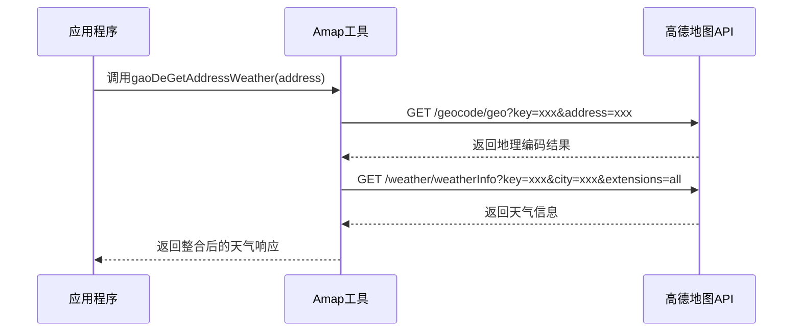
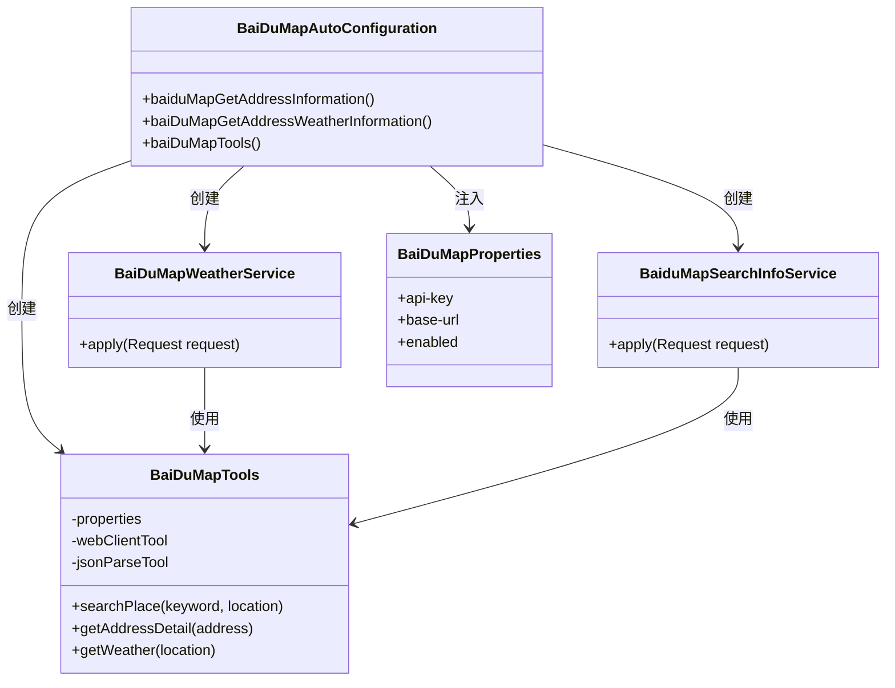
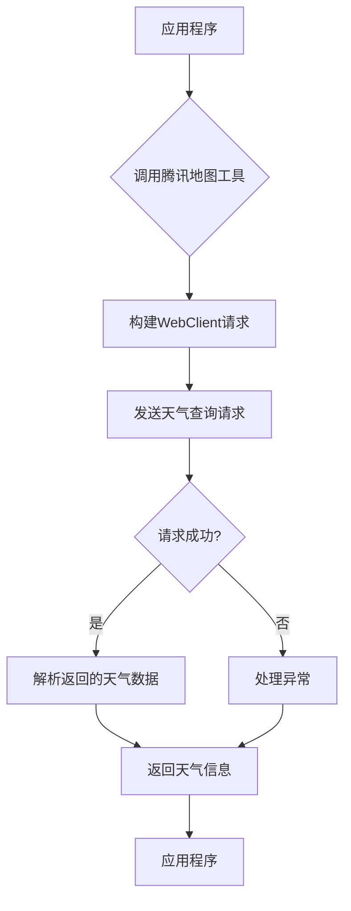
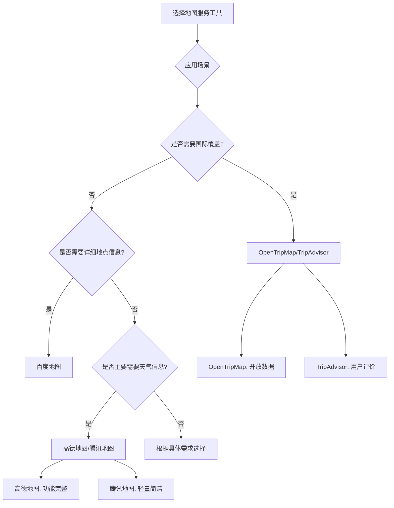

# 地图服务工具

<cite>
**本文档引用的文件**
- [AmapAutoConfiguration.java](file://community/tool-calls/spring-ai-alibaba-starter-tool-calling-amap/src/main/java/com/alibaba/cloud/ai/toolcalling/amp/AmapAutoConfiguration.java)
- [AmapProperties.java](file://community/tool-calls/spring-ai-alibaba-starter-tool-calling-amap/src/main/java/com/alibaba/cloud/ai/toolcalling/amp/AmapProperties.java)
- [AmapConstants.java](file://community/tool-calls/spring-ai-alibaba-starter-tool-calling-amap/src/main/java/com/alibaba/cloud/ai/toolcalling/amp/AmapConstants.java)
- [WeatherSearchService.java](file://community/tool-calls/spring-ai-alibaba-starter-tool-calling-amap/src/main/java/com/alibaba/cloud/ai/toolcalling/amp/WeatherSearchService.java)
- [BaiduMapAutoConfiguration.java](file://community/tool-calls/spring-ai-alibaba-starter-tool-calling-baidumap/src/main/java/com/alibaba/cloud/ai/toolcalling/baidumap/BaiduMapAutoConfiguration.java)
- [BaiDuMapProperties.java](file://community/tool-calls/spring-ai-alibaba-starter-tool-calling-baidumap/src/main/java/com/alibaba/cloud/ai/toolcalling/baidumap/BaiDuMapProperties.java)
- [BaiduMapConstants.java](file://community/tool-calls/spring-ai-alibaba-starter-tool-calling-baidumap/src/main/java/com/alibaba/cloud/ai/toolcalling/baidumap/BaiduMapConstants.java)
- [TencentMapAutoConfiguration.java](file://community/tool-calls/spring-ai-alibaba-starter-tool-calling-tencentmap/src/main/java/com/alibaba/cloud/ai/toolcalling/tencentmap/TencentMapAutoConfiguration.java)
- [TencentMapConstants.java](file://community/tool-calls/spring-ai-alibaba-starter-tool-calling-tencentmap/src/main/java/com/alibaba/cloud/ai/toolcalling/tencentmap/TencentMapConstants.java)
- [OpenTripMapAutoConfiguration.java](file://community/tool-calls/spring-ai-alibaba-starter-tool-calling-opentripmap/src/main/java/com/alibaba/cloud/ai/toolcalling/opentripmap/OpenTripMapAutoConfiguration.java)
- [OpenTripMapConstants.java](file://community/tool-calls/spring-ai-alibaba-starter-tool-calling-opentripmap/src/main/java/com/alibaba/cloud/ai/toolcalling/opentripmap/OpenTripMapConstants.java)
</cite>

## 目录
1. [简介](#简介)
2. [高德地图(Amap)工具](#高德地图amap工具)
3. [百度地图(Baidumap)工具](#百度地图baidumap工具)
4. [腾讯地图(Tencentmap)工具](#腾讯地图tencentmap工具)
5. [OpenTripMap工具](#opentripmap工具)
6. [TripAdvisor工具](#tripadvisor工具)
7. [各地图服务工具对比](#各地图服务工具对比)
8. [Spring Boot应用中的使用示例](#spring-boot应用中的使用示例)
9. [总结](#总结)

## 简介
本文档全面记录了Spring AI Alibaba项目中集成的地图服务内置工具，包括高德地图(Amap)、百度地图(Baidumap)、腾讯地图(Tencentmap)、OpenTripMap和TripAdvisor等。文档详细说明了每个地图服务工具的功能特性、配置参数、API端点和使用场景，并提供了在Spring Boot应用中启用和使用这些工具的实际代码示例。

这些地图服务工具作为Spring Boot Starter组件，通过自动配置机制集成到Spring应用中，为开发者提供了一致的API接口来访问不同的地图服务。每个工具都封装了特定地图服务的REST API调用，简化了地理编码、逆地理编码、天气查询和地点搜索等功能的实现。

**Section sources**
- [AmapAutoConfiguration.java](file://community/tool-calls/spring-ai-alibaba-starter-tool-calling-amap/src/main/java/com/alibaba/cloud/ai/toolcalling/amp/AmapAutoConfiguration.java#L1-L45)
- [BaiduMapAutoConfiguration.java](file://community/tool-calls/spring-ai-alibaba-starter-tool-calling-baidumap/src/main/java/com/alibaba/cloud/ai/toolcalling/baidumap/BaiduMapAutoConfiguration.java#L1-L66)

## 高德地图(Amap)工具

### 功能特性
高德地图工具主要提供天气信息查询功能，通过地址获取对应城市的天气状况。该工具实现了以下核心功能：
- 根据输入的地址进行地理编码，获取城市代码
- 使用城市代码查询该地区的天气信息
- 支持扩展天气信息（包括实时天气和预报）

### 配置参数
高德地图工具的配置参数通过`AmapProperties`类定义，主要配置项如下：

| 配置项 | 说明 |
|-------|------|
| `tool-calling.amap.enabled` | 是否启用高德地图工具，默认为true |
| `tool-calling.amap.api-key` | 高德地图API密钥 |
| `tool-calls.amap.base-url` | API基础URL，默认为https://restapi.amap.com/v3 |

环境变量`GAODE_AMAP_API_KEY`可用于设置API密钥。

### API端点和使用场景
高德地图工具主要使用两个API端点：
1. `/geocode/geo` - 地理编码API，用于将地址转换为经纬度和城市代码
2. `/weather/weatherInfo` - 天气信息API，用于获取指定城市的天气数据

使用场景包括：
- 根据用户输入的地址查询当地天气
- 在旅行应用中提供目的地天气信息
- 智能家居系统根据位置自动调整设备设置



**Diagram sources**
- [WeatherSearchService.java](file://community/tool-calls/spring-ai-alibaba-starter-tool-calling-amap/src/main/java/com/alibaba/cloud/ai/toolcalling/amp/WeatherSearchService.java#L1-L104)
- [AmapAutoConfiguration.java](file://community/tool-calls/spring-ai-alibaba-starter-tool-calling-amap/src/main/java/com/alibaba/cloud/ai/toolcalling/amp/AmapAutoConfiguration.java#L1-L45)

**Section sources**
- [AmapAutoConfiguration.java](file://community/tool-calls/spring-ai-alibaba-starter-tool-calling-amap/src/main/java/com/alibaba/cloud/ai/toolcalling/amp/AmapAutoConfiguration.java#L1-L45)
- [AmapProperties.java](file://community/tool-calls/spring-ai-alibaba-starter-tool-calling-amap/src/main/java/com/alibaba/cloud/ai/toolcalling/amp/AmapProperties.java#L1-L33)
- [AmapConstants.java](file://community/tool-calls/spring-ai-alibaba-starter-tool-calling-amap/src/main/java/com/alibaba/cloud/ai/toolcalling/amp/AmapConstants.java#L1-L32)
- [WeatherSearchService.java](file://community/tool-calls/spring-ai-alibaba-starter-tool-calling-amap/src/main/java/com/alibaba/cloud/ai/toolcalling/amp/WeatherSearchService.java#L1-L104)

## 百度地图(Baidumap)工具

### 功能特性
百度地图工具提供了更丰富的功能，包括：
- 地点搜索：根据关键词搜索地点信息
- 地址详情获取：获取特定地址的详细信息
- 天气查询：查询指定位置的天气状况
- 设施查询：查询特定地点的周边设施

### 配置参数
百度地图工具的配置参数通过`BaiDuMapProperties`类定义，主要配置项如下：

| 配置项 | 说明 |
|-------|------|
| `tool-calling.baidu.map.enabled` | 是否启用百度地图工具，默认为true |
| `tool-calling.baidu.map.api-key` | 百度地图API密钥 |
| `tool-calls.baidu.map.base-url` | API基础URL，默认为https://api.map.baidu.com/ |

环境变量`BAIDU_MAP_API_KEY`可用于设置API密钥。

### API端点和使用场景
百度地图工具支持多种API调用，主要功能通过两个工具Bean提供：
1. `baiduMapGetAddressInformation` - 用于地点搜索和地址详情获取
2. `baiDuMapGetAddressWeatherInformation` - 用于天气信息查询

使用场景包括：
- 在本地生活服务应用中搜索餐厅、商店等地点
- 获取某个地址的详细地理信息
- 查询用户所在位置的天气情况
- 旅游应用中的景点搜索和详情展示



**Diagram sources**
- [BaiduMapAutoConfiguration.java](file://community/tool-calls/spring-ai-alibaba-starter-tool-calling-baidumap/src/main/java/com/alibaba/cloud/ai/toolcalling/baidumap/BaiduMapAutoConfiguration.java#L1-L66)
- [BaiDuMapProperties.java](file://community/tool-calls/spring-ai-alibaba-starter-tool-calling-baidumap/src/main/java/com/alibaba/cloud/ai/toolcalling/baidumap/BaiDuMapProperties.java#L1-L38)

**Section sources**
- [BaiduMapAutoConfiguration.java](file://community/tool-calls/spring-ai-alibaba-starter-tool-calling-baidumap/src/main/java/com/alibaba/cloud/ai/toolcalling/baidumap/BaiduMapAutoConfiguration.java#L1-L66)
- [BaiDuMapProperties.java](file://community/tool-calls/spring-ai-alibaba-starter-tool-calling-baidumap/src/main/java/com/alibaba/cloud/ai/toolcalling/baidumap/BaiDuMapProperties.java#L1-L38)
- [BaiduMapConstants.java](file://community/tool-calls/spring-ai-alibaba-starter-tool-calling-baidumap/src/main/java/com/alibaba/cloud/ai/toolcalling/baidumap/BaiduMapConstants.java#L1-L35)

## 腾讯地图(Tencentmap)工具

### 功能特性
腾讯地图工具专注于天气信息查询功能，主要特性包括：
- 根据位置查询天气状况
- 支持精确的地理位置天气查询
- 提供简洁的API接口

### 配置参数
腾讯地图工具的配置参数与其他地图工具类似，主要配置项如下：

| 配置项 | 说明 |
|-------|------|
| `tool-calling.tencent.map.enabled` | 是否启用腾讯地图工具，默认为true |
| `tool-calling.tencent.map.api-key` | 腾讯地图API密钥 |
| `tool-calls.tencent.map.base-url` | API基础URL |

环境变量`TENCENT_MAP_API_KEY`可用于设置API密钥。

### API端点和使用场景
腾讯地图工具主要提供天气查询功能，通过`tencentMapGetAddressWeatherInformation`工具Bean实现。

使用场景包括：
- 移动应用中的天气功能模块
- 基于位置的服务应用
- 智能设备的位置相关功能



**Diagram sources**
- [TencentMapAutoConfiguration.java](file://community/tool-calls/spring-ai-alibaba-starter-tool-calling-tencentmap/src/main/java/com/alibaba/cloud/ai/toolcalling/tencentmap/TencentMapAutoConfiguration.java#L1-L49)
- [TencentMapConstants.java](file://community/tool-calls/spring-ai-alibaba-starter-tool-calling-tencentmap/src/main/java/com/alibaba/cloud/ai/toolcalling/tencentmap/TencentMapConstants.java#L1-L33)

**Section sources**
- [TencentMapAutoConfiguration.java](file://community/tool-calls/spring-ai-alibaba-starter-tool-calling-tencentmap/src/main/java/com/alibaba/cloud/ai/toolcalling/tencentmap/TencentMapAutoConfiguration.java#L1-L49)
- [TencentMapConstants.java](file://community/tool-calls/spring-ai-alibaba-starter-tool-calling-tencentmap/src/main/java/com/alibaba/cloud/ai/toolcalling/tencentmap/TencentMapConstants.java#L1-L33)

## OpenTripMap工具

### 功能特性
OpenTripMap工具提供开放的旅游地图服务，主要功能包括：
- 地点搜索：搜索全球范围内的旅游景点
- 地点详情获取：获取特定地点的详细信息
- 坐标查询：根据地点名称查找地理坐标

### 配置参数
OpenTripMap工具的配置参数如下：

| 配置项 | 说明 |
|-------|------|
| `tool-calling.opentripmap.enabled` | 是否启用OpenTripMap工具，默认为true |
| `tool-calling.opentripmap.api-key` | OpenTripMap API密钥 |
| `tool-calls.opentripmap.base-url` | API基础URL，默认为https://api.opentripmap.com/0.1/en |

环境变量`OPENTRIPMAP_API_KEY`可用于设置API密钥。

### API端点和使用场景
OpenTripMap工具通过`openTripMapService`工具Bean提供服务，适用于国际化的旅游应用和跨区域的位置服务。

使用场景包括：
- 国际旅游应用中的景点搜索
- 跨国企业的位置服务
- 全球性的地理信息应用

**Section sources**
- [OpenTripMapAutoConfiguration.java](file://community/tool-calls/spring-ai-alibaba-starter-tool-calling-opentripmap/src/main/java/com/alibaba/cloud/ai/toolcalling/opentripmap/OpenTripMapAutoConfiguration.java#L1-L49)
- [OpenTripMapConstants.java](file://community/tool-calls/spring-ai-alibaba-starter-tool-calling-opentripmap/src/main/java/com/alibaba/cloud/ai/toolcalling/opentripmap/OpenTripMapConstants.java#L1-L36)

## TripAdvisor工具

### 功能特性
虽然项目结构中存在TripAdvisor工具模块，但根据现有代码分析，其具体实现细节未完全展现。基于命名约定和项目模式，可以推断TripAdvisor工具可能具备以下功能：
- 旅游景点评分和评论查询
- 酒店和餐厅信息获取
- 旅游目的地推荐

### 配置参数
预计的配置参数可能包括：
- API密钥配置
- 服务启用开关
- 基础URL设置

由于具体实现代码未提供，详细配置项无法确定。

### 使用场景
TripAdvisor工具预期适用于：
- 旅游预订平台
- 餐饮推荐应用
- 旅行规划工具

**Section sources**
- [tripadvisor](file://community/tool-calls/spring-ai-alibaba-starter-tool-calling-tripadvisor)

## 各地图服务工具对比

### 功能对比
| 功能/工具 | 高德地图 | 百度地图 | 腾讯地图 | OpenTripMap | TripAdvisor |
|---------|--------|--------|--------|-----------|-----------|
| 地理编码 | ✓ | ✓ | ✓ | ✓ | ? |
| 逆地理编码 | ✓ | ✓ | ✓ | ✓ | ? |
| 天气查询 | ✓ | ✓ | ✓ | ✗ | ? |
| 位置搜索 | ✗ | ✓ | ✗ | ✓ | ✓ |
| 地点详情 | ✗ | ✓ | ✗ | ✓ | ✓ |
| 路线规划 | ✗ | ✗ | ✗ | ✗ | ? |
| 国际覆盖 | 主要中国 | 主要中国 | 主要中国 | 全球 | 全球 |

### 认证方式
所有地图服务工具都采用类似的认证方式：
- API密钥认证
- 通过环境变量或配置文件设置密钥
- 统一的配置前缀`tool-calling.{service}.api-key`

### 速率限制
各服务的具体速率限制取决于其API提供商的政策：
- 高德地图：免费版有每日调用次数限制
- 百度地图：根据API密钥类型有不同的调用配额
- 腾讯地图：按小时和每日的调用限制
- OpenTripMap：免费账户有调用频率限制
- TripAdvisor：商业API通常有严格的调用限制

### 适用场景分析
- **高德地图**：适合需要精确天气信息的中国地区应用
- **百度地图**：适合需要丰富地点搜索功能的本地生活服务应用
- **腾讯地图**：适合轻量级的天气查询需求
- **OpenTripMap**：适合需要全球覆盖的旅游相关应用
- **TripAdvisor**：适合需要用户评价和评分的旅游服务应用



**Diagram sources**
- [AmapAutoConfiguration.java](file://community/tool-calls/spring-ai-alibaba-starter-tool-calling-amap/src/main/java/com/alibaba/cloud/ai/toolcalling/amp/AmapAutoConfiguration.java#L1-L45)
- [BaiduMapAutoConfiguration.java](file://community/tool-calls/spring-ai-alibaba-starter-tool-calling-baidumap/src/main/java/com/alibaba/cloud/ai/toolcalling/baidumap/BaiduMapAutoConfiguration.java#L1-L66)
- [TencentMapAutoConfiguration.java](file://community/tool-calls/spring-ai-alibaba-starter-tool-calling-tencentmap/src/main/java/com/alibaba/cloud/ai/toolcalling/tencentmap/TencentMapAutoConfiguration.java#L1-L49)

## Spring Boot应用中的使用示例

### 依赖配置
在`pom.xml`中添加相应的地图服务工具依赖：

```xml
<!-- 高德地图工具 -->
<dependency>
    <groupId>com.alibaba.cloud</groupId>
    <artifactId>spring-ai-alibaba-starter-tool-calling-amap</artifactId>
</dependency>

<!-- 百度地图工具 -->
<dependency>
    <groupId>com.alibaba.cloud</groupId>
    <artifactId>spring-ai-alibaba-starter-tool-calling-baidumap</artifactId>
</dependency>

<!-- 腾讯地图工具 -->
<dependency>
    <groupId>com.alibaba.cloud</groupId>
    <artifactId>spring-ai-alibaba-starter-tool-calling-tencentmap</artifactId>
</dependency>

<!-- OpenTripMap工具 -->
<dependency>
    <groupId>com.alibaba.cloud</groupId>
    <artifactId>spring-ai-alibaba-starter-tool-calling-opentripmap</artifactId>
</dependency>
```

### 配置文件设置
在`application.yml`中配置地图服务参数：

```yaml
tool-calling:
  amap:
    enabled: true
    api-key: your-gaode-api-key
  baidu:
    map:
      enabled: true
      api-key: your-baidu-api-key
  tencent:
    map:
      enabled: true
      api-key: your-tencent-api-key
  opentripmap:
    enabled: true
    api-key: your-opentripmap-api-key
```

### 代码使用示例
```java
@Service
public class LocationService {
    
    @Autowired
    @Qualifier("gaoDeGetAddressWeather")
    private Function<WeatherSearchService.Request, WeatherSearchService.Response> amapWeatherService;
    
    @Autowired
    @Qualifier("baiduMapGetAddressInformation")
    private Function<BaiduMapSearchInfoService.Request, BaiduMapSearchInfoService.Response> baiduMapService;
    
    @Autowired
    @Qualifier("tencentMapGetAddressWeatherInformation")
    private Function<TencentMapWeatherService.Request, TencentMapWeatherService.Response> tencentMapService;
    
    @Autowired
    @Qualifier("openTripMapService")
    private Function<OpenTripMapService.Request, OpenTripMapService.Response> openTripMapService;
    
    public String getWeatherByAddress(String address) {
        WeatherSearchService.Request request = new WeatherSearchService.Request(address);
        WeatherSearchService.Response response = amapWeatherService.apply(request);
        return response.message();
    }
    
    public String searchPlace(String keyword) {
        BaiduMapSearchInfoService.Request request = 
            new BaiduMapSearchInfoService.Request(keyword);
        BaiduMapSearchInfoService.Response response = baiduMapService.apply(request);
        return response.result();
    }
}
```

**Section sources**
- [AmapAutoConfiguration.java](file://community/tool-calls/spring-ai-alibaba-starter-tool-calling-amap/src/main/java/com/alibaba/cloud/ai/toolcalling/amp/AmapAutoConfiguration.java#L1-L45)
- [BaiduMapAutoConfiguration.java](file://community/tool-calls/spring-ai-alibaba-starter-tool-calling-baidumap/src/main/java/com/alibaba/cloud/ai/toolcalling/baidumap/BaiduMapAutoConfiguration.java#L1-L66)
- [TencentMapAutoConfiguration.java](file://community/tool-calls/spring-ai-alibaba-starter-tool-calling-tencentmap/src/main/java/com/alibaba/cloud/ai/toolcalling/tencentmap/TencentMapAutoConfiguration.java#L1-L49)
- [OpenTripMapAutoConfiguration.java](file://community/tool-calls/spring-ai-alibaba-starter-tool-calling-opentripmap/src/main/java/com/alibaba/cloud/ai/toolcalling/opentripmap/OpenTripMapAutoConfiguration.java#L1-L49)

## 总结
本文档详细介绍了Spring AI Alibaba项目中集成的各类地图服务工具，包括高德地图、百度地图、腾讯地图、OpenTripMap和TripAdvisor等。这些工具通过统一的架构设计，为Spring Boot应用提供了便捷的地图服务集成能力。

各地图服务工具的主要特点：
- **高德地图**：专注于天气信息查询，适合需要精确天气数据的应用场景
- **百度地图**：功能最为丰富，支持地点搜索、地址详情和天气查询等多种功能
- **腾讯地图**：接口简洁，适合轻量级的天气查询需求
- **OpenTripMap**：提供全球覆盖的旅游地图服务，适合国际化应用
- **TripAdvisor**：预期提供用户评价和评分数据，适合旅游服务类应用

在选择地图服务工具时，应根据具体的应用场景、功能需求和地域覆盖范围进行权衡。对于中国地区的应用，高德地图和百度地图是更好的选择；对于需要全球覆盖的旅游应用，OpenTripMap和TripAdvisor更为合适。

所有工具都遵循Spring Boot自动配置的最佳实践，通过简单的依赖引入和配置即可快速集成到应用中，大大降低了开发复杂度。

**Section sources**
- [AmapAutoConfiguration.java](file://community/tool-calls/spring-ai-alibaba-starter-tool-calling-amap/src/main/java/com/alibaba/cloud/ai/toolcalling/amp/AmapAutoConfiguration.java#L1-L45)
- [BaiduMapAutoConfiguration.java](file://community/tool-calls/spring-ai-alibaba-starter-tool-calling-baidumap/src/main/java/com/alibaba/cloud/ai/toolcalling/baidumap/BaiduMapAutoConfiguration.java#L1-L66)
- [TencentMapAutoConfiguration.java](file://community/tool-calls/spring-ai-alibaba-starter-tool-calling-tencentmap/src/main/java/com/alibaba/cloud/ai/toolcalling/tencentmap/TencentMapAutoConfiguration.java#L1-L49)
- [OpenTripMapAutoConfiguration.java](file://community/tool-calls/spring-ai-alibaba-starter-tool-calling-opentripmap/src/main/java/com/alibaba/cloud/ai/toolcalling/opentripmap/OpenTripMapAutoConfiguration.java#L1-L49)