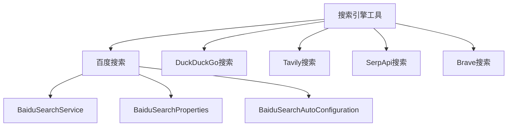
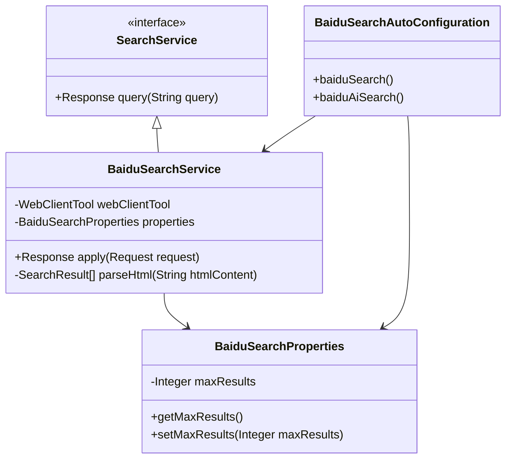
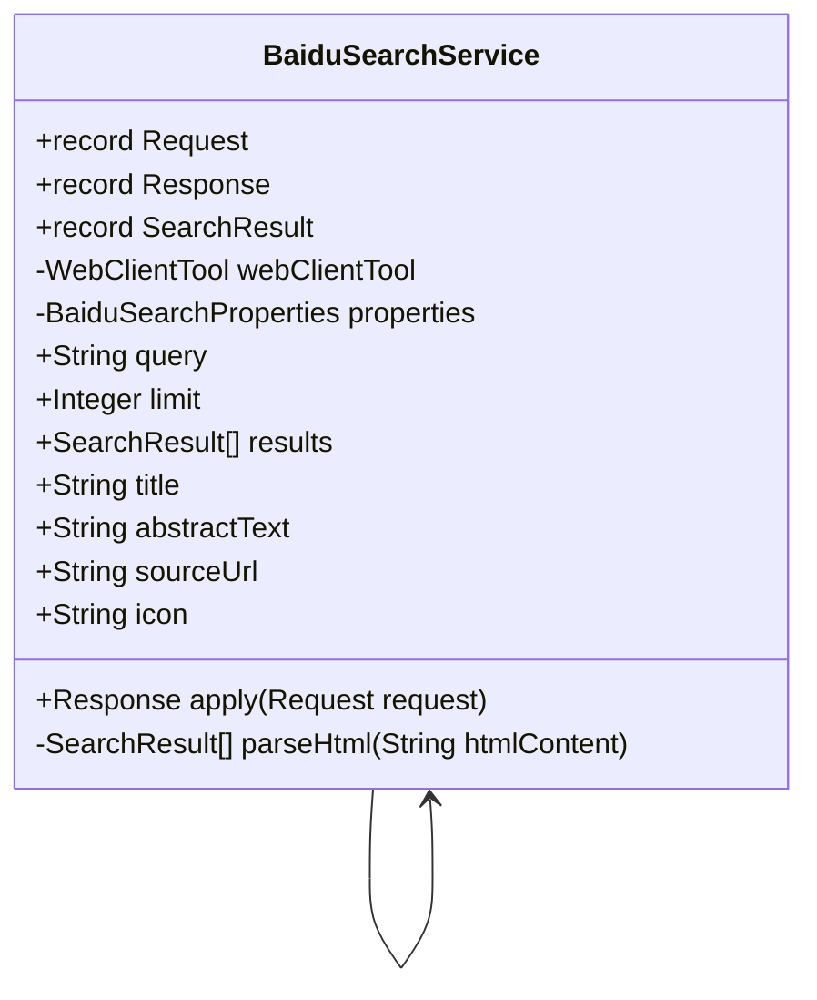
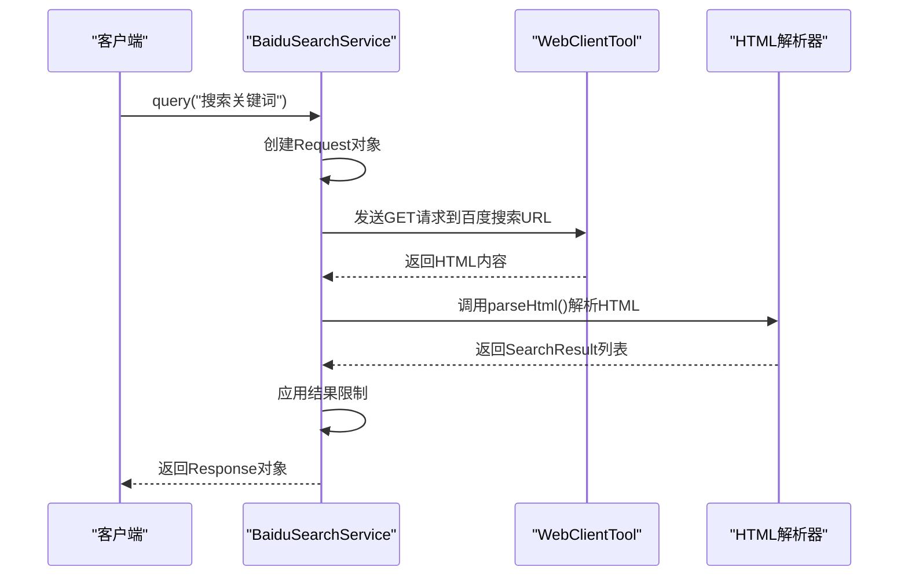
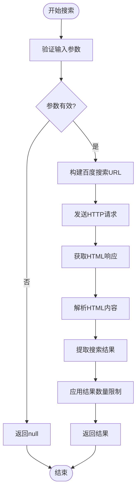
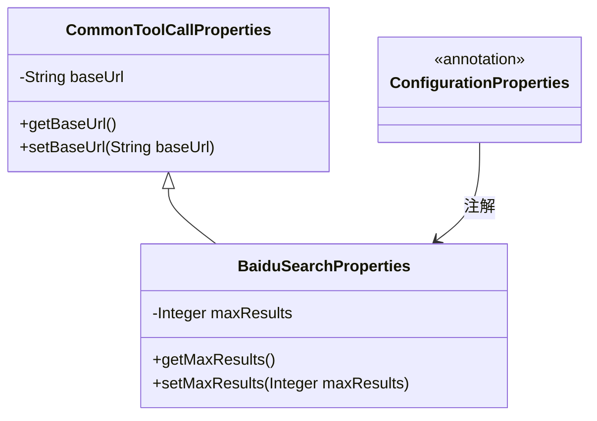
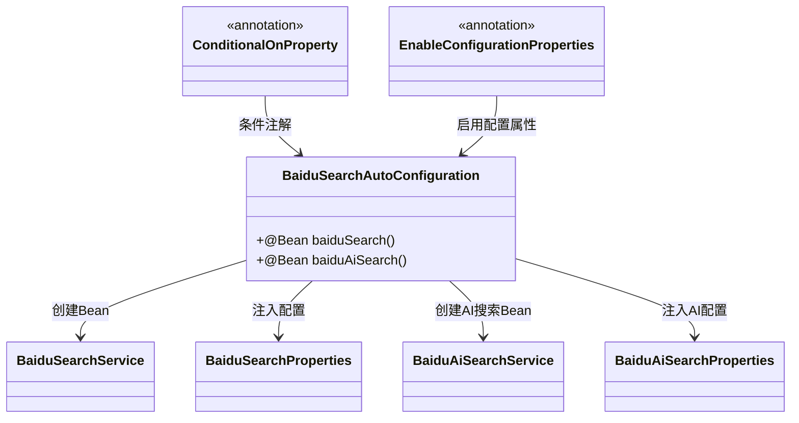
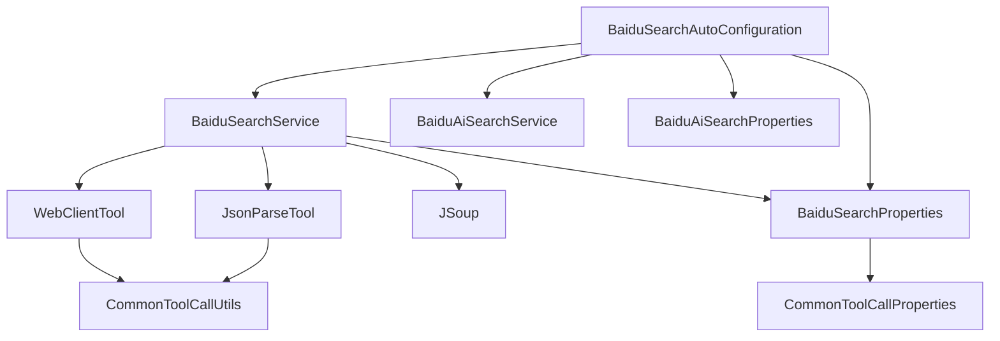

# 搜索引擎工具

<cite>
**本文档引用的文件**
- [BaiduSearchService.java](file://community/tool-calls/spring-ai-alibaba-starter-tool-calling-baidusearch/src/main/java/com/alibaba/cloud/ai/toolcalling/baidusearch/BaiduSearchService.java)
- [BaiduSearchProperties.java](file://community/tool-calls/spring-ai-alibaba-starter-tool-calling-baidusearch/src/main/java/com/alibaba/cloud/ai/toolcalling/baidusearch/BaiduSearchProperties.java)
- [BaiduSearchAutoConfiguration.java](file://community/tool-calls/spring-ai-alibaba-starter-tool-calling-baidusearch/src/main/java/com/alibaba/cloud/ai/toolcalling/baidusearch/BaiduSearchAutoConfiguration.java)
- [BaiduSearchConstants.java](file://community/tool-calls/spring-ai-alibaba-starter-tool-calling-baidusearch/src/main/java/com/alibaba/cloud/ai/toolcalling/baidusearch/BaiduSearchConstants.java)
- [CommonToolCallUtils.java](file://community/tool-calls/spring-ai-alibaba-starter-tool-calling-common/src/main/java/com/alibaba/cloud/ai/toolcalling/common/CommonToolCallUtils.java)
- [WebClientTool.java](file://community/tool-calls/spring-ai-alibaba-starter-tool-calling-common/src/main/java/com/alibaba/cloud/ai/toolcalling/common/WebClientTool.java)
</cite>

## 目录
1. [引言](#引言)
2. [项目结构](#项目结构)
3. [核心组件](#核心组件)
4. [架构概述](#架构概述)
5. [详细组件分析](#详细组件分析)
6. [依赖分析](#依赖分析)
7. [性能考虑](#性能考虑)
8. [故障排除指南](#故障排除指南)
9. [结论](#结论)

## 引言
本文档全面记录了Spring AI Alibaba项目中搜索引擎内置工具的功能和使用方法。重点分析了百度搜索（BaiduSearch）工具的实现，包括其功能特性、配置参数、API端点和使用场景。文档提供了在Spring Boot应用中启用和使用这些搜索引擎工具的实际代码示例，并涵盖了各工具的依赖关系、认证方式、查询参数和速率限制等重要信息。

## 项目结构
搜索引擎工具模块位于项目的`community/tool-calls`目录下，每个搜索引擎都有独立的starter模块。百度搜索工具的具体实现位于`spring-ai-alibaba-starter-tool-calling-baidusearch`模块中，包含服务类、配置属性和自动配置类。

**图源**
- [BaiduSearchService.java](file://community/tool-calls/spring-ai-alibaba-starter-tool-calling-baidusearch/src/main/java/com/alibaba/cloud/ai/toolcalling/baidusearch/BaiduSearchService.java)
- [BaiduSearchProperties.java](file://community/tool-calls/spring-ai-alibaba-starter-tool-calling-baidusearch/src/main/java/com/alibaba/cloud/ai/toolcalling/baidusearch/BaiduSearchProperties.java)
- [BaiduSearchAutoConfiguration.java](file://community/tool-calls/spring-ai-alibaba-starter-tool-calling-baidusearch/src/main/java/com/alibaba/cloud/ai/toolcalling/baidusearch/BaiduSearchAutoConfiguration.java)

**节源**
- [BaiduSearchService.java](file://community/tool-calls/spring-ai-alibaba-starter-tool-calling-baidusearch/src/main/java/com/alibaba/cloud/ai/toolcalling/baidusearch/BaiduSearchService.java)
- [BaiduSearchProperties.java](file://community/tool-calls/spring-ai-alibaba-starter-tool-calling-baidusearch/src/main/java/com/alibaba/cloud/ai/toolcalling/baidusearch/BaiduSearchProperties.java)

## 核心组件
百度搜索工具的核心组件包括`BaiduSearchService`、`BaiduSearchProperties`和`BaiduSearchAutoConfiguration`。`BaiduSearchService`实现了搜索功能，`BaiduSearchProperties`定义了配置属性，而`BaiduSearchAutoConfiguration`负责自动配置。

**节源**
- [BaiduSearchService.java](file://community/tool-calls/spring-ai-alibaba-starter-tool-calling-baidusearch/src/main/java/com/alibaba/cloud/ai/toolcalling/baidusearch/BaiduSearchService.java)
- [BaiduSearchProperties.java](file://community/tool-calls/spring-ai-alibaba-starter-tool-calling-baidusearch/src/main/java/com/alibaba/cloud/ai/toolcalling/baidusearch/BaiduSearchProperties.java)
- [BaiduSearchAutoConfiguration.java](file://community/tool-calls/spring-ai-alibaba-starter-tool-calling-baidusearch/src/main/java/com/alibaba/cloud/ai/toolcalling/baidusearch/BaiduSearchAutoConfiguration.java)

## 架构概述
百度搜索工具采用典型的Spring Boot自动配置模式，通过`@ConfigurationProperties`绑定配置，使用`WebClient`进行HTTP请求，并通过JSoup解析HTML结果。工具遵循统一的搜索服务接口规范。

**图源**
- [BaiduSearchService.java](file://community/tool-calls/spring-ai-alibaba-starter-tool-calling-baidusearch/src/main/java/com/alibaba/cloud/ai/toolcalling/baidusearch/BaiduSearchService.java)
- [BaiduSearchProperties.java](file://community/tool-calls/spring-ai-alibaba-starter-tool-calling-baidusearch/src/main/java/com/alibaba/cloud/ai/toolcalling/baidusearch/BaiduSearchProperties.java)
- [BaiduSearchAutoConfiguration.java](file://community/tool-calls/spring-ai-alibaba-starter-tool-calling-baidusearch/src/main/java/com/alibaba/cloud/ai/toolcalling/baidusearch/BaiduSearchAutoConfiguration.java)

## 详细组件分析

### 百度搜索服务分析
`BaiduSearchService`是百度搜索工具的核心实现类，它实现了`SearchService`接口并提供了具体的搜索功能。

#### 对象导向组件：

**图源**
- [BaiduSearchService.java](file://community/tool-calls/spring-ai-alibaba-starter-tool-calling-baidusearch/src/main/java/com/alibaba/cloud/ai/toolcalling/baidusearch/BaiduSearchService.java)

#### API/服务组件：

**图源**
- [BaiduSearchService.java](file://community/tool-calls/spring-ai-alibaba-starter-tool-calling-baidusearch/src/main/java/com/alibaba/cloud/ai/toolcalling/baidusearch/BaiduSearchService.java)

#### 复杂逻辑组件：

**图源**
- [BaiduSearchService.java](file://community/tool-calls/spring-ai-alibaba-starter-tool-calling-baidusearch/src/main/java/com/alibaba/cloud/ai/toolcalling/baidusearch/BaiduSearchService.java)

**节源**
- [BaiduSearchService.java](file://community/tool-calls/spring-ai-alibaba-starter-tool-calling-baidusearch/src/main/java/com/alibaba/cloud/ai/toolcalling/baidusearch/BaiduSearchService.java)

### 百度搜索配置分析
`BaiduSearchProperties`类定义了百度搜索工具的配置属性，继承自`CommonToolCallProperties`并添加了特定于百度搜索的配置。

**图源**
- [BaiduSearchProperties.java](file://community/tool-calls/spring-ai-alibaba-starter-tool-calling-baidusearch/src/main/java/com/alibaba/cloud/ai/toolcalling/baidusearch/BaiduSearchProperties.java)
- [CommonToolCallProperties.java](file://community/tool-calls/spring-ai-alibaba-starter-tool-calling-common/src/main/java/com/alibaba/cloud/ai/toolcalling/common/CommonToolCallProperties.java)

**节源**
- [BaiduSearchProperties.java](file://community/tool-calls/spring-ai-alibaba-starter-tool-calling-baidusearch/src/main/java/com/alibaba/cloud/ai/toolcalling/baidusearch/BaiduSearchProperties.java)

### 百度搜索自动配置分析
`BaiduSearchAutoConfiguration`类负责百度搜索工具的自动配置，根据条件创建相应的Bean。

**图源**
- [BaiduSearchAutoConfiguration.java](file://community/tool-calls/spring-ai-alibaba-starter-tool-calling-baidusearch/src/main/java/com/alibaba/cloud/ai/toolcalling/baidusearch/BaiduSearchAutoConfiguration.java)

**节源**
- [BaiduSearchAutoConfiguration.java](file://community/tool-calls/spring-ai-alibaba-starter-tool-calling-baidusearch/src/main/java/com/alibaba/cloud/ai/toolcalling/baidusearch/BaiduSearchAutoConfiguration.java)

## 依赖分析
百度搜索工具依赖于通用工具调用模块，使用WebClient进行HTTP通信，并利用JSoup解析HTML内容。

**图源**
- [BaiduSearchService.java](file://community/tool-calls/spring-ai-alibaba-starter-tool-calling-baidusearch/src/main/java/com/alibaba/cloud/ai/toolcalling/baidusearch/BaiduSearchService.java)
- [BaiduSearchAutoConfiguration.java](file://community/tool-calls/spring-ai-alibaba-starter-tool-calling-baidusearch/src/main/java/com/alibaba/cloud/ai/toolcalling/baidusearch/BaiduSearchAutoConfiguration.java)
- [CommonToolCallUtils.java](file://community/tool-calls/spring-ai-alibaba-starter-tool-calling-common/src/main/java/com/alibaba/cloud/ai/toolcalling/common/CommonToolCallUtils.java)

**节源**
- [BaiduSearchService.java](file://community/tool-calls/spring-ai-alibaba-starter-tool-calling-baidusearch/src/main/java/com/alibaba/cloud/ai/toolcalling/baidusearch/BaiduSearchService.java)
- [BaiduSearchAutoConfiguration.java](file://community/tool-calls/spring-ai-alibaba-starter-tool-calling-baidusearch/src/main/java/com/alibaba/cloud/ai/toolcalling/baidusearch/BaiduSearchAutoConfiguration.java)

## 性能考虑
百度搜索工具在性能方面有以下特点：使用异步WebClient提高响应速度，通过结果限制避免处理过多数据，以及使用随机User-Agent减少被封禁的风险。建议合理设置`maxResults`参数以平衡性能和需求。

## 故障排除指南
当百度搜索工具出现问题时，可以检查以下方面：确保网络连接正常，验证配置属性是否正确，检查User-Agent是否被百度识别为机器人，以及确认HTML解析逻辑是否适应百度搜索页面的最新变化。

**节源**
- [BaiduSearchService.java](file://community/tool-calls/spring-ai-alibaba-starter-tool-calling-baidusearch/src/main/java/com/alibaba/cloud/ai/toolcalling/baidusearch/BaiduSearchService.java)
- [CommonToolCallUtils.java](file://community/tool-calls/spring-ai-alibaba-starter-tool-calling-common/src/main/java/com/alibaba/cloud/ai/toolcalling/common/CommonToolCallUtils.java)

## 结论
本文档详细分析了Spring AI Alibaba项目中的百度搜索工具实现。虽然项目结构显示支持多种搜索引擎，但目前只有百度搜索工具有完整的实现。其他搜索引擎工具如DuckDuckGo、TavilySearch、SerpApi和BraveSearch的实现文件未找到。百度搜索工具采用现代化的Spring Boot设计模式，具有良好的可配置性和扩展性，为应用程序提供了强大的搜索能力。