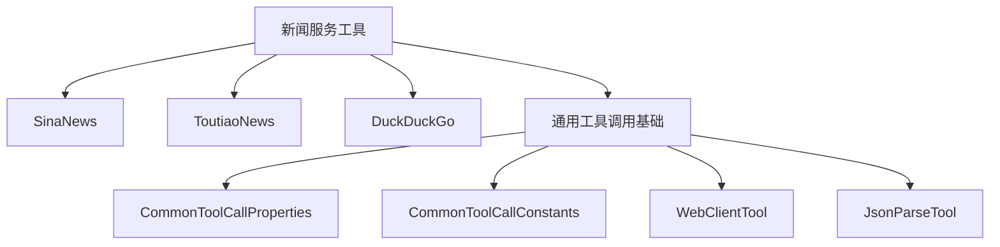
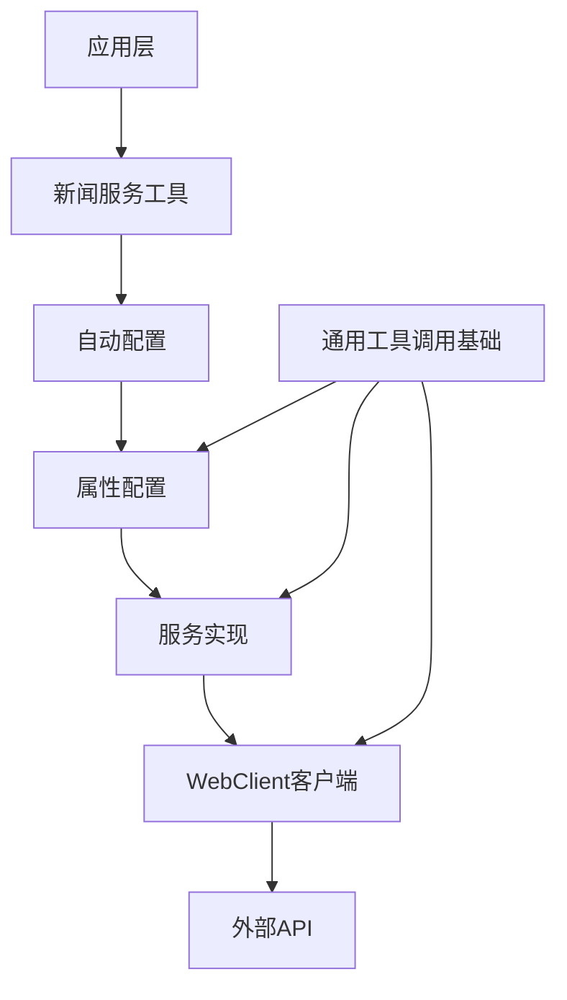
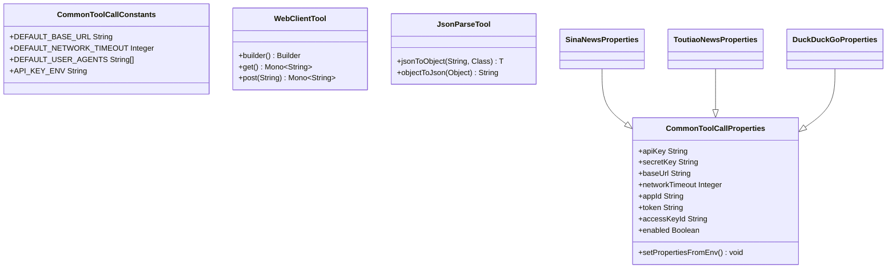
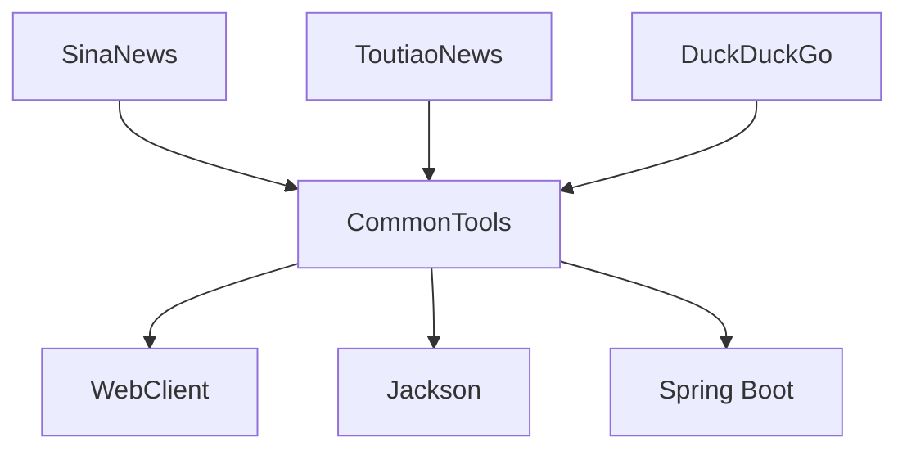

# 新闻服务工具

<cite>
**本文档引用的文件**
- [SinaNewsAutoConfiguration.java](file://community/tool-calls/spring-ai-alibaba-starter-tool-calling-sinanews/src/main/java/com/alibaba/cloud/ai/toolcalling/sinanews/SinaNewsAutoConfiguration.java)
- [SinaNewsProperties.java](file://community/tool-calls/spring-ai-alibaba-starter-tool-calling-sinanews/src/main/java/com/alibaba/cloud/ai/toolcalling/sinanews/SinaNewsProperties.java)
- [SinaNewsService.java](file://community/tool-calls/spring-ai-alibaba-starter-tool-calling-sinanews/src/main/java/com/alibaba/cloud/ai/toolcalling/sinanews/SinaNewsService.java)
- [ToutiaoNewsAutoConfiguration.java](file://community/tool-calls/spring-ai-alibaba-starter-tool-calling-toutiaonews/src/main/java/com/alibaba/cloud/ai/toolcalling/toutiaonews/ToutiaoNewsAutoConfiguration.java)
- [ToutiaoNewsProperties.java](file://community/tool-calls/spring-ai-alibaba-starter-tool-calling-toutiaonews/src/main/java/com/alibaba/cloud/ai/toolcalling/toutiaonews/ToutiaoNewsProperties.java)
- [ToutiaoNewsSearchHotEventsService.java](file://community/tool-calls/spring-ai-alibaba-starter-tool-calling-toutiaonews/src/main/java/com/alibaba/cloud/ai/toolcalling/toutiaonews/ToutiaoNewsSearchHotEventsService.java)
- [DuckDuckGoAutoConfiguration.java](file://community/tool-calls/spring-ai-alibaba-starter-tool-calling-duckduckgo/src/main/java/com/alibaba/cloud/ai/toolcalling/duckduckgo/DuckDuckGoAutoConfiguration.java)
- [DuckDuckGoProperties.java](file://community/tool-calls/spring-ai-alibaba-starter-tool-calling-duckduckgo/src/main/java/com/alibaba/cloud/ai/toolcalling/duckduckgo/DuckDuckGoProperties.java)
- [DuckDuckGoQueryNewsService.java](file://community/tool-calls/spring-ai-alibaba-starter-tool-calling-duckduckgo/src/main/java/com/alibaba/cloud/ai/toolcalling/duckduckgo/DuckDuckGoQueryNewsService.java)
- [CommonToolCallProperties.java](file://community/tool-calls/spring-ai-alibaba-starter-tool-calling-common/src/main/java/com/alibaba/cloud/ai/toolcalling/common/CommonToolCallProperties.java)
- [CommonToolCallConstants.java](file://community/tool-calls/spring-ai-alibaba-starter-tool-calling-common/src/main/java/com/alibaba/cloud/ai/toolcalling/common/CommonToolCallConstants.java)
</cite>

## 目录
1. [简介](#简介)
2. [项目结构](#项目结构)
3. [核心组件](#核心组件)
4. [架构概述](#架构概述)
5. [详细组件分析](#详细组件分析)
6. [依赖关系分析](#依赖关系分析)
7. [性能考虑](#性能考虑)
8. [故障排除指南](#故障排除指南)
9. [结论](#结论)

## 简介
本文档全面记录了Spring AI Alibaba项目中内置的新闻服务工具，包括新浪新闻(SinaNews)、今日头条(ToutiaoNews)和DuckDuckGo新闻查询等功能。文档详细说明了每个新闻服务工具的功能特性、配置参数、API端点和使用场景，并提供了在Spring Boot应用中启用和使用这些工具的实际代码示例。同时，文档还对比了不同新闻服务工具的优缺点和适用场景，特别说明了各工具在新闻时效性、地域覆盖范围和新闻质量方面的差异。

## 项目结构
新闻服务工具作为独立的模块存在于`community/tool-calls`目录下，每个工具都有独立的Maven模块，遵循统一的设计模式和架构风格。这种模块化设计使得各个新闻服务工具可以独立开发、测试和部署，同时也便于维护和扩展。



**图源**
- [SinaNewsAutoConfiguration.java](file://community/tool-calls/spring-ai-alibaba-starter-tool-calling-sinanews/src/main/java/com/alibaba/cloud/ai/toolcalling/sinanews/SinaNewsAutoConfiguration.java)
- [ToutiaoNewsAutoConfiguration.java](file://community/tool-calls/spring-ai-alibaba-starter-tool-calling-toutiaonews/src/main/java/com/alibaba/cloud/ai/toolcalling/toutiaonews/ToutiaoNewsAutoConfiguration.java)
- [DuckDuckGoAutoConfiguration.java](file://community/tool-calls/spring-ai-alibaba-starter-tool-calling-duckduckgo/src/main/java/com/alibaba/cloud/ai/toolcalling/duckduckgo/DuckDuckGoAutoConfiguration.java)
- [CommonToolCallProperties.java](file://community/tool-calls/spring-ai-alibaba-starter-tool-calling-common/src/main/java/com/alibaba/cloud/ai/toolcalling/common/CommonToolCallProperties.java)

**节源**
- [SinaNewsAutoConfiguration.java](file://community/tool-calls/spring-ai-alibaba-starter-tool-calling-sinanews/src/main/java/com/alibaba/cloud/ai/toolcalling/sinanews/SinaNewsAutoConfiguration.java)
- [ToutiaoNewsAutoConfiguration.java](file://community/tool-calls/spring-ai-alibaba-starter-tool-calling-toutiaonews/src/main/java/com/alibaba/cloud/ai/toolcalling/toutiaonews/ToutiaoNewsAutoConfiguration.java)
- [DuckDuckGoAutoConfiguration.java](file://community/tool-calls/spring-ai-alibaba-starter-tool-calling-duckduckgo/src/main/java/com/alibaba/cloud/ai/toolcalling/duckduckgo/DuckDuckGoAutoConfiguration.java)

## 核心组件
新闻服务工具的核心组件包括自动配置类、属性配置类和服务实现类。每个工具都遵循相同的模式：通过自动配置类创建Bean，使用属性配置类管理配置参数，以及服务实现类处理具体的业务逻辑。所有工具都继承自通用的工具调用基础类，确保了一致性和可维护性。

**节源**
- [SinaNewsAutoConfiguration.java](file://community/tool-calls/spring-ai-alibaba-starter-tool-calling-sinanews/src/main/java/com/alibaba/cloud/ai/toolcalling/sinanews/SinaNewsAutoConfiguration.java)
- [ToutiaoNewsAutoConfiguration.java](file://community/tool-calls/spring-ai-alibaba-starter-tool-calling-toutiaonews/src/main/java/com/alibaba/cloud/ai/toolcalling/toutiaonews/ToutiaoNewsAutoConfiguration.java)
- [DuckDuckGoAutoConfiguration.java](file://community/tool-calls/spring-ai-alibaba-starter-tool-calling-duckduckgo/src/main/java/com/alibaba/cloud/ai/toolcalling/duckduckgo/DuckDuckGoAutoConfiguration.java)
- [SinaNewsService.java](file://community/tool-calls/spring-ai-alibaba-starter-tool-calling-sinanews/src/main/java/com/alibaba/cloud/ai/toolcalling/sinanews/SinaNewsService.java)
- [ToutiaoNewsSearchHotEventsService.java](file://community/tool-calls/spring-ai-alibaba-starter-tool-calling-toutiaonews/src/main/java/com/alibaba/cloud/ai/toolcalling/toutiaonews/ToutiaoNewsSearchHotEventsService.java)
- [DuckDuckGoQueryNewsService.java](file://community/tool-calls/spring-ai-alibaba-starter-tool-calling-duckduckgo/src/main/java/com/alibaba/cloud/ai/toolcalling/duckduckgo/DuckDuckGoQueryNewsService.java)

## 架构概述
新闻服务工具采用分层架构设计，主要包括配置层、服务层和客户端层。配置层负责管理工具的各种配置参数；服务层实现具体的业务逻辑；客户端层通过WebClient进行HTTP请求，获取新闻数据。所有工具都遵循Spring Boot的自动配置机制，通过条件注解控制Bean的创建。



**图源**
- [SinaNewsAutoConfiguration.java](file://community/tool-calls/spring-ai-alibaba-starter-tool-calling-sinanews/src/main/java/com/alibaba/cloud/ai/toolcalling/sinanews/SinaNewsAutoConfiguration.java)
- [ToutiaoNewsAutoConfiguration.java](file://community/tool-calls/spring-ai-alibaba-starter-tool-calling-toutiaonews/src/main/java/com/alibaba/cloud/ai/toolcalling/toutiaonews/ToutiaoNewsAutoConfiguration.java)
- [DuckDuckGoAutoConfiguration.java](file://community/tool-calls/spring-ai-alibaba-starter-tool-calling-duckduckgo/src/main/java/com/alibaba/cloud/ai/toolcalling/duckduckgo/DuckDuckGoAutoConfiguration.java)
- [CommonToolCallProperties.java](file://community/tool-calls/spring-ai-alibaba-starter-tool-calling-common/src/main/java/com/alibaba/cloud/ai/toolcalling/common/CommonToolCallProperties.java)

## 详细组件分析

### SinaNews分析
SinaNews工具用于获取新浪新闻的热点事件列表。该工具通过调用新浪新闻API获取最新的热点新闻，并解析返回的JSON数据。

#### 类图
```mermaid
classDiagram
class SinaNewsAutoConfiguration {
+@Configuration
+@ConditionalOnClass
+@ConditionalOnProperty
+@EnableConfigurationProperties
+getSinaNews() SinaNewsService
}
class SinaNewsProperties {
+@ConfigurationProperties
+baseUrl String
+networkTimeout Integer
+enabled Boolean
}
class SinaNewsService {
+webClientTool WebClientTool
+jsonParseTool JsonParseTool
+properties SinaNewsProperties
+apply(Request) Response
+fetchDataFromApi() JsonNode
+parseHotEvents(JsonNode) HotEvent[]
}
class SinaNewsService$HotEvent {
+title String
}
class SinaNewsService$Request {
}
class SinaNewsService$Response {
+events HotEvent[]
}
SinaNewsAutoConfiguration --> SinaNewsService : "创建"
SinaNewsAutoConfiguration --> SinaNewsProperties : "注入"
SinaNewsService --> SinaNewsProperties : "使用"
SinaNewsService --> WebClientTool : "依赖"
SinaNewsService --> JsonParseTool : "依赖"
```

**图源**
- [SinaNewsAutoConfiguration.java](file://community/tool-calls/spring-ai-alibaba-starter-tool-calling-sinanews/src/main/java/com/alibaba/cloud/ai/toolcalling/sinanews/SinaNewsAutoConfiguration.java)
- [SinaNewsProperties.java](file://community/tool-calls/spring-ai-alibaba-starter-tool-calling-sinanews/src/main/java/com/alibaba/cloud/ai/toolcalling/sinanews/SinaNewsProperties.java)
- [SinaNewsService.java](file://community/tool-calls/spring-ai-alibaba-starter-tool-calling-sinanews/src/main/java/com/alibaba/cloud/ai/toolcalling/sinanews/SinaNewsService.java)

#### 功能特性
- 获取新浪新闻热点事件列表
- 自动解析JSON响应数据
- 支持配置超时时间和基础URL
- 内置错误处理机制

#### 配置参数
| 参数 | 默认值 | 描述 |
|------|-------|------|
| `sina.news.enabled` | true | 是否启用SinaNews工具 |
| `sina.news.base-url` | https://newsapp.sina.cn/api/hotlist?newsId=HB-1-snhs%2Ftop_news_list-all | 新浪新闻API基础URL |
| `sina.news.network-timeout` | 30000 | 网络请求超时时间（毫秒） |

#### 使用场景
适用于需要获取中文热点新闻的应用场景，特别是关注国内社会、娱乐、体育等领域的新闻资讯。

**节源**
- [SinaNewsAutoConfiguration.java](file://community/tool-calls/spring-ai-alibaba-starter-tool-calling-sinanews/src/main/java/com/alibaba/cloud/ai/toolcalling/sinanews/SinaNewsAutoConfiguration.java)
- [SinaNewsProperties.java](file://community/tool-calls/spring-ai-alibaba-starter-tool-calling-sinanews/src/main/java/com/alibaba/cloud/ai/toolcalling/sinanews/SinaNewsProperties.java)
- [SinaNewsService.java](file://community/tool-calls/spring-ai-alibaba-starter-tool-calling-sinanews/src/main/java/com/alibaba/cloud/ai/toolcalling/sinanews/SinaNewsService.java)

### ToutiaoNews分析
ToutiaoNews工具用于获取今日头条的热点事件列表。该工具通过调用今日头条API获取最新的热点新闻，并解析返回的JSON数据。

#### 类图
```mermaid
classDiagram
class ToutiaoNewsAutoConfiguration {
+@Configuration
+@ConditionalOnClass
+@ConditionalOnProperty
+@EnableConfigurationProperties
+getToutiaoNews() ToutiaoNewsSearchHotEventsService
}
class ToutiaoNewsProperties {
+@ConfigurationProperties
+baseUrl String
+networkTimeout Integer
+enabled Boolean
}
class ToutiaoNewsSearchHotEventsService {
+webClientTool WebClientTool
+jsonParseTool JsonParseTool
+properties ToutiaoNewsProperties
+apply(Request) Response
+fetchDataFromApi() JsonNode
+parseHotEvents(JsonNode) HotEvent[]
}
class ToutiaoNewsSearchHotEventsService$HotEvent {
+title String
}
class ToutiaoNewsSearchHotEventsService$Request {
}
class ToutiaoNewsSearchHotEventsService$Response {
+events HotEvent[]
}
ToutiaoNewsAutoConfiguration --> ToutiaoNewsSearchHotEventsService : "创建"
ToutiaoNewsAutoConfiguration --> ToutiaoNewsProperties : "注入"
ToutiaoNewsSearchHotEventsService --> ToutiaoNewsProperties : "使用"
ToutiaoNewsSearchHotEventsService --> WebClientTool : "依赖"
ToutiaoNewsSearchHotEventsService --> JsonParseTool : "依赖"
```

**图源**
- [ToutiaoNewsAutoConfiguration.java](file://community/tool-calls/spring-ai-alibaba-starter-tool-calling-toutiaonews/src/main/java/com/alibaba/cloud/ai/toolcalling/toutiaonews/ToutiaoNewsAutoConfiguration.java)
- [ToutiaoNewsProperties.java](file://community/tool-calls/spring-ai-alibaba-starter-tool-calling-toutiaonews/src/main/java/com/alibaba/cloud/ai/toolcalling/toutiaonews/ToutiaoNewsProperties.java)
- [ToutiaoNewsSearchHotEventsService.java](file://community/tool-calls/spring-ai-alibaba-starter-tool-calling-toutiaonews/src/main/java/com/alibaba/cloud/ai/toolcalling/toutiaonews/ToutiaoNewsSearchHotEventsService.java)

#### 功能特性
- 获取今日头条热点事件列表
- 自动解析JSON响应数据
- 支持配置超时时间和基础URL
- 内置用户代理轮换机制
- 支持中文语言偏好设置

#### 配置参数
| 参数 | 默认值 | 描述 |
|------|-------|------|
| `toutiao.news.enabled` | true | 是否启用ToutiaoNews工具 |
| `toutiao.news.base-url` | https://www.toutiao.com/hot-event/hot-board/?origin=toutiao_pc | 今日头条API基础URL |
| `toutiao.news.network-timeout` | 30000 | 网络请求超时时间（毫秒） |

#### 使用场景
适用于需要获取实时中文新闻资讯的应用场景，特别是关注科技、财经、社会等领域的新闻内容。

**节源**
- [ToutiaoNewsAutoConfiguration.java](file://community/tool-calls/spring-ai-alibaba-starter-tool-calling-toutiaonews/src/main/java/com/alibaba/cloud/ai/toolcalling/toutiaonews/ToutiaoNewsAutoConfiguration.java)
- [ToutiaoNewsProperties.java](file://community/tool-calls/spring-ai-alibaba-starter-tool-calling-toutiaonews/src/main/java/com/alibaba/cloud/ai/toolcalling/toutiaonews/ToutiaoNewsProperties.java)
- [ToutiaoNewsSearchHotEventsService.java](file://community/tool-calls/spring-ai-alibaba-starter-tool-calling-toutiaonews/src/main/java/com/alibaba/cloud/ai/toolcalling/toutiaonews/ToutiaoNewsSearchHotEventsService.java)

### DuckDuckGo分析
DuckDuckGo工具用于通过DuckDuckGo搜索引擎查询最新的新闻内容。与其他工具不同，它支持关键词搜索，提供了更灵活的新闻查询能力。

#### 类图
```mermaid
classDiagram
class DuckDuckGoAutoConfiguration {
+@Configuration
+@ConditionalOnProperty
+@EnableConfigurationProperties
+duckDuckGoQueryNews() DuckDuckGoQueryNewsService
}
class DuckDuckGoProperties {
+@ConfigurationProperties
+baseUrl String
+apiKey String
+networkTimeout Integer
+enabled Boolean
}
class DuckDuckGoQueryNewsService {
+webClientTool WebClientTool
+properties DuckDuckGoProperties
+apply(DuckDuckGoQueryNewsRequest) Map~String, Object~
+setPropertiesFromEnv() void
}
class DuckDuckGoQueryNewsService$DuckDuckGoQueryNewsRequest {
+query String
+kl String
}
DuckDuckGoAutoConfiguration --> DuckDuckGoQueryNewsService : "创建"
DuckDuckGoAutoConfiguration --> DuckDuckGoProperties : "注入"
DuckDuckGoQueryNewsService --> DuckDuckGoProperties : "使用"
DuckDuckGoQueryNewsService --> WebClientTool : "依赖"
```

**图源**
- [DuckDuckGoAutoConfiguration.java](file://community/tool-calls/spring-ai-alibaba-starter-tool-calling-duckduckgo/src/main/java/com/alibaba/cloud/ai/toolcalling/duckduckgo/DuckDuckGoAutoConfiguration.java)
- [DuckDuckGoProperties.java](file://community/tool-calls/spring-ai-alibaba-starter-tool-calling-duckduckgo/src/main/java/com/alibaba/cloud/ai/toolcalling/duckduckgo/DuckDuckGoProperties.java)
- [DuckDuckGoQueryNewsService.java](file://community/tool-calls/spring-ai-alibaba-starter-tool-calling-duckduckgo/src/main/java/com/alibaba/cloud/ai/toolcalling/duckduckgo/DuckDuckGoQueryNewsService.java)

#### 功能特性
- 支持关键词搜索新闻内容
- 需要API密钥进行身份验证
- 支持地理位置参数(kl)
- 基于SerpAPI的后端服务
- 返回结构化的新闻搜索结果

#### 配置参数
| 参数 | 默认值 | 描述 |
|------|-------|------|
| `duckduckgo.enabled` | true | 是否启用DuckDuckGo工具 |
| `duckduckgo.base-url` | https://serpapi.com/search | SerpAPI基础URL |
| `duckduckgo.api-key` | null | SerpAPI密钥，可通过环境变量DDG_API_KEY设置 |
| `duckduckgo.network-timeout` | 30000 | 网络请求超时时间（毫秒） |

#### 使用场景
适用于需要全球范围新闻搜索的应用场景，特别是需要根据特定关键词查找相关新闻内容的情况。

**节源**
- [DuckDuckGoAutoConfiguration.java](file://community/tool-calls/spring-ai-alibaba-starter-tool-calling-duckduckgo/src/main/java/com/alibaba/cloud/ai/toolcalling/duckduckgo/DuckDuckGoAutoConfiguration.java)
- [DuckDuckGoProperties.java](file://community/tool-calls/spring-ai-alibaba-starter-tool-calling-duckduckgo/src/main/java/com/alibaba/cloud/ai/toolcalling/duckduckgo/DuckDuckGoProperties.java)
- [DuckDuckGoQueryNewsService.java](file://community/tool-calls/spring-ai-alibaba-starter-tool-calling-duckduckgo/src/main/java/com/alibaba/cloud/ai/toolcalling/duckduckgo/DuckDuckGoQueryNewsService.java)

### 通用工具调用基础分析
所有新闻服务工具都继承自通用的工具调用基础类，确保了统一的配置管理和错误处理机制。

#### 类图


**图源**
- [CommonToolCallProperties.java](file://community/tool-calls/spring-ai-alibaba-starter-tool-calling-common/src/main/java/com/alibaba/cloud/ai/toolcalling/common/CommonToolCallProperties.java)
- [CommonToolCallConstants.java](file://community/tool-calls/spring-ai-alibaba-starter-tool-calling-common/src/main/java/com/alibaba/cloud/ai/toolcalling/common/CommonToolCallConstants.java)

**节源**
- [CommonToolCallProperties.java](file://community/tool-calls/spring-ai-alibaba-starter-tool-calling-common/src/main/java/com/alibaba/cloud/ai/toolcalling/common/CommonToolCallProperties.java)
- [CommonToolCallConstants.java](file://community/tool-calls/spring-ai-alibaba-starter-tool-calling-common/src/main/java/com/alibaba/cloud/ai/toolcalling/common/CommonToolCallConstants.java)

## 依赖关系分析
新闻服务工具之间没有直接的依赖关系，它们都依赖于通用的工具调用基础模块。这种设计实现了高内聚低耦合，使得每个工具都可以独立使用。



**图源**
- [SinaNewsProperties.java](file://community/tool-calls/spring-ai-alibaba-starter-tool-calling-sinanews/src/main/java/com/alibaba/cloud/ai/toolcalling/sinanews/SinaNewsProperties.java)
- [ToutiaoNewsProperties.java](file://community/tool-calls/spring-ai-alibaba-starter-tool-calling-toutiaonews/src/main/java/com/alibaba/cloud/ai/toolcalling/toutiaonews/ToutiaoNewsProperties.java)
- [DuckDuckGoProperties.java](file://community/tool-calls/spring-ai-alibaba-starter-tool-calling-duckduckgo/src/main/java/com/alibaba/cloud/ai/toolcalling/duckduckgo/DuckDuckGoProperties.java)
- [CommonToolCallProperties.java](file://community/tool-calls/spring-ai-alibaba-starter-tool-calling-common/src/main/java/com/alibaba/cloud/ai/toolcalling/common/CommonToolCallProperties.java)

**节源**
- [SinaNewsProperties.java](file://community/tool-calls/spring-ai-alibaba-starter-tool-calling-sinanews/src/main/java/com/alibaba/cloud/ai/toolcalling/sinanews/SinaNewsProperties.java)
- [ToutiaoNewsProperties.java](file://community/tool-calls/spring-ai-alibaba-starter-tool-calling-toutiaonews/src/main/java/com/alibaba/cloud/ai/toolcalling/toutiaonews/ToutiaoNewsProperties.java)
- [DuckDuckGoProperties.java](file://community/tool-calls/spring-ai-alibaba-starter-tool-calling-duckduckgo/src/main/java/com/alibaba/cloud/ai/toolcalling/duckduckgo/DuckDuckGoProperties.java)
- [CommonToolCallProperties.java](file://community/tool-calls/spring-ai-alibaba-starter-tool-calling-common/src/main/java/com/alibaba/cloud/ai/toolcalling/common/CommonToolCallProperties.java)

## 性能考虑
所有新闻服务工具都采用了异步非阻塞的WebClient进行HTTP请求，这有助于提高应用的响应性和吞吐量。同时，每个工具都支持配置网络超时时间，以防止请求长时间挂起。

- **连接池**: WebClient默认使用Reactor Netty作为底层客户端，支持连接池
- **超时控制**: 所有工具都支持配置网络超时时间，默认为30秒
- **错误处理**: 内置了统一的错误处理机制，能够优雅地处理网络异常
- **资源管理**: 使用try-with-resources模式确保资源正确释放

## 故障排除指南
当新闻服务工具无法正常工作时，可以按照以下步骤进行排查：

1. **检查配置**: 确认相关配置项是否正确设置，特别是基础URL和API密钥
2. **检查网络连接**: 确保应用服务器能够访问外部API服务
3. **查看日志**: 检查应用日志中的错误信息，通常会有详细的异常堆栈
4. **验证API可用性**: 直接通过浏览器或curl命令测试API端点是否可用
5. **检查速率限制**: 某些服务可能有速率限制，需要控制请求频率

**节源**
- [SinaNewsService.java](file://community/tool-calls/spring-ai-alibaba-starter-tool-calling-sinanews/src/main/java/com/alibaba/cloud/ai/toolcalling/sinanews/SinaNewsService.java)
- [ToutiaoNewsSearchHotEventsService.java](file://community/tool-calls/spring-ai-alibaba-starter-tool-calling-toutiaonews/src/main/java/com/alibaba/cloud/ai/toolcalling/toutiaonews/ToutiaoNewsSearchHotEventsService.java)
- [DuckDuckGoQueryNewsService.java](file://community/tool-calls/spring-ai-alibaba-starter-tool-calling-duckduckgo/src/main/java/com/alibaba/cloud/ai/toolcalling/duckduckgo/DuckDuckGoQueryNewsService.java)

## 结论
本文档详细介绍了Spring AI Alibaba项目中的三个主要新闻服务工具：SinaNews、ToutiaoNews和DuckDuckGo。这些工具都遵循统一的设计模式，具有良好的可配置性和可扩展性。SinaNews和ToutiaoNews适合获取中文热点新闻，而DuckDuckGo则提供了更灵活的全球新闻搜索能力。开发者可以根据具体需求选择合适的工具，并通过简单的配置即可在Spring Boot应用中使用这些功能强大的新闻服务。