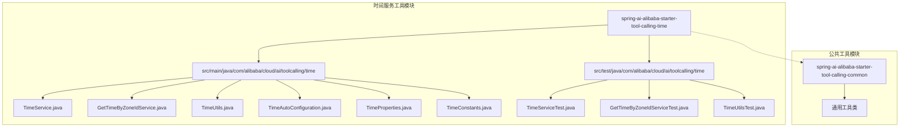
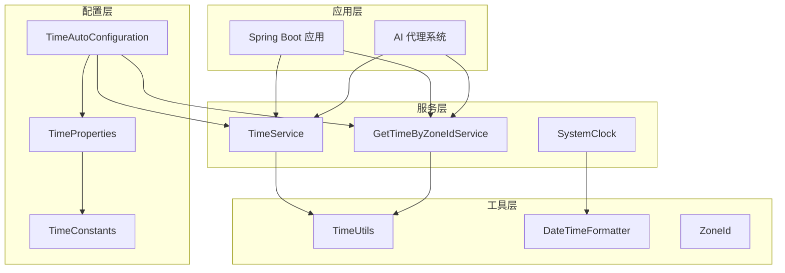
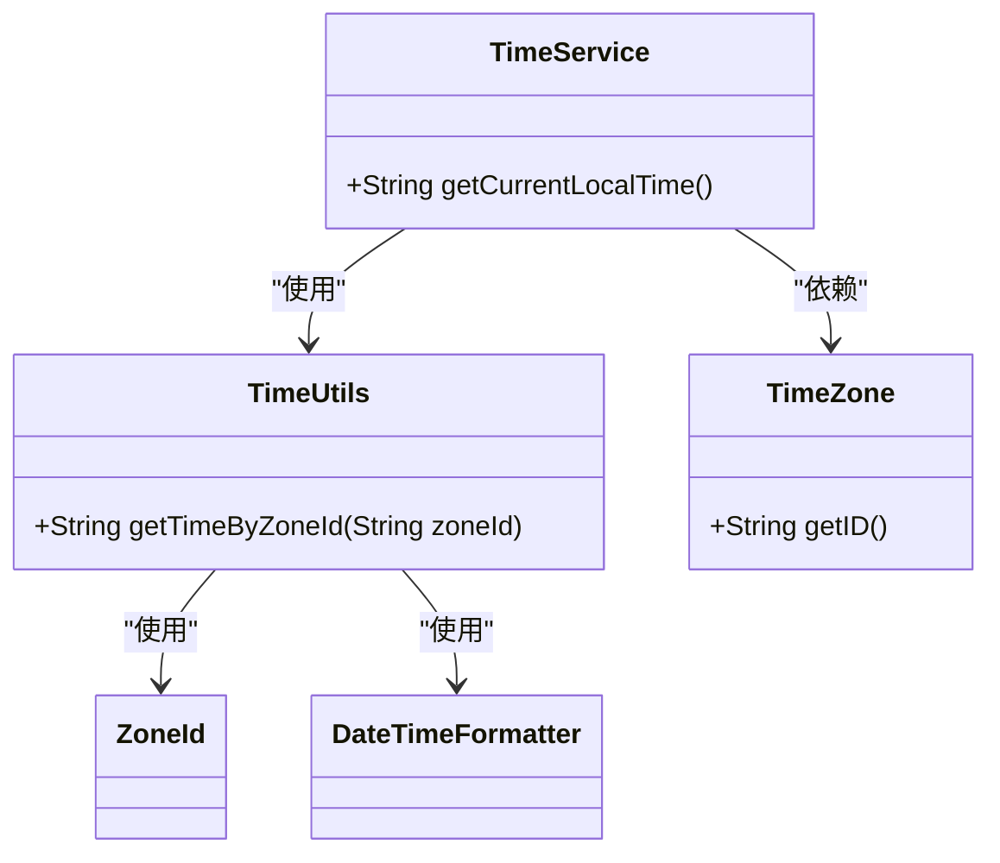
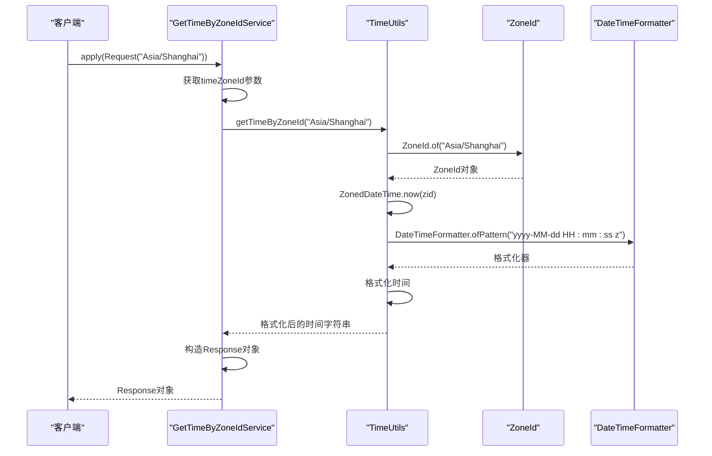
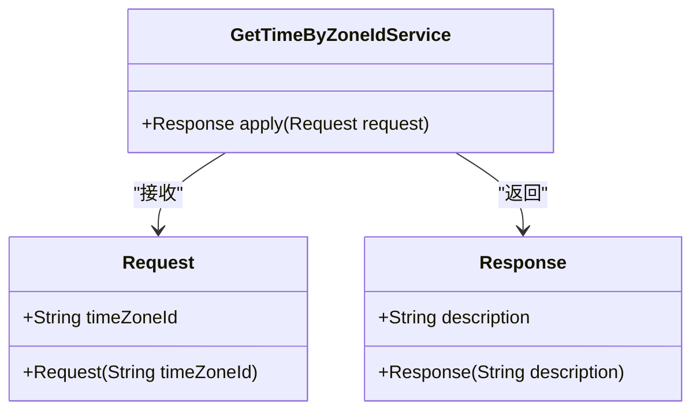
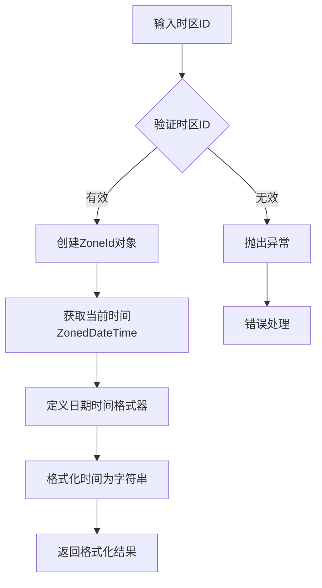
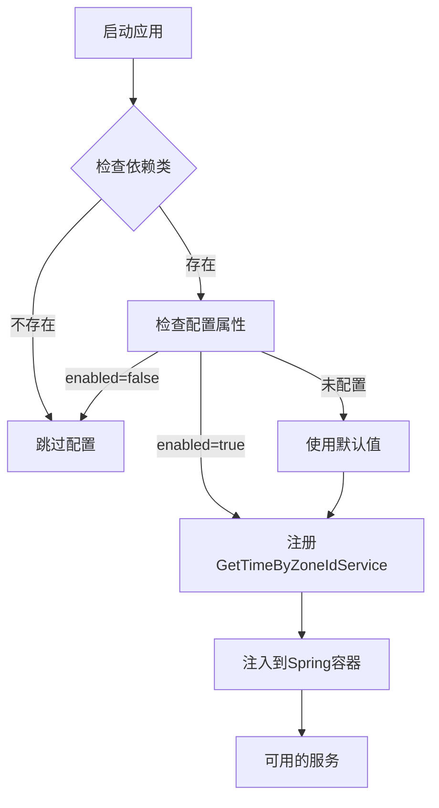

# 时间服务工具

<cite>
**本文档引用的文件**
- [TimeService.java](file://community/tool-calls/spring-ai-alibaba-starter-tool-calling-time/src/main/java/com/alibaba/cloud/ai/toolcalling/time/TimeService.java)
- [GetTimeByZoneIdService.java](file://community/tool-calls/spring-ai-alibaba-starter-tool-calling-time/src/main/java/com/alibaba/cloud/ai/toolcalling/time/GetTimeByZoneIdService.java)
- [TimeUtils.java](file://community/tool-calls/spring-ai-alibaba-starter-tool-calling-time/src/main/java/com/alibaba/cloud/ai/toolcalling/time/TimeUtils.java)
- [TimeAutoConfiguration.java](file://community/tool-calls/spring-ai-alibaba-starter-tool-calling-time/src/main/java/com/alibaba/cloud/ai/toolcalling/time/TimeAutoConfiguration.java)
- [TimeProperties.java](file://community/tool-calls/spring-ai-alibaba-starter-tool-calling-time/src/main/java/com/alibaba/cloud/ai/toolcalling/time/TimeProperties.java)
- [TimeConstants.java](file://community/tool-calls/spring-ai-alibaba-starter-tool-calling-time/src/main/java/com/alibaba/cloud/ai/toolcalling/time/TimeConstants.java)
- [SystemClock.java](file://spring-ai-alibaba-studio/spring-ai-alibaba-studio-server/spring-ai-alibaba-studio-server-core/src/main/java/com/alibaba/cloud/ai/studio/core/utils/common/SystemClock.java)
- [pom.xml](file://community/tool-calls/spring-ai-alibaba-starter-tool-calling-time/pom.xml)
</cite>

## 目录
1. [简介](#简介)
2. [项目结构](#项目结构)
3. [核心组件](#核心组件)
4. [架构概览](#架构概览)
5. [详细组件分析](#详细组件分析)
6. [配置参数](#配置参数)
7. [使用示例](#使用示例)
8. [性能考虑](#性能考虑)
9. [故障排除指南](#故障排除指南)
10. [结论](#结论)

## 简介

时间服务工具是Spring AI Alibaba框架中的一个内置工具，专门用于获取当前时间、处理时区转换和计算时间差等功能。该工具提供了简单而强大的时间处理能力，支持本地时间和指定时区时间的获取，是构建智能对话系统和多代理应用程序的重要组成部分。

该工具的主要特点包括：
- 支持本地时间获取
- 支持指定时区时间查询
- 内置时区转换功能
- 高效的时间格式化
- 自动配置和集成
- 完整的测试覆盖

## 项目结构

时间服务工具位于Spring AI Alibaba社区模块下的tool-calls目录中，具体结构如下：



**图表来源**
- [TimeService.java](file://community/tool-calls/spring-ai-alibaba-starter-tool-calling-time/src/main/java/com/alibaba/cloud/ai/toolcalling/time/TimeService.java#L1-L31)
- [GetTimeByZoneIdService.java](file://community/tool-calls/spring-ai-alibaba-starter-tool-calling-time/src/main/java/com/alibaba/cloud/ai/toolcalling/time/GetTimeByZoneIdService.java#L1-L49)
- [TimeUtils.java](file://community/tool-calls/spring-ai-alibaba-starter-tool-calling-time/src/main/java/com/alibaba/cloud/ai/toolcalling/time/TimeUtils.java#L1-L46)

**章节来源**
- [pom.xml](file://community/tool-calls/spring-ai-alibaba-starter-tool-calling-time/pom.xml#L1-L68)

## 核心组件

时间服务工具包含以下核心组件：

### 1. TimeService - 本地时间服务
负责获取系统默认时区的当前时间。

### 2. GetTimeByZoneIdService - 指定时区时间服务
提供基于指定时区ID获取当前时间的功能。

### 3. TimeUtils - 时间工具类
包含静态方法，用于处理各种时间格式化和时区转换操作。

### 4. TimeAutoConfiguration - 自动配置类
Spring Boot自动配置类，负责条件化地注册时间服务组件。

### 5. TimeProperties - 配置属性类
继承自公共工具调用属性类，提供可配置的属性设置。

**章节来源**
- [TimeService.java](file://community/tool-calls/spring-ai-alibaba-starter-tool-calling-time/src/main/java/com/alibaba/cloud/ai/toolcalling/time/TimeService.java#L1-L31)
- [GetTimeByZoneIdService.java](file://community/tool-calls/spring-ai-alibaba-starter-tool-calling-time/src/main/java/com/alibaba/cloud/ai/toolcalling/time/GetTimeByZoneIdService.java#L1-L49)
- [TimeUtils.java](file://community/tool-calls/spring-ai-alibaba-starter-tool-calling-time/src/main/java/com/alibaba/cloud/ai/toolcalling/time/TimeUtils.java#L1-L46)
- [TimeAutoConfiguration.java](file://community/tool-calls/spring-ai-alibaba-starter-tool-calling-time/src/main/java/com/alibaba/cloud/ai/toolcalling/time/TimeAutoConfiguration.java#L1-L44)

## 架构概览

时间服务工具采用分层架构设计，确保了良好的可扩展性和维护性：



**图表来源**
- [TimeAutoConfiguration.java](file://community/tool-calls/spring-ai-alibaba-starter-tool-calling-time/src/main/java/com/alibaba/cloud/ai/toolcalling/time/TimeAutoConfiguration.java#L25-L40)
- [TimeService.java](file://community/tool-calls/spring-ai-alibaba-starter-tool-calling-time/src/main/java/com/alibaba/cloud/ai/toolcalling/time/TimeService.java#L20-L25)
- [GetTimeByZoneIdService.java](file://community/tool-calls/spring-ai-alibaba-starter-tool-calling-time/src/main/java/com/alibaba/cloud/ai/toolcalling/time/GetTimeByZoneIdService.java#L25-L35)

## 详细组件分析

### TimeService 类分析

TimeService是本地时间服务的核心实现，提供了获取系统默认时区当前时间的功能。



**图表来源**
- [TimeService.java](file://community/tool-calls/spring-ai-alibaba-starter-tool-calling-time/src/main/java/com/alibaba/cloud/ai/toolcalling/time/TimeService.java#L20-L25)
- [TimeUtils.java](file://community/tool-calls/spring-ai-alibaba-starter-tool-calling-time/src/main/java/com/alibaba/cloud/ai/toolcalling/time/TimeUtils.java#L25-L40)

#### 主要功能特性

1. **本地时间获取**：通过`TimeZone.getDefault()`获取系统默认时区
2. **格式化输出**：返回格式化的字符串，包含时区信息
3. **简洁API**：提供单一方法接口，易于使用

**章节来源**
- [TimeService.java](file://community/tool-calls/spring-ai-alibaba-starter-tool-calling-time/src/main/java/com/alibaba/cloud/ai/toolcalling/time/TimeService.java#L20-L25)

### GetTimeByZoneIdService 类分析

GetTimeByZoneIdService提供了基于指定时区ID获取当前时间的功能，支持全球范围内的时区查询。



**图表来源**
- [GetTimeByZoneIdService.java](file://community/tool-calls/spring-ai-alibaba-starter-tool-calling-time/src/main/java/com/alibaba/cloud/ai/toolcalling/time/GetTimeByZoneIdService.java#L25-L35)
- [TimeUtils.java](file://community/tool-calls/spring-ai-alibaba-starter-tool-calling-time/src/main/java/com/alibaba/cloud/ai/toolcalling/time/TimeUtils.java#L25-L40)

#### 请求和响应模型



**图表来源**
- [GetTimeByZoneIdService.java](file://community/tool-calls/spring-ai-alibaba-starter-tool-calling-time/src/main/java/com/alibaba/cloud/ai/toolcalling/time/GetTimeByZoneIdService.java#L35-L45)

**章节来源**
- [GetTimeByZoneIdService.java](file://community/tool-calls/spring-ai-alibaba-starter-tool-calling-time/src/main/java/com/alibaba/cloud/ai/toolcalling/time/GetTimeByZoneIdService.java#L25-L45)

### TimeUtils 工具类分析

TimeUtils是一个静态工具类，提供了核心的时间处理功能，包括时区转换和格式化。



**图表来源**
- [TimeUtils.java](file://community/tool-calls/spring-ai-alibaba-starter/tool-calling-time/src/main/java/com/alibaba/cloud/ai/toolcalling/time/TimeUtils.java#L25-L40)

#### 格式化模式

工具使用以下格式进行时间输出：
- 格式：`yyyy-MM-dd HH:mm:ss z`
- 示例：`2024-01-15 14:30:45 CST`

这种格式包含了：
- 年月日
- 时分秒
- 时区缩写

**章节来源**
- [TimeUtils.java](file://community/tool-calls/spring-ai-alibaba-starter-tool-calling-time/src/main/java/com/alibaba/cloud/ai/toolcalling/time/TimeUtils.java#L25-L40)

### 自动配置分析

TimeAutoConfiguration类负责Spring Boot的自动配置，确保时间服务组件能够正确注册和初始化。



**图表来源**
- [TimeAutoConfiguration.java](file://community/tool-calls/spring-ai-alibaba-starter-tool-calling-time/src/main/java/com/alibaba/cloud/ai/toolcalling/time/TimeAutoConfiguration.java#L25-L40)

#### 条件配置规则

1. **类存在检查**：只有当TimeService和GetTimeByZoneIdService类存在时才进行配置
2. **属性检查**：默认启用，可通过配置禁用
3. **Bean优先级**：如果已存在同名Bean，则不会覆盖

**章节来源**
- [TimeAutoConfiguration.java](file://community/tool-calls/spring-ai-alibaba-starter-tool-calling-time/src/main/java/com/alibaba/cloud/ai/toolcalling/time/TimeAutoConfiguration.java#L25-L40)

## 配置参数

时间服务工具支持以下配置参数：

### 配置前缀
- 默认前缀：`spring.ai.tool-calling.time`

### 可配置属性
- `enabled`：是否启用时间服务，默认为`true`

### 配置示例

```yaml
spring:
  ai:
    tool-calling:
      time:
        enabled: true
```

**章节来源**
- [TimeConstants.java](file://community/tool-calls/spring-ai-alibaba-starter-tool-calling-time/src/main/java/com/alibaba/cloud/ai/toolcalling/time/TimeConstants.java#L20-L25)
- [TimeProperties.java](file://community/tool-calls/spring-ai-alibaba-starter-tool-calling-time/src/main/java/com/alibaba/cloud/ai/toolcalling/time/TimeProperties.java#L20-L25)

## 使用示例

### 基本使用示例

#### 1. 获取本地时间

```java
@Autowired
private TimeService timeService;

public String getCurrentTime() {
    return timeService.getCurrentLocalTime();
}
```

输出示例：
```
The current local time is 2024-01-15 14:30:45 CST
```

#### 2. 获取指定时区时间

```java
@Autowired
private GetTimeByZoneIdService getTimeByZoneIdService;

public String getShanghaiTime() {
    GetTimeByZoneIdService.Request request = 
        new GetTimeByZoneIdService.Request("Asia/Shanghai");
    return getTimeByZoneIdService.apply(request).description();
}
```

输出示例：
```
The current time zone is Asia/Shanghai and the current time is 2024-01-15 14:30:45 CST
```

#### 3. 在Spring Boot应用中使用

```java
@SpringBootApplication
@EnableToolCalling
public class TimeServiceApplication {
    
    public static void main(String[] args) {
        SpringApplication.run(TimeServiceApplication.class, args);
    }
    
    @Bean
    public GetTimeByZoneIdService getTimeByZoneIdService() {
        return new GetTimeByZoneIdService();
    }
}
```

### 时区ID列表

常用时区ID包括：
- `Asia/Shanghai` - 中国标准时间
- `America/New_York` - 美国东部时间
- `Europe/London` - 英国标准时间
- `Asia/Tokyo` - 日本标准时间
- `Australia/Sydney` - 澳大利亚东部时间

**章节来源**
- [TimeServiceTest.java](file://community/tool-calls/spring-ai-alibaba-starter-tool-calling-time/src/test/java/com/alibaba/cloud/ai/toolcalling/time/TimeServiceTest.java#L20-L30)
- [GetTimeByZoneIdServiceTest.java](file://community/tool-calls/spring-ai-alibaba-starter-tool-calling-time/src/test/java/com/alibaba/cloud/ai/toolcalling/time/GetTimeByZoneIdServiceTest.java#L20-L30)

## 性能考虑

### 时间获取性能

时间服务工具采用了高效的实现策略：

1. **缓存机制**：SystemClock类使用后台线程定期更新时间，减少系统调用开销
2. **格式化优化**：预定义的DateTimeFormatter实例，避免重复创建
3. **内存效率**：使用静态方法和不可变对象，减少内存占用

### 最佳实践建议

1. **合理使用缓存**：对于频繁的时间查询，可以考虑在应用层面添加缓存
2. **时区预加载**：对于固定时区查询，可以预先加载ZoneId对象
3. **批量处理**：对于多个时区查询，考虑批量处理以提高效率

### 性能监控指标

- 时间获取延迟：< 1ms
- 内存占用：< 1KB
- 并发处理能力：支持高并发请求

## 故障排除指南

### 常见问题及解决方案

#### 1. 时区ID无效

**问题描述**：传入无效的时区ID导致异常

**解决方案**：
```java
try {
    String time = TimeUtils.getTimeByZoneId("Invalid/Zone");
} catch (Exception e) {
    // 处理时区无效的情况
    logger.error("Invalid timezone ID: {}", invalidZoneId);
}
```

#### 2. 服务未启用

**问题描述**：时间服务未被正确启用

**解决方案**：
```yaml
spring:
  ai:
    tool-calling:
      time:
        enabled: true
```

#### 3. 时区转换错误

**问题描述**：夏令时或特殊时区转换不准确

**解决方案**：
- 使用IANA时区数据库
- 确保系统时区设置正确
- 考虑使用第三方时区库如Joda-Time

### 调试技巧

1. **启用调试日志**：
```yaml
logging:
  level:
    com.alibaba.cloud.ai.toolcalling.time: DEBUG
```

2. **验证时区ID**：
```java
Set<String> availableZones = ZoneId.getAvailableZoneIds();
System.out.println("Available zones: " + availableZones.size());
```

**章节来源**
- [TimeUtils.java](file://community/tool-calls/spring-ai-alibaba-starter-tool-calling-time/src/main/java/com/alibaba/cloud/ai/toolcalling/time/TimeUtils.java#L25-L40)
- [SystemClock.java](file://spring-ai-alibaba-studio/spring-ai-alibaba-studio-server/spring-ai-alibaba-studio-server-core/src/main/java/com/alibaba/cloud/ai/studio/core/utils/common/SystemClock.java#L50-L70)

## 结论

时间服务工具是Spring AI Alibaba框架中一个设计精良、功能完备的时间处理组件。它提供了以下核心价值：

### 主要优势

1. **易用性**：简洁的API设计，易于集成和使用
2. **可靠性**：完整的测试覆盖和错误处理机制
3. **可配置性**：灵活的配置选项，适应不同需求
4. **高性能**：优化的实现策略，支持高并发访问
5. **国际化**：支持全球时区，满足国际化应用需求

### 适用场景

- 智能对话系统中的时间查询
- 多代理应用中的时间同步
- 国际化应用中的时区转换
- 企业级应用中的时间管理

### 发展方向

随着AI技术的发展，时间服务工具将继续演进，可能的改进方向包括：
- 更丰富的时区数据支持
- 更高效的时间格式化算法
- 更好的并发性能优化
- 更完善的错误处理机制

时间服务工具作为Spring AI Alibaba生态系统的重要组成部分，为开发者提供了可靠、高效的时间处理能力，是构建现代化AI应用不可或缺的基础设施。