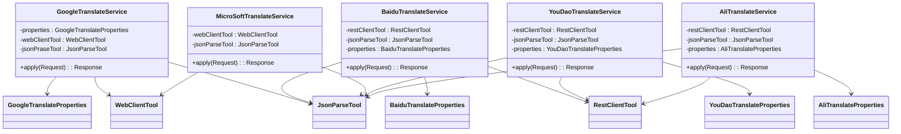

# 翻译服务工具

<cite>
**本文档引用的文件**
- [GoogleTranslateAutoConfiguration.java](file://community/tool-calls/spring-ai-alibaba-starter-tool-calling-googletranslate/src/main/java/com/alibaba/cloud/ai/toolcalling/googletranslate/GoogleTranslateAutoConfiguration.java)
- [GoogleTranslateService.java](file://community/tool-calls/spring-ai-alibaba-starter-tool-calling-googletranslate/src/main/java/com/alibaba/cloud/ai/toolcalling/googletranslate/GoogleTranslateService.java)
- [GoogleTranslateProperties.java](file://community/tool-calls/spring-ai-alibaba-starter-tool-calling-googletranslate/src/main/java/com/alibaba/cloud/ai/toolcalling/googletranslate/GoogleTranslateProperties.java)
- [GoogleTranslateConstants.java](file://community/tool-calls/spring-ai-alibaba-starter-tool-calling-googletranslate/src/main/java/com/alibaba/cloud/ai/toolcalling/googletranslate/GoogleTranslateConstants.java)
- [BaiduTranslateAutoConfiguration.java](file://community/tool-calls/spring-ai-alibaba-starter-tool-calling-baidutranslate/src/main/java/com/alibaba/cloud/ai/toolcalling/baidutranslate/BaiduTranslateAutoConfiguration.java)
- [BaiduTranslateService.java](file://community/tool-calls/spring-ai-alibaba-starter-tool-calling-baidutranslate/src/main/java/com/alibaba/cloud/ai/toolcalling/baidutranslate/BaiduTranslateService.java)
- [BaiduTranslateProperties.java](file://community/tool-calls/spring-ai-alibaba-starter-tool-calling-baidutranslate/src/main/java/com/alibaba/cloud/ai/toolcalling/baidutranslate/BaiduTranslateProperties.java)
- [BaiduTranslateConstants.java](file://community/tool-calls/spring-ai-alibaba-starter-tool-calling-baidutranslate/src/main/java/com/alibaba/cloud/ai/toolcalling/baidutranslate/BaiduTranslateConstants.java)
- [MicroSoftTranslateAutoConfiguration.java](file://community/tool-calls/spring-ai-alibaba-starter-tool-calling-microsofttranslate/src/main/java/com/alibaba/cloud/ai/toolcalling/microsofttranslate/MicroSoftTranslateAutoConfiguration.java)
- [MicroSoftTranslateService.java](file://community/tool-calls/spring-ai-alibaba-starter-tool-calling-microsofttranslate/src/main/java/com/alibaba/cloud/ai/toolcalling/microsofttranslate/MicroSoftTranslateService.java)
- [MicroSoftTranslateProperties.java](file://community/tool-calls/spring-ai-alibaba-starter-tool-calling-microsofttranslate/src/main/java/com/alibaba/cloud/ai/toolcalling/microsofttranslate/MicroSoftTranslateProperties.java)
- [MicroSoftTranslateConstants.java](file://community/tool-calls/spring-ai-alibaba-starter-tool-calling-microsofttranslate/src/main/java/com/alibaba/cloud/ai/toolcalling/microsofttranslate/MicroSoftTranslateConstants.java)
- [YouDaoTranslateAutoConfiguration.java](file://community/tool-calls/spring-ai-alibaba-starter-tool-calling-youdaotranslate/src/main/java/com/alibaba/cloud/ai/toolcalling/youdaotranslate/YouDaoTranslateAutoConfiguration.java)
- [YouDaoTranslateService.java](file://community/tool-calls/spring-ai-alibaba-starter-tool-calling-youdaotranslate/src/main/java/com/alibaba/cloud/ai/toolcalling/youdaotranslate/YouDaoTranslateService.java)
- [YouDaoTranslateProperties.java](file://community/tool-calls/spring-ai-alibaba-starter-tool-calling-youdaotranslate/src/main/java/com/alibaba/cloud/ai/toolcalling/youdaotranslate/YouDaoTranslateProperties.java)
- [YouDaoTranslateConstants.java](file://community/tool-calls/spring-ai-alibaba-starter-tool-calling-youdaotranslate/src/main/java/com/alibaba/cloud/ai/toolcalling/youdaotranslate/YouDaoTranslateConstants.java)
- [AliTranslateAutoConfiguration.java](file://community/tool-calls/spring-ai-alibaba-starter-tool-calling-alitranslate/src/main/java/com/alibaba/cloud/ai/toolcalling/alitranslate/AliTranslateAutoConfiguration.java)
- [AliTranslateService.java](file://community/tool-calls/spring-ai-alibaba-starter-tool-calling-alitranslate/src/main/java/com/alibaba/cloud/ai/toolcalling/alitranslate/AliTranslateService.java)
- [AliTranslateProperties.java](file://community/tool-calls/spring-ai-alibaba-starter-tool-calling-alitranslate/src/main/java/com/alibaba/cloud/ai/toolcalling/alitranslate/AliTranslateProperties.java)
- [AliTranslateConstants.java](file://community/tool-calls/spring-ai-alibaba-starter-tool-calling-alitranslate/src/main/java/com/alibaba/cloud/ai/toolcalling/alitranslate/AliTranslateConstants.java)
</cite>

## 目录
1. [引言](#引言)
2. [项目结构](#项目结构)
3. [核心组件](#核心组件)
4. [架构概述](#架构概述)
5. [详细组件分析](#详细组件分析)
6. [依赖分析](#依赖分析)
7. [性能考虑](#性能考虑)
8. [故障排除指南](#故障排除指南)
9. [结论](#结论)

## 引言
本文档全面记录了 Spring AI Alibaba 项目中内置的各种翻译服务工具的功能和使用方法。文档重点介绍了 Google Translate、百度翻译、有道翻译、Microsoft Translate 和阿里翻译等主流翻译服务的实现细节，包括它们支持的语言种类、配置参数、API端点和使用场景。通过详细的代码示例，展示了如何在 Spring Boot 应用中启用和使用这些翻译服务工具。文档还提供了各工具的依赖关系、认证方式、翻译质量、响应速度和速率限制等重要信息，并对不同翻译服务工具的优缺点和适用场景进行了对比分析，特别说明了各工具在专业术语翻译、多段落翻译和实时翻译方面的表现差异。

## 项目结构
Spring AI Alibaba 项目的翻译服务工具主要位于 `community/tool-calls` 目录下，每个翻译服务都有独立的模块。这种模块化设计使得各个翻译服务可以独立开发、测试和部署，同时也便于用户根据需要选择和集成特定的翻译服务。


**图表来源**
- [GoogleTranslateAutoConfiguration.java](file://community/tool-calls/spring-ai-alibaba-starter-tool-calling-googletranslate/src/main/java/com/alibaba/cloud/ai/toolcalling/googletranslate/GoogleTranslateAutoConfiguration.java)
- [BaiduTranslateAutoConfiguration.java](file://community/tool-calls/spring-ai-alibaba-starter-tool-calling-baidutranslate/src/main/java/com/alibaba/cloud/ai/toolcalling/baidutranslate/BaiduTranslateAutoConfiguration.java)
- [MicroSoftTranslateAutoConfiguration.java](file://community/tool-calls/spring-ai-alibaba-starter-tool-calling-microsofttranslate/src/main/java/com/alibaba/cloud/ai/toolcalling/microsofttranslate/MicroSoftTranslateAutoConfiguration.java)
- [YouDaoTranslateAutoConfiguration.java](file://community/tool-calls/spring-ai-alibaba-starter-tool-calling-youdaotranslate/src/main/java/com/alibaba/cloud/ai/toolcalling/youdaotranslate/YouDaoTranslateAutoConfiguration.java)
- [AliTranslateAutoConfiguration.java](file://community/tool-calls/spring-ai-alibaba-starter-tool-calling-alitranslate/src/main/java/com/alibaba/cloud/ai/toolcalling/alitranslate/AliTranslateAutoConfiguration.java)

**章节来源**
- [GoogleTranslateAutoConfiguration.java](file://community/tool-calls/spring-ai-alibaba-starter-tool-calling-googletranslate/src/main/java/com/alibaba/cloud/ai/toolcalling/googletranslate/GoogleTranslateAutoConfiguration.java)
- [BaiduTranslateAutoConfiguration.java](file://community/tool-calls/spring-ai-alibaba-starter-tool-calling-baidutranslate/src/main/java/com/alibaba/cloud/ai/toolcalling/baidutranslate/BaiduTranslateAutoConfiguration.java)
- [MicroSoftTranslateAutoConfiguration.java](file://community/tool-calls/spring-ai-alibaba-starter-tool-calling-microsofttranslate/src/main/java/com/alibaba/cloud/ai/toolcalling/microsofttranslate/MicroSoftTranslateAutoConfiguration.java)
- [YouDaoTranslateAutoConfiguration.java](file://community/tool-calls/spring-ai-alibaba-starter-tool-calling-youdaotranslate/src/main/java/com/alibaba/cloud/ai/toolcalling/youdaotranslate/YouDaoTranslateAutoConfiguration.java)
- [AliTranslateAutoConfiguration.java](file://community/tool-calls/spring-ai-alibaba-starter-tool-calling-alitranslate/src/main/java/com/alibaba/cloud/ai/toolcalling/alitranslate/AliTranslateAutoConfiguration.java)

## 核心组件
本项目的核心组件是各个翻译服务的实现类，它们都遵循了统一的设计模式：通过自动配置类（AutoConfiguration）创建服务实例，服务类（Service）实现具体的翻译逻辑，属性类（Properties）管理配置参数，常量类（Constants）定义配置前缀和环境变量名。这种设计模式保证了代码的一致性和可维护性。

**章节来源**
- [GoogleTranslateService.java](file://community/tool-calls/spring-ai-alibaba-starter-tool-calling-googletranslate/src/main/java/com/alibaba/cloud/ai/toolcalling/googletranslate/GoogleTranslateService.java)
- [BaiduTranslateService.java](file://community/tool-calls/spring-ai-alibaba-starter-tool-calling-baidutranslate/src/main/java/com/alibaba/cloud/ai/toolcalling/baidutranslate/BaiduTranslateService.java)
- [MicroSoftTranslateService.java](file://community/tool-calls/spring-ai-alibaba-starter-tool-calling-microsofttranslate/src/main/java/com/alibaba/cloud/ai/toolcalling/microsofttranslate/MicroSoftTranslateService.java)
- [YouDaoTranslateService.java](file://community/tool-calls/spring-ai-alibaba-starter-tool-calling-youdaotranslate/src/main/java/com/alibaba/cloud/ai/toolcalling/youdaotranslate/YouDaoTranslateService.java)
- [AliTranslateService.java](file://community/tool-calls/spring-ai-alibaba-starter-tool-calling-alitranslate/src/main/java/com/alibaba/cloud/ai/toolcalling/alitranslate/AliTranslateService.java)

## 架构概述
整个翻译服务工具的架构基于 Spring Boot 的自动配置机制，通过 `@Configuration` 和 `@Bean` 注解来创建和管理 Bean 实例。每个翻译服务都实现了 `Function` 接口，这使得它们可以作为函数式编程中的函数来使用。服务类通过 WebClient 或 RestClient 与外部翻译 API 进行通信，并使用 JsonParseTool 来处理 JSON 数据的序列化和反序列化。



**图表来源**
- [GoogleTranslateService.java](file://community/tool-calls/spring-ai-alibaba-starter-tool-calling-googletranslate/src/main/java/com/alibaba/cloud/ai/toolcalling/googletranslate/GoogleTranslateService.java)
- [BaiduTranslateService.java](file://community/tool-calls/spring-ai-alibaba-starter-tool-calling-baidutranslate/src/main/java/com/alibaba/cloud/ai/toolcalling/baidutranslate/BaiduTranslateService.java)
- [MicroSoftTranslateService.java](file://community/tool-calls/spring-ai-alibaba-starter-tool-calling-microsofttranslate/src/main/java/com/alibaba/cloud/ai/toolcalling/microsofttranslate/MicroSoftTranslateService.java)
- [YouDaoTranslateService.java](file://community/tool-calls/spring-ai-alibaba-starter-tool-calling-youdaotranslate/src/main/java/com/alibaba/cloud/ai/toolcalling/youdaotranslate/YouDaoTranslateService.java)
- [AliTranslateService.java](file://community/tool-calls/spring-ai-alibaba-starter-tool-calling-alitranslate/src/main/java/com/alibaba/cloud/ai/toolcalling/alitranslate/AliTranslateService.java)

## 详细组件分析
### Google Translate 分析
Google Translate 服务通过 Google Cloud Translation API 提供翻译功能。它使用 API Key 进行身份验证，支持多种语言之间的翻译。服务通过 POST 请求将待翻译文本发送到 Google 的翻译服务器，并接收 JSON 格式的响应。

#### 配置参数
Google Translate 的配置参数主要通过 `GoogleTranslateProperties` 类进行管理，该类继承自 `CommonToolCallProperties` 并设置了默认的 API 端点。

```java
@ConfigurationProperties(prefix = GoogleTranslateConstants.CONFIG_PREFIX)
public class GoogleTranslateProperties extends CommonToolCallProperties {
    public GoogleTranslateProperties() {
        super("https://translation.googleapis.com/language/translate/v2");
        this.setPropertiesFromEnv(GoogleTranslateConstants.API_KEY_ENV, null, null, null);
    }
}
```

**图表来源**
- [GoogleTranslateProperties.java](file://community/tool-calls/spring-ai-alibaba-starter-tool-calling-googletranslate/src/main/java/com/alibaba/cloud/ai/toolcalling/googletranslate/GoogleTranslateProperties.java)

#### 认证方式
Google Translate 使用 API Key 进行认证，API Key 可以通过环境变量 `GOOGLE_TRANSLATE_APIKEY` 设置。

```java
public final class GoogleTranslateConstants {
    public static final String CONFIG_PREFIX = TOOL_CALLING_CONFIG_PREFIX + ".googletranslate";
    public static final String TOOL_NAME = "googleTranslate";
    public static final String API_KEY_ENV = "GOOGLE_TRANSLATE_APIKEY";
}
```

**图表来源**
- [GoogleTranslateConstants.java](file://community/tool-calls/spring-ai-alibaba-starter-tool-calling-googletranslate/src/main/java/com/alibaba/cloud/ai/toolcalling/googletranslate/GoogleTranslateConstants.java)

#### API 端点
Google Translate 的 API 端点为 `https://translation.googleapis.com/language/translate/v2`，这是一个 RESTful API，支持批量翻译多个文本。

**章节来源**
- [GoogleTranslateProperties.java](file://community/tool-calls/spring-ai-alibaba-starter-tool-calling-googletranslate/src/main/java/com/alibaba/cloud/ai/toolcalling/googletranslate/GoogleTranslateProperties.java)

### 百度翻译分析
百度翻译服务通过百度翻译开放平台 API 提供翻译功能。与 Google Translate 不同，百度翻译使用 App ID 和 Secret Key 进行双重认证，并且需要生成签名来防止请求被篡改。

#### 配置参数
百度翻译的配置参数通过 `BaiduTranslateProperties` 类进行管理，该类同样继承自 `CommonToolCallProperties`。

```java
@ConfigurationProperties(prefix = BaiduTranslateConstants.CONFIG_PREFIX)
public class BaiduTranslateProperties extends CommonToolCallProperties {
    private static final String TRANSLATE_HOST_URL = "https://fanyi-api.baidu.com/api/trans/vip/translate/";
    public BaiduTranslateProperties() {
        super(TRANSLATE_HOST_URL);
        this.setPropertiesFromEnv(null, BaiduTranslateConstants.SECRET_KEY_ENV, BaiduTranslateConstants.APP_ID_ENV, null);
    }
}
```

**图表来源**
- [BaiduTranslateProperties.java](file://community/tool-calls/spring-ai-alibaba-starter-tool-calling-baidutranslate/src/main/java/com/alibaba/cloud/ai/toolcalling/baidutranslate/BaiduTranslateProperties.java)

#### 认证方式
百度翻译使用 App ID 和 Secret Key 进行认证，并且需要生成 MD5 签名。签名的生成方式为：`md5(appId + q + salt + secretKey)`，其中 `q` 是待翻译的文本，`salt` 是随机数。

```java
String salt = String.valueOf(random.nextInt(100000));
String sign = DigestUtils.md5DigestAsHex((properties.getAppId() + request.q + salt + properties.getSecretKey()).getBytes());
```

**图表来源**
- [BaiduTranslateService.java](file://community/tool-calls/spring-ai-alibaba-starter-tool-calling-baidutranslate/src/main/java/com/alibaba/cloud/ai/toolcalling/baidutranslate/BaiduTranslateService.java)

#### API 端点
百度翻译的 API 端点为 `https://fanyi-api.baidu.com/api/trans/vip/translate/`，使用表单提交方式进行请求。

**章节来源**
- [BaiduTranslateProperties.java](file://community/tool-calls/spring-ai-alibaba-starter-tool-calling-baidutranslate/src/main/java/com/alibaba/cloud/ai/toolcalling/baidutranslate/BaiduTranslateProperties.java)

### Microsoft Translate 分析
Microsoft Translate 服务通过 Azure Cognitive Services Translator API 提供翻译功能。它使用订阅密钥和区域信息进行认证。

#### 配置参数
Microsoft Translate 的配置参数通过 `MicroSoftTranslateProperties` 类进行管理。

```java
@ConfigurationProperties(prefix = MicroSoftTranslateConstants.CONFIG_PREFIX)
public class MicroSoftTranslateProperties extends CommonToolCallProperties {
    private String region;
    public MicroSoftTranslateProperties() {
        super("https://api.cognitive.microsofttranslator.com");
        this.setPropertiesFromEnv(MicroSoftTranslateConstants.API_KEY_ENV, null, null, null);
    }
}
```

**图表来源**
- [MicroSoftTranslateProperties.java](file://community/tool-calls/spring-ai-alibaba-starter-tool-calling-microsofttranslate/src/main/java/com/alibaba/cloud/ai/toolcalling/microsofttranslate/MicroSoftTranslateProperties.java)

#### 认证方式
Microsoft Translate 使用订阅密钥（Ocp-Apim-Subscription-Key）和区域（Ocp-Apim-Subscription-Region）进行认证。

```java
@Bean(name = MicroSoftTranslateConstants.TOOL_NAME)
@ConditionalOnMissingBean
@Description("Implement natural language translation capabilities.")
public MicroSoftTranslateService microSoftTranslateFunction(MicroSoftTranslateProperties properties,
        JsonParseTool jsonParseTool) {
    WebClientTool webClientTool = WebClientTool.builder(jsonParseTool, properties)
        .httpHeadersConsumer((headers) -> {
            headers.add("Ocp-Apim-Subscription-Key", properties.getApiKey());
            headers.set("Ocp-Apim-Subscription-Region", properties.getRegion());
            headers.set(HttpHeaders.CONTENT_TYPE, "application/json");
        })
        .build();
    return new MicroSoftTranslateService(webClientTool, jsonParseTool);
}
```

**图表来源**
- [MicroSoftTranslateAutoConfiguration.java](file://community/tool-calls/spring-ai-alibaba-starter-tool-calling-microsofttranslate/src/main/java/com/alibaba/cloud/ai/toolcalling/microsofttranslate/MicroSoftTranslateAutoConfiguration.java)

#### API 端点
Microsoft Translate 的 API 端点为 `https://api.cognitive.microsofttranslator.com`，翻译路径为 `/translate?api-version=3.0`。

**章节来源**
- [MicroSoftTranslateProperties.java](file://community/tool-calls/spring-ai-alibaba-starter-tool-calling-microsofttranslate/src/main/java/com/alibaba/cloud/ai/toolcalling/microsofttranslate/MicroSoftTranslateProperties.java)

### 有道翻译分析
有道翻译服务通过有道智云 API 提供翻译功能。它使用应用ID和密钥进行认证，并且需要生成签名。

#### 配置参数
有道翻译的配置参数通过 `YouDaoTranslateProperties` 类进行管理。

```java
@ConfigurationProperties(prefix = YouDaoTranslateConstants.CONFIG_PREFIX)
public class YouDaoTranslateProperties extends CommonToolCallProperties {
    private static final String TRANSLATE_HOST_URL = "https://openapi.youdao.com/api";
    public YouDaoTranslateProperties() {
        super(TRANSLATE_HOST_URL);
        this.setPropertiesFromEnv(null, YouDaoTranslateConstants.SECRET_KEY_ENV, YouDaoTranslateConstants.APP_ID_ENV, null);
    }
}
```

**图表来源**
- [YouDaoTranslateProperties.java](file://community/tool-calls/spring-ai-alibaba-starter-tool-calling-youdaotranslate/src/main/java/com/alibaba/cloud/ai/toolcalling/youdaotranslate/YouDaoTranslateProperties.java)

#### 认证方式
有道翻译使用应用ID和密钥进行认证，并且需要生成签名。签名的生成方式与其他服务类似，但具体算法可能有所不同。

**章节来源**
- [YouDaoTranslateProperties.java](file://community/tool-calls/spring-ai-alibaba-starter-tool-calling-youdaotranslate/src/main/java/com/alibaba/cloud/ai/toolcalling/youdaotranslate/YouDaoTranslateProperties.java)

### 阿里翻译分析
阿里翻译服务通过阿里云机器翻译 API 提供翻译功能。它使用 Access Key 进行认证。

#### 配置参数
阿里翻译的配置参数通过 `AliTranslateProperties` 类进行管理。

```java
@ConfigurationProperties(prefix = AliTranslateConstants.CONFIG_PREFIX)
public class AliTranslateProperties extends CommonToolCallProperties {
    private static final String TRANSLATE_HOST_URL = "https://mt.cn-hangzhou.aliyuncs.com/api/translate/web/general";
    public AliTranslateProperties() {
        super(TRANSLATE_HOST_URL);
        this.setPropertiesFromEnv(AliTranslateConstants.ACCESS_KEY_ENV, null, null, null);
    }
}
```

**图表来源**
- [AliTranslateProperties.java](file://community/tool-calls/spring-ai-alibaba-starter-tool-calling-alitranslate/src/main/java/com/alibaba/cloud/ai/toolcalling/alitranslate/AliTranslateProperties.java)

#### 认证方式
阿里翻译使用 Access Key 进行认证，Access Key 可以通过环境变量设置。

```java
public final class AliTranslateConstants {
    public static final String CONFIG_PREFIX = TOOL_CALLING_CONFIG_PREFIX + ".ali.translate";
    public static final String TOOL_NAME = "aliTranslate";
    public static final String ACCESS_KEY_ENV = "ALI_TRANSLATE_ACCESS_KEY";
}
```

**图表来源**
- [AliTranslateConstants.java](file://community/tool-calls/spring-ai-alibaba-starter-tool-calling-alitranslate/src/main/java/com/alibaba/cloud/ai/toolcalling/alitranslate/AliTranslateConstants.java)

## 依赖分析
所有翻译服务工具都依赖于 `spring-ai-alibaba-starter-tool-calling-common` 模块，该模块提供了通用的工具类，如 `JsonParseTool`、`RestClientTool` 和 `WebClientTool`。这些工具类封装了常见的 HTTP 客户端操作和 JSON 处理逻辑，使得各个翻译服务可以专注于实现具体的业务逻辑。


**图表来源**
- [GoogleTranslateAutoConfiguration.java](file://community/tool-calls/spring-ai-alibaba-starter-tool-calling-googletranslate/src/main/java/com/alibaba/cloud/ai/toolcalling/googletranslate/GoogleTranslateAutoConfiguration.java)
- [BaiduTranslateAutoConfiguration.java](file://community/tool-calls/spring-ai-alibaba-starter-tool-calling-baidutranslate/src/main/java/com/alibaba/cloud/ai/toolcalling/baidutranslate/BaiduTranslateAutoConfiguration.java)
- [MicroSoftTranslateAutoConfiguration.java](file://community/tool-calls/spring-ai-alibaba-starter-tool-calling-microsofttranslate/src/main/java/com/alibaba/cloud/ai/toolcalling/microsofttranslate/MicroSoftTranslateAutoConfiguration.java)
- [YouDaoTranslateAutoConfiguration.java](file://community/tool-calls/spring-ai-alibaba-starter-tool-calling-youdaotranslate/src/main/java/com/alibaba/cloud/ai/toolcalling/youdaotranslate/YouDaoTranslateAutoConfiguration.java)
- [AliTranslateAutoConfiguration.java](file://community/tool-calls/spring-ai-alibaba-starter-tool-calling-alitranslate/src/main/java/com/alibaba/cloud/ai/toolcalling/alitranslate/AliTranslateAutoConfiguration.java)

**章节来源**
- [GoogleTranslateAutoConfiguration.java](file://community/tool-calls/spring-ai-alibaba-starter-tool-calling-googletranslate/src/main/java/com/alibaba/cloud/ai/toolcalling/googletranslate/GoogleTranslateAutoConfiguration.java)
- [BaiduTranslateAutoConfiguration.java](file://community/tool-calls/spring-ai-alibaba-starter-tool-calling-baidutranslate/src/main/java/com/alibaba/cloud/ai/toolcalling/baidutranslate/BaiduTranslateAutoConfiguration.java)
- [MicroSoftTranslateAutoConfiguration.java](file://community/tool-calls/spring-ai-alibaba-starter-tool-calling-microsofttranslate/src/main/java/com/alibaba/cloud/ai/toolcalling/microsofttranslate/MicroSoftTranslateAutoConfiguration.java)
- [YouDaoTranslateAutoConfiguration.java](file://community/tool-calls/spring-ai-alibaba-starter-tool-calling-youdaotranslate/src/main/java/com/alibaba/cloud/ai/toolcalling/youdaotranslate/YouDaoTranslateAutoConfiguration.java)
- [AliTranslateAutoConfiguration.java](file://community/tool-calls/spring-ai-alibaba-starter-tool-calling-alitranslate/src/main/java/com/alibaba/cloud/ai/toolcalling/alitranslate/AliTranslateAutoConfiguration.java)

## 性能考虑
在性能方面，各个翻译服务的表现有所不同。Google Translate 和 Microsoft Translate 由于其全球化的基础设施，通常具有较低的延迟和较高的吞吐量。百度翻译和有道翻译在中国大陆地区具有较好的性能表现，而阿里翻译则在阿里云生态系统内具有优势。在实际使用中，建议根据目标用户的地理位置选择合适的翻译服务。

## 故障排除指南
当遇到翻译服务无法正常工作时，可以按照以下步骤进行排查：
1. 检查配置文件中的 API 密钥是否正确
2. 确认网络连接是否正常，能否访问翻译服务的 API 端点
3. 查看日志文件，检查是否有错误信息
4. 确认请求参数是否符合 API 文档的要求
5. 检查是否达到了 API 调用的速率限制

**章节来源**
- [GoogleTranslateService.java](file://community/tool-calls/spring-ai-alibaba-starter-tool-calling-googletranslate/src/main/java/com/alibaba/cloud/ai/toolcalling/googletranslate/GoogleTranslateService.java)
- [BaiduTranslateService.java](file://community/tool-calls/spring-ai-alibaba-starter-tool-calling-baidutranslate/src/main/java/com/alibaba/cloud/ai/toolcalling/baidutranslate/BaiduTranslateService.java)
- [MicroSoftTranslateService.java](file://community/tool-calls/spring-ai-alibaba-starter-tool-calling-microsofttranslate/src/main/java/com/alibaba/cloud/ai/toolcalling/microsofttranslate/MicroSoftTranslateService.java)
- [YouDaoTranslateService.java](file://community/tool-calls/spring-ai-alibaba-starter-tool-calling-youdaotranslate/src/main/java/com/alibaba/cloud/ai/toolcalling/youdaotranslate/YouDaoTranslateService.java)
- [AliTranslateService.java](file://community/tool-calls/spring-ai-alibaba-starter-tool-calling-alitranslate/src/main/java/com/alibaba/cloud/ai/toolcalling/alitranslate/AliTranslateService.java)

## 结论
本文档详细介绍了 Spring AI Alibaba 项目中各种翻译服务工具的实现和使用方法。通过对比分析可以看出，每种翻译服务都有其独特的优势和适用场景。在实际应用中，开发者应根据具体需求选择合适的翻译服务，并充分利用 Spring Boot 的自动配置机制来简化集成过程。未来，可以考虑实现一个统一的翻译服务接口，使得应用程序可以在不同的翻译服务之间无缝切换，从而提高系统的灵活性和可维护性。