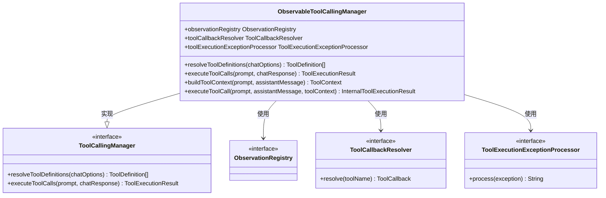
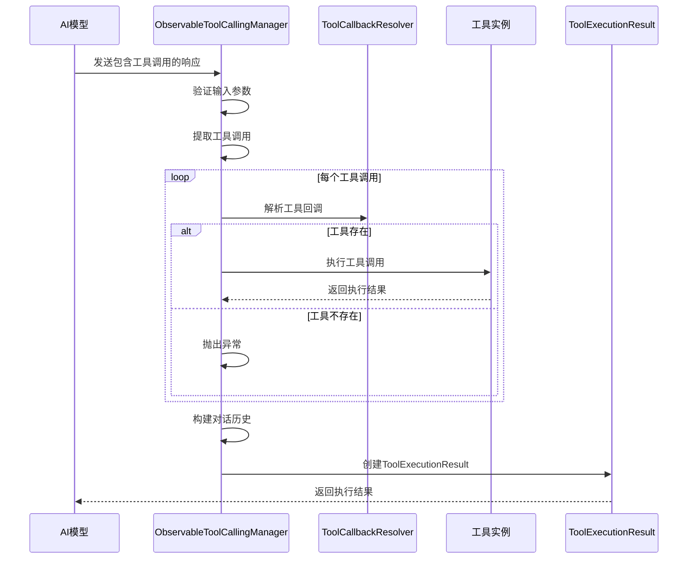
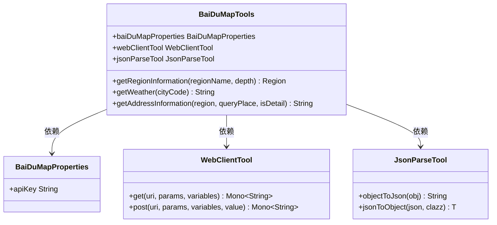
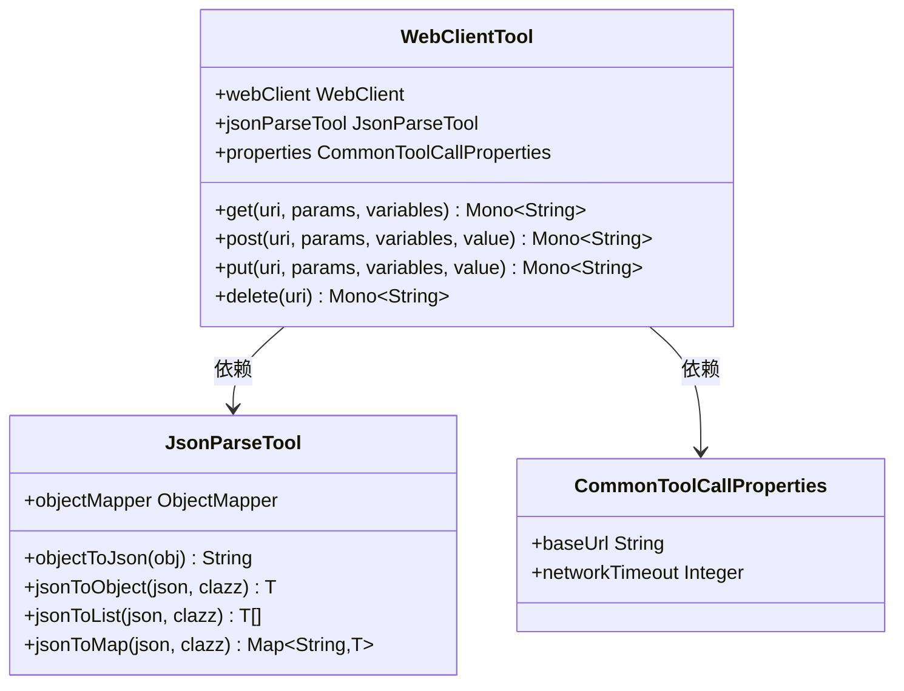
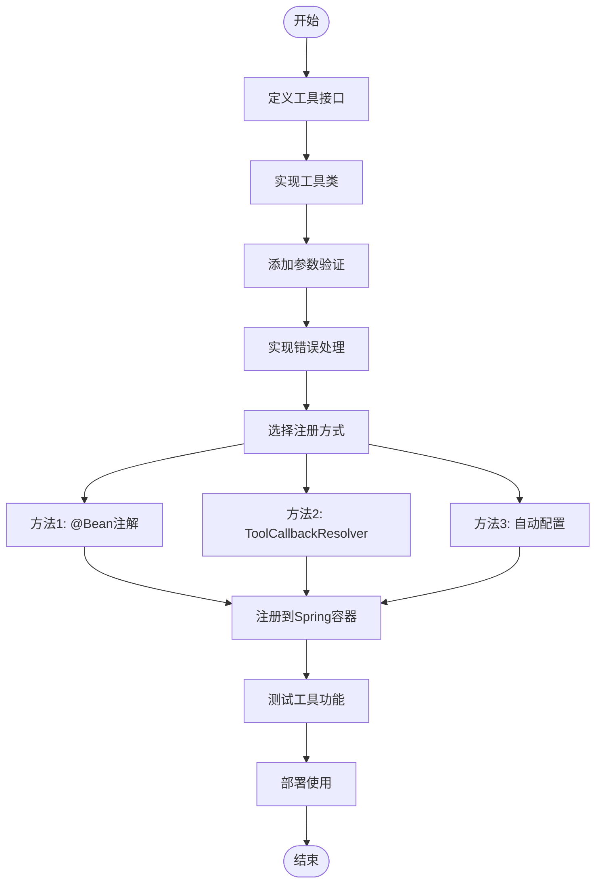

# 工具调用

<cite>
**本文档中引用的文件**
- [ObservableToolCallingManager.java](file://spring-ai-alibaba-core/src/main/java/com/alibaba/cloud/ai/tool/ObservableToolCallingManager.java)
- [WebClientTool.java](file://community/tool-calls/spring-ai-alibaba-starter-tool-calling-common/src/main/java/com/alibaba/cloud/ai/toolcalling/common/WebClientTool.java)
- [JsonParseTool.java](file://community/tool-calls/spring-ai-alibaba-starter-tool-calling-common/src/main/java/com/alibaba/cloud/ai/toolcalling/common/JsonParseTool.java)
- [BaiDuMapTools.java](file://community/tool-calls/spring-ai-alibaba-starter-tool-calling-baidumap/src/main/java/com/alibaba/cloud/ai/toolcalling/baidumap/BaiDuMapTools.java)
- [CommonToolCallAutoConfiguration.java](file://community/tool-calls/spring-ai-alibaba-starter-tool-calling-common/src/main/java/com/alibaba/cloud/ai/toolcalling/common/CommonToolCallAutoConfiguration.java)
</cite>

## 目录
1. [引言](#引言)
2. [ObservableToolCallingManager设计与实现](#observabletoolcallingmanager设计与实现)
3. 内置工具功能与使用方法
   1. [搜索引擎工具](#搜索引擎工具)
   2. [地图服务工具](#地图服务工具)
   3. [翻译服务工具](#翻译服务工具)
   4. [其他实用工具](#其他实用工具)
4. [自定义工具开发与注册](#自定义工具开发与注册)
5. [工具调用生命周期示例](#工具调用生命周期示例)
6. [结论](#结论)

## 引言
spring-ai-alibaba框架提供了一套强大的工具调用机制，使AI代理能够调用外部工具和服务来增强其功能。本文档深入探讨了ObservableToolCallingManager的设计和实现，并全面记录了所有内置工具的功能和使用方法。同时，提供了开发和注册自定义工具的清晰指南，包括接口定义、参数验证和错误处理的最佳实践。

## ObservableToolCallingManager设计与实现
ObservableToolCallingManager是spring-ai-alibaba框架中负责管理工具调用的核心组件。它继承自Spring AI的ToolCallingManager接口，实现了对工具调用的完整生命周期管理。

该类的主要职责包括：
- 解析工具定义：根据聊天选项解析出需要使用的工具定义列表
- 执行工具调用：处理来自AI模型的工具调用请求
- 管理执行上下文：构建和维护工具执行所需的上下文信息
- 处理异常情况：捕获并处理工具执行过程中的异常

ObservableToolCallingManager通过依赖注入的方式获取必要的组件，包括ObservationRegistry（用于监控）、ToolCallbackResolver（用于解析工具回调）和ToolExecutionExceptionProcessor（用于处理执行异常）。这种设计使得系统具有良好的可扩展性和灵活性。

**图源**
- [ObservableToolCallingManager.java](file://spring-ai-alibaba-core/src/main/java/com/alibaba/cloud/ai/tool/ObservableToolCallingManager.java#L55-L334)

**章节来源**
- [ObservableToolCallingManager.java](file://spring-ai-alibaba-core/src/main/java/com/alibaba/cloud/ai/tool/ObservableToolCallingManager.java#L55-L334)

### 核心工作流程
ObservableToolCallingManager的工作流程可以分为以下几个步骤：

1. **接收输入**：接收包含工具调用请求的Prompt和ChatResponse对象
2. **解析工具调用**：从ChatResponse中提取出需要执行的工具调用
3. **构建上下文**：创建工具执行所需的上下文环境
4. **执行调用**：逐个执行每个工具调用，并收集结果
5. **返回结果**：将执行结果封装成ToolExecutionResult对象返回

在执行过程中，系统会为每个工具调用创建一个观察上下文(ArmsToolCallingObservationContext)，用于跟踪调用的执行情况。这使得开发者能够监控工具调用的性能和成功率。

**图源**
- [ObservableToolCallingManager.java](file://spring-ai-alibaba-core/src/main/java/com/alibaba/cloud/ai/tool/ObservableToolCallingManager.java#L122-L156)

**章节来源**
- [ObservableToolCallingManager.java](file://spring-ai-alibaba-core/src/main/java/com/alibaba/cloud/ai/tool/ObservableToolCallingManager.java#L87-L156)

## 内置工具功能与使用方法

### 搜索引擎工具
spring-ai-alibaba框架提供了多种搜索引擎工具，包括百度搜索、Brave搜索、DuckDuckGo搜索等。这些工具允许AI代理查询互联网上的实时信息。

以百度搜索为例，用户可以通过配置application.yml文件来启用和配置搜索功能。工具支持关键词搜索，并能返回相关的搜索结果摘要。

### 地图服务工具
框架集成了多个地图服务提供商的API，包括高德地图(AMap)、百度地图(BaiduMap)和腾讯地图(TencentMap)。这些工具提供了丰富的地理信息服务。

#### 百度地图工具详解
BaiDuMapTools类提供了以下主要功能：
- 获取行政区划信息：通过城市名称查询对应的行政区域代码
- 查询天气信息：根据城市代码获取当前天气状况
- 地点详情查询：获取特定位置的详细地理坐标和相关信息

**图源**
- [BaiDuMapTools.java](file://community/tool-calls/spring-ai-alibaba-starter-tool-calling-baidumap/src/main/java/com/alibaba/cloud/ai/toolcalling/baidumap/BaiDuMapTools.java#L32-L139)

**章节来源**
- [BaiDuMapTools.java](file://community/tool-calls/spring-ai-alibaba-starter-tool-calling-baidumap/src/main/java/com/alibaba/cloud/ai/toolcalling/baidumap/BaiDuMapTools.java#L32-L139)

### 翻译服务工具
框架支持多种翻译服务，包括阿里云翻译(Alitranslate)、百度翻译(Baidutranslate)、谷歌翻译(Googletranslate)和微软翻译(Microsofttranslate)。这些工具可以帮助AI代理处理多语言内容。

### 其他实用工具
除了上述主要类别外，框架还提供了一系列实用工具：

#### 通用工具组件
- **WebClientTool**：基于Spring WebFlux的HTTP客户端工具，用于发送各种HTTP请求
- **JsonParseTool**：JSON处理工具，提供对象与JSON字符串之间的转换功能
- **RestClientTool**：RESTful API调用工具

**图源**
- [WebClientTool.java](file://community/tool-calls/spring-ai-alibaba-starter-tool-calling-common/src/main/java/com/alibaba/cloud/ai/toolcalling/common/WebClientTool.java#L38-L199)
- [JsonParseTool.java](file://community/tool-calls/spring-ai-alibaba-starter-tool-calling-common/src/main/java/com/alibaba/cloud/ai/toolcalling/common/JsonParseTool.java#L33-L199)

**章节来源**
- [WebClientTool.java](file://community/tool-calls/spring-ai-alibaba-starter-tool-calling-common/src/main/java/com/alibaba/cloud/ai/toolcalling/common/WebClientTool.java#L38-L199)
- [JsonParseTool.java](file://community/tool-calls/spring-ai-alibaba-starter-tool-calling-common/src/main/java/com/alibaba/cloud/ai/toolcalling/common/JsonParseTool.java#L33-L199)

## 自定义工具开发与注册
开发自定义工具需要遵循一定的规范和最佳实践。以下是创建自定义工具的步骤：

### 接口定义
自定义工具需要实现ToolCallback接口或其子接口。每个工具必须提供以下基本信息：
- 工具名称(name)
- 功能描述(description)
- 输入参数定义(inputTypeSchema)
- 执行逻辑(call方法)

### 参数验证
在工具执行前，应对输入参数进行严格验证，确保数据的完整性和正确性。建议使用JSR-303 Bean Validation注解来进行参数校验。

### 错误处理
良好的错误处理机制是自定义工具的重要组成部分。应该：
- 捕获所有可能的异常
- 提供有意义的错误信息
- 记录详细的错误日志
- 在必要时进行重试

### 注册方式
自定义工具可以通过以下几种方式注册到系统中：
1. 使用@Configuration类和@Bean注解进行声明式注册
2. 通过ToolCallbackResolver动态解析
3. 利用自动配置机制进行自动发现和注册

**章节来源**
- [CommonToolCallAutoConfiguration.java](file://community/tool-calls/spring-ai-alibaba-starter-tool-calling-common/src/main/java/com/alibaba/cloud/ai/toolcalling/common/CommonToolCallAutoConfiguration.java#L25-L34)

## 工具调用生命周期示例
下面展示一个完整的工具调用生命周期示例：

1. **声明阶段**：在配置文件中声明需要使用的工具
2. **解析阶段**：系统根据配置解析出可用的工具列表
3. **执行阶段**：当AI模型生成工具调用请求时，系统执行相应的工具
4. **结果处理阶段**：收集工具执行结果并返回给AI模型

这个过程体现了spring-ai-alibaba框架中工具调用机制的完整闭环。

## 结论
spring-ai-alibaba框架的工具调用机制为AI应用提供了强大的扩展能力。通过ObservableToolCallingManager的设计，系统能够高效地管理和执行各种外部工具调用。丰富的内置工具库覆盖了搜索、地图、翻译等多个领域，而灵活的自定义工具开发框架则允许开发者根据具体需求扩展功能。这套机制不仅提升了AI代理的能力，也为构建复杂的智能应用提供了坚实的基础。