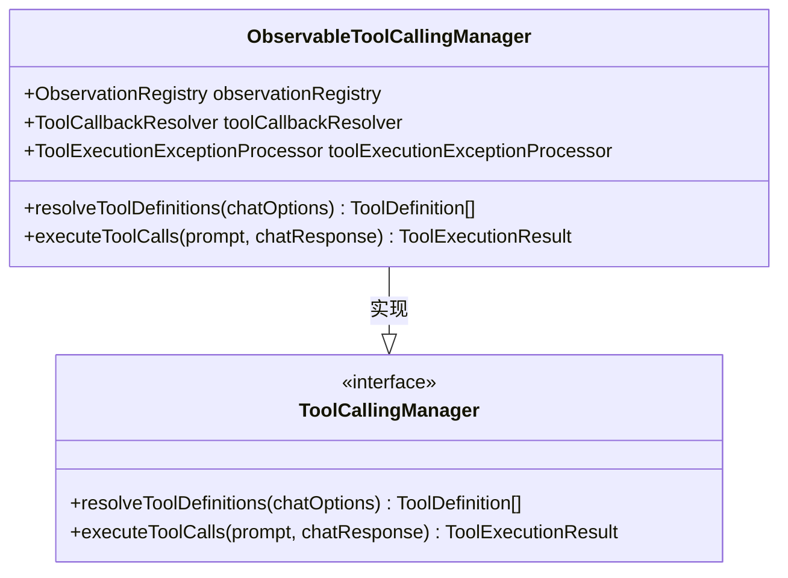
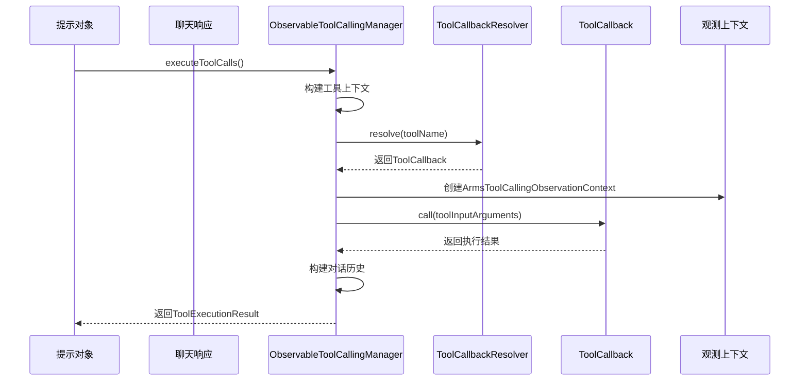
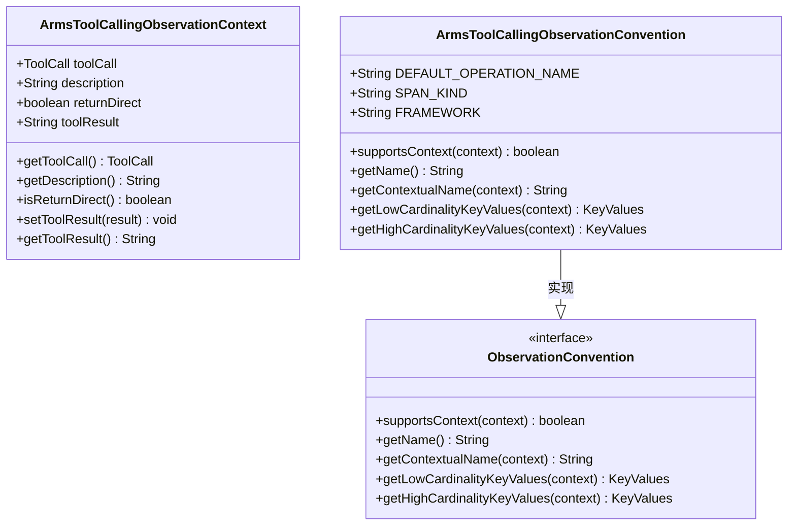
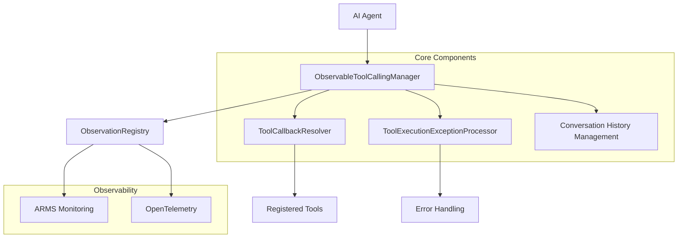

# 工具调用机制

<cite>
**本文档引用的文件**
- [ObservableToolCallingManager.java](file://spring-ai-alibaba-core/src/main/java/com/alibaba/cloud/ai/tool/ObservableToolCallingManager.java)
- [ArmsToolCallingObservationContext.java](file://spring-ai-alibaba-core/src/main/java/com/alibaba/cloud/ai/tool/observation/ArmsToolCallingObservationContext.java)
- [ArmsToolCallingObservationConvention.java](file://spring-ai-alibaba-core/src/main/java/com/alibaba/cloud/ai/tool/observation/ArmsToolCallingObservationConvention.java)
- [ArmsToolCallingObservationDocumentation.java](file://spring-ai-alibaba-core/src/main/java/com/alibaba/cloud/ai/tool/observation/ArmsToolCallingObservationDocumentation.java)
- [ToolCallReactiveContextHolder.java](file://spring-ai-alibaba-core/src/main/java/com/alibaba/cloud/ai/tool/observation/inner/ToolCallReactiveContextHolder.java)
</cite>

## 目录
1. [引言](#引言)
2. [核心组件分析](#核心组件分析)
3. [工具调用生命周期](#工具调用生命周期)
4. [观测性集成](#观测性集成)
5. [并发控制与线程安全](#并发控制与线程安全)
6. [错误处理机制](#错误处理机制)
7. [架构设计图](#架构设计图)

## 引言
本文档深入分析了`ObservableToolCallingManager`的设计原理和实现细节，该组件作为AI代理与外部工具之间的桥梁，支持同步和异步工具调用。文档详细描述了工具注册、发现和执行的完整生命周期，包括参数解析、类型转换和结果封装等关键环节。

## 核心组件分析
`ObservableToolCallingManager`是Spring AI Alibaba中负责管理工具调用的核心组件，它实现了`ToolCallingManager`接口，并提供了增强的观测能力。

### 设计原理
该组件基于Spring AI的默认实现进行扩展，通过引入ARMS（Application Real-Time Monitoring Service）观测框架，实现了对工具调用过程的全面监控。其主要职责包括：
- 解析工具定义
- 执行工具调用
- 管理对话历史
- 收集性能指标



**图表来源**
- [ObservableToolCallingManager.java](file://spring-ai-alibaba-core/src/main/java/com/alibaba/cloud/ai/tool/ObservableToolCallingManager.java#L55-L87)

**章节来源**
- [ObservableToolCallingManager.java](file://spring-ai-alibaba-core/src/main/java/com/alibaba/cloud/ai/tool/ObservableToolCallingManager.java#L55-L87)

## 工具调用生命周期
工具调用的完整生命周期包括注册、发现、执行和结果封装四个阶段。

### 注册与发现
工具通过`ToolCallbackResolver`进行注册和解析。当需要执行特定工具时，系统会首先检查请求中的工具回调列表，如果未找到则通过解析器动态获取：

```java
List<ToolCallback> toolCallbacks = new ArrayList<>(chatOptions.getToolCallbacks());
for (String toolName : chatOptions.getToolNames()) {
    if (chatOptions.getToolCallbacks()
        .stream()
        .anyMatch(tool -> tool.getToolDefinition().name().equals(toolName))) {
        continue;
    }
    ToolCallback toolCallback = this.toolCallbackResolver.resolve(toolName);
    if (toolCallback == null) {
        throw new IllegalStateException("No ToolCallback found for tool name: " + toolName);
    }
    toolCallbacks.add(toolCallback);
}
```

### 执行流程
工具执行流程采用观察者模式包装，确保每个调用都能被正确监控：



**图表来源**
- [ObservableToolCallingManager.java](file://spring-ai-alibaba-core/src/main/java/com/alibaba/cloud/ai/tool/ObservableToolCallingManager.java#L195-L224)
- [ArmsToolCallingObservationContext.java](file://spring-ai-alibaba-core/src/main/java/com/alibaba/cloud/ai/tool/observation/ArmsToolCallingObservationContext.java#L0-L95)

**章节来源**
- [ObservableToolCallingManager.java](file://spring-ai-alibaba-core/src/main/java/com/alibaba/cloud/ai/tool/ObservableToolCallingManager.java#L195-L224)

## 观测性集成
系统通过ARMS和OpenTelemetry收集工具调用的性能指标和追踪信息，提供全面的可观测性支持。

### 观测上下文
`ArmsToolCallingObservationContext`类定义了工具调用的观测上下文，包含以下关键属性：
- `toolCall`: 工具调用详情
- `description`: 工具描述
- `returnDirect`: 是否直接返回
- `toolResult`: 工具执行结果

### 观测约定
`ArmsToolCallingObservationConvention`实现了观测约定接口，定义了低基数和高基数键值对：



**图表来源**
- [ArmsToolCallingObservationContext.java](file://spring-ai-alibaba-core/src/main/java/com/alibaba/cloud/ai/tool/observation/ArmsToolCallingObservationContext.java#L0-L95)
- [ArmsToolCallingObservationConvention.java](file://spring-ai-alibaba-core/src/main/java/com/alibaba/cloud/ai/tool/observation/ArmsToolCallingObservationConvention.java#L0-L128)

**章节来源**
- [ArmsToolCallingObservationConvention.java](file://spring-ai-alibaba-core/src/main/java/com/alibaba/cloud/ai/tool/observation/ArmsToolCallingObservationConvention.java#L0-L128)

## 并发控制与线程安全
系统通过反应式上下文处理器确保工具调用的线程安全性：

```java
ContextView contextView = ToolCallReactiveContextHolder.getContext();
if (contextView != null) {
    observationContext
        .setParentObservation(contextView.getOrDefault(ObservationThreadLocalAccessor.KEY, null));
}
```

这种设计允许在异步环境中正确传递观测上下文，确保跨线程调用的追踪链路完整性。

**章节来源**
- [ObservableToolCallingManager.java](file://spring-ai-alibaba-core/src/main/java/com/alibaba/cloud/ai/tool/ObservableToolCallingManager.java#L215-L224)
- [ToolCallReactiveContextHolder.java](file://spring-ai-alibaba-core/src/main/java/com/alibaba/cloud/ai/tool/observation/inner/ToolCallReactiveContextHolder.java)

## 错误处理机制
系统实现了完善的错误处理机制，能够捕获并处理工具执行过程中的异常：

```java
String toolResult = ArmsToolCallingObservationDocumentation.EXECUTE_TOOL_OPERATION
    .observation(this.observationConvention, DEFAULT_OBSERVATION_CONVENTION, () -> observationContext,
            this.observationRegistry)
    .observe(() -> {
        String result;
        try {
            result = toolCallback.call(toolInputArguments, toolContext);
        }
        catch (ToolExecutionException ex) {
            observationContext.setError(ex);
            result = toolExecutionExceptionProcessor.process(ex);
        }

        observationContext.setToolResult(result);
        return result;
    });
```

当发生`ToolExecutionException`时，系统会：
1. 在观测上下文中记录错误
2. 通过`ToolExecutionExceptionProcessor`处理异常
3. 返回处理后的结果

**章节来源**
- [ObservableToolCallingManager.java](file://spring-ai-alibaba-core/src/main/java/com/alibaba/cloud/ai/tool/ObservableToolCallingManager.java#L215-L224)

## 架构设计图
以下是工具调用机制的整体架构设计：



**图表来源**
- [ObservableToolCallingManager.java](file://spring-ai-alibaba-core/src/main/java/com/alibaba/cloud/ai/tool/ObservableToolCallingManager.java)
- [ArmsToolCallingObservationConvention.java](file://spring-ai-alibaba-core/src/main/java/com/alibaba/cloud/ai/tool/observation/ArmsToolCallingObservationConvention.java)

**章节来源**
- [ObservableToolCallingManager.java](file://spring-ai-alibaba-core/src/main/java/com/alibaba/cloud/ai/tool/ObservableToolCallingManager.java)
- [ArmsToolCallingObservationConvention.java](file://spring-ai-alibaba-core/src/main/java/com/alibaba/cloud/ai/tool/observation/ArmsToolCallingObservationConvention.java)