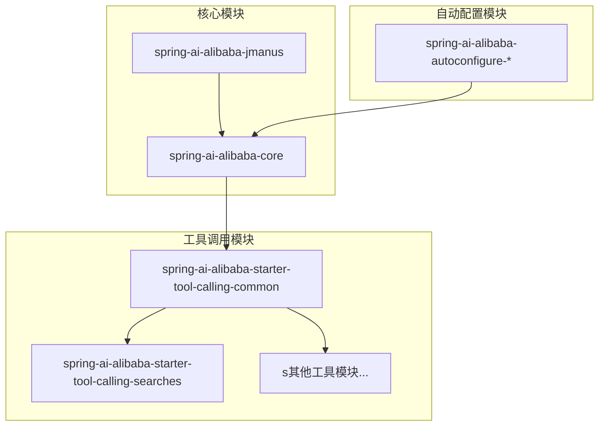
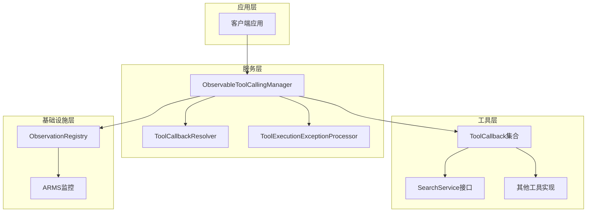
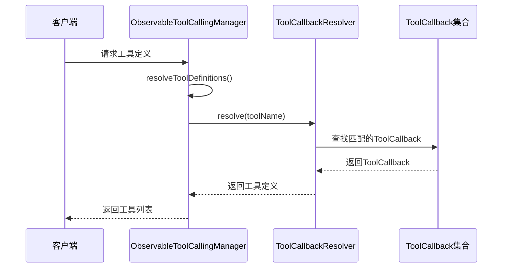
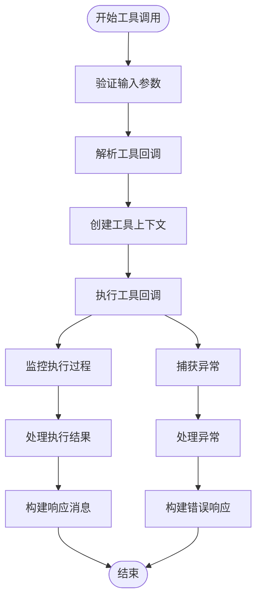
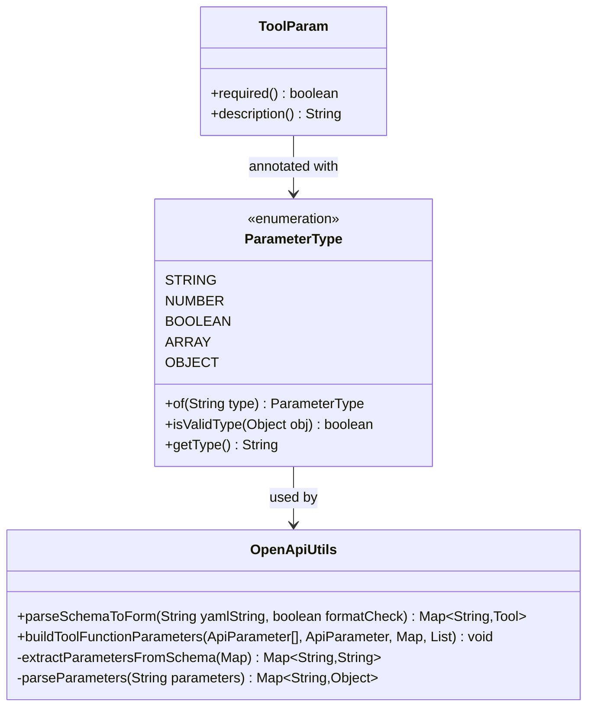
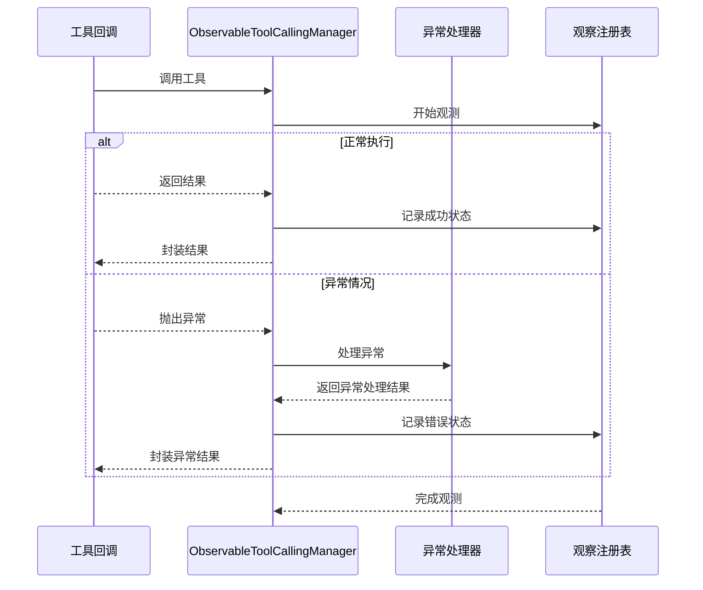
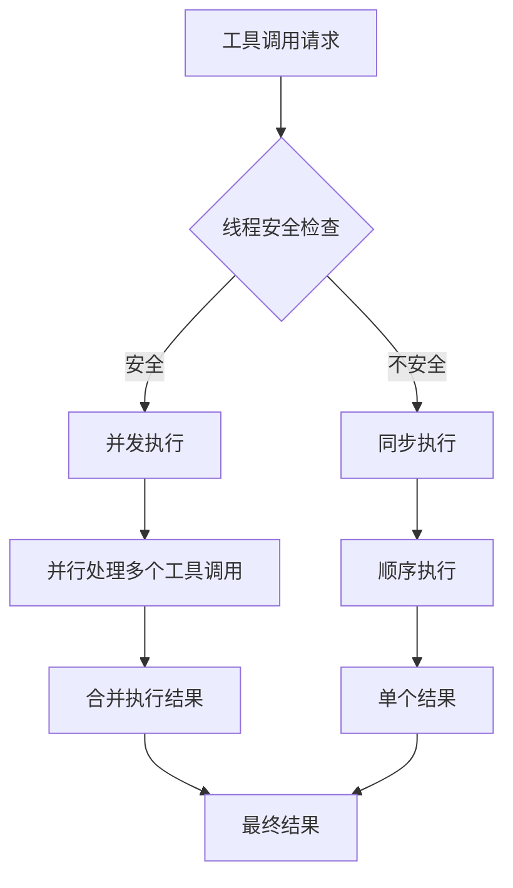
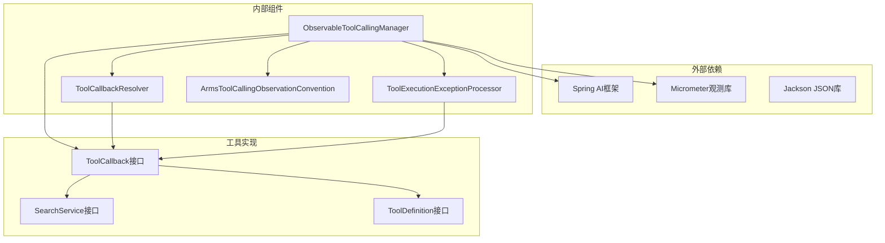

# 核心调用机制

<cite>
**本文档引用的文件**
- [ObservableToolCallingManager.java](file://spring-ai-alibaba-core/src/main/java/com/alibaba/cloud/ai/tool/ObservableToolCallingManager.java)
- [ToolCallingManagerConfiguration.java](file://spring-ai-alibaba-jmanus/src/main/java/com/alibaba/cloud/ai/manus/config/ToolCallingManagerConfiguration.java)
- [SearchService.java](file://community/tool-calls/spring-ai-alibaba-starter-tool-calling-common/src/main/java/com/alibaba/cloud/ai/toolcalling/common/interfaces/SearchService.java)
- [CompositeToolCallbackProvider.java](file://spring-ai-alibaba-studio/spring-ai-alibaba-studio-server/spring-ai-alibaba-studio-server-core/src/main/java/com/alibaba/cloud/ai/studio/core/agent/tool/CompositeToolCallbackProvider.java)
- [ParameterType.java](file://spring-ai-alibaba-studio/spring-ai-alibaba-studio-server/spring-ai-alibaba-studio-server-runtime/src/main/java/com/alibaba/cloud/ai/studio/runtime/enums/ParameterType.java)
- [OpenApiUtils.java](file://spring-ai-alibaba-studio/spring-ai-alibaba-studio-server/spring-ai-alibaba-studio-server-core/src/main/java/com/alibaba/cloud/ai/studio/core/utils/api/OpenApiUtils.java)
</cite>

## 目录
1. [简介](#简介)
2. [项目结构概览](#项目结构概览)
3. [核心组件分析](#核心组件分析)
4. [架构设计](#架构设计)
5. [详细组件分析](#详细组件分析)
6. [依赖关系分析](#依赖关系分析)
7. [性能考虑](#性能考虑)
8. [故障排除指南](#故障排除指南)
9. [结论](#结论)

## 简介

ObservableToolCallingManager是Spring AI Alibaba框架中的核心工具调用管理器，它作为工具调用的中枢节点，负责协调和管理各种工具的注册、发现、执行和监控。该组件继承自Spring AI的DefaultToolCallingManager，并在此基础上增加了可观测性（Observability）功能，支持ARMS监控和链路追踪。

本文档深入分析了ObservableToolCallingManager的设计原理、实现细节以及与其他组件的集成方式，重点关注工具注册与发现机制、同步/异步调用模式、参数解析与类型转换策略、结果封装与异常处理流程。

## 项目结构概览

Spring AI Alibaba采用模块化架构，核心工具调用相关组件主要分布在以下模块中：



**图表来源**
- [ObservableToolCallingManager.java](file://spring-ai-alibaba-core/src/main/java/com/alibaba/cloud/ai/tool/ObservableToolCallingManager.java#L1-L50)
- [ToolCallingManagerConfiguration.java](file://spring-ai-alibaba-jmanus/src/main/java/com/alibaba/cloud/ai/manus/config/ToolCallingManagerConfiguration.java#L1-L50)

## 核心组件分析

### ObservableToolCallingManager核心类

ObservableToolCallingManager是整个工具调用系统的核心控制器，它实现了ToolCallingManager接口并提供了增强的可观测性功能。

```java
public class ObservableToolCallingManager implements ToolCallingManager {
    private final ObservationRegistry observationRegistry;
    private final ToolCallbackResolver toolCallbackResolver;
    private final ToolExecutionExceptionProcessor toolExecutionExceptionProcessor;
    
    // ARMS观测约定
    private final ArmsToolCallingObservationConvention observationConvention;
}
```

该类的关键特性包括：

1. **可观测性集成**：通过ObservationRegistry提供链路追踪和监控能力
2. **工具回调解析**：使用ToolCallbackResolver解析和查找工具回调
3. **异常处理**：集成ToolExecutionExceptionProcessor处理工具执行异常
4. **ARMS集成**：内置ArmsToolCallingObservationConvention提供阿里云ARMS监控

**章节来源**
- [ObservableToolCallingManager.java](file://spring-ai-alibaba-core/src/main/java/com/alibaba/cloud/ai/tool/ObservableToolCallingManager.java#L55-L87)

### CommonToolCallAutoConfiguration自动配置

CommonToolCallAutoConfiguration通过Spring Boot的条件化配置机制，自动装配工具调用基础设施：

```java
@Configuration
public class ToolCallingManagerConfiguration {
    
    @Bean
    @ConditionalOnMissingBean
    @ConditionalOnProperty(name = "manus.tool-calling.use-observable", havingValue = "true")
    public ToolCallingManager observableToolCallingManager(...) {
        // 使用ObservableToolCallingManager实现
        return new ObservableToolCallingManager(...);
    }
    
    @Bean
    @ConditionalOnMissingBean
    @ConditionalOnProperty(name = "manus.tool-calling.use-observable", havingValue = "false", matchIfMissing = true)
    public ToolCallingManager defaultToolCallingManager(...) {
        // 使用默认实现
        return new DefaultToolCallingManager(...);
    }
}
```

**章节来源**
- [ToolCallingManagerConfiguration.java](file://spring-ai-alibaba-jmanus/src/main/java/com/alibaba/cloud/ai/manus/config/ToolCallingManagerConfiguration.java#L52-L116)

## 架构设计

ObservableToolCallingManager采用了分层架构设计，确保了系统的可扩展性和可维护性：



**图表来源**
- [ObservableToolCallingManager.java](file://spring-ai-alibaba-core/src/main/java/com/alibaba/cloud/ai/tool/ObservableToolCallingManager.java#L87-L120)
- [ToolCallingManagerConfiguration.java](file://spring-ai-alibaba-jmanus/src/main/java/com/alibaba/cloud/ai/manus/config/ToolCallingManagerConfiguration.java#L30-L80)

## 详细组件分析

### 工具注册与发现机制

ObservableToolCallingManager通过DelegatingToolCallbackResolver实现工具的动态注册和发现：



**图表来源**
- [ObservableToolCallingManager.java](file://spring-ai-alibaba-core/src/main/java/com/alibaba/cloud/ai/tool/ObservableToolCallingManager.java#L102-L120)

工具发现的具体实现：

```java
@Override
public List<ToolDefinition> resolveToolDefinitions(ToolCallingChatOptions chatOptions) {
    Assert.notNull(chatOptions, "chatOptions cannot be null");
    
    List<ToolCallback> toolCallbacks = new ArrayList<>(chatOptions.getToolCallbacks());
    for (String toolName : chatOptions.getToolNames()) {
        // 检查是否已存在相同名称的工具回调
        if (chatOptions.getToolCallbacks().stream()
            .anyMatch(tool -> tool.getToolDefinition().name().equals(toolName))) {
            continue;
        }
        
        // 通过Resolver查找工具回调
        ToolCallback toolCallback = this.toolCallbackResolver.resolve(toolName);
        if (toolCallback == null) {
            throw new IllegalStateException("No ToolCallback found for tool name: " + toolName);
        }
        toolCallbacks.add(toolCallback);
    }
    
    return toolCallbacks.stream()
        .map(toolCallback -> toolCallback.getToolDefinition())
        .toList();
}
```

**章节来源**
- [ObservableToolCallingManager.java](file://spring-ai-alibaba-core/src/main/java/com/alibaba/cloud/ai/tool/ObservableToolCallingManager.java#L102-L120)

### 同步/异步调用模式

ObservableToolCallingManager支持同步工具调用，并通过Observation机制提供异步监控能力：



**图表来源**
- [ObservableToolCallingManager.java](file://spring-ai-alibaba-core/src/main/java/com/alibaba/cloud/ai/tool/ObservableToolCallingManager.java#L150-L224)

工具执行的核心逻辑：

```java
private InternalToolExecutionResult executeToolCall(Prompt prompt, AssistantMessage assistantMessage, 
                                                    ToolContext toolContext) {
    List<ToolCallback> toolCallbacks = List.of();
    if (prompt.getOptions() instanceof ToolCallingChatOptions toolCallingChatOptions) {
        toolCallbacks = toolCallingChatOptions.getToolCallbacks();
    }
    
    List<ToolResponseMessage.ToolResponse> toolResponses = new ArrayList<>();
    Boolean returnDirect = null;
    
    for (AssistantMessage.ToolCall toolCall : assistantMessage.getToolCalls()) {
        // 工具发现和验证
        String toolName = toolCall.name();
        ToolCallback toolCallback = findToolCallback(toolCallbacks, toolName);
        
        // 创建观测上下文
        ArmsToolCallingObservationContext observationContext = createObservationContext(toolCall, toolCallback);
        
        // 执行工具并监控
        String toolResult = ArmsToolCallingObservationDocumentation.EXECUTE_TOOL_OPERATION
            .observation(this.observationConvention, DEFAULT_OBSERVATION_CONVENTION, () -> observationContext,
                    this.observationRegistry)
            .observe(() -> {
                try {
                    return toolCallback.call(toolCall.arguments(), toolContext);
                } catch (ToolExecutionException ex) {
                    observationContext.setError(ex);
                    return toolExecutionExceptionProcessor.process(ex);
                }
            });
        
        toolResponses.add(new ToolResponseMessage.ToolResponse(toolCall.id(), toolName, toolResult));
    }
    
    return new InternalToolExecutionResult(new ToolResponseMessage(toolResponses, Map.of()), returnDirect);
}
```

**章节来源**
- [ObservableToolCallingManager.java](file://spring-ai-alibaba-core/src/main/java/com/alibaba/cloud/ai/tool/ObservableToolCallingManager.java#L150-L224)

### 参数解析与类型转换策略

系统提供了完整的参数解析和类型转换机制，支持多种数据类型的自动转换：



**图表来源**
- [ParameterType.java](file://spring-ai-alibaba-studio/spring-ai-alibaba-studio-server/spring-ai-alibaba-studio-server-runtime/src/main/java/com/alibaba/cloud/ai/studio/runtime/enums/ParameterType.java#L139-L180)
- [OpenApiUtils.java](file://spring-ai-alibaba-studio/spring-ai-alibaba-studio-server/spring-ai-alibaba-studio-server-core/src/main/java/com/alibaba/cloud/ai/studio/core/utils/api/OpenApiUtils.java#L139-L180)

参数解析的具体实现：

```java
// 类型转换示例
private Map<String, Object> parseParameters(String parameters) {
    try {
        if (parameters == null || parameters.trim().isEmpty()) {
            return new HashMap<>();
        }
        
        JsonNode paramsNode = objectMapper.readTree(parameters);
        return objectMapper.convertValue(paramsNode, Map.class);
    } catch (Exception e) {
        logger.error("解析工具参数时发生错误", e);
        return new HashMap<>();
    }
}

// 参数验证示例
public boolean isValidType(Object obj) {
    switch (this) {
        case STRING:
            return obj instanceof String;
        case NUMBER:
            return isNumber(obj);
        case BOOLEAN:
            return obj instanceof Boolean;
        case ARRAY:
            return obj instanceof Collection;
        case OBJECT:
            return obj instanceof Map;
        default:
            return false;
    }
}
```

**章节来源**
- [OpenApiUtils.java](file://spring-ai-alibaba-studio/spring-ai-alibaba-studio-server/spring-ai-alibaba-studio-server-core/src/main/java/com/alibaba/cloud/ai/studio/core/utils/api/OpenApiUtils.java#L415-L450)
- [ParameterType.java](file://spring-ai-alibaba-studio/spring-ai-alibaba-studio-server/spring-ai-alibaba-studio-server-runtime/src/main/java/com/alibaba/cloud/ai/studio/runtime/enums/ParameterType.java#L139-L180)

### 结果封装与异常处理流程

ObservableToolCallingManager提供了完善的结果封装和异常处理机制：



**图表来源**
- [ObservableToolCallingManager.java](file://spring-ai-alibaba-core/src/main/java/com/alibaba/cloud/ai/tool/ObservableToolCallingManager.java#L195-L224)

异常处理的核心实现：

```java
// 异常处理流程
String toolResult = ArmsToolCallingObservationDocumentation.EXECUTE_TOOL_OPERATION
    .observation(this.observationConvention, DEFAULT_OBSERVATION_CONVENTION, () -> observationContext,
            this.observationRegistry)
    .observe(() -> {
        String result;
        try {
            result = toolCallback.call(toolInputArguments, toolContext);
        } catch (ToolExecutionException ex) {
            observationContext.setError(ex);
            result = toolExecutionExceptionProcessor.process(ex);
        }
        
        observationContext.setToolResult(result);
        return result;
    });

// 结果封装
return new InternalToolExecutionResult(
    new ToolResponseMessage(toolResponses, Map.of()), 
    returnDirect
);
```

**章节来源**
- [ObservableToolCallingManager.java](file://spring-ai-alibaba-core/src/main/java/com/alibaba/cloud/ai/tool/ObservableToolCallingManager.java#L195-L224)

### SearchService接口定义

SearchService定义了统一的搜索工具调用契约：

```java
public interface SearchService {
    /**
     * 每个搜索插件的实现类必须在方法中实现核心简单查询功能
     */
    Response query(String query);
    
    interface Request {
        String getQuery();
    }
    
    interface Response {
        SearchResult getSearchResult();
    }
    
    record SearchResult(List<SearchContent> results) {}
    
    record SearchContent(String title, String content, String url, String icon) {}
}
```

该接口提供了：
- **统一调用入口**：所有搜索插件都实现相同的接口
- **类型安全**：通过泛型确保请求和响应的类型安全
- **扩展性**：支持多种搜索后端的统一调用

**章节来源**
- [SearchService.java](file://community/tool-calls/spring-ai-alibaba-starter-tool-calling-common/src/main/java/com/alibaba/cloud/ai/toolcalling/common/interfaces/SearchService.java#L25-L64)

### 线程安全控制和并发执行策略

ObservableToolCallingManager通过以下机制确保线程安全：



工具回调提供者的线程安全实现：

```java
public static List<ToolCallback> toolCallbacks(...) {
    CompositeToolCallbackProvider provider = new CompositeToolCallbackProvider(...);
    ToolCallback[] toolCallbacks = provider.getToolCallbacks();
    
    if (ArrayUtils.isEmpty(toolCallbacks)) {
        return List.of();
    }
    
    return List.of(toolCallbacks);
}

private void addToolCallbacks(List<ToolCallback> toolCallbacks, List<ToolCallback> newToolCallbacks) {
    Set<String> existingNames = toolCallbacks.stream()
        .map(callback -> callback.getToolDefinition().name())
        .collect(Collectors.toSet());
    
    newToolCallbacks.stream().filter(toolCallback -> {
        String toolName = toolCallback.getToolDefinition().name();
        if (existingNames.contains(toolName)) {
            log.warn("Duplicate tool name found: {}, skipping...", toolName);
            return false;
        }
        existingNames.add(toolName);
        return true;
    }).forEach(toolCallbacks::add);
}
```

**章节来源**
- [CompositeToolCallbackProvider.java](file://spring-ai-alibaba-studio/spring-ai-alibaba-studio-server/spring-ai-alibaba-studio-server-core/src/main/java/com/alibaba/cloud/ai/studio/core/agent/tool/CompositeToolCallbackProvider.java#L132-L165)

## 依赖关系分析

ObservableToolCallingManager的依赖关系图展示了各组件之间的交互：



**图表来源**
- [ObservableToolCallingManager.java](file://spring-ai-alibaba-core/src/main/java/com/alibaba/cloud/ai/tool/ObservableToolCallingManager.java#L25-L50)

**章节来源**
- [ObservableToolCallingManager.java](file://spring-ai-alibaba-core/src/main/java/com/alibaba/cloud/ai/tool/ObservableToolCallingManager.java#L25-L50)

## 性能考虑

ObservableToolCallingManager在设计时充分考虑了性能优化：

1. **延迟加载**：工具回调按需解析，避免不必要的初始化开销
2. **缓存机制**：工具定义信息可以被缓存以提高重复访问性能
3. **异步监控**：观测数据记录采用异步方式，减少对主流程的影响
4. **批量处理**：支持多个工具调用的批量执行，提高吞吐量

## 故障排除指南

### 常见问题及解决方案

1. **工具未找到异常**
   ```
   IllegalStateException: No ToolCallback found for tool name: {toolName}
   ```
   **解决方案**：检查工具注册配置，确保工具回调正确注册到ToolCallbackResolver

2. **参数解析失败**
   ```
   IllegalArgumentException: Failed to parse tool parameters
   ```
   **解决方案**：验证JSON参数格式，确保符合预期的数据结构

3. **观测数据丢失**
   ```
   Observation data not recorded
   ```
   **解决方案**：检查ObservationRegistry配置，确保正确初始化

**章节来源**
- [ObservableToolCallingManager.java](file://spring-ai-alibaba-core/src/main/java/com/alibaba/cloud/ai/tool/ObservableToolCallingManager.java#L195-L224)

## 结论

ObservableToolCallingManager作为Spring AI Alibaba框架的核心组件，通过精心设计的架构和完善的机制，为工具调用提供了强大的支持。其主要优势包括：

1. **统一的工具管理**：通过ToolCallbackResolver实现工具的统一管理和发现
2. **可观测性支持**：内置ARMS监控和链路追踪功能，便于运维和调试
3. **灵活的配置**：支持条件化配置，可以根据需求选择不同的实现
4. **完善的异常处理**：提供全面的异常处理和恢复机制
5. **类型安全**：通过强类型接口确保参数和返回值的安全性

该组件的设计理念体现了现代软件工程的最佳实践，为构建可扩展、可维护的AI应用提供了坚实的基础。通过深入理解其实现原理和设计思想，开发者可以更好地利用这一强大工具来构建复杂的AI应用场景。