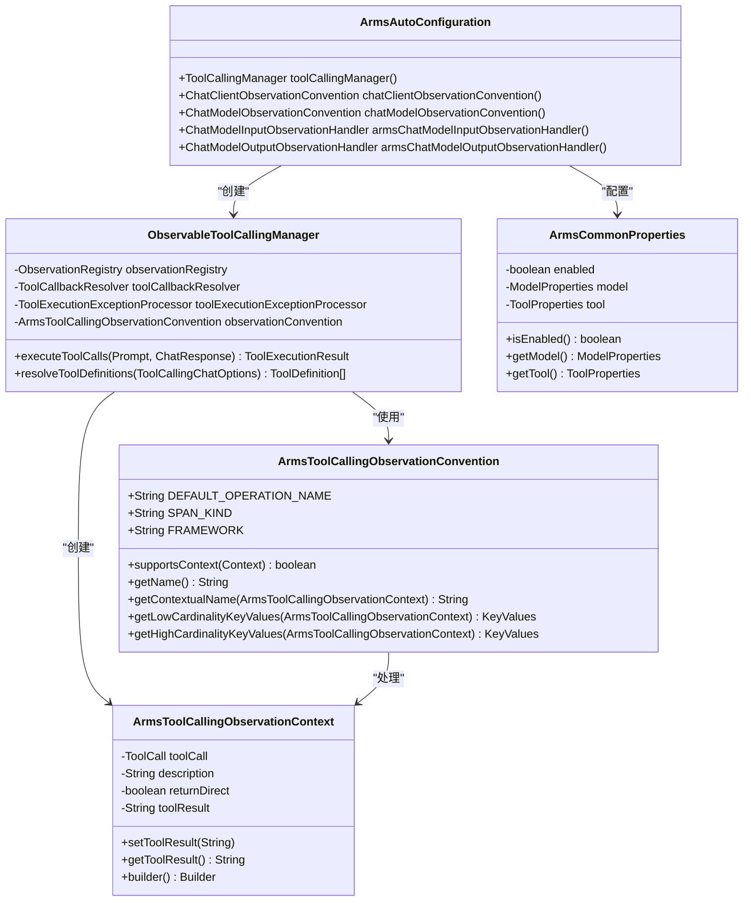
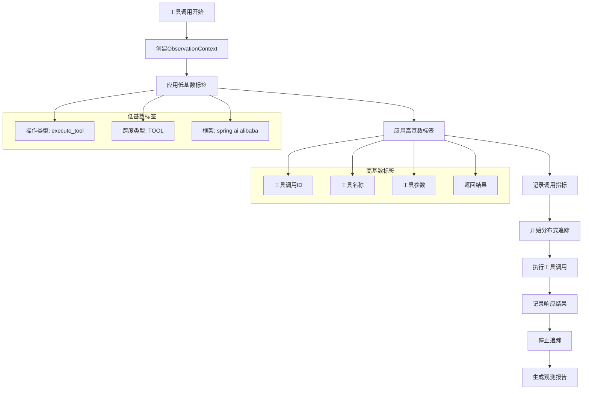
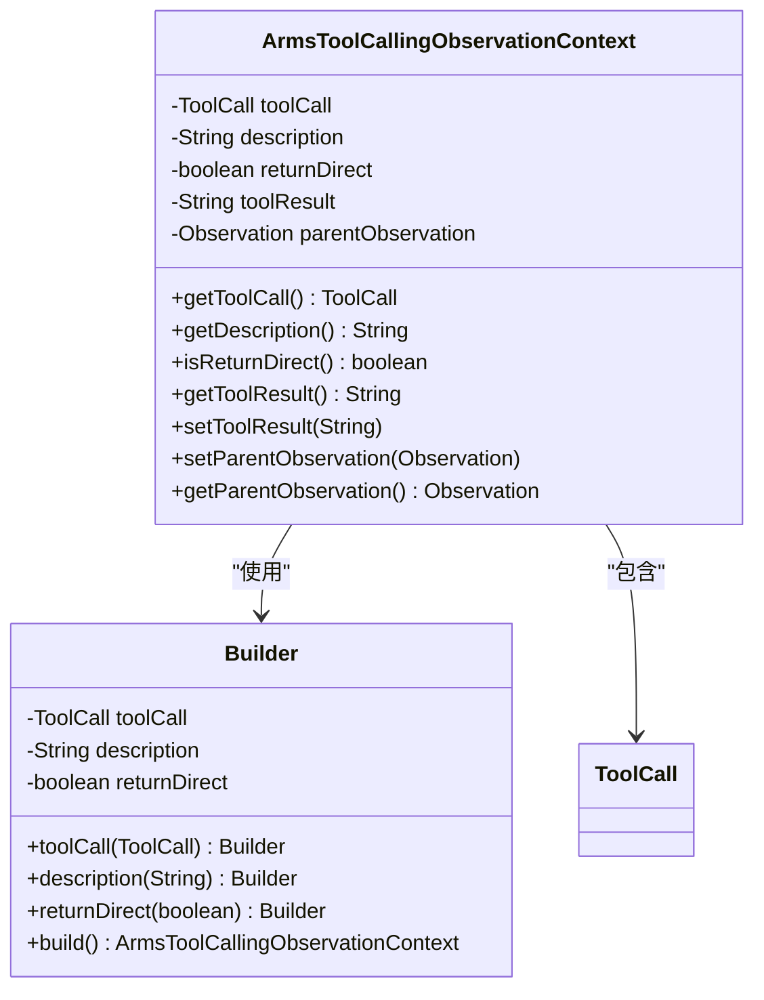
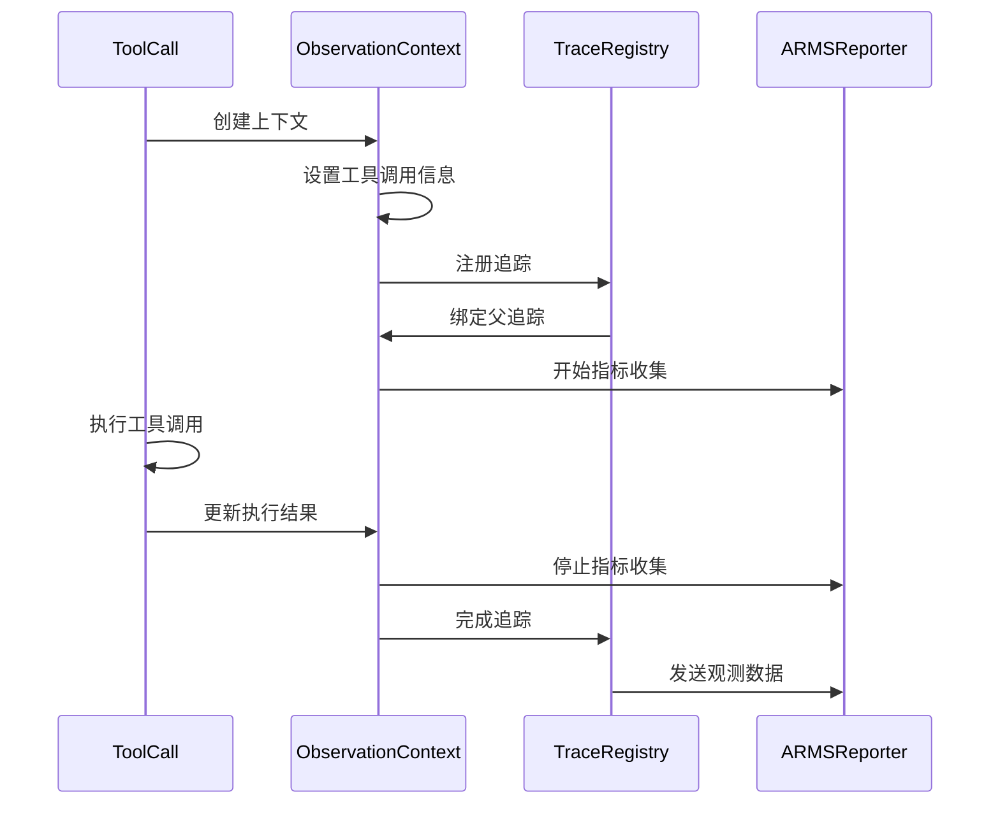
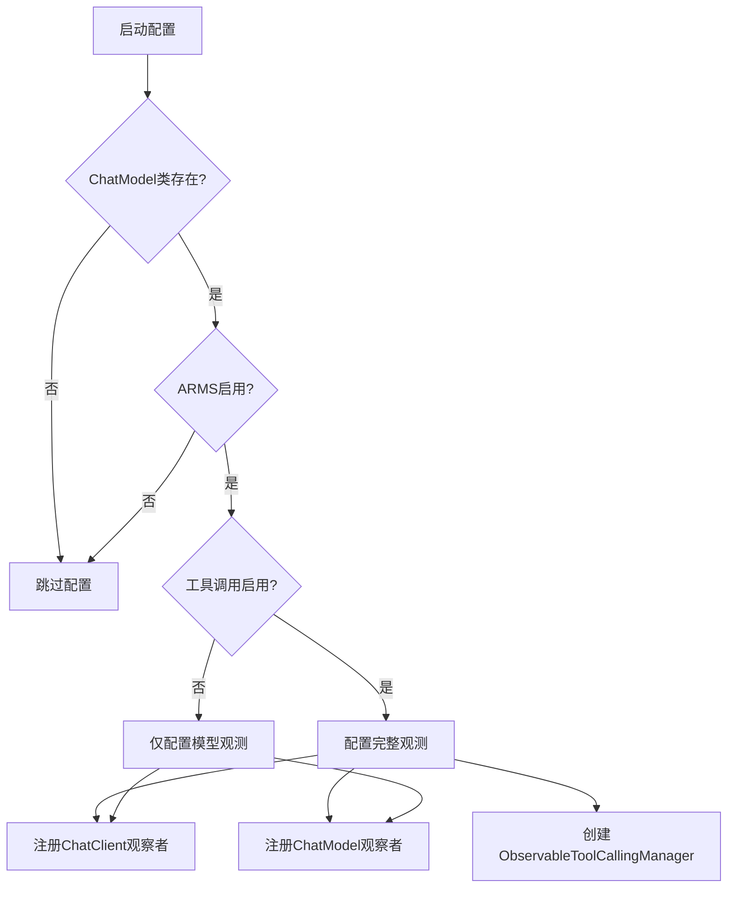
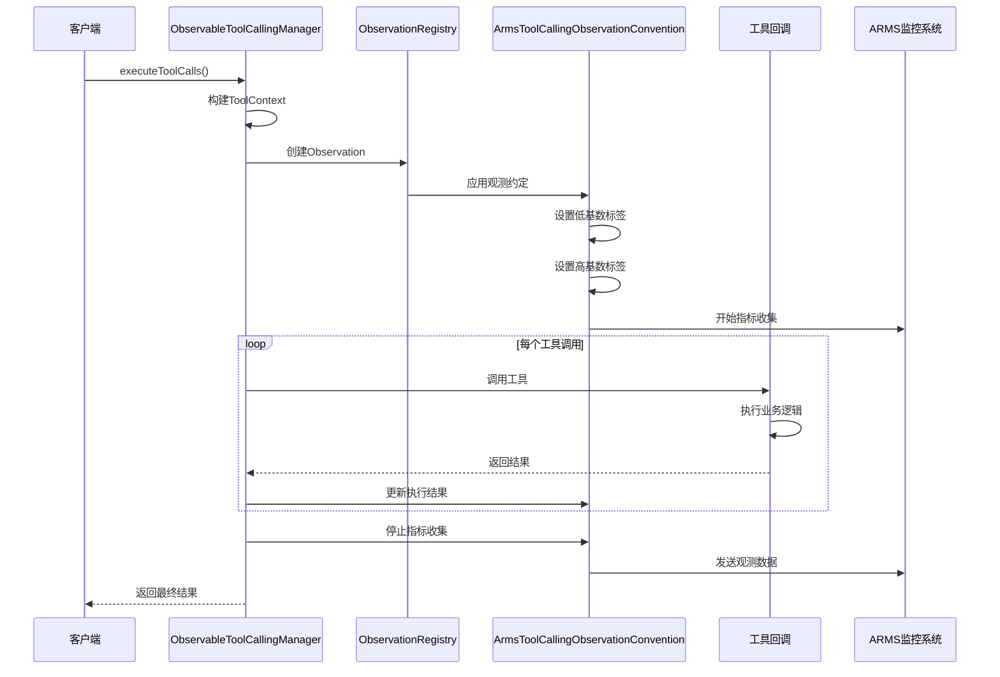

# 观测性集成

<cite>
**本文档引用的文件**
- [ArmsAutoConfiguration.java](file://auto-configurations/spring-ai-alibaba-autoconfigure-arms-observation/src/main/java/com/alibaba/cloud/ai/autoconfigure/arms/ArmsAutoConfiguration.java)
- [ArmsCommonProperties.java](file://auto-configurations/spring-ai-alibaba-autoconfigure-arms-observation/src/main/java/com/alibaba/cloud/ai/autoconfigure/arms/ArmsCommonProperties.java)
- [ArmsToolCallingObservationConvention.java](file://spring-ai-alibaba-core/src/main/java/com/alibaba/cloud/ai/tool/observation/ArmsToolCallingObservationConvention.java)
- [ArmsToolCallingObservationContext.java](file://spring-ai-alibaba-core/src/main/java/com/alibaba/cloud/ai/tool/observation/ArmsToolCallingObservationContext.java)
- [ArmsToolCallingObservationDocumentation.java](file://spring-ai-alibaba-core/src/main/java/com/alibaba/cloud/ai/tool/observation/ArmsToolCallingObservationDocumentation.java)
- [ObservableToolCallingManager.java](file://spring-ai-alibaba-core/src/main/java/com/alibaba/cloud/ai/tool/ObservableToolCallingManager.java)
- [ArmsToolCallingObservationIT.java](file://spring-ai-alibaba-core/src/test/java/com/alibaba/cloud/ai/tool/observation/ArmsToolCallingObservationIT.java)
</cite>

## 目录
1. [概述](#概述)
2. [核心组件架构](#核心组件架构)
3. [ArmsToolCallingObservationConvention详解](#armstoolcallingobservationconvention详解)
4. [ArmsToolCallingObservationContext上下文管理](#armstoolcallingobservationcontext上下文管理)
5. [ArmsAutoConfiguration自动配置](#armsautoconfiguration自动配置)
6. [工具调用追踪链路](#工具调用追踪链路)
7. [配置与使用](#配置与使用)
8. [生产环境监控实践](#生产环境监控实践)
9. [故障诊断指南](#故障诊断指南)
10. [总结](#总结)

## 概述

Spring AI Alibaba的观测性集成机制通过ArmsToolCallingObservationConvention和ArmsToolCallingObservationContext为核心，提供了完整的工具调用监控解决方案。该系统基于Micrometer Observation框架，实现了从工具调用开始到结束的完整追踪链路，包括指标采集、分布式追踪和日志关联。

观测性集成的核心价值在于：
- **实时监控**：提供工具调用的实时性能指标
- **问题诊断**：快速定位工具调用异常
- **性能优化**：基于历史数据进行性能分析
- **运维支持**：为生产环境提供全面的可观测性

## 核心组件架构



**图表来源**
- [ArmsAutoConfiguration.java](file://auto-configurations/spring-ai-alibaba-autoconfigure-arms-observation/src/main/java/com/alibaba/cloud/ai/autoconfigure/arms/ArmsAutoConfiguration.java#L37-L87)
- [ObservableToolCallingManager.java](file://spring-ai-alibaba-core/src/main/java/com/alibaba/cloud/ai/tool/ObservableToolCallingManager.java#L55-L87)
- [ArmsToolCallingObservationConvention.java](file://spring-ai-alibaba-core/src/main/java/com/alibaba/cloud/ai/tool/observation/ArmsToolCallingObservationConvention.java#L25-L129)

**章节来源**
- [ArmsAutoConfiguration.java](file://auto-configurations/spring-ai-alibaba-autoconfigure-arms-observation/src/main/java/com/alibaba/cloud/ai/autoconfigure/arms/ArmsAutoConfiguration.java#L1-L88)
- [ObservableToolCallingManager.java](file://spring-ai-alibaba-core/src/main/java/com/alibaba/cloud/ai/tool/ObservableToolCallingManager.java#L1-L336)

## ArmsToolCallingObservationConvention详解

ArmsToolCallingObservationConvention是观测性集成的核心约定类，负责定义ARMS监控的语义约定和指标收集规则。

### 核心特性



**图表来源**
- [ArmsToolCallingObservationConvention.java](file://spring-ai-alibaba-core/src/main/java/com/alibaba/cloud/ai/tool/observation/ArmsToolCallingObservationConvention.java#L40-L129)

### 关键方法解析

#### 1. 支持上下文验证
```java
@Override
public boolean supportsContext(Context context) {
    return context instanceof ArmsToolCallingObservationContext;
}
```

#### 2. 获取操作名称
```java
@Override
public String getName() {
    return DEFAULT_OPERATION_NAME;
}

@Override
public String getContextualName(ArmsToolCallingObservationContext context) {
    if (StringUtils.hasText(context.getToolCall().name())) {
        return "%s %s".formatted(DEFAULT_OPERATION_NAME, context.getToolCall().name());
    }
    return DEFAULT_OPERATION_NAME;
}
```

#### 3. 指标收集策略
系统分为低基数和高基数两种指标：

**低基数指标**（固定数量）：
- `ai.operation.type`: 操作类型（execute_tool）
- `gen_ai.span.kind`: 跨度类型（TOOL）
- `gen_ai.framework`: 框架标识（spring ai alibaba）

**高基数指标**（动态数量）：
- `gen_ai.tool.call.id`: 工具调用唯一标识
- `gen_ai.tool.name`: 工具名称
- `tool.parameters`: 工具参数
- `output.value`: 执行结果

**章节来源**
- [ArmsToolCallingObservationConvention.java](file://spring-ai-alibaba-core/src/main/java/com/alibaba/cloud/ai/tool/observation/ArmsToolCallingObservationConvention.java#L1-L129)

## ArmsToolCallingObservationContext上下文管理

ArmsToolCallingObservationContext负责捕获和管理工具调用的上下文信息，确保整个调用生命周期的数据完整性。

### 上下文结构设计



**图表来源**
- [ArmsToolCallingObservationContext.java](file://spring-ai-alibaba-core/src/main/java/com/alibaba/cloud/ai/tool/observation/ArmsToolCallingObservationContext.java#L25-L94)

### 上下文构建模式

系统采用Builder模式构建上下文对象，确保线程安全和可配置性：

```java
ArmsToolCallingObservationContext observationContext = ArmsToolCallingObservationContext.builder()
    .toolCall(toolCall)
    .description(toolCallback.getToolDefinition().description())
    .returnDirect(returnDirect)
    .build();
```

### 上下文生命周期管理



**图表来源**
- [ObservableToolCallingManager.java](file://spring-ai-alibaba-core/src/main/java/com/alibaba/cloud/ai/tool/ObservableToolCallingManager.java#L195-L224)

**章节来源**
- [ArmsToolCallingObservationContext.java](file://spring-ai-alibaba-core/src/main/java/com/alibaba/cloud/ai/tool/observation/ArmsToolCallingObservationContext.java#L1-L94)

## ArmsAutoConfiguration自动配置

ArmsAutoConfiguration是观测性集成的自动配置类，负责根据条件自动配置观测组件并与Spring AI的ObservationRegistry集成。

### 配置条件



**图表来源**
- [ArmsAutoConfiguration.java](file://auto-configurations/spring-ai-alibaba-autoconfigure-arms-observation/src/main/java/com/alibaba/cloud/ai/autoconfigure/arms/ArmsAutoConfiguration.java#L37-L87)

### 自动配置流程

#### 1. 工具调用管理器配置
```java
@Bean
@ConditionalOnProperty(prefix = ArmsCommonProperties.CONFIG_PREFIX, name = "tool.enabled", havingValue = "true")
ToolCallingManager toolCallingManager(ToolCallbackResolver toolCallbackResolver,
        ToolExecutionExceptionProcessor toolExecutionExceptionProcessor,
        ObjectProvider<ObservationRegistry> observationRegistry) {
    return ObservableToolCallingManager.builder()
        .observationRegistry(observationRegistry.getIfUnique(() -> ObservationRegistry.NOOP))
        .toolCallbackResolver(toolCallbackResolver)
        .toolExecutionExceptionProcessor(toolExecutionExceptionProcessor)
        .build();
}
```

#### 2. 观察者配置
```java
@Bean
ChatClientObservationConvention chatClientObservationConvention() {
    return new PromptMetadataAwareChatClientObservationConvention();
}

@Bean
ChatModelObservationConvention chatModelObservationConvention() {
    return new PromptMetadataAwareChatModelObservationConvention();
}
```

#### 3. 输入输出观测处理器
```java
@Bean
@ConditionalOnMissingBean(value = { ChatModelInputObservationHandler.class },
        name = { "chatModelInputObservationHandler" })
@ConditionalOnProperty(prefix = ArmsCommonProperties.CONFIG_PREFIX, name = "model.capture-input",
        havingValue = "true")
ChatModelInputObservationHandler armsChatModelInputObservationHandler(ArmsCommonProperties properties) {
    return new ChatModelInputObservationHandler(properties.getModel().getMessageMode());
}

@Bean
@ConditionalOnMissingBean(value = { ChatModelOutputObservationHandler.class },
        name = { "chatModelOutputObservationHandler" })
@ConditionalOnProperty(prefix = ArmsCommonProperties.CONFIG_PREFIX, name = "model.capture-output",
        havingValue = "true")
ChatModelOutputObservationHandler armsChatModelOutputObservationHandler(ArmsCommonProperties properties) {
    return new ChatModelOutputObservationHandler(properties.getModel().getMessageMode());
}
```

**章节来源**
- [ArmsAutoConfiguration.java](file://auto-configurations/spring-ai-alibaba-autoconfigure-arms-observation/src/main/java/com/alibaba/cloud/ai/autoconfigure/arms/ArmsAutoConfiguration.java#L1-L88)

## 工具调用追踪链路

从工具调用开始到结束的完整追踪链路展示了观测性系统的全貌。

### 追踪链路架构



**图表来源**
- [ObservableToolCallingManager.java](file://spring-ai-alibaba-core/src/main/java/com/alibaba/cloud/ai/tool/ObservableToolCallingManager.java#L170-L250)

### 关键执行点

#### 1. 工具调用解析
```java
private InternalToolExecutionResult executeToolCall(Prompt prompt, AssistantMessage assistantMessage,
        ToolContext toolContext) {
    // 解析工具调用信息
    List<ToolCallback> toolCallbacks = List.of();
    if (prompt.getOptions() instanceof ToolCallingChatOptions toolCallingChatOptions) {
        toolCallbacks = toolCallingChatOptions.getToolCallbacks();
    }
    
    // 创建观测上下文
    ArmsToolCallingObservationContext observationContext = ArmsToolCallingObservationContext.builder()
        .toolCall(toolCall)
        .description(toolCallback.getToolDefinition().description())
        .returnDirect(returnDirect)
        .build();
        
    // 应用观测
    String toolResult = ArmsToolCallingObservationDocumentation.EXECUTE_TOOL_OPERATION
        .observation(this.observationConvention, DEFAULT_OBSERVATION_CONVENTION, () -> observationContext,
                this.observationRegistry)
        .observe(() -> {
            // 执行工具调用逻辑
            String result = toolCallback.call(toolInputArguments, toolContext);
            observationContext.setToolResult(result);
            return result;
        });
}
```

#### 2. 分布式追踪集成
系统通过ObservationThreadLocalAccessor获取当前线程的追踪上下文，确保父子追踪关系的正确建立。

**章节来源**
- [ObservableToolCallingManager.java](file://spring-ai-alibaba-core/src/main/java/com/alibaba/cloud/ai/tool/ObservableToolCallingManager.java#L170-L250)

## 配置与使用

### 基础配置

#### 1. Maven依赖
```xml
<dependency>
    <groupId>com.alibaba.cloud</groupId>
    <artifactId>spring-ai-alibaba-starter-arms-observation</artifactId>
</dependency>
```

#### 2. 应用配置
```yaml
spring:
  ai:
    alibaba:
      arms:
        enabled: true
        tool:
          enabled: true
        model:
          capture-input: true
          capture-output: true
          message-mode: OPEN_TELEMETRY
```

### 高级配置选项

#### 模型观测配置
```java
public static class ModelProperties {
    private boolean captureInput = false;
    private boolean captureOutput = false;
    private MessageMode messageMode = MessageMode.OPEN_TELEMETRY;
}
```

#### 工具观测配置
```java
public static class ToolProperties {
    private boolean enabled = true;
}
```

### 编程式使用

```java
@Autowired
private ObservationRegistry observationRegistry;

// 在自定义工具中使用观测
public class CustomTool {
    public String execute(String input) {
        return ArmsToolCallingObservationDocumentation.EXECUTE_TOOL_OPERATION
            .observation(customConvention, customConvention, () -> {
                // 工具执行逻辑
                return process(input);
            }, observationRegistry)
            .observe(() -> {
                // 实际执行
                return "result";
            });
    }
}
```

**章节来源**
- [ArmsCommonProperties.java](file://auto-configurations/spring-ai-alibaba-autoconfigure-arms-observation/src/main/java/com/alibaba/cloud/ai/autoconfigure/arms/ArmsCommonProperties.java#L1-L123)

## 生产环境监控实践

### 监控指标体系

#### 1. 性能指标
- **调用次数**: 工具被调用的总次数
- **响应时间**: 单次工具调用的耗时分布
- **成功率**: 工具调用的成功率统计
- **并发数**: 同时进行的工具调用数量

#### 2. 质量指标
- **错误率**: 工具调用失败的比例
- **超时率**: 超过阈值的调用比例
- **重试次数**: 因失败而重试的次数

#### 3. 业务指标
- **工具使用频率**: 不同工具的使用情况
- **参数分布**: 工具参数的统计分布
- **结果质量**: 工具输出的质量评估

### 实际案例

#### 场景：天气查询工具监控
```java
@Test
void toolCallMonitoringExample() {
    // 配置观测注册表
    TestObservationRegistry registry = TestObservationRegistry.create();
    
    // 执行工具调用
    String result = executeWeatherTool("北京");
    
    // 验证观测数据
    TestObservationRegistryAssert.assertThat(registry)
        .hasObservationWithNameEqualTo("execute_tool")
        .hasLowCardinalityKeyValue("ai.operation.type", "execute_tool")
        .hasHighCardinalityKeyValue("gen_ai.tool.name", "getCurrentWeather")
        .hasHighCardinalityKeyValue("tool.parameters", "{\"location\":\"北京\"}")
        .hasBeenStarted()
        .hasBeenStopped();
}
```

#### 场景：批量工具调用监控
```java
@Test
void batchToolCallMonitoring() {
    List<String> locations = Arrays.asList("北京", "上海", "广州", "深圳");
    
    // 并发执行多个工具调用
    List<String> results = locations.parallelStream()
        .map(location -> executeWeatherTool(location))
        .collect(Collectors.toList());
    
    // 监控整体性能
    assertThat(results).hasSize(locations.size());
    assertThat(registry.find("execute_tool").get().getLongTaskTimer())
        .hasTotalTimeGreaterThan(Duration.ZERO);
}
```

**章节来源**
- [ArmsToolCallingObservationIT.java](file://spring-ai-alibaba-core/src/test/java/com/alibaba/cloud/ai/tool/observation/ArmsToolCallingObservationIT.java#L250-L316)

## 故障诊断指南

### 常见问题及解决方案

#### 1. 观测数据缺失
**症状**: 工具调用没有产生观测数据
**可能原因**:
- ARMS观测未启用
- 工具调用未正确配置
- 观测注册表未注入

**解决方案**:
```yaml
spring:
  ai:
    alibaba:
      arms:
        enabled: true
        tool:
          enabled: true
```

#### 2. 性能指标不准确
**症状**: 观测到的响应时间与实际不符
**可能原因**:
- 系统时间不同步
- 观测时机不正确
- 并发控制不当

**解决方案**:
```java
// 确保正确的观测时机
String result = ArmsToolCallingObservationDocumentation.EXECUTE_TOOL_OPERATION
    .observation(convention, convention, () -> context, registry)
    .observe(() -> {
        long startTime = System.nanoTime();
        try {
            return executeTool();
        } finally {
            long endTime = System.nanoTime();
            // 记录精确时间
        }
    });
```

#### 3. 内存泄漏
**症状**: 长时间运行后内存占用持续增长
**可能原因**:
- 观测数据未及时清理
- 上下文对象未正确释放

**解决方案**:
```java
// 使用try-with-resources确保资源释放
try (var observation = observationRegistry.observation("tool_call")) {
    observation.start();
    // 执行工具调用
} finally {
    // 自动清理资源
}
```

### 监控仪表板配置

#### ARMS仪表板设置
1. **创建自定义指标**:
   - 指标名称: `tool_call_duration`
   - 类型: 分布式直方图
   - 标签: `tool_name`, `status`

2. **告警规则配置**:
   - 响应时间超过5秒
   - 错误率超过5%
   - 调用量低于预期

3. **可视化图表**:
   - 工具调用趋势图
   - 成功率折线图
   - 响应时间分布图

### 日志关联

#### 结构化日志格式
```json
{
  "timestamp": "2024-01-01T12:00:00Z",
  "traceId": "abc123def456",
  "spanId": "xyz789uvw012",
  "operation": "execute_tool",
  "toolName": "getCurrentWeather",
  "parameters": "{\"location\":\"北京\"}",
  "result": "晴朗，温度25°C",
  "durationMs": 123,
  "status": "SUCCESS"
}
```

#### 日志级别配置
```yaml
logging:
  level:
    com.alibaba.cloud.ai.tool: DEBUG
    io.micrometer.observation: INFO
```

## 总结

Spring AI Alibaba的观测性集成通过ArmsToolCallingObservationConvention和ArmsToolCallingObservationContext提供了完整的工具调用监控解决方案。该系统具有以下优势：

### 技术优势
1. **标准化**: 基于Micrometer Observation框架，符合行业标准
2. **可扩展**: 支持自定义观测约定和处理器
3. **高性能**: 低侵入性设计，对性能影响最小
4. **易集成**: 自动配置机制简化了部署过程

### 功能特性
1. **全面覆盖**: 从工具调用到响应结果的完整追踪
2. **灵活配置**: 支持多种观测模式和过滤条件
3. **实时监控**: 提供实时的性能指标和状态信息
4. **智能告警**: 基于阈值和模式识别的智能告警机制

### 应用价值
1. **提升运维效率**: 通过自动化监控减少人工干预
2. **保障系统稳定**: 及时发现和解决潜在问题
3. **优化用户体验**: 基于数据分析持续改进服务质量
4. **支持业务决策**: 提供丰富的运营数据支撑决策

通过合理配置和使用观测性集成，开发团队可以在生产环境中获得强大的可观测性能力，确保AI应用的稳定运行和持续优化。