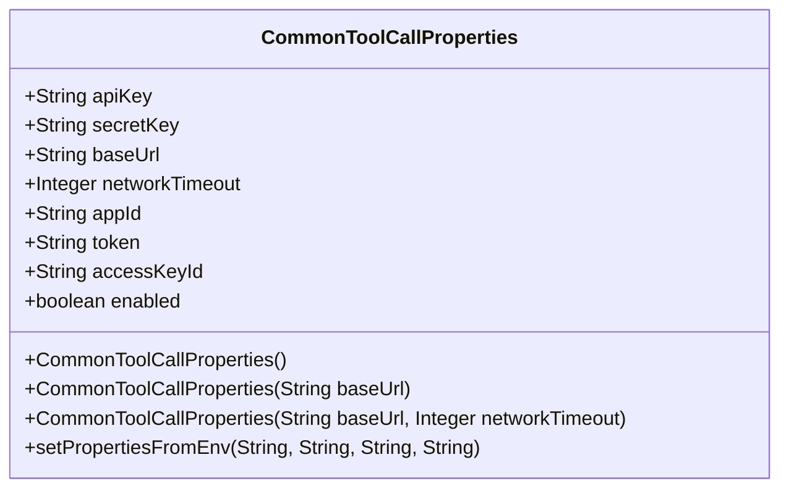
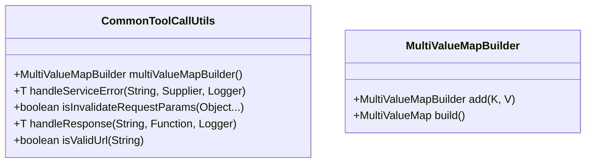
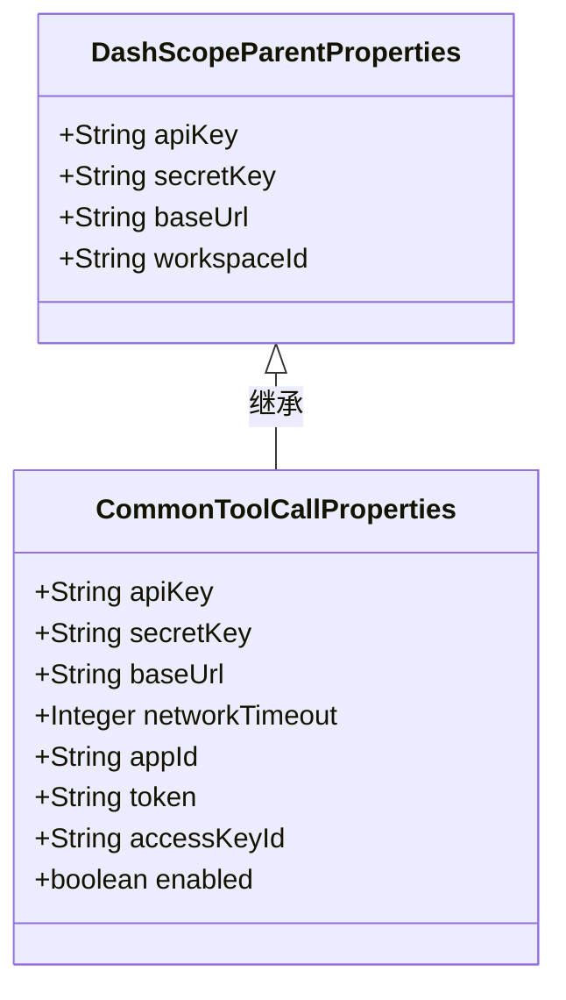

# 配置管理

<cite>
**本文档中引用的文件**
- [CommonToolCallProperties.java](file://community/tool-calls/spring-ai-alibaba-starter-tool-calling-common/src/main/java/com/alibaba/cloud/ai/toolcalling/common/CommonToolCallProperties.java)
- [CommonToolCallUtils.java](file://community/tool-calls/spring-ai-alibaba-starter-tool-calling-common/src/main/java/com/alibaba/cloud/ai/toolcalling/common/CommonToolCallUtils.java)
- [CommonToolCallConstants.java](file://community/tool-calls/spring-ai-alibaba-starter-tool-calling-common/src/main/java/com/alibaba/cloud/ai/toolcalling/common/CommonToolCallConstants.java)
- [DashScopeParentProperties.java](file://auto-configurations/spring-ai-alibaba-autoconfigure-dashscope/src/main/java/com/alibaba/cloud/ai/autoconfigure/dashscope/DashScopeParentProperties.java)
- [application.yml](file://spring-ai-alibaba-deepresearch/src/main/resources/application.yml)
</cite>

## 目录
1. [引言](#引言)
2. [通用配置属性](#通用配置属性)
3. [配置解析与验证工具](#配置解析与验证工具)
4. [配置继承与扩展机制](#配置继承与扩展机制)
5. [配置项完整列表](#配置项完整列表)
6. [使用示例](#使用示例)
7. [结论](#结论)

## 引言
本文档全面介绍Spring AI Alibaba框架中的工具调用配置管理体系。该体系通过分层配置结构和统一的配置管理组件，实现了对各类工具调用服务的集中化、标准化管理。核心组件包括定义通用配置属性的`CommonToolCallProperties`类、提供配置解析和验证功能的`CommonToolCallUtils`工具类，以及支持特定服务扩展基础配置的`DashScopeParentProperties`类。文档将详细说明这些组件的设计原理、实现机制和使用方法，并提供完整的配置项列表和实际应用示例。

## 通用配置属性

`CommonToolCallProperties`类定义了所有工具调用服务的通用配置属性，为不同类型的工具提供了统一的配置接口。该类包含了连接认证、网络超时、服务地址等基础配置项，确保了配置的一致性和可维护性。



**图表来源**
- [CommonToolCallProperties.java](file://community/tool-calls/spring-ai-alibaba-starter-tool-calling-common/src/main/java/com/alibaba/cloud/ai/toolcalling/common/CommonToolCallProperties.java#L24-L139)

**本节来源**
- [CommonToolCallProperties.java](file://community/tool-calls/spring-ai-alibaba-starter-tool-calling-common/src/main/java/com/alibaba/cloud/ai/toolcalling/common/CommonToolCallProperties.java#L24-L139)

## 配置解析与验证工具

`CommonToolCallUtils`工具类提供了配置解析和验证的核心方法，确保配置数据的有效性和安全性。该类包含参数验证、URL校验、异常处理等实用功能，为工具调用服务的稳定运行提供了保障。



**图表来源**
- [CommonToolCallUtils.java](file://community/tool-calls/spring-ai-alibaba-starter-tool-calling-common/src/main/java/com/alibaba/cloud/ai/toolcalling/common/CommonToolCallUtils.java#L0-L137)

**本节来源**
- [CommonToolCallUtils.java](file://community/tool-calls/spring-ai-alibaba-starter-tool-calling-common/src/main/java/com/alibaba/cloud/ai/toolcalling/common/CommonToolCallUtils.java#L0-L137)

## 配置继承与扩展机制

配置体系采用继承和扩展机制，允许特定服务在继承通用配置的基础上进行个性化定制。`DashScopeParentProperties`作为特定服务的配置基类，继承了通用配置的核心属性，并可根据具体需求添加专属配置项。



**图表来源**
- [DashScopeParentProperties.java](file://auto-configurations/spring-ai-alibaba-autoconfigure-dashscope/src/main/java/com/alibaba/cloud/ai/autoconfigure/dashscope/DashScopeParentProperties.java#L18-L60)
- [CommonToolCallProperties.java](file://community/tool-calls/spring-ai-alibaba-starter-tool-calling-common/src/main/java/com/alibaba/cloud/ai/toolcalling/common/CommonToolCallProperties.java#L24-L139)

**本节来源**
- [DashScopeParentProperties.java](file://auto-configurations/spring-ai-alibaba-autoconfigure-dashscope/src/main/java/com/alibaba/cloud/ai/autoconfigure/dashscope/DashScopeParentProperties.java#L18-L60)

## 配置项完整列表

以下表格列出了所有可用的配置项及其详细信息：

| 配置项 | 默认值 | 有效范围 | 描述 |
|-------|-------|--------|------|
| spring.ai.alibaba.toolcalling.api-key | null | 字符串 | API密钥，用于身份认证 |
| spring.ai.alibaba.toolcalling.secret-key | null | 字符串 | 密钥，用于安全认证 |
| spring.ai.alibaba.toolcalling.base-url | / | 字符串 | 服务基础URL地址 |
| spring.ai.alibaba.toolcalling.network-timeout | 10 | 整数（分钟） | 网络超时时间 |
| spring.ai.alibaba.toolcalling.app-id | null | 字符串 | 应用ID标识 |
| spring.ai.alibaba.toolcalling.token | null | 字符串 | 访问令牌 |
| spring.ai.alibaba.toolcalling.access-key-id | null | 字符串 | 访问密钥ID |
| spring.ai.alibaba.toolcalling.enabled | true | 布尔值 | 是否启用工具调用 |

**本节来源**
- [CommonToolCallProperties.java](file://community/tool-calls/spring-ai-alibaba-starter-tool-calling-common/src/main/java/com/alibaba/cloud/ai/toolcalling/common/CommonToolCallProperties.java#L24-L139)
- [CommonToolCallConstants.java](file://community/tool-calls/spring-ai-alibaba-starter-tool-calling-common/src/main/java/com/alibaba/cloud/ai/toolcalling/common/CommonToolCallConstants.java#L0-L87)

## 使用示例

以下是通过application.yml文件进行配置的完整示例：

```yaml
spring:
  ai:
    alibaba:
      toolcalling:
        baidu:
          search:
            enabled: true
        tavilysearch:
          api-key: ${TAVILY_API_KEY}
          enabled: true
        serpapi:
          api-key: ${SERPAPI_KEY}
          enabled: true
        aliyunaisearch:
          api-key: ${ALIYUN_AI_SEARCH_API_KEY}
          base-url: ${ALIYUN_AI_SEARCH_BASE_URL}
          enabled: true
        opentripmap:
          enabled: false
          api-key: ${OPENTRIPMAP_API_KEY}
```

环境变量配置示例：
```bash
export AI_DASHSCOPE_API_KEY="your-api-key"
export TAVILY_API_KEY="your-tavily-key"
export SERPAPI_KEY="your-serpapi-key"
export ALIYUN_AI_SEARCH_API_KEY="your-aliyun-key"
export OPENTRIPMAP_API_KEY="your-opentripmap-key"
```

**本节来源**
- [application.yml](file://spring-ai-alibaba-deepresearch/src/main/resources/application.yml#L0-L125)

## 结论
Spring AI Alibaba的工具调用配置管理体系通过`CommonToolCallProperties`、`CommonToolCallUtils`和`DashScopeParentProperties`等核心组件，构建了一个灵活、可扩展的配置框架。该体系不仅提供了统一的配置接口和强大的验证工具，还支持通过继承机制实现配置的个性化扩展。开发者可以通过application.yml文件或环境变量轻松地进行配置管理，确保了系统的安全性和稳定性。这种分层配置设计模式为大规模AI应用的开发和运维提供了坚实的基础。