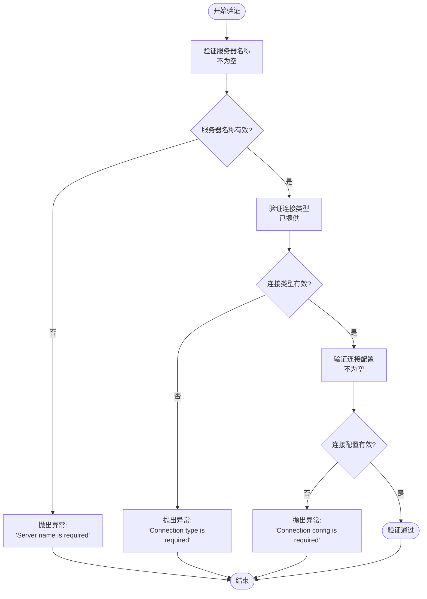
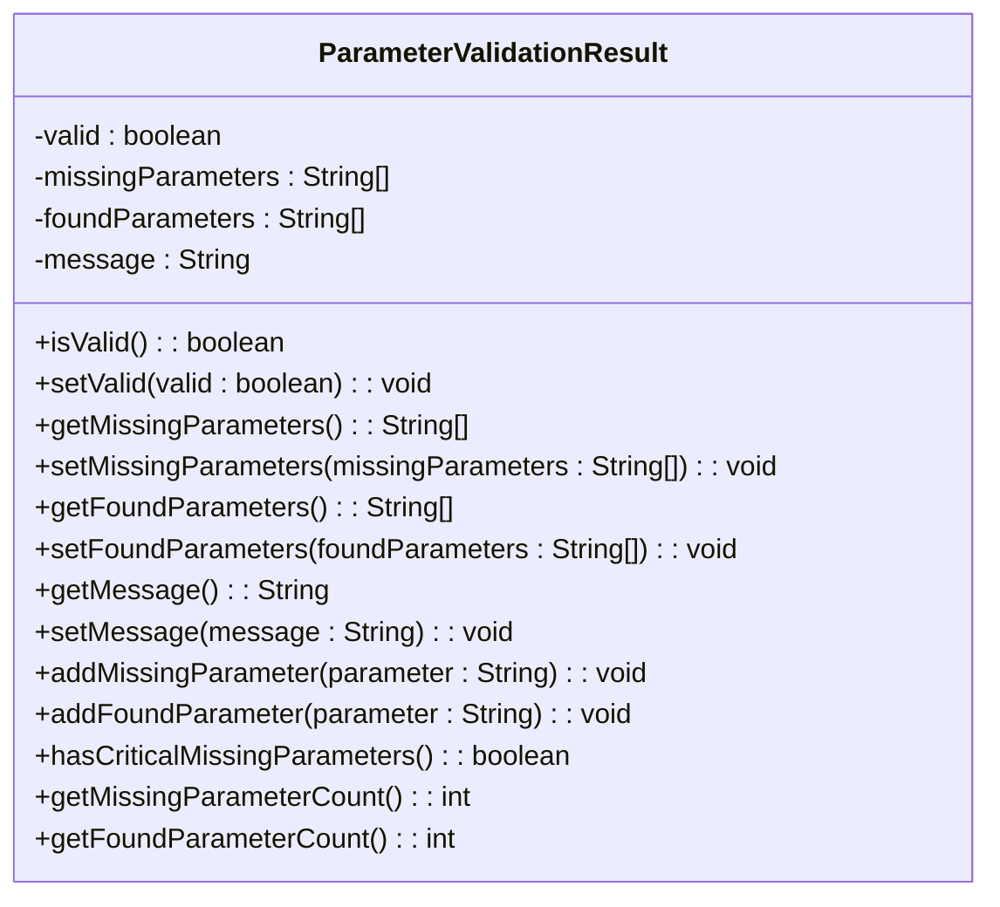
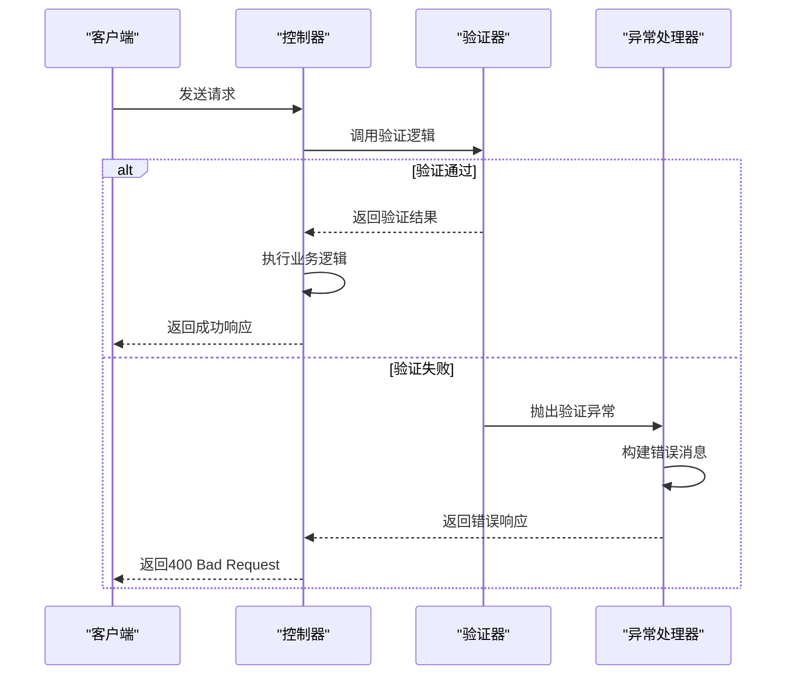
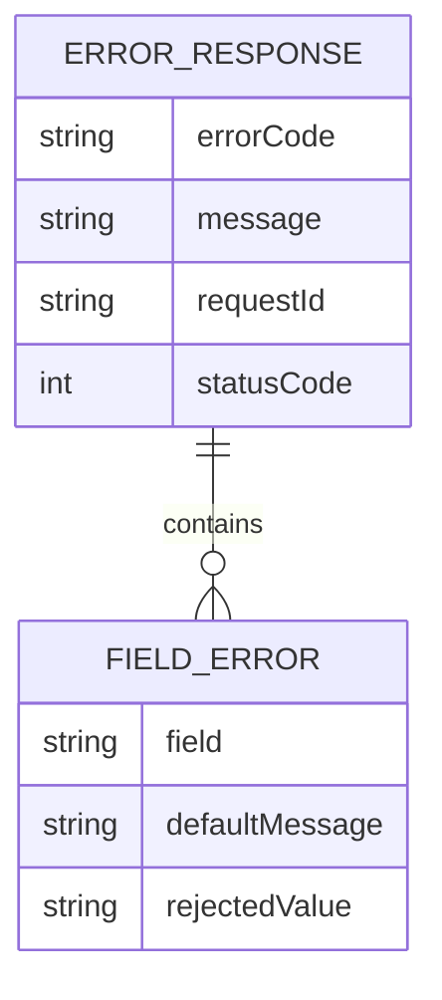

# 参数验证机制

<cite>
**本文档中引用的文件**  
- [ParameterValidationResult.java](file://spring-ai-alibaba-jmanus/src/main/java/com/alibaba/cloud/ai/manus/planning/model/vo/ParameterValidationResult.java)
- [GlobalExceptionHandler.java](file://spring-ai-alibaba-studio/spring-ai-alibaba-studio-server/spring-ai-alibaba-studio-server-admin/src/main/java/com/alibaba/cloud/ai/studio/admin/advice/GlobalExceptionHandler.java)
- [CoordinatorToolExceptionHandler.java](file://spring-ai-alibaba-jmanus/src/main/java/com/alibaba/cloud/ai/manus/coordinator/exception/CoordinatorToolExceptionHandler.java)
- [AbstractAgentTypeProvider.java](file://spring-ai-alibaba-studio/spring-ai-alibaba-studio-server/spring-ai-alibaba-studio-server-admin/src/main/java/com/alibaba/cloud/ai/studio/admin/generator/service/generator/agent/AbstractAgentTypeProvider.java)
- [McpConfigValidator.java](file://spring-ai-alibaba-jmanus/src/main/java/com/alibaba/cloud/ai/manus/mcp/service/McpConfigValidator.java)
- [ValidationRequest.java](file://spring-ai-alibaba-jmanus/src/main/java/com/alibaba/cloud/ai/manus/model/model/vo/ValidationRequest.java)
- [ValidationResult.java](file://spring-ai-alibaba-jmanus/src/main/java/com/alibaba/cloud/ai/manus/model/model/vo/ValidationResult.java)
</cite>

## 目录
1. [引言](#引言)
2. [JSR-303声明式验证](#jsr-303声明式验证)
3. [自定义验证规则实现](#自定义验证规则实现)
4. [复杂对象参数的深度验证](#复杂对象参数的深度验证)
5. [验证失败处理策略](#验证失败处理策略)
6. [错误信息返回格式](#错误信息返回格式)
7. [完整代码示例](#完整代码示例)
8. [结论](#结论)

## 引言
在Spring AI Alibaba项目中，参数验证是确保系统稳定性和数据完整性的关键环节。本文档深入讲解了项目中采用的参数验证机制，包括JSR-303注解的声明式验证、业务逻辑中的自定义验证规则实现、验证失败时的异常处理策略以及错误信息的标准化返回格式。通过分析项目中的实际代码实现，为开发者提供一套完整的参数验证解决方案。

## JSR-303声明式验证
项目中广泛使用JSR-303 Bean Validation规范进行声明式参数验证。该机制通过在Java Bean的字段或方法上添加注解来定义验证规则，由框架自动执行验证逻辑。

在Spring框架中，通过`@Valid`或`@Validated`注解触发验证过程。当控制器方法接收请求参数时，Spring会自动检查参数对象的验证约束。如果验证失败，将抛出`MethodArgumentNotValidException`或`ConstraintViolationException`异常。

项目中虽然没有直接展示JSR-303标准注解（如`@NotNull`、`@Size`、`@Pattern`等）的使用，但通过异常处理器可以推断出这些注解被用于方法参数和请求体对象的验证。

**Section sources**
- [GlobalExceptionHandler.java](file://spring-ai-alibaba-studio/spring-ai-alibaba-studio-server/spring-ai-alibaba-studio-server-admin/src/main/java/com/alibaba/cloud/ai/studio/admin/advice/GlobalExceptionHandler.java#L58-L102)

## 自定义验证规则实现
除了标准的JSR-303验证外，项目还实现了多种自定义验证规则，以满足特定业务场景的需求。

### 业务逻辑层验证
在业务逻辑层，项目通过编写专门的验证方法来实现复杂的业务规则验证。例如，在`AbstractAgentTypeProvider`类中，提供了多个保护性验证方法：

- `requirePositiveNumber()`：验证数值字段是否为正数且不小于指定最小值
- `isBlank()`：检查字符串是否为空或仅包含空白字符
- `hasValidInputKey()`：检查是否存在有效的输入键配置

这些方法通过抛出`IllegalArgumentException`异常来表示验证失败，确保了业务规则的强制执行。

### 专用验证器实现
项目还实现了专门的验证器类，如`McpConfigValidator`，用于验证MCP配置实体。该验证器通过以下步骤执行验证：

1. 验证服务器名称不能为空
2. 验证连接类型必须提供
3. 验证连接配置不能为空

验证失败时抛出`IOException`异常，并提供详细的错误信息。



**Diagram sources**
- [McpConfigValidator.java](file://spring-ai-alibaba-jmanus/src/main/java/com/alibaba/cloud/ai/manus/mcp/service/McpConfigValidator.java#L38-L79)

**Section sources**
- [AbstractAgentTypeProvider.java](file://spring-ai-alibaba-studio/spring-ai-alibaba-studio-server/spring-ai-alibaba-studio-server-admin/src/main/java/com/alibaba/cloud/ai/studio/admin/generator/service/generator/agent/AbstractAgentTypeProvider.java#L89-L124)
- [McpConfigValidator.java](file://spring-ai-alibaba-jmanus/src/main/java/com/alibaba/cloud/ai/manus/mcp/service/McpConfigValidator.java#L38-L79)

## 复杂对象参数的深度验证
对于复杂对象参数，项目采用了分层验证策略，确保对象及其嵌套属性都符合预期要求。

### 参数验证结果模型
项目定义了`ParameterValidationResult`类来封装复杂的验证结果信息，包含：

- `valid`：布尔值，表示验证是否通过
- `missingParameters`：缺失参数列表
- `foundParameters`：已找到参数列表
- `message`：验证结果消息

该模型提供了丰富的验证状态信息，便于前端或调用方了解具体的验证情况。

### 深度验证方法
通过`ParameterValidationResult`类提供的方法，可以实现深度验证：

- `addMissingParameter()`：添加缺失的参数到结果中
- `addFoundParameter()`：添加已找到的参数到结果中
- `hasCriticalMissingParameters()`：检查是否存在关键缺失参数
- `getMissingParameterCount()`：获取缺失参数数量
- `getFoundParameterCount()`：获取已找到参数数量

这种设计允许在验证过程中逐步构建验证结果，支持复杂的条件验证逻辑。



**Diagram sources**
- [ParameterValidationResult.java](file://spring-ai-alibaba-jmanus/src/main/java/com/alibaba/cloud/ai/manus/planning/model/vo/ParameterValidationResult.java#L15-L147)

**Section sources**
- [ParameterValidationResult.java](file://spring-ai-alibaba-jmanus/src/main/java/com/alibaba/cloud/ai/manus/planning/model/vo/ParameterValidationResult.java#L15-L147)

## 验证失败处理策略
项目采用统一的异常处理机制来处理验证失败的情况，确保错误处理的一致性和可维护性。

### 全局异常处理器
`GlobalExceptionHandler`类作为全局异常处理器，集中处理各种异常类型，包括验证相关的异常：

- `MethodArgumentNotValidException`：处理Spring MVC参数验证失败
- `ConstraintViolationException`：处理JSR-303约束违反异常

处理器将这些异常转换为统一的错误响应格式，便于前端处理。

### 专用异常处理器
在特定模块中，项目还实现了专用的异常处理器，如`CoordinatorToolExceptionHandler`，用于处理协调器工具相关的异常：

- `CoordinatorToolException`：处理自定义的协调器工具异常
- `MethodArgumentNotValidException`：处理方法参数验证异常
- `ConstraintViolationException`：处理约束违反异常

这种分层的异常处理策略既保证了全局一致性，又允许特定模块进行定制化处理。



**Diagram sources**
- [GlobalExceptionHandler.java](file://spring-ai-alibaba-studio/spring-ai-alibaba-studio-server/spring-ai-alibaba-studio-server-admin/src/main/java/com/alibaba/cloud/ai/studio/admin/advice/GlobalExceptionHandler.java#L58-L102)
- [CoordinatorToolExceptionHandler.java](file://spring-ai-alibaba-jmanus/src/main/java/com/alibaba/cloud/ai/manus/coordinator/exception/CoordinatorToolExceptionHandler.java#L35-L75)

**Section sources**
- [GlobalExceptionHandler.java](file://spring-ai-alibaba-studio/spring-ai-alibaba-studio-server/spring-ai-alibaba-studio-server-admin/src/main/java/com/alibaba/cloud/ai/studio/admin/advice/GlobalExceptionHandler.java#L58-L102)
- [CoordinatorToolExceptionHandler.java](file://spring-ai-alibaba-jmanus/src/main/java/com/alibaba/cloud/ai/manus/coordinator/exception/CoordinatorToolExceptionHandler.java#L35-L75)

## 错误信息返回格式
项目定义了标准化的错误信息返回格式，确保客户端能够一致地解析和处理错误响应。

### 错误消息构建
`GlobalExceptionHandler`中的`buildValidationErrorMessage`方法负责构建验证错误消息：

- 对于`MethodArgumentNotValidException`，提取每个字段错误的字段名和默认消息
- 对于`ConstraintViolationException`，提取每个约束违反的属性路径和消息
- 将多个错误消息用逗号分隔连接成一个字符串

这种格式化的错误消息便于前端解析和展示给用户。

### 错误响应结构
错误响应包含以下关键信息：

- `errorCode`：错误代码，用于标识错误类型
- `message`：详细的错误描述信息
- `requestId`：请求ID，便于追踪和调试
- HTTP状态码：根据错误类型返回相应的状态码（如400表示客户端错误）



**Section sources**
- [GlobalExceptionHandler.java](file://spring-ai-alibaba-studio/spring-ai-alibaba-studio-server/spring-ai-alibaba-studio-server-admin/src/main/java/com/alibaba/cloud/ai/studio/admin/advice/GlobalExceptionHandler.java#L104-L148)

## 完整代码示例
以下是一个完整的参数验证实现示例，展示了如何为复杂对象参数实现深度验证：

```java
// 请求参数对象
public class ValidationRequest {
    private String baseUrl;
    private String apiKey;
    // getters and setters
}

// 验证结果对象
public class ValidationResult {
    private boolean valid;
    private String message;
    private List<AvailableModel> availableModels;
    // getters and setters
}

// 参数验证结果
public class ParameterValidationResult {
    private boolean valid;
    private List<String> missingParameters;
    private List<String> foundParameters;
    private String message;
    
    public void addMissingParameter(String parameter) {
        if (this.missingParameters == null) {
            this.missingParameters = new ArrayList<>();
        }
        this.missingParameters.add(parameter);
    }
    
    public void addFoundParameter(String parameter) {
        if (this.foundParameters == null) {
            this.foundParameters = new ArrayList<>();
        }
        this.foundParameters.add(parameter);
    }
}
```

验证逻辑实现：

```java
public ParameterValidationResult validateParameters(Map<String, Object> parameters) {
    ParameterValidationResult result = new ParameterValidationResult();
    result.setValid(true);
    
    // 检查必需参数
    if (!parameters.containsKey("baseUrl")) {
        result.addMissingParameter("baseUrl");
        result.setValid(false);
    } else {
        result.addFoundParameter("baseUrl");
    }
    
    if (!parameters.containsKey("apiKey")) {
        result.addMissingParameter("apiKey");
        result.setValid(false);
    } else {
        result.addFoundParameter("apiKey");
    }
    
    // 验证参数值
    if (result.isValid()) {
        String baseUrl = (String) parameters.get("baseUrl");
        if (baseUrl == null || baseUrl.trim().isEmpty()) {
            result.setValid(false);
            result.setMessage("Base URL cannot be empty");
        }
        
        String apiKey = (String) parameters.get("apiKey");
        if (apiKey == null || apiKey.trim().isEmpty()) {
            result.setValid(false);
            result.setMessage("API Key cannot be empty");
        }
    }
    
    if (!result.isValid() && result.getMessage() == null) {
        result.setMessage("Missing required parameters: " + 
            String.join(", ", result.getMissingParameters()));
    }
    
    return result;
}
```

**Section sources**
- [ValidationRequest.java](file://spring-ai-alibaba-jmanus/src/main/java/com/alibaba/cloud/ai/manus/model/model/vo/ValidationRequest.java#L15-L51)
- [ValidationResult.java](file://spring-ai-alibaba-jmanus/src/main/java/com/alibaba/cloud/ai/manus/model/model/vo/ValidationResult.java#L15-L69)
- [ParameterValidationResult.java](file://spring-ai-alibaba-jmanus/src/main/java/com/alibaba/cloud/ai/manus/planning/model/vo/ParameterValidationResult.java#L15-L147)

## 结论
Spring AI Alibaba项目中的参数验证机制采用了声明式验证与自定义验证相结合的策略，既利用了JSR-303标准注解的便利性，又通过自定义验证逻辑满足了复杂的业务需求。项目通过统一的异常处理机制和标准化的错误响应格式，确保了验证失败时的一致性和可维护性。对于复杂对象参数，采用分层验证策略和丰富的验证结果模型，支持深度验证和详细的错误信息反馈。这套完整的参数验证解决方案为系统的稳定运行提供了有力保障。