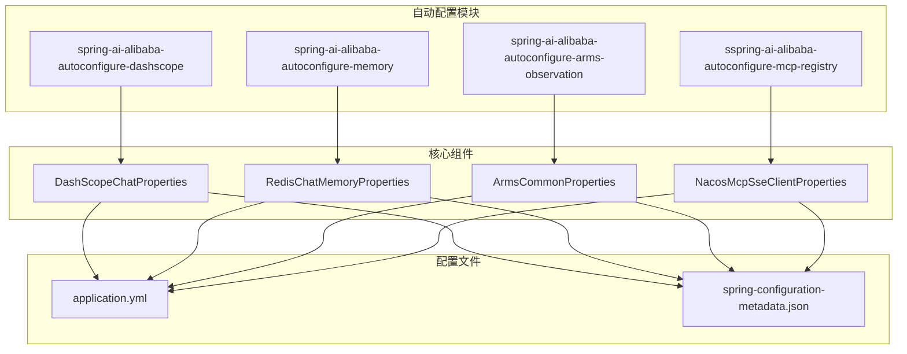
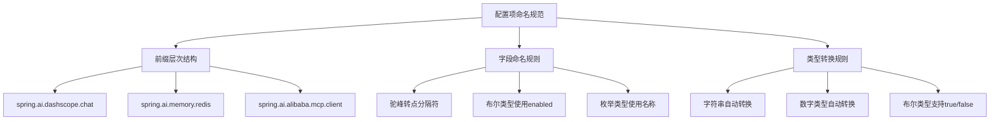
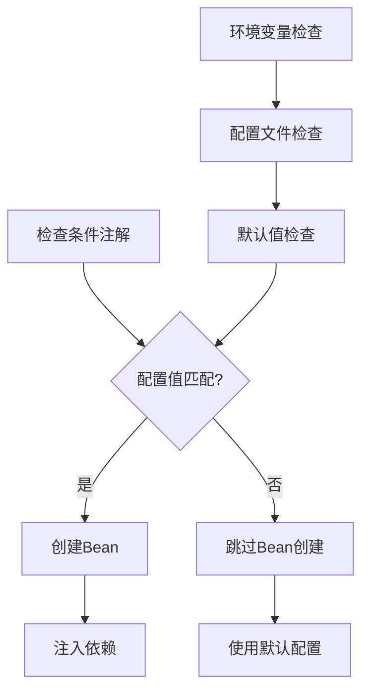
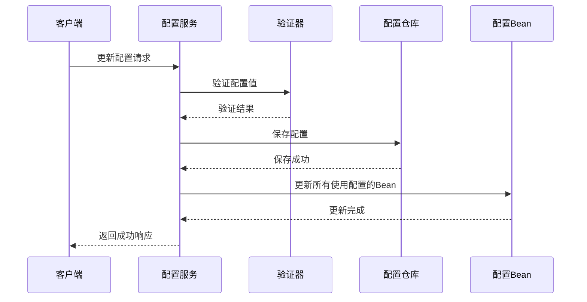
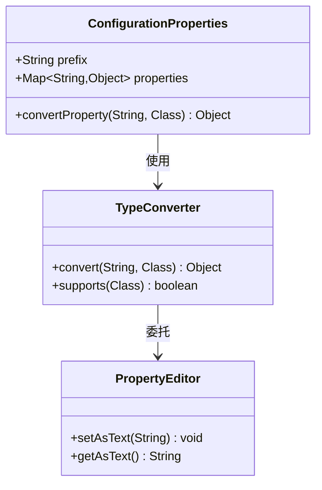
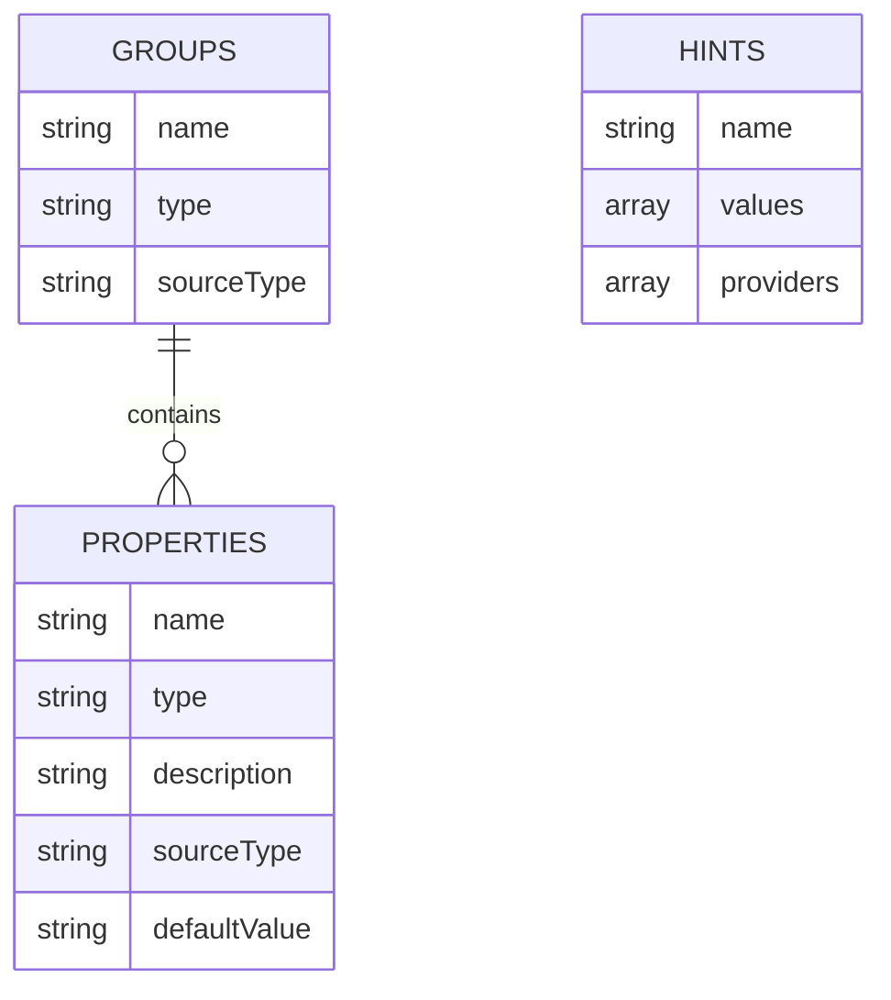

# 工具配置与属性管理

<cite>
**本文档引用的文件**
- [DashScopeChatProperties.java](file://auto-configurations/spring-ai-alibaba-autoconfigure-dashscope/src/main/java/com/alibaba/cloud/ai/autoconfigure/dashscope/DashScopeChatProperties.java)
- [RedisChatMemoryProperties.java](file://auto-configurations/spring-ai-alibaba-autoconfigure-memory/src/main/java/com/alibaba/cloud/ai/autoconfigure/memory/redis/RedisChatMemoryProperties.java)
- [application.yml](file://spring-ai-alibaba-deepresearch/src/main/resources/application.yml)
- [spring-configuration-metadata.json](file://auto-configurations/spring-ai-alibaba-autoconfigure-dashscope/src/main/resources/META-INF/spring-configuration-metadata.json)
- [DashScopeChatAutoConfiguration.java](file://auto-configurations/spring-ai-alibaba-autoconfigure-dashscope/src/main/java/com/alibaba/cloud/ai/autoconfigure/dashscope/DashScopeChatAutoConfiguration.java)
- [ArmsAutoConfiguration.java](file://auto-configurations/spring-ai-alibaba-autoconfigure-arms-observation/src/main/java/com/alibaba/cloud/ai/autoconfigure/arms/ArmsAutoConfiguration.java)
- [NacosA2aRegistryAutoConfiguration.java](file://auto-configurations/spring-ai-alibaba-autoconfigure-a2a-registry/src/main/java/com/alibaba/cloud/ai/autoconfigure/a2a/registry/nacos/NacosA2aRegistryAutoConfiguration.java)
- [ConfigService.java](file://spring-ai-alibaba-jmanus/src/main/java/com/alibaba/cloud/ai/manus/config/ConfigService.java)
</cite>

## 目录
1. [简介](#简介)
2. [项目结构概览](#项目结构概览)
3. [@ConfigurationProperties类定义](#configurationproperties类定义)
4. [配置项命名规范](#配置项命名规范)
5. [默认值设置](#默认值设置)
6. [外部化配置方式](#外部化配置方式)
7. [条件注解控制](#条件注解控制)
8. [配置属性验证](#配置属性验证)
9. [类型安全访问](#类型安全访问)
10. [配置元数据管理](#配置元数据管理)
11. [最佳实践](#最佳实践)
12. [故障排除指南](#故障排除指南)

## 简介

Spring AI Alibaba项目采用了一套完整的工具配置与属性管理系统，通过Spring Boot的@ConfigurationProperties机制实现了高度可配置的工具链。该系统支持多种配置方式，包括application.yml配置文件、环境变量、命令行参数等，并提供了丰富的条件注解来控制工具的启用状态。

## 项目结构概览

Spring AI Alibaba项目按照功能模块组织，每个模块都包含了相应的自动配置类和属性类：



**图表来源**
- [DashScopeChatProperties.java](file://auto-configurations/spring-ai-alibaba-autoconfigure-dashscope/src/main/java/com/alibaba/cloud/ai/autoconfigure/dashscope/DashScopeChatProperties.java#L30-L35)
- [RedisChatMemoryProperties.java](file://auto-configurations/spring-ai-alibaba-autoconfigure-memory/src/main/java/com/alibaba/cloud/ai/autoconfigure/memory/redis/RedisChatMemoryProperties.java#L28-L29)

## @ConfigurationProperties类定义

### 基本结构

@ConfigurationProperties类是Spring AI Alibaba配置系统的核心，它们负责将外部配置映射到Java对象中。以下是一个典型的配置类结构：

```java
@ConfigurationProperties(DashScopeChatProperties.CONFIG_PREFIX)
public class DashScopeChatProperties extends DashScopeParentProperties {
    
    public static final String CONFIG_PREFIX = "spring.ai.dashscope.chat";
    public static final String DEFAULT_DEPLOYMENT_NAME = "qwen-plus";
    private static final Double DEFAULT_TEMPERATURE = 0.8d;
    
    private boolean enabled = true;
    
    @NestedConfigurationProperty
    private DashScopeChatOptions options = DashScopeChatOptions.builder()
        .withModel(DEFAULT_DEPLOYMENT_NAME)
        .withTemperature(DEFAULT_TEMPERATURE)
        .build();
    
    // Getter and Setter methods
}
```

### 关键特性

1. **前缀定义**: 每个配置类都有明确的配置前缀，如`spring.ai.dashscope.chat`
2. **继承关系**: 通常继承自父配置类，提供通用配置
3. **嵌套配置**: 使用`@NestedConfigurationProperty`处理复杂配置对象
4. **默认值**: 在字段级别和构造函数中设置合理的默认值

**章节来源**
- [DashScopeChatProperties.java](file://auto-configurations/spring-ai-alibaba-autoconfigure-dashscope/src/main/java/com/alibaba/cloud/ai/autoconfigure/dashscope/DashScopeChatProperties.java#L30-L85)

## 配置项命名规范

### 命名约定

Spring AI Alibaba遵循严格的配置项命名规范：



### 具体示例

1. **DashScope配置**: `spring.ai.dashscope.chat.enabled`
2. **内存配置**: `spring.ai.memory.redis.host`
3. **工具调用配置**: `spring.ai.alibaba.toolcalling.baidu.search.enabled`

### 支持的配置格式

- **YAML格式**: `spring.ai.dashscope.chat.enabled: true`
- **属性文件**: `spring.ai.dashscope.chat.enabled=true`
- **环境变量**: `SPRING_AI_DASHSCOPE_CHAT_ENABLED=true`
- **命令行参数**: `--spring.ai.dashscope.chat.enabled=true`

**章节来源**
- [application.yml](file://spring-ai-alibaba-deepresearch/src/main/resources/application.yml#L20-L30)

## 默认值设置

### 字段级默认值

配置类中的字段可以直接设置默认值：

```java
private boolean enabled = true;
private int port = 6379;
private String host = "127.0.0.1";
private int timeout = 2000;
```

### 构造函数默认值

对于复杂对象，可以在构造函数中设置默认值：

```java
public DashScopeChatProperties() {
    super.setBaseUrl(DEFAULT_BASE_URL);
    this.options = DashScopeChatOptions.builder()
        .withModel(DEFAULT_DEPLOYMENT_NAME)
        .withTemperature(DEFAULT_TEMPERATURE)
        .build();
}
```

### 嵌套配置默认值

使用`@NestedConfigurationProperty`时，嵌套对象也会应用默认值：

```java
@NestedConfigurationProperty
private DashScopeChatOptions options = DashScopeChatOptions.builder()
    .withModel(DEFAULT_DEPLOYMENT_NAME)
    .withTemperature(DEFAULT_TEMPERATURE)
    .build();
```

**章节来源**
- [DashScopeChatProperties.java](file://auto-configurations/spring-ai-alibaba-autoconfigure-dashscope/src/main/java/com/alibaba/cloud/ai/autoconfigure/dashscope/DashScopeChatProperties.java#L40-L50)
- [RedisChatMemoryProperties.java](file://auto-configurations/spring-ai-alibaba-autoconfigure-memory/src/main/java/com/alibaba/cloud/ai/autoconfigure/memory/redis/RedisChatMemoryProperties.java#L35-L45)

## 外部化配置方式

### application.yml配置

Spring AI Alibaba支持多种配置文件格式：

```yaml
spring:
  ai:
    dashscope:
      api-key: ${AI_DASHSCOPE_API_KEY}
      base-url: https://dashscope.aliyuncs.com
      chat:
        enabled: true
        options:
          model: qwen-plus
          temperature: 0.8
    memory:
      redis:
        host: localhost
        port: 6379
        timeout: 3000
        enabled: true
```

### 环境变量配置

支持通过环境变量覆盖配置：

```bash
export AI_DASHSCOPE_API_KEY=your-api-key
export REDIS_PASSWORD=your-password
export SPRING_PROFILES_ACTIVE=production
```

### 命令行参数

启动时可以通过命令行参数指定配置：

```bash
java -jar app.jar \
  --spring.ai.dashscope.chat.enabled=true \
  --spring.ai.memory.redis.host=localhost \
  --spring.profiles.active=production
```

### 配置优先级

配置的优先级从高到低：
1. 命令行参数
2. 环境变量
3. application.yml
4. 配置类默认值

**章节来源**
- [application.yml](file://spring-ai-alibaba-deepresearch/src/main/resources/application.yml#L15-L50)

## 条件注解控制

### @ConditionalOnProperty

这是最常用的条件注解，用于根据配置值决定是否创建Bean：

```java
@ConditionalOnProperty(prefix = "spring.ai.dashscope.chat", 
                      name = "enabled", 
                      havingValue = "true", 
                      matchIfMissing = true)
public class DashScopeChatAutoConfiguration {
    // 配置类内容
}
```

### 多重条件组合

可以组合多个条件注解：

```java
@ConditionalOnClass(DashScopeApi.class)
@ConditionalOnDashScopeEnabled
@ConditionalOnProperty(name = SpringAIModelProperties.CHAT_MODEL, 
                      havingValue = SpringAIAlibabaModels.DASHSCOPE,
                      matchIfMissing = true)
@AutoConfiguration(after = {
    RestClientAutoConfiguration.class,
    SpringAiRetryAutoConfiguration.class
})
```

### 自定义条件注解

项目还定义了自定义条件注解：

```java
@ConditionalOnProperty(value = "spring.ai.dashscope.enabled", 
                      matchIfMissing = true)
public @interface ConditionalOnDashScopeEnabled {
}
```

### 条件执行流程



**图表来源**
- [ArmsAutoConfiguration.java](file://auto-configurations/spring-ai-alibaba-autoconfigure-arms-observation/src/main/java/com/alibaba/cloud/ai/autoconfigure/arms/ArmsAutoConfiguration.java#L42-L80)
- [NacosA2aRegistryAutoConfiguration.java](file://auto-configurations/spring-ai-alibaba-autoconfigure-a2a-registry/src/main/java/com/alibaba/cloud/ai/autoconfigure/a2a/registry/nacos/NacosA2aRegistryAutoConfiguration.java#L45-L47)

**章节来源**
- [DashScopeChatAutoConfiguration.java](file://auto-configurations/spring-ai-alibaba-autoconfigure-dashscope/src/main/java/com/alibaba/cloud/ai/autoconfigure/dashscope/DashScopeChatAutoConfiguration.java#L50-L60)

## 配置属性验证

### Bean Validation约束

虽然Spring AI Alibaba主要依赖@ConfigurationProperties的类型转换，但也可以结合Bean Validation进行更严格的验证：

```java
public class McpConfigValidator {
    
    public void validateMcpConfigEntity(McpConfigEntity mcpConfigEntity) throws IOException {
        String serverName = mcpConfigEntity.getMcpServerName();
        
        if (serverName == null || serverName.trim().isEmpty()) {
            throw new IOException("Server name is required");
        }
        
        if (mcpConfigEntity.getConnectionType() == null) {
            throw new IOException("Connection type is required for server: " + serverName);
        }
        
        if (mcpConfigEntity.getConnectionConfig() == null || 
            mcpConfigEntity.getConnectionConfig().trim().isEmpty()) {
            throw new IOException("Connection config is required for server: " + serverName);
        }
    }
}
```

### 运行时验证

配置服务提供了运行时验证机制：

```java
@Transactional
public void updateConfig(String configPath, String newValue) {
    ConfigEntity entity = configRepository.findByConfigPath(configPath)
        .orElseThrow(() -> new IllegalArgumentException("Config not found: " + configPath));
    
    // 更新配置值
    entity.setConfigValue(newValue);
    configRepository.save(entity);
    
    // 更新所有使用此配置的Bean
    Map<String, Object> configBeans = applicationContext
        .getBeansWithAnnotation(ConfigurationProperties.class);
    configBeans.values()
        .forEach(bean -> updateBeanConfig(bean, configPath, newValue));
}
```

### 验证流程



**图表来源**
- [ConfigService.java](file://spring-ai-alibaba-jmanus/src/main/java/com/alibaba/cloud/ai/manus/config/ConfigService.java#L180-L200)

**章节来源**
- [ConfigService.java](file://spring-ai-alibaba-jmanus/src/main/java/com/alibaba/cloud/ai/manus/config/ConfigService.java#L180-L210)

## 类型安全访问

### 配置类设计模式

Spring AI Alibaba采用了类型安全的设计模式：

```java
@ConfigurationProperties(prefix = "spring.ai.memory.redis")
public class RedisChatMemoryProperties {
    
    private String host = "127.0.0.1";
    private int port = 6379;
    private String username;
    private String password;
    private int timeout = 2000;
    private ClientType clientType;
    private Cluster cluster;
    private Mode mode;
    private final Ssl ssl = new Ssl();
    
    // 枚举类型
    public enum ClientType {
        LETTUCE, JEDIS, REDISSON
    }
    
    public enum Mode {
        STANDALONE, CLUSTER
    }
}
```

### 类型转换机制

Spring Boot自动处理各种类型的转换：



### 访问模式

1. **直接访问**: 通过getter方法访问配置属性
2. **条件访问**: 根据配置值决定是否启用功能
3. **动态更新**: 运行时更新配置并同步到相关Bean

**章节来源**
- [RedisChatMemoryProperties.java](file://auto-configurations/spring-ai-alibaba-autoconfigure-memory/src/main/java/com/alibaba/cloud/ai/autoconfigure/memory/redis/RedisChatMemoryProperties.java#L28-L100)

## 配置元数据管理

### spring-configuration-metadata.json

每个模块都包含配置元数据文件，提供IDE智能提示：

```json
{
  "groups": [
    {
      "name": "spring.ai.dashscope.chat",
      "type": "com.alibaba.cloud.ai.autoconfigure.dashscope.DashScopeChatProperties",
      "sourceType": "com.alibaba.cloud.ai.autoconfigure.dashscope.DashScopeChatProperties"
    }
  ],
  "properties": [
    {
      "name": "spring.ai.dashscope.chat.enabled",
      "type": "java.lang.Boolean",
      "description": "Enable DashScope chat client.",
      "sourceType": "com.alibaba.cloud.ai.autoconfigure.dashscope.DashScopeChatProperties",
      "defaultValue": true
    }
  ]
}
```

### 元数据结构



### 自动生成元数据

项目使用Gradle插件自动生成配置元数据：

```xml
<plugin>
    <groupId>org.springframework.boot</groupId>
    <artifactId>spring-boot-configuration-processor</artifactId>
    <version>${spring-boot.version}</version>
    <executions>
        <execution>
            <goals>
                <goal>generate-metadata</goal>
            </goals>
        </execution>
    </executions>
</plugin>
```

**章节来源**
- [spring-configuration-metadata.json](file://auto-configurations/spring-ai-alibaba-autoconfigure-dashscope/src/main/resources/META-INF/spring-configuration-metadata.json#L1-L50)

## 最佳实践

### 配置类设计原则

1. **单一职责**: 每个配置类只负责一个功能模块
2. **合理分组**: 使用嵌套配置处理复杂结构
3. **默认值合理**: 提供有意义的默认值
4. **类型安全**: 使用强类型避免运行时错误

### 配置命名建议

1. **层次清晰**: 使用点分隔符表示配置层次
2. **语义明确**: 配置名称要能表达其用途
3. **一致性**: 保持命名风格的一致性
4. **版本兼容**: 考虑向后兼容性

### 性能优化

1. **懒加载**: 对于大型配置使用懒加载
2. **缓存策略**: 缓存频繁访问的配置值
3. **批量更新**: 批量更新相关配置减少重复操作

## 故障排除指南

### 常见问题

1. **配置不生效**
   - 检查配置前缀是否正确
   - 确认条件注解是否满足
   - 验证配置值类型是否匹配

2. **类型转换失败**
   - 检查配置值格式是否正确
   - 确认目标类型是否支持转换
   - 查看日志中的具体错误信息

3. **Bean创建失败**
   - 检查依赖的其他Bean是否可用
   - 确认条件注解的配置值
   - 验证配置类是否被正确扫描

### 调试技巧

1. **启用调试日志**: 设置`logging.level.com.alibaba.cloud.ai=DEBUG`
2. **检查配置绑定**: 使用`Environment`对象查看实际配置值
3. **验证Bean创建**: 检查Spring容器中的Bean列表

### 配置验证工具

```java
@Component
public class ConfigurationValidator {
    
    @Autowired
    private Environment environment;
    
    @PostConstruct
    public void validateConfiguration() {
        // 验证关键配置项
        validateRequiredProperties();
        // 验证配置值范围
        validatePropertyRanges();
    }
}
```

通过这套完整的配置与属性管理系统，Spring AI Alibaba实现了高度灵活且易于维护的工具配置架构，为开发者提供了强大而直观的配置体验。