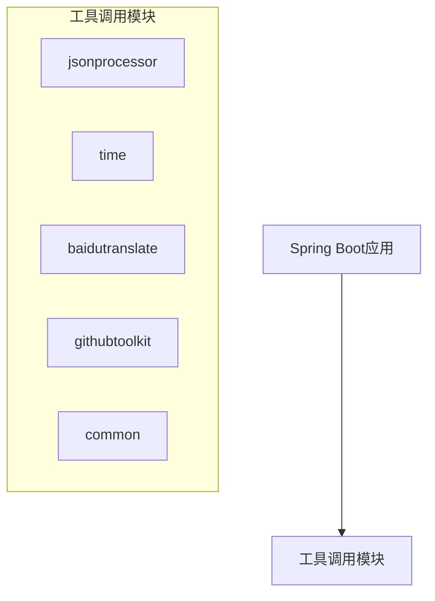
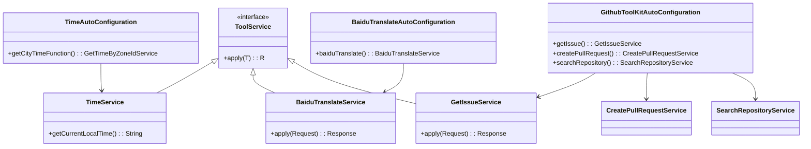
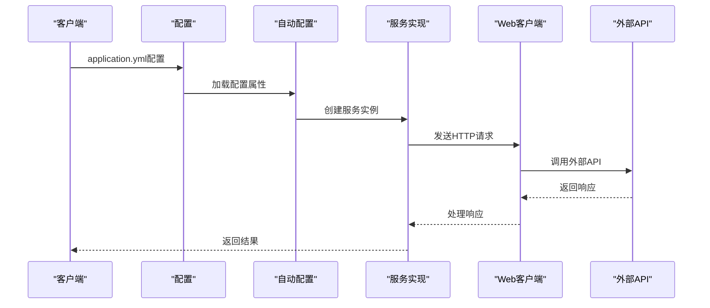
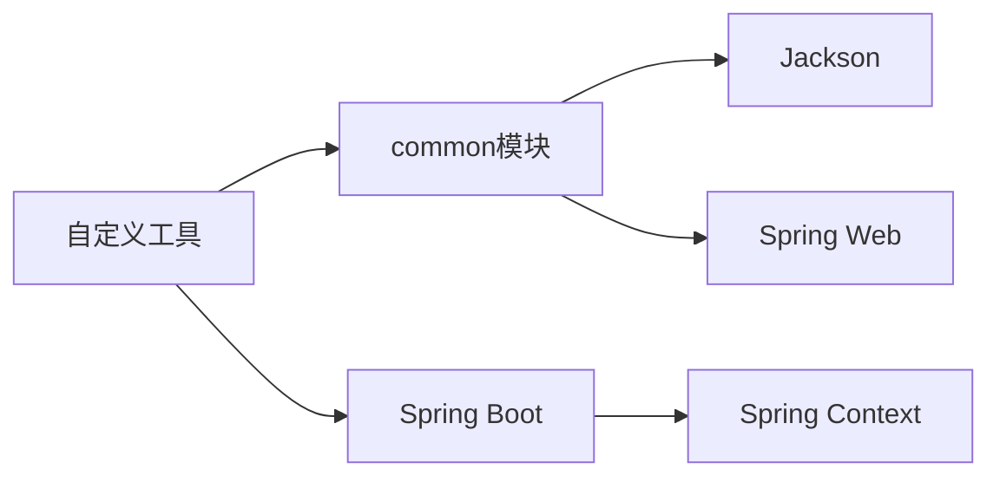

# 自定义工具开发

<cite>
**本文档中引用的文件 **  
- [CommonToolCallAutoConfiguration.java](file://community/tool-calls/spring-ai-alibaba-starter-tool-calling-common/src/main/java/com/alibaba/cloud/ai/toolcalling/common/CommonToolCallAutoConfiguration.java)
- [JsonParseTool.java](file://community/tool-calls/spring-ai-alibaba-starter-tool-calling-common/src/main/java/com/alibaba/cloud/ai/toolcalling/common/JsonParseTool.java)
- [CommonToolCallProperties.java](file://community/tool-calls/spring-ai-alibaba-starter-tool-calling-common/src/main/java/com/alibaba/cloud/ai/toolcalling/common/CommonToolCallProperties.java)
- [CommonToolCallConstants.java](file://community/tool-calls/spring-ai-alibaba-starter-tool-calling-common/src/main/java/com/alibaba/cloud/ai/toolcalling/common/CommonToolCallConstants.java)
- [TimeAutoConfiguration.java](file://community/tool-calls/spring-ai-alibaba-starter-tool-calling-time/src/main/java/com/alibaba/cloud/ai/toolcalling/time/TimeAutoConfiguration.java)
- [TimeService.java](file://community/tool-calls/spring-ai-alibaba-starter-tool-calling-time/src/main/java/com/alibaba/cloud/ai/toolcalling/time/TimeService.java)
- [GetTimeByZoneIdService.java](file://community/tool-calls/spring-ai-alibaba-starter-tool-calling-time/src/main/java/com/alibaba/cloud/ai/toolcalling/time/GetTimeByZoneIdService.java)
- [TimeProperties.java](file://community/tool-calls/spring-ai-alibaba-starter-tool-calling-time/src/main/java/com/alibaba/cloud/ai/toolcalling/time/TimeProperties.java)
- [TimeConstants.java](file://community/tool-calls/spring-ai-alibaba-starter-tool-calling-time/src/main/java/com/alibaba/cloud/ai/toolcalling/time/TimeConstants.java)
- [BaiduTranslateAutoConfiguration.java](file://community/tool-calls/spring-ai-alibaba-starter-tool-calling-baidutranslate/src/main/java/com/alibaba/cloud/ai/toolcalling/baidutranslate/BaiduTranslateAutoConfiguration.java)
- [BaiduTranslateService.java](file://community/tool-calls/spring-ai-alibaba-starter-tool-calling-baidutranslate/src/main/java/com/alibaba/cloud/ai/toolcalling/baidutranslate/BaiduTranslateService.java)
- [BaiduTranslateProperties.java](file://community/tool-calls/spring-ai-alibaba-starter-tool-calling-baidutranslate/src/main/java/com/alibaba/cloud/ai/toolcalling/baidutranslate/BaiduTranslateProperties.java)
- [BaiduTranslateConstants.java](file://community/tool-calls/spring-ai-alibaba-starter-tool-calling-baidutranslate/src/main/java/com/alibaba/cloud/ai/toolcalling/baidutranslate/BaiduTranslateConstants.java)
- [GithubToolKitAutoConfiguration.java](file://community/tool-calls/spring-ai-alibaba-starter-tool-calling-githubtoolkit/src/main/java/com/alibaba/cloud/ai/toolcalling/githubtoolkit/GithubToolKitAutoConfiguration.java)
- [GetIssueService.java](file://community/tool-calls/spring-ai-alibaba-starter-tool-calling-githubtoolkit/src/main/java/com/alibaba/cloud/ai/toolcalling/githubtoolkit/GetIssueService.java)
- [CreatePullRequestService.java](file://community/tool-calls/spring-ai-alibaba-starter-tool-calling-githubtoolkit/src/main/java/com/alibaba/cloud/ai/toolcalling/githubtoolkit/CreatePullRequestService.java)
- [SearchRepositoryService.java](file://community/tool-calls/spring-ai-alibaba-starter-tool-calling-githubtoolkit/src/main/java/com/alibaba/cloud/ai/toolcalling/githubtoolkit/SearchRepositoryService.java)
- [GithubToolKitProperties.java](file://community/tool-calls/spring-ai-alibaba-starter-tool-calling-githubtoolkit/src/main/java/com/alibaba/cloud/ai/toolcalling/githubtoolkit/GithubToolKitProperties.java)
- [GithubToolKitConstants.java](file://community/tool-calls/spring-ai-alibaba-starter-tool-calling-githubtoolkit/src/main/java/com/alibaba/cloud/ai/toolcalling/githubtoolkit/GithubToolKitConstants.java)
</cite>

## 目录
1. [简介](#简介)
2. [项目结构](#项目结构)
3. [核心组件](#核心组件)
4. [架构概述](#架构概述)
5. [详细组件分析](#详细组件分析)
6. [依赖分析](#依赖分析)
7. [性能考虑](#性能考虑)
8. [故障排除指南](#故障排除指南)
9. [结论](#结论)

## 简介
本指南旨在为Spring AI Alibaba框架中的自定义工具开发提供全面的指导。文档详细阐述了自定义工具的接口定义规范、参数验证机制、错误处理最佳实践以及工具配置属性的定义和自动装配方法。通过@ConditionalOnProperty等条件注解控制工具启用状态的方法也包含在内。文档提供了从简单的JSON处理器到复杂的数据库操作工具的完整代码示例，展示了不同复杂度的自定义工具开发模式。

## 项目结构
Spring AI Alibaba项目的工具调用功能主要集中在`community/tool-calls`目录下，该目录包含了多个独立的工具模块，每个模块都实现了特定的功能。这些工具模块遵循一致的设计模式，包括自动配置类、服务实现类、属性配置类和常量定义类。



**Diagram sources**
- [spring-ai-alibaba-starter-tool-calling-jsonprocessor](file://community/tool-calls/spring-ai-alibaba-starter-tool-calling-jsonprocessor)
- [spring-ai-alibaba-starter-tool-calling-time](file://community/tool-calls/spring-ai-alibaba-starter-tool-calling-time)
- [spring-ai-alibaba-starter-tool-calling-baidutranslate](file://community/tool-calls/spring-ai-alibaba-starter-tool-calling-baidutranslate)
- [spring-ai-alibaba-starter-tool-calling-githubtoolkit](file://community/tool-calls/spring-ai-alibaba-starter-tool-calling-githubtoolkit)
- [spring-ai-alibaba-starter-tool-calling-common](file://community/tool-calls/spring-ai-alibaba-starter-tool-calling-common)

**Section sources**
- [project_structure](file://project_structure)

## 核心组件
自定义工具开发的核心组件包括工具服务实现类、自动配置类、属性配置类和常量定义类。这些组件共同构成了一个完整的工具模块，确保了工具的功能性、可配置性和可扩展性。

**Section sources**
- [CommonToolCallAutoConfiguration.java](file://community/tool-calls/spring-ai-alibaba-starter-tool-calling-common/src/main/java/com/alibaba/cloud/ai/toolcalling/common/CommonToolCallAutoConfiguration.java)
- [JsonParseTool.java](file://community/tool-calls/spring-ai-alibaba-starter-tool-calling-common/src/main/java/com/alibaba/cloud/ai/toolcalling/common/JsonParseTool.java)
- [CommonToolCallProperties.java](file://community/tool-calls/spring-ai-alibaba-starter-tool-calling-common/src/main/java/com/alibaba/cloud/ai/toolcalling/common/CommonToolCallProperties.java)

## 架构概述
自定义工具的架构设计遵循Spring Boot的自动配置原则，通过@Configuration和@EnableConfigurationProperties注解实现组件的自动装配。工具服务类实现Function接口，提供apply方法来执行具体的业务逻辑。属性配置类继承CommonToolCallProperties，用于定义工具的配置属性。常量定义类则集中管理工具相关的常量值。



**Diagram sources**
- [TimeAutoConfiguration.java](file://community/tool-calls/spring-ai-alibaba-starter-tool-calling-time/src/main/java/com/alibaba/cloud/ai/toolcalling/time/TimeAutoConfiguration.java)
- [BaiduTranslateAutoConfiguration.java](file://community/tool-calls/spring-ai-alibaba-starter-tool-calling-baidutranslate/src/main/java/com/alibaba/cloud/ai/toolcalling/baidutranslate/BaiduTranslateAutoConfiguration.java)
- [GithubToolKitAutoConfiguration.java](file://community/tool-calls/spring-ai-alibaba-starter-tool-calling-githubtoolkit/src/main/java/com/alibaba/cloud/ai/toolcalling/githubtoolkit/GithubToolKitAutoConfiguration.java)

## 详细组件分析
### 工具接口定义规范
自定义工具需要实现java.util.function.Function接口，该接口定义了apply方法作为工具的主要执行入口。工具的输入和输出类型通过泛型参数指定，通常使用内部记录类（record）来定义请求和响应的数据结构。

#### 方法签名
工具的apply方法签名必须符合Function接口的要求：
```java
public interface Function<T, R> {
    R apply(T t);
}
```
其中T是输入类型，R是输出类型。例如，时间工具的实现：
```java
public class GetTimeByZoneIdService implements Function<GetTimeByZoneIdService.Request, GetTimeByZoneIdService.Response>
```

#### 参数注解
为了确保工具能够正确地与AI模型交互，需要使用Jackson库的注解来描述参数。主要使用的注解包括：
- @JsonProperty：定义JSON属性名称
- @JsonPropertyDescription：提供属性的描述信息
- @JsonClassDescription：提供类的整体描述

例如，在GetTimeByZoneIdService中：
```java
public record Request(
    @JsonProperty(required = true, value = "timeZoneId") 
    @JsonPropertyDescription("Time zone id, such as Asia/Shanghai") 
    String timeZoneId) {}
```

#### 返回值类型要求
返回值类型通常是一个包含结果数据的记录类。这个类应该使用@JsonInclude(JsonInclude.Include.NON_NULL)注解来避免序列化null值，并使用@JsonClassDescription提供整体描述。

**Section sources**
- [GetTimeByZoneIdService.java](file://community/tool-calls/spring-ai-alibaba-starter-tool-calling-time/src/main/java/com/alibaba/cloud/ai/toolcalling/time/GetTimeByZoneIdService.java)
- [BaiduTranslateService.java](file://community/tool-calls/spring-ai-alibaba-starter-tool-calling-baidutranslate/src/main/java/com/alibaba/cloud/ai/toolcalling/baidutranslate/BaiduTranslateService.java)

### 参数验证机制和错误处理
#### 参数验证
参数验证在工具的apply方法中进行，通常检查输入对象是否为空以及必要字段是否有值。如果验证失败，可以返回null或抛出异常。

例如，在BaiduTranslateService中：
```java
@Override
public Response apply(Request request) {
    if (request == null || !StringUtils.hasText(request.q) || 
        !StringUtils.hasText(request.from) || !StringUtils.hasText(request.to)) {
        return null;
    }
    // ...
}
```

#### 错误处理最佳实践
错误处理应捕获可能发生的异常并提供有意义的错误信息。对于外部API调用，建议记录详细的错误日志以便调试。

例如，在BaiduTranslateService中：
```java
catch (Exception e) {
    logger.error("Error occurred: {}", e.getMessage());
    return null;
}
```

#### 异常类型定义
虽然当前实现中没有定义专门的异常类型，但推荐的做法是创建自定义异常类来区分不同类型的错误。这有助于上层调用者更好地处理错误情况。

#### 错误消息格式化
错误消息应该清晰明了，包含足够的上下文信息。建议使用SLF4J的日志框架记录错误信息，而不是直接返回给用户。

**Section sources**
- [BaiduTranslateService.java](file://community/tool-calls/spring-ai-alibaba-starter-tool-calling-baidutranslate/src/main/java/com/alibaba/cloud/ai/toolcalling/baidutranslate/BaiduTranslateService.java)
- [GetIssueService.java](file://community/tool-calls/spring-ai-alibaba-starter-tool-calling-githubtoolkit/src/main/java/com/alibaba/cloud/ai/toolcalling/githubtoolkit/GetIssueService.java)

### 工具配置属性定义和自动装配
#### 配置属性定义
每个工具都有对应的属性配置类，这些类继承自CommonToolCallProperties并使用@ConfigurationProperties注解绑定配置项。配置前缀通过常量类定义。

例如，TimeProperties类：
```java
@ConfigurationProperties(prefix = TimeConstants.CONFIG_PREFIX)
public class TimeProperties extends CommonToolCallProperties {
}
```

#### 自动装配
自动装配通过@Configuration类实现，使用@EnableConfigurationProperties注解启用属性绑定，并通过@Bean注解注册工具实例。

例如，TimeAutoConfiguration类：
```java
@Configuration
@EnableConfigurationProperties(TimeProperties.class)
@ConditionalOnProperty(prefix = TimeConstants.CONFIG_PREFIX, name = "enabled", havingValue = "true", matchIfMissing = true)
public class TimeAutoConfiguration {
    @Bean(name = TimeConstants.TOOL_NAME)
    @ConditionalOnMissingBean
    @Description("Get the time of a specified city.")
    public GetTimeByZoneIdService getCityTimeFunction() {
        return new GetTimeByZoneIdService();
    }
}
```

#### 条件注解控制工具启用状态
使用@ConditionalOnProperty注解可以根据配置文件中的属性值决定是否加载某个工具。这对于按需启用或禁用工具非常有用。

**Section sources**
- [TimeAutoConfiguration.java](file://community/tool-calls/spring-ai-alibaba-starter-tool-calling-time/src/main/java/com/alibaba/cloud/ai/toolcalling/time/TimeAutoConfiguration.java)
- [TimeProperties.java](file://community/tool-calls/spring-ai-alibaba-starter-tool-calling-time/src/main/java/com/alibaba/cloud/ai/toolcalling/time/TimeProperties.java)
- [TimeConstants.java](file://community/tool-calls/spring-ai-alibaba-starter-tool-calling-time/src/main/java/com/alibaba/cloud/ai/toolcalling/time/TimeConstants.java)

### 代码示例
#### 简单的JSON处理器
JSON处理器工具提供了基本的JSON解析和操作功能，如对象转JSON字符串、JSON字符串转对象、获取和设置JSON字段值等。

```java
public class JsonParseTool {
    private final ObjectMapper objectMapper;

    JsonParseTool() {
        this.objectMapper = new ObjectMapper().registerModule(new JavaTimeModule())
            .disable(SerializationFeature.WRITE_DATES_AS_TIMESTAMPS);
    }

    public <T> String objectToJson(T obj) throws JsonProcessingException {
        return objectMapper.writeValueAsString(obj);
    }

    public <T> T jsonToObject(String json, Class<T> clazz) throws JsonProcessingException {
        return objectMapper.readValue(json, clazz);
    }
    // ... 其他方法
}
```

#### 复杂的数据库操作工具
虽然当前代码库中没有直接的数据库操作工具示例，但可以通过类似GitHub工具包的方式实现。这类工具通常涉及更复杂的业务逻辑和数据处理。

#### GitHub工具包示例
GitHub工具包展示了如何实现多个相关联的工具，包括获取问题、创建拉取请求和搜索仓库等功能。



**Diagram sources**
- [GithubToolKitAutoConfiguration.java](file://community/tool-calls/spring-ai-alibaba-starter-tool-calling-githubtoolkit/src/main/java/com/alibaba/cloud/ai/toolcalling/githubtoolkit/GithubToolKitAutoConfiguration.java)
- [GetIssueService.java](file://community/tool-calls/spring-ai-alibaba-starter-tool-calling-githubtoolkit/src/main/java/com/alibaba/cloud/ai/toolcalling/githubtoolkit/GetIssueService.java)
- [WebClientTool.java](file://community/tool-calls/spring-ai-alibaba-starter-tool-calling-common/src/main/java/com/alibaba/cloud/ai/toolcalling/common/WebClientTool.java)

**Section sources**
- [GithubToolKitAutoConfiguration.java](file://community/tool-calls/spring-ai-alibaba-starter-tool-calling-githubtoolkit/src/main/java/com/alibaba/cloud/ai/toolcalling/githubtoolkit/GithubToolKitAutoConfiguration.java)
- [GetIssueService.java](file://community/tool-calls/spring-ai-alibaba-starter-tool-calling-githubtoolkit/src/main/java/com/alibaba/cloud/ai/toolcalling/githubtoolkit/GetIssueService.java)
- [CreatePullRequestService.java](file://community/tool-calls/spring-ai-alibaba-starter-tool-calling-githubtoolkit/src/main/java/com/alibaba/cloud/ai/toolcalling/githubtoolkit/CreatePullRequestService.java)
- [SearchRepositoryService.java](file://community/tool-calls/spring-ai-alibaba-starter-tool-calling-githubtoolkit/src/main/java/com/alibaba/cloud/ai/toolcalling/githubtoolkit/SearchRepositoryService.java)

## 依赖分析
自定义工具模块之间的依赖关系相对简单，主要依赖于公共组件和Spring框架本身。各个工具模块之间相互独立，便于单独开发和测试。



**Diagram sources**
- [pom.xml](file://community/tool-calls/spring-ai-alibaba-starter-tool-calling-common/pom.xml)
- [pom.xml](file://community/tool-calls/spring-ai-alibaba-starter-tool-calling-time/pom.xml)
- [pom.xml](file://community/tool-calls/spring-ai-alibaba-starter-tool-calling-baidutranslate/pom.xml)

**Section sources**
- [pom.xml](file://community/tool-calls/spring-ai-alibaba-starter-tool-calling-common/pom.xml)
- [pom.xml](file://community/tool-calls/spring-ai-alibaba-starter-tool-calling-time/pom.xml)
- [pom.xml](file://community/tool-calls/spring-ai-alibaba-starter-tool-calling-baidutranslate/pom.xml)

## 性能考虑
在设计自定义工具时，需要注意以下性能方面的考虑：
1. 避免在每次调用时创建昂贵的对象，如ObjectMapper实例。
2. 使用连接池管理HTTP客户端，减少网络开销。
3. 对频繁访问的数据进行缓存。
4. 合理设置超时时间，防止长时间阻塞。

例如，JsonParseTool在构造函数中初始化ObjectMapper实例，避免了重复创建的开销。

## 故障排除指南
### 常见问题及解决方案
1. **工具未被加载**：检查application.yml中对应的enabled属性是否设置为true。
2. **认证失败**：确认环境变量或配置文件中提供了正确的API密钥或令牌。
3. **网络超时**：调整networkTimeout属性的值以适应网络状况。
4. **JSON解析错误**：检查输入JSON格式是否正确，必要时添加更多的错误处理逻辑。

### 调试技巧
1. 启用DEBUG日志级别以查看详细的执行过程。
2. 使用单元测试验证工具的基本功能。
3. 利用IDE的调试功能逐步跟踪代码执行流程。

**Section sources**
- [CommonToolCallProperties.java](file://community/tool-calls/spring-ai-alibaba-starter-tool-calling-common/src/main/java/com/alibaba/cloud/ai/toolcalling/common/CommonToolCallProperties.java)
- [BaiduTranslateService.java](file://community/tool-calls/spring-ai-alibaba-starter-tool-calling-baidutranslate/src/main/java/com/alibaba/cloud/ai/toolcalling/baidutranslate/BaiduTranslateService.java)

## 结论
本文档详细介绍了Spring AI Alibaba框架中自定义工具的开发方法。通过遵循统一的设计模式和最佳实践，开发者可以轻松创建功能强大且易于维护的自定义工具。关键要点包括：
1. 实现Function接口作为工具的主要执行入口。
2. 使用Jackson注解描述参数和返回值。
3. 继承CommonToolCallProperties定义配置属性。
4. 使用@ConditionalOnProperty控制工具的启用状态。
5. 在apply方法中进行参数验证和错误处理。

通过这些指导原则，开发者可以构建出高质量的自定义工具，为AI应用提供丰富的功能支持。