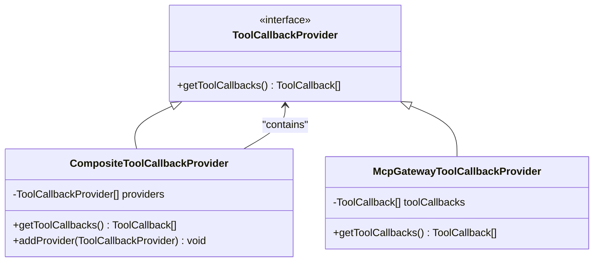

# 自定义工具接口定义

<cite>
**本文档引用的文件**
- [Tool.java](file://spring-ai-alibaba-graph-core/src/main/java/io/agentscope/core/tool/Tool.java)
- [ToolParam.java](file://spring-ai-alibaba-graph-core/src/main/java/io/agentscope/core/tool/ToolParam.java)
- [ObservableToolCallingManager.java](file://spring-ai-alibaba-core/src/main/java/com/alibaba/cloud/ai/tool/ObservableToolCallingManager.java)
- [CompositeToolCallbackProvider.java](file://spring-ai-alibaba-studio/spring-ai-alibaba-studio-server/spring-ai-alibaba-studio-server-core/src/main/java/com/alibaba/cloud/ai/studio/core/agent/tool/CompositeToolCallbackProvider.java)
- [McpGatewayToolCallbackProvider.java](file://spring-ai-alibaba-mcp/spring-ai-alibaba-mcp-router/src/main/java/com/alibaba/cloud/ai/mcp/gateway/core/McpGatewayToolCallbackProvider.java)
</cite>

## 目录
1. [引言](#引言)
2. [工具接口创建规范](#工具接口创建规范)
3. [方法签名设计原则](#方法签名设计原则)
4. [参数注解使用规范](#参数注解使用规范)
5. [返回值类型约定](#返回值类型约定)
6. [接口与实现类关系](#接口与实现类关系)
7. [Spring依赖注入装配](#spring依赖注入装配)
8. [接口定义示例](#接口定义示例)
9. [最佳实践总结](#最佳实践总结)

## 引言
在Spring AI Alibaba框架中，自定义工具接口是实现AI代理功能扩展的核心机制。本文档详细说明了自定义工具接口的定义规范，包括接口创建、方法签名设计、参数注解使用、返回值约定以及Spring依赖注入装配等关键方面。通过遵循这些规范，开发者可以创建高效、可维护的工具接口，为AI系统提供丰富的功能扩展能力。

## 工具接口创建规范
在Spring AI Alibaba框架中，创建自定义工具接口需要遵循特定的注解和结构规范。核心是使用`@Tool`注解来标识工具方法，该注解提供了工具的基本元数据定义。

`@Tool`注解包含以下关键属性：
- `name`: 工具的唯一标识名称，默认使用方法名
- `description`: 工具的功能描述，用于AI模型理解和调用
- `returnDirect`: 指示工具结果是否直接返回给用户
- `resultConverter`: 结果转换器类，用于将执行结果转换为字符串

工具接口通常以普通Java类的形式存在，其中包含一个或多个被`@Tool`注解标记的方法。这些方法构成了工具对外暴露的功能集合。框架会自动扫描并注册这些工具，使其可用于AI代理的调用。

**Section sources**
- [Tool.java](file://spring-ai-alibaba-graph-core/src/main/java/io/agentscope/core/tool/Tool.java#L36-L51)

## 方法签名设计原则
工具方法的签名设计需要遵循清晰、简洁和类型安全的原则。方法应该具有明确的语义，参数命名应直观反映其用途。

在设计方法签名时，应考虑以下要点：
1. **方法命名**: 使用动词开头的驼峰命名法，准确描述方法功能
2. **参数数量**: 尽量保持参数数量适中，过多参数可考虑封装为对象
3. **参数类型**: 使用具体的类型而非通用类型，提高类型安全性和代码可读性
4. **异常处理**: 明确声明可能抛出的异常，便于调用方处理

工具方法的设计应该从业务需求出发，确保每个方法都有明确的职责和边界。避免创建过于复杂或职责不清的方法，这有助于提高工具的可测试性和可维护性。

**Section sources**
- [Tool.java](file://spring-ai-alibaba-graph-core/src/main/java/io/agentscope/core/tool/Tool.java#L36-L51)

## 参数注解使用规范
参数注解是定义工具接口参数特性的关键机制。`@ToolParam`注解用于描述工具方法的参数，提供额外的元数据信息。

`@ToolParam`注解包含以下属性：
- `required`: 布尔值，指示参数是否为必填项，默认为true
- `description`: 参数的描述信息，用于帮助AI模型理解参数用途

在方法参数上使用`@ToolParam`注解可以提供更丰富的参数信息，使AI模型能够更好地理解如何正确调用工具。例如：

```java
@Tool(description = "查询天气信息")
public String getWeather(@ToolParam(required = true, description = "城市名称") String city,
                        @ToolParam(required = false, description = "日期") String date) {
    // 实现逻辑
}
```

通过合理使用参数注解，可以提高工具的可用性和健壮性，减少因参数错误导致的调用失败。

**Section sources**
- [ToolParam.java](file://spring-ai-alibaba-graph-core/src/main/java/io/agentscope/core/tool/ToolParam.java#L28-L37)

## 返回值类型约定
工具方法的返回值类型设计需要考虑调用场景和数据处理需求。虽然框架最终会将返回值转换为字符串，但建议使用合适的对象类型作为返回值。

常见的返回值类型包括：
- **String**: 简单的文本结果，适合直接返回给用户的消息
- **Map<String, Object>**: 结构化数据，适合返回多个字段的结果
- **自定义对象**: 复杂的数据结构，提供类型安全和更好的代码组织

返回值的设计应该与`returnDirect`属性配合使用。当`returnDirect`为true时，返回值将直接呈现给最终用户；当为false时，返回值将作为上下文传递给AI模型进行进一步处理。

对于复杂的返回值类型，可以通过`resultConverter`属性指定自定义的结果转换器，以控制对象到字符串的转换方式。

**Section sources**
- [Tool.java](file://spring-ai-alibaba-graph-core/src/main/java/io/agentscope/core/tool/Tool.java#L46-L51)

## 接口与实现类关系
在Spring AI Alibaba框架中，工具接口与实现类的关系采用了一种简化的设计模式。与传统的接口-实现分离不同，框架鼓励直接在具体类中定义工具方法。

这种设计的优势包括：
1. **简化开发**: 减少了接口定义的额外开销
2. **提高效率**: 避免了接口代理的性能损耗
3. **增强灵活性**: 可以直接使用类的成员变量和辅助方法

工具类通常会被Spring容器管理，通过@Component或其他 stereotype注解标记，使其成为Spring Bean。框架通过反射机制发现和注册这些工具方法，而不需要显式的接口实现关系。

对于需要共享行为的场景，可以通过抽象基类或组合模式来实现代码复用，而不是依赖传统的接口继承机制。

**Section sources**
- [ObservableToolCallingManager.java](file://spring-ai-alibaba-core/src/main/java/com/alibaba/cloud/ai/tool/ObservableToolCallingManager.java#L195-L224)

## Spring依赖注入装配
Spring依赖注入是工具类获取外部资源和协作对象的主要机制。通过@Autowired注解，工具类可以方便地注入所需的Bean。

装配过程的关键点包括：
1. **Bean注册**: 工具类需要被Spring容器管理，通常使用@Component注解
2. **依赖注入**: 使用@Autowired注入服务、配置或其他组件
3. **生命周期管理**: 遵循Spring Bean的生命周期，合理使用@PostConstruct和@PreDestroy

在复杂的场景中，可以使用专门的工具回调提供者（ToolCallbackProvider）来集中管理和装配工具。例如，CompositeToolCallbackProvider可以组合多个工具提供者，实现灵活的工具装配策略。



**Diagram sources**
- [CompositeToolCallbackProvider.java](file://spring-ai-alibaba-studio/spring-ai-alibaba-studio-server/spring-ai-alibaba-studio-server-core/src/main/java/com/alibaba/cloud/ai/studio/core/agent/tool/CompositeToolCallbackProvider.java#L132-L165)
- [McpGatewayToolCallbackProvider.java](file://spring-ai-alibaba-mcp/spring-ai-alibaba-mcp-router/src/main/java/com/alibaba/cloud/ai/mcp/gateway/core/McpGatewayToolCallbackProvider.java#L49-L65)

**Section sources**
- [CompositeToolCallbackProvider.java](file://spring-ai-alibaba-studio/spring-ai-alibaba-studio-server/spring-ai-alibaba-studio-server-core/src/main/java/com/alibaba/cloud/ai/studio/core/agent/tool/CompositeToolCallbackProvider.java#L132-L165)

## 接口定义示例
以下是不同复杂度的工具接口定义示例，展示了各种场景下的最佳实践。

### 简单工具示例
```java
@Component
public class WeatherTool {
    
    @Autowired
    private WeatherService weatherService;
    
    @Tool(description = "获取指定城市的当前天气")
    public String getCurrentWeather(
            @ToolParam(required = true, description = "城市名称") String city) {
        return weatherService.getCurrentWeather(city);
    }
}
```

### 复杂工具示例
```java
@Component
public class DataAnalysisTool {
    
    @Autowired
    private DataService dataService;
    
    @Autowired
    private CacheService cacheService;
    
    @Tool(name = "analyze_data_trend", 
          description = "分析数据趋势并生成报告",
          returnDirect = false)
    public Map<String, Object> analyzeTrend(
            @ToolParam(required = true, description = "数据源ID") String dataSourceId,
            @ToolParam(required = true, description = "时间范围") String timeRange,
            @ToolParam(required = false, description = "分析维度") List<String> dimensions) {
        
        String cacheKey = generateCacheKey(dataSourceId, timeRange, dimensions);
        Map<String, Object> cachedResult = cacheService.get(cacheKey);
        
        if (cachedResult != null) {
            return cachedResult;
        }
        
        Map<String, Object> result = dataService.analyze(dataSourceId, timeRange, dimensions);
        cacheService.put(cacheKey, result, Duration.ofHours(1));
        
        return result;
    }
}
```

这些示例展示了从简单到复杂的工具接口定义方式，体现了参数注解、依赖注入和返回值设计的最佳实践。

**Section sources**
- [Tool.java](file://spring-ai-alibaba-graph-core/src/main/java/io/agentscope/core/tool/Tool.java#L36-L51)
- [ToolParam.java](file://spring-ai-alibaba-graph-core/src/main/java/io/agentscope/core/tool/ToolParam.java#L28-L37)

## 最佳实践总结
在创建自定义工具接口时，应遵循以下最佳实践：

1. **清晰的命名**: 使用有意义的工具名称和参数描述，便于AI模型理解和调用
2. **合理的粒度**: 每个工具应有明确的单一职责，避免功能过于复杂
3. **完善的文档**: 通过description属性提供详细的工具说明
4. **适当的错误处理**: 在工具内部处理可能的异常情况，返回友好的错误信息
5. **性能考虑**: 对于耗时操作，考虑使用缓存或异步处理
6. **安全性**: 验证输入参数，防止注入攻击和其他安全风险

通过遵循这些规范和最佳实践，可以创建高质量的自定义工具接口，为AI系统提供强大而可靠的功能扩展能力。