# 错误处理与异常管理

<cite>
**本文档引用的文件**
- [BizException.java](file://spring-ai-alibaba-studio/spring-ai-alibaba-studio-server/spring-ai-alibaba-studio-server-runtime/src/main/java/com/alibaba/cloud/ai/studio/runtime/exception/BizException.java)
- [GlobalExceptionHandler.java](file://spring-ai-alibaba-studio/spring-ai-alibaba-studio-server/spring-ai-alibaba-studio-server-admin/src/main/java/com/alibaba/cloud/ai/studio/admin/advice/GlobalExceptionHandler.java)
- [Error.java](file://spring-ai-alibaba-studio/spring-ai-alibaba-studio-server/spring-ai-alibaba-studio-server-runtime/src/main/java/com/alibaba/cloud/ai/studio/runtime/domain/Error.java)
- [ErrorCode.java](file://spring-ai-alibaba-studio/spring-ai-alibaba-studio-server/spring-ai-alibaba-studio-server-runtime/src/main/java/com/alibaba/cloud/ai/studio/runtime/enums/ErrorCode.java)
- [ErrorCodeEnum.java](file://spring-ai-alibaba-nl2sql/spring-ai-alibaba-nl2sql-common/src/main/java/com/alibaba/cloud/ai/enums/ErrorCodeEnum.java)
- [ObservableToolCallingManager.java](file://spring-ai-alibaba-core/src/main/java/com/alibaba/cloud/ai/tool/ObservableToolCallingManager.java)
- [LogUtils.java](file://spring-ai-alibaba-studio/spring-ai-alibaba-studio-server/spring-ai-alibaba-studio-server-core/src/main/java/com/alibaba/cloud/ai/studio/core/utils/LogUtils.java)
- [DynamicAgent.java](file://spring-ai-alibaba-jmanus/src/main/java/com/alibaba/cloud/ai/manus/agent/DynamicAgent.java)
- [PythonExecute.java](file://spring-ai-alibaba-jmanus/src/main/java/com/alibaba/cloud/ai/manus/tool/code/PythonExecute.java)
</cite>

## 目录
1. [简介](#简介)
2. [项目结构概览](#项目结构概览)
3. [核心异常类型设计](#核心异常类型设计)
4. [错误码定义规范](#错误码定义规范)
5. [全局异常处理器](#全局异常处理器)
6. [工具调用异常处理](#工具调用异常处理)
7. [错误消息国际化支持](#错误消息国际化支持)
8. [日志记录与监控集成](#日志记录与监控集成)
9. [最佳实践指南](#最佳实践指南)
10. [故障排除指南](#故障排除指南)
11. [总结](#总结)

## 简介

Spring AI Alibaba项目采用了一套完整的错误处理与异常管理体系，旨在提供统一、可扩展且易于维护的异常处理机制。该体系涵盖了从基础的业务逻辑异常到复杂的工具调用异常，通过分层设计确保了系统的稳定性和可观察性。

本系统的核心设计理念是：
- **统一性**：所有异常都遵循相同的处理流程和格式
- **可扩展性**：支持自定义异常类型和错误码
- **可观测性**：完整的日志记录和监控集成
- **国际化**：支持多语言错误消息
- **容错性**：优雅的异常恢复和降级机制

## 项目结构概览

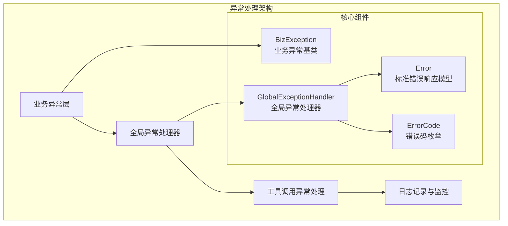

**图表来源**
- [BizException.java](file://spring-ai-alibaba-studio/spring-ai-alibaba-studio-server/spring-ai-alibaba-studio-server-runtime/src/main/java/com/alibaba/cloud/ai/studio/runtime/exception/BizException.java#L1-L68)
- [GlobalExceptionHandler.java](file://spring-ai-alibaba-studio/spring-ai-alibaba-studio-server/spring-ai-alibaba-studio-server-admin/src/main/java/com/alibaba/cloud/ai/studio/admin/advice/GlobalExceptionHandler.java#L1-L173)

## 核心异常类型设计

### BizException - 业务异常基类

`BizException`是整个异常体系的基础，它继承自`RuntimeException`并包含了详细的错误信息。

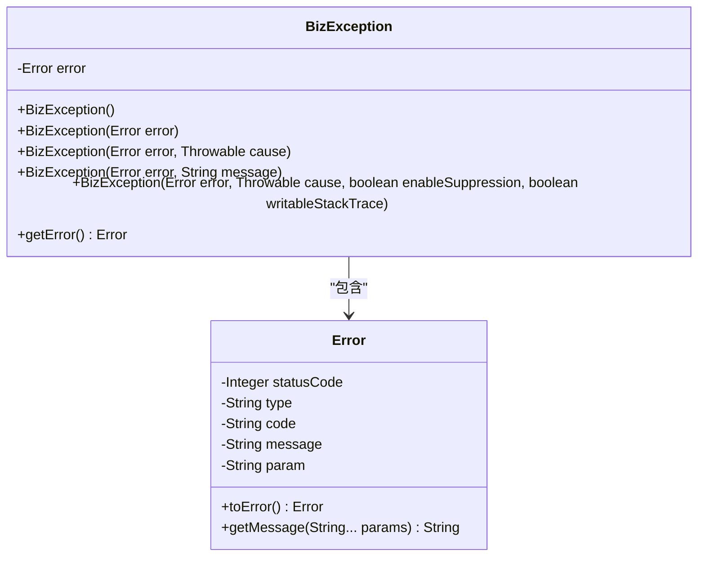

**图表来源**
- [BizException.java](file://spring-ai-alibaba-studio/spring-ai-alibaba-studio-server/spring-ai-alibaba-studio-server-runtime/src/main/java/com/alibaba/cloud/ai/studio/runtime/exception/BizException.java#L30-L67)
- [Error.java](file://spring-ai-alibaba-studio/spring-ai-alibaba-studio-server/spring-ai-alibaba-studio-server-runtime/src/main/java/com/alibaba/cloud/ai/studio/runtime/domain/Error.java#L30-L55)

### 异常类型层次结构

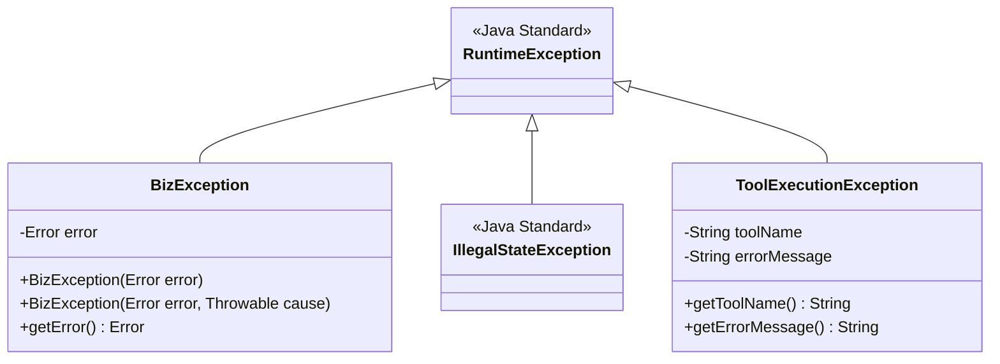

**章节来源**
- [BizException.java](file://spring-ai-alibaba-studio/spring-ai-alibaba-studio-server/spring-ai-alibaba-studio-server-runtime/src/main/java/com/alibaba/cloud/ai/studio/runtime/exception/BizException.java#L30-L67)
- [ObservableToolCallingManager.java](file://spring-ai-alibaba-core/src/main/java/com/alibaba/cloud/ai/tool/ObservableToolCallingManager.java#L195-L224)

## 错误码定义规范

### ErrorCode 枚举设计

系统采用了分层的错误码设计，支持HTTP状态码、错误类型和具体错误代码的组合。

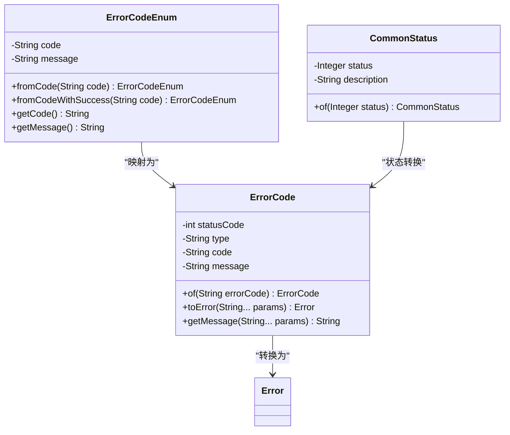

**图表来源**
- [ErrorCode.java](file://spring-ai-alibaba-studio/spring-ai-alibaba-studio-server/spring-ai-alibaba-studio-server-runtime/src/main/java/com/alibaba/cloud/ai/studio/runtime/enums/ErrorCode.java#L281-L346)
- [ErrorCodeEnum.java](file://spring-ai-alibaba-nl2sql/spring-ai-alibaba-nl2sql-common/src/main/java/com/alibaba/cloud/ai/enums/ErrorCodeEnum.java#L101-L166)

### 错误码分类体系

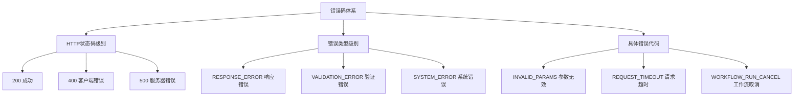

**章节来源**
- [ErrorCode.java](file://spring-ai-alibaba-studio/spring-ai-alibaba-studio-server/spring-ai-alibaba-studio-server-runtime/src/main/java/com/alibaba/cloud/ai/studio/runtime/enums/ErrorCode.java#L281-L346)
- [ErrorCodeEnum.java](file://spring-ai-alibaba-nl2sql/spring-ai-alibaba-nl2sql-common/src/main/java/com/alibaba/cloud/ai/enums/ErrorCodeEnum.java#L101-L166)

## 全局异常处理器

### GlobalExceptionHandler - 统一异常处理中心

`GlobalExceptionHandler`是整个异常处理体系的核心，负责捕获和处理所有未处理的异常。

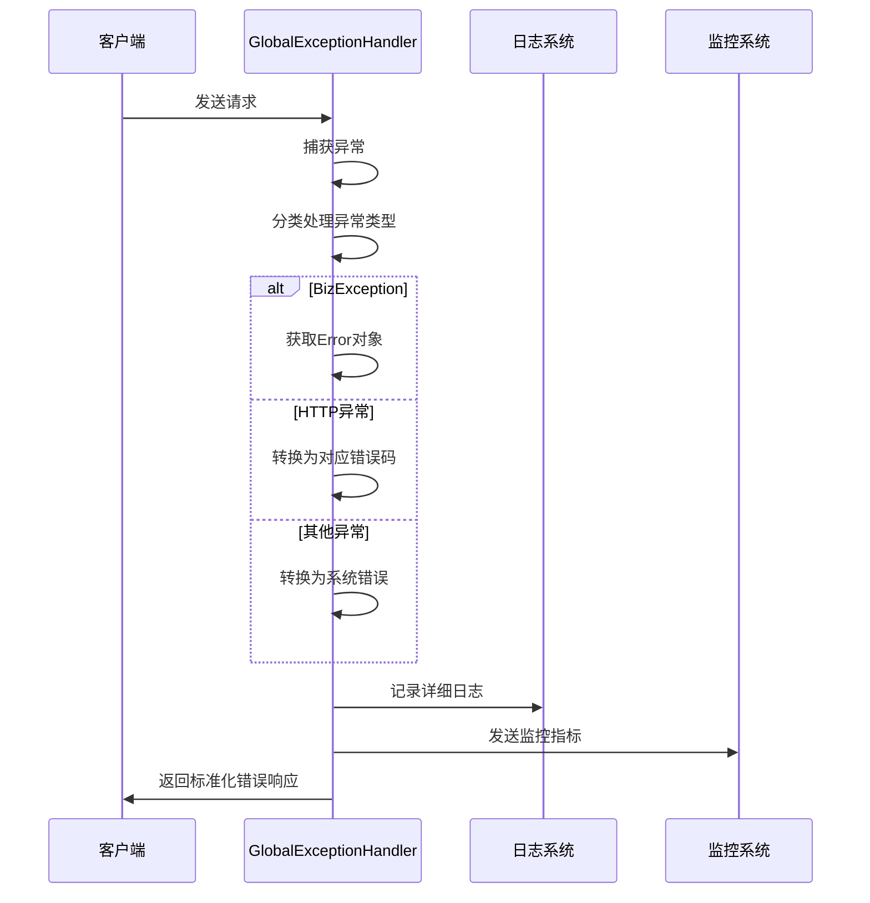

**图表来源**
- [GlobalExceptionHandler.java](file://spring-ai-alibaba-studio/spring-ai-alibaba-studio-server/spring-ai-alibaba-studio-server-admin/src/main/java/com/alibaba/cloud/ai/studio/admin/advice/GlobalExceptionHandler.java#L58-L102)

### 异常分类处理策略

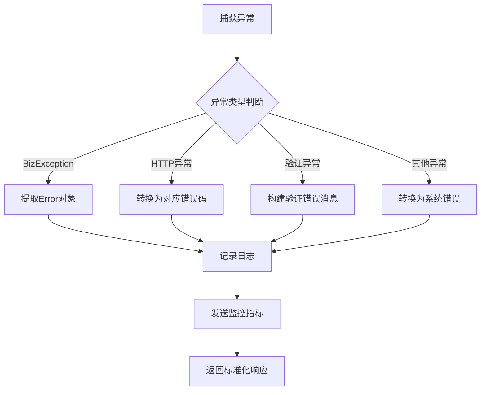

**图表来源**
- [GlobalExceptionHandler.java](file://spring-ai-alibaba-studio/spring-ai-alibaba-studio-server/spring-ai-alibaba-studio-server-admin/src/main/java/com/alibaba/cloud/ai/studio/admin/advice/GlobalExceptionHandler.java#L58-L102)

**章节来源**
- [GlobalExceptionHandler.java](file://spring-ai-alibaba-studio/spring-ai-alibaba-studio-server/spring-ai-alibaba-studio-server-admin/src/main/java/com/alibaba/cloud/ai/studio/admin/advice/GlobalExceptionHandler.java#L58-L172)

## 工具调用异常处理

### ObservableToolCallingManager - 工具调用异常管理器

工具调用异常处理是系统的重要组成部分，特别是在AI Agent和工具链执行场景中。

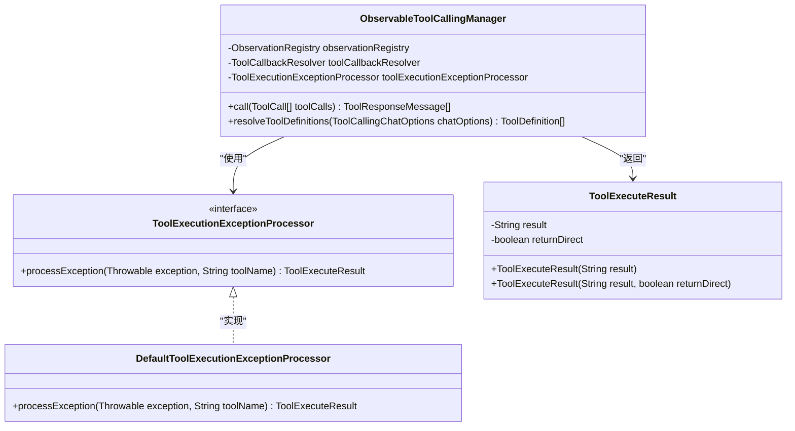

**图表来源**
- [ObservableToolCallingManager.java](file://spring-ai-alibaba-core/src/main/java/com/alibaba/cloud/ai/tool/ObservableToolCallingManager.java#L87-L120)

### 工具调用异常处理流程

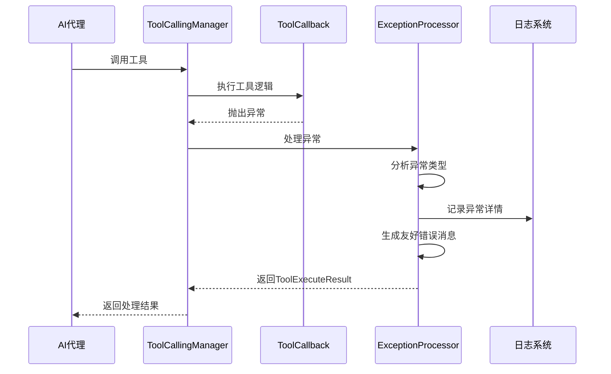

**图表来源**
- [ObservableToolCallingManager.java](file://spring-ai-alibaba-core/src/main/java/com/alibaba/cloud/ai/tool/ObservableToolCallingManager.java#L195-L224)

**章节来源**
- [ObservableToolCallingManager.java](file://spring-ai-alibaba-core/src/main/java/com/alibaba/cloud/ai/tool/ObservableToolCallingManager.java#L195-L224)

## 错误消息国际化支持

### 国际化架构设计

系统支持多语言错误消息，通过`$i18n`框架实现国际化支持。

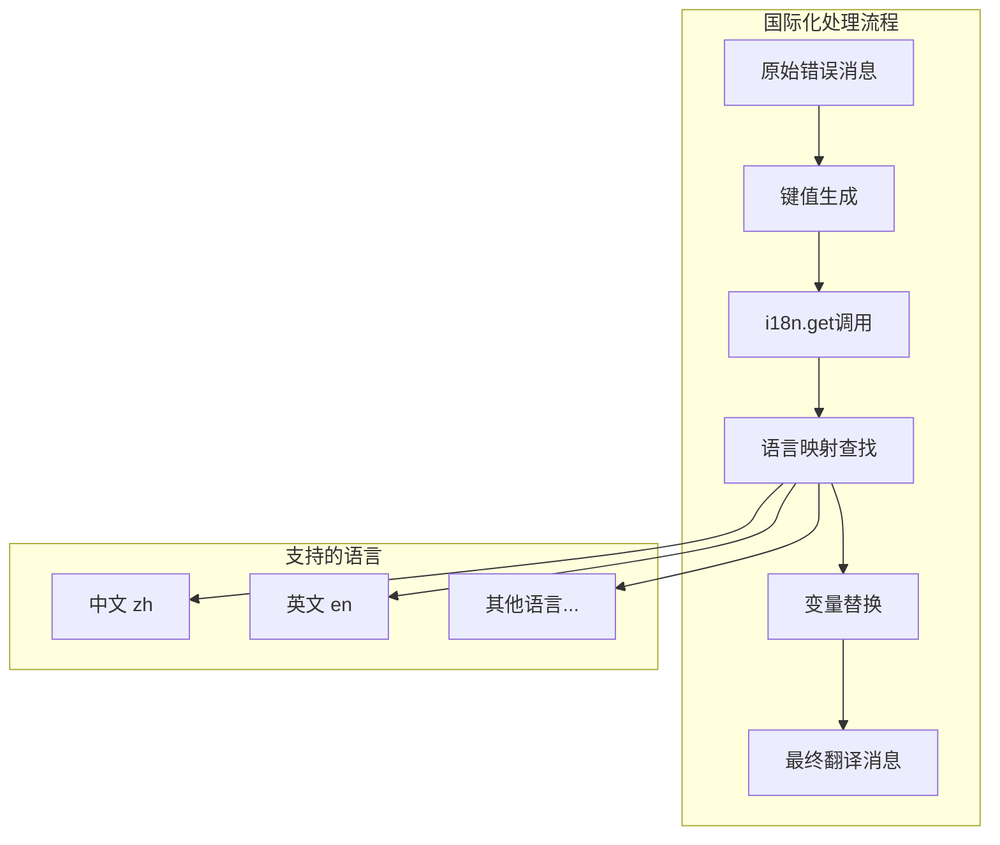

### 错误消息模板系统

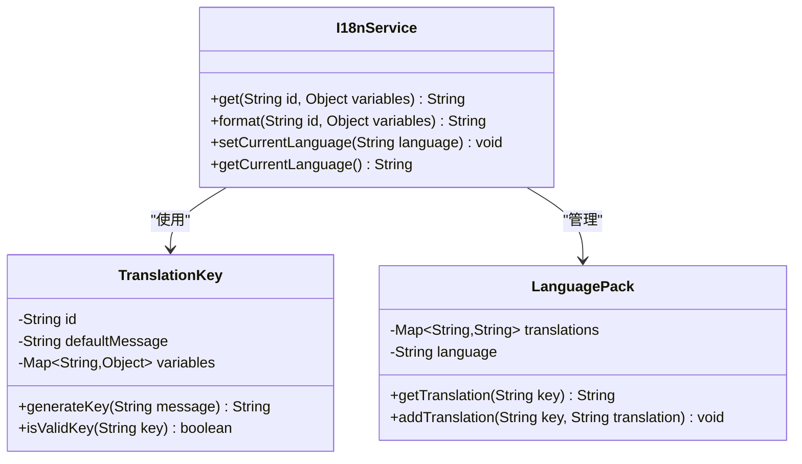

**章节来源**
- [LogUtils.java](file://spring-ai-alibaba-studio/spring-ai-alibaba-studio-server/spring-ai-alibaba-studio-server-core/src/main/java/com/alibaba/cloud/ai/studio/core/utils/LogUtils.java#L41-L89)

## 日志记录与监控集成

### LogUtils - 统一日志管理

`LogUtils`提供了统一的日志记录接口，支持多种级别的日志记录和监控指标收集。

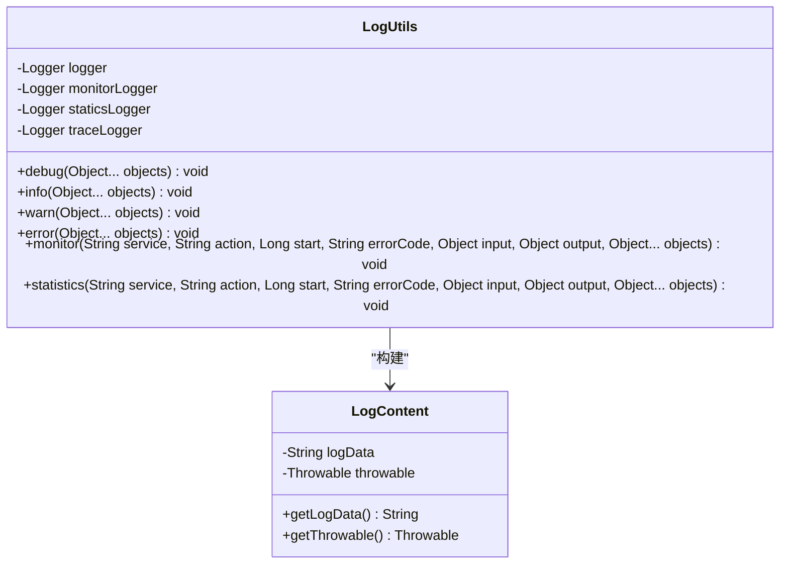

**图表来源**
- [LogUtils.java](file://spring-ai-alibaba-studio/spring-ai-alibaba-studio-server/spring-ai-alibaba-studio-server-core/src/main/java/com/alibaba/cloud/ai/studio/core/utils/LogUtils.java#L41-L89)

### 监控指标收集

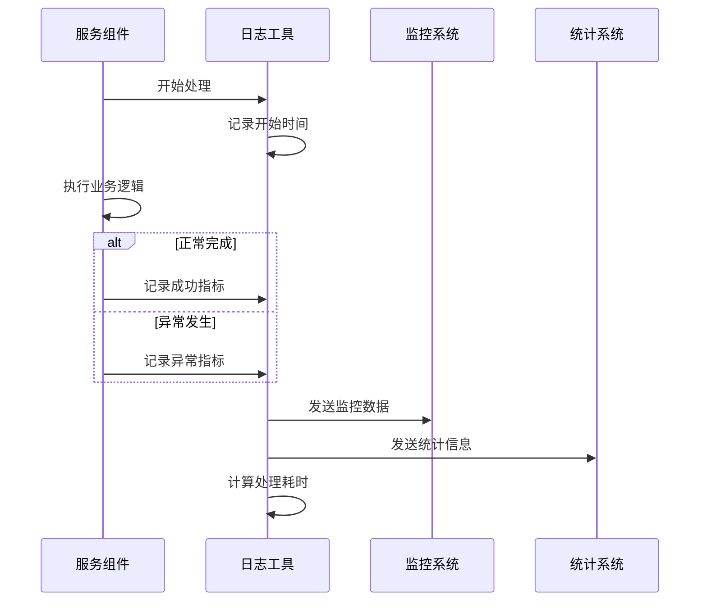

**图表来源**
- [LogUtils.java](file://spring-ai-alibaba-studio/spring-ai-alibaba-studio-server/spring-ai-alibaba-studio-server-core/src/main/java/com/alibaba/cloud/ai/studio/core/utils/LogUtils.java#L91-L118)

**章节来源**
- [LogUtils.java](file://spring-ai-alibaba-studio/spring-ai-alibaba-studio-server/spring-ai-alibaba-studio-server-core/src/main/java/com/alibaba/cloud/ai/studio/core/utils/LogUtils.java#L252-L322)

## 最佳实践指南

### 异常处理最佳实践

1. **使用适当的异常类型**
   - 业务异常使用`BizException`
   - 工具调用异常使用专门的工具异常类
   - 系统异常使用标准Java异常

2. **保持错误消息的一致性**
   ```java
   // 推荐的做法
   throw new BizException(ErrorCode.INVALID_PARAMS.toError("参数不能为空"));
   
   // 避免的做法
   throw new RuntimeException("参数为空");
   ```

3. **提供详细的上下文信息**
   ```java
   // 包含工具名称和参数的异常信息
   String errorMessage = String.format("工具 '%s' 执行失败: %s", toolName, e.getMessage());
   throw new ToolExecutionException(errorMessage, e);
   ```

### 错误恢复策略

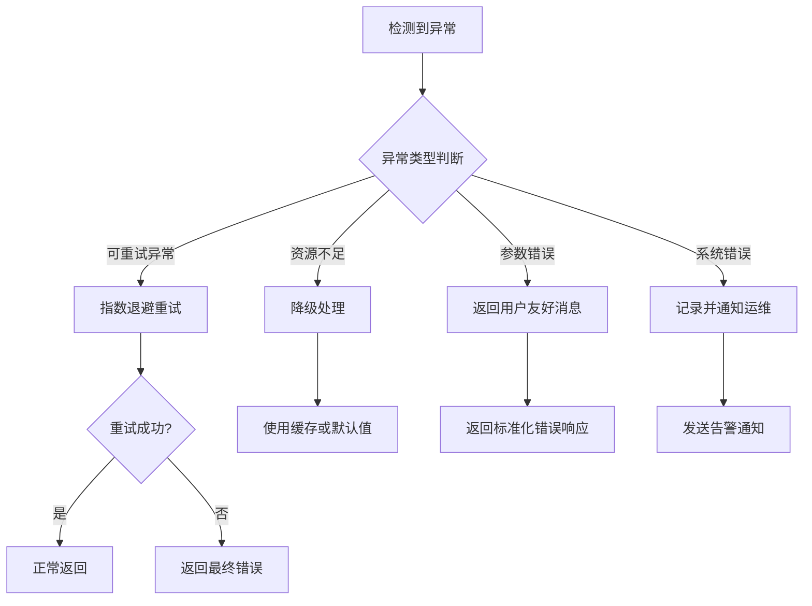

### 性能优化建议

1. **避免过度捕获异常**
   ```java
   // 推荐：只捕获必要的异常
   try {
       // 可能抛出异常的代码
   } catch (SpecificException e) {
       // 处理特定异常
   }
   
   // 避免：捕获所有异常
   try {
       // 可能抛出异常的代码
   } catch (Exception e) {
       // 过度捕获
   }
   ```

2. **合理使用异步异常处理**
   ```java
   // 使用CompletableFuture处理异步异常
   CompletableFuture.supplyAsync(() -> {
       // 异步任务
   }).exceptionally(ex -> {
       // 异常处理
       return null;
   });
   ```

## 故障排除指南

### 常见异常场景及解决方案

1. **工具调用失败**
   ```
   异常现象：工具执行过程中抛出异常
   解决方案：
   - 检查工具配置是否正确
   - 验证输入参数格式
   - 查看工具回调注册状态
   ```

2. **HTTP请求异常**
   ```
   异常现象：HTTP请求超时或格式错误
   解决方案：
   - 检查网络连接
   - 验证请求格式
   - 调整超时设置
   ```

3. **数据库连接异常**
   ```
   异常现象：数据库连接失败
   解决方案：
   - 检查数据库配置
   - 验证连接池设置
   - 查看防火墙规则
   ```

### 调试技巧

1. **启用详细日志**
   ```yaml
   logging:
     level:
       com.alibaba.cloud.ai: DEBUG
   ```

2. **使用监控指标**
   - 监控异常率变化
   - 关注响应时间趋势
   - 检查错误码分布

3. **异常堆栈分析**
   ```java
   // 启用完整堆栈跟踪
   exception.printStackTrace(new PrintWriter(System.out));
   ```

**章节来源**
- [DynamicAgent.java](file://spring-ai-alibaba-jmanus/src/main/java/com/alibaba/cloud/ai/manus/agent/DynamicAgent.java#L335-L358)
- [PythonExecute.java](file://spring-ai-alibaba-jmanus/src/main/java/com/alibaba/cloud/ai/manus/tool/code/PythonExecute.java#L103-L130)

## 总结

Spring AI Alibaba的错误处理与异常管理体系具有以下特点：

1. **完整性**：覆盖了从基础业务异常到复杂工具调用异常的全场景
2. **一致性**：统一的异常处理流程和标准化的错误响应格式
3. **可观测性**：完善的日志记录和监控集成
4. **可扩展性**：支持自定义异常类型和错误码
5. **国际化**：多语言错误消息支持
6. **性能优化**：合理的异常处理策略和性能考虑

这套异常处理体系为开发者提供了强大而灵活的错误处理能力，确保了系统的稳定性和可维护性。通过遵循本文档提供的最佳实践，开发者可以有效地利用这些异常处理机制，构建更加健壮的应用程序。