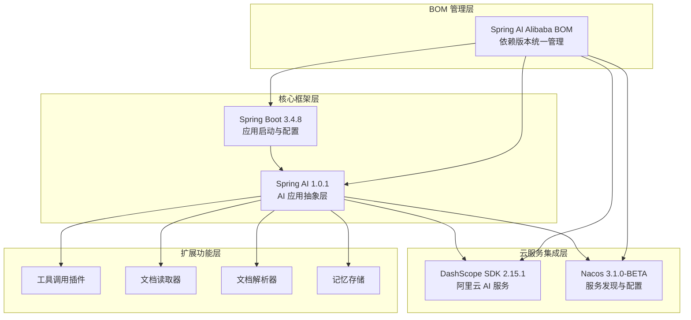
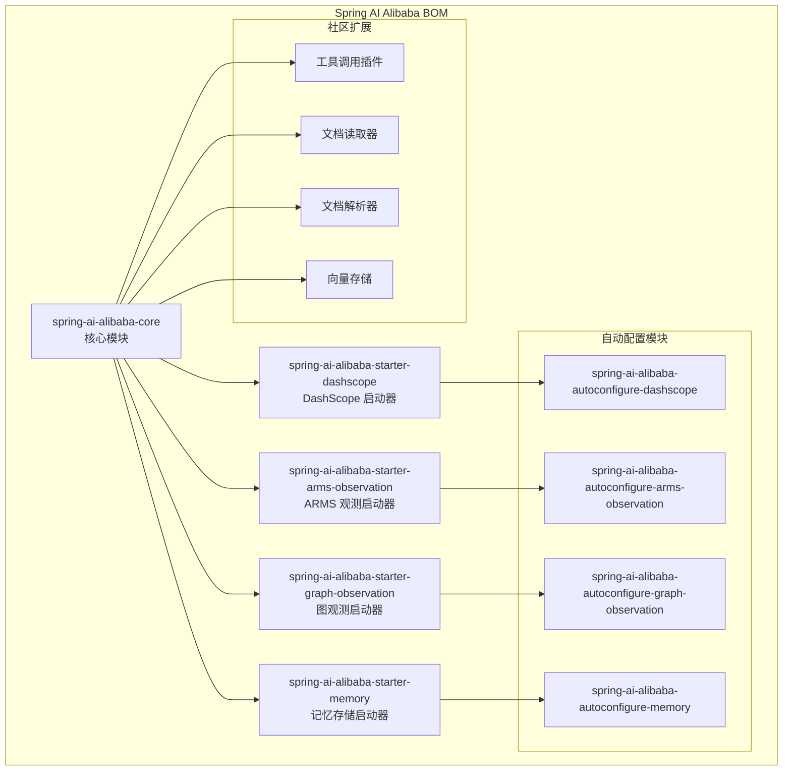
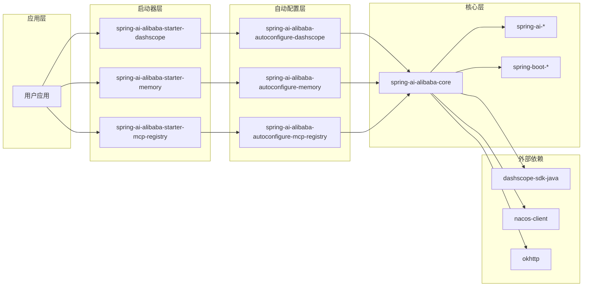
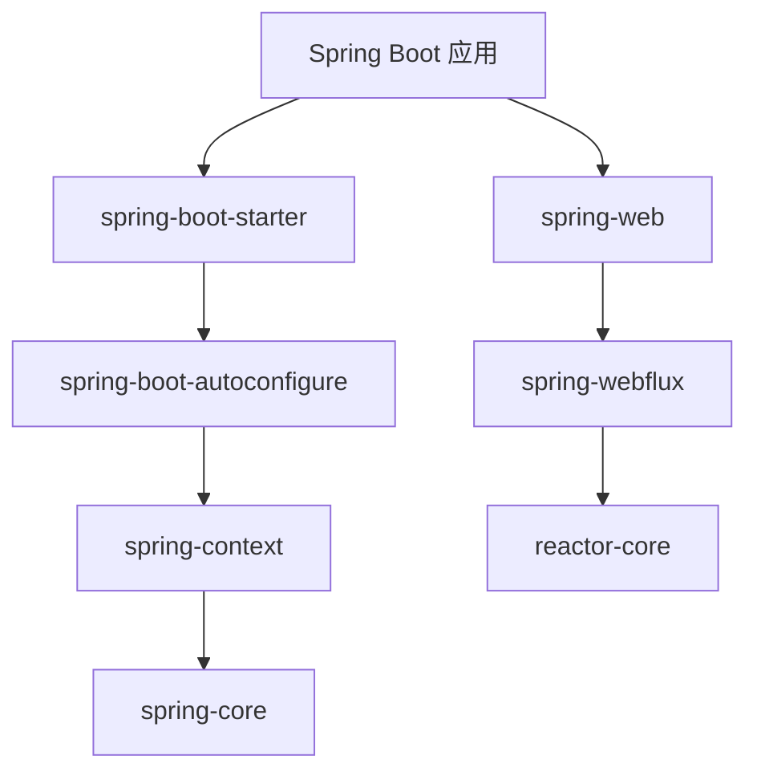
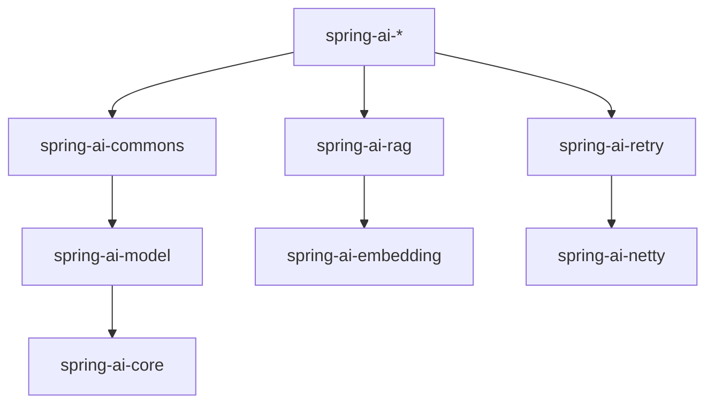

# 技术栈与依赖

<cite>
**本文档引用的文件**
- [pom.xml](file://pom.xml)
- [spring-ai-alibaba-bom/pom.xml](file://spring-ai-alibaba-bom/pom.xml)
- [spring-ai-alibaba-core/pom.xml](file://spring-ai-alibaba-core/pom.xml)
- [auto-configurations/spring-ai-alibaba-autoconfigure-dashscope/pom.xml](file://auto-configurations/spring-ai-alibaba-autoconfigure-dashscope/pom.xml)
- [spring-ai-alibaba-spring-boot-starters/spring-ai-alibaba-starter-dashscope/pom.xml](file://spring-ai-alibaba-spring-boot-starters/spring-ai-alibaba-starter-dashscope/pom.xml)
- [README.md](file://README.md)
</cite>

## 目录
1. [简介](#简介)
2. [核心技术栈概览](#核心技术栈概览)
3. [Spring Boot 3.4.8 集成](#spring-boot-348-集成)
4. [Spring AI 1.0.1 核心框架](#spring-ai-101-核心框架)
5. [DashScope SDK 2.15.1 集成](#dashscope-sdk-2151-集成)
6. [Nacos 3.1.0-BETA 集成](#nacos-310-beta-集成)
7. [BOM（物料清单）管理](#bom物料清单管理)
8. [依赖关系分析](#依赖关系分析)
9. [环境准备与版本匹配](#环境准备与版本匹配)
10. [最佳实践指导](#最佳实践指导)
11. [故障排除指南](#故障排除指南)
12. [总结](#总结)

## 简介

Spring AI Alibaba 是一个面向企业级应用的智能代理框架，旨在帮助开发者快速构建聊天机器人、工作流和多智能体应用程序。该框架基于 Spring Boot 和 Spring AI 生态系统，集成了阿里巴巴云的 AI 能力，提供了完整的开箱即用解决方案。

本文档详细介绍了 Spring AI Alibaba 框架所依赖的核心技术栈，包括 Spring Boot 3.4.8、Spring AI 1.0.1、DashScope SDK 2.15.1 和 Nacos 3.1.0-BETA 等关键技术的版本信息、兼容性要求以及相互关系。

## 核心技术栈概览

Spring AI Alibaba 框架采用分层架构设计，通过模块化的方式组织功能组件。整个技术栈围绕以下几个核心部分构建：



**图表来源**
- [pom.xml](file://pom.xml#L1-L717)
- [spring-ai-alibaba-bom/pom.xml](file://spring-ai-alibaba-bom/pom.xml#L1-L1102)

## Spring Boot 3.4.8 集成

Spring Boot 3.4.8 作为框架的基础运行时平台，提供了现代化的企业级应用开发能力。

### 版本特性

- **Java 17+ 支持**: 完全兼容 Java 17 LTS 及更高版本
- **Jakarta EE 9+**: 使用 Jakarta EE 9+ 规范，支持最新的 Web 标准
- **Reactive 编程**: 内置对 Reactor 的支持，提供非阻塞 I/O 处理
- **自动配置**: 基于条件的自动配置机制，简化开发流程

### 关键配置

```xml
<properties>
    <java.version>17</java.version>
    <spring-boot.version>3.4.8</spring-boot.version>
    <project.build.sourceEncoding>UTF-8</project.build.sourceEncoding>
    <project.reporting.outputEncoding>UTF-8</project.reporting.outputEncoding>
</properties>
```

### 依赖管理

Spring Boot 3.4.8 通过 Spring Boot Dependencies BOM 进行版本管理：

```xml
<dependency>
    <groupId>org.springframework.boot</groupId>
    <artifactId>spring-boot-dependencies</artifactId>
    <version>${spring-boot.version}</version>
    <type>pom</type>
    <scope>import</scope>
</dependency>
```

**章节来源**
- [pom.xml](file://pom.xml#L80-L90)
- [spring-ai-alibaba-core/pom.xml](file://spring-ai-alibaba-core/pom.xml#L1-L114)

## Spring AI 1.0.1 核心框架

Spring AI 1.0.1 提供了 AI 应用开发的核心抽象和通用功能。

### 核心模块

Spring AI 1.0.1 包含以下关键模块：

1. **spring-ai-commons**: 通用 AI 功能和抽象
2. **spring-ai-model**: 模型抽象和客户端
3. **spring-ai-rag**: 检索增强生成（RAG）功能
4. **spring-ai-retry**: 重试机制和错误处理
5. **spring-ai-autoconfigure-***: 各种自动配置模块

### 依赖关系

```xml
<dependency>
    <groupId>org.springframework.ai</groupId>
    <artifactId>spring-ai-commons</artifactId>
</dependency>
<dependency>
    <groupId>org.springframework.ai</groupId>
    <artifactId>spring-ai-model</artifactId>
</dependency>
<dependency>
    <groupId>org.springframework.ai</groupId>
    <artifactId>spring-ai-rag</artifactId>
</dependency>
<dependency>
    <groupId>org.springframework.ai</groupId>
    <artifactId>spring-ai-retry</artifactId>
</dependency>
```

### 自动配置模块

Spring AI Alibaba 集成了多个 Spring AI 自动配置模块：

- spring-ai-autoconfigure-retry
- spring-ai-autoconfigure-model-tool
- spring-ai-autoconfigure-model-chat-client
- spring-ai-autoconfigure-model-chat-observation
- spring-ai-autoconfigure-model-embedding-observation
- spring-ai-autoconfigure-model-image-observation

**章节来源**
- [spring-ai-alibaba-core/pom.xml](file://spring-ai-alibaba-core/pom.xml#L30-L60)
- [auto-configurations/spring-ai-alibaba-autoconfigure-dashscope/pom.xml](file://auto-configurations/spring-ai-alibaba-autoconfigure-dashscope/pom.xml#L40-L80)

## DashScope SDK 2.15.1 集成

DashScope SDK 2.15.1 是阿里巴巴云提供的 AI 服务 SDK，为 Spring AI Alibaba 提供了访问阿里云 AI 能力的桥梁。

### 主要功能

- **模型调用**: 支持文本生成、图像生成、语音合成等 AI 模型
- **向量化**: 文本向量化和相似度计算
- **多模态**: 支持文本、图像、音频等多种输入格式
- **批量处理**: 高效的批量请求处理能力

### 版本管理

```xml
<dependency>
    <groupId>com.alibaba</groupId>
    <artifactId>dashscope-sdk-java</artifactId>
    <version>${dashscope-sdk-java.version}</version>
    <exclusions>
        <exclusion>
            <groupId>org.slf4j</groupId>
            <artifactId>slf4j-api</artifactId>
        </exclusion>
        <exclusion>
            <groupId>org.slf4j</groupId>
            <artifactId>slf4j-simple</artifactId>
        </exclusion>
    </exclusions>
</dependency>
```

### 配置属性

DashScope SDK 通过 Spring Boot 自动配置机制进行配置：

```xml
<dependency>
    <groupId>com.alibaba.cloud.ai</groupId>
    <artifactId>spring-ai-alibaba-autoconfigure-dashscope</artifactId>
    <version>${revision}</version>
</dependency>
```

**章节来源**
- [pom.xml](file://pom.xml#L600-L620)
- [auto-configurations/spring-ai-alibaba-autoconfigure-dashscope/pom.xml](file://auto-configurations/spring-ai-alibaba-autoconfigure-dashscope/pom.xml#L30-L40)

## Nacos 3.1.0-BETA 集成

Nacos 3.1.0-BETA 作为服务发现和配置管理的核心组件，在 Spring AI Alibaba 中发挥着重要作用。

### 核心功能

- **服务发现**: 支持动态服务注册与发现
- **配置管理**: 集中式配置管理和服务配置热更新
- **负载均衡**: 内置多种负载均衡策略
- **健康检查**: 自动的服务健康状态监控

### 集成模块

Spring AI Alibaba 通过以下模块集成 Nacos：

1. **MCP 注册中心**: Nacos MCP Registry 用于 MCP 服务器发现
2. **A2A 服务**: 用于智能代理之间的通信
3. **提示模板**: Nacos 提示模板管理

### 版本配置

```xml
<nacos3.version>3.1.0-BETA</nacos3.version>
<nacos-client-mse-extension.version>1.0.6</nacos-client-mse-extension.version>
<spring-alibaba-nacos-config.version>2023.0.1.3</spring-alibaba-nacos-config.version>
```

### MCP 集成

```xml
<dependency>
    <groupId>com.alibaba.cloud.ai</groupId>
    <artifactId>spring-ai-alibaba-autoconfigure-mcp-registry</artifactId>
    <version>${project.version}</version>
</dependency>
```

**章节来源**
- [pom.xml](file://pom.xml#L120-L130)
- [spring-ai-alibaba-bom/pom.xml](file://spring-ai-alibaba-bom/pom.xml#L200-L220)

## BOM（物料清单）管理

Spring AI Alibaba 使用 BOM（Bill of Materials）来统一管理所有模块的版本，确保依赖的一致性和兼容性。

### BOM 结构



**图表来源**
- [spring-ai-alibaba-bom/pom.xml](file://spring-ai-alibaba-bom/pom.xml#L80-L400)

### 使用方式

在项目中使用 Spring AI Alibaba BOM：

```xml
<dependencyManagement>
  <dependencies>
    <dependency>
      <groupId>com.alibaba.cloud.ai</groupId>
      <artifactId>spring-ai-alibaba-bom</artifactId>
      <version>1.0.0.4-SNAPSHOT</version>
      <type>pom</type>
      <scope>import</scope>
    </dependency>
  </dependencies>
</dependencyManagement>

<dependencies>
  <dependency>
    <groupId>com.alibaba.cloud.ai</groupId>
    <artifactId>spring-ai-alibaba-starter-dashscope</artifactId>
  </dependency>
</dependencies>
```

### 版本一致性

BOM 确保所有 Spring AI Alibaba 模块使用相同的版本号，避免版本冲突：

```xml
<dependency>
    <groupId>com.alibaba.cloud.ai</groupId>
    <artifactId>spring-ai-alibaba-core</artifactId>
    <version>${project.version}</version>
</dependency>
```

**章节来源**
- [spring-ai-alibaba-bom/pom.xml](file://spring-ai-alibaba-bom/pom.xml#L1-L1102)
- [README.md](file://README.md#L40-L50)

## 依赖关系分析

Spring AI Alibaba 的依赖关系复杂但结构清晰，主要分为以下几个层次：

### 核心依赖层次



**图表来源**
- [pom.xml](file://pom.xml#L1-L100)
- [spring-ai-alibaba-core/pom.xml](file://spring-ai-alibaba-core/pom.xml#L30-L80)

### 关键依赖分析

#### Spring Boot 依赖链



#### Spring AI 依赖链



**章节来源**
- [spring-ai-alibaba-core/pom.xml](file://spring-ai-alibaba-core/pom.xml#L30-L80)

## 环境准备与版本匹配

### Java 版本要求

Spring AI Alibaba 对 Java 版本有明确要求：

- **最低要求**: Java 17+
- **推荐版本**: Java 17 LTS 或更高版本
- **编译目标**: Java 17

### Maven 配置

```xml
<properties>
    <java.version>17</java.version>
    <maven.compiler.source>${java.version}</maven.compiler.source>
    <maven.compiler.target>${java.version}</maven.compiler.target>
</properties>
```

### Maven 仓库配置

为了正确解析 Spring AI 相关依赖，需要配置 Spring Milestones 仓库：

```xml
<repositories>
    <repository>
        <snapshots>
            <enabled>false</enabled>
        </snapshots>
        <id>spring-milestones</id>
        <name>Spring Milestones</name>
        <url>https://repo.spring.io/milestone</url>
    </repository>
</repositories>
```

### 版本兼容性矩阵

| 组件 | 版本 | 兼容性 |
|------|------|--------|
| Spring Boot | 3.4.8 | ✅ 完全兼容 |
| Spring AI | 1.0.1 | ✅ 完全兼容 |
| DashScope SDK | 2.15.1 | ✅ 完全兼容 |
| Nacos | 3.1.0-BETA | ✅ 完全兼容 |

**章节来源**
- [pom.xml](file://pom.xml#L80-L90)
- [README.md](file://README.md#L50-L60)

## 最佳实践指导

### 项目初始化

1. **创建 Maven 项目**:
```bash
mvn archetype:generate \
    -DgroupId=com.example \
    -DartifactId=ai-app \
    -DarchetypeArtifactId=maven-archetype-quickstart \
    -DinteractiveMode=false
```

2. **添加 Spring AI Alibaba 依赖**:
```xml
<dependencyManagement>
  <dependencies>
    <dependency>
      <groupId>com.alibaba.cloud.ai</groupId>
      <artifactId>spring-ai-alibaba-bom</artifactId>
      <version>1.0.0.4-SNAPSHOT</version>
      <type>pom</type>
      <scope>import</scope>
    </dependency>
  </dependencies>
</dependencyManagement>

<dependencies>
  <dependency>
    <groupId>com.alibaba.cloud.ai</groupId>
    <artifactId>spring-ai-alibaba-starter-dashscope</artifactId>
  </dependency>
</dependencies>
```

### 开发工具链推荐

1. **IDE**: IntelliJ IDEA Ultimate 或 Eclipse
2. **插件**: Spring Boot 插件、Maven 插件
3. **调试工具**: Spring Boot DevTools
4. **测试框架**: JUnit 5、Mockito

### 配置最佳实践

1. **配置文件分离**:
   - application.yml: 基础配置
   - application-prod.yml: 生产环境配置
   - application-dev.yml: 开发环境配置

2. **安全配置**:
```yaml
spring:
  ai:
    dashscope:
      api-key: ${DASHSCOPE_API_KEY}
      endpoint: ${DASHSCOPE_ENDPOINT}
```

3. **日志配置**:
```yaml
logging:
  level:
    com.alibaba.cloud.ai: DEBUG
    org.springframework.ai: INFO
```

## 故障排除指南

### 常见问题与解决方案

#### 1. 依赖冲突问题

**问题**: Maven 依赖冲突导致运行时异常

**解决方案**:
```bash
mvn dependency:tree -Dverbose -Dincludes=org.springframework.ai
```

**章节来源**
- [pom.xml](file://pom.xml#L600-L650)

#### 2. Spring Milestones 仓库访问问题

**问题**: 无法下载 Spring AI 相关依赖

**解决方案**:
```xml
<!-- 在 settings.xml 中添加 -->
<mirrors>
    <mirror>
        <id>aliyun-maven</id>
        <mirrorOf>*</mirrorOf>
        <url>https://maven.aliyun.com/repository/public</url>
    </mirror>
</mirrors>
```

#### 3. Java 版本不兼容

**问题**: 编译或运行时出现 Java 版本错误

**解决方案**:
```bash
# 检查 Java 版本
java -version

# 设置 JAVA_HOME
export JAVA_HOME=/path/to/java17
```

### 性能优化建议

1. **内存配置**:
```bash
-Xms512m -Xmx1024m
```

2. **并发配置**:
```yaml
spring:
  ai:
    dashscope:
      max-concurrent-requests: 10
```

3. **连接池配置**:
```yaml
spring:
  ai:
    dashscope:
      connection-pool-size: 20
```

## 总结

Spring AI Alibaba 框架通过精心设计的技术栈和依赖管理体系，为企业级 AI 应用开发提供了强大而灵活的解决方案。关键要点包括：

### 核心优势

1. **版本统一管理**: 通过 BOM 确保所有模块版本一致
2. **模块化设计**: 清晰的分层架构，便于维护和扩展
3. **云原生集成**: 深度集成阿里云 AI 服务和 Nacos
4. **企业级特性**: 支持生产环境部署和运维监控

### 技术选型

- **Spring Boot 3.4.8**: 现代化的应用框架
- **Spring AI 1.0.1**: 成熟的 AI 应用抽象层
- **DashScope SDK 2.15.1**: 阿里云 AI 服务 SDK
- **Nacos 3.1.0-BETA**: 服务发现和配置管理

### 发展方向

Spring AI Alibaba 持续演进，未来将在以下方面继续发展：

1. **更多 AI 模型支持**: 扩展支持更多的大语言模型
2. **性能优化**: 提升大规模应用的性能表现
3. **生态扩展**: 更丰富的工具调用和数据源支持
4. **企业功能**: 增强可观测性和运维能力

通过遵循本文档的指导原则和最佳实践，开发者可以充分利用 Spring AI Alibaba 框架的强大功能，快速构建高质量的企业级 AI 应用。