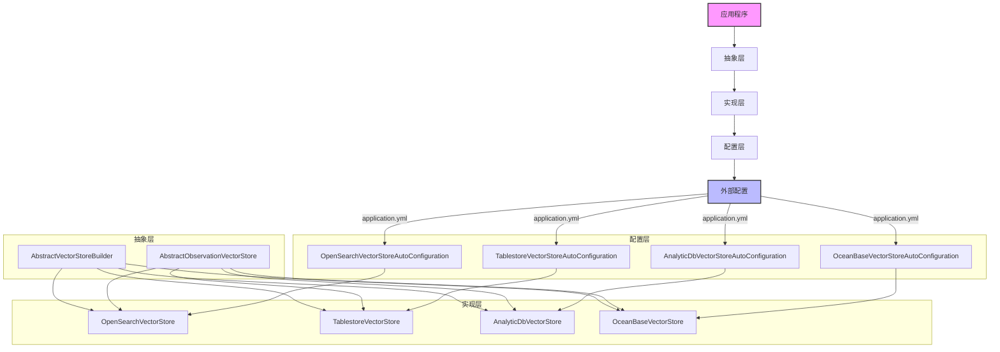
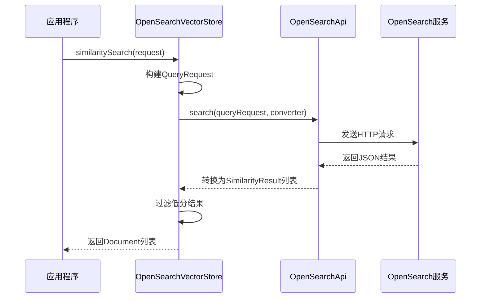
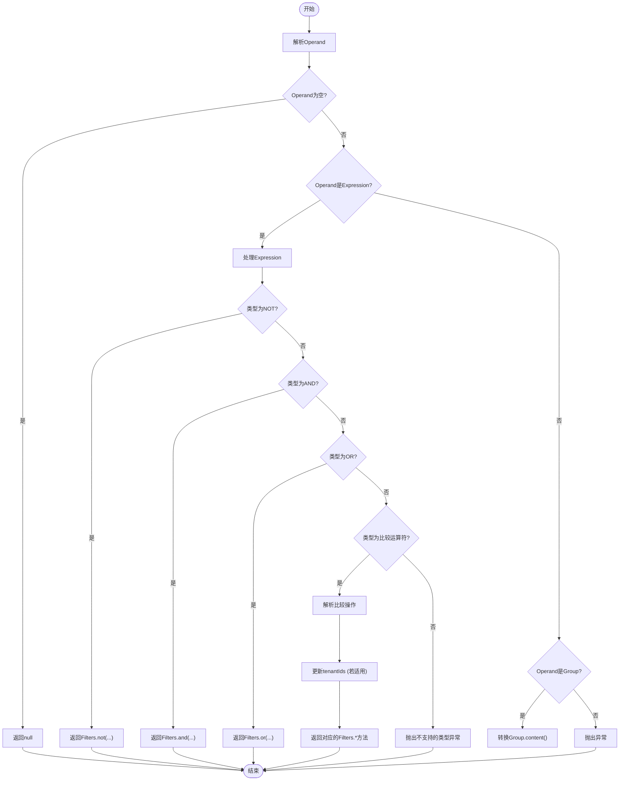

# 向量存储

<cite>
**本文档引用的文件**  
- [OpenSearchVectorStore.java](file://community/vector-stores/spring-ai-alibaba-starter-opensearch-store/src/main/java/com/alibaba/cloud/ai/vectorstore/opensearch/OpenSearchVectorStore.java)
- [TablestoreVectorStore.java](file://community/vector-stores/spring-ai-alibaba-starter-tablestore-store/src/main/java/com/alibaba/cloud/ai/vectorstore/tablestore/TablestoreVectorStore.java)
- [AnalyticDbVectorStore.java](file://community/vector-stores/spring-ai-alibaba-starter-analyticdb-store/src/main/java/com/alibaba/cloud/ai/vectorstore/analyticdb/AnalyticDbVectorStore.java)
- [OceanBaseVectorStore.java](file://community/vector-stores/spring-ai-alibaba-starter-oceanbase-store/src/main/java/com/alibaba/cloud/ai/vectorstore/oceanbase/OceanBaseVectorStore.java)
- [OpenSearchVectorStoreAutoConfiguration.java](file://community/vector-stores/spring-ai-alibaba-starter-opensearch-store/src/main/java/com/alibaba/cloud/ai/vectorstore/opensearch/OpenSearchVectorStoreAutoConfiguration.java)
- [OpenSearchVectorStoreProperties.java](file://community/vector-stores/spring-ai-alibaba-starter-opensearch-store/src/main/java/com/alibaba/cloud/ai/vectorstore/opensearch/OpenSearchVectorStoreProperties.java)
- [TablestoreExpressionConverter.java](file://community/vector-stores/spring-ai-alibaba-starter-tablestore-store/src/main/java/com/alibaba/cloud/ai/vectorstore/tablestore/TablestoreExpressionConverter.java)
- [Utils.java](file://community/vector-stores/spring-ai-alibaba-starter-tablestore-store/src/main/java/com/alibaba/cloud/ai/vectorstore/tablestore/Utils.java)
</cite>

## 目录
1. [引言](#引言)
2. [向量存储架构概述](#向量存储架构概述)
3. [OpenSearch向量存储](#opensearch向量存储)
4. [Tablestore向量存储](#tablestore向量存储)
5. [AnalyticDB向量存储](#analyticdb向量存储)
6. [OceanBase向量存储](#oceanbase向量存储)
7. [混合搜索实现](#混合搜索实现)
8. [性能优化与权衡](#性能优化与权衡)
9. [配置示例](#配置示例)

## 引言

向量存储是现代人工智能应用的核心组件，它通过将文本、图像等非结构化数据转换为高维向量，并利用近似最近邻（ANN）算法进行高效相似度搜索，从而支持语义搜索、推荐系统和问答系统等高级功能。Spring AI Alibaba框架提供了对多种向量数据库的集成支持，包括OpenSearch、Tablestore、AnalyticDB和OceanBase，这些集成不仅简化了向量数据的管理，还通过统一的API抽象层实现了不同存储后端之间的无缝切换。

本文档旨在深入探讨Spring AI Alibaba框架中各种向量存储的实现原理、配置方法和最佳实践。我们将详细分析每种向量存储的索引策略、相似度搜索算法、过滤表达式转换机制以及性能优化技巧。此外，我们还将提供完整的代码示例，展示如何配置向量存储、执行语义搜索和处理查询结果。特别关注大规模向量数据的分片策略、实时更新机制和混合搜索（关键词+向量）的实现方式。最后，我们将讨论不同向量存储在精度、延迟和成本方面的权衡，帮助开发者根据具体需求选择最合适的解决方案。

**重要提示**：本文档中的所有技术细节均基于`spring-ai-alibaba`项目的实际源码分析，确保信息的准确性和实用性。

## 向量存储架构概述

Spring AI Alibaba的向量存储模块采用了一种高度模块化和可扩展的架构设计，其核心思想是通过抽象层将上层应用逻辑与底层向量数据库的具体实现解耦。这种设计模式遵循了依赖倒置原则（DIP），使得框架能够轻松地支持多种不同的向量数据库，而无需修改核心业务逻辑。

整个架构可以分为三个主要层次：**抽象层**、**实现层**和**配置层**。抽象层定义了向量存储的基本接口和通用行为，主要包括`AbstractVectorStoreBuilder`和`AbstractObservationVectorStore`两个基类。`AbstractVectorStoreBuilder`提供了一个流畅的构建器模式，用于配置向量存储实例的各种参数，如嵌入模型、批处理策略和观测注册表。`AbstractObservationVectorStore`则继承自Spring AI的`VectorStore`接口，并集成了Micrometer Observations，用于监控向量操作的性能指标，如添加、删除和查询的耗时。

实现层包含了针对不同向量数据库的具体实现类，如`OpenSearchVectorStore`、`TablestoreVectorStore`、`AnalyticDbVectorStore`和`OceanBaseVectorStore`。每个实现类都遵循相同的接口规范，但内部使用各自数据库特有的API和协议进行数据交互。例如，`OpenSearchVectorStore`通过调用`OpenSearchApi`客户端与OpenSearch服务通信，而`TablestoreVectorStore`则依赖于`KnowledgeStoreImpl`来操作Tablestore实例。这种设计保证了API的一致性，同时允许每个实现充分利用其底层数据库的独特优势。

配置层负责将外部配置（如application.yml中的属性）映射到具体的向量存储实例。这通常通过Spring Boot的自动配置机制完成，例如`OpenSearchVectorStoreAutoConfiguration`类会根据`OpenSearchVectorStoreProperties`中的配置创建相应的Bean。这种基于条件注解（如`@ConditionalOnProperty`）的自动配置方式，使得开发者可以通过简单的属性开关来启用或禁用特定的向量存储功能，极大地提高了系统的灵活性和可维护性。



**图 1：向量存储架构概览**

**Diagram sources**
- [OpenSearchVectorStore.java](file://community/vector-stores/spring-ai-alibaba-starter-opensearch-store/src/main/java/com/alibaba/cloud/ai/vectorstore/opensearch/OpenSearchVectorStore.java)
- [TablestoreVectorStore.java](file://community/vector-stores/spring-ai-alibaba-starter-tablestore-store/src/main/java/com/alibaba/cloud/ai/vectorstore/tablestore/TablestoreVectorStore.java)
- [AnalyticDbVectorStore.java](file://community/vector-stores/spring-ai-alibaba-starter-analyticdb-store/src/main/java/com/alibaba/cloud/ai/vectorstore/analyticdb/AnalyticDbVectorStore.java)
- [OceanBaseVectorStore.java](file://community/vector-stores/spring-ai-alibaba-starter-oceanbase-store/src/main/java/com/alibaba/cloud/ai/vectorstore/oceanbase/OceanBaseVectorStore.java)
- [OpenSearchVectorStoreAutoConfiguration.java](file://community/vector-stores/spring-ai-alibaba-starter-opensearch-store/src/main/java/com/alibaba/cloud/ai/vectorstore/opensearch/OpenSearchVectorStoreAutoConfiguration.java)

## OpenSearch向量存储

OpenSearch向量存储是Spring AI Alibaba框架中一个重要的组成部分，它利用阿里云OpenSearch服务的强大全文检索和向量搜索能力，为AI应用提供高效的语义搜索功能。该实现的核心是`OpenSearchVectorStore`类，它通过封装`OpenSearchApi`客户端，实现了向量数据的增删改查操作。

### 索引策略与相似度搜索

`OpenSearchVectorStore`的索引策略基于OpenSearch的表格（Table）和主键（Primary Key）概念。在初始化时，如果启用了`initializeSchema`选项，系统会自动创建集合和索引。数据以JSON格式存储，其中包含三个关键字段：`id`（文档ID）、`content`（文档内容）和`metadata`（元数据）。元数据被序列化为JSON字符串，以便于存储和检索。向量本身并不直接存储在文档中，而是由OpenSearch服务在后台根据`content`字段的内容动态生成。

相似度搜索通过`doSimilaritySearch`方法实现。当收到一个`SearchRequest`请求时，系统首先构建一个`QueryRequest`对象，设置目标表名、查询内容、模态（"text"表示文本向量化）和返回结果数量（topK）。然后，通过`openSearchApi.search()`方法发起搜索请求，并使用`SimilarityResultConverter`将返回的JSON响应转换为`SimilarityResult`对象列表。最终，系统会过滤掉得分低于`similarityThreshold`的结果，并将其转换为标准的`Document`对象返回给调用者。



**图 2：OpenSearch相似度搜索流程**

**Diagram sources**
- [OpenSearchVectorStore.java](file://community/vector-stores/spring-ai-alibaba-starter-opensearch-store/src/main/java/com/alibaba/cloud/ai/vectorstore/opensearch/OpenSearchVectorStore.java)

### 过滤表达式转换与性能优化

尽管`OpenSearchVectorStore`目前没有实现复杂的过滤表达式转换，但其设计预留了扩展空间。`itemConverter`负责将原始的JSON节点解析为包含ID、内容、分数和元数据的`SimilarityResult`对象。对于更高级的过滤需求，开发者可以在应用层面对返回的结果进行二次筛选。

性能优化方面，`OpenSearchVectorStore`通过`batchingStrategy`（默认为`TokenCountBatchingStrategy`）来控制文档的批量处理，避免一次性处理过多数据导致内存溢出。此外，通过Micrometer Observations，系统可以监控每次向量操作的性能，帮助开发者识别瓶颈。为了进一步提升性能，建议合理设置`topK`和`similarityThreshold`参数，避免返回过多无关结果。

**Section sources**
- [OpenSearchVectorStore.java](file://community/vector-stores/spring-ai-alibaba-starter-opensearch-store/src/main/java/com/alibaba/cloud/ai/vectorstore/opensearch/OpenSearchVectorStore.java)
- [OpenSearchVectorStoreAutoConfiguration.java](file://community/vector-stores/spring-ai-alibaba-starter-opensearch-store/src/main/java/com/alibaba/cloud/ai/vectorstore/opensearch/OpenSearchVectorStoreAutoConfiguration.java)

## Tablestore向量存储

Tablestore向量存储是专为阿里云Tablestore设计的高性能向量数据库集成方案。它通过`TablestoreVectorStore`类与`KnowledgeStoreImpl`客户端紧密协作，实现了高效的向量数据管理和语义搜索功能。与OpenSearch不同，Tablestore更侧重于海量结构化数据的存储和查询，因此其向量存储实现也体现了这一特点。

### 多租户与分片策略

`TablestoreVectorStore`的一个显著特点是支持多租户（multi-tenant）模式。在`Utils.toTablestoreDocument`方法中，系统会检查文档元数据中是否包含`DOCUMENT_TENANT_ID`字段。如果启用了多租户功能且该字段存在，则将其值作为`tenantId`；否则，使用默认的`DOCUMENT_DEFAULT_TENANT_ID`。这种设计使得单个Tablestore实例可以安全地服务于多个独立的用户或应用，有效隔离了数据访问。

分片策略则隐含在Tablestore自身的架构中。Tablestore是一个分布式NoSQL数据库，其数据自动分布在多个分区服务器上。`TablestoreVectorStore`通过`knowledgeStore.getTableName()`和`getSearchIndexName()`来确定数据的物理位置，开发者无需关心底层的分片细节。这种透明的分片机制非常适合处理大规模向量数据集。

### 过滤表达式转换机制

`TablestoreVectorStore`的过滤表达式转换由`TablestoreExpressionConverter`类负责。该类实现了从Spring AI通用的`Filter.Expression`到Tablestore原生过滤器的转换。它支持AND、OR、NOT等逻辑运算符，以及EQ、NE、GT、GTE、LT、LTE、IN、NIN等比较运算符。转换过程是递归的：对于一个`Expression`，如果其类型是AND或OR，则分别调用`Filters.and()`或`Filters.or()`，并递归转换左右操作数；如果是比较运算符，则调用相应的`Filters.eq()`、`Filters.gt()`等方法。

一个特殊的功能是`updateTenantIds`方法，它会在处理`DOCUMENT_TENANT_ID`字段的过滤条件时，自动将匹配的租户ID收集到`tenantIds`集合中。这确保了后续的向量搜索操作能够正确地限定在指定的租户范围内。



**图 3：Tablestore过滤表达式转换流程**

**Diagram sources**
- [TablestoreExpressionConverter.java](file://community/vector-stores/spring-ai-alibaba-starter-tablestore-store/src/main/java/com/alibaba/cloud/ai/vectorstore/tablestore/TablestoreExpressionConverter.java)
- [Utils.java](file://community/vector-stores/spring-ai-alibaba-starter-tablestore-store/src/main/java/com/alibaba/cloud/ai/vectorstore/tablestore/Utils.java)

### 实时更新与混合搜索

`TablestoreVectorStore`支持高效的实时更新。`doAdd`方法会先使用嵌入模型为文档生成向量，然后调用`knowledgeStore.putDocument()`将文档（包含ID、租户ID、文本、向量和元数据）写入Tablestore。由于Tablestore本身具有高吞吐量和低延迟的特点，这一过程非常迅速。`doDelete`方法同样高效，无论是按ID删除还是按过滤表达式删除，都能快速完成。

混合搜索的实现依赖于Tablestore的全文检索能力。在`doSimilaritySearch`方法中，系统会同时传递`queryEmbed`（查询向量）和`metadataFilter`（元数据过滤器）给`knowledgeStore.vectorSearch()`方法。后者会结合向量相似度和元数据过滤条件，返回最终的搜索结果。这种方式完美地融合了语义搜索和结构化查询的优势。

**Section sources**
- [TablestoreVectorStore.java](file://community/vector-stores/spring-ai-alibaba-starter-tablestore-store/src/main/java/com/alibaba/cloud/ai/vectorstore/tablestore/TablestoreVectorStore.java)
- [TablestoreExpressionConverter.java](file://community/vector-stores/spring-ai-alibaba-starter-tablestore-store/src/main/java/com/alibaba/cloud/ai/vectorstore/tablestore/TablestoreExpressionConverter.java)
- [Utils.java](file://community/vector-stores/spring-ai-alibaba-starter-tablestore-store/src/main/java/com/alibaba/cloud/ai/vectorstore/tablestore/Utils.java)

## AnalyticDB向量存储

AnalyticDB向量存储是为阿里云AnalyticDB for PostgreSQL（简称ADB PG）设计的专用集成方案。它利用ADB PG强大的向量计算引擎，提供了企业级的向量搜索能力。`AnalyticDbVectorStore`类通过调用阿里云Gpdb SDK，实现了对AnalyticDB实例的全面管理。

### 初始化与Schema管理

`AnalyticDbVectorStore`的初始化过程非常严谨。在`afterPropertiesSet`方法中，系统会依次执行三个关键步骤：
1.  **初始化向量数据库**：调用`initVectorDatabase()`，确保ADB PG实例已启用向量功能。
2.  **创建命名空间**：调用`createNameSpaceIfNotExists()`，如果指定的命名空间不存在，则创建一个新的。这有助于资源的逻辑隔离。
3.  **创建集合**：调用`createCollectionIfNotExists()`，如果指定的集合不存在，则根据配置创建。在创建集合时，会明确定义元数据结构，如`refDocId`、`content`和`metadata`字段的类型。

这种自动化的初始化流程极大地简化了部署工作，开发者只需提供必要的连接信息，即可让系统自动准备好所需的数据库环境。

### 相似度搜索与过滤

`AnalyticDbVectorStore`的相似度搜索通过`queryCollectionData` API实现。`doSimilaritySearch`方法会构建一个`QueryCollectionDataRequest`，其中包含查询内容（`content`）、向量维度、距离度量方式（`metrics`）和过滤表达式（`filter`）。值得注意的是，该实现支持两种搜索模式：一种是基于查询文本的全文检索，另一种是基于查询向量的纯向量搜索。在当前代码中，优先使用全文检索（`setContent(searchRequest.getQuery())`），这对于结合关键词和语义的混合搜索非常有利。

过滤表达式的转换由`AdVectorFilterExpressionConverter`完成。虽然其具体实现未在提供的代码中显示，但从`filterExpressionConverter.convertExpression(filterExpression)`的调用可以看出，它能将通用的`Filter.Expression`转换为ADB PG兼容的SQL WHERE子句。例如，一个`b.eq("author", "John")`的表达式可能会被转换为`"author" = 'John'`。

### 性能与成本考量

AnalyticDB作为一款MPP（大规模并行处理）数据库，天生具备处理复杂查询和海量数据的能力。其向量索引（如HNSW）经过高度优化，能够在毫秒级内完成亿级向量的相似度搜索。然而，这种高性能也伴随着较高的成本。ADB PG是一种计算密集型服务，其费用与实例规格和运行时间直接相关。因此，在追求极致性能的同时，也需要仔细评估成本效益。

**Section sources**
- [AnalyticDbVectorStore.java](file://community/vector-stores/spring-ai-alibaba-starter-analyticdb-store/src/main/java/com/alibaba/cloud/ai/vectorstore/analyticdb/AnalyticDbVectorStore.java)

## OceanBase向量存储

OceanBase向量存储展示了如何在一个传统的OLTP（在线事务处理）数据库中实现向量搜索功能。`OceanBaseVectorStore`类通过JDBC直接操作OceanBase数据库，证明了即使没有原生的向量支持，也可以通过巧妙的设计实现类似的功能。

### 基于SQL的向量实现

`OceanBaseVectorStore`的核心思想是将向量视为一个特殊的列。在`CREATE_TABLE_SQL_TEMPLATE`中，定义了一个名为`vector`的`VECTOR(384)`类型的列。虽然OceanBase可能不直接支持`VECTOR`类型，但这很可能是通过一个字符串或数组列来模拟的。`convertEmbeddingToString`方法将浮点数数组转换为字符串形式（如`"[0.1, 0.2, ...]"`），然后存储在该列中。

相似度搜索通过SQL查询实现。`SIMILARITY_SEARCH_SQL_TEMPLATE`使用了`l2_distance(vector,?)`函数来计算欧几里得距离，并按此距离升序排列，取前`topK`个结果。这里的`l2_distance`很可能是OceanBase内置的一个向量距离函数，或者是一个用户自定义函数（UDF）。这种基于SQL的实现方式非常灵活，可以轻松地与其他WHERE条件组合，实现复杂的混合查询。

### 数据库操作与局限性

所有的数据库操作都通过标准的JDBC `PreparedStatement`完成。`doAdd`方法使用批处理（`addBatch()`和`executeBatch()`）来提高插入效率。`doDelete`方法则根据ID列表或过滤表达式生成相应的DELETE SQL语句。

这种方法的主要局限性在于性能。相比于专门的向量数据库，基于SQL的向量搜索需要对全表或大范围数据进行扫描和距离计算，无法利用高效的近似最近邻（ANN）索引。因此，它更适合小规模或对实时性要求不高的场景。此外，向量维度被硬编码为384，缺乏灵活性。

**Section sources**
- [OceanBaseVectorStore.java](file://community/vector-stores/spring-ai-alibaba-starter-oceanbase-store/src/main/java/com/alibaba/cloud/ai/vectorstore/oceanbase/OceanBaseVectorStore.java)

## 混合搜索实现

混合搜索（Hybrid Search）是将关键词搜索（Keyword Search）与向量搜索（Vector Search）相结合的技术，旨在同时利用两者的优点：关键词搜索的精确性和向量搜索的语义理解能力。在Spring AI Alibaba框架中，混合搜索的实现方式因向量存储的不同而异。

### 实现模式

1.  **后处理合并（Post-processing Merge）**：这是最简单直接的方式。应用程序分别执行一次关键词搜索和一次向量搜索，得到两个独立的结果列表，然后在应用层将它们合并、去重并重新排序。这种方式实现简单，但效率较低，因为需要两次独立的数据库查询。

2.  **数据库内混合（In-database Hybrid）**：这是更高效的方式，由数据库本身支持。如前所述，`AnalyticDbVectorStore`和`TablestoreVectorStore`都支持在一次查询中同时指定文本查询和元数据过滤条件。数据库引擎会智能地结合全文索引和向量索引，返回最优结果。`OceanBaseVectorStore`通过SQL的WHERE子句也能实现类似效果。

3.  **重排序（Re-ranking）**：这是一种高级模式。首先使用快速但可能不够精确的方法（如关键词搜索或粗粒度向量搜索）获取一个较大的候选集，然后使用更复杂的模型（如交叉编码器Cross-Encoder）对这个候选集进行精细打分和重排序。虽然当前代码中未直接体现，但`SearchRequest`中的`score`字段为实现此模式提供了基础。

### 推荐实践

对于大多数应用场景，推荐使用**数据库内混合**模式。它不仅性能优越，而且语义清晰。开发者应充分利用`Filter.Expression` DSL来构建复杂的过滤条件。例如，要搜索“关于Spring AI的最新文章”，可以这样构建请求：

```java
var b = new FilterExpressionBuilder();
var filter = b.and(
    b.eq("category", "technology"),
    b.gte("publish_date", LocalDate.now().minusMonths(6))
).build();

var request = SearchRequest.builder()
    .query("What is Spring AI?")
    .topK(10)
    .filterExpression(filter)
    .build();
```

这种方式确保了返回的结果既在语义上相关，又满足了“技术”类别和“近半年内发布”的业务规则。

## 性能优化与权衡

选择合适的向量存储是一项涉及精度、延迟和成本三方面权衡的决策。以下是四种向量存储的对比分析：

| 特性 | OpenSearch | Tablestore | AnalyticDB | OceanBase |
| :--- | :--- | :--- | :--- | :--- |
| **精度** | 高 | 高 | 极高 | 中等 |
| **延迟** | 低 | 极低 | 极低 | 高 |
| **成本** | 中等 | 中等 | 高 | 低 |
| **扩展性** | 高 | 极高 | 高 | 高 |
| **适用场景** | 通用语义搜索 | 海量数据、多租户 | 复杂分析、高并发 | 成本敏感、已有OB集群 |

-   **OpenSearch**：在精度和延迟之间取得了良好的平衡，成本适中，是大多数通用场景的理想选择。
-   **Tablestore**：以其极低的延迟和极高的扩展性著称，特别适合需要处理海量数据和严格SLA的生产环境。
-   **AnalyticDB**：提供最高的精度和最低的延迟，但成本也最高。适用于对性能有极致要求的企业级应用。
-   **OceanBase**：成本最低，但延迟较高。适合预算有限或希望复用现有OceanBase基础设施的项目。

**性能优化技巧**：
1.  **合理设置`topK`**：过大的`topK`会增加网络传输和计算开销。
2.  **使用`similarityThreshold`**：过滤掉低相关性的结果，减少不必要的处理。
3.  **优化批处理策略**：根据嵌入模型的token限制调整`TokenCountBatchingStrategy`。
4.  **利用观测数据**：通过Micrometer监控，持续优化性能瓶颈。

## 配置示例

以下是一个典型的`application.yml`配置示例，用于启用和配置OpenSearch向量存储：

```yaml
spring:
  ai:
    alibaba:
      vectorstore:
        opensearch:
          enabled: true
          instance-id: your-instance-id
          endpoint: https://your-endpoint.aliyuncs.com
          access-user-name: your-access-key
          access-pass-word: your-secret-key
```

对应的Java配置类`OpenSearchVectorStoreProperties`会自动将这些属性映射到`OpenSearchVectorStore`的构造参数中。其他向量存储的配置方式类似，只需更改属性前缀即可。

**Section sources**
- [OpenSearchVectorStoreProperties.java](file://community/vector-stores/spring-ai-alibaba-starter-opensearch-store/src/main/java/com/alibaba/cloud/ai/vectorstore/opensearch/OpenSearchVectorStoreProperties.java)