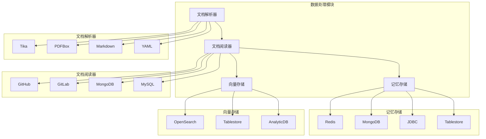
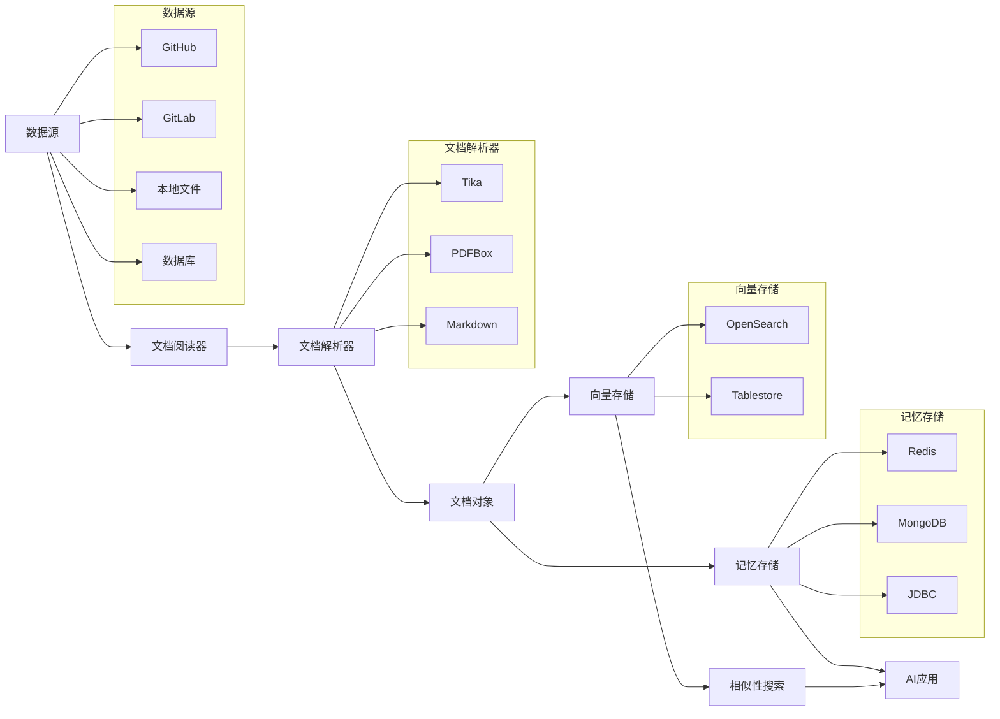
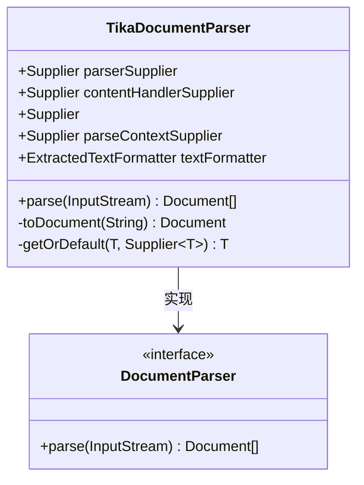
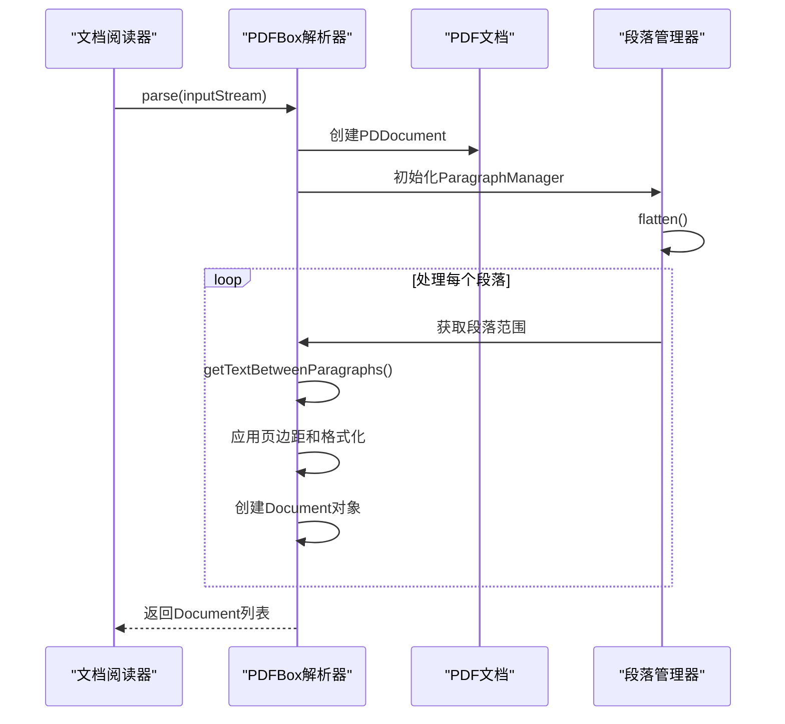
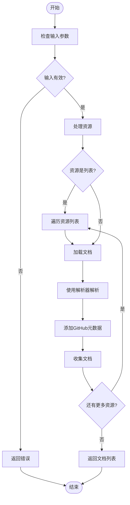
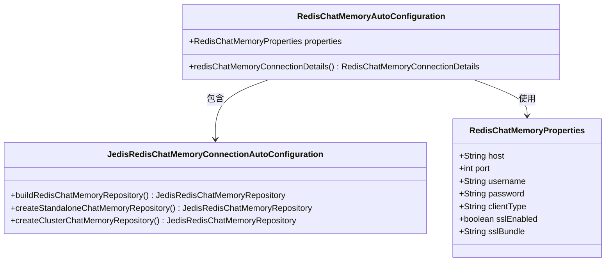
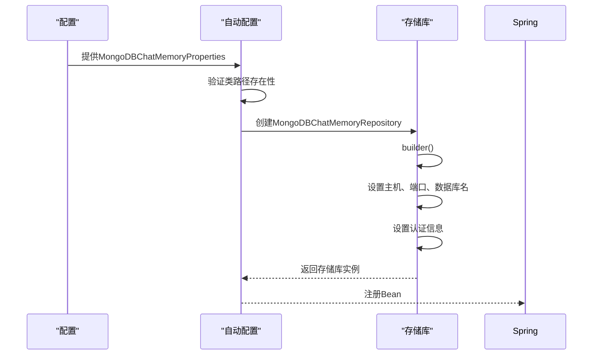
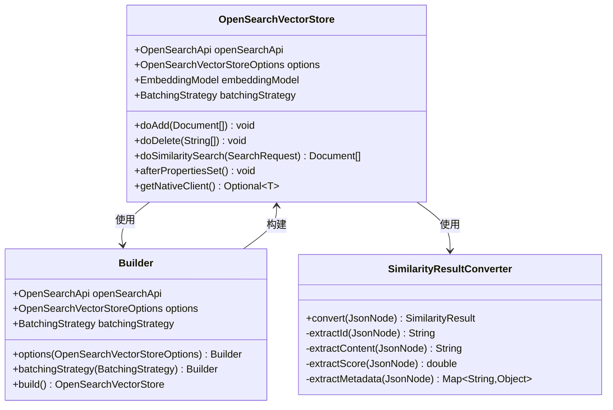
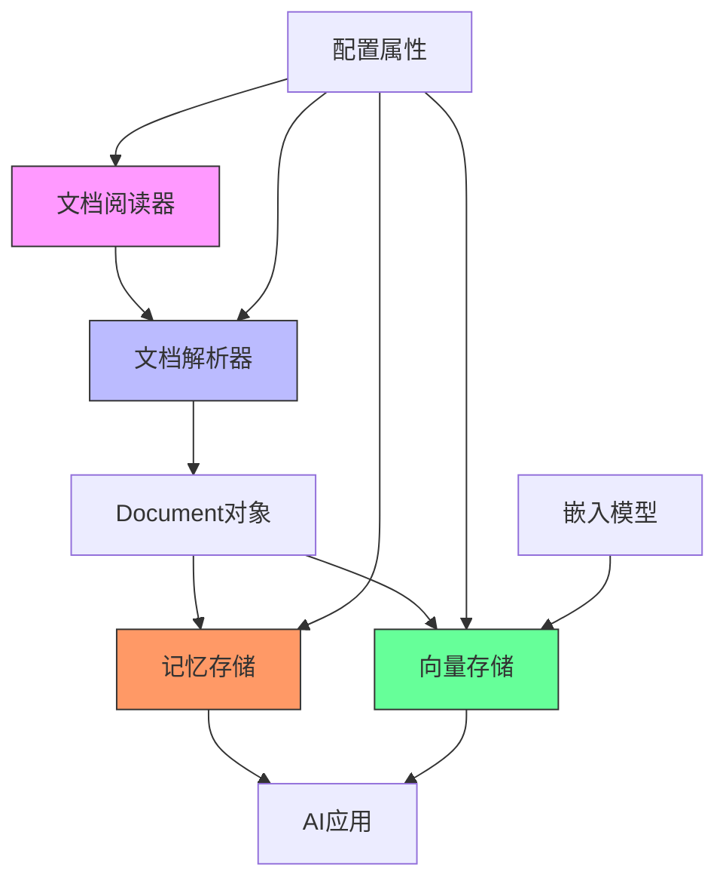

# 数据处理

<cite>
**本文档中引用的文件**
- [ChatMemoryAutoConfiguration.java](file://auto-configurations/spring-ai-alibaba-autoconfigure-memory/src/main/java/com/alibaba/cloud/ai/autoconfigure/memory/ChatMemoryAutoConfiguration.java)
- [ElasticsearchChatMemoryAutoConfiguration.java](file://auto-configurations/spring-ai-alibaba-autoconfigure-memory/src/main/java/com/alibaba/cloud/ai/autoconfigure/memory/ElasticsearchChatMemoryAutoConfiguration.java)
- [RedisChatMemoryAutoConfiguration.java](file://auto-configurations/spring-ai-alibaba-autoconfigure-memory/src/main/java/com/alibaba/cloud/ai/autoconfigure/memory/redis/RedisChatMemoryAutoConfiguration.java)
- [MongoDBChatMemoryAutoConfiguration.java](file://auto-configurations/spring-ai-alibaba-autoconfigure-memory/src/main/java/com/alibaba/cloud/ai/autoconfigure/memory/MongoDBChatMemoryAutoConfiguration.java)
- [TablestoreChatMemoryAutoConfiguration.java](file://auto-configurations/spring-ai-alibaba-autoconfigure-memory/src/main/java/com/alibaba/cloud/ai/autoconfigure/memory/TablestoreChatMemoryAutoConfiguration.java)
- [TikaDocumentParser.java](file://community/document-parsers/spring-ai-alibaba-starter-document-parser-tika/src/main/java/com/alibaba/cloud/ai/parser/tika/TikaDocumentParser.java)
- [ParagraphPdfDocumentParser.java](file://community/document-parsers/spring-ai-alibaba-starter-document-parser-apache-pdfbox/src/main/java/com/alibaba/cloud/ai/parser/apache/pdfbox/ParagraphPdfDocumentParser.java)
- [OpenSearchVectorStore.java](file://community/vector-stores/spring-ai-alibaba-starter-opensearch-store/src/main/java/com/alibaba/cloud/ai/vectorstore/opensearch/OpenSearchVectorStore.java)
- [GitHubDocumentReader.java](file://community/document-readers/spring-ai-alibaba-starter-document-reader-github/src/main/java/com/alibaba/cloud/ai/reader/github/GitHubDocumentReader.java)
</cite>

## 目录
1. [简介](#简介)
2. [项目结构](#项目结构)
3. [核心组件](#核心组件)
4. [架构概述](#架构概述)
5. [详细组件分析](#详细组件分析)
6. [依赖关系分析](#依赖关系分析)
7. [性能考量](#性能考量)
8. [故障排除指南](#故障排除指南)
9. [结论](#结论)

## 简介
本文档全面介绍了Spring AI Alibaba框架中的数据处理功能，重点涵盖文档解析器、文档阅读器、记忆存储和向量存储的实现与使用方法。文档详细说明了各数据处理组件的设计目标、支持的数据源类型和配置选项，并提供了将这些组件集成到AI应用中的具体代码示例。特别关注不同记忆存储（如Redis、JDBC、MongoDB）和向量存储（如OpenSearch、Tablestore）的性能特征和适用场景，同时讨论了数据安全、隐私保护和访问控制策略。

## 项目结构
Spring AI Alibaba项目采用模块化设计，将不同的数据处理功能分离到独立的模块中。主要的数据处理相关模块包括document-parsers（文档解析器）、document-readers（文档阅读器）、memories（记忆存储）和vector-stores（向量存储）。这种结构使得开发者可以根据需要选择和集成特定的功能模块，而无需引入整个框架。

**图示来源**
- [TikaDocumentParser.java](file://community/document-parsers/spring-ai-alibaba-starter-document-parser-tika/src/main/java/com/alibaba/cloud/ai/parser/tika/TikaDocumentParser.java)
- [ParagraphPdfDocumentParser.java](file://community/document-parsers/spring-ai-alibaba-starter-document-parser-apache-pdfbox/src/main/java/com/alibaba/cloud/ai/parser/apache/pdfbox/ParagraphPdfDocumentParser.java)
- [GitHubDocumentReader.java](file://community/document-readers/spring-ai-alibaba-starter-document-reader-github/src/main/java/com/alibaba/cloud/ai/reader/github/GitHubDocumentReader.java)
- [RedisChatMemoryAutoConfiguration.java](file://auto-configurations/spring-ai-alibaba-autoconfigure-memory/src/main/java/com/alibaba/cloud/ai/autoconfigure/memory/redis/RedisChatMemoryAutoConfiguration.java)
- [OpenSearchVectorStore.java](file://community/vector-stores/spring-ai-alibaba-starter-opensearch-store/src/main/java/com/alibaba/cloud/ai/vectorstore/opensearch/OpenSearchVectorStore.java)

**节来源**
- [project_structure](file://project_structure)

## 核心组件
本项目的核心数据处理组件包括文档解析器、文档阅读器、记忆存储和向量存储。文档解析器负责将各种格式的原始文档转换为统一的文本内容；文档阅读器则从不同的数据源读取文档并利用解析器进行处理；记忆存储用于保存对话历史和上下文信息；向量存储则用于存储和检索经过向量化处理的文档，支持高效的相似性搜索。

**节来源**
- [TikaDocumentParser.java](file://community/document-parsers/spring-ai-alibaba-starter-document-parser-tika/src/main/java/com/alibaba/cloud/ai/parser/tika/TikaDocumentParser.java)
- [GitHubDocumentReader.java](file://community/document-readers/spring-ai-alibaba-starter-document-reader-github/src/main/java/com/alibaba/cloud/ai/reader/github/GitHubDocumentReader.java)
- [RedisChatMemoryAutoConfiguration.java](file://auto-configurations/spring-ai-alibaba-autoconfigure-memory/src/main/java/com/alibaba/cloud/ai/autoconfigure/memory/redis/RedisChatMemoryAutoConfiguration.java)
- [OpenSearchVectorStore.java](file://community/vector-stores/spring-ai-alibaba-starter-opensearch-store/src/main/java/com/alibaba/cloud/ai/vectorstore/opensearch/OpenSearchVectorStore.java)

## 架构概述
Spring AI Alibaba的数据处理架构采用分层设计，从底层的数据源访问到上层的AI模型交互形成了完整的数据流水线。架构的核心是文档抽象层，它将不同格式和来源的文档统一为标准的Document对象，为上层应用提供一致的接口。

**图示来源**
- [GitHubDocumentReader.java](file://community/document-readers/spring-ai-alibaba-starter-document-reader-github/src/main/java/com/alibaba/cloud/ai/reader/github/GitHubDocumentReader.java)
- [TikaDocumentParser.java](file://community/document-parsers/spring-ai-alibaba-starter-document-parser-tika/src/main/java/com/alibaba/cloud/ai/parser/tika/TikaDocumentParser.java)
- [RedisChatMemoryAutoConfiguration.java](file://auto-configurations/spring-ai-alibaba-autoconfigure-memory/src/main/java/com/alibaba/cloud/ai/autoconfigure/memory/redis/RedisChatMemoryAutoConfiguration.java)
- [OpenSearchVectorStore.java](file://community/vector-stores/spring-ai-alibaba-starter-opensearch-store/src/main/java/com/alibaba/cloud/ai/vectorstore/opensearch/OpenSearchVectorStore.java)

## 详细组件分析
### 文档解析器分析
文档解析器是数据处理流程的第一步，负责将各种格式的原始文档转换为纯文本内容。Spring AI Alibaba提供了多种文档解析器，支持不同的文件格式和解析需求。

#### Tika文档解析器
Tika文档解析器基于Apache Tika库实现，能够自动检测并解析多种文件格式，包括PDF、DOC、PPT、XLS等。该解析器通过MIME类型自动识别文件格式，并使用相应的解析器进行内容提取。

**图示来源**
- [TikaDocumentParser.java](file://community/document-parsers/spring-ai-alibaba-starter-document-parser-tika/src/main/java/com/alibaba/cloud/ai/parser/tika/TikaDocumentParser.java)

#### PDFBox文档解析器
PDFBox文档解析器专门用于处理PDF文档，提供了两种解析模式：按页面解析和按段落解析。段落解析器能够利用PDF的目录信息将文档分割成逻辑段落，更适合语义理解任务。

**图示来源**
- [ParagraphPdfDocumentParser.java](file://community/document-parsers/spring-ai-alibaba-starter-document-parser-apache-pdfbox/src/main/java/com/alibaba/cloud/ai/parser/apache/pdfbox/ParagraphPdfDocumentParser.java)

**节来源**
- [ParagraphPdfDocumentParser.java](file://community/document-parsers/spring-ai-alibaba-starter-document-parser-apache-pdfbox/src/main/java/com/alibaba/cloud/ai/parser/apache/pdfbox/ParagraphPdfDocumentParser.java)

### 文档阅读器分析
文档阅读器负责从各种数据源读取文档内容，并将其传递给文档解析器进行处理。不同的阅读器针对特定的数据源进行了优化。

#### GitHub文档阅读器
GitHub文档阅读器能够从GitHub仓库中读取文件内容，支持单个文件或整个仓库的读取。阅读器会自动添加GitHub相关的元数据，如文件URL、SHA值等。

**图示来源**
- [GitHubDocumentReader.java](file://community/document-readers/spring-ai-alibaba-starter-document-reader-github/src/main/java/com/alibaba/cloud/ai/reader/github/GitHubDocumentReader.java)

**节来源**
- [GitHubDocumentReader.java](file://community/document-readers/spring-ai-alibaba-starter-document-reader-github/src/main/java/com/alibaba/cloud/ai/reader/github/GitHubDocumentReader.java)

### 记忆存储分析
记忆存储组件用于保存对话历史和上下文信息，支持多种后端存储系统。

#### Redis记忆存储
Redis记忆存储提供了高性能的会话管理能力，支持单机和集群模式。通过Jedis、Lettuce或Redisson客户端连接Redis服务器。

**图示来源**
- [RedisChatMemoryAutoConfiguration.java](file://auto-configurations/spring-ai-alibaba-autoconfigure-memory/src/main/java/com/alibaba/cloud/ai/autoconfigure/memory/redis/RedisChatMemoryAutoConfiguration.java)
- [JedisRedisChatMemoryConnectionAutoConfiguration.java](file://auto-configurations/spring-ai-alibaba-autoconfigure-memory/src/main/java/com/alibaba/cloud/ai/autoconfigure/memory/redis/JedisRedisChatMemoryConnectionAutoConfiguration.java)

#### MongoDB记忆存储
MongoDB记忆存储适用于需要复杂查询和高可用性的场景，支持认证数据库和自定义用户名密码。

**图示来源**
- [MongoDBChatMemoryAutoConfiguration.java](file://auto-configurations/spring-ai-alibaba-autoconfigure-memory/src/main/java/com/alibaba/cloud/ai/autoconfigure/memory/MongoDBChatMemoryAutoConfiguration.java)

### 向量存储分析
向量存储用于存储和检索经过向量化处理的文档，支持高效的相似性搜索。

#### OpenSearch向量存储
OpenSearch向量存储实现了完整的向量数据库功能，支持文档的增删改查和相似性搜索操作。

**图示来源**
- [OpenSearchVectorStore.java](file://community/vector-stores/spring-ai-alibaba-starter-opensearch-store/src/main/java/com/alibaba/cloud/ai/vectorstore/opensearch/OpenSearchVectorStore.java)

**节来源**
- [OpenSearchVectorStore.java](file://community/vector-stores/spring-ai-alibaba-starter-opensearch-store/src/main/java/com/alibaba/cloud/ai/vectorstore/opensearch/OpenSearchVectorStore.java)

## 依赖关系分析
Spring AI Alibaba的数据处理组件之间存在清晰的依赖关系。文档阅读器依赖于文档解析器来处理原始内容，而记忆存储和向量存储则直接或间接地依赖于文档处理的结果。各组件通过Spring的自动配置机制进行集成，确保了松耦合和高内聚的设计原则。

**图示来源**
- [GitHubDocumentReader.java](file://community/document-readers/spring-ai-alibaba-starter-document-reader-github/src/main/java/com/alibaba/cloud/ai/reader/github/GitHubDocumentReader.java)
- [TikaDocumentParser.java](file://community/document-parsers/spring-ai-alibaba-starter-document-parser-tika/src/main/java/com/alibaba/cloud/ai/parser/tika/TikaDocumentParser.java)
- [RedisChatMemoryAutoConfiguration.java](file://auto-configurations/spring-ai-alibaba-autoconfigure-memory/src/main/java/com/alibaba/cloud/ai/autoconfigure/memory/redis/RedisChatMemoryAutoConfiguration.java)
- [OpenSearchVectorStore.java](file://community/vector-stores/spring-ai-alibaba-starter-opensearch-store/src/main/java/com/alibaba/cloud/ai/vectorstore/opensearch/OpenSearchVectorStore.java)

**节来源**
- [project_structure](file://project_structure)

## 性能考量
不同的数据处理组件在性能特征上有显著差异。内存存储提供最快的访问速度，但容量有限；Redis和Memcached等内存数据库在速度和容量之间提供了良好的平衡；而MongoDB和JDBC等持久化存储虽然速度较慢，但提供了更大的存储容量和持久性保证。向量存储的性能主要取决于索引策略和相似性算法的选择，OpenSearch等专用搜索引擎在大规模向量检索方面表现出色。

## 故障排除指南
在使用数据处理组件时可能遇到的常见问题包括：文档解析失败、存储连接异常、权限不足等。建议首先检查配置属性是否正确，然后验证网络连接和认证信息。对于文档解析问题，应确认文件格式是否受支持，并检查文件是否损坏。对于存储连接问题，应确保服务正在运行并监听正确的端口。

**节来源**
- [TikaDocumentParser.java](file://community/document-parsers/spring-ai-alibaba-starter-document-parser-tika/src/main/java/com/alibaba/cloud/ai/parser/tika/TikaDocumentParser.java)
- [RedisChatMemoryAutoConfiguration.java](file://auto-configurations/spring-ai-alibaba-autoconfigure-memory/src/main/java/com/alibaba/cloud/ai/autoconfigure/memory/redis/RedisChatMemoryAutoConfiguration.java)
- [OpenSearchVectorStore.java](file://community/vector-stores/spring-ai-alibaba-starter-opensearch-store/src/main/java/com/alibaba/cloud/ai/vectorstore/opensearch/OpenSearchVectorStore.java)

## 结论
Spring AI Alibaba框架提供了全面的数据处理解决方案，涵盖了从文档解析到向量存储的完整数据流水线。通过模块化设计和自动配置机制，开发者可以轻松集成和使用各种数据处理功能。不同类型的存储组件满足了多样化的性能和可靠性需求，而丰富的文档解析器和阅读器支持了广泛的数据源和格式。整体架构设计合理，具有良好的扩展性和维护性。