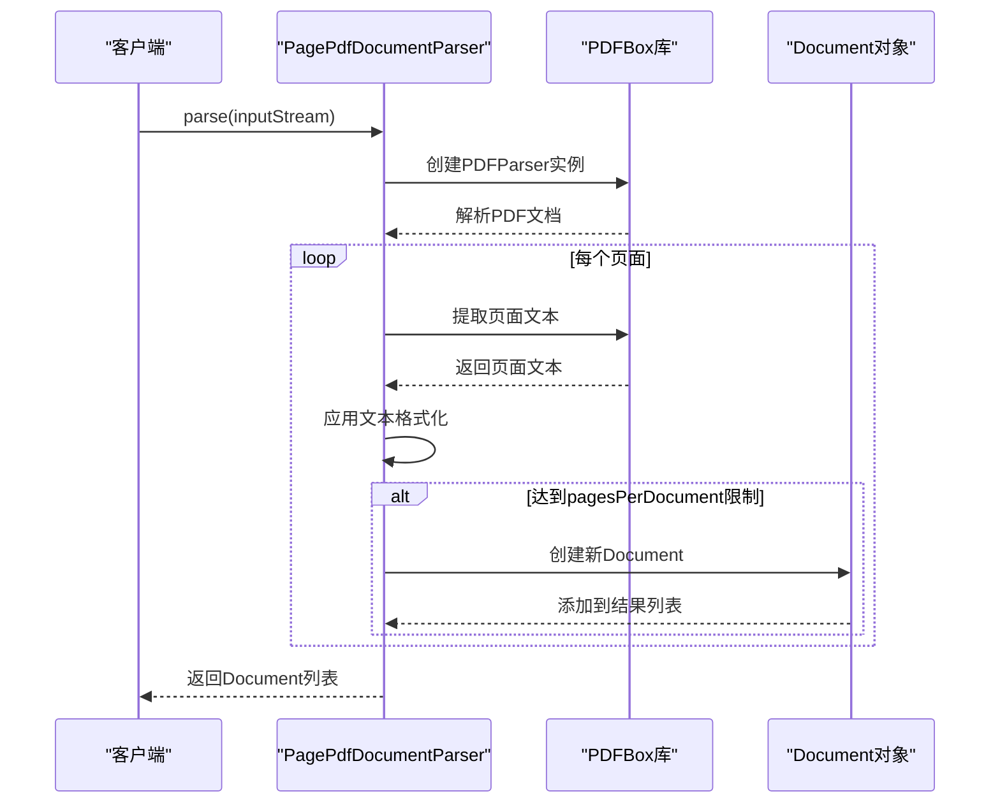
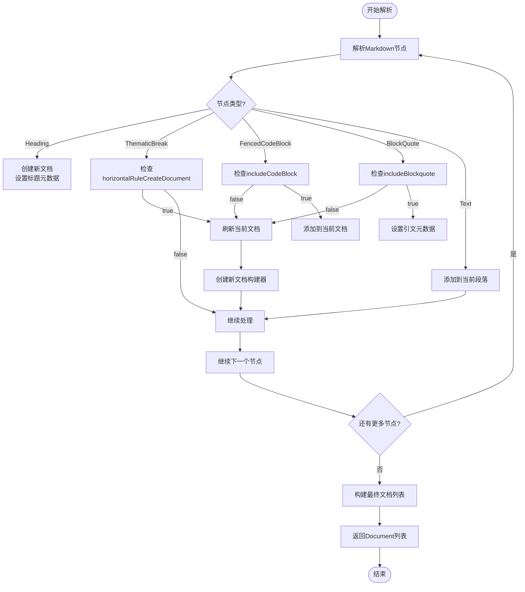
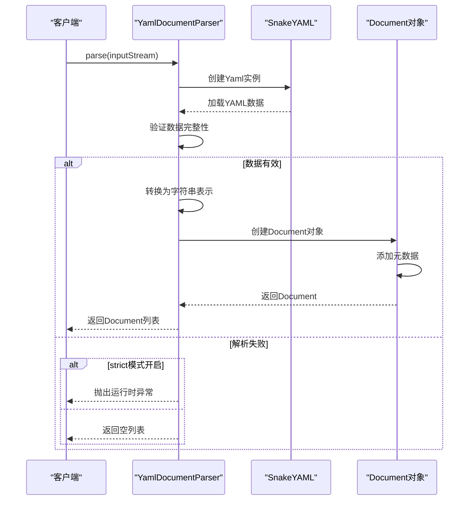
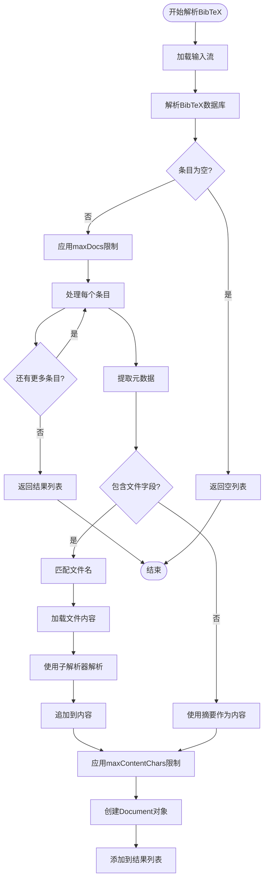
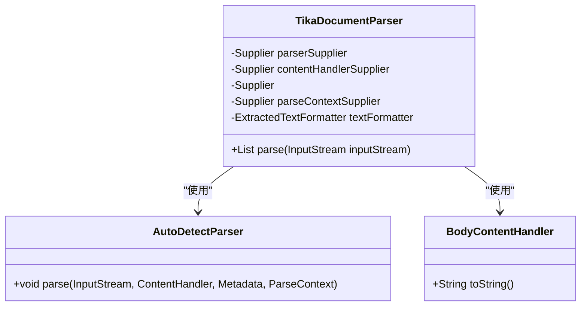
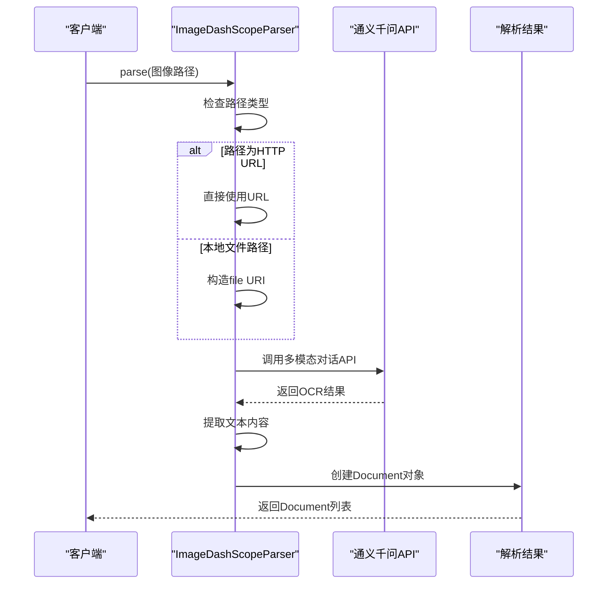
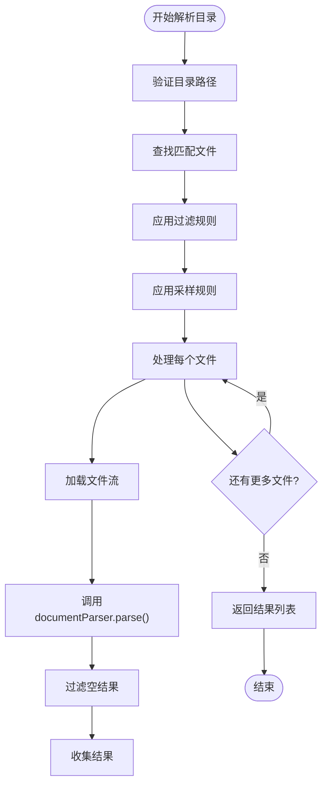

# 文档解析器

<cite>
**本文档引用的文件**
- [DocumentParser.java](file://spring-ai-alibaba-core/src/main/java/com/alibaba/cloud/ai/document/DocumentParser.java)
- [PagePdfDocumentParser.java](file://community/document-parsers/spring-ai-alibaba-starter-document-parser-apache-pdfbox/src/main/java/com/alibaba/cloud/ai/parser/apache/pdfbox/PagePdfDocumentParser.java)
- [ParagraphPdfDocumentParser.java](file://community/document-parsers/spring-ai-alibaba-starter-document-parser-apache-pdfbox/src/main/java/com/alibaba/cloud/ai/parser/apache/pdfbox/ParagraphPdfDocumentParser.java)
- [TikaDocumentParser.java](file://community/document-parsers/spring-ai-alibaba-starter-document-parser-tika/src/main/java/com/alibaba/cloud/ai/parser/tika/TikaDocumentParser.java)
- [MarkdownDocumentParser.java](file://community/document-parsers/spring-ai-alibaba-starter-document-parser-markdown/src/main/java/com/alibaba/cloud/ai/parser/markdown/MarkdownDocumentParser.java)
- [BibtexDocumentParser.java](file://community/document-parsers/spring-ai-alibaba-starter-document-parser-bibtex/src/main/java/com/alibaba/cloud/ai/parser/bibtex/BibtexDocumentParser.java)
- [YamlDocumentParser.java](file://community/document-parsers/spring-ai-alibaba-starter-document-parser-yaml/src/main/java/com/alibaba/cloud/ai/parser/yaml/YamlDocumentParser.java)
- [ImageDashScopeParser.java](file://community/document-parsers/spring-ai-alibaba-starter-document-parser-multi-modality/src/main/java/com/alibaba/cloud/ai/parser/multi/ImageDashScopeParser.java)
- [BsHtmlDocumentParser.java](file://community/document-parsers/spring-ai-alibaba-starter-document-parser-bshtml/src/main/java/com/alibaba/cloud/ai/parser/bshtml/BsHtmlDocumentParser.java)
- [DocumentDirectoryParser.java](file://community/document-parsers/spring-ai-alibaba-starter-document-parser-directory/src/main/java/com/alibaba/cloud/ai/parser/directory/DocumentDirectoryParser.java)
</cite>

## 目录
1. [简介](#简介)
2. [核心架构与设计](#核心架构与设计)
3. [PDF文档解析器](#pdf文档解析器)
4. [Markdown文档解析器](#markdown文档解析器)
5. [HTML文档解析器](#html文档解析器)
6. [YAML文档解析器](#yaml文档解析器)
7. [BibTeX文档解析器](#bibtex文档解析器)
8. [Apache Tika通用解析器](#apache-tika通用解析器)
9. [多模态文档解析器](#多模态文档解析器)
10. [目录文档解析器](#目录文档解析器)
11. [错误处理机制](#错误处理机制)
12. [文本分块策略](#文本分块策略)
13. [元数据保留机制](#元数据保留机制)
14. [性能特征](#性能特征)
15. [使用示例](#使用示例)

## 简介

本文档详细解析了Spring AI Alibaba项目中支持的各种文档格式解析功能。该框架提供了一套完整的文档解析解决方案，支持多种格式包括PDF、Markdown、HTML、YAML、BibTeX等，并集成了Apache PDFBox、Tika等底层技术。每种解析器都遵循统一的`DocumentParser`接口，实现了从输入流到`Document`对象的转换过程。特别地，多模态解析器如`ImageDashScopeParser`结合了视觉模型进行内容提取，为AI应用提供了强大的文档处理能力。

**Section sources**
- [DocumentParser.java](file://spring-ai-alibaba-core/src/main/java/com/alibaba/cloud/ai/document/DocumentParser.java)

## 核心架构与设计

文档解析系统的核心是`DocumentParser`接口，它定义了所有解析器必须实现的`parse(InputStream)`方法。该接口的设计遵循单一职责原则，专注于将输入流转换为`Document`对象列表。每个具体的解析器实现都针对特定的文件格式进行了优化，同时保持了统一的API接口。

```mermaid
classDiagram
class DocumentParser {
<<interface>>
+List<Document> parse(InputStream inputStream)
}
class PagePdfDocumentParser {
-PdfDocumentReaderConfig config
+List<Document> parse(InputStream inputStream)
}
class ParagraphPdfDocumentParser {
-PdfDocumentReaderConfig config
+List<Document> parse(InputStream inputStream)
}
class TikaDocumentParser {
-Supplier<Parser> parserSupplier
-Supplier<ContentHandler> contentHandlerSupplier
-ExtractedTextFormatter textFormatter
+List<Document> parse(InputStream inputStream)
}
class MarkdownDocumentParser {
-MarkdownDocumentParserConfig config
-Parser parser
+List<Document> parse(InputStream inputStream)
}
class BibtexDocumentParser {
-String charsetName
-Integer maxContentChars
-Integer maxDocs
-Pattern filePattern
-DocumentParser parser
+List<Document> parse(InputStream inputStream)
}
class YamlDocumentParser {
-boolean strict
-Class<? extends Object> beanClass
+List<Document> parse(InputStream inputStream)
}
class ImageDashScopeParser {
-String model
-String maxPixels
-String minPixels
-String apiKey
+List<Document> parse(String path)
+List<Document> parse(InputStream inputStream)
}
class BsHtmlDocumentParser {
+List<Document> parse(InputStream inputStream)
}
class DocumentDirectoryParser {
-String path
-List<String> globPatterns
-List<String> excludePatterns
-boolean loadHidden
-DocumentParser documentParser
-boolean recursive
+List<Document> parse()
}
DocumentParser <|-- PagePdfDocumentParser
DocumentParser <|-- ParagraphPdfDocumentParser
DocumentParser <|-- TikaDocumentParser
DocumentParser <|-- MarkdownDocumentParser
DocumentParser <|-- BibtexDocumentParser
DocumentParser <|-- YamlDocumentParser
DocumentParser <|-- BsHtmlDocumentParser
DocumentParser <|-- ImageDashScopeParser
```



**Diagram sources**
- [DocumentParser.java](file://spring-ai-alibaba-core/src/main/java/com/alibaba/cloud/ai/document/DocumentParser.java)
- [PagePdfDocumentParser.java](file://community/document-parsers/spring-ai-alibaba-starter-document-parser-apache-pdfbox/src/main/java/com/alibaba/cloud/ai/parser/apache/pdfbox/PagePdfDocumentParser.java)
- [ParagraphPdfDocumentParser.java](file://community/document-parsers/spring-ai-alibaba-starter-document-parser-apache-pdfbox/src/main/java/com/alibaba/cloud/ai/parser/apache/pdfbox/ParagraphPdfDocumentParser.java)
- [TikaDocumentParser.java](file://community/document-parsers/spring-ai-alibaba-starter-document-parser-tika/src/main/java/com/alibaba/cloud/ai/parser/tika/TikaDocumentParser.java)
- [MarkdownDocumentParser.java](file://community/document-parsers/spring-ai-alibaba-starter-document-parser-markdown/src/main/java/com/alibaba/cloud/ai/parser/markdown/MarkdownDocumentParser.java)
- [BibtexDocumentParser.java](file://community/document-parsers/spring-ai-alibaba-starter-document-parser-bibtex/src/main/java/com/alibaba/cloud/ai/parser/bibtex/BibtexDocumentParser.java)
- [YamlDocumentParser.java](file://community/document-parsers/spring-ai-alibaba-starter-document-parser-yaml/src/main/java/com/alibaba/cloud/ai/parser/yaml/YamlDocumentParser.java)
- [ImageDashScopeParser.java](file://community/document-parsers/spring-ai-alibaba-starter-document-parser-multi-modality/src/main/java/com/alibaba/cloud/ai/parser/multi/ImageDashScopeParser.java)
- [BsHtmlDocumentParser.java](file://community/document-parsers/spring-ai-alibaba-starter-document-parser-bshtml/src/main/java/com/alibaba/cloud/ai/parser/bshtml/BsHtmlDocumentParser.java)
- [DocumentDirectoryParser.java](file://community/document-parsers/spring-ai-alibaba-starter-document-parser-directory/src/main/java/com/alibaba/cloud/ai/parser/directory/DocumentDirectoryParser.java)

**Section sources**
- [DocumentParser.java](file://spring-ai-alibaba-core/src/main/java/com/alibaba/cloud/ai/document/DocumentParser.java)

## PDF文档解析器

### Apache PDFBox解析器

Spring AI Alibaba提供了两种基于Apache PDFBox的PDF解析器：`PagePdfDocumentParser`和`ParagraphPdfDocumentParser`。这两种解析器分别适用于不同的使用场景。

`PagePdfDocumentParser`将PDF文档按页面进行分割，每个页面或一组页面生成一个独立的`Document`对象。它通过`PdfDocumentReaderConfig`配置类提供了丰富的自定义选项：

- `pagesPerDocument`: 控制每个输出文档包含的页数
- `pageTopMargin` 和 `pageBottomMargin`: 设置页面顶部和底部的边距
- `pageExtractedTextFormatter`: 用于格式化提取的文本内容



**Diagram sources**
- [PagePdfDocumentParser.java](file://community/document-parsers/spring-ai-alibaba-starter-document-parser-apache-pdfbox/src/main/java/com/alibaba/cloud/ai/parser/apache/pdfbox/PagePdfDocumentParser.java)

`ParagraphPdfDocumentParser`则利用PDF的目录信息（TOC）将文档分割成段落，每个段落生成一个`Document`对象。这种解析方式更适合需要保持语义完整性的应用场景。

**Section sources**
- [PagePdfDocumentParser.java](file://community/document-parsers/spring-ai-alibaba-starter-document-parser-apache-pdfbox/src/main/java/com/alibaba/cloud/ai/parser/apache/pdfbox/PagePdfDocumentParser.java)
- [ParagraphPdfDocumentParser.java](file://community/document-parsers/spring-ai-alibaba-starter-document-parser-apache-pdfbox/src/main/java/com/alibaba/cloud/ai/parser/apache/pdfbox/ParagraphPdfDocumentParser.java)

### PDF表格解析器

除了文本内容，系统还提供了专门的`PdfTablesParser`来处理PDF中的表格数据。这个解析器能够识别并提取PDF文档中的表格结构，将其转换为结构化的数据格式，便于后续的数据分析和处理。

## Markdown文档解析器

`MarkdownDocumentParser`使用CommonMark Java库来解析Markdown文档。它不仅能够提取纯文本内容，还能根据文档结构创建多个`Document`对象，每个对象对应于文档中的一个逻辑部分。

该解析器的关键特性包括：

- **标题处理**: 将每个标题及其后续内容作为一个独立的文档
- **代码块处理**: 可选择是否将代码块作为独立文档
- **水平线处理**: 可配置是否在遇到水平线时创建新的文档
- **引文块处理**: 支持对引文块的特殊处理



**Diagram sources**
- [MarkdownDocumentParser.java](file://community/document-parsers/spring-ai-alibaba-starter-document-parser-markdown/src/main/java/com/alibaba/cloud/ai/parser/markdown/MarkdownDocumentParser.java)

**Section sources**
- [MarkdownDocumentParser.java](file://community/document-parsers/spring-ai-alibaba-starter-document-parser-markdown/src/main/java/com/alibaba/cloud/ai/parser/markdown/MarkdownDocumentParser.java)

## HTML文档解析器

`BsHtmlDocumentParser`使用Jsoup库来解析HTML文档。它能够处理各种HTML格式，包括标准HTML、XHTML和XML文档。该解析器的主要特点包括：

- 自动处理不同编码格式
- 支持复杂的HTML结构解析
- 能够提取页面中的文本内容，同时保留基本的结构信息
- 处理HTML实体和特殊字符

**Section sources**
- [BsHtmlDocumentParser.java](file://community/document-parsers/spring-ai-alibaba-starter-document-parser-bshtml/src/main/java/com/alibaba/cloud/ai/parser/bshtml/BsHtmlDocumentParser.java)

## YAML文档解析器

`YamlDocumentParser`使用SnakeYAML库来解析YAML文档。它提供了灵活的配置选项，可以适应不同的使用需求。

主要配置参数：
- `strict`: 是否启用严格模式，决定在解析错误时是抛出异常还是返回空列表
- `beanClass`: 可选的Java类，用于将YAML数据映射到特定的Java对象

该解析器能够处理复杂的YAML结构，包括嵌套的对象和数组，并将它们转换为字符串表示形式，同时保留原始数据作为元数据。



**Diagram sources**
- [YamlDocumentParser.java](file://community/document-parsers/spring-ai-alibaba-starter-document-parser-yaml/src/main/java/com/alibaba/cloud/ai/parser/yaml/YamlDocumentParser.java)

**Section sources**
- [YamlDocumentParser.java](file://community/document-parsers/spring-ai-alibaba-starter-document-parser-yaml/src/main/java/com/alibaba/cloud/ai/parser/yaml/YamlDocumentParser.java)

## BibTeX文档解析器

`BibtexDocumentParser`专门用于解析BibTeX格式的参考文献文件。它的设计非常独特，不仅能够解析BibTeX条目，还能根据条目中的文件引用自动加载相关文档的内容。

关键特性：
- 支持自定义字符编码
- 可限制最大内容字符数和文档数量
- 支持正则表达式模式匹配文件名
- 能够集成其他解析器来处理引用的文件



**Diagram sources**
- [BibtexDocumentParser.java](file://community/document-parsers/spring-ai-alibaba-starter-document-parser-bibtex/src/main/java/com/alibaba/cloud/ai/parser/bibtex/BibtexDocumentParser.java)

**Section sources**
- [BibtexDocumentParser.java](file://community/document-parsers/spring-ai-alibaba-starter-document-parser-bibtex/src/main/java/com/alibaba/cloud/ai/parser/bibtex/BibtexDocumentParser.java)

## Apache Tika通用解析器

`TikaDocumentParser`是基于Apache Tika库的通用文档解析器，能够自动检测并解析多种文件格式。它是系统中最灵活的解析器之一，支持包括PDF、DOC、PPT、XLS在内的多种格式。

设计特点：
- 使用`AutoDetectParser`自动识别文件格式
- 可自定义Tika组件（Parser、ContentHandler、Metadata、ParseContext）
- 支持文本格式化处理器
- 提供默认的组件供应商



**Diagram sources**
- [TikaDocumentParser.java](file://community/document-parsers/spring-ai-alibaba-starter-document-parser-tika/src/main/java/com/alibaba/cloud/ai/parser/tika/TikaDocumentParser.java)

**Section sources**
- [TikaDocumentParser.java](file://community/document-parsers/spring-ai-alibaba-starter-document-parser-tika/src/main/java/com/alibaba/cloud/ai/parser/tika/TikaDocumentParser.java)

## 多模态文档解析器

### 图像解析器

`ImageDashScopeParser`是一个特殊的多模态解析器，它结合了通义千问视觉模型来解析图像中的文本内容。与其他解析器不同，它主要通过文件路径而不是输入流进行操作。

工作流程：
1. 接收图像文件路径或URL
2. 根据操作系统类型构造适当的文件URI
3. 调用通义千问多模态对话API
4. 提取图像中的所有文本内容



**Diagram sources**
- [ImageDashScopeParser.java](file://community/document-parsers/spring-ai-alibaba-starter-document-parser-multi-modality/src/main/java/com/alibaba/cloud/ai/parser/multi/ImageDashScopeParser.java)

**Section sources**
- [ImageDashScopeParser.java](file://community/document-parsers/spring-ai-alibaba-starter-document-parser-multi-modality/src/main/java/com/alibaba/cloud/ai/parser/multi/ImageDashScopeParser.java)

## 目录文档解析器

`DocumentDirectoryParser`提供了一种批量处理文件的能力。它可以扫描指定目录下的文件，应用glob模式过滤，并使用指定的解析器处理每个匹配的文件。

主要功能特性：
- 支持递归扫描子目录
- 支持glob模式匹配文件
- 可排除特定模式的文件
- 支持加载隐藏文件
- 可对文件进行采样处理



**Diagram sources**
- [DocumentDirectoryParser.java](file://community/document-parsers/spring-ai-alibaba-starter-document-parser-directory/src/main/java/com/alibaba/cloud/ai/parser/directory/DocumentDirectoryParser.java)

**Section sources**
- [DocumentDirectoryParser.java](file://community/document-parsers/spring-ai-alibaba-starter-document-parser-directory/src/main/java/com/alibaba/cloud/ai/parser/directory/DocumentDirectoryParser.java)

## 错误处理机制

文档解析系统采用了统一的错误处理策略，确保在解析过程中出现异常时能够提供有意义的反馈。

主要错误处理方式：
- **运行时异常包装**: 所有解析异常都被包装为`RuntimeException`，简化了调用方的异常处理
- **日志记录**: 关键操作和错误都会被记录到日志中，便于调试和监控
- **静默失败选项**: 某些解析器（如YAML解析器）提供严格模式开关，允许在非严格模式下静默处理错误
- **资源清理**: 使用try-with-resources语句确保输入流被正确关闭

对于BibTeX解析器中的文件加载错误，系统采用警告日志而非中断整个解析过程，体现了容错性设计。

## 文本分块策略

不同的解析器采用了不同的文本分块策略，以适应各种文档结构和使用场景：

- **PagePdfDocumentParser**: 基于页面的分块，可配置每文档包含的页数
- **ParagraphPdfDocumentParser**: 基于PDF目录结构的分块
- **MarkdownDocumentParser**: 基于标题和水平线的分块
- **TikaDocumentParser**: 整个文档作为一个块（除非后续处理）

这些分块策略的选择直接影响了后续的向量化和检索效果，开发者应根据具体的应用需求选择合适的解析器和配置。

## 元数据保留机制

所有解析器都充分利用了`Document`对象的元数据功能，保留了与源文档相关的各种信息：

- **PDF解析器**: 保留页码范围、标题、层级等信息
- **Markdown解析器**: 保留标题级别、代码块语言等信息
- **YAML解析器**: 保留原始数据结构
- **BibTeX解析器**: 保留完整的参考文献元数据
- **通用解析器**: 在适当情况下保留格式类型等基本信息

这些元数据不仅有助于理解文档的来源和结构，还可以在后续的检索和排序过程中发挥重要作用。

## 性能特征

各解析器的性能特征如下：

- **内存效率**: 大多数解析器采用流式处理，避免将整个文件加载到内存中
- **处理速度**: 简单格式（如纯文本）的解析速度最快，复杂格式（如带表格的PDF）较慢
- **并发安全**: 解析器实例通常是无状态的，可以在多线程环境中安全使用
- **资源管理**: 正确管理输入流的生命周期，避免资源泄漏

对于大规模文档处理，建议使用`DocumentDirectoryParser`的采样功能或结合外部任务队列进行分布式处理。

## 使用示例

以下是一些典型的使用示例：

```java
// 解析单个PDF文件，每两页作为一个文档
PdfDocumentReaderConfig config = PdfDocumentReaderConfig.builder()
    .withPagesPerDocument(2)
    .withPageTopMargin(10)
    .build();
DocumentParser pdfParser = new PagePdfDocumentParser(config);
List<Document> pdfDocs = pdfParser.parse(inputStream);

// 解析Markdown文件，遇到水平线时创建新文档
MarkdownDocumentParserConfig mdConfig = MarkdownDocumentParserConfig.builder()
    .withHorizontalRuleCreateDocument(true)
    .build();
DocumentParser mdParser = new MarkdownDocumentParser(mdConfig);
List<Document> mdDocs = mdParser.parse(inputStream);

// 批量处理目录中的所有文本文件
DocumentDirectoryParser dirParser = new DocumentDirectoryParser.Builder("/path/to/docs")
    .documentParser(new TextDocumentParser())
    .glob("*.txt")
    .recursive(true)
    .build();
List<Document> dirDocs = dirParser.parse();

// 使用通义千问解析图像中的文本
DocumentParser imageParser = new ImageDashScopeParser("your-api-key");
List<Document> imageDocs = imageParser.parse("/path/to/image.jpg");
```

这些示例展示了如何根据不同的需求配置和使用各种解析器，为AI应用提供多样化的文档处理能力。