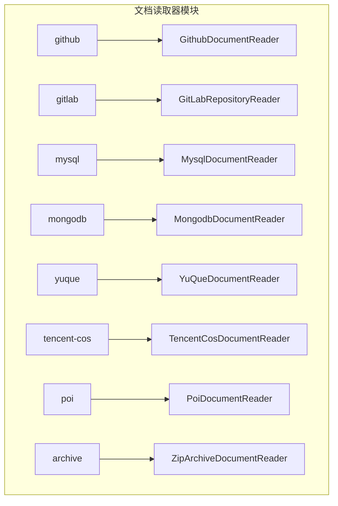
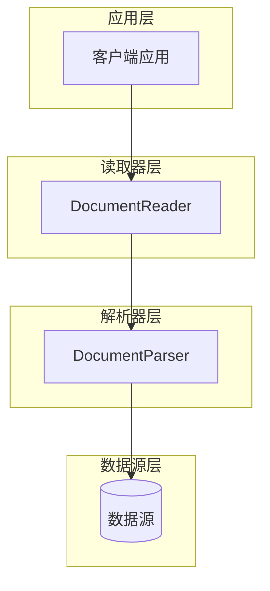
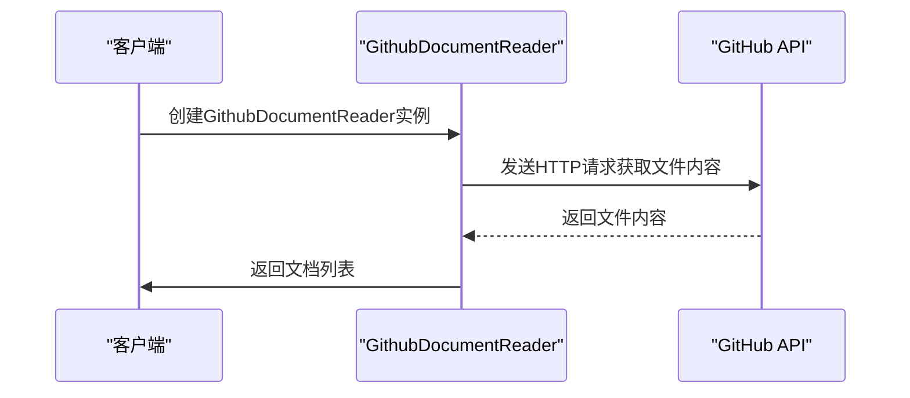
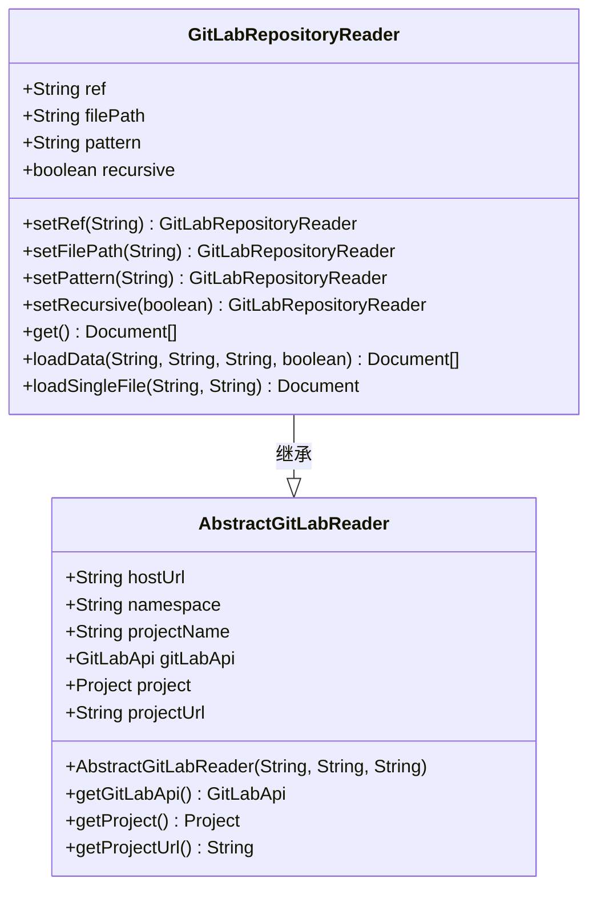
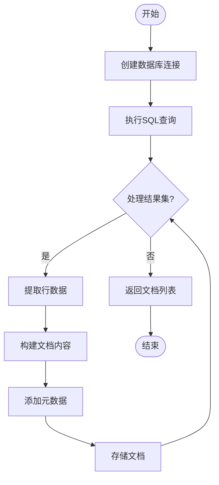
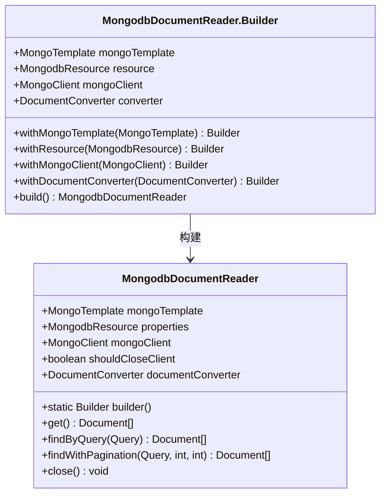
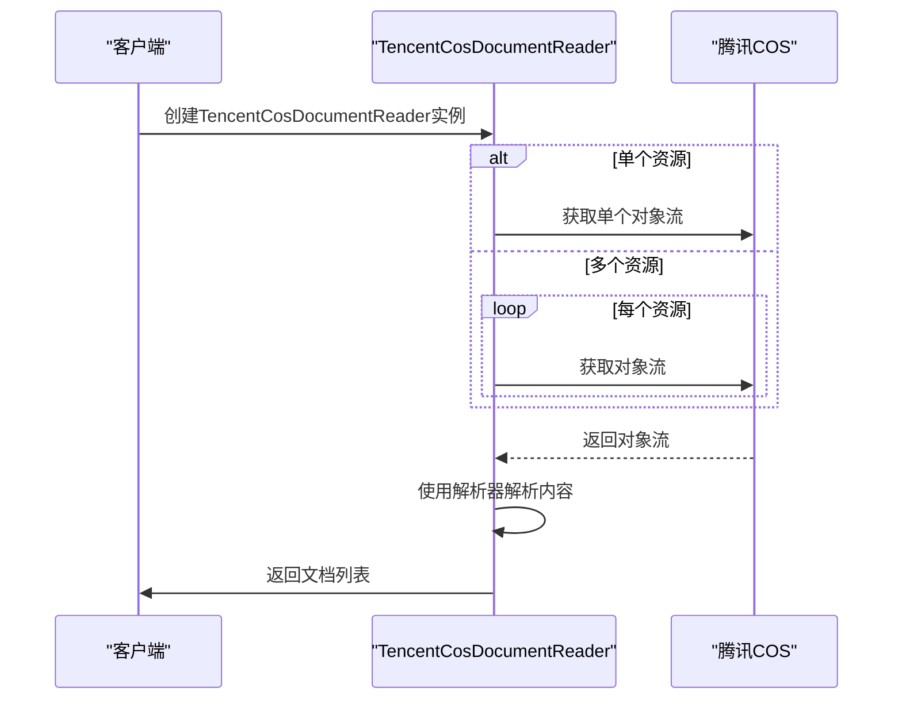
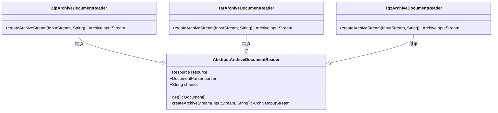
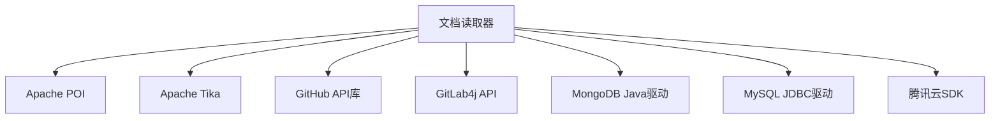

# 文档读取器

<cite>
**本文档中引用的文件**
- [PoiDocumentReader.java](file://community/document-readers/spring-ai-alibaba-starter-document-reader-poi/src/main/java/com/alibaba/cloud/ai/reader/poi/PoiDocumentReader.java)
- [AbstractArchiveDocumentReader.java](file://community/document-readers/spring-ai-alibaba-starter-document-reader-archive/src/main/java/com/alibaba/cloud/ai/reader/archive/AbstractArchiveDocumentReader.java)
- [ZipArchiveDocumentReader.java](file://community/document-readers/spring-ai-alibaba-starter-document-reader-archive/src/main/java/com/alibaba/cloud/ai/reader/archive/ZipArchiveDocumentReader.java)
- [GithubDocumentReader.java](file://community/document-readers/spring-ai-alibaba-starter-document-reader-github/src/main/java/com/alibaba/cloud/ai/reader/github/GithubDocumentReader.java)
- [GitLabRepositoryReader.java](file://community/document-readers/spring-ai-alibaba-starter-document-reader-gitlab/src/main/java/com/alibaba/cloud/ai/reader/gitlab/GitLabRepositoryReader.java)
- [MysqlDocumentReader.java](file://community/document-readers/spring-ai-alibaba-starter-document-reader-mysql/src/main/java/com/alibaba/cloud/ai/reader/mysql/MysqlDocumentReader.java)
- [MongodbDocumentReader.java](file://community/document-readers/spring-ai-alibaba-starter-document-reader-mongodb/src/main/java/com/alibaba/cloud/ai/reader/mongodb/MongodbDocumentReader.java)
- [YuqueDocumentReader.java](file://community/document-readers/spring-ai-alibaba-starter-document-reader-yuque/src/main/java/com/alibaba/cloud/ai/reader/yuque/YuQueDocumentReader.java)
- [TencentCosDocumentReader.java](file://community/document-readers/spring-ai-alibaba-starter-document-reader-tencent-cos/src/main/java/com/alibaba/cloud/ai/reader/tencent/cos/TencentCosDocumentReader.java)
- [TikaDocumentParser.java](file://community/document-parsers/spring-ai-alibaba-starter-document-parser-tika/src/main/java/com/alibaba/cloud/ai/parser/tika/TikaDocumentParser.java)
- [ParagraphPdfDocumentParser.java](file://community/document-parsers/spring-ai-alibaba-starter-document-parser-apache-pdfbox/src/main/java/com/alibaba/cloud/ai/parser/apache/pdfbox/ParagraphPdfDocumentParser.java)
</cite>

## 目录
1. [简介](#简介)
2. [项目结构](#项目结构)
3. [核心组件](#核心组件)
4. [架构概述](#架构概述)
5. [详细组件分析](#详细组件分析)
6. [依赖分析](#依赖分析)
7. [性能考虑](#性能考虑)
8. [故障排除指南](#故障排除指南)
9. [结论](#结论)

## 简介
文档读取器是Spring AI Alibaba框架中的关键组件，负责从各种数据源读取内容并将其转换为AI系统可处理的文档格式。本技术文档深入探讨了框架支持的各种数据源读取功能，包括GitHub、GitLab、数据库（MySQL、MongoDB）、云存储（语雀、腾讯COS）等。对于每种读取器，我们将阐述其认证机制、API调用模式、增量同步策略和异常处理，并提供实际代码示例展示如何配置和使用这些读取器。

## 项目结构
文档读取器模块位于`community/document-readers`目录下，采用模块化设计，每个数据源都有独立的模块。这种设计使得系统具有良好的扩展性和维护性。

**图示来源**
- [GithubDocumentReader.java](file://community/document-readers/spring-ai-alibaba-starter-document-reader-github/src/main/java/com/alibaba/cloud/ai/reader/github/GithubDocumentReader.java)
- [GitLabRepositoryReader.java](file://community/document-readers/spring-ai-alibaba-starter-document-reader-gitlab/src/main/java/com/alibaba/cloud/ai/reader/gitlab/GitLabRepositoryReader.java)
- [MysqlDocumentReader.java](file://community/document-readers/spring-ai-alibaba-starter-document-reader-mysql/src/main/java/com/alibaba/cloud/ai/reader/mysql/MysqlDocumentReader.java)
- [MongodbDocumentReader.java](file://community/document-readers/spring-ai-alibaba-starter-document-reader-mongodb/src/main/java/com/alibaba/cloud/ai/reader/mongodb/MongodbDocumentReader.java)
- [YuqueDocumentReader.java](file://community/document-readers/spring-ai-alibaba-starter-document-reader-yuque/src/main/java/com/alibaba/cloud/ai/reader/yuque/YuQueDocumentReader.java)
- [TencentCosDocumentReader.java](file://community/document-readers/spring-ai-alibaba-starter-document-reader-tencent-cos/src/main/java/com/alibaba/cloud/ai/reader/tencent/cos/TencentCosDocumentReader.java)
- [PoiDocumentReader.java](file://community/document-readers/spring-ai-alibaba-starter-document-reader-poi/src/main/java/com/alibaba/cloud/ai/reader/poi/PoiDocumentReader.java)
- [ZipArchiveDocumentReader.java](file://community/document-readers/spring-ai-alibaba-starter-document-reader-archive/src/main/java/com/alibaba/cloud/ai/reader/archive/ZipArchiveDocumentReader.java)

**章节来源**
- [community/document-readers](file://community/document-readers)

## 核心组件
文档读取器的核心组件包括各种特定于数据源的读取器实现，它们都实现了统一的`DocumentReader`接口。这些读取器负责与各自的数据源进行交互，获取原始数据，并通过文档解析器将其转换为标准的文档格式。

**章节来源**
- [PoiDocumentReader.java](file://community/document-readers/spring-ai-alibaba-starter-document-reader-poi/src/main/java/com/alibaba/cloud/ai/reader/poi/PoiDocumentReader.java)
- [AbstractArchiveDocumentReader.java](file://community/document-readers/spring-ai-alibaba-starter-document-reader-archive/src/main/java/com/alibaba/cloud/ai/reader/archive/AbstractArchiveDocumentReader.java)

## 架构概述
文档读取器的架构遵循分层设计原则，分为资源层、读取器层和解析器层。资源层负责封装数据源的连接信息，读取器层负责与数据源进行交互，解析器层负责将原始数据转换为文档。

**图示来源**
- [PoiDocumentReader.java](file://community/document-readers/spring-ai-alibaba-starter-document-reader-poi/src/main/java/com/alibaba/cloud/ai/reader/poi/PoiDocumentReader.java)
- [TikaDocumentParser.java](file://community/document-parsers/spring-ai-alibaba-starter-document-parser-tika/src/main/java/com/alibaba/cloud/ai/parser/tika/TikaDocumentParser.java)

## 详细组件分析

### GitHub读取器分析
GitHub文档读取器允许从GitHub仓库读取文件内容。它使用GitHub API来访问仓库中的文件，并将文件内容转换为文档对象。

#### 认证机制
GitHub读取器支持两种认证方式：匿名访问和令牌认证。对于公共仓库，可以使用匿名访问；对于私有仓库，则需要提供个人访问令牌。

**图示来源**
- [GithubDocumentReader.java](file://community/document-readers/spring-ai-alibaba-starter-document-reader-github/src/main/java/com/alibaba/cloud/ai/reader/github/GithubDocumentReader.java)

**章节来源**
- [GithubDocumentReader.java](file://community/document-readers/spring-ai-alibaba-starter-document-reader-github/src/main/java/com/alibaba/cloud/ai/reader/github/GithubDocumentReader.java)

### GitLab读取器分析
GitLab文档读取器提供了从GitLab仓库读取文件的功能。它基于`AbstractGitLabReader`抽象类构建，支持读取单个文件或根据模式递归读取多个文件。

#### 增量同步策略
GitLab读取器通过指定分支、标签或提交ID来实现增量同步。用户可以通过设置`ref`参数来指定要读取的版本。

**图示来源**
- [GitLabRepositoryReader.java](file://community/document-readers/spring-ai-alibaba-starter-document-reader-gitlab/src/main/java/com/alibaba/cloud/ai/reader/gitlab/GitLabRepositoryReader.java)
- [AbstractGitLabReader.java](file://community/document-readers/spring-ai-alibaba-starter-document-reader-gitlab/src/main/java/com/alibaba/cloud/ai/reader/gitlab/AbstractGitLabReader.java)

**章节来源**
- [GitLabRepositoryReader.java](file://community/document-readers/spring-ai-alibaba-starter-document-reader-gitlab/src/main/java/com/alibaba/cloud/ai/reader/gitlab/GitLabRepositoryReader.java)

### 数据库读取器分析

#### MySQL读取器
MySQL文档读取器使用JDBC连接到MySQL数据库，执行SQL查询并将结果转换为文档。它通过`MySQLResource`对象配置数据库连接信息和查询语句。

**图示来源**
- [MysqlDocumentReader.java](file://community/document-readers/spring-ai-alibaba-starter-document-reader-mysql/src/main/java/com/alibaba/cloud/ai/reader/mysql/MysqlDocumentReader.java)

**章节来源**
- [MysqlDocumentReader.java](file://community/document-readers/spring-ai-alibaba-starter-document-reader-mysql/src/main/java/com/alibaba/cloud/ai/reader/mysql/MysqlDocumentReader.java)

#### MongoDB读取器
MongoDB文档读取器提供了更丰富的功能，包括连接池管理、性能监控和灵活的查询能力。它使用Builder模式进行配置，支持通过`MongoTemplate`或直接`MongoClient`进行连接。

**图示来源**
- [MongodbDocumentReader.java](file://community/document-readers/spring-ai-alibaba-starter-document-reader-mongodb/src/main/java/com/alibaba/cloud/ai/reader/mongodb/MongodbDocumentReader.java)

**章节来源**
- [MongodbDocumentReader.java](file://community/document-readers/spring-ai-alibaba-starter-document-reader-mongodb/src/main/java/com/alibaba/cloud/ai/reader/mongodb/MongodbDocumentReader.java)

### 云存储读取器分析

#### 语雀读取器
语雀文档读取器用于从语雀知识库读取文档内容。它通过`YuQueResource`对象指定要读取的资源路径，并使用文档解析器将内容转换为标准格式。

**章节来源**
- [YuqueDocumentReader.java](file://community/document-readers/spring-ai-alibaba-starter-document-reader-yuque/src/main/java/com/alibaba/cloud/ai/reader/yuque/YuQueDocumentReader.java)

#### 腾讯COS读取器
腾讯COS文档读取器支持从腾讯云对象存储服务读取文件。它能够处理单个资源或资源列表，并在遇到错误时记录警告而不是中断整个读取过程。

**图示来源**
- [TencentCosDocumentReader.java](file://community/document-readers/spring-ai-alibaba-starter-document-reader-tencent-cos/src/main/java/com/alibaba/cloud/ai/reader/tencent/cos/TencentCosDocumentReader.java)

**章节来源**
- [TencentCosDocumentReader.java](file://community/document-readers/spring-ai-alibaba-starter-document-reader-tencent-cos/src/main/java/com/alibaba/cloud/ai/reader/tencent/cos/TencentCosDocumentReader.java)

### 文件格式读取器分析

#### POI读取器
POI文档读取器使用Apache POI库解析Microsoft Office文件，支持doc、docx、ppt、pptx、xls和xlsx等格式。它通过`ExtractorFactory`创建相应的文本提取器来读取文件内容。

**章节来源**
- [PoiDocumentReader.java](file://community/document-readers/spring-ai-alibaba-starter-document-reader-poi/src/main/java/com/alibaba/cloud/ai/reader/poi/PoiDocumentReader.java)

#### 归档文件读取器
归档文件读取器提供了对ZIP、TAR等压缩文件的支持。它采用抽象基类`AbstractArchiveDocumentReader`的设计，子类只需实现`createArchiveStream`方法即可支持新的归档格式。

**图示来源**
- [AbstractArchiveDocumentReader.java](file://community/document-readers/spring-ai-alibaba-starter-document-reader-archive/src/main/java/com/alibaba/cloud/ai/reader/archive/AbstractArchiveDocumentReader.java)
- [ZipArchiveDocumentReader.java](file://community/document-readers/spring-ai-alibaba-starter-document-reader-archive/src/main/java/com/alibaba/cloud/ai/reader/archive/ZipArchiveDocumentReader.java)

**章节来源**
- [AbstractArchiveDocumentReader.java](file://community/document-readers/spring-ai-alibaba-starter-document-reader-archive/src/main/java/com/alibaba/cloud/ai/reader/archive/AbstractArchiveDocumentReader.java)

## 依赖分析
文档读取器模块依赖于多个外部库来实现其功能。这些依赖关系确保了读取器能够与各种数据源进行有效交互。

**图示来源**
- [pom.xml files across the project]

**章节来源**
- [所有相关模块的pom.xml文件]

## 性能考虑
企业级数据源的连接池管理和性能优化是文档读取器的重要特性。特别是MongoDB读取器，它提供了详细的连接池配置选项，包括最大连接数、最小连接数、连接等待时间和连接生命周期等。

对于大规模数据读取场景，建议使用分页查询和增量同步策略来避免内存溢出和提高读取效率。同时，合理配置连接超时和读取超时参数可以防止长时间阻塞。

## 故障排除指南
当文档读取器出现问题时，可以按照以下步骤进行排查：

1. 检查数据源连接信息是否正确
2. 验证认证凭据的有效性
3. 查看日志输出以获取详细的错误信息
4. 确认网络连接是否正常
5. 检查目标资源是否存在且可访问

对于数据库读取器，还需要特别注意SQL语句的正确性和权限设置。

**章节来源**
- [所有文档读取器实现类]

## 结论
Spring AI Alibaba的文档读取器框架提供了一套完整且灵活的解决方案，用于从各种数据源读取内容。通过统一的接口设计和模块化的实现，该框架不仅支持多种流行的数据源，还为企业级应用提供了必要的性能优化和错误处理机制。开发者可以根据具体需求选择合适的读取器，并通过简单的配置快速集成到自己的应用中。