# 记忆存储

<cite>
**本文档引用的文件**
- [ChatMemoryAutoConfiguration.java](file://auto-configurations/spring-ai-alibaba-autoconfigure-memory/src/main/java/com/alibaba/cloud/ai/autoconfigure/memory/ChatMemoryAutoConfiguration.java)
- [RedisChatMemoryAutoConfiguration.java](file://auto-configurations/spring-ai-alibaba-autoconfigure-memory/src/main/java/com/alibaba/cloud/ai/autoconfigure/memory/redis/RedisChatMemoryAutoConfiguration.java)
- [RedisChatMemoryProperties.java](file://auto-configurations/spring-ai-alibaba-autoconfigure-memory/src/main/java/com/alibaba/cloud/ai/autoconfigure/memory/redis/RedisChatMemoryProperties.java)
- [JedisRedisChatMemoryConnectionAutoConfiguration.java](file://auto-configurations/spring-ai-alibaba-autoconfigure-memory/src/main/java/com/alibaba/cloud/ai/autoconfigure/memory/redis/JedisRedisChatMemoryConnectionAutoConfiguration.java)
- [MysqlChatMemoryAutoConfiguration.java](file://auto-configurations/spring-ai-alibaba-autoconfigure-memory/src/main/java/com/alibaba/cloud/ai/autoconfigure/memory/MysqlChatMemoryAutoConfiguration.java)
- [MongoDBChatMemoryAutoConfiguration.java](file://auto-configurations/spring-ai-alibaba-autoconfigure-memory/src/main/java/com/alibaba/cloud/ai/autoconfigure/memory/MongoDBChatMemoryAutoConfiguration.java)
- [MemcachedChatMemoryAutoConfiguration.java](file://auto-configurations/spring-ai-alibaba-autoconfigure-memory/src/main/java/com/alibaba/cloud/ai/autoconfigure/memory/MemcachedChatMemoryAutoConfiguration.java)
- [ElasticsearchChatMemoryAutoConfiguration.java](file://auto-configurations/spring-ai-alibaba-autoconfigure-memory/src/main/java/com/alibaba/cloud/ai/autoconfigure/memory/ElasticsearchChatMemoryAutoConfiguration.java)
- [TablestoreChatMemoryAutoConfiguration.java](file://auto-configurations/spring-ai-alibaba-autoconfigure-memory/src/main/java/com/alibaba/cloud/ai/autoconfigure/memory/TablestoreChatMemoryAutoConfiguration.java)
- [BaseRedisChatMemoryRepository.java](file://community/memories/spring-ai-alibaba-starter-memory-redis/src/main/java/com/alibaba/cloud/ai/memory/redis/BaseRedisChatMemoryRepository.java)
- [JdbcChatMemoryRepository.java](file://community/memories/spring-ai-alibaba-starter-memory-jdbc/src/main/java/com/alibaba/cloud/ai/memory/jdbc/JdbcChatMemoryRepository.java)
- [MongoDBChatMemoryRepository.java](file://community/memories/spring-ai-alibaba-starter-memory-mongodb/src/main/java/com/alibaba/cloud/ai/memory/mongodb/MongoDBChatMemoryRepository.java)
- [MemcachedChatMemoryRepository.java](file://community/memories/spring-ai-alibaba-starter-memory-memcached/src/main/java/com/alibaba/cloud/ai/memory/memcached/MemcachedChatMemoryRepository.java)
- [ElasticsearchChatMemoryRepository.java](file://community/memories/spring-ai-alibaba-starter-memory-elasticsearch/src/main/java/com/alibaba/cloud/ai/memory/elasticsearch/ElasticsearchChatMemoryRepository.java)
- [TablestoreChatMemoryRepository.java](file://community/memories/spring-ai-alibaba-starter-memory-tablestore/src/main/java/com/alibaba/cloud/ai/memory/tablestore/TablestoreChatMemoryRepository.java)
</cite>

## 目录
1. [引言](#引言)
2. [项目结构](#项目结构)
3. [核心组件](#核心组件)
4. [架构概述](#架构概述)
5. [详细组件分析](#详细组件分析)
6. [依赖分析](#依赖分析)
7. [性能考虑](#性能考虑)
8. [故障排除指南](#故障排除指南)
9. [结论](#结论)

## 引言
本文档全面覆盖Spring AI Alibaba框架支持的各种会话记忆持久化方案。深入分析Redis、JDBC（支持H2、MySQL、PostgreSQL等）、MongoDB、Memcached、Elasticsearch和Tablestore等多种存储后端的实现细节。对于每种存储方案，解释其数据模型设计、序列化机制、过期策略和性能特征。提供具体配置示例，展示如何在不同环境（开发、生产）中选择合适的记忆存储。特别关注Redis集群模式下的高可用性配置和JDBC存储的事务管理。讨论不同存储方案的适用场景、扩展性和数据安全考虑。

## 项目结构
Spring AI Alibaba的记忆存储功能主要分布在`auto-configurations`和`community/memories`两个目录下。`auto-configurations`目录包含各种存储后端的自动配置类，而`community/memories`目录包含具体的实现类。

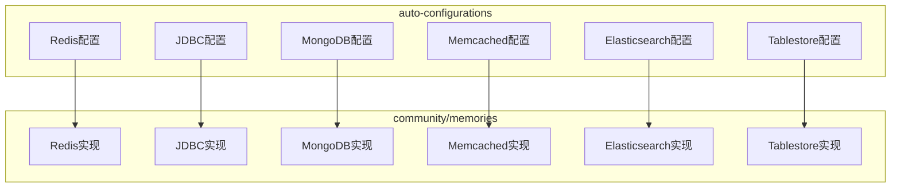

**图源**
- [RedisChatMemoryAutoConfiguration.java](file://auto-configurations/spring-ai-alibaba-autoconfigure-memory/src/main/java/com/alibaba/cloud/ai/autoconfigure/memory/redis/RedisChatMemoryAutoConfiguration.java)
- [MysqlChatMemoryAutoConfiguration.java](file://auto-configurations/spring-ai-alibaba-autoconfigure-memory/src/main/java/com/alibaba/cloud/ai/autoconfigure/memory/MysqlChatMemoryAutoConfiguration.java)
- [MongoDBChatMemoryAutoConfiguration.java](file://auto-configurations/spring-ai-alibaba-autoconfigure-memory/src/main/java/com/alibaba/cloud/ai/autoconfigure/memory/MongoDBChatMemoryAutoConfiguration.java)
- [MemcachedChatMemoryAutoConfiguration.java](file://auto-configurations/spring-ai-alibaba-autoconfigure-memory/src/main/java/com/alibaba/cloud/ai/autoconfigure/memory/MemcachedChatMemoryAutoConfiguration.java)
- [ElasticsearchChatMemoryAutoConfiguration.java](file://auto-configurations/spring-ai-alibaba-autoconfigure-memory/src/main/java/com/alibaba/cloud/ai/autoconfigure/memory/ElasticsearchChatMemoryAutoConfiguration.java)
- [TablestoreChatMemoryAutoConfiguration.java](file://auto-configurations/spring-ai-alibaba-autoconfigure-memory/src/main/java/com/alibaba/cloud/ai/autoconfigure/memory/TablestoreChatMemoryAutoConfiguration.java)

**节源**
- [auto-configurations](file://auto-configurations)
- [community/memories](file://community/memories)

## 核心组件
记忆存储的核心组件包括自动配置类和具体的存储实现类。自动配置类负责根据应用配置创建相应的存储实例，而存储实现类则负责实际的数据存取操作。

**节源**
- [ChatMemoryAutoConfiguration.java](file://auto-configurations/spring-ai-alibaba-autoconfigure-memory/src/main/java/com/alibaba/cloud/ai/autoconfigure/memory/ChatMemoryAutoConfiguration.java)
- [BaseRedisChatMemoryRepository.java](file://community/memories/spring-ai-alibaba-starter-memory-redis/src/main/java/com/alibaba/cloud/ai/memory/redis/BaseRedisChatMemoryRepository.java)
- [JdbcChatMemoryRepository.java](file://community/memories/spring-ai-alibaba-starter-memory-jdbc/src/main/java/com/alibaba/cloud/ai/memory/jdbc/JdbcChatMemoryRepository.java)

## 架构概述
Spring AI Alibaba的记忆存储架构采用模块化设计，每个存储后端都有独立的自动配置和实现模块。这种设计使得可以轻松地添加新的存储后端或替换现有的存储后端。

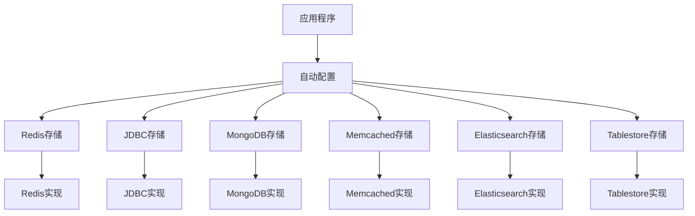

**图源**
- [ChatMemoryAutoConfiguration.java](file://auto-configurations/spring-ai-alibaba-autoconfigure-memory/src/main/java/com/alibaba/cloud/ai/autoconfigure/memory/ChatMemoryAutoConfiguration.java)
- [RedisChatMemoryAutoConfiguration.java](file://auto-configurations/spring-ai-alibaba-autoconfigure-memory/src/main/java/com/alibaba/cloud/ai/autoconfigure/memory/redis/RedisChatMemoryAutoConfiguration.java)
- [MysqlChatMemoryAutoConfiguration.java](file://auto-configurations/spring-ai-alibaba-autoconfigure-memory/src/main/java/com/alibaba/cloud/ai/autoconfigure/memory/MysqlChatMemoryAutoConfiguration.java)
- [MongoDBChatMemoryAutoConfiguration.java](file://auto-configurations/spring-ai-alibaba-autoconfigure-memory/src/main/java/com/alibaba/cloud/ai/autoconfigure/memory/MongoDBChatMemoryAutoConfiguration.java)
- [MemcachedChatMemoryAutoConfiguration.java](file://auto-configurations/spring-ai-alibaba-autoconfigure-memory/src/main/java/com/alibaba/cloud/ai/autoconfigure/memory/MemcachedChatMemoryAutoConfiguration.java)
- [ElasticsearchChatMemoryAutoConfiguration.java](file://auto-configurations/spring-ai-alibaba-autoconfigure-memory/src/main/java/com/alibaba/cloud/ai/autoconfigure/memory/ElasticsearchChatMemoryAutoConfiguration.java)
- [TablestoreChatMemoryAutoConfiguration.java](file://auto-configurations/spring-ai-alibaba-autoconfigure-memory/src/main/java/com/alibaba/cloud/ai/autoconfigure/memory/TablestoreChatMemoryAutoConfiguration.java)

## 详细组件分析
### Redis存储分析
Redis存储提供了高性能的内存存储解决方案，支持单机模式和集群模式。通过不同的客户端（Lettuce、Jedis、Redisson）实现连接。

#### Redis配置
Redis配置通过`RedisChatMemoryProperties`类进行管理，支持主机、端口、用户名、密码、超时时间、客户端类型、集群配置和SSL配置。

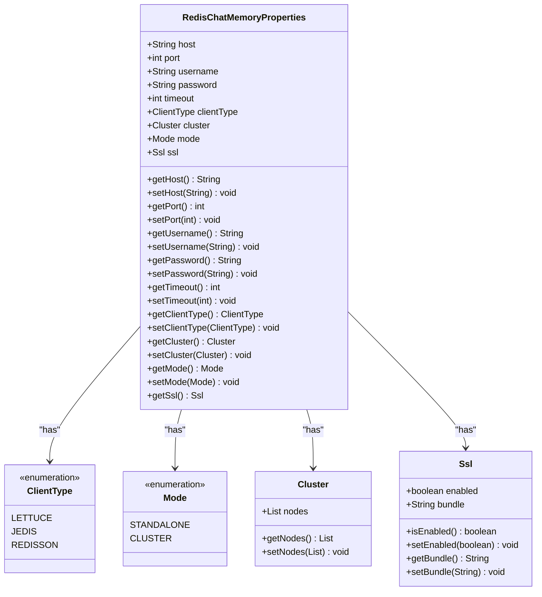

**图源**
- [RedisChatMemoryProperties.java](file://auto-configurations/spring-ai-alibaba-autoconfigure-memory/src/main/java/com/alibaba/cloud/ai/autoconfigure/memory/redis/RedisChatMemoryProperties.java)

**节源**
- [RedisChatMemoryProperties.java](file://auto-configurations/spring-ai-alibaba-autoconfigure-memory/src/main/java/com/alibaba/cloud/ai/autoconfigure/memory/redis/RedisChatMemoryProperties.java)

#### Redis实现
Redis实现基于`BaseRedisChatMemoryRepository`抽象类，该类提供了JSON序列化和反序列化的基础功能。具体的实现类包括`JedisRedisChatMemoryRepository`、`LettuceRedisChatMemoryRepository`和`RedissonRedisChatMemoryRepository`。

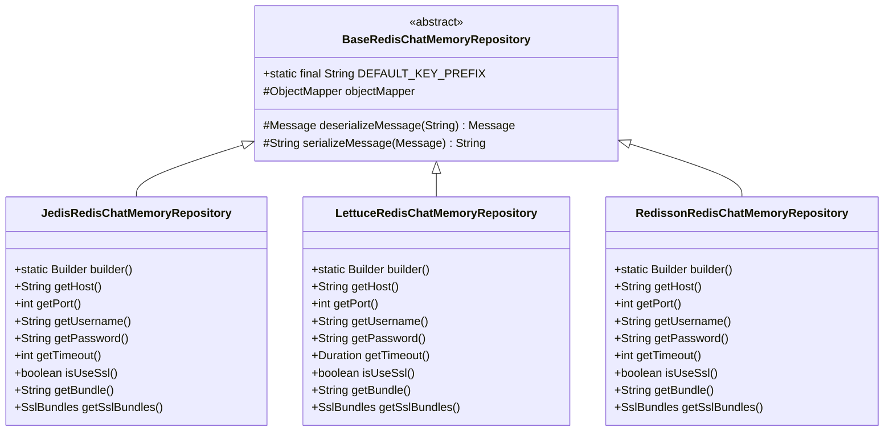

**图源**
- [BaseRedisChatMemoryRepository.java](file://community/memories/spring-ai-alibaba-starter-memory-redis/src/main/java/com/alibaba/cloud/ai/memory/redis/BaseRedisChatMemoryRepository.java)
- [JedisRedisChatMemoryRepository.java](file://community/memories/spring-ai-alibaba-starter-memory-redis/src/main/java/com/alibaba/cloud/ai/memory/redis/JedisRedisChatMemoryRepository.java)
- [LettuceRedisChatMemoryRepository.java](file://community/memories/spring-ai-alibaba-starter-memory-redis/src/main/java/com/alibaba/cloud/ai/memory/redis/LettuceRedisChatMemoryRepository.java)
- [RedissonRedisChatMemoryRepository.java](file://community/memories/spring-ai-alibaba-starter-memory-redis/src/main/java/com/alibaba/cloud/ai/memory/redis/RedissonRedisChatMemoryRepository.java)

**节源**
- [BaseRedisChatMemoryRepository.java](file://community/memories/spring-ai-alibaba-starter-memory-redis/src/main/java/com/alibaba/cloud/ai/memory/redis/BaseRedisChatMemoryRepository.java)

### JDBC存储分析
JDBC存储提供了关系型数据库的持久化方案，支持多种数据库，包括H2、MySQL、Oracle、PostgreSQL、SQLite和SQL Server。

#### JDBC配置
JDBC存储没有单独的属性类，而是为每种数据库提供了特定的自动配置类，如`MysqlChatMemoryAutoConfiguration`。

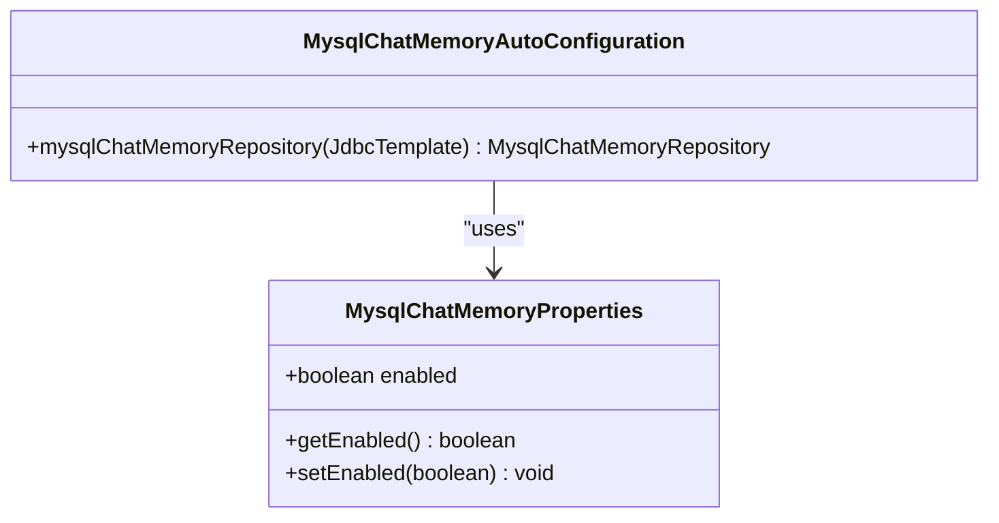

**图源**
- [MysqlChatMemoryAutoConfiguration.java](file://auto-configurations/spring-ai-alibaba-autoconfigure-memory/src/main/java/com/alibaba/cloud/ai/autoconfigure/memory/MysqlChatMemoryAutoConfiguration.java)
- [MysqlChatMemoryProperties.java](file://auto-configurations/spring-ai-alibaba-autoconfigure-memory/src/main/java/com/alibaba/cloud/ai/autoconfigure/memory/MysqlChatMemoryProperties.java)

**节源**
- [MysqlChatMemoryAutoConfiguration.java](file://auto-configurations/spring-ai-alibaba-autoconfigure-memory/src/main/java/com/alibaba/cloud/ai/autoconfigure/memory/MysqlChatMemoryAutoConfiguration.java)

#### JDBC实现
JDBC实现基于`JdbcChatMemoryRepository`抽象类，该类定义了通用的CRUD操作。具体的实现类继承这个抽象类并提供特定数据库的表结构定义。

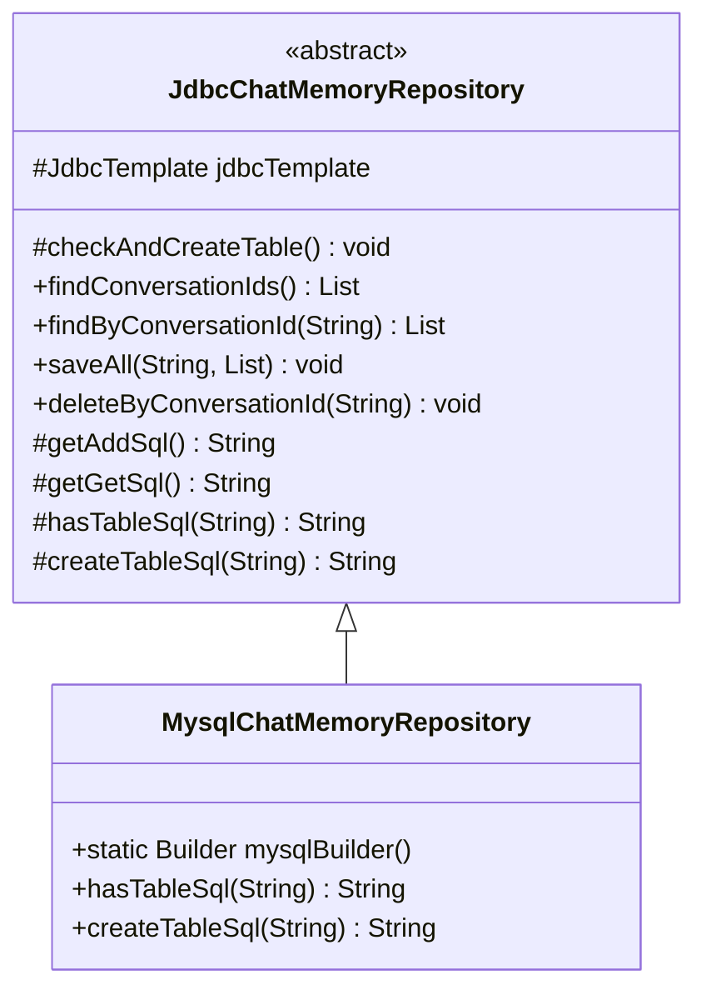

**图源**
- [JdbcChatMemoryRepository.java](file://community/memories/spring-ai-alibaba-starter-memory-jdbc/src/main/java/com/alibaba/cloud/ai/memory/jdbc/JdbcChatMemoryRepository.java)
- [MysqlChatMemoryRepository.java](file://community/memories/spring-ai-alibaba-starter-memory-jdbc/src/main/java/com/alibaba/cloud/ai/memory/jdbc/MysqlChatMemoryRepository.java)

**节源**
- [JdbcChatMemoryRepository.java](file://community/memories/spring-ai-alibaba-starter-memory-jdbc/src/main/java/com/alibaba/cloud/ai/memory/jdbc/JdbcChatMemoryRepository.java)

### MongoDB存储分析
MongoDB存储提供了NoSQL数据库的持久化方案，适合处理非结构化数据。

#### MongoDB配置
MongoDB配置通过`MongoDBChatMemoryProperties`类进行管理，支持主机、端口、认证数据库名、数据库名、用户名和密码。

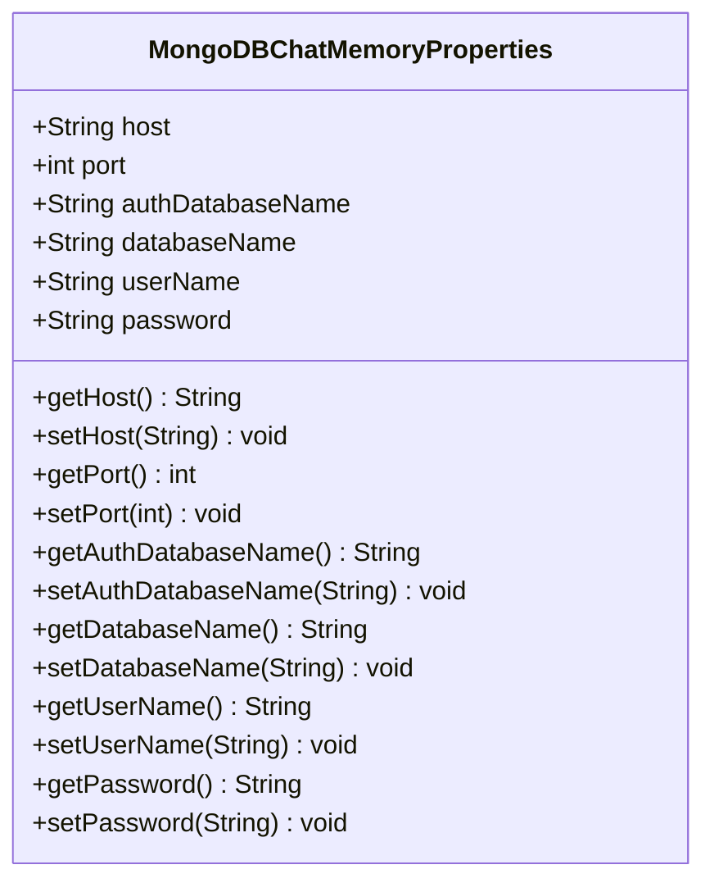

**图源**
- [MongoDBChatMemoryProperties.java](file://auto-configurations/spring-ai-alibaba-autoconfigure-memory/src/main/java/com/alibaba/cloud/ai/autoconfigure/memory/MongoDBChatMemoryProperties.java)

**节源**
- [MongoDBChatMemoryProperties.java](file://auto-configurations/spring-ai-alibaba-autoconfigure-memory/src/main/java/com/alibaba/cloud/ai/autoconfigure/memory/MongoDBChatMemoryProperties.java)

#### MongoDB实现
MongoDB实现直接使用MongoDB Java驱动进行数据操作，提供了完整的CRUD功能。

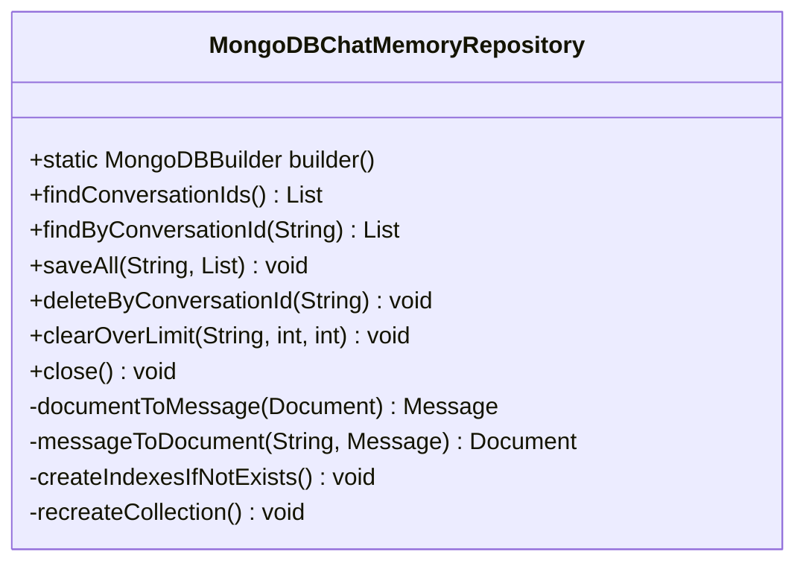

**图源**
- [MongoDBChatMemoryRepository.java](file://community/memories/spring-ai-alibaba-starter-memory-mongodb/src/main/java/com/alibaba/cloud/ai/memory/mongodb/MongoDBChatMemoryRepository.java)

**节源**
- [MongoDBChatMemoryRepository.java](file://community/memories/spring-ai-alibaba-starter-memory-mongodb/src/main/java/com/alibaba/cloud/ai/memory/mongodb/MongoDBChatMemoryRepository.java)

### Memcached存储分析
Memcached存储提供了分布式内存缓存解决方案，适合需要高性能读写的场景。

#### Memcached配置
Memcached配置通过`MemcachedChatMemoryProperties`类进行管理，支持主机和端口。

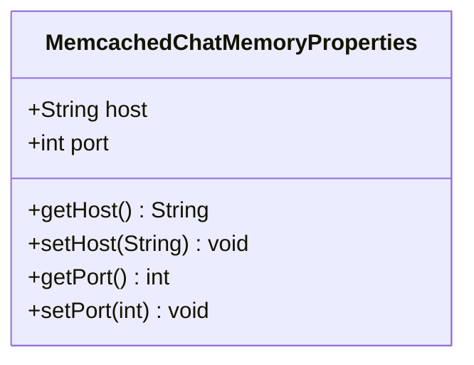

**图源**
- [MemcachedChatMemoryProperties.java](file://auto-configurations/spring-ai-alibaba-autoconfigure-memory/src/main/java/com/alibaba/cloud/ai/autoconfigure/memory/MemcachedChatMemoryProperties.java)

**节源**
- [MemcachedChatMemoryProperties.java](file://auto-configurations/spring-ai-alibaba-autoconfigure-memory/src/main/java/com/alibaba/cloud/ai/autoconfigure/memory/MemcachedChatMemoryProperties.java)

#### Memcached实现
Memcached实现使用Spy Memcached客户端进行数据操作，通过自定义的序列化器处理消息对象。

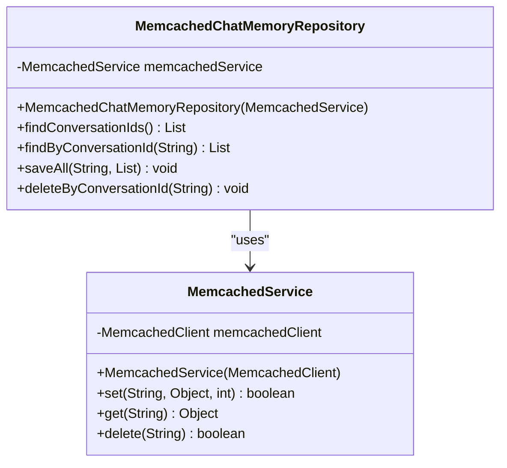

**图源**
- [MemcachedChatMemoryRepository.java](file://community/memories/spring-ai-alibaba-starter-memory-memcached/src/main/java/com/alibaba/cloud/ai/memory/memcached/MemcachedChatMemoryRepository.java)
- [MemcachedService.java](file://community/memories/spring-ai-alibaba-starter-tool-calling-memcached/src/main/java/com/alibaba/cloud/ai/toolcalling/memcached/MemcachedService.java)

**节源**
- [MemcachedChatMemoryRepository.java](file://community/memories/spring-ai-alibaba-starter-memory-memcached/src/main/java/com/alibaba/cloud/ai/memory/memcached/MemcachedChatMemoryRepository.java)

### Elasticsearch存储分析
Elasticsearch存储提供了全文搜索和分析能力，适合需要复杂查询的场景。

#### Elasticsearch配置
Elasticsearch配置通过`ElasticsearchChatMemoryProperties`类进行管理，支持节点列表、主机、端口、协议、用户名和密码。

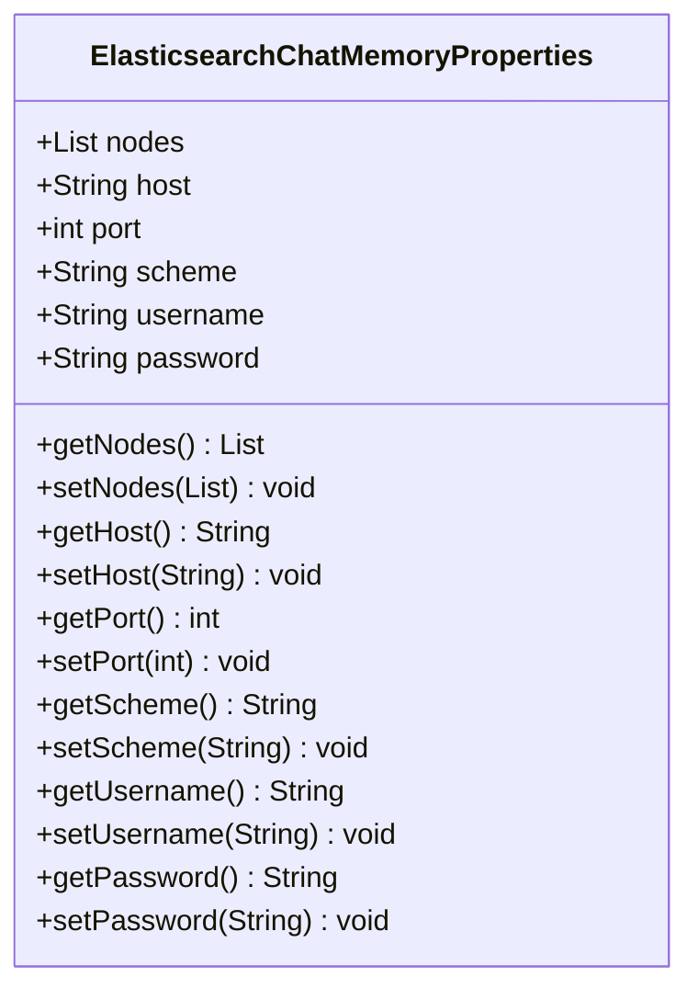

**图源**
- [ElasticsearchChatMemoryProperties.java](file://auto-configurations/spring-ai-alibaba-autoconfigure-memory/src/main/java/com/alibaba/cloud/ai/autoconfigure/memory/ElasticsearchChatMemoryProperties.java)

**节源**
- [ElasticsearchChatMemoryProperties.java](file://auto-configurations/spring-ai-alibaba-autoconfigure-memory/src/main/java/com/alibaba/cloud/ai/autoconfigure/memory/ElasticsearchChatMemoryProperties.java)

#### Elasticsearch实现
Elasticsearch实现使用Elasticsearch官方Java客户端进行数据操作，支持HTTPS和身份验证。

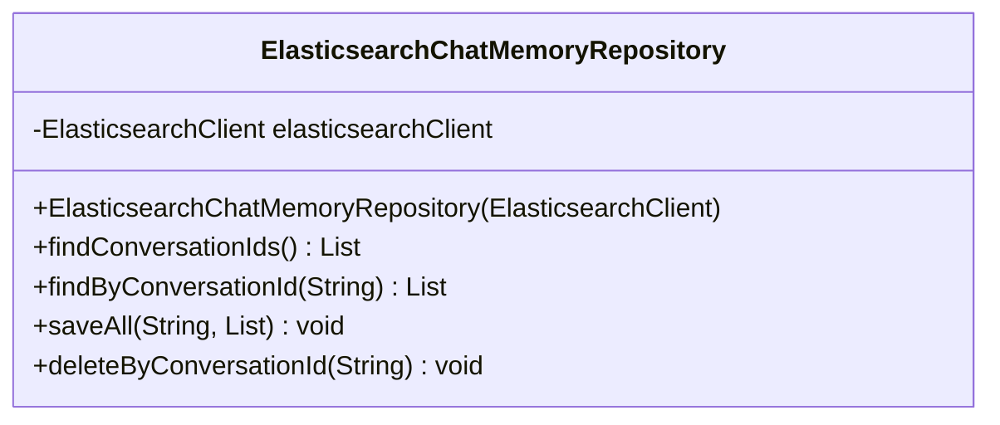

**图源**
- [ElasticsearchChatMemoryRepository.java](file://community/memories/spring-ai-alibaba-starter-memory-elasticsearch/src/main/java/com/alibaba/cloud/ai/memory/elasticsearch/ElasticsearchChatMemoryRepository.java)

**节源**
- [ElasticsearchChatMemoryRepository.java](file://community/memories/spring-ai-alibaba-starter-memory-elasticsearch/src/main/java/com/alibaba/cloud/ai/memory/elasticsearch/ElasticsearchChatMemoryRepository.java)

### Tablestore存储分析
Tablestore存储提供了阿里云的分布式表格存储服务，适合大规模数据存储。

#### Tablestore配置
Tablestore配置通过`TablestoreChatMemoryProperties`类进行管理，支持端点、访问密钥ID、访问密钥密钥和实例名称。

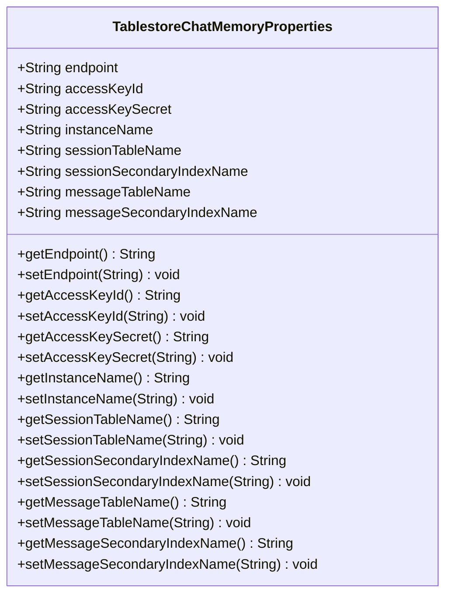

**图源**
- [TablestoreChatMemoryProperties.java](file://auto-configurations/spring-ai-alibaba-autoconfigure-memory/src/main/java/com/alibaba/cloud/ai/autoconfigure/memory/TablestoreChatMemoryProperties.java)

**节源**
- [TablestoreChatMemoryProperties.java](file://auto-configurations/spring-ai-alibaba-autoconfigure-memory/src/main/java/com/alibaba/cloud/ai/autoconfigure/memory/TablestoreChatMemoryProperties.java)

#### Tablestore实现
Tablestore实现使用阿里云Tablestore SDK进行数据操作，支持会话和消息的分离存储。

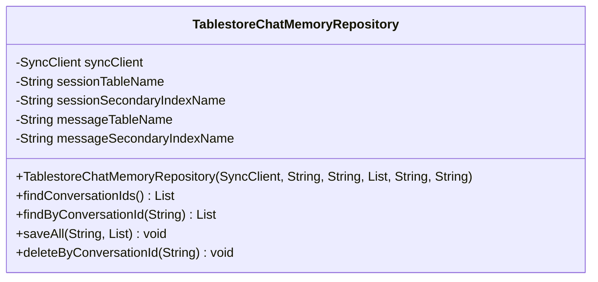

**图源**
- [TablestoreChatMemoryRepository.java](file://community/memories/spring-ai-alibaba-starter-memory-tablestore/src/main/java/com/alibaba/cloud/ai/memory/tablestore/TablestoreChatMemoryRepository.java)

**节源**
- [TablestoreChatMemoryRepository.java](file://community/memories/spring-ai-alibaba-starter-memory-tablestore/src/main/java/com/alibaba/cloud/ai/memory/tablestore/TablestoreChatMemoryRepository.java)

## 依赖分析
记忆存储模块的依赖关系清晰，每个存储后端都有独立的自动配置和实现模块，通过Spring Boot的条件化配置机制进行加载。

```mermaid
graph TD
ChatMemoryAutoConfiguration --> RedisChatMemoryAutoConfiguration
ChatMemoryAutoConfiguration --> MysqlChatMemoryAutoConfiguration
ChatMemoryAutoConfiguration --> MongoDBChatMemoryAutoConfiguration
ChatMemoryAutoConfiguration --> MemcachedChatMemoryAutoConfiguration
ChatMemoryAutoConfiguration --> ElasticsearchChatMemoryAutoConfiguration
ChatMemoryAutoConfiguration --> TablestoreChatMemoryAutoConfiguration
RedisChatMemoryAutoConfiguration --> JedisRedisChatMemoryConnectionAutoConfiguration
RedisChatMemoryAutoConfiguration --> LettuceRedisChatMemoryConnectionAutoConfiguration
RedisChatMemoryAutoConfiguration --> RedissonRedisChatMemoryConnectionAutoConfiguration
MysqlChatMemoryAutoConfiguration --> JdbcTemplateAutoConfiguration
MongoDBChatMemoryAutoConfiguration --> MongoClient
MemcachedChatMemoryAutoConfiguration --> MemcachedClient
ElasticsearchChatMemoryAutoConfiguration --> RestClient
TablestoreChatMemoryAutoConfiguration --> SyncClient
```

**图源**
- [ChatMemoryAutoConfiguration.java](file://auto-configurations/spring-ai-alibaba-autoconfigure-memory/src/main/java/com/alibaba/cloud/ai/autoconfigure/memory/ChatMemoryAutoConfiguration.java)
- [RedisChatMemoryAutoConfiguration.java](file://auto-configurations/spring-ai-alibaba-autoconfigure-memory/src/main/java/com/alibaba/cloud/ai/autoconfigure/memory/redis/RedisChatMemoryAutoConfiguration.java)
- [MysqlChatMemoryAutoConfiguration.java](file://auto-configurations/spring-ai-alibaba-autoconfigure-memory/src/main/java/com/alibaba/cloud/ai/autoconfigure/memory/MysqlChatMemoryAutoConfiguration.java)
- [MongoDBChatMemoryAutoConfiguration.java](file://auto-configurations/spring-ai-alibaba-autoconfigure-memory/src/main/java/com/alibaba/cloud/ai/autoconfigure/memory/MongoDBChatMemoryAutoConfiguration.java)
- [MemcachedChatMemoryAutoConfiguration.java](file://auto-configurations/spring-ai-alibaba-autoconfigure-memory/src/main/java/com/alibaba/cloud/ai/autoconfigure/memory/MemcachedChatMemoryAutoConfiguration.java)
- [ElasticsearchChatMemoryAutoConfiguration.java](file://auto-configurations/spring-ai-alibaba-autoconfigure-memory/src/main/java/com/alibaba/cloud/ai/autoconfigure/memory/ElasticsearchChatMemoryAutoConfiguration.java)
- [TablestoreChatMemoryAutoConfiguration.java](file://auto-configurations/spring-ai-alibaba-autoconfigure-memory/src/main/java/com/alibaba/cloud/ai/autoconfigure/memory/TablestoreChatMemoryAutoConfiguration.java)

**节源**
- [ChatMemoryAutoConfiguration.java](file://auto-configurations/spring-ai-alibaba-autoconfigure-memory/src/main/java/com/alibaba/cloud/ai/autoconfigure/memory/ChatMemoryAutoConfiguration.java)

## 性能考虑
不同存储后端的性能特征各不相同：
- Redis：内存存储，读写速度最快，适合高频访问场景
- Memcached：纯内存缓存，读写速度极快，但功能相对简单
- JDBC：磁盘存储，读写速度较慢，但支持复杂查询和事务
- MongoDB：NoSQL数据库，读写速度较快，支持灵活的数据模型
- Elasticsearch：搜索引擎，写入速度较慢，但查询能力强大
- Tablestore：分布式表格存储，读写速度均衡，适合大规模数据

## 故障排除指南
常见问题及解决方案：
- 连接失败：检查网络连接和认证信息
- 性能下降：检查索引是否合理，考虑增加缓存层
- 数据丢失：确保启用了持久化选项，定期备份数据
- 配置错误：检查配置文件中的属性名称和值是否正确

**节源**
- [RedisChatMemoryAutoConfiguration.java](file://auto-configurations/spring-ai-alibaba-autoconfigure-memory/src/main/java/com/alibaba/cloud/ai/autoconfigure/memory/redis/RedisChatMemoryAutoConfiguration.java)
- [MysqlChatMemoryAutoConfiguration.java](file://auto-configurations/spring-ai-alibaba-autoconfigure-memory/src/main/java/com/alibaba/cloud/ai/autoconfigure/memory/MysqlChatMemoryAutoConfiguration.java)
- [MongoDBChatMemoryAutoConfiguration.java](file://auto-configurations/spring-ai-alibaba-autoconfigure-memory/src/main/java/com/alibaba/cloud/ai/autoconfigure/memory/MongoDBChatMemoryAutoConfiguration.java)

## 结论
Spring AI Alibaba提供了丰富的记忆存储方案，涵盖了从内存缓存到分布式数据库的各种选择。开发者可以根据应用的具体需求选择合适的存储后端。对于需要高性能的场景，推荐使用Redis或Memcached；对于需要持久化和复杂查询的场景，推荐使用JDBC或MongoDB；对于需要全文搜索的场景，推荐使用Elasticsearch；对于大规模数据存储，推荐使用Tablestore。