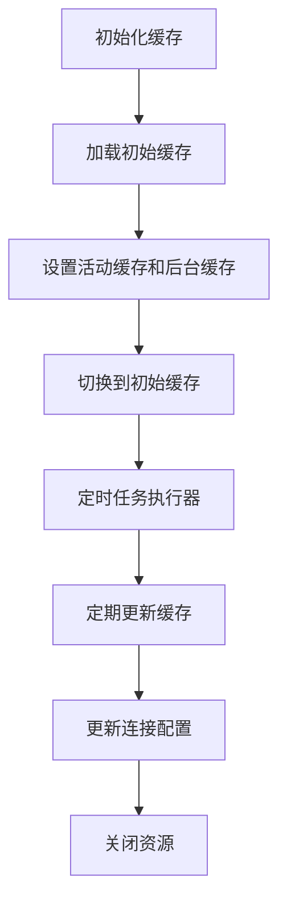
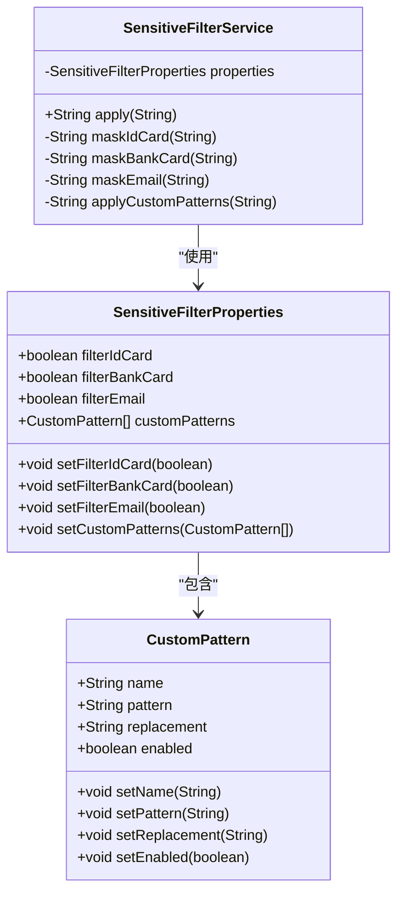
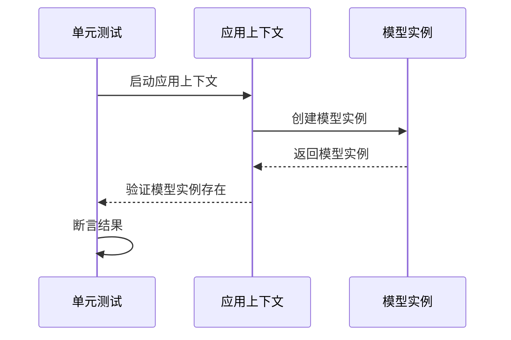

# 最佳实践

<cite>
**本文档中引用的文件**
- [DashScopeChatAutoConfiguration.java](file://auto-configurations/spring-ai-alibaba-autoconfigure-dashscope/src/main/java/com/alibaba/cloud/ai/autoconfigure/dashscope/DashScopeChatAutoConfiguration.java)
- [ChatMemoryAutoConfiguration.java](file://auto-configurations/spring-ai-alibaba-autoconfigure-memory/src/main/java/com/alibaba/cloud/ai/autoconfigure/memory/ChatMemoryAutoConfiguration.java)
- [ToolCallingManagerConfiguration.java](file://spring-ai-alibaba-jmanus/src/main/java/com/alibaba/cloud/ai/manus/config/ToolCallingManagerConfiguration.java)
- [SensitiveFilterService.java](file://community/tool-calls/spring-ai-alibaba-starter-tool-calling-sensitivefilter/src/main/java/com/alibaba/cloud/ai/toolcalling/sensitivefilter/SensitiveFilterService.java)
- [McpCacheManager.java](file://spring-ai-alibaba-jmanus/src/main/java/com/alibaba/cloud/ai/manus/mcp/service/McpCacheManager.java)
- [DashScopeModelConfigurationTests.java](file://auto-configurations/spring-ai-alibaba-autoconfigure-dashscope/src/test/java/com/alibaba/cloud/ai/autoconfigure/dashscope/DashScopeModelConfigurationTests.java)
</cite>

## 目录
1. [简介](#简介)
2. [性能优化策略](#性能优化策略)
3. [安全考虑](#安全考虑)
4. [错误处理和异常恢复模式](#错误处理和异常恢复模式)
5. [代码组织和模块化设计](#代码组织和模块化设计)
6. [测试策略](#测试策略)

## 简介
Spring AI Alibaba 是一个用于构建聊天机器人、工作流和多智能体应用的代理式AI框架。本最佳实践文档旨在为开发者提供超越基础用法的高级指导，涵盖性能优化、安全考虑、错误处理、代码组织和测试策略等方面。

## 性能优化策略

### 缓存机制
在 Spring AI Alibaba 中，缓存机制被广泛应用于提高系统性能。例如，在 JManus 模块中，`McpCacheManager` 类实现了双缓冲缓存机制，通过定期更新和线程池管理来确保缓存的一致性和高效性。

**Diagram sources**
- [McpCacheManager.java](file://spring-ai-alibaba-jmanus/src/main/java/com/alibaba/cloud/ai/manus/mcp/service/McpCacheManager.java#L169-L211)

**Section sources**
- [McpCacheManager.java](file://spring-ai-alibaba-jmanus/src/main/java/com/alibaba/cloud/ai/manus/mcp/service/McpCacheManager.java#L575-L617)

### 异步处理
异步处理是提升系统响应速度的关键技术之一。Spring AI Alibaba 利用 Spring 的异步支持，结合 `@Async` 注解和 `TaskExecutor` 来实现异步任务的调度与执行。

### 资源池化
资源池化可以有效减少资源创建和销毁的开销。在 MCP 服务加载器中，通过 `connectionExecutorRef` 和 `scheduledExecutor` 实现了线程池的管理和调度，从而提高了系统的并发处理能力。

## 安全考虑

### 敏感信息保护
为了防止敏感信息泄露，Spring AI Alibaba 提供了 `SensitiveFilterService` 组件，该组件可以根据配置对文本中的身份证号、银行卡号、邮箱等敏感信息进行过滤或替换。

**Diagram sources**
- [SensitiveFilterService.java](file://community/tool-calls/spring-ai-alibaba-starter-tool-calling-sensitivefilter/src/main/java/com/alibaba/cloud/ai/toolcalling/sensitivefilter/SensitiveFilterService.java)
- [SensitiveFilterProperties.java](file://community/tool-calls/spring-ai-alibaba-starter-tool-calling-sensitivefilter/src/main/java/com/alibaba/cloud/ai/toolcalling/sensitivefilter/SensitiveFilterProperties.java)

**Section sources**
- [SensitiveFilterService.java](file://community/tool-calls/spring-ai-alibaba-starter-tool-calling-sensitivefilter/src/main/java/com/alibaba/cloud/ai/toolcalling/sensitivefilter/SensitiveFilterService.java)

### 输入验证
输入验证是防止恶意输入攻击的重要手段。Spring AI Alibaba 在多个模块中实现了严格的输入验证逻辑，确保所有外部输入都经过校验后才能进入核心业务流程。

### 防止提示注入攻击
通过限制用户输入的内容格式和长度，并结合上下文分析，Spring AI Alibaba 能够有效防范提示注入攻击，保障系统的安全性。

## 错误处理和异常恢复模式

### 健壮的错误处理
Spring AI Alibaba 采用分层的错误处理机制，从最底层的异常捕获到上层的服务调用，每一层都有相应的错误处理策略。例如，在 `McpCacheManager` 中，通过 `@PreDestroy` 注解确保在应用关闭时能够正确释放资源。

### 异常恢复模式
当发生异常时，系统会尝试自动恢复，如重新建立连接、重试失败的操作等。同时，提供了详细的日志记录功能，便于问题排查和后续改进。

## 代码组织和模块化设计

### 模块化架构
Spring AI Alibaba 采用了高度模块化的架构设计，各个功能模块独立成库，方便开发者根据需要选择性引入。这种设计不仅降低了耦合度，还提升了代码的可维护性和复用性。

### 依赖注入
利用 Spring 框架的强大依赖注入特性，Spring AI Alibaba 将各组件之间的依赖关系清晰地定义出来，使得代码更加灵活且易于测试。

## 测试策略

### 单元测试
单元测试覆盖了各个核心组件的功能点，确保每个方法都能按预期工作。例如，在 `DashScopeModelConfigurationTests` 中，通过 `ApplicationContextRunner` 对不同模型的激活情况进行全面测试。

**Diagram sources**
- [DashScopeModelConfigurationTests.java](file://auto-configurations/spring-ai-alibaba-autoconfigure-dashscope/src/test/java/com/alibaba/cloud/ai/autoconfigure/dashscope/DashScopeModelConfigurationTests.java)

**Section sources**
- [DashScopeModelConfigurationTests.java](file://auto-configurations/spring-ai-alibaba-autoconfigure-dashscope/src/test/java/com/alibaba/cloud/ai/autoconfigure/dashscope/DashScopeModelConfigurationTests.java)

### 集成测试
集成测试关注于多个组件协同工作的场景，验证整个系统的稳定性和可靠性。通过模拟真实环境下的交互过程，发现潜在的问题并及时修复。

### 端到端测试
端到端测试从用户的角度出发，完整地模拟一次请求的生命周期，包括前端界面操作、后端服务调用以及数据库交互等环节，确保最终用户体验符合预期。