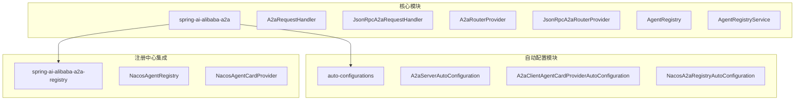
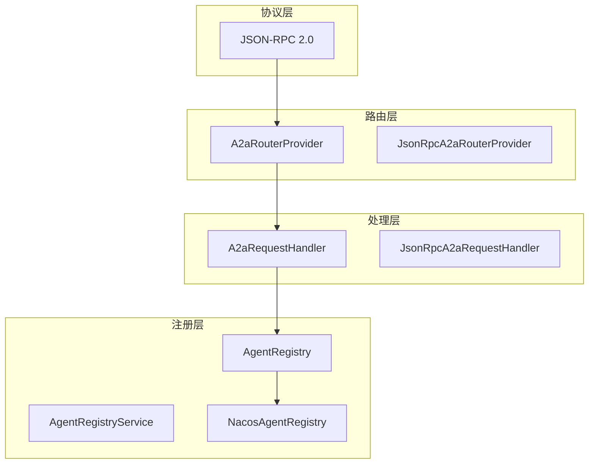
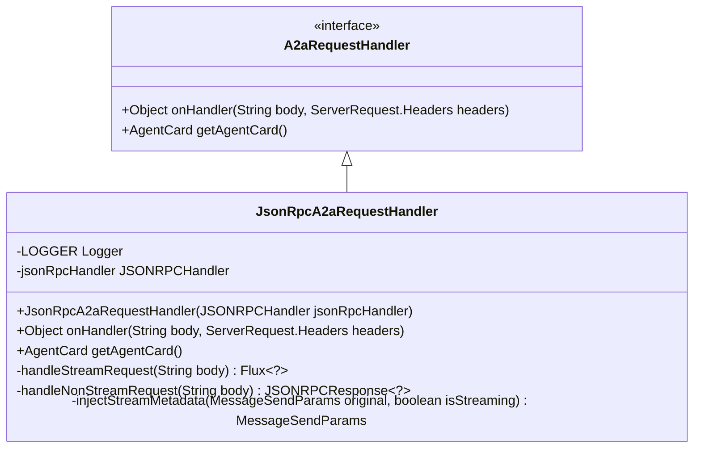
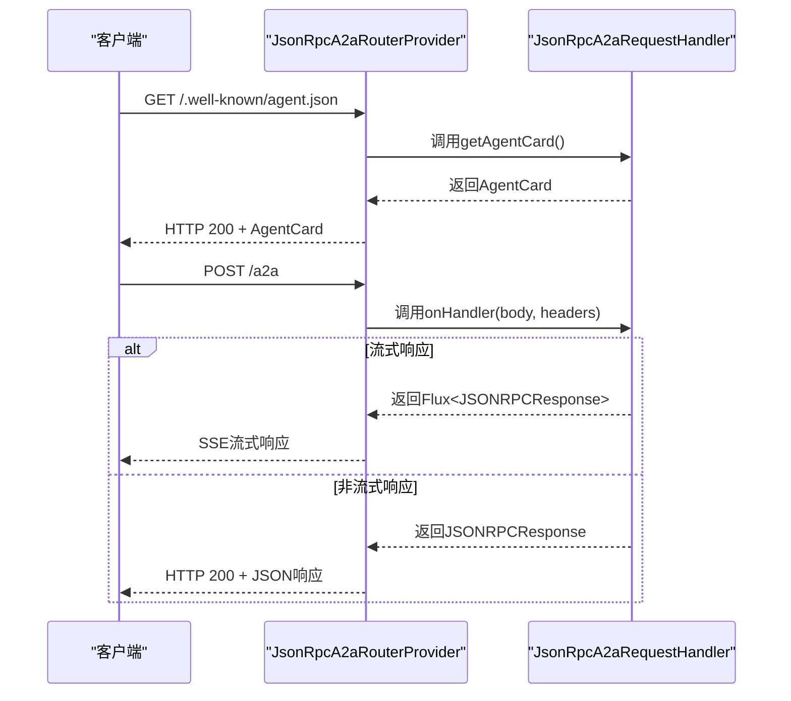
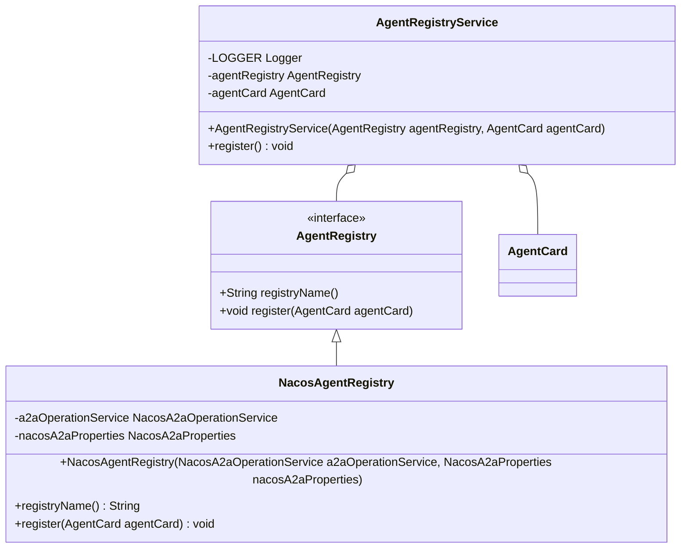
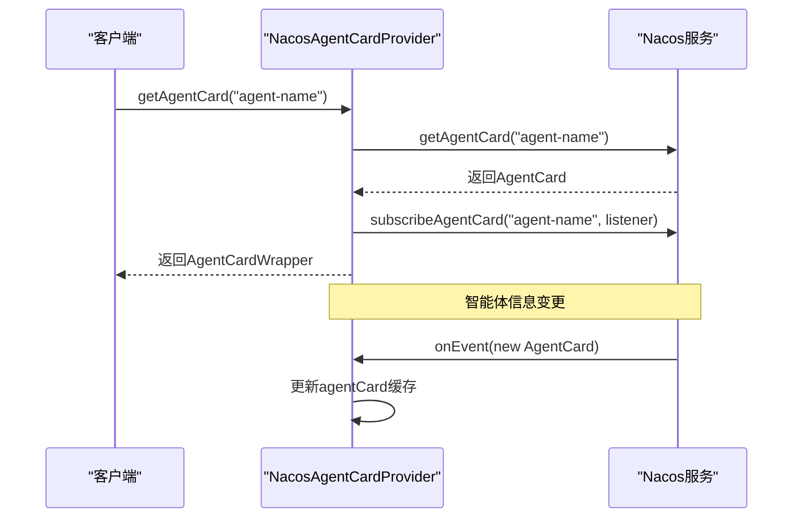
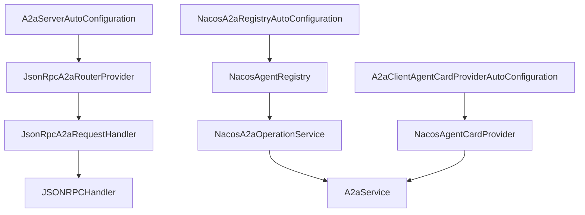

# A2A协议

<cite>
**本文档中引用的文件**
- [A2aRequestHandler.java](file://spring-ai-alibaba-a2a/spring-ai-alibaba-a2a-common/src/main/java/com/alibaba/cloud/ai/a2a/server/A2aRequestHandler.java)
- [JsonRpcA2aRequestHandler.java](file://spring-ai-alibaba-a2a/spring-ai-alibaba-a2a-common/src/main/java/com/alibaba/cloud/ai/a2a/server/JsonRpcA2aRequestHandler.java)
- [A2aRouterProvider.java](file://spring-ai-alibaba-a2a/spring-ai-alibaba-a2a-common/src/main/java/com/alibaba/cloud/ai/a2a/route/A2aRouterProvider.java)
- [JsonRpcA2aRouterProvider.java](file://spring-ai-alibaba-a2a/spring-ai-alibaba-a2a-common/src/main/java/com/alibaba/cloud/ai/a2a/route/JsonRpcA2aRouterProvider.java)
- [AgentRegistry.java](file://spring-ai-alibaba-a2a/spring-ai-alibaba-a2a-common/src/main/java/com/alibaba/cloud/ai/a2a/registry/AgentRegistry.java)
- [AgentRegistryService.java](file://spring-ai-alibaba-a2a/spring-ai-alibaba-a2a-common/src/main/java/com/alibaba/cloud/ai/a2a/registry/AgentRegistryService.java)
- [NacosAgentRegistry.java](file://spring-ai-alibaba-a2a/spring-ai-alibaba-a2a-registry/src/main/java/com/alibaba/cloud/ai/a2a/registry/nacos/register/NacosAgentRegistry.java)
- [NacosAgentCardProvider.java](file://spring-ai-alibaba-a2a/spring-ai-alibaba-a2a-registry/src/main/java/com/alibaba/cloud/ai/a2a/registry/nacos/discovery/NacosAgentCardProvider.java)
- [A2aServerAutoConfiguration.java](file://auto-configurations/spring-ai-alibaba-autoconfigure-a2a-server/src/main/java/com/alibaba/cloud/ai/autoconfigure/a2a/server/A2aServerAutoConfiguration.java)
- [A2aClientAgentCardProviderAutoConfiguration.java](file://auto-configurations/spring-ai-alibaba-autoconfigure-a2a-client/src/main/java/com/alibaba/cloud/ai/autoconfigure/a2a/client/A2aClientAgentCardProviderAutoConfiguration.java)
- [NacosA2aRegistryAutoConfiguration.java](file://auto-configurations/spring-ai-alibaba-autoconfigure-a2a-registry/src/main/java/com/alibaba/cloud/ai/autoconfigure/a2a/registry/nacos/NacosA2aRegistryAutoConfiguration.java)
- [A2aServerProperties.java](file://spring-ai-alibaba-a2a/spring-ai-alibaba-a2a-common/src/main/java/com/alibaba/cloud/ai/a2a/A2aServerProperties.java)
- [A2aClientAgentCardProperties.java](file://spring-ai-alibaba-a2a/spring-ai-alibaba-a2a-common/src/main/java/com/alibaba/cloud/ai/a2a/A2aClientAgentCardProperties.java)
</cite>

## 目录
1. [引言](#引言)
2. [项目结构](#项目结构)
3. [核心组件](#核心组件)
4. [架构概述](#架构概述)
5. [详细组件分析](#详细组件分析)
6. [依赖分析](#依赖分析)
7. [性能考虑](#性能考虑)
8. [故障排除指南](#故障排除指南)
9. [结论](#结论)

## 引言
A2A（Agent to Agent）协议是智能体间通信的基础设施，为分布式智能体系统提供标准化的交互机制。本协议基于JSON-RPC 2.0规范实现，支持服务端请求处理和客户端远程调用，通过Nacos实现服务注册与发现。该协议旨在构建可靠、高效的智能体网络，使不同服务间的智能体能够无缝协作。

## 项目结构
A2A协议的实现分布在多个模块中，主要包括核心功能、自动配置和注册中心集成。核心功能位于`spring-ai-alibaba-a2a`模块，包含请求处理、路由策略和注册服务；自动配置位于`auto-configurations`目录下的各个子模块，提供Spring Boot自动配置能力；注册中心集成主要通过Nacos实现。

**图示来源**
- [A2aRequestHandler.java](file://spring-ai-alibaba-a2a/spring-ai-alibaba-a2a-common/src/main/java/com/alibaba/cloud/ai/a2a/server/A2aRequestHandler.java)
- [JsonRpcA2aRequestHandler.java](file://spring-ai-alibaba-a2a/spring-ai-alibaba-a2a-common/src/main/java/com/alibaba/cloud/ai/a2a/server/JsonRpcA2aRequestHandler.java)
- [A2aRouterProvider.java](file://spring-ai-alibaba-a2a/spring-ai-alibaba-a2a-common/src/main/java/com/alibaba/cloud/ai/a2a/route/A2aRouterProvider.java)
- [JsonRpcA2aRouterProvider.java](file://spring-ai-alibaba-a2a/spring-ai-alibaba-a2a-common/src/main/java/com/alibaba/cloud/ai/a2a/route/JsonRpcA2aRouterProvider.java)
- [AgentRegistry.java](file://spring-ai-alibaba-a2a/spring-ai-alibaba-a2a-common/src/main/java/com/alibaba/cloud/ai/a2a/registry/AgentRegistry.java)
- [AgentRegistryService.java](file://spring-ai-alibaba-a2a/spring-ai-alibaba-a2a-common/src/main/java/com/alibaba/cloud/ai/a2a/registry/AgentRegistryService.java)
- [NacosAgentRegistry.java](file://spring-ai-alibaba-a2a/spring-ai-alibaba-a2a-registry/src/main/java/com/alibaba/cloud/ai/a2a/registry/nacos/register/NacosAgentRegistry.java)
- [NacosAgentCardProvider.java](file://spring-ai-alibaba-a2a/spring-ai-alibaba-a2a-registry/src/main/java/com/alibaba/cloud/ai/a2a/registry/nacos/discovery/NacosAgentCardProvider.java)
- [A2aServerAutoConfiguration.java](file://auto-configurations/spring-ai-alibaba-autoconfigure-a2a-server/src/main/java/com/alibaba/cloud/ai/autoconfigure/a2a/server/A2aServerAutoConfiguration.java)
- [A2aClientAgentCardProviderAutoConfiguration.java](file://auto-configurations/spring-ai-alibaba-autoconfigure-a2a-client/src/main/java/com/alibaba/cloud/ai/autoconfigure/a2a/client/A2aClientAgentCardProviderAutoConfiguration.java)
- [NacosA2aRegistryAutoConfiguration.java](file://auto-configurations/spring-ai-alibaba-autoconfigure-a2a-registry/src/main/java/com/alibaba/cloud/ai/autoconfigure/a2a/registry/nacos/NacosA2aRegistryAutoConfiguration.java)

**章节来源**
- [A2aRequestHandler.java](file://spring-ai-alibaba-a2a/spring-ai-alibaba-a2a-common/src/main/java/com/alibaba/cloud/ai/a2a/server/A2aRequestHandler.java)
- [JsonRpcA2aRequestHandler.java](file://spring-ai-alibaba-a2a/spring-ai-alibaba-a2a-common/src/main/java/com/alibaba/cloud/ai/a2a/server/JsonRpcA2aRequestHandler.java)
- [A2aRouterProvider.java](file://spring-ai-alibaba-a2a/spring-ai-alibaba-a2a-common/src/main/java/com/alibaba/cloud/ai/a2a/route/A2aRouterProvider.java)
- [JsonRpcA2aRouterProvider.java](file://spring-ai-alibaba-a2a/spring-ai-alibaba-a2a-common/src/main/java/com/alibaba/cloud/ai/a2a/route/JsonRpcA2aRouterProvider.java)

## 核心组件
A2A协议的核心组件包括请求处理器、路由器、注册服务和发现机制。服务端通过`A2aRequestHandler`处理来自其他智能体的请求，客户端通过`AgentCardProvider`发现和调用远程智能体。`AgentRegistry`负责服务注册，`A2aRouterProvider`定义路由策略，共同构成了智能体间通信的基础架构。

**章节来源**
- [A2aRequestHandler.java](file://spring-ai-alibaba-a2a/spring-ai-alibaba-a2a-common/src/main/java/com/alibaba/cloud/ai/a2a/server/A2aRequestHandler.java)
- [JsonRpcA2aRequestHandler.java](file://spring-ai-alibaba-a2a/spring-ai-alibaba-a2a-common/src/main/java/com/alibaba/cloud/ai/a2a/server/JsonRpcA2aRequestHandler.java)
- [A2aRouterProvider.java](file://spring-ai-alibaba-a2a/spring-ai-alibaba-a2a-common/src/main/java/com/alibaba/cloud/ai/a2a/route/A2aRouterProvider.java)
- [JsonRpcA2aRouterProvider.java](file://spring-ai-alibaba-a2a/spring-ai-alibaba-a2a-common/src/main/java/com/alibaba/cloud/ai/a2a/route/JsonRpcA2aRouterProvider.java)
- [AgentRegistry.java](file://spring-ai-alibaba-a2a/spring-ai-alibaba-a2a-common/src/main/java/com/alibaba/cloud/ai/a2a/registry/AgentRegistry.java)
- [AgentRegistryService.java](file://spring-ai-alibaba-a2a/spring-ai-alibaba-a2a-common/src/main/java/com/alibaba/cloud/ai/a2a/registry/AgentRegistryService.java)

## 架构概述
A2A协议采用分层架构设计，分为协议层、路由层、处理层和注册层。协议层基于JSON-RPC 2.0实现消息格式；路由层通过`A2aRouterProvider`将HTTP请求映射到相应的处理器；处理层由`A2aRequestHandler`负责解析和响应请求；注册层通过Nacos实现服务的注册与发现。

**图示来源**
- [A2aRequestHandler.java](file://spring-ai-alibaba-a2a/spring-ai-alibaba-a2a-common/src/main/java/com/alibaba/cloud/ai/a2a/server/A2aRequestHandler.java)
- [JsonRpcA2aRequestHandler.java](file://spring-ai-alibaba-a2a/spring-ai-alibaba-a2a-common/src/main/java/com/alibaba/cloud/ai/a2a/server/JsonRpcA2aRequestHandler.java)
- [A2aRouterProvider.java](file://spring-ai-alibaba-a2a/spring-ai-alibaba-a2a-common/src/main/java/com/alibaba/cloud/ai/a2a/route/A2aRouterProvider.java)
- [JsonRpcA2aRouterProvider.java](file://spring-ai-alibaba-a2a/spring-ai-alibaba-a2a-common/src/main/java/com/alibaba/cloud/ai/a2a/route/JsonRpcA2aRouterProvider.java)
- [AgentRegistry.java](file://spring-ai-alibaba-a2a/spring-ai-alibaba-a2a-common/src/main/java/com/alibaba/cloud/ai/a2a/registry/AgentRegistry.java)
- [AgentRegistryService.java](file://spring-ai-alibaba-a2a/spring-ai-alibaba-a2a-common/src/main/java/com/alibaba/cloud/ai/a2a/registry/AgentRegistryService.java)
- [NacosAgentRegistry.java](file://spring-ai-alibaba-a2a/spring-ai-alibaba-a2a-registry/src/main/java/com/alibaba/cloud/ai/a2a/registry/nacos/register/NacosAgentRegistry.java)

## 详细组件分析

### 请求处理器分析
`A2aRequestHandler`接口定义了智能体请求处理的基本契约，其核心方法`onHandler`接收请求体和头部信息并返回处理结果。`JsonRpcA2aRequestHandler`作为具体实现，基于JSON-RPC 2.0协议处理各种类型的请求，包括流式和非流式消息发送、任务查询和取消等操作。

**图示来源**
- [A2aRequestHandler.java](file://spring-ai-alibaba-a2a/spring-ai-alibaba-a2a-common/src/main/java/com/alibaba/cloud/ai/a2a/server/A2aRequestHandler.java)
- [JsonRpcA2aRequestHandler.java](file://spring-ai-alibaba-a2a/spring-ai-alibaba-a2a-common/src/main/java/com/alibaba/cloud/ai/a2a/server/JsonRpcA2aRequestHandler.java)

**章节来源**
- [A2aRequestHandler.java](file://spring-ai-alibaba-a2a/spring-ai-alibaba-a2a-common/src/main/java/com/alibaba/cloud/ai/a2a/server/A2aRequestHandler.java)
- [JsonRpcA2aRequestHandler.java](file://spring-ai-alibaba-a2a/spring-ai-alibaba-a2a-common/src/main/java/com/alibaba/cloud/ai/a2a/server/JsonRpcA2aRequestHandler.java)

### 路由器分析
`A2aRouterProvider`接口定义了A2A协议的路由功能，`JsonRpcA2aRouterProvider`作为其实现，使用Spring WebFlux的`RouterFunction`将HTTP请求路由到相应的处理器。它支持两种URL模式：`.well-known/agent.json`用于获取智能体卡片信息，`/a2a`用于处理消息请求。

**图示来源**
- [JsonRpcA2aRouterProvider.java](file://spring-ai-alibaba-a2a/spring-ai-alibaba-a2a-common/src/main/java/com/alibaba/cloud/ai/a2a/route/JsonRpcA2aRouterProvider.java)
- [JsonRpcA2aRequestHandler.java](file://spring-ai-alibaba-a2a/spring-ai-alibaba-a2a-common/src/main/java/com/alibaba/cloud/ai/a2a/server/JsonRpcA2aRequestHandler.java)

**章节来源**
- [JsonRpcA2aRouterProvider.java](file://spring-ai-alibaba-a2a/spring-ai-alibaba-a2a-common/src/main/java/com/alibaba/cloud/ai/a2a/route/JsonRpcA2aRouterProvider.java)
- [JsonRpcA2aRequestHandler.java](file://spring-ai-alibaba-a2a/spring-ai-alibaba-a2a-common/src/main/java/com/alibaba/cloud/ai/a2a/server/JsonRpcA2aRequestHandler.java)

### 注册服务分析
`AgentRegistry`接口定义了服务注册的基本功能，`NacosAgentRegistry`作为Nacos实现，将智能体信息注册到Nacos服务注册中心。`AgentRegistryService`作为注册服务的门面，在应用启动时自动注册智能体，并处理注册过程中的异常情况。

**图示来源**
- [AgentRegistry.java](file://spring-ai-alibaba-a2a/spring-ai-alibaba-a2a-common/src/main/java/com/alibaba/cloud/ai/a2a/registry/AgentRegistry.java)
- [AgentRegistryService.java](file://spring-ai-alibaba-a2a/spring-ai-alibaba-a2a-common/src/main/java/com/alibaba/cloud/ai/a2a/registry/AgentRegistryService.java)
- [NacosAgentRegistry.java](file://spring-ai-alibaba-a2a/spring-ai-alibaba-a2a-registry/src/main/java/com/alibaba/cloud/ai/a2a/registry/nacos/register/NacosAgentRegistry.java)

**章节来源**
- [AgentRegistry.java](file://spring-ai-alibaba-a2a/spring-ai-alibaba-a2a-common/src/main/java/com/alibaba/cloud/ai/a2a/registry/AgentRegistry.java)
- [AgentRegistryService.java](file://spring-ai-alibaba-a2a/spring-ai-alibaba-a2a-common/src/main/java/com/alibaba/cloud/ai/a2a/registry/AgentRegistryService.java)
- [NacosAgentRegistry.java](file://spring-ai-alibaba-a2a/spring-ai-alibaba-a2a-registry/src/main/java/com/alibaba/cloud/ai/a2a/registry/nacos/register/NacosAgentRegistry.java)

### 发现机制分析
`NacosAgentCardProvider`实现了从Nacos注册中心发现智能体的功能。它不仅可以通过智能体名称获取智能体卡片信息，还支持订阅智能体卡片的变化事件，实现动态更新。当智能体信息发生变化时，监听器会收到通知并更新本地缓存。

**图示来源**
- [NacosAgentCardProvider.java](file://spring-ai-alibaba-a2a/spring-ai-alibaba-a2a-registry/src/main/java/com/alibaba/cloud/ai/a2a/registry/nacos/discovery/NacosAgentCardProvider.java)

**章节来源**
- [NacosAgentCardProvider.java](file://spring-ai-alibaba-a2a/spring-ai-alibaba-a2a-registry/src/main/java/com/alibaba/cloud/ai/a2a/registry/nacos/discovery/NacosAgentCardProvider.java)

## 依赖分析
A2A协议的组件之间存在清晰的依赖关系。服务端组件依赖于路由和处理组件，客户端组件依赖于发现机制，注册中心组件连接两者，形成完整的通信闭环。

**图示来源**
- [A2aServerAutoConfiguration.java](file://auto-configurations/spring-ai-alibaba-autoconfigure-a2a-server/src/main/java/com/alibaba/cloud/ai/autoconfigure/a2a/server/A2aServerAutoConfiguration.java)
- [JsonRpcA2aRouterProvider.java](file://spring-ai-alibaba-a2a/spring-ai-alibaba-a2a-common/src/main/java/com/alibaba/cloud/ai/a2a/route/JsonRpcA2aRouterProvider.java)
- [JsonRpcA2aRequestHandler.java](file://spring-ai-alibaba-a2a/spring-ai-alibaba-a2a-common/src/main/java/com/alibaba/cloud/ai/a2a/server/JsonRpcA2aRequestHandler.java)
- [NacosA2aRegistryAutoConfiguration.java](file://auto-configurations/spring-ai-alibaba-autoconfigure-a2a-registry/src/main/java/com/alibaba/cloud/ai/autoconfigure/a2a/registry/nacos/NacosA2aRegistryAutoConfiguration.java)
- [NacosAgentRegistry.java](file://spring-ai-alibaba-a2a/spring-ai-alibaba-a2a-registry/src/main/java/com/alibaba/cloud/ai/a2a/registry/nacos/register/NacosAgentRegistry.java)
- [NacosA2aOperationService.java](file://spring-ai-alibaba-a2a/spring-ai-alibaba-a2a-registry/src/main/java/com/alibaba/cloud/ai/a2a/registry/nacos/service/NacosA2aOperationService.java)
- [A2aService.java](file://com.alibaba.nacos.api.ai.A2aService)
- [A2aClientAgentCardProviderAutoConfiguration.java](file://auto-configurations/spring-ai-alibaba-autoconfigure-a2a-client/src/main/java/com/alibaba/cloud/ai/autoconfigure/a2a/client/A2aClientAgentCardProviderAutoConfiguration.java)
- [NacosAgentCardProvider.java](file://spring-ai-alibaba-a2a/spring-ai-alibaba-a2a-registry/src/main/java/com/alibaba/cloud/ai/a2a/registry/nacos/discovery/NacosAgentCardProvider.java)

**章节来源**
- [A2aServerAutoConfiguration.java](file://auto-configurations/spring-ai-alibaba-autoconfigure-a2a-server/src/main/java/com/alibaba/cloud/ai/autoconfigure/a2a/server/A2aServerAutoConfiguration.java)
- [JsonRpcA2aRouterProvider.java](file://spring-ai-alibaba-a2a/spring-ai-alibaba-a2a-common/src/main/java/com/alibaba/cloud/ai/a2a/route/JsonRpcA2aRouterProvider.java)
- [JsonRpcA2aRequestHandler.java](file://spring-ai-alibaba-a2a/spring-ai-alibaba-a2a-common/src/main/java/com/alibaba/cloud/ai/a2a/server/JsonRpcA2aRequestHandler.java)
- [NacosA2aRegistryAutoConfiguration.java](file://auto-configurations/spring-ai-alibaba-autoconfigure-a2a-registry/src/main/java/com/alibaba/cloud/ai/autoconfigure/a2a/registry/nacos/NacosA2aRegistryAutoConfiguration.java)
- [NacosAgentRegistry.java](file://spring-ai-alibaba-a2a/spring-ai-alibaba-a2a-registry/src/main/java/com/alibaba/cloud/ai/a2a/registry/nacos/register/NacosAgentRegistry.java)
- [NacosA2aOperationService.java](file://spring-ai-alibaba-a2a/spring-ai-alibaba-a2a-registry/src/main/java/com/alibaba/cloud/ai/a2a/registry/nacos/service/NacosA2aOperationService.java)
- [A2aService.java](file://com.alibaba.nacos.api.ai.A2aService)
- [A2aClientAgentCardProviderAutoConfiguration.java](file://auto-configurations/spring-ai-alibaba-autoconfigure-a2a-client/src/main/java/com/alibaba/cloud/ai/autoconfigure/a2a/client/A2aClientAgentCardProviderAutoConfiguration.java)
- [NacosAgentCardProvider.java](file://spring-ai-alibaba-a2a/spring-ai-alibaba-a2a-registry/src/main/java/com/alibaba/cloud/ai/a2a/registry/nacos/discovery/NacosAgentCardProvider.java)

## 性能考虑
A2A协议在设计时充分考虑了性能因素。对于流式响应，采用SSE（Server-Sent Events）技术实现服务器推送，减少连接开销；对于非流式响应，直接返回JSON数据，保持简单高效。注册服务在应用启动时自动注册，避免运行时频繁注册带来的性能影响。建议在生产环境中合理配置超时时间和连接池参数，以优化整体性能。

## 故障排除指南
当遇到A2A协议相关问题时，可按照以下步骤进行排查：
1. 检查服务是否正确注册到Nacos
2. 验证智能体卡片信息是否完整
3. 确认路由配置是否正确
4. 检查网络连接是否正常
5. 查看日志中的错误信息

**章节来源**
- [JsonRpcA2aRequestHandler.java](file://spring-ai-alibaba-a2a/spring-ai-alibaba-a2a-common/src/main/java/com/alibaba/cloud/ai/a2a/server/JsonRpcA2aRequestHandler.java)
- [JsonRpcA2aRouterProvider.java](file://spring-ai-alibaba-a2a/spring-ai-alibaba-a2a-common/src/main/java/com/alibaba/cloud/ai/a2a/route/JsonRpcA2aRouterProvider.java)
- [NacosAgentRegistry.java](file://spring-ai-alibaba-a2a/spring-ai-alibaba-a2a-registry/src/main/java/com/alibaba/cloud/ai/a2a/registry/nacos/register/NacosAgentRegistry.java)
- [NacosAgentCardProvider.java](file://spring-ai-alibaba-a2a/spring-ai-alibaba-a2a-registry/src/main/java/com/alibaba/cloud/ai/a2a/registry/nacos/discovery/NacosAgentCardProvider.java)

## 结论
A2A协议为智能体间通信提供了完整的解决方案，涵盖了服务端请求处理、客户端远程调用、服务注册与发现等关键功能。通过基于JSON-RPC 2.0的通信协议和Nacos的服务治理能力，实现了高效、可靠的分布式智能体系统。开发者可以基于此协议构建复杂的智能体网络，实现跨服务的协同工作。