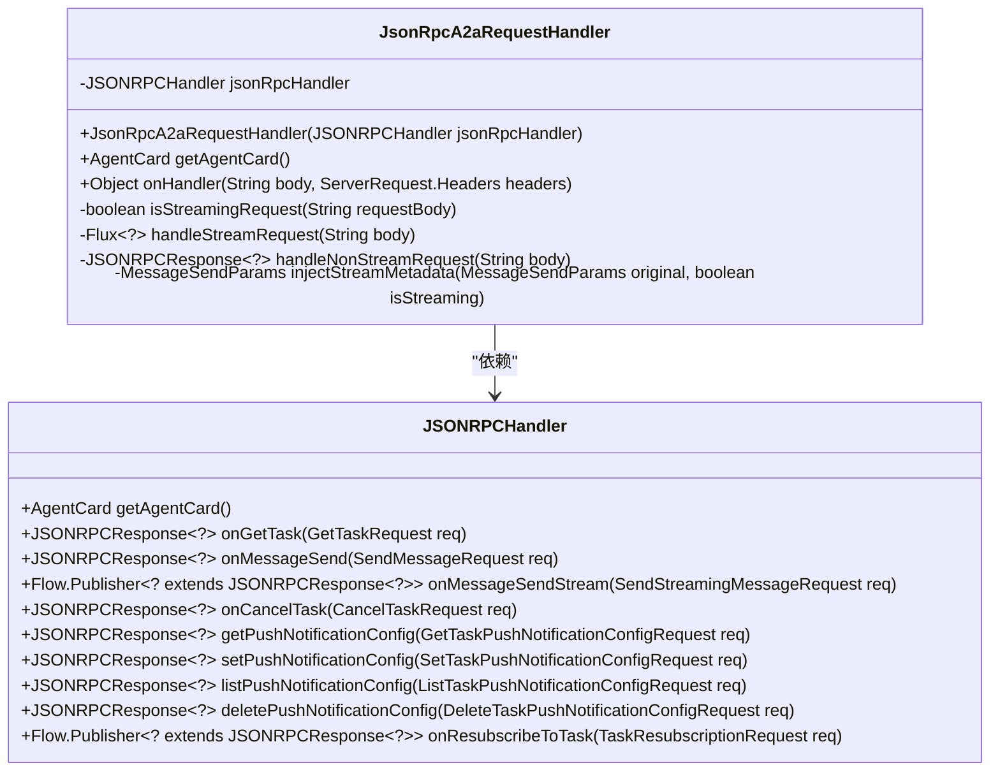
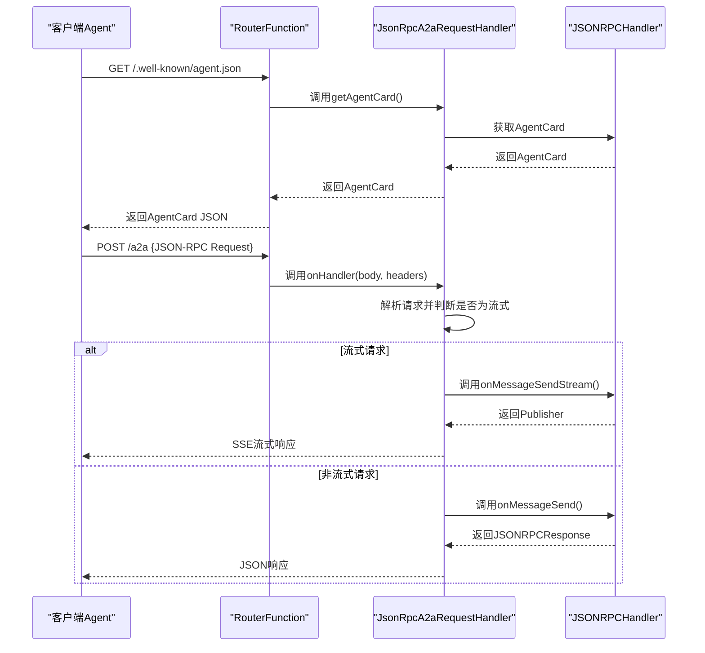
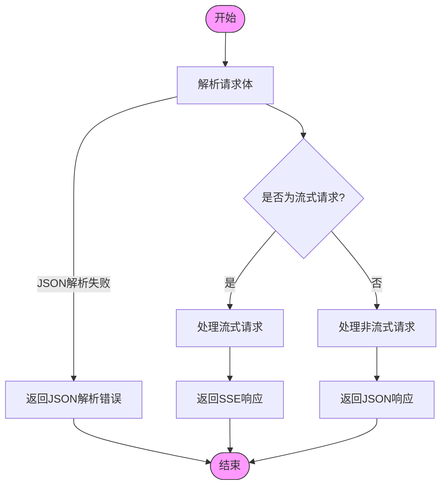
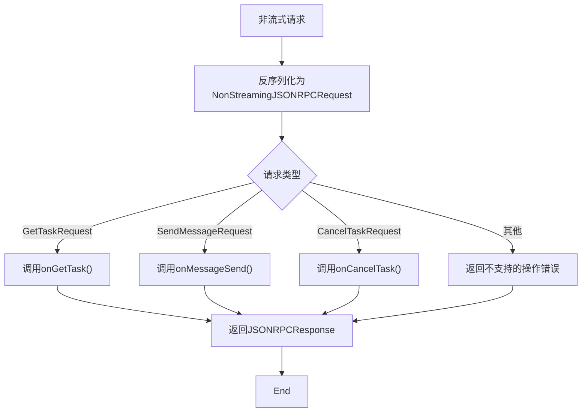
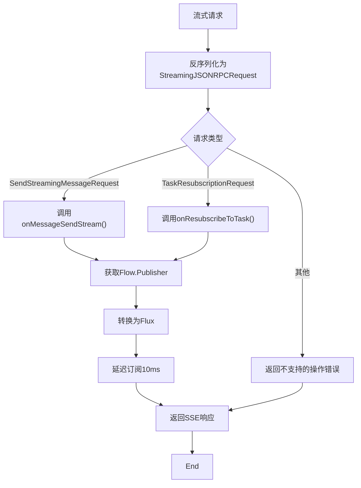
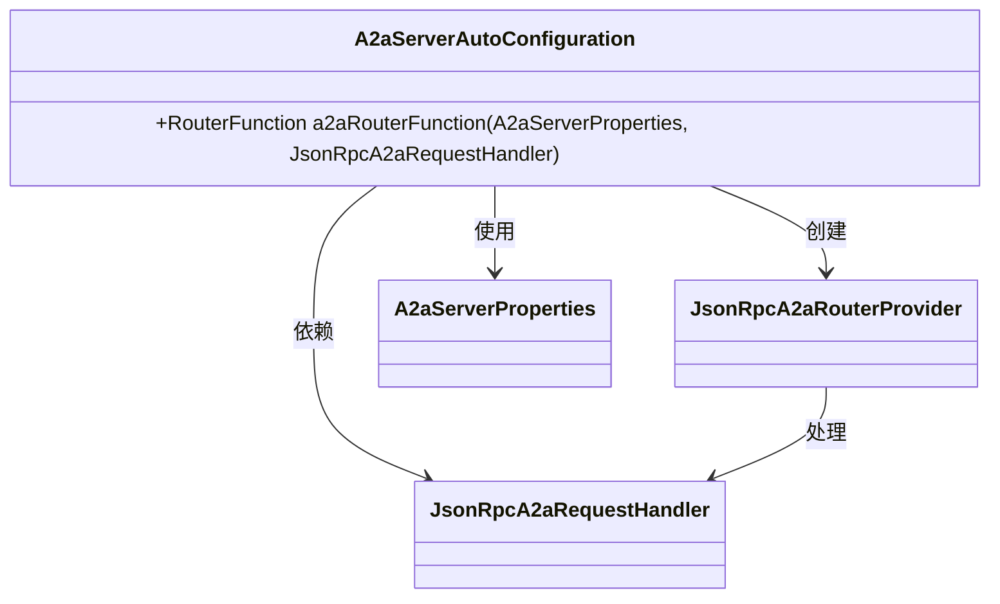
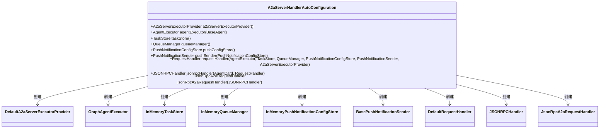
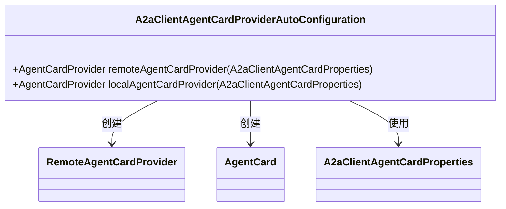
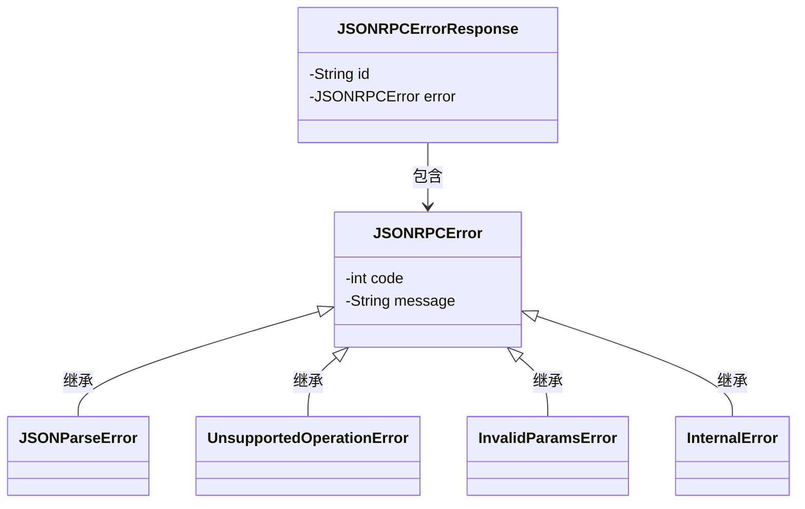
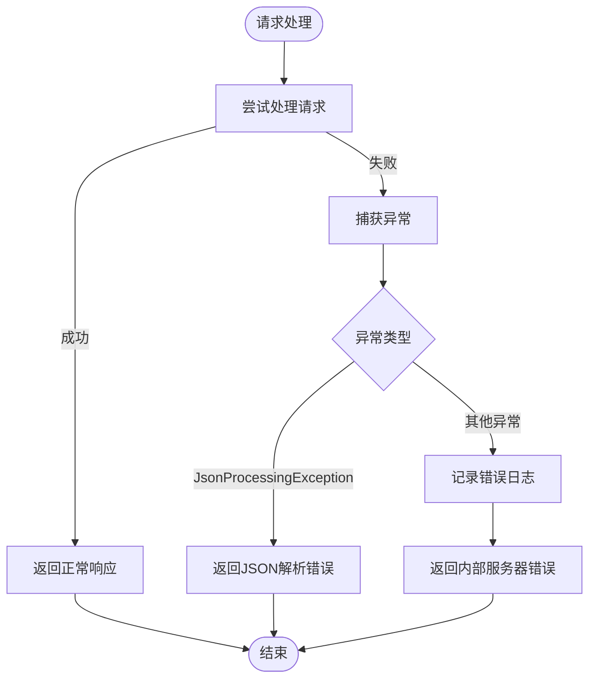

# Agent间通信

<cite>
**本文档引用的文件**
- [JsonRpcA2aRequestHandler.java](file://spring-ai-alibaba-a2a/spring-ai-alibaba-a2a-common/src/main/java/com/alibaba/cloud/ai/a2a/server/JsonRpcA2aRequestHandler.java)
- [JsonRpcA2aRouterProvider.java](file://spring-ai-alibaba-a2a/spring-ai-alibaba-a2a-common/src/main/java/com/alibaba/cloud/ai/a2a/route/JsonRpcA2aRouterProvider.java)
- [A2aServerAutoConfiguration.java](file://auto-configurations/spring-ai-alibaba-autoconfigure-a2a-server/src/main/java/com/alibaba/cloud/ai/autoconfigure/a2a/server/A2aServerAutoConfiguration.java)
- [A2aServerHandlerAutoConfiguration.java](file://auto-configurations/spring-ai-alibaba-autoconfigure-a2a-server/src/main/java/com/alibaba/cloud/ai/autoconfigure/a2a/server/A2aServerHandlerAutoConfiguration.java)
- [A2aServerProperties.java](file://spring-ai-alibaba-a2a/spring-ai-alibaba-a2a-common/src/main/java/com/alibaba/cloud/ai/a2a/A2aServerProperties.java)
- [A2aClientAgentCardProviderAutoConfiguration.java](file://auto-configurations/spring-ai-alibaba-autoconfigure-a2a-client/src/main/java/com/alibaba/cloud/ai/autoconfigure/a2a/client/A2aClientAgentCardProviderAutoConfiguration.java)
- [A2aClientAgentCardProperties.java](file://auto-configurations/spring-ai-alibaba-autoconfigure-a2a-client/src/main/java/com/alibaba/cloud/ai/autoconfigure/a2a/client/A2aClientAgentCardProperties.java)
</cite>

## 目录
1. [引言](#引言)
2. [核心组件分析](#核心组件分析)
3. [通信协议实现](#通信协议实现)
4. [请求处理流程](#请求处理流程)
5. [自动配置机制](#自动配置机制)
6. [客户端配置](#客户端配置)
7. [性能考虑与流式传输](#性能考虑与流式传输)
8. [错误处理机制](#错误处理机制)
9. [常见问题排查指南](#常见问题排查指南)

## 引言
本文档详细阐述了Spring AI Alibaba框架中Agent间通信（A2A）的实现机制，重点介绍基于JSON-RPC 2.0协议的通信架构。文档深入分析了`JsonRpcA2aRequestHandler`如何接收、解析和处理来自其他智能体的请求，包括消息格式、序列化/反序列化过程以及错误响应机制。同时，详细描述了`JsonRpcA2aRequestHandler`的具体实现细节，如请求路由、方法调用和结果返回，并说明了`A2aServerAutoConfiguration`中提供的自动配置选项。

## 核心组件分析

### A2aRequestHandler接口
`A2aRequestHandler`是处理Agent间通信的核心接口，定义了两个主要方法：
- `getAgentCard()`：获取当前Agent的元数据信息（Agent Card）
- `onHandler(String body, ServerRequest.Headers headers)`：处理接收到的请求体和头部信息

该接口的实现类`JsonRpcA2aRequestHandler`负责具体的JSON-RPC协议处理逻辑。

**中文(中文)**
- [A2aRequestHandler.java](file://spring-ai-alibaba-a2a/spring-ai-alibaba-a2a-common/src/main/java/com/alibaba/cloud/ai/a2a/server/A2aRequestHandler.java)

### JsonRpcA2aRequestHandler实现
`JsonRpcA2aRequestHandler`是基于JSON-RPC 2.0协议的请求处理器，它通过依赖注入的方式接收一个`JSONRPCHandler`实例来处理具体的业务逻辑。



**图示来源**
- [JsonRpcA2aRequestHandler.java](file://spring-ai-alibaba-a2a/spring-ai-alibaba-a2a-common/src/main/java/com/alibaba/cloud/ai/a2a/server/JsonRpcA2aRequestHandler.java#L18-L172)
- [JSONRPCHandler.java](file://io.a2a.server.requesthandlers.JSONRPCHandler)

**中文(中文)**
- [JsonRpcA2aRequestHandler.java](file://spring-ai-alibaba-a2a/spring-ai-alibaba-a2a-common/src/main/java/com/alibaba/cloud/ai/a2a/server/JsonRpcA2aRequestHandler.java#L18-L172)

## 通信协议实现

### 消息格式与端点
系统使用标准的JSON-RPC 2.0协议进行通信，定义了两个主要的HTTP端点：

1. **Agent Card端点**：`/.well-known/agent.json` (GET)
   - 用于发现和获取远程Agent的元数据信息
   - 返回`AgentCard`对象，包含Agent的名称、描述、功能等信息

2. **消息处理端点**：`/a2a` (POST)
   - 用于发送和接收Agent间的交互消息
   - 接收JSON-RPC格式的请求体



**图示来源**
- [JsonRpcA2aRouterProvider.java](file://spring-ai-alibaba-a2a/spring-ai-alibaba-a2a-common/src/main/java/com/alibaba/cloud/ai/a2a/route/JsonRpcA2aRouterProvider.java#L37-L154)
- [JsonRpcA2aRequestHandler.java](file://spring-ai-alibaba-a2a/spring-ai-alibaba-a2a-common/src/main/java/com/alibaba/cloud/ai/a2a/server/JsonRpcA2aRequestHandler.java#L60-L96)

**中文(中文)**
- [JsonRpcA2aRouterProvider.java](file://spring-ai-alibaba-a2a/spring-ai-alibaba-a2a-common/src/main/java/com/alibaba/cloud/ai/a2a/route/JsonRpcA2aRouterProvider.java#L37-L154)
- [JsonRpcA2aRequestHandler.java](file://spring-ai-alibaba-a2a/spring-ai-alibaba-a2a-common/src/main/java/com/alibaba/cloud/ai/a2a/server/JsonRpcA2aRequestHandler.java#L60-L96)

### 序列化与反序列化
系统使用Jackson库进行JSON的序列化和反序列化操作，通过`Utils.OBJECT_MAPPER`静态实例处理所有JSON转换：

- 请求反序列化：将JSON字符串转换为对应的JSON-RPC请求对象
- 响应序列化：将Java对象转换为JSON字符串返回给客户端

支持的请求类型包括：
- `SendMessageRequest`：普通消息发送请求
- `SendStreamingMessageRequest`：流式消息发送请求
- `GetTaskRequest`：获取任务状态请求
- `CancelTaskRequest`：取消任务请求

## 请求处理流程

### 请求处理主流程
`JsonRpcA2aRequestHandler`的`onHandler`方法是请求处理的核心入口，其处理流程如下：



**图示来源**
- [JsonRpcA2aRequestHandler.java](file://spring-ai-alibaba-a2a/spring-ai-alibaba-a2a-common/src/main/java/com/alibaba/cloud/ai/a2a/server/JsonRpcA2aRequestHandler.java#L60-L96)

**中文(中文)**
- [JsonRpcA2aRequestHandler.java](file://spring-ai-alibaba-a2a/spring-ai-alibaba-a2a-common/src/main/java/com/alibaba/cloud/ai/a2a/server/JsonRpcA2aRequestHandler.java#L60-L96)

### 流式与非流式请求处理
系统通过检查请求中的`method`字段来区分流式和非流式请求：

```java
private static boolean isStreamingRequest(String requestBody) {
    try {
        JsonNode node = Utils.OBJECT_MAPPER.readTree(requestBody);
        JsonNode method = node != null ? node.get("method") : null;
        return method != null && (SendStreamingMessageRequest.METHOD.equals(method.asText())
                || TaskResubscriptionRequest.METHOD.equals(method.asText()));
    }
    catch (Exception e) {
        return false;
    }
}
```

#### 非流式请求处理
对于非流式请求，系统会根据请求类型分发到相应的处理方法：



**图示来源**
- [JsonRpcA2aRequestHandler.java](file://spring-ai-alibaba-a2a/spring-ai-alibaba-a2a-common/src/main/java/com/alibaba/cloud/ai/a2a/server/JsonRpcA2aRequestHandler.java#L121-L151)

**中文(中文)**
- [JsonRpcA2aRequestHandler.java](file://spring-ai-alibaba-a2a/spring-ai-alibaba-a2a-common/src/main/java/com/alibaba/cloud/ai/a2a/server/JsonRpcA2aRequestHandler.java#L121-L151)

#### 流式请求处理
对于流式请求，系统返回一个`Flux`发布者，通过Server-Sent Events (SSE)协议向客户端推送数据流：



**图示来源**
- [JsonRpcA2aRequestHandler.java](file://spring-ai-alibaba-a2a/spring-ai-alibaba-a2a-common/src/main/java/com/alibaba/cloud/ai/a2a/server/JsonRpcA2aRequestHandler.java#L98-L119)

**中文(中文)**
- [JsonRpcA2aRequestHandler.java](file://spring-ai-alibaba-a2a/spring-ai-alibaba-a2a-common/src/main/java/com/alibaba/cloud/ai/a2a/server/JsonRpcA2aRequestHandler.java#L98-L119)

## 自动配置机制

### A2aServerAutoConfiguration
服务器端的自动配置由`A2aServerAutoConfiguration`类提供，它负责创建路由函数：



**图示来源**
- [A2aServerAutoConfiguration.java](file://auto-configurations/spring-ai-alibaba-autoconfigure-a2a-server/src/main/java/com/alibaba/cloud/ai/autoconfigure/a2a/server/A2aServerAutoConfiguration.java#L29-L46)

**中文(中文)**
- [A2aServerAutoConfiguration.java](file://auto-configurations/spring-ai-alibaba-autoconfigure-a2a-server/src/main/java/com/alibaba/cloud/ai/autoconfigure/a2a/server/A2aServerAutoConfiguration.java#L29-L46)

### A2aServerHandlerAutoConfiguration
`A2aServerHandlerAutoConfiguration`负责配置处理链中的各个组件：



**图示来源**
- [A2aServerHandlerAutoConfiguration.java](file://auto-configurations/spring-ai-alibaba-autoconfigure-a2a-server/src/main/java/com/alibaba/cloud/ai/autoconfigure/a2a/server/A2aServerHandlerAutoConfiguration.java#L80-L115)

**中文(中文)**
- [A2aServerHandlerAutoConfiguration.java](file://auto-configurations/spring-ai-alibaba-autoconfigure-a2a-server/src/main/java/com/alibaba/cloud/ai/autoconfigure/a2a/server/A2aServerHandlerAutoConfiguration.java#L80-L115)

### A2aServerProperties配置属性
`A2aServerProperties`类提供了服务器端的可配置选项：

```java
@ConfigurationProperties(prefix = A2aServerProperties.CONFIG_PREFIX)
public class A2aServerProperties implements EnvironmentAware {
    public static final String CONFIG_PREFIX = "spring.ai.alibaba.a2a.server";
    
    private String type = A2aConstants.AGENT_TRANSPORT_TYPE_JSON_RPC;
    private String agentCardUrl = JsonRpcA2aRouterProvider.DEFAULT_WELL_KNOWN_URL;
    private String messageUrl = JsonRpcA2aRouterProvider.DEFAULT_MESSAGE_URL;
    private String address;
    private Integer port;
    private String version = A2aConstants.DEFAULT_AGENT_VERSION;
}
```

这些属性可以通过application.yml进行配置：

```yaml
spring:
  ai:
    alibaba:
      a2a:
        server:
          type: JSONRPC
          agent-card-url: /.well-known/agent.json
          message-url: /a2a
          address: 127.0.0.1
          port: 8080
          version: 1.0.0
```

**图示来源**
- [A2aServerProperties.java](file://spring-ai-alibaba-a2a/spring-ai-alibaba-a2a-common/src/main/java/com/alibaba/cloud/ai/a2a/A2aServerProperties.java#L27-L129)

**中文(中文)**
- [A2aServerProperties.java](file://spring-ai-alibaba-a2a/spring-ai-alibaba-a2a-common/src/main/java/com/alibaba/cloud/ai/a2a/A2aServerProperties.java#L27-L129)

## 客户端配置

### A2aClientAgentCardProviderAutoConfiguration
客户端的自动配置由`A2aClientAgentCardProviderAutoConfiguration`类提供，支持两种方式获取Agent Card：



**图示来源**
- [A2aClientAgentCardProviderAutoConfiguration.java](file://auto-configurations/spring-ai-alibaba-autoconfigure-a2a-client/src/main/java/com/alibaba/cloud/ai/autoconfigure/a2a/client/A2aClientAgentCardProviderAutoConfiguration.java#L27-L74)

**中文(中文)**
- [A2aClientAgentCardProviderAutoConfiguration.java](file://auto-configurations/spring-ai-alibaba-autoconfigure-a2a-client/src/main/java/com/alibaba/cloud/ai/autoconfigure/a2a/client/A2aClientAgentCardProviderAutoConfiguration.java#L27-L74)

### A2aClientAgentCardProperties配置属性
`A2aClientAgentCardProperties`类提供了客户端的可配置选项：

```java
@ConfigurationProperties(prefix = A2aClientAgentCardProperties.CONFIG_PREFIX)
public class A2aClientAgentCardProperties {
    public static final String CONFIG_PREFIX = "spring.ai.alibaba.a2a.client.agent-card";
    
    private String wellKnownUrl;
    private String name;
    private String description;
    private String url;
    private String provider;
    // ... 其他属性
}
```

这些属性可以通过application.yml进行配置：

```yaml
spring:
  ai:
    alibaba:
      a2a:
        client:
          agent-card:
            well-known-url: http://remote-agent/.well-known/agent.json
            # 或者直接定义本地Agent Card
            name: MyLocalAgent
            description: This is my local agent
            url: http://localhost:8080
```

**图示来源**
- [A2aClientAgentCardProperties.java](file://auto-configurations/spring-ai-alibaba-autoconfigure-a2a-client/src/main/java/com/alibaba/cloud/ai/autoconfigure/a2a/client/A2aClientAgentCardProperties.java)

**中文(中文)**
- [A2aClientAgentCardProperties.java](file://auto-configurations/spring-ai-alibaba-autoconfigure-a2a-client/src/main/java/com/alibaba/cloud/ai/autoconfigure/a2a/client/A2aClientAgentCardProperties.java)

## 性能考虑与流式传输

### 连接复用与超时控制
系统通过以下方式优化性能：

1. **连接复用**：使用Reactor Netty作为底层HTTP服务器，支持HTTP/1.1 Keep-Alive和HTTP/2，实现连接复用
2. **线程池配置**：通过Spring Boot的WebFlux配置可以调整事件循环线程数
3. **超时控制**：在SSE响应中设置了合理的超时处理机制

```java
private ServerResponse buildSseResponse(Flux<?> result) {
    return ServerResponse.sse(sseBuilder -> {
        sseBuilder.onComplete(() -> {
            log.debug("Agent SSE connection completed.");
        });
        sseBuilder.onTimeout(() -> {
            log.debug("Agent SSE connection timeout.");
        });
        // ... 数据处理
    }, Duration.ZERO);
}
```

### 流式传输支持
系统完整支持流式传输，具有以下特点：

- **低延迟**：通过SSE协议实现实时数据推送，无需等待整个响应完成
- **内存效率**：使用Reactive Streams背压机制，避免内存溢出
- **断线重连**：支持`TaskResubscriptionRequest`实现断线后重新订阅

流式传输的典型应用场景包括：
- 实时聊天机器人响应
- 长文本生成的逐步输出
- 任务状态的实时更新通知

## 错误处理机制

### 错误响应类型
系统实现了标准化的错误处理机制，支持多种错误类型：



**图示来源**
- [JSONRPCErrorResponse.java](file://io.a2a.spec.JSONRPCErrorResponse)
- [JSONRPCError.java](file://io.a2a.spec.JSONRPCError)

**中文(中文)**
- [JsonRpcA2aRequestHandler.java](file://spring-ai-alibaba-a2a/spring-ai-alibaba-a2a-common/src/main/java/com/alibaba/cloud/ai/a2a/server/JsonRpcA2aRequestHandler.java#L153-L158)

### 错误处理流程
当发生异常时，系统会返回适当的错误响应：



**图示来源**
- [JsonRpcA2aRequestHandler.java](file://spring-ai-alibaba-a2a/spring-ai-alibaba-a2a-common/src/main/java/com/alibaba/cloud/ai/a2a/server/JsonRpcA2aRequestHandler.java#L60-L96)

**中文(中文)**
- [JsonRpcA2aRequestHandler.java](file://spring-ai-alibaba-a2a/spring-ai-alibaba-a2a-common/src/main/java/com/alibaba/cloud/ai/a2a/server/JsonRpcA2aRequestHandler.java#L60-L96)

## 常见问题排查指南

### 端点无法访问
**问题**：无法通过`/.well-known/agent.json`或`/a2a`访问端点

**解决方案**：
1. 检查`A2aServerAutoConfiguration`是否正确加载
2. 确认`JsonRpcA2aRequestHandler` Bean是否已创建
3. 检查Spring WebFlux依赖是否正确引入

### JSON-RPC请求解析失败
**问题**：收到`JSONParseError`错误

**解决方案**：
1. 检查请求JSON格式是否正确
2. 确保所有必需字段（id, jsonrpc, method）都存在
3. 验证JSON语法是否有效

### 流式响应中断
**问题**：SSE流式响应中途断开

**解决方案**：
1. 检查网络连接稳定性
2. 确认服务器端没有抛出未捕获的异常
3. 检查客户端是否正确处理SSE事件

### Agent Card获取失败
**问题**：无法获取远程Agent的元数据

**解决方案**：
1. 检查远程Agent服务是否正常运行
2. 确认`.well-known/agent.json`端点是否可访问
3. 验证URL配置是否正确

### 性能瓶颈
**问题**：高并发下性能下降

**解决方案**：
1. 调整Reactor线程池大小
2. 优化后端Agent执行器的并发能力
3. 考虑使用外部存储替代内存存储（如Redis）