# 消息处理机制文档

<cite>
**本文档引用的文件**
- [JsonRpcA2aRequestHandler.java](file://spring-ai-alibaba-a2a/spring-ai-alibaba-a2a-common/src/main/java/com/alibaba/cloud/ai/a2a/server/JsonRpcA2aRequestHandler.java)
- [A2aRequestHandler.java](file://spring-ai-alibaba-a2a/spring-ai-alibaba-a2a-common/src/main/java/com/alibaba/cloud/ai/a2a/server/A2aRequestHandler.java)
- [DefaultA2aServerExecutorProvider.java](file://spring-ai-alibaba-a2a/spring-ai-alibaba-a2a-common/src/main/java/com/alibaba/cloud/ai/a2a/server/DefaultA2aServerExecutorProvider.java)
- [A2aServerExecutorProvider.java](file://spring-ai-alibaba-a2a/spring-ai-alibaba-a2a-common/src/main/java/com/alibaba/cloud/ai/a2a/server/A2aServerExecutorProvider.java)
- [JsonRpcA2aRouterProvider.java](file://spring-ai-alibaba-a2a/spring-ai-alibaba-a2a-common/src/main/java/com/alibaba/cloud/ai/a2a/route/JsonRpcA2aRouterProvider.java)
- [A2aServerProperties.java](file://spring-ai-alibaba-a2a/spring-ai-alibaba-a2a-common/src/main/java/com/alibaba/cloud/ai/a2a/A2aServerProperties.java)
- [A2aServerAutoConfiguration.java](file://auto-configurations/spring-ai-alibaba-autoconfigure-a2a-server/src/main/java/com/alibaba/cloud/ai/autoconfigure/a2a/server/A2aServerAutoConfiguration.java)
- [A2aServerHandlerAutoConfiguration.java](file://auto-configurations/spring-ai-alibaba-autoconfigure-a2a-server/src/main/java/com/alibaba/cloud/ai/autoconfigure/a2a/server/A2aServerHandlerAutoConfiguration.java)
- [GlobalExceptionHandler.java](file://spring-ai-alibaba-studio/spring-ai-alibaba-studio-server/spring-ai-alibaba-studio-server-admin/src/main/java/com/alibaba/cloud/ai/studio/admin/advice/GlobalExceptionHandler.java)
</cite>

## 目录
1. [简介](#简介)
2. [核心架构概览](#核心架构概览)
3. [JsonRpcA2aRequestHandler实现原理](#jsonrpca2arequesthandler实现原理)
4. [请求路由逻辑](#请求路由逻辑)
5. [方法反射调用机制](#方法反射调用机制)
6. [异常处理策略](#异常处理策略)
7. [A2aServerExecutorProvider执行上下文管理](#a2aserverexecutorexecutorprovider执行上下文管理)
8. [消息处理流程详解](#消息处理流程详解)
9. [性能优化措施](#性能优化措施)
10. [配置与自动配置](#配置与自动配置)
11. [故障排除指南](#故障排除指南)
12. [总结](#总结)

## 简介

Spring AI Alibaba的消息处理机制是一个基于JSON-RPC 2.0协议的高性能消息处理系统，专门设计用于处理AI代理之间的通信。该系统提供了完整的请求路由、方法调用、异常处理和性能优化功能，支持同步和异步消息处理模式。

本文档深入分析了JsonRpcA2aRequestHandler的核心实现原理，详细描述了从接收到请求到返回响应的完整处理流程，并探讨了系统的性能优化策略和最佳实践。

## 核心架构概览

消息处理系统采用分层架构设计，主要包含以下核心组件：

```mermaid
graph TB
subgraph "客户端层"
Client[客户端应用]
WebUI[Web界面]
end
subgraph "路由层"
Router[JsonRpcA2aRouterProvider]
AgentCardHandler[AgentCard处理器]
MessageHandler[消息处理器]
end
subgraph "处理层"
RequestHandler[JsonRpcA2aRequestHandler]
JSONRPCHandler[JSONRPCHandler]
ExecutorProvider[A2aServerExecutorProvider]
end
subgraph "业务层"
AgentExecutor[AgentExecutor]
TaskStore[任务存储]
QueueManager[队列管理器]
end
subgraph "基础设施层"
ThreadPool[线程池]
HTTPClient[HTTP客户端]
ConfigStore[配置存储]
end
Client --> Router
WebUI --> Router
Router --> AgentCardHandler
Router --> MessageHandler
MessageHandler --> RequestHandler
RequestHandler --> JSONRPCHandler
JSONRPCHandler --> ExecutorProvider
ExecutorProvider --> ThreadPool
JSONRPCHandler --> AgentExecutor
AgentExecutor --> TaskStore
AgentExecutor --> QueueManager
AgentExecutor --> ConfigStore
RequestHandler --> HTTPClient
```



**图表来源**
- [JsonRpcA2aRouterProvider.java](file://spring-ai-alibaba-a2a/spring-ai-alibaba-a2a-common/src/main/java/com/alibaba/cloud/ai/a2a/route/JsonRpcA2aRouterProvider.java#L37-L75)
- [JsonRpcA2aRequestHandler.java](file://spring-ai-alibaba-a2a/spring-ai-alibaba-a2a-common/src/main/java/com/alibaba/cloud/ai/a2a/server/JsonRpcA2aRequestHandler.java#L60-L96)

## JsonRpcA2aRequestHandler实现原理

JsonRpcA2aRequestHandler是整个消息处理系统的核心处理器，负责接收和处理所有JSON-RPC 2.0格式的请求。

### 类结构设计


**图表来源**
- [JsonRpcA2aRequestHandler.java](file://spring-ai-alibaba-a2a/spring-ai-alibaba-a2a-common/src/main/java/com/alibaba/cloud/ai/a2a/server/JsonRpcA2aRequestHandler.java#L60-L96)
- [A2aRequestHandler.java](file://spring-ai-alibaba-a2a/spring-ai-alibaba-a2a-common/src/main/java/com/alibaba/cloud/ai/a2a/server/A2aRequestHandler.java#L25-L33)

### 核心处理逻辑

JsonRpcA2aRequestHandler的核心处理逻辑分为两个主要分支：

1. **非流式请求处理**：处理标准的JSON-RPC请求
2. **流式请求处理**：处理实时流式消息

```java
@Override
public Object onHandler(String body, ServerRequest.Headers headers) {
    boolean streaming = isStreamingRequest(body);
    Object result = null;
    try {
        result = streaming ? handleStreamRequest(body) : handleNonStreamRequest(body);
    }
    catch (JsonProcessingException e) {
        result = new JSONRPCErrorResponse(null, new JSONParseError());
    }
    return result;
}
```

**章节来源**
- [JsonRpcA2aRequestHandler.java](file://spring-ai-alibaba-a2a/spring-ai-alibaba-a2a-common/src/main/java/com/alibaba/cloud/ai/a2a/server/JsonRpcA2aRequestHandler.java#L70-L85)

## 请求路由逻辑

请求路由逻辑由JsonRpcA2aRouterProvider负责实现，它定义了系统的HTTP端点和路由规则。

### 路由配置


**图表来源**
- [JsonRpcA2aRouterProvider.java](file://spring-ai-alibaba-a2a/spring-ai-alibaba-a2a-common/src/main/java/com/alibaba/cloud/ai/a2a/route/JsonRpcA2aRouterProvider.java#L55-L75)

### 流式请求检测

系统能够智能识别流式请求类型：

```java
private static boolean isStreamingRequest(String requestBody) {
    try {
        JsonNode node = Utils.OBJECT_MAPPER.readTree(requestBody);
        JsonNode method = node != null ? node.get("method") : null;
        return method != null && (
            SendStreamingMessageRequest.METHOD.equals(method.asText()) ||
            TaskResubscriptionRequest.METHOD.equals(method.asText())
        );
    }
    catch (Exception e) {
        return false;
    }
}
```

**章节来源**
- [JsonRpcA2aRequestHandler.java](file://spring-ai-alibaba-a2a/spring-ai-alibaba-a2a-common/src/main/java/com/alibaba/cloud/ai/a2a/server/JsonRpcA2aRequestHandler.java#L87-L96)

## 方法反射调用机制

系统采用基于反射的方法调用机制，支持多种JSON-RPC请求类型的动态处理。

### 非流式请求处理


**图表来源**
- [JsonRpcA2aRequestHandler.java](file://spring-ai-alibaba-a2a/spring-ai-alibaba-a2a-common/src/main/java/com/alibaba/cloud/ai/a2a/server/JsonRpcA2aRequestHandler.java#L121-L151)

### 流式请求处理

流式请求处理支持实时消息流和任务重新订阅：

```java
private Flux<?> handleStreamRequest(String body) throws JsonProcessingException {
    StreamingJSONRPCRequest<?> request = Utils.OBJECT_MAPPER.readValue(body, StreamingJSONRPCRequest.class);
    Flow.Publisher<? extends JSONRPCResponse<?>> publisher;
    
    if (request instanceof SendStreamingMessageRequest req) {
        SendStreamingMessageRequest.Builder newReqBuilder = new SendStreamingMessageRequest.Builder()
            .id(req.getId())
            .jsonrpc(req.getJsonrpc())
            .method(req.getMethod())
            .params(injectStreamMetadata(req.getParams(), true));
        publisher = jsonRpcHandler.onMessageSendStream(newReqBuilder.build());
    }
    else if (request instanceof TaskResubscriptionRequest req) {
        publisher = jsonRpcHandler.onResubscribeToTask(req);
    }
    else {
        return Flux.just(generateErrorResponse(request, new UnsupportedOperationError()));
    }
    
    return Flux.from(FlowAdapters.toPublisher(publisher))
        .map((Function<JSONRPCResponse<?>, JSONRPCResponse<?>>) jsonrpcResponse -> jsonrpcResponse)
        .delaySubscription(Duration.ofMillis(10));
}
```

**章节来源**
- [JsonRpcA2aRequestHandler.java](file://spring-ai-alibaba-a2a/spring-ai-alibaba-a2a-common/src/main/java/com/alibaba/cloud/ai/a2a/server/JsonRpcA2aRequestHandler.java#L98-L119)

## 异常处理策略

系统实现了多层次的异常处理策略，确保在各种异常情况下都能返回适当的错误响应。

### 全局异常处理


**图表来源**
- [GlobalExceptionHandler.java](file://spring-ai-alibaba-studio/spring-ai-alibaba-studio-server/spring-ai-alibaba-studio-server-admin/src/main/java/com/alibaba/cloud/ai/studio/admin/advice/GlobalExceptionHandler.java#L58-L102)

### JSON-RPC错误处理

系统为JSON-RPC请求提供了专门的错误处理机制：

```java
private static JSONRPCErrorResponse generateErrorResponse(JSONRPCRequest<?> request, JSONRPCError error) {
    return new JSONRPCErrorResponse(request.getId(), error);
}

// 在onHandler方法中的异常捕获
try {
    result = streaming ? handleStreamRequest(body) : handleNonStreamRequest(body);
}
catch (JsonProcessingException e) {
    result = new JSONRPCErrorResponse(null, new JSONParseError());
}
```

**章节来源**
- [JsonRpcA2aRequestHandler.java](file://spring-ai-alibaba-a2a/spring-ai-alibaba-a2a-common/src/main/java/com/alibaba/cloud/ai/a2a/server/JsonRpcA2aRequestHandler.java#L153-L156)

## A2aServerExecutorProvider执行上下文管理

A2aServerExecutorProvider负责管理系统执行上下文和线程池资源，确保并发请求的正确处理。

### 执行器提供者架构


**图表来源**
- [A2aServerExecutorProvider.java](file://spring-ai-alibaba-a2a/spring-ai-alibaba-a2a-common/src/main/java/com/alibaba/cloud/ai/a2a/server/A2aServerExecutorProvider.java#L23-L27)
- [DefaultA2aServerExecutorProvider.java](file://spring-ai-alibaba-a2a/spring-ai-alibaba-a2a-common/src/main/java/com/alibaba/cloud/ai/a2a/server/DefaultA2aServerExecutorProvider.java#L25-L46)

### 线程池管理

DefaultA2aServerExecutorProvider使用缓存线程池来优化资源使用：

```java
public DefaultA2aServerExecutorProvider() {
    this.executor = Executors.newCachedThreadPool();
}

@PreDestroy
public void close() {
    executor.shutdown();
}
```

这种设计允许系统根据实际负载动态调整线程数量，同时在应用关闭时优雅地终止所有线程。

**章节来源**
- [DefaultA2aServerExecutorProvider.java](file://spring-ai-alibaba-a2a/spring-ai-alibaba-a2a-common/src/main/java/com/alibaba/cloud/ai/a2a/server/DefaultA2aServerExecutorProvider.java#L28-L46)

## 消息处理流程详解

消息处理流程展示了从接收到请求到返回响应的完整处理链路。

### 完整处理流程


**图表来源**
- [JsonRpcA2aRouterProvider.java](file://spring-ai-alibaba-a2a/spring-ai-alibaba-a2a-common/src/main/java/com/alibaba/cloud/ai/a2a/route/JsonRpcA2aRouterProvider.java#L85-L118)
- [JsonRpcA2aRequestHandler.java](file://spring-ai-alibaba-a2a/spring-ai-alibaba-a2a-common/src/main/java/com/alibaba/cloud/ai/a2a/server/JsonRpcA2aRequestHandler.java#L70-L85)

### 参数绑定和元数据注入

系统在处理消息发送请求时会自动注入流式元数据：

```java
private MessageSendParams injectStreamMetadata(MessageSendParams original, boolean isStreaming) {
    if (null == original.metadata()) {
        MessageSendParams.Builder newBuilder = new MessageSendParams.Builder();
        newBuilder.configuration(original.configuration());
        newBuilder.metadata(Map.of(GraphAgentExecutor.STREAMING_METADATA_KEY, isStreaming));
        newBuilder.message(original.message());
        return newBuilder.build();
    }
    else {
        original.metadata().put(GraphAgentExecutor.STREAMING_METADATA_KEY, isStreaming);
        return original;
    }
}
```

**章节来源**
- [JsonRpcA2aRequestHandler.java](file://spring-ai-alibaba-a2a/spring-ai-alibaba-a2a-common/src/main/java/com/alibaba/cloud/ai/a2a/server/JsonRpcA2aRequestHandler.java#L158-L172)

## 性能优化措施

系统采用了多种性能优化措施来提升消息处理效率。

### 异步处理优化

1. **延迟订阅优化**：流式响应使用延迟订阅来避免不必要的网络开销
2. **线程池优化**：使用缓存线程池来动态调整并发度
3. **背压处理**：通过Reactor框架实现背压控制

```java
return Flux.from(FlowAdapters.toPublisher(publisher))
    .map((Function<JSONRPCResponse<?>, JSONRPCResponse<?>>) jsonrpcResponse -> jsonrpcResponse)
    .delaySubscription(Duration.ofMillis(10));
```

### 流式传输优化

系统支持真正的流式传输，包括：

- **SSE（Server-Sent Events）支持**
- **实时数据推送**
- **增量响应处理**

### 批处理支持

虽然当前实现主要针对单个请求处理，但系统架构支持批处理扩展：


## 配置与自动配置

系统提供了灵活的配置选项和自动配置机制。

### 配置属性


**图表来源**
- [A2aServerProperties.java](file://spring-ai-alibaba-a2a/spring-ai-alibaba-a2a-common/src/main/java/com/alibaba/cloud/ai/a2a/A2aServerProperties.java#L38-L93)
- [A2aServerAutoConfiguration.java](file://auto-configurations/spring-ai-alibaba-autoconfigure-a2a-server/src/main/java/com/alibaba/cloud/ai/autoconfigure/a2a/server/A2aServerAutoConfiguration.java#L29-L46)

### 自动配置机制

系统通过Spring Boot的条件注解实现自动配置：

```java
@AutoConfiguration(after = A2aServerHandlerAutoConfiguration.class)
@EnableConfigurationProperties({ A2aServerProperties.class })
public class A2aServerAutoConfiguration {
    // 自动配置逻辑
}

@Bean
@ConditionalOnBean({ JsonRpcA2aRequestHandler.class })
public RouterFunction<ServerResponse> a2aRouterFunction(...) {
    return new JsonRpcA2aRouterProvider(...).getRouter(a2aRequestHandler);
}
```

**章节来源**
- [A2aServerAutoConfiguration.java](file://auto-configurations/spring-ai-alibaba-autoconfigure-a2a-server/src/main/java/com/alibaba/cloud/ai/autoconfigure/a2a/server/A2aServerAutoConfiguration.java#L29-L46)

## 故障排除指南

### 常见问题诊断

1. **JSON解析错误**
   - 检查请求体格式是否符合JSON-RPC 2.0规范
   - 验证JSON语法是否正确
   - 查看日志中的具体错误信息

2. **流式请求处理失败**
   - 确认请求方法是否为支持的流式方法
   - 检查流式元数据注入是否正常
   - 验证响应流的正确性

3. **线程池资源不足**
   - 监控线程池使用情况
   - 调整线程池大小配置
   - 检查是否有线程泄漏

### 性能调优建议

1. **线程池配置优化**
   ```java
   // 可以考虑自定义线程池配置
   @Bean
   public A2aServerExecutorProvider customExecutorProvider() {
       return new DefaultA2aServerExecutorProvider() {
           @Override
           public ExecutorService getA2aServerExecutor() {
               return Executors.newFixedThreadPool(Runtime.getRuntime().availableProcessors() * 2);
           }
       };
   }
   ```

2. **内存管理优化**
   - 监控内存使用情况
   - 及时释放不再使用的资源
   - 使用对象池减少GC压力

3. **网络连接优化**
   - 配置合适的连接超时时间
   - 实现连接池复用
   - 优化网络传输协议

## 总结

Spring AI Alibaba的消息处理机制是一个功能完善、性能优异的JSON-RPC 2.0消息处理系统。通过JsonRpcA2aRequestHandler的精心设计，系统实现了：

1. **高效的请求处理**：支持同步和异步两种处理模式
2. **智能的路由分发**：基于HTTP方法和请求内容的智能路由
3. **完善的异常处理**：多层次的异常捕获和错误响应机制
4. **灵活的执行管理**：可配置的线程池和执行上下文管理
5. **优秀的性能表现**：异步处理、流式传输和背压控制

该系统为AI代理间的通信提供了可靠的基础平台，支持复杂的业务场景和高并发需求。通过合理的配置和优化，可以满足各种生产环境的要求。