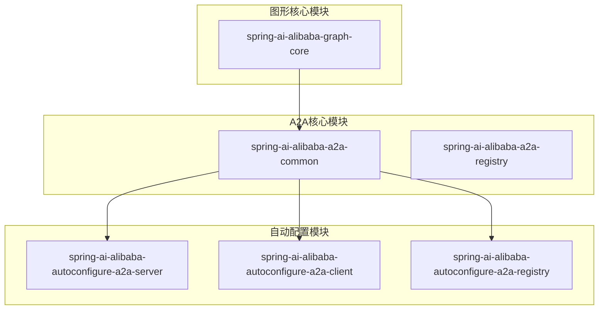
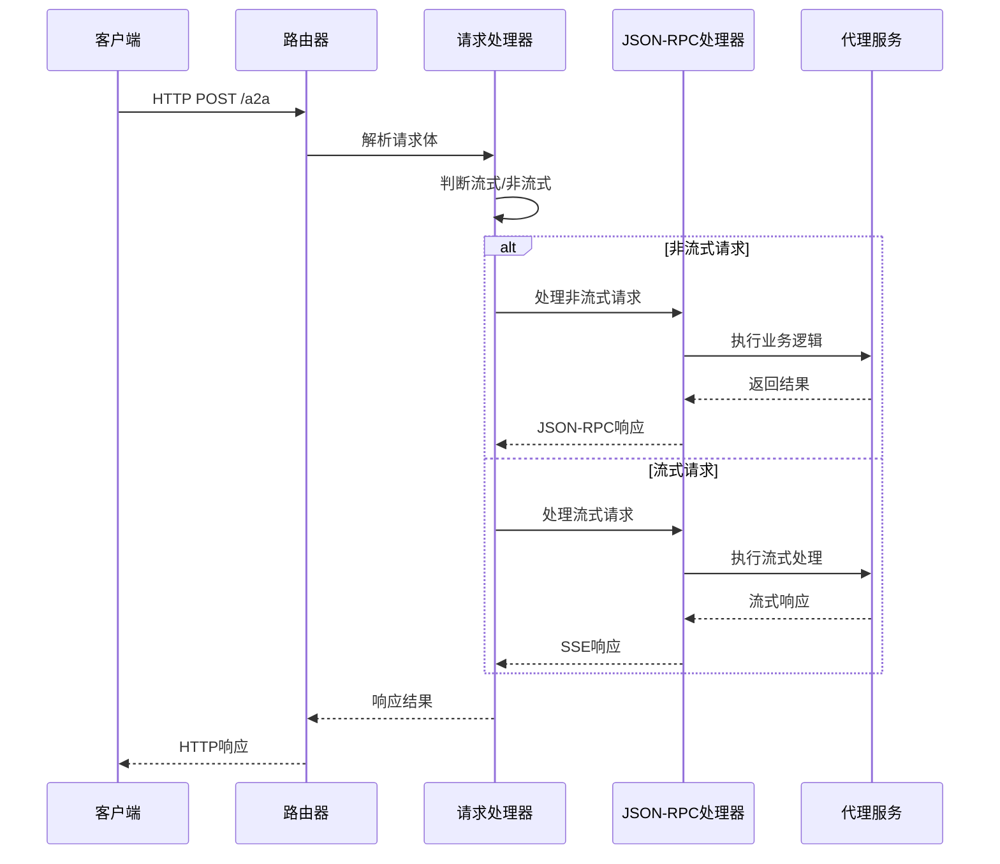
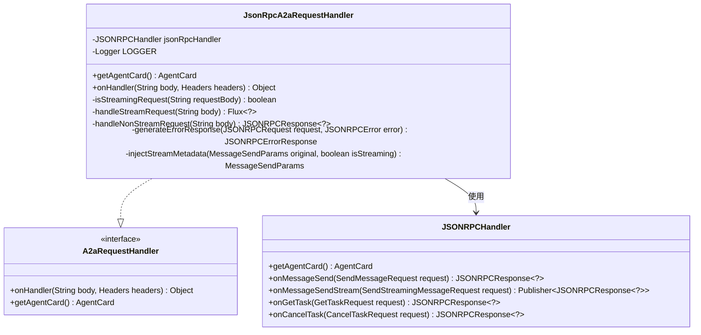
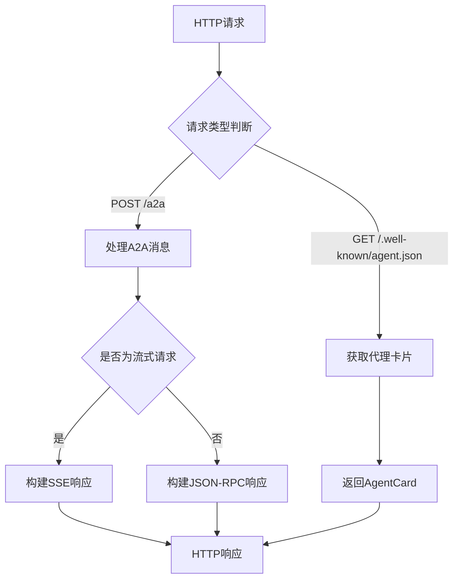
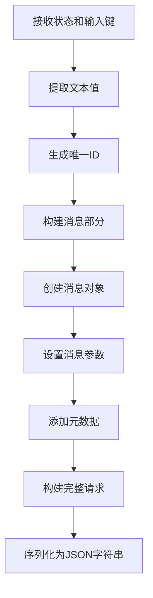

# A2A通信协议文档

<cite>
**本文档引用的文件**
- [A2aConstants.java](file://spring-ai-alibaba-a2a/spring-ai-alibaba-a2a-common/src/main/java/com/alibaba/cloud/ai/a2a/constants/A2aConstants.java)
- [JsonRpcA2aRequestHandler.java](file://spring-ai-alibaba-a2a/spring-ai-alibaba-a2a-common/src/main/java/com/alibaba/cloud/ai/a2a/server/JsonRpcA2aRequestHandler.java)
- [A2aRequestHandler.java](file://spring-ai-alibaba-a2a/spring-ai-alibaba-a2a-common/src/main/java/com/alibaba/cloud/ai/a2a/server/A2aRequestHandler.java)
- [JsonRpcA2aRouterProvider.java](file://spring-ai-alibaba-a2a/spring-ai-alibaba-a2a-common/src/main/java/com/alibaba/cloud/ai/a2a/route/JsonRpcA2aRouterProvider.java)
- [A2aServerProperties.java](file://spring-ai-alibaba-a2a/spring-ai-alibaba-a2a-common/src/main/java/com/alibaba/cloud/ai/a2a/A2aServerProperties.java)
- [A2aClientAgentCardProperties.java](file://spring-ai-alibaba-a2a/spring-ai-alibaba-a2a-common/src/main/java/com/alibaba/cloud/ai/a2a/A2aClientAgentCardProperties.java)
- [A2aServerHandlerAutoConfiguration.java](file://auto-configurations/spring-ai-alibaba-autoconfigure-a2a-server/src/main/java/com/alibaba/cloud/ai/autoconfigure/a2a/server/A2aServerHandlerAutoConfiguration.java)
- [A2aServerAutoConfiguration.java](file://auto-configurations/spring-ai-alibaba-autoconfigure-a2a-server/src/main/java/com/alibaba/cloud/ai/autoconfigure/a2a/server/A2aServerAutoConfiguration.java)
- [ServerTypeEnum.java](file://spring-ai-alibaba-a2a/spring-ai-alibaba-a2a-common/src/main/java/com/alibaba/cloud/ai/a2a/server/ServerTypeEnum.java)
- [A2aNode.java](file://spring-ai-alibaba-graph-core/src/main/java/com/alibaba/cloud/ai/graph/agent/a2a/A2aNode.java)
- [A2aNodeWithConfig.java](file://spring-ai-alibaba-graph-core/src/main/java/com/alibaba/cloud/ai/graph/agent/a2a/A2aNodeWithConfig.java)
</cite>

## 目录
1. [简介](#简介)
2. [项目结构](#项目结构)
3. [核心组件](#核心组件)
4. [架构概览](#架构概览)
5. [详细组件分析](#详细组件分析)
6. [消息格式与序列化](#消息格式与序列化)
7. [协议版本控制](#协议版本控制)
8. [安全考虑](#安全考虑)
9. [故障排除指南](#故障排除指南)
10. [结论](#结论)

## 简介

A2A（Agent-to-Agent）通信协议是一个基于JSON-RPC 2.0标准的分布式代理通信框架。该协议为AI代理系统提供了标准化的通信机制，支持消息传递、任务管理和推送通知等功能。本文档详细描述了基于JSON-RPC的通信机制，包括消息格式、请求/响应结构以及序列化规范。

## 项目结构

A2A通信协议的核心实现分布在以下模块中：



**图表来源**
- [A2aServerHandlerAutoConfiguration.java](file://auto-configurations/spring-ai-alibaba-autoconfigure-a2a-server/src/main/java/com/alibaba/cloud/ai/autoconfigure/a2a/server/A2aServerHandlerAutoConfiguration.java#L1-L117)
- [A2aServerAutoConfiguration.java](file://auto-configurations/spring-ai-alibaba-autoconfigure-a2a-server/src/main/java/com/alibaba/cloud/ai/autoconfigure/a2a/server/A2aServerAutoConfiguration.java#L1-L48)

**章节来源**
- [A2aConstants.java](file://spring-ai-alibaba-a2a/spring-ai-alibaba-a2a-common/src/main/java/com/alibaba/cloud/ai/a2a/constants/A2aConstants.java#L1-L37)
- [A2aServerProperties.java](file://spring-ai-alibaba-a2a/spring-ai-alibaba-a2a-common/src/main/java/com/alibaba/cloud/ai/a2a/A2aServerProperties.java#L1-L130)

## 核心组件

### A2A常量定义

A2A协议定义了一系列关键常量，用于统一管理协议版本和传输类型：

```java
public class A2aConstants {
    public static final String DEFAULT_A2A_PROTOCOL_VERSION = "0.2.5";
    public static final String DEFAULT_AGENT_VERSION = "1.0.0";
    public static final String AGENT_TRANSPORT_TYPE_JSON_RPC = "JSONRPC";
    public static final String AGENT_TRANSPORT_TYPE_GRPC = "GRPC";
    public static final String AGENT_TRANSPORT_TYPE_REST = "HTTP+JSON";
}
```

### 服务器类型枚举

```java
public enum ServerTypeEnum {
    JSON_RPC("jsonrpc"),
    GRPC("grpc"), 
    REST("rest");
    
    private final String type;
    
    ServerTypeEnum(String type) {
        this.type = type;
    }
    
    public String getType() {
        return type;
    }
}
```

**章节来源**
- [A2aConstants.java](file://spring-ai-alibaba-a2a/spring-ai-alibaba-a2a-common/src/main/java/com/alibaba/cloud/ai/a2a/constants/A2aConstants.java#L25-L36)
- [ServerTypeEnum.java](file://spring-ai-alibaba-a2a/spring-ai-alibaba-a2a-common/src/main/java/com/alibaba/cloud/ai/a2a/server/ServerTypeEnum.java#L25-L52)

## 架构概览

A2A通信协议采用分层架构设计，包含路由层、处理层和传输层：



**图表来源**
- [JsonRpcA2aRequestHandler.java](file://spring-ai-alibaba-a2a/spring-ai-alibaba-a2a-common/src/main/java/com/alibaba/cloud/ai/a2a/server/JsonRpcA2aRequestHandler.java#L75-L96)
- [JsonRpcA2aRouterProvider.java](file://spring-ai-alibaba-a2a/spring-ai-alibaba-a2a-common/src/main/java/com/alibaba/cloud/ai/a2a/route/JsonRpcA2aRouterProvider.java#L73-L118)

## 详细组件分析

### JSON-RPC请求处理器

`JsonRpcA2aRequestHandler`是A2A协议的核心处理器，实现了`A2aRequestHandler`接口：



**图表来源**
- [JsonRpcA2aRequestHandler.java](file://spring-ai-alibaba-a2a/spring-ai-alibaba-a2a-common/src/main/java/com/alibaba/cloud/ai/a2a/server/JsonRpcA2aRequestHandler.java#L50-L173)
- [A2aRequestHandler.java](file://spring-ai-alibaba-a2a/spring-ai-alibaba-a2a-common/src/main/java/com/alibaba/cloud/ai/a2a/server/A2aRequestHandler.java#L25-L33)

#### 请求处理流程

处理器根据请求类型分为两种处理路径：

1. **非流式请求处理**：
```java
private JSONRPCResponse<?> handleNonStreamRequest(String body) throws JsonProcessingException {
    NonStreamingJSONRPCRequest<?> request = Utils.OBJECT_MAPPER.readValue(body, NonStreamingJSONRPCRequest.class);
    if (request instanceof GetTaskRequest req) {
        return jsonRpcHandler.onGetTask(req);
    }
    else if (request instanceof SendMessageRequest req) {
        // 注入流式元数据并处理消息发送
        SendMessageRequest.Builder newReqBuilder = new SendMessageRequest.Builder()
            .id(req.getId())
            .jsonrpc(req.getJsonrpc())
            .method(req.getMethod())
            .params(injectStreamMetadata(req.getParams(), false));
        return jsonRpcHandler.onMessageSend(newReqBuilder.build());
    }
    // 其他请求类型...
}
```

2. **流式请求处理**：
```java
private Flux<?> handleStreamRequest(String body) throws JsonProcessingException {
    StreamingJSONRPCRequest<?> request = Utils.OBJECT_MAPPER.readValue(body, StreamingJSONRPCRequest.class);
    Flow.Publisher<? extends JSONRPCResponse<?>> publisher;
    
    if (request instanceof SendStreamingMessageRequest req) {
        // 处理流式消息发送
        publisher = jsonRpcHandler.onMessageSendStream(newReqBuilder.build());
    }
    else if (request instanceof TaskResubscriptionRequest req) {
        // 处理任务重新订阅
        publisher = jsonRpcHandler.onResubscribeToTask(req);
    }
    
    return Flux.from(FlowAdapters.toPublisher(publisher))
        .map(response -> response)
        .delaySubscription(Duration.ofMillis(10));
}
```

**章节来源**
- [JsonRpcA2aRequestHandler.java](file://spring-ai-alibaba-a2a/spring-ai-alibaba-a2a-common/src/main/java/com/alibaba/cloud/ai/a2a/server/JsonRpcA2aRequestHandler.java#L121-L173)

### 路由提供者

`JsonRpcA2aRouterProvider`负责HTTP路由的配置：



**图表来源**
- [JsonRpcA2aRouterProvider.java](file://spring-ai-alibaba-a2a/spring-ai-alibaba-a2a-common/src/main/java/com/alibaba/cloud/ai/a2a/route/JsonRpcA2aRouterProvider.java#L55-L72)

**章节来源**
- [JsonRpcA2aRouterProvider.java](file://spring-ai-alibaba-a2a/spring-ai-alibaba-a2a-common/src/main/java/com/alibaba/cloud/ai/a2a/route/JsonRpcA2aRouterProvider.java#L37-L118)

## 消息格式与序列化

### JSON-RPC 2.0消息格式

A2A协议严格遵循JSON-RPC 2.0规范，支持以下几种请求类型：

#### 1. 消息发送请求（非流式）
```json
{
  "id": "unique-request-id",
  "jsonrpc": "2.0",
  "method": "message/send",
  "params": {
    "message": {
      "kind": "message",
      "messageId": "generated-message-id",
      "parts": [
        {
          "kind": "text",
          "text": "用户输入文本"
        }
      ],
      "role": "user"
    },
    "metadata": {
      "threadId": "optional-thread-id",
      "userId": "optional-user-id"
    }
  }
}
```

#### 2. 消息发送请求（流式）
```json
{
  "id": "unique-request-id",
  "jsonrpc": "2.0",
  "method": "message/stream",
  "params": {
    "message": {
      "kind": "message",
      "messageId": "generated-message-id",
      "parts": [
        {
          "kind": "text",
          "text": "用户输入文本"
        }
      ],
      "role": "user"
    },
    "metadata": {
      "streaming": true
    }
  }
}
```

#### 3. 任务获取请求
```json
{
  "id": "unique-request-id",
  "jsonrpc": "2.0",
  "method": "task/get",
  "params": {
    "taskId": "task-identifier"
  }
}
```

#### 4. 任务取消请求
```json
{
  "id": "unique-request-id", 
  "jsonrpc": "2.0",
  "method": "task/cancel",
  "params": {
    "taskId": "task-identifier"
  }
}
```

### 消息构建过程

A2A节点负责构建JSON-RPC消息：



**图表来源**
- [A2aNode.java](file://spring-ai-alibaba-graph-core/src/main/java/com/alibaba/cloud/ai/graph/agent/a2a/A2aNode.java#L570-L640)

**章节来源**
- [A2aNode.java](file://spring-ai-alibaba-graph-core/src/main/java/com/alibaba/cloud/ai/graph/agent/a2a/A2aNode.java#L570-L640)
- [A2aNodeWithConfig.java](file://spring-ai-alibaba-graph-core/src/main/java/com/alibaba/cloud/ai/graph/agent/a2a/A2aNodeWithConfig.java#L565-L641)

## 协议版本控制

### 版本标识

A2A协议使用语义版本控制：

- **协议版本**：`0.2.5`（默认）
- **代理版本**：`1.0.0`（默认）
- **传输类型**：支持JSON-RPC、gRPC和REST三种传输方式

### 向后兼容性策略

1. **版本检查**：客户端和服务器在握手时交换版本信息
2. **功能降级**：当客户端版本较低时，服务器提供兼容的功能子集
3. **扩展点**：新功能通过可选参数添加，不影响现有功能

**章节来源**
- [A2aConstants.java](file://spring-ai-alibaba-a2a/spring-ai-alibaba-a2a-common/src/main/java/com/alibaba/cloud/ai/a2a/constants/A2aConstants.java#L25-L36)

## 安全考虑

### 认证机制

A2A协议支持多种认证方式：

1. **HTTP基本认证**：适用于开发环境
2. **Bearer Token**：推荐的生产环境认证方式
3. **自定义认证头**：支持特定的认证方案

### 数据完整性保护

1. **HTTPS传输**：所有通信必须使用TLS加密
2. **消息签名**：支持对JSON-RPC消息进行数字签名
3. **防重放攻击**：通过请求ID和时间戳防止重放攻击

### 访问控制

1. **IP白名单**：限制访问源IP地址
2. **速率限制**：防止DDoS攻击
3. **权限验证**：基于角色的访问控制（RBAC）

## 故障排除指南

### 常见错误类型

1. **JSON解析错误**：
   - 错误码：`-32700`
   - 原因：请求体不是有效的JSON格式
   - 解决方案：检查请求体格式，确保符合JSON-RPC规范

2. **方法未找到错误**：
   - 错误码：`-32601`
   - 原因：请求的方法名不存在
   - 解决方案：确认方法名称拼写正确

3. **参数错误**：
   - 错误码：`-32602`
   - 原因：请求参数格式或类型不正确
   - 解决方案：检查参数结构和数据类型

### 调试技巧

1. **启用日志记录**：
```java
private static final Logger LOGGER = LoggerFactory.getLogger(JsonRpcA2aRequestHandler.class);
LOGGER.info("get Stream publisher {}", publisher);
```

2. **验证消息格式**：
```java
private static boolean isStreamingRequest(String requestBody) {
    try {
        JsonNode node = Utils.OBJECT_MAPPER.readTree(requestBody);
        JsonNode method = node != null ? node.get("method") : null;
        return method != null && (SendStreamingMessageRequest.METHOD.equals(method.asText())
                || TaskResubscriptionRequest.METHOD.equals(method.asText()));
    }
    catch (Exception e) {
        return false;
    }
}
```

3. **监控网络连接**：
```java
private String sendMessageToServer(AgentCardWrapper agentCard, String requestPayload) throws Exception {
    String baseUrl = resolveAgentBaseUrl(agentCard);
    if (baseUrl == null || baseUrl.isBlank()) {
        throw new IllegalStateException("AgentCard.url is empty");
    }
    // 发送HTTP请求并验证响应
}
```

**章节来源**
- [JsonRpcA2aRequestHandler.java](file://spring-ai-alibaba-a2a/spring-ai-alibaba-a2a-common/src/main/java/com/alibaba/cloud/ai/a2a/server/JsonRpcA2aRequestHandler.java#L85-L96)
- [JsonRpcA2aRequestHandler.java](file://spring-ai-alibaba-a2a/spring-ai-alibaba-a2a-common/src/main/java/com/alibaba/cloud/ai/a2a/server/JsonRpcA2aRequestHandler.java#L650-L683)

## 结论

A2A通信协议提供了一个强大而灵活的分布式代理通信框架。通过基于JSON-RPC 2.0的标准实现，该协议确保了跨平台的互操作性和可扩展性。主要优势包括：

1. **标准化**：严格遵循JSON-RPC 2.0规范
2. **灵活性**：支持流式和非流式通信模式
3. **安全性**：内置认证和数据完整性保护机制
4. **可扩展性**：支持多种传输协议和认证方式
5. **易用性**：提供完整的自动配置和集成支持

该协议为构建复杂的AI代理生态系统奠定了坚实的基础，支持从简单的消息传递到复杂的工作流编排等各种应用场景。