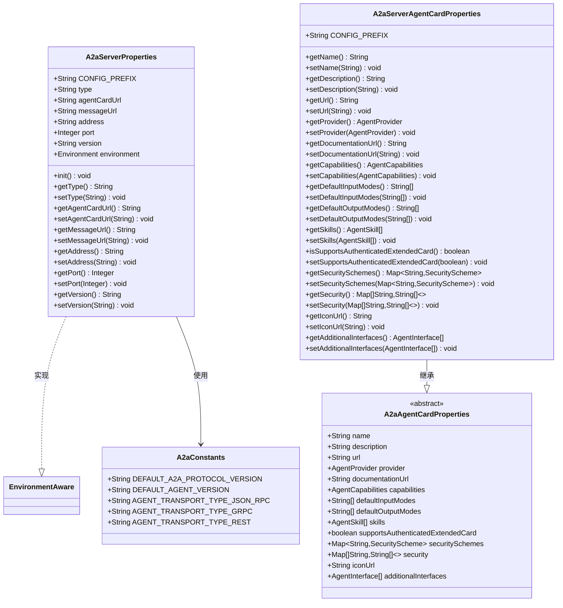
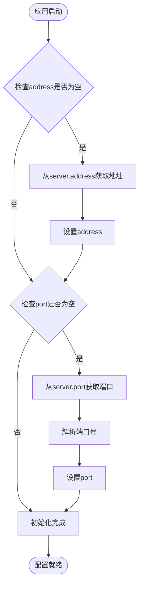
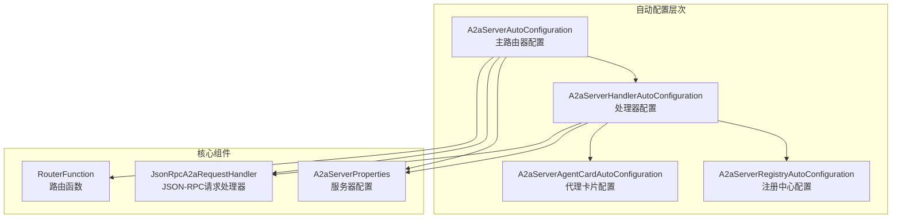
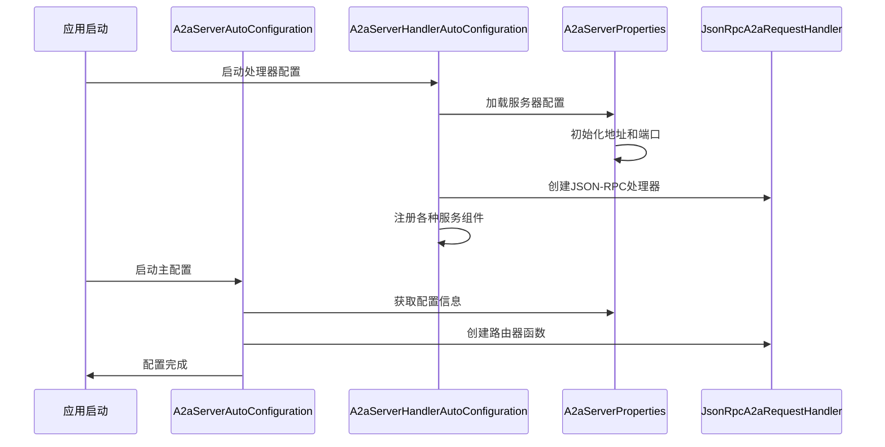
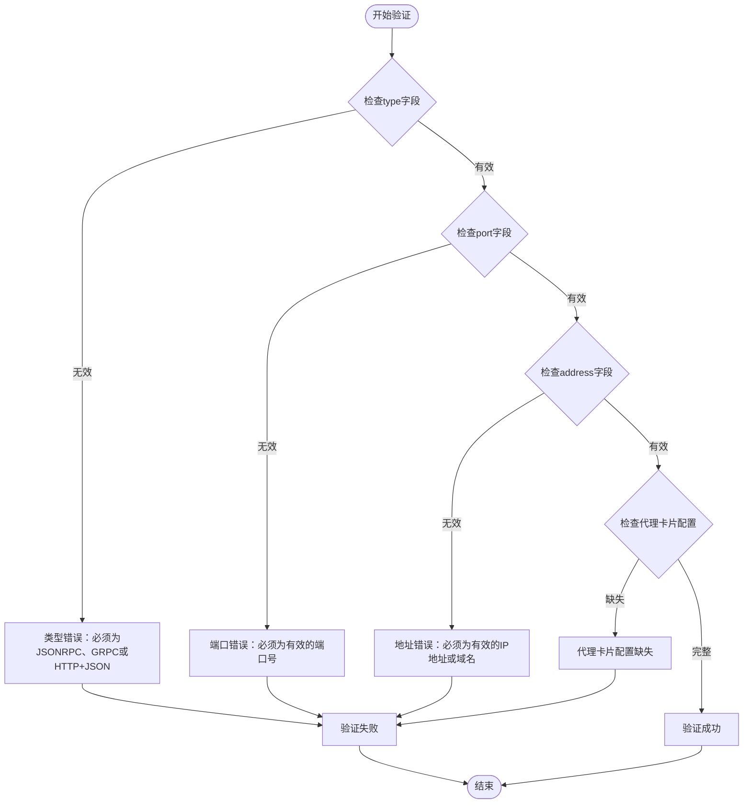

# A2A服务端配置文档

<cite>
**本文档引用的文件**
- [A2aServerProperties.java](file://spring-ai-alibaba-a2a/spring-ai-alibaba-a2a-common/src/main/java/com/alibaba/cloud/ai/a2a/A2aServerProperties.java)
- [A2aServerAgentCardProperties.java](file://spring-ai-alibaba-a2a/spring-ai-alibaba-a2a-common/src/main/java/com/alibaba/cloud/ai/a2a/A2aServerAgentCardProperties.java)
- [A2aAgentCardProperties.java](file://spring-ai-alibaba-a2a/spring-ai-alibaba-a2a-common/src/main/java/com/alibaba/cloud/ai/a2a/A2aAgentCardProperties.java)
- [A2aConstants.java](file://spring-ai-alibaba-a2a/spring-ai-alibaba-a2a-common/src/main/java/com/alibaba/cloud/ai/a2a/constants/A2aConstants.java)
- [JsonRpcA2aRouterProvider.java](file://spring-ai-alibaba-a2a/spring-ai-alibaba-a2a-common/src/main/java/com/alibaba/cloud/ai/a2a/route/JsonRpcA2aRouterProvider.java)
- [A2aServerAutoConfiguration.java](file://auto-configurations/spring-ai-alibaba-autoconfigure-a2a-server/src/main/java/com/alibaba/cloud/ai/autoconfigure/a2a/server/A2aServerAutoConfiguration.java)
- [A2aServerHandlerAutoConfiguration.java](file://auto-configurations/spring-ai-alibaba-autoconfigure-a2a-server/src/main/java/com/alibaba/cloud/ai/autoconfigure/a2a/server/A2aServerHandlerAutoConfiguration.java)
- [additional-spring-configuration-metadata.json](file://auto-configurations/spring-ai-alibaba-autoconfigure-a2a-server/src/main/resources/META-INF/additional-spring-configuration-metadata.json)
</cite>

## 目录
1. [简介](#简介)
2. [核心配置类概述](#核心配置类概述)
3. [A2aServerProperties配置详解](#a2aserverproperties配置详解)
4. [A2aServerAgentCardProperties配置详解](#a2aserveragentcardproperties配置详解)
5. [自动配置机制](#自动配置机制)
6. [配置示例](#配置示例)
7. [配置验证与最佳实践](#配置验证与最佳实践)
8. [故障排除指南](#故障排除指南)
9. [总结](#总结)

## 简介

A2A（Agent-to-Agent）协议是阿里巴巴云AI平台提供的智能代理通信标准。A2A服务端配置允许开发者自定义智能代理服务器的行为和特性，包括网络配置、代理卡片信息、传输协议类型等关键参数。

本文档详细介绍了A2A服务端的所有配置选项，帮助开发者根据不同的部署环境和业务需求进行定制化配置。

## 核心配置类概述

A2A服务端配置主要由以下核心类组成：



**图表来源**
- [A2aServerProperties.java](file://spring-ai-alibaba-a2a/spring-ai-alibaba-a2a-common/src/main/java/com/alibaba/cloud/ai/a2a/A2aServerProperties.java#L38-L129)
- [A2aServerAgentCardProperties.java](file://spring-ai-alibaba-a2a/spring-ai-alibaba-a2a-common/src/main/java/com/alibaba/cloud/ai/a2a/A2aServerAgentCardProperties.java#L29-L36)
- [A2aAgentCardProperties.java](file://spring-ai-alibaba-a2a/spring-ai-alibaba-a2a-common/src/main/java/com/alibaba/cloud/ai/a2a/A2aAgentCardProperties.java#L30-L175)
- [A2aConstants.java](file://spring-ai-alibaba-a2a/spring-ai-alibaba-a2a-common/src/main/java/com/alibaba/cloud/ai/a2a/constants/A2aConstants.java#L23-L36)

## A2aServerProperties配置详解

### 基本配置属性

`A2aServerProperties`类提供了A2A服务端的核心配置选项：

#### 1. 传输协议类型配置

```yaml
spring:
  ai:
    alibaba:
      a2a:
        server:
          type: JSONRPC
```

**配置项说明：**
- **类型：** `String`
- **默认值：** `JSONRPC`
- **可选值：** `JSONRPC`, `GRPC`, `HTTP+JSON`
- **描述：** 指定A2A服务器使用的传输协议类型

#### 2. 路由URL配置

```yaml
spring:
  ai:
    alibaba:
      a2a:
        server:
          agent-card-url: /.well-known/agent.json
          message-url: /a2a
```

**配置项说明：**
- **agent-card-url：** 代理卡片发现URL，默认为`/.well-known/agent.json`
- **message-url：** A2A消息处理基础路径，默认为`/a2a`

#### 3. 网络地址和端口配置

```yaml
spring:
  ai:
    alibaba:
      a2a:
        server:
          address: ${server.address}
          port: ${server.port}
```

**配置项说明：**
- **address：** 服务器监听地址，默认从`server.address`占位符解析
- **port：** 服务器监听端口，默认从`server.port`占位符解析

#### 4. 版本配置

```yaml
spring:
  ai:
    alibaba:
      a2a:
        server:
          version: 1.0.0
```

**配置项说明：**
- **版本：** A2A服务器版本号，默认为`1.0.0`

### 配置初始化机制

`A2aServerProperties`实现了`EnvironmentAware`接口，在应用启动时会自动初始化配置：



**图表来源**
- [A2aServerProperties.java](file://spring-ai-alibaba-a2a/spring-ai-alibaba-a2a-common/src/main/java/com/alibaba/cloud/ai/a2a/A2aServerProperties.java#L50-L68)

**章节来源**
- [A2aServerProperties.java](file://spring-ai-alibaba-a2a/spring-ai-alibaba-a2a-common/src/main/java/com/alibaba/cloud/ai/a2a/A2aServerProperties.java#L38-L129)

## A2aServerAgentCardProperties配置详解

### 代理卡片基本信息

代理卡片是A2A协议中用于描述智能代理特征的重要组件，包含了代理的基本信息、能力描述、技能列表等。

#### 1. 基础信息配置

```yaml
spring:
  ai:
    alibaba:
      a2a:
        server:
          card:
            name: "我的智能代理"
            description: "一个功能强大的AI智能代理"
            url: "https://example.com/agent"
            documentation-url: "https://example.com/docs"
            icon-url: "https://example.com/icon.png"
```

#### 2. 提供商信息配置

```yaml
spring:
  ai:
    alibaba:
      a2a:
        server:
          card:
            provider:
              name: "阿里巴巴云"
              url: "https://www.aliyun.com"
              contact-info: "support@example.com"
```

#### 3. 能力和技能配置

```yaml
spring:
  ai:
    alibaba:
      a2a:
        server:
          card:
            capabilities:
              input-modes:
                - "text"
                - "image"
                - "audio"
              output-modes:
                - "text"
                - "streaming"
              supported-formats:
                - "json"
                - "xml"
            skills:
              - name: "文本生成"
                description: "生成高质量文本内容"
                input-modes:
                  - "text"
                output-modes:
                  - "text"
              - name: "图像识别"
                description: "识别和分析图像内容"
                input-modes:
                  - "image"
                output-modes:
                  - "text"
```

#### 4. 安全配置

```yaml
spring:
  ai:
    alibaba:
      a2a:
        server:
          card:
            supports-authenticated-extended-card: true
            security-schemes:
              bearer:
                type: "http"
                scheme: "bearer"
                bearer-format: "jwt"
            security:
              - bearer:
                  - "read"
                  - "write"
```

### 高级配置选项

#### 1. 输入输出模式配置

```yaml
spring:
  ai:
    alibaba:
      a2a:
        server:
          card:
            default-input-modes:
              - "text"
              - "image"
            default-output-modes:
              - "text"
              - "streaming"
```

#### 2. 扩展接口配置

```yaml
spring:
  ai:
    alibaba:
      a2a:
        server:
          card:
            additional-interfaces:
              - name: "工具调用"
                version: "1.0"
                url: "/tools"
              - name: "状态查询"
                version: "1.0"
                url: "/status"
```

**章节来源**
- [A2aServerAgentCardProperties.java](file://spring-ai-alibaba-a2a/spring-ai-alibaba-a2a-common/src/main/java/com/alibaba/cloud/ai/a2a/A2aServerAgentCardProperties.java#L29-L36)
- [A2aAgentCardProperties.java](file://spring-ai-alibaba-a2a/spring-ai-alibaba-a2a-common/src/main/java/com/alibaba/cloud/ai/a2a/A2aAgentCardProperties.java#L30-L175)

## 自动配置机制

### 配置类层次结构



**图表来源**
- [A2aServerAutoConfiguration.java](file://auto-configurations/spring-ai-alibaba-autoconfigure-a2a-server/src/main/java/com/alibaba/cloud/ai/autoconfigure/a2a/server/A2aServerAutoConfiguration.java#L29-L46)
- [A2aServerHandlerAutoConfiguration.java](file://auto-configurations/spring-ai-alibaba-autoconfigure-a2a-server/src/main/java/com/alibaba/cloud/ai/autoconfigure/a2a/server/A2aServerHandlerAutoConfiguration.java#L47-L116)

### 条件配置机制

自动配置类使用了Spring Boot的条件注解来实现智能配置：



**图表来源**
- [A2aServerAutoConfiguration.java](file://auto-configurations/spring-ai-alibaba-autoconfigure-a2a-server/src/main/java/com/alibaba/cloud/ai/autoconfigure/a2a/server/A2aServerAutoConfiguration.java#L32-L46)
- [A2aServerHandlerAutoConfiguration.java](file://auto-configurations/spring-ai-alibaba-autoconfigure-a2a-server/src/main/java/com/alibaba/cloud/ai/autoconfigure/a2a/server/A2aServerHandlerAutoConfiguration.java#L47-L116)

**章节来源**
- [A2aServerAutoConfiguration.java](file://auto-configurations/spring-ai-alibaba-autoconfigure-a2a-server/src/main/java/com/alibaba/cloud/ai/autoconfigure/a2a/server/A2aServerAutoConfiguration.java#L29-L46)
- [A2aServerHandlerAutoConfiguration.java](file://auto-configurations/spring-ai-alibaba-autoconfigure-a2a-server/src/main/java/com/alibaba/cloud/ai/autoconfigure/a2a/server/A2aServerHandlerAutoConfiguration.java#L47-L116)

## 配置示例

### 开发环境配置

```yaml
# 开发环境配置
spring:
  ai:
    alibaba:
      a2a:
        server:
          type: JSONRPC
          address: localhost
          port: 8080
          version: 1.0.0
          agent-card-url: /.well-known/agent.json
          message-url: /a2a
        server:
          card:
            name: "开发智能代理"
            description: "用于开发和测试的智能代理"
            url: "http://localhost:8080"
            documentation-url: "http://localhost:8080/docs"
            icon-url: "http://localhost:8080/icon.png"
            provider:
              name: "本地开发团队"
              url: "http://localhost"
            capabilities:
              input-modes:
                - "text"
                - "image"
              output-modes:
                - "text"
                - "streaming"
            default-input-modes:
              - "text"
            default-output-modes:
              - "text"
            supports-authenticated-extended-card: false
```

### 生产环境配置

```yaml
# 生产环境配置
spring:
  ai:
    alibaba:
      a2a:
        server:
          type: JSONRPC
          address: ${SERVER_ADDRESS:0.0.0.0}
          port: ${SERVER_PORT:8080}
          version: 1.0.0
          agent-card-url: /.well-known/agent.json
          message-url: /a2a
        server:
          card:
            name: "企业级智能代理"
            description: "为企业提供智能化解决方案的代理服务"
            url: "https://${DOMAIN_NAME}/agent"
            documentation-url: "https://${DOMAIN_NAME}/docs"
            icon-url: "https://${DOMAIN_NAME}/icon.png"
            provider:
              name: "阿里巴巴云"
              url: "https://www.aliyun.com"
              contact-info: "support@aliyun.com"
            capabilities:
              input-modes:
                - "text"
                - "image"
                - "audio"
                - "video"
              output-modes:
                - "text"
                - "streaming"
                - "file"
              supported-formats:
                - "json"
                - "xml"
                - "csv"
                - "pdf"
            skills:
              - name: "文档分析"
                description: "分析和理解各种格式的文档"
                input-modes:
                  - "text"
                  - "file"
                output-modes:
                  - "text"
              - name: "多模态理解"
                description: "理解和处理多种媒体格式"
                input-modes:
                  - "image"
                  - "audio"
                  - "video"
                output-modes:
                  - "text"
            default-input-modes:
              - "text"
              - "image"
            default-output-modes:
              - "text"
              - "streaming"
            supports-authenticated-extended-card: true
            security-schemes:
              bearer:
                type: "http"
                scheme: "bearer"
                bearer-format: "jwt"
            security:
              - bearer:
                  - "read"
                  - "write"
                  - "admin"
```

### 高可用部署配置

```yaml
# 高可用部署配置
spring:
  ai:
    alibaba:
      a2a:
        server:
          type: JSONRPC
          address: ${SERVER_ADDRESS:0.0.0.0}
          port: ${SERVER_PORT:8080}
          version: 1.0.0
          agent-card-url: /.well-known/agent.json
          message-url: /a2a
        server:
          card:
            name: "高可用智能代理集群"
            description: "支持负载均衡和故障转移的智能代理集群"
            url: "https://${LOAD_BALANCER_DOMAIN}/agent"
            documentation-url: "https://${LOAD_BALANCER_DOMAIN}/docs"
            icon-url: "https://${LOAD_BALANCER_DOMAIN}/icon.png"
            provider:
              name: "阿里巴巴云"
              url: "https://www.aliyun.com"
              contact-info: "support@aliyun.com"
            capabilities:
              input-modes:
                - "text"
                - "image"
                - "audio"
                - "video"
              output-modes:
                - "text"
                - "streaming"
                - "file"
              supported-formats:
                - "json"
                - "xml"
                - "csv"
                - "pdf"
                - "docx"
                - "pptx"
                - "xlsx"
            skills:
              - name: "大规模文档处理"
                description: "处理大量文档和数据集"
                input-modes:
                  - "file"
                output-modes:
                  - "text"
                  - "file"
              - name: "实时协作"
                description: "支持多人实时协作"
                input-modes:
                  - "text"
                  - "image"
                output-modes:
                  - "text"
                  - "streaming"
            default-input-modes:
              - "text"
              - "image"
              - "file"
            default-output-modes:
              - "text"
              - "streaming"
              - "file"
            supports-authenticated-extended-card: true
            security-schemes:
              bearer:
                type: "http"
                scheme: "bearer"
                bearer-format: "jwt"
              api-key:
                type: "apiKey"
                in: "header"
                name: "X-API-Key"
            security:
              - bearer:
                  - "read"
                  - "write"
              - api-key:
                  - "read"
                  - "write"
            additional-interfaces:
              - name: "健康检查"
                version: "1.0"
                url: "/health"
              - name: "性能监控"
                version: "1.0"
                url: "/metrics"
              - name: "配置管理"
                version: "1.0"
                url: "/config"
```

## 配置验证与最佳实践

### 配置验证规则

#### 1. 必需配置项验证



#### 2. 配置约束条件

**端口配置约束：**
- 端口号范围：1-65535
- 不应使用系统保留端口（1-1024）
- 在容器环境中应考虑端口映射

**地址配置约束：**
- 支持IPv4和IPv6地址
- 支持域名解析
- 生产环境建议使用域名而非IP地址

**代理卡片约束：**
- 必须提供name和description
- URL必须是有效的HTTP/HTTPS地址
- 安全配置必须成对出现

### 最佳实践建议

#### 1. 安全配置最佳实践

```yaml
# 推荐的安全配置
spring:
  ai:
    alibaba:
      a2a:
        server:
          card:
            supports-authenticated-extended-card: true
            security-schemes:
              bearer:
                type: "http"
                scheme: "bearer"
                bearer-format: "jwt"
              api-key:
                type: "apiKey"
                in: "header"
                name: "Authorization"
            security:
              - bearer:
                  - "read"
                  - "write"
              - api-key:
                  - "read"
```

#### 2. 性能优化配置

```yaml
# 性能优化配置
spring:
  ai:
    alibaba:
      a2a:
        server:
          type: JSONRPC
          port: ${SERVER_PORT:8080}
          # 使用默认的高效JSON-RPC协议
        server:
          card:
            capabilities:
              output-modes:
                - "text"
                - "streaming"  # 支持流式响应提高用户体验
```

#### 3. 监控和可观测性配置

```yaml
# 监控配置
spring:
  ai:
    alibaba:
      a2a:
        server:
          card:
            additional-interfaces:
              - name: "健康检查"
                version: "1.0"
                url: "/health"
              - name: "指标收集"
                version: "1.0"
                url: "/metrics"
              - name: "日志访问"
                version: "1.0"
                url: "/logs"
```

#### 4. 高可用配置

```yaml
# 高可用配置
spring:
  ai:
    alibaba:
      a2a:
        server:
          type: JSONRPC
          address: ${SERVER_ADDRESS:0.0.0.0}
          port: ${SERVER_PORT:8080}
          # 使用环境变量确保配置灵活性
        server:
          card:
            name: "高可用智能代理"
            description: "支持负载均衡和故障转移的智能代理"
            # 包含详细的故障转移信息
```

## 故障排除指南

### 常见配置问题

#### 1. 端口冲突问题

**问题现象：**
```
java.net.BindException: Address already in use
```

**解决方案：**
```bash
# 检查端口占用
netstat -tulpn | grep :8080

# 修改配置使用其他端口
spring:
  ai:
    alibaba:
      a2a:
        server:
          port: 8081
```

#### 2. 地址解析问题

**问题现象：**
```
java.net.UnknownHostException: mydomain.com
```

**解决方案：**
```yaml
# 使用IP地址替代域名
spring:
  ai:
    alibaba:
      a2a:
        server:
          address: 192.168.1.100

# 或者配置DNS解析
spring:
  ai:
    alibaba:
      a2a:
        server:
          address: ${SERVER_ADDRESS:mydomain.com}
```

#### 3. 代理卡片配置错误

**问题现象：**
```
AgentCard validation failed: missing required field 'name'
```

**解决方案：**
```yaml
spring:
  ai:
    alibaba:
      a2a:
        server:
          card:
            name: "正确的代理名称"
            description: "正确的代理描述"
            url: "https://correct-domain.com/agent"
```

### 配置调试技巧

#### 1. 启用详细日志

```yaml
logging:
  level:
    com.alibaba.cloud.ai.a2a: DEBUG
    org.springframework.boot.autoconfigure: DEBUG
```

#### 2. 验证配置加载

```bash
# 检查配置是否正确加载
curl http://localhost:8080/.well-known/agent.json

# 检查服务器是否正常运行
curl http://localhost:8080/a2a
```

#### 3. 使用配置验证工具

```yaml
# 添加配置验证
spring:
  ai:
    alibaba:
      a2a:
        server:
          type: ${A2A_TYPE:JSONRPC}  # 使用环境变量并提供默认值
          port: ${A2A_PORT:8080}
```

**章节来源**
- [A2aServerProperties.java](file://spring-ai-alibaba-a2a/spring-ai-alibaba-a2a-common/src/main/java/com/alibaba/cloud/ai/a2a/A2aServerProperties.java#L50-L68)
- [additional-spring-configuration-metadata.json](file://auto-configurations/spring-ai-alibaba-autoconfigure-a2a-server/src/main/resources/META-INF/additional-spring-configuration-metadata.json#L10-L146)

## 总结

A2A服务端配置提供了灵活而强大的配置选项，涵盖了从基本网络设置到高级安全配置的各个方面。通过合理配置这些选项，开发者可以：

1. **快速部署：** 利用默认配置快速启动A2A服务端
2. **灵活定制：** 根据不同环境和需求调整配置参数
3. **安全保障：** 实施完善的安全策略保护代理通信
4. **性能优化：** 通过合理的配置提升系统性能
5. **运维便利：** 集成监控和可观测性功能

在实际使用中，建议根据具体的部署环境和业务需求选择合适的配置组合，并遵循最佳实践来确保系统的稳定性和安全性。定期审查和更新配置也是维护系统健康的重要环节。

通过本文档的指导，开发者应该能够全面理解和掌握A2A服务端的所有配置选项，从而构建出符合业务需求的智能代理服务。