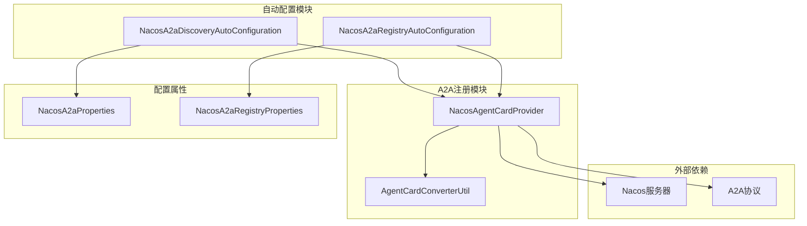
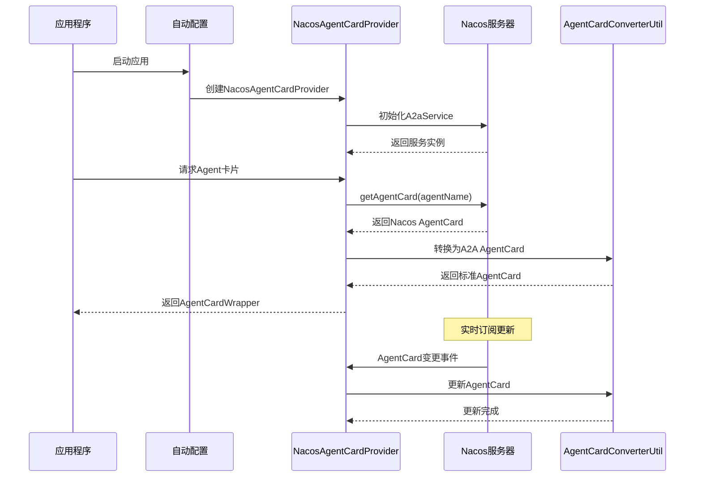
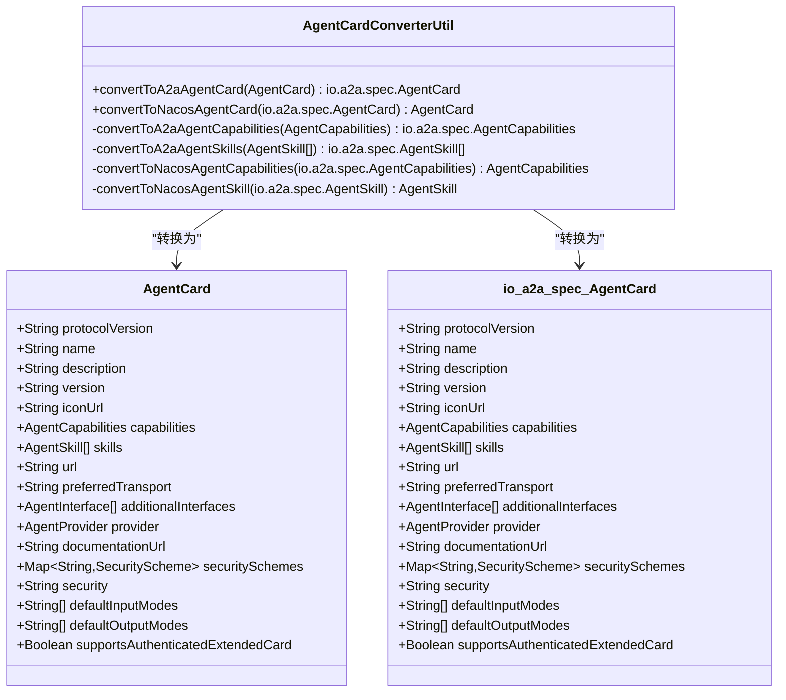
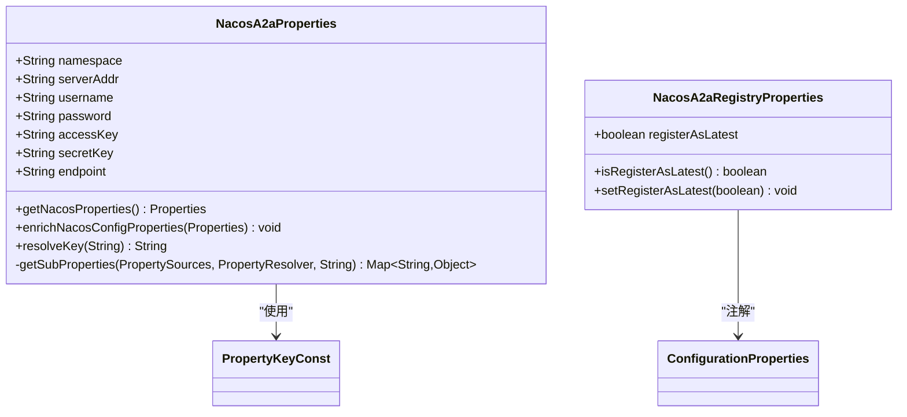
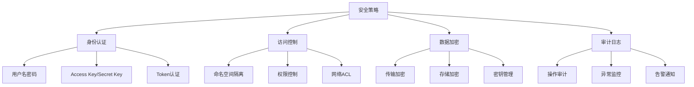

# Nacos集成

<cite>
**本文档引用的文件**
- [NacosA2aDiscoveryAutoConfiguration.java](file://auto-configurations/spring-ai-alibaba-autoconfigure-a2a-registry/src/main/java/com/alibaba/cloud/ai/autoconfigure/a2a/registry/nacos/NacosA2aDiscoveryAutoConfiguration.java)
- [NacosA2aRegistryAutoConfiguration.java](file://auto-configurations/spring-ai-alibaba-autoconfigure-a2a-registry/src/main/java/com/alibaba/cloud/ai/autoconfigure/a2a/registry/nacos/NacosA2aRegistryAutoConfiguration.java)
- [NacosAgentCardProvider.java](file://spring-ai-alibaba-a2a/spring-ai-alibaba-a2a-registry/src/main/java/com/alibaba/cloud/ai/a2a/registry/nacos/discovery/NacosAgentCardProvider.java)
- [NacosA2aProperties.java](file://spring-ai-alibaba-a2a/spring-ai-alibaba-a2a-registry/src/main/java/com/alibaba/cloud/ai/a2a/registry/nacos/properties/NacosA2aProperties.java)
- [NacosA2aRegistryProperties.java](file://spring-ai-alibaba-a2a/spring-ai-alibaba-a2a-registry/src/main/java/com/alibaba/cloud/ai/a2a/registry/nacos/register/NacosA2aRegistryProperties.java)
- [AgentCardConverterUtil.java](file://spring-ai-alibaba-a2a/spring-ai-alibaba-a2a-registry/src/main/java/com/alibaba/cloud/ai/a2a/registry/nacos/utils/AgentCardConverterUtil.java)
- [docker-compose.yaml](file://spring-ai-alibaba-studio/spring-ai-alibaba-studio-server/docker/middleware/docker-compose.yaml)
- [application.yml](file://spring-ai-alibaba-deepresearch/src/main/resources/application.yml)
</cite>

## 目录
1. [简介](#简介)
2. [项目结构](#项目结构)
3. [核心组件](#核心组件)
4. [架构概览](#架构概览)
5. [详细组件分析](#详细组件分析)
6. [配置参数清单](#配置参数清单)
7. [部署示例](#部署示例)
8. [安全考虑](#安全考虑)
9. [性能考量](#性能考量)
10. [故障排除指南](#故障排除指南)
11. [结论](#结论)

## 简介

Nacos（Naming and Configuration Service）是阿里巴巴开源的一个更易于构建云原生应用的动态服务发现、配置管理和服务管理平台。在Spring AI Alibaba项目中，Nacos被用作A2A（Agent-to-Agent）协议的服务注册中心，实现了双向兼容的Agent模型映射和管理。

本文档全面介绍了Nacos与A2A协议的集成方案，详细说明了NacosA2aDiscoveryAutoConfiguration如何基于Spring Boot自动装配机制初始化Nacos客户端并建立连接，以及NacosAgentCardProvider如何将A2A的Agent模型映射为Nacos的服务实例格式。

## 项目结构



**图表来源**
- [NacosA2aDiscoveryAutoConfiguration.java](file://auto-configurations/spring-ai-alibaba-autoconfigure-a2a-registry/src/main/java/com/alibaba/cloud/ai/autoconfigure/a2a/registry/nacos/NacosA2aDiscoveryAutoConfiguration.java#L25-L55)
- [NacosA2aRegistryAutoConfiguration.java](file://auto-configurations/spring-ai-alibaba-autoconfigure-a2a-registry/src/main/java/com/alibaba/cloud/ai/autoconfigure/a2a/registry/nacos/NacosA2aRegistryAutoConfiguration.java#L29-L69)

**章节来源**
- [NacosA2aDiscoveryAutoConfiguration.java](file://auto-configurations/spring-ai-alibaba-autoconfigure-a2a-registry/src/main/java/com/alibaba/cloud/ai/autoconfigure/a2a/registry/nacos/NacosA2aDiscoveryAutoConfiguration.java#L1-L55)
- [NacosA2aRegistryAutoConfiguration.java](file://auto-configurations/spring-ai-alibaba-autoconfigure-a2a-registry/src/main/java/com/alibaba/cloud/ai/autoconfigure/a2a/registry/nacos/NacosA2aRegistryAutoConfiguration.java#L1-L69)

## 核心组件

### NacosA2aDiscoveryAutoConfiguration

这是Nacos服务发现的核心自动配置类，负责基于Spring Boot的条件化自动装配机制初始化Nacos客户端。

```java
@AutoConfiguration(before = { A2aClientAgentCardProviderAutoConfiguration.class })
@ConditionalOnClass({ A2aClientAgentCardProviderAutoConfiguration.class })
@EnableConfigurationProperties({ NacosA2aProperties.class })
@ConditionalOnProperty(prefix = NacosA2aProperties.PREFIX, value = "discovery.enabled", havingValue = "true",
		matchIfMissing = true)
public class NacosA2aDiscoveryAutoConfiguration {
    
    @Bean
    @ConditionalOnMissingBean
    public A2aService a2aService(NacosA2aProperties nacosA2aProperties) throws NacosException {
        return AiFactory.createAiService(nacosA2aProperties.getNacosProperties());
    }

    @Bean
    public NacosAgentCardProvider nacosAgentCardProvider(A2aService a2aService) throws Exception {
        return new NacosAgentCardProvider(a2aService);
    }
}
```

### NacosAgentCardProvider

这个类实现了AgentCardProvider接口，负责从Nacos A2A注册中心获取Agent卡片信息，并支持实时更新。

```java
public class NacosAgentCardProvider implements AgentCardProvider {
    private final A2aService a2aService;
    private AgentCardWrapper agentCard;
    
    @Override
    public AgentCardWrapper getAgentCard(String agentName) {
        try {
            AgentCard nacosAgentCard = a2aService.getAgentCard(agentName);
            agentCard = new NacosAgentCardWrapper(AgentCardConverterUtil.convertToA2aAgentCard(nacosAgentCard));
            a2aService.subscribeAgentCard(agentName, new AbstractNacosAgentCardListener() {
                @Override
                public void onEvent(NacosAgentCardEvent event) {
                    AgentCard newAgentCard = event.getAgentCard();
                    agentCard.setAgentCard(AgentCardConverterUtil.convertToA2aAgentCard(newAgentCard));
                }
            });
            return agentCard;
        }
        catch (NacosException e) {
            throw new NacosRuntimeException(e.getErrCode(), e.getErrMsg());
        }
    }
}
```

**章节来源**
- [NacosA2aDiscoveryAutoConfiguration.java](file://auto-configurations/spring-ai-alibaba-autoconfigure-a2a-registry/src/main/java/com/alibaba/cloud/ai/autoconfigure/a2a/registry/nacos/NacosA2aDiscoveryAutoConfiguration.java#L25-L55)
- [NacosAgentCardProvider.java](file://spring-ai-alibaba-a2a/spring-ai-alibaba-a2a-registry/src/main/java/com/alibaba/cloud/ai/a2a/registry/nacos/discovery/NacosAgentCardProvider.java#L37-L84)

## 架构概览



**图表来源**
- [NacosAgentCardProvider.java](file://spring-ai-alibaba-a2a/spring-ai-alibaba-a2a-registry/src/main/java/com/alibaba/cloud/ai/a2a/registry/nacos/discovery/NacosAgentCardProvider.java#L52-L75)
- [AgentCardConverterUtil.java](file://spring-ai-alibaba-a2a/spring-ai-alibaba-a2a-registry/src/main/java/com/alibaba/cloud/ai/a2a/registry/nacos/utils/AgentCardConverterUtil.java#L36-L69)

## 详细组件分析

### AgentCard转换器

AgentCardConverterUtil负责在Nacos AgentCard和A2A标准AgentCard之间进行双向转换：



**图表来源**
- [AgentCardConverterUtil.java](file://spring-ai-alibaba-a2a/spring-ai-alibaba-a2a-registry/src/main/java/com/alibaba/cloud/ai/a2a/registry/nacos/utils/AgentCardConverterUtil.java#L36-L145)

### 配置属性管理

NacosA2aProperties类提供了完整的Nacos配置属性管理：



**图表来源**
- [NacosA2aProperties.java](file://spring-ai-alibaba-a2a/spring-ai-alibaba-a2a-registry/src/main/java/com/alibaba/cloud/ai/a2a/registry/nacos/properties/NacosA2aProperties.java#L40-L199)
- [NacosA2aRegistryProperties.java](file://spring-ai-alibaba-a2a/spring-ai-alibaba-a2a-registry/src/main/java/com/alibaba/cloud/ai/a2a/registry/nacos/register/NacosA2aRegistryProperties.java#L25-L40)

**章节来源**
- [AgentCardConverterUtil.java](file://spring-ai-alibaba-a2a/spring-ai-alibaba-a2a-registry/src/main/java/com/alibaba/cloud/ai/a2a/registry/nacos/utils/AgentCardConverterUtil.java#L1-L175)
- [NacosA2aProperties.java](file://spring-ai-alibaba-a2a/spring-ai-alibaba-a2a-registry/src/main/java/com/alibaba/cloud/ai/a2a/registry/nacos/properties/NacosA2aProperties.java#L40-L199)

## 配置参数清单

### 核心配置参数

| 参数名称 | 类型 | 默认值 | 描述 |
|---------|------|--------|------|
| `spring.ai.alibaba.a2a.nacos.namespace` | String | "public" | Nacos命名空间 |
| `spring.ai.alibaba.a2a.nacos.server-addr` | String | "127.0.0.1:8848" | Nacos服务器地址 |
| `spring.ai.alibaba.a2a.nacos.username` | String | - | 认证用户名 |
| `spring.ai.alibaba.a2a.nacos.password` | String | - | 认证密码 |
| `spring.ai.alibaba.a2a.nacos.access-key` | String | - | Access Key |
| `spring.ai.alibaba.a2a.nacos.secret-key` | String | - | Secret Key |
| `spring.ai.alibaba.a2a.nacos.endpoint` | String | - | Endpoint地址 |

### 注册配置参数

| 参数名称 | 类型 | 默认值 | 描述 |
|---------|------|--------|------|
| `spring.ai.alibaba.a2a.nacos.registry.enabled` | Boolean | true | 是否启用Nacos注册 |
| `spring.ai.alibaba.a2a.nacos.registry.register-as-latest` | Boolean | true | 是否注册为最新版本 |

### 配置示例

```yaml
spring:
  ai:
    alibaba:
      a2a:
        nacos:
          namespace: production
          server-addr: nacos.example.com:8848
          username: ${NACOS_USERNAME}
          password: ${NACOS_PASSWORD}
          registry:
            enabled: true
            register-as-latest: true
```

**章节来源**
- [NacosA2aProperties.java](file://spring-ai-alibaba-a2a/spring-ai-alibaba-a2a-registry/src/main/java/com/alibaba/cloud/ai/a2a/registry/nacos/properties/NacosA2aProperties.java#L40-L199)
- [NacosA2aRegistryProperties.java](file://spring-ai-alibaba-a2a/spring-ai-alibaba-a2a-registry/src/main/java/com/alibaba/cloud/ai/a2a/registry/nacos/register/NacosA2aRegistryProperties.java#L25-L40)

## 部署示例

### 开发环境配置

```yaml
# application-dev.yml
spring:
  ai:
    alibaba:
      a2a:
        nacos:
          namespace: development
          server-addr: localhost:8848
          registry:
            enabled: true
```

### 测试环境配置

```yaml
# application-test.yml
spring:
  ai:
    alibaba:
      a2a:
        nacos:
          namespace: test
          server-addr: nacos-test.example.com:8848
          username: ${NACOS_TEST_USER}
          password: ${NACOS_TEST_PASS}
          registry:
            enabled: true
```

### 生产环境配置

```yaml
# application-prod.yml
spring:
  ai:
    alibaba:
      a2a:
        nacos:
          namespace: production
          server-addr: nacos-prod.example.com:8848
          access-key: ${NACOS_PROD_ACCESS_KEY}
          secret-key: ${NACOS_PROD_SECRET_KEY}
          endpoint: nacos-prod.example.com:8848
          registry:
            enabled: true
            register-as-latest: true
```

### Docker Compose部署

```yaml
version: '3.8'
services:
  nacos:
    image: nacos/nacos-server:latest
    container_name: nacos-standalone-derby
    environment:
      - MODE=standalone
      - NACOS_AUTH_TOKEN=SecretKey012345678901234567890123456789012345678901234567890123456789
      - NACOS_AUTH_IDENTITY_KEY=serveridentity
      - NACOS_AUTH_IDENTITY_VALUE=security
    ports:
      - "8848:8848"
    volumes:
      - ./volumes/nacos:/home/nacos/data
    networks:
      - nacos-network

networks:
  nacos-network:
    driver: bridge
```

**章节来源**
- [docker-compose.yaml](file://spring-ai-alibaba-studio/spring-ai-alibaba-studio-server/docker/middleware/docker-compose.yaml#L120-L140)

## 安全考虑

### 传输加密

Nacos支持多种安全传输方式：

1. **HTTPS支持**：可以通过配置Nacos服务器启用HTTPS
2. **SSL/TLS配置**：支持自定义SSL证书
3. **网络隔离**：建议在专用网络中部署Nacos

### 访问控制

```yaml
# Nacos安全配置示例
spring:
  ai:
    alibaba:
      a2a:
        nacos:
          access-key: ${NACOS_ACCESS_KEY}
          secret-key: ${NACOS_SECRET_KEY}
          # 或者使用用户名密码认证
          username: ${NACOS_USERNAME}
          password: ${NACOS_PASSWORD}
```

### 凭证管理

1. **环境变量**：敏感信息应存储在环境变量中
2. **密钥管理**：使用专门的密钥管理系统
3. **定期轮换**：定期更换访问密钥

### 安全最佳实践



## 性能考量

### 连接池配置

```yaml
spring:
  ai:
    alibaba:
      a2a:
        nacos:
          # 连接池配置
          connection-pool-size: 10
          connection-timeout: 5000
          read-timeout: 10000
```

### 缓存策略

NacosAgentCardProvider内置了智能缓存机制：

```java
// 智能缓存和实时更新
@Override
public AgentCardWrapper getAgentCard(String agentName) {
    // 首次获取时缓存
    AgentCard nacosAgentCard = a2aService.getAgentCard(agentName);
    agentCard = new NacosAgentCardWrapper(AgentCardConverterUtil.convertToA2aAgentCard(nacosAgentCard));
    
    // 实时订阅更新
    a2aService.subscribeAgentCard(agentName, new AbstractNacosAgentCardListener() {
        @Override
        public void onEvent(NacosAgentCardEvent event) {
            // 实时更新缓存
            agentCard.setAgentCard(AgentCardConverterUtil.convertToA2aAgentCard(event.getAgentCard()));
        }
    });
}
```

### 监控指标

系统提供了丰富的监控指标：

- **连接状态**：Nacos连接健康状态
- **响应时间**：Agent卡片查询响应时间
- **错误率**：服务调用失败率
- **缓存命中率**：本地缓存效率

## 故障排除指南

### 常见问题及解决方案

#### 1. 连接超时问题

**症状**：无法连接到Nacos服务器
**原因**：网络配置或服务器不可达
**解决方案**：
```yaml
spring:
  ai:
    alibaba:
      a2a:
        nacos:
          server-addr: nacos.example.com:8848
          connection-timeout: 10000
          retry-interval: 1000
```

#### 2. 认证失败

**症状**：返回403 Forbidden错误
**原因**：凭据配置错误
**解决方案**：
```bash
# 检查环境变量
echo $NACOS_USERNAME
echo $NACOS_PASSWORD

# 验证Nacos服务器配置
curl -u username:password http://nacos.example.com:8848/nacos/v1/console/namespace
```

#### 3. 代理卡片更新延迟

**症状**：Agent卡片更新不及时
**原因**：订阅机制问题
**解决方案**：
```java
// 检查订阅状态
a2aService.subscribeAgentCard(agentName, new AbstractNacosAgentCardListener() {
    @Override
    public void onEvent(NacosAgentCardEvent event) {
        logger.info("Received agent card update: {}", event.getAgentCard().getName());
    }
});
```

### 调试配置

```yaml
logging:
  level:
    com.alibaba.cloud.ai.a2a.registry.nacos: DEBUG
    com.alibaba.nacos.api.ai: DEBUG
  pattern:
    console: "%d{yyyy-MM-dd HH:mm:ss} [%thread] %-5level %logger{36} - %msg%n"
```

**章节来源**
- [NacosAgentCardProvider.java](file://spring-ai-alibaba-a2a/spring-ai-alibaba-a2a-registry/src/main/java/com/alibaba/cloud/ai/a2a/registry/nacos/discovery/NacosAgentCardProvider.java#L52-L75)

## 结论

Nacos与A2A协议的集成提供了强大而灵活的服务发现和配置管理能力。通过Spring Boot自动装配机制，系统能够无缝地初始化Nacos客户端并建立连接，同时通过AgentCardConverterUtil实现了双向兼容的Agent模型映射。

主要优势包括：

1. **自动化配置**：基于Spring Boot的条件化自动装配
2. **双向兼容**：支持A2A标准和Nacos格式的Agent卡片
3. **实时更新**：支持Agent卡片的实时订阅和更新
4. **多环境支持**：完整的开发、测试、生产环境配置
5. **安全可靠**：多层次的安全保护和访问控制
6. **性能优化**：智能缓存和监控机制

通过合理的配置和部署，Nacos集成能够为Spring AI Alibaba项目提供稳定可靠的服务发现基础设施，支持大规模分布式AI应用的运行和管理。