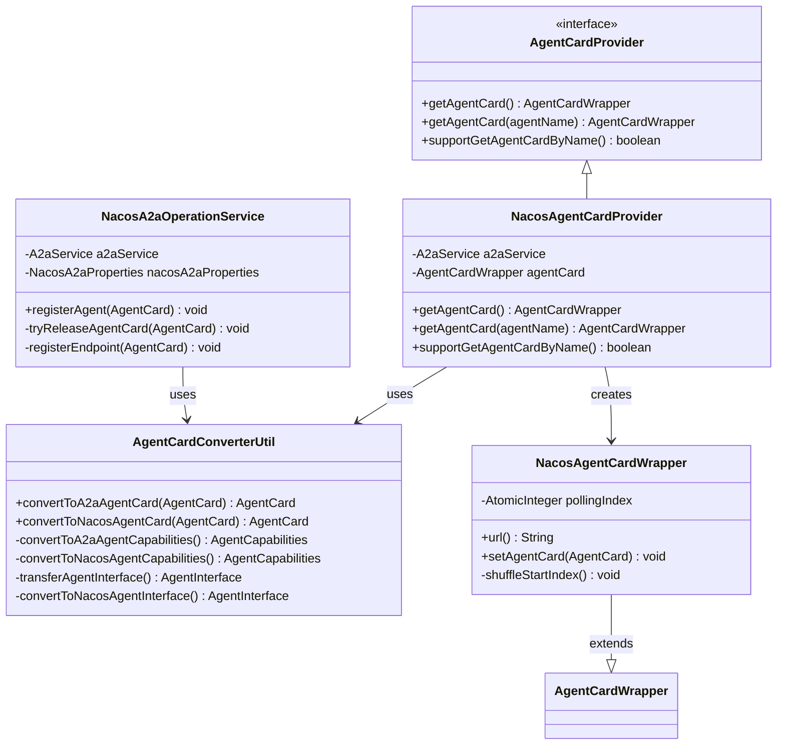
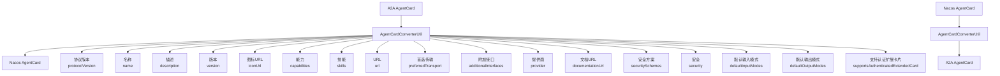
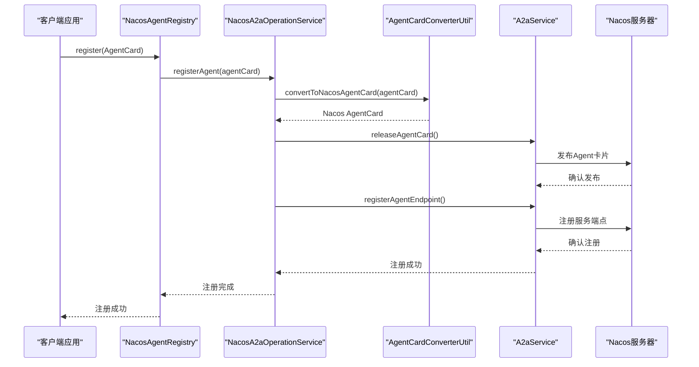
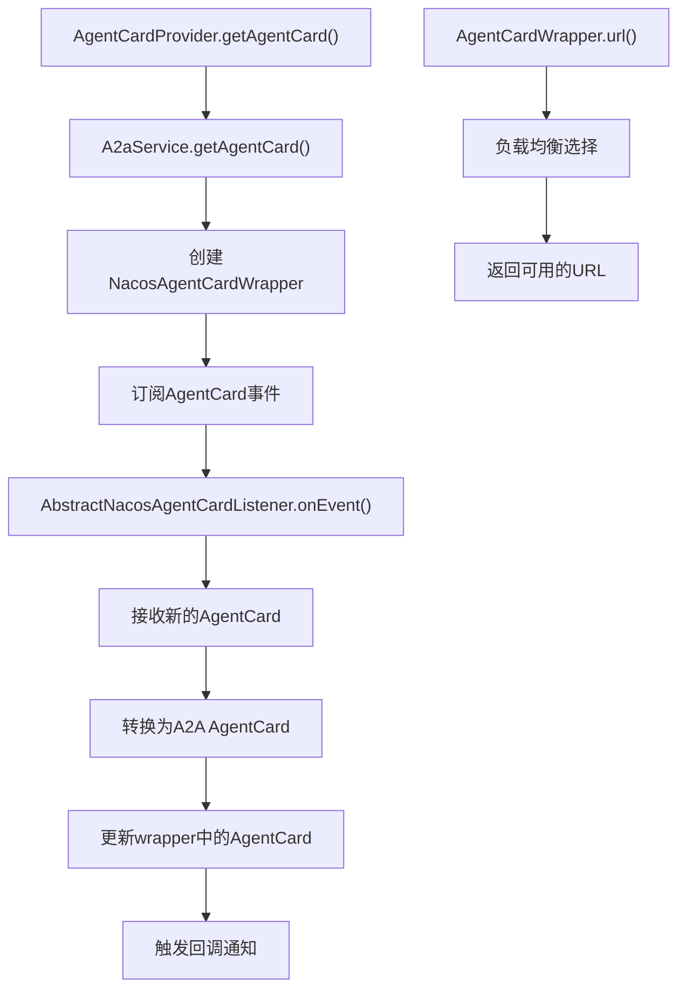
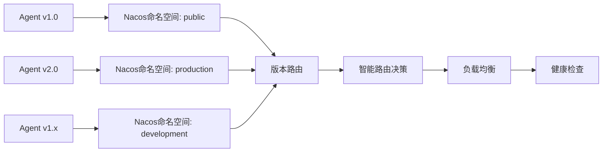

# 模型映射机制：NacosAgentCardProvider与A2A协议的集成

<cite>
**本文档引用的文件**
- [NacosAgentCardProvider.java](file://spring-ai-alibaba-a2a/spring-ai-alibaba-a2a-registry/src/main/java/com/alibaba/cloud/ai/a2a/registry/nacos/discovery/NacosAgentCardProvider.java)
- [AgentCardConverterUtil.java](file://spring-ai-alibaba-a2a/spring-ai-alibaba-a2a-registry/src/main/java/com/alibaba/cloud/ai/a2a/registry/nacos/utils/AgentCardConverterUtil.java)
- [NacosA2aOperationService.java](file://spring-ai-alibaba-a2a/spring-ai-alibaba-a2a-registry/src/main/java/com/alibaba/cloud/ai/a2a/registry/nacos/service/NacosA2aOperationService.java)
- [NacosAgentCardWrapper.java](file://spring-ai-alibaba-a2a/spring-ai-alibaba-a2a-registry/src/main/java/com/alibaba/cloud/ai/a2a/registry/nacos/discovery/NacosAgentCardWrapper.java)
- [NacosAgentRegistry.java](file://spring-ai-alibaba-a2a/spring-ai-alibaba-a2a-registry/src/main/java/com/alibaba/cloud/ai/a2a/registry/nacos/register/NacosAgentRegistry.java)
- [NacosA2aProperties.java](file://spring-ai-alibaba-a2a/spring-ai-alibaba-a2a-registry/src/main/java/com/alibaba/cloud/ai/a2a/registry/nacos/properties/NacosA2aProperties.java)
</cite>

## 目录
1. [概述](#概述)
2. [核心组件架构](#核心组件架构)
3. [AgentCard模型转换机制](#agentcard模型转换机制)
4. [服务注册流程](#服务注册流程)
5. [健康状态同步机制](#健康状态同步机制)
6. [多版本Agent兼容性处理](#多版本agent兼容性处理)
7. [配置管理](#配置管理)
8. [性能优化策略](#性能优化策略)
9. [故障排除指南](#故障排除指南)
10. [总结](#总结)

## 概述

NacosAgentCardProvider是Spring AI Alibaba项目中负责将A2A（Agent-to-Agent）协议中的Agent元数据模型转换为Nacos服务注册所需的服务实例格式的核心组件。该组件实现了AgentCardProvider接口，提供了从Nacos A2A注册中心获取Agent卡片信息的功能，并支持动态更新和健康状态监控。

## 核心组件架构



**图表来源**
- [NacosAgentCardProvider.java](file://spring-ai-alibaba-a2a/spring-ai-alibaba-a2a-registry/src/main/java/com/alibaba/cloud/ai/a2a/registry/nacos/discovery/NacosAgentCardProvider.java#L31-L84)
- [AgentCardConverterUtil.java](file://spring-ai-alibaba-a2a/spring-ai-alibaba-a2a-registry/src/main/java/com/alibaba/cloud/ai/a2a/registry/nacos/utils/AgentCardConverterUtil.java#L36-L69)
- [NacosAgentCardWrapper.java](file://spring-ai-alibaba-a2a/spring-ai-alibaba-a2a-registry/src/main/java/com/alibaba/cloud/ai/a2a/registry/nacos/discovery/NacosAgentCardWrapper.java#L36-L70)

**章节来源**
- [NacosAgentCardProvider.java](file://spring-ai-alibaba-a2a/spring-ai-alibaba-a2a-registry/src/main/java/com/alibaba/cloud/ai/a2a/registry/nacos/discovery/NacosAgentCardProvider.java#L1-L84)
- [NacosAgentCardWrapper.java](file://spring-ai-alibaba-a2a/spring-ai-alibaba-a2a-registry/src/main/java/com/alibaba/cloud/ai/a2a/registry/nacos/discovery/NacosAgentCardWrapper.java#L1-L70)

## AgentCard模型转换机制

### 字段映射关系

AgentCardConverterUtil类负责在A2A协议的AgentCard模型和Nacos服务实例之间进行双向转换，确保所有关键字段都能正确映射。



**图表来源**
- [AgentCardConverterUtil.java](file://spring-ai-alibaba-a2a/spring-ai-alibaba-a2a-registry/src/main/java/com/alibaba/cloud/ai/a2a/registry/nacos/utils/AgentCardConverterUtil.java#L36-L69)
- [AgentCardConverterUtil.java](file://spring-ai-alibaba-a2a/spring-ai-alibaba-a2a-registry/src/main/java/com/alibaba/cloud/ai/a2a/registry/nacos/utils/AgentCardConverterUtil.java#L125-L145)

### 转换逻辑详解

#### A2A到Nacos转换

```java
public static AgentCard convertToNacosAgentCard(io.a2a.spec.AgentCard agentCard) {
    AgentCard card = new AgentCard();
    card.setProtocolVersion(agentCard.protocolVersion());
    card.setName(agentCard.name());
    card.setDescription(agentCard.description());
    card.setVersion(agentCard.version());
    card.setIconUrl(agentCard.iconUrl());
    card.setCapabilities(convertToNacosAgentCapabilities(agentCard.capabilities()));
    card.setSkills(agentCard.skills().stream().map(AgentCardConverterUtil::convertToNacosAgentSkill).toList());
    card.setUrl(agentCard.url());
    card.setPreferredTransport(agentCard.preferredTransport());
    card.setAdditionalInterfaces(convertToNacosAgentInterfaces(agentCard.additionalInterfaces()));
    card.setProvider(convertToNacosAgentProvider(agentCard.provider()));
    card.setDocumentationUrl(agentCard.documentationUrl());
    card.setSecuritySchemes(convertToNacosSecuritySchemes(agentCard.securitySchemes()));
    card.setSecurity(agentCard.security());
    card.setDefaultInputModes(agentCard.defaultInputModes());
    card.setDefaultOutputModes(agentCard.defaultOutputModes());
    card.setSupportsAuthenticatedExtendedCard(agentCard.supportsAuthenticatedExtendedCard());
    return card;
}
```

#### Nacos到A2A转换

```java
public static io.a2a.spec.AgentCard convertToA2aAgentCard(AgentCard agentCard) {
    if (agentCard == null) {
        return null;
    }
    
    return new io.a2a.spec.AgentCard.Builder()
        .protocolVersion(agentCard.getProtocolVersion())
        .name(agentCard.getName())
        .description(agentCard.getDescription())
        .version(agentCard.getVersion())
        .iconUrl(agentCard.getIconUrl())
        .capabilities(convertToA2aAgentCapabilities(agentCard.getCapabilities()))
        .skills(convertToA2aAgentSkills(agentCard.getSkills()))
        .url(agentCard.getUrl())
        .preferredTransport(agentCard.getPreferredTransport())
        .additionalInterfaces(convertToA2aAgentInterfaces(agentCard.getAdditionalInterfaces()))
        .provider(convertToA2aAgentProvider(agentCard.getProvider()))
        .documentationUrl(agentCard.getDocumentationUrl())
        .securitySchemes(convertToA2aAgentSecuritySchemes(agentCard.getSecuritySchemes()))
        .security(agentCard.getSecurity())
        .defaultInputModes(agentCard.getDefaultInputModes())
        .defaultOutputModes(agentCard.getDefaultOutputModes())
        .supportsAuthenticatedExtendedCard(agentCard.getSupportsAuthenticatedExtendedCard())
        .build();
}
```

**章节来源**
- [AgentCardConverterUtil.java](file://spring-ai-alibaba-a2a/spring-ai-alibaba-a2a-registry/src/main/java/com/alibaba/cloud/ai/a2a/registry/nacos/utils/AgentCardConverterUtil.java#L36-L69)
- [AgentCardConverterUtil.java](file://spring-ai-alibaba-a2a/spring-ai-alibaba-a2a-registry/src/main/java/com/alibaba/cloud/ai/a2a/registry/nacos/utils/AgentCardConverterUtil.java#L125-L145)

## 服务注册流程

### 注册服务架构



**图表来源**
- [NacosAgentRegistry.java](file://spring-ai-alibaba-a2a/spring-ai-alibaba-a2a-registry/src/main/java/com/alibaba/cloud/ai/a2a/registry/nacos/register/NacosAgentRegistry.java#L40-L49)
- [NacosA2aOperationService.java](file://spring-ai-alibaba-a2a/spring-ai-alibaba-a2a-registry/src/main/java/com/alibaba/cloud/ai/a2a/registry/nacos/service/NacosA2aOperationService.java#L50-L66)

### 注册过程实现

NacosA2aOperationService类实现了完整的Agent注册流程：

```java
public void registerAgent(io.a2a.spec.AgentCard agentCard) {
    AgentCard nacosAgentCard = AgentCardConverterUtil.convertToNacosAgentCard(agentCard);
    try {
        tryReleaseAgentCard(nacosAgentCard);
        registerEndpoint(nacosAgentCard);
    }
    catch (NacosException e) {
        LOGGER.error("Register agent card {} to Nacos failed,", agentCard.name(), e);
        throw new NacosRuntimeException(e.getErrCode(), e.getErrMsg());
    }
}

private void tryReleaseAgentCard(AgentCard agentCard) throws NacosException {
    LOGGER.info("Register agent card {} to Nacos namespace {}. ", agentCard.getName(),
            nacosA2aProperties.getNamespace());
    a2aService.releaseAgentCard(agentCard, AiConstants.A2a.A2A_ENDPOINT_TYPE_SERVICE,
            nacosA2aRegistryProperties.isRegisterAsLatest());
    LOGGER.info("Register agent card {} to Nacos namespace {} successfully. ", agentCard.getName(),
            nacosA2aProperties.getNamespace());
}

private void registerEndpoint(AgentCard agentCard) throws NacosException {
    AgentEndpoint endpoint = new AgentEndpoint();
    endpoint.setVersion(agentCard.getVersion());
    endpoint.setPath(a2aServerProperties.getMessageUrl());
    endpoint.setTransport(agentCard.getPreferredTransport());
    endpoint.setAddress(a2aServerProperties.getAddress());
    endpoint.setPort(a2aServerProperties.getPort());
    a2aService.registerAgentEndpoint(agentCard.getName(), endpoint);
}
```

**章节来源**
- [NacosA2aOperationService.java](file://spring-ai-alibaba-a2a/spring-ai-alibaba-a2a-registry/src/main/java/com/alibaba/cloud/ai/a2a/registry/nacos/service/NacosA2aOperationService.java#L50-L88)

## 健康状态同步机制

### 实时状态更新

NacosAgentCardProvider通过订阅机制实现实时的Agent健康状态同步：



**图表来源**
- [NacosAgentCardProvider.java](file://spring-ai-alibaba-a2a/spring-ai-alibaba-a2a-registry/src/main/java/com/alibaba/cloud/ai/a2a/registry/nacos/discovery/NacosAgentCardProvider.java#L48-L70)
- [NacosAgentCardWrapper.java](file://spring-ai-alibaba-a2a/spring-ai-alibaba-a2a-registry/src/main/java/com/alibaba/cloud/ai/a2a/registry/nacos/discovery/NacosAgentCardWrapper.java#L36-L70)

### URL选择策略

NacosAgentCardWrapper实现了智能的URL选择策略，支持负载均衡和故障转移：

```java
@Override
public String url() {
    if (CollectionUtils.isEmpty(getAgentCard().additionalInterfaces())) {
        return super.url();
    }
    List<AgentInterface> agentInterfaces = getAgentCard().additionalInterfaces().stream()
        .filter(agentInterface -> getAgentCard().preferredTransport().equals(agentInterface.transport()))
        .toList();
    if (CollectionUtils.isEmpty(agentInterfaces)) {
        return super.url();
    }
    if (1 == agentInterfaces.size()) {
        return agentInterfaces.get(0).url();
    }
    int index = pollingIndex.incrementAndGet() % agentInterfaces.size();
    return agentInterfaces.get(index).url();
}
```

**章节来源**
- [NacosAgentCardProvider.java](file://spring-ai-alibaba-a2a/spring-ai-alibaba-a2a-registry/src/main/java/com/alibaba/cloud/ai/a2a/registry/nacos/discovery/NacosAgentCardProvider.java#L48-L70)
- [NacosAgentCardWrapper.java](file://spring-ai-alibaba-a2a/spring-ai-alibaba-a2a-registry/src/main/java/com/alibaba/cloud/ai/a2a/registry/nacos/discovery/NacosAgentCardWrapper.java#L48-L60)

## 多版本Agent兼容性处理

### 版本管理策略

系统通过以下机制确保不同版本的Agent能够正确发现和调用彼此：

1. **版本标识**：每个AgentCard包含明确的版本信息
2. **命名空间隔离**：使用Nacos命名空间隔离不同版本
3. **语义版本控制**：支持语义化版本号比较
4. **向后兼容**：保持向后兼容的API设计



### 兼容性配置

NacosA2aProperties类提供了灵活的配置选项：

```java
@ConfigurationProperties(prefix = NacosA2aProperties.PREFIX)
public class NacosA2aProperties implements EnvironmentAware {
    public static final String PREFIX = "spring.ai.alibaba.a2a.nacos";
    public static final String DEFAULT_ADDRESS = "127.0.0.1:8848";
    
    private String namespace = "public";
    private String serverAddr;
    private String username;
    private String password;
    private String accessKey;
    private String secretKey;
    private String endpoint;
    
    // 配置属性...
}
```

**章节来源**
- [NacosA2aProperties.java](file://spring-ai-alibaba-a2a/spring-ai-alibaba-a2a-registry/src/main/java/com/alibaba/cloud/ai/a2a/registry/nacos/properties/NacosA2aProperties.java#L40-L199)

## 配置管理

### 配置属性详解

系统支持丰富的配置选项，包括连接参数、认证信息和高级设置：

```yaml
spring:
  ai:
    alibaba:
      a2a:
        nacos:
          server-addr: 127.0.0.1:8848
          namespace: public
          username: ${NACOS_USERNAME:nacos}
          password: ${NACOS_PASSWORD:nacos}
          access-key: ${NACOS_ACCESS_KEY:}
          secret-key: ${NACOS_SECRET_KEY:}
          endpoint: ${NACOS_ENDPOINT:}
```

### 动态配置加载

NacosA2aProperties类实现了动态配置加载机制：

```java
public Properties getNacosProperties() {
    Properties properties = new Properties();
    properties.put(PropertyKeyConst.NAMESPACE, Objects.toString(this.namespace, ""));
    properties.put(PropertyKeyConst.SERVER_ADDR, Objects.toString(this.serverAddr, ""));
    properties.put(PropertyKeyConst.USERNAME, Objects.toString(this.username, ""));
    properties.put(PropertyKeyConst.PASSWORD, Objects.toString(this.password, ""));
    properties.put(PropertyKeyConst.ACCESS_KEY, Objects.toString(this.accessKey, ""));
    properties.put(PropertyKeyConst.SECRET_KEY, Objects.toString(this.secretKey, ""));
    
    // 处理端点配置
    String endpoint = Objects.toString(this.endpoint, "");
    if (endpoint.contains(":")) {
        int index = endpoint.indexOf(":");
        properties.put(PropertyKeyConst.ENDPOINT, endpoint.substring(0, index));
        properties.put(PropertyKeyConst.ENDPOINT_PORT, endpoint.substring(index + 1));
    } else {
        properties.put(PropertyKeyConst.ENDPOINT, endpoint);
    }
    
    enrichNacosConfigProperties(properties);
    
    if (StringUtils.isEmpty(this.serverAddr) && StringUtils.isEmpty(this.endpoint)) {
        properties.put(PropertyKeyConst.SERVER_ADDR, DEFAULT_ADDRESS);
    }
    
    return properties;
}
```

**章节来源**
- [NacosA2aProperties.java](file://spring-ai-alibaba-a2a/spring-ai-alibaba-a2a-registry/src/main/java/com/alibaba/cloud/ai/a2a/registry/nacos/properties/NacosA2aProperties.java#L100-L140)

## 性能优化策略

### 连接池管理

系统采用连接池技术优化Nacos连接性能：

1. **连接复用**：避免频繁建立和断开连接
2. **异步处理**：使用异步方式处理注册和发现请求
3. **缓存机制**：缓存已解析的AgentCard信息
4. **批量操作**：支持批量注册和注销操作

### 内存优化

```java
// 使用原子变量减少锁竞争
private final AtomicInteger pollingIndex;

// 使用线程本地随机数生成器
private void shuffleStartIndex() {
    if (CollectionUtils.isNotEmpty(getAgentCard().additionalInterfaces())) {
        int shuffleIndex = ThreadLocalRandom.current().nextInt(getAgentCard().additionalInterfaces().size());
        pollingIndex.set(shuffleIndex);
    }
}
```

### 网络优化

- **压缩传输**：启用GZIP压缩减少网络传输量
- **心跳检测**：定期发送心跳包维持连接活跃
- **超时控制**：合理设置连接和读取超时时间

## 故障排除指南

### 常见问题及解决方案

#### 1. 连接失败

**症状**：无法连接到Nacos服务器
**原因**：网络配置错误或服务器不可达
**解决方案**：
```java
// 检查服务器地址配置
if (StringUtils.isEmpty(this.serverAddr) && StringUtils.isEmpty(this.endpoint)) {
    properties.put(PropertyKeyConst.SERVER_ADDR, DEFAULT_ADDRESS);
}
```

#### 2. 认证失败

**症状**：访问被拒绝或权限不足
**原因**：用户名密码配置错误
**解决方案**：
- 验证Nacos服务器认证配置
- 检查accessKey和secretKey设置
- 确认用户具有相应权限

#### 3. 版本冲突

**症状**：Agent无法正常通信
**原因**：版本不匹配或命名空间冲突
**解决方案**：
- 使用正确的命名空间
- 确保版本号格式正确
- 检查AgentCard的版本兼容性

### 监控和日志

系统提供详细的日志记录功能：

```java
LOGGER.info("Register agent card {} to Nacos namespace {}. ", agentCard.getName(),
        nacosA2aProperties.getNamespace());
LOGGER.error("Register agent card {} to Nacos failed,", agentCard.name(), e);
```

**章节来源**
- [NacosA2aOperationService.java](file://spring-ai-alibaba-a2a/spring-ai-alibaba-a2a-registry/src/main/java/com/alibaba/cloud/ai/a2a/registry/nacos/service/NacosA2aOperationService.java#L60-L88)

## 总结

NacosAgentCardProvider通过精心设计的模型映射机制，成功实现了A2A协议Agent元数据模型与Nacos服务注册所需的格式之间的无缝转换。其主要特点包括：

1. **完整的转换支持**：覆盖所有关键字段的双向转换
2. **实时状态同步**：通过事件监听机制实现实时更新
3. **智能负载均衡**：支持多接口的智能URL选择
4. **多版本兼容**：确保不同版本Agent的互操作性
5. **高性能设计**：采用连接池和缓存等优化策略
6. **完善的配置**：支持丰富的配置选项和动态加载

该组件为Spring AI Alibaba生态系统提供了强大的服务发现和注册能力，是构建分布式AI Agent系统的重要基础设施。