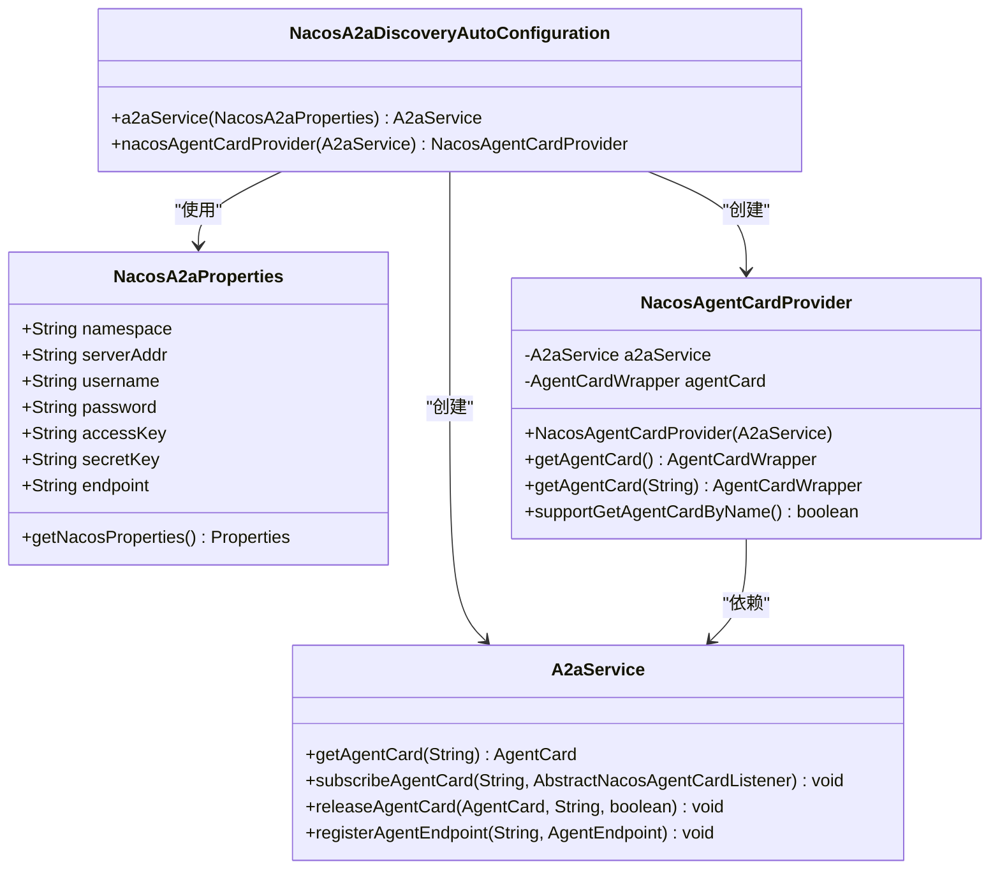
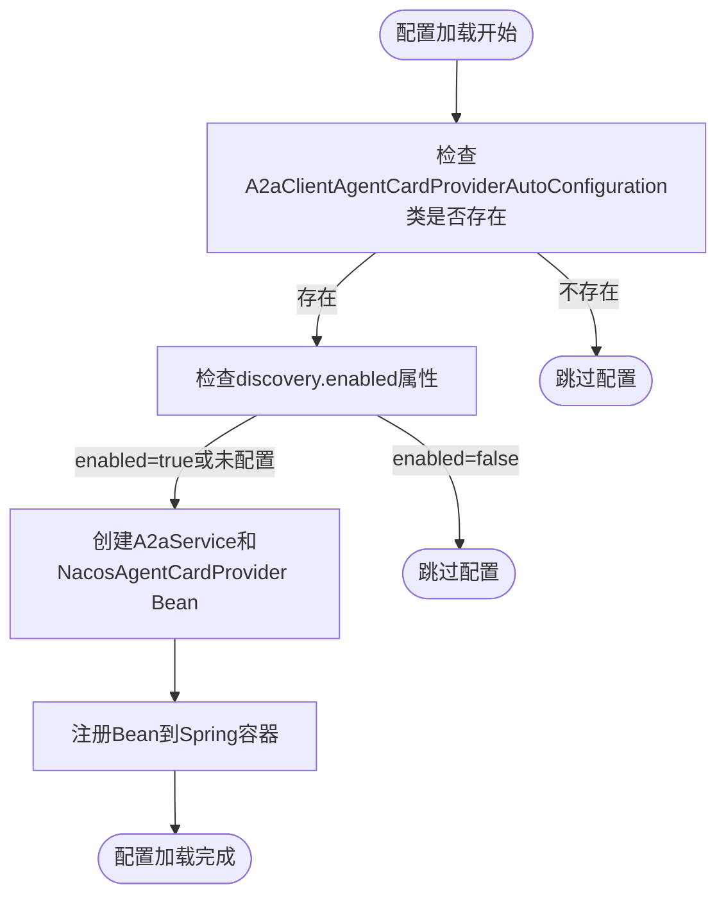
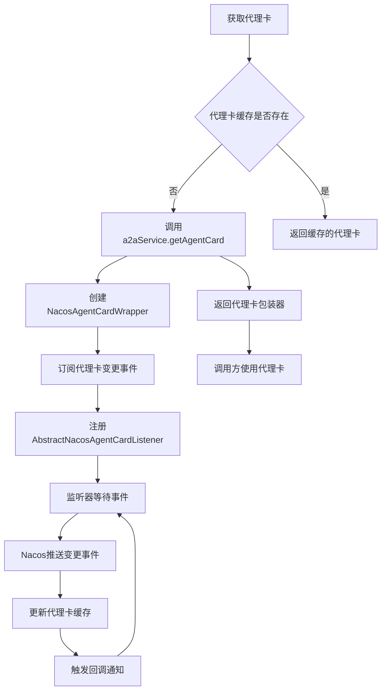

# 自动配置机制

<cite>
**本文档引用的文件**
- [NacosA2aDiscoveryAutoConfiguration.java](file://auto-configurations/spring-ai-alibaba-autoconfigure-a2a-registry/src/main/java/com/alibaba/cloud/ai/autoconfigure/a2a/registry/nacos/NacosA2aDiscoveryAutoConfiguration.java)
- [NacosA2aProperties.java](file://spring-ai-alibaba-a2a/spring-ai-alibaba-a2a-registry/src/main/java/com/alibaba/cloud/ai/a2a/registry/nacos/properties/NacosA2aProperties.java)
- [NacosAgentCardProvider.java](file://spring-ai-alibaba-a2a/spring-ai-alibaba-a2a-registry/src/main/java/com/alibaba/cloud/ai/a2a/registry/nacos/discovery/NacosAgentCardProvider.java)
- [A2aClientAgentCardProviderAutoConfiguration.java](file://auto-configurations/spring-ai-alibaba-autoconfigure-a2a-client/src/main/java/com/alibaba/cloud/ai/autoconfigure/a2a/client/A2aClientAgentCardProviderAutoConfiguration.java)
- [NacosA2aRegistryProperties.java](file://spring-ai-alibaba-a2a/spring-ai-alibaba-a2a-registry/src/main/java/com/alibaba/cloud/ai/a2a/registry/nacos/register/NacosA2aRegistryProperties.java)
- [NacosA2aOperationService.java](file://spring-ai-alibaba-a2a/spring-ai-alibaba-a2a-registry/src/main/java/com/alibaba/cloud/ai/a2a/registry/nacos/service/NacosA2aOperationService.java)
</cite>

## 目录
1. [引言](#引言)
2. [核心组件分析](#核心组件分析)
3. [条件化自动装配机制](#条件化自动装配机制)
4. [Nacos参数构建与客户端初始化](#nacos参数构建与客户端初始化)
5. [健康检查与服务发现机制](#健康检查与服务发现机制)
6. [自定义配置扩展方法](#自定义配置扩展方法)
7. [结论](#结论)

## 引言
本文深入解析NacosA2aDiscoveryAutoConfiguration类的实现原理，详细阐述其如何通过Spring Boot的条件化注解实现自动装配。该配置类是Spring AI Alibaba框架中A2A（Agent-to-Agent）通信的核心组件，负责与Nacos注册中心集成，实现服务发现和代理卡（Agent Card）管理功能。

## 核心组件分析

NacosA2aDiscoveryAutoConfiguration类作为A2A服务发现的自动配置核心，主要包含两个关键Bean的定义：A2aService客户端实例和NacosAgentCardProvider服务提供者。该配置类通过依赖注入的方式，将Nacos配置属性与服务发现功能进行整合，为上层应用提供透明的服务发现能力。



**图示来源**
- [NacosA2aDiscoveryAutoConfiguration.java](file://auto-configurations/spring-ai-alibaba-autoconfigure-a2a-registry/src/main/java/com/alibaba/cloud/ai/autoconfigure/a2a/registry/nacos/NacosA2aDiscoveryAutoConfiguration.java)
- [NacosA2aProperties.java](file://spring-ai-alibaba-a2a/spring-ai-alibaba-a2a-registry/src/main/java/com/alibaba/cloud/ai/a2a/registry/nacos/properties/NacosA2aProperties.java)
- [NacosAgentCardProvider.java](file://spring-ai-alibaba-a2a/spring-ai-alibaba-a2a-registry/src/main/java/com/alibaba/cloud/ai/a2a/registry/nacos/discovery/NacosAgentCardProvider.java)

**章节来源**
- [NacosA2aDiscoveryAutoConfiguration.java](file://auto-configurations/spring-ai-alibaba-autoconfigure-a2a-registry/src/main/java/com/alibaba/cloud/ai/autoconfigure/a2a/registry/nacos/NacosA2aDiscoveryAutoConfiguration.java#L25-L55)

## 条件化自动装配机制

NacosA2aDiscoveryAutoConfiguration类通过多种Spring Boot条件注解实现精细化的自动装配控制。这些条件注解确保配置仅在满足特定条件时才生效，避免了不必要的资源消耗和配置冲突。

首先，@ConditionalOnClass注解确保只有当A2aClientAgentCardProviderAutoConfiguration类存在于类路径中时，当前配置才会被加载。这实现了模块间的依赖关系管理，保证了功能的完整性和一致性。

其次，@ConditionalOnProperty注解通过检查配置属性"spring.ai.alibaba.a2a.nacos.discovery.enabled"的值来控制配置的启用状态。当该属性设置为"true"或未明确配置时（matchIfMissing = true），配置将被激活。这种设计提供了灵活的开关机制，允许开发者根据部署环境动态启用或禁用服务发现功能。

最后，@AutoConfiguration注解的before属性指定了当前配置的加载顺序，确保它在A2aClientAgentCardProviderAutoConfiguration之前执行。这种精确的加载顺序控制对于构建正确的依赖关系链至关重要。



**图示来源**
- [NacosA2aDiscoveryAutoConfiguration.java](file://auto-configurations/spring-ai-alibaba-autoconfigure-a2a-registry/src/main/java/com/alibaba/cloud/ai/autoconfigure/a2a/registry/nacos/NacosA2aDiscoveryAutoConfiguration.java#L25-L35)
- [A2aClientAgentCardProviderAutoConfiguration.java](file://auto-configurations/spring-ai-alibaba-autoconfigure-a2a-client/src/main/java/com/alibaba/cloud/ai/autoconfigure/a2a/client/A2aClientAgentCardProviderAutoConfiguration.java)

**章节来源**
- [NacosA2aDiscoveryAutoConfiguration.java](file://auto-configurations/spring-ai-alibaba-autoconfigure-a2a-registry/src/main/java/com/alibaba/cloud/ai/autoconfigure/a2a/registry/nacos/NacosA2aDiscoveryAutoConfiguration.java#L25-L35)

## Nacos参数构建与客户端初始化

NacosA2aProperties类负责封装所有与Nacos相关的配置参数，并提供getNacosProperties()方法将这些参数转换为Nacos SDK所需的Properties对象。这一过程涉及多个关键步骤，确保了配置的完整性和正确性。

命名空间（namespace）参数默认设置为"public"，允许开发者通过配置文件指定自定义命名空间，实现服务的逻辑隔离。服务器地址（serverAddr）和端点（endpoint）参数支持多种配置方式，当两者均未配置时，默认使用本地Nacos服务器地址"127.0.0.1:8848"。

安全认证方面，支持用户名/密码、AccessKey/SecretKey等多种认证方式，满足不同安全级别的部署需求。特别值得注意的是，endpoint参数支持":port"格式的解析，能够自动分离主机名和端口号，提高了配置的灵活性。

在参数转换过程中，系统还会从Spring Environment中提取以"spring.ai.alibaba.a2a.nacos"为前缀的所有属性，并将其转换为Nacos SDK可识别的键名格式（如将"server-addr"转换为"serverAddr"）。这种设计允许开发者使用Spring Boot的标准配置风格，同时保持与Nacos SDK的兼容性。

```mermaid
sequenceDiagram
participant Config as 配置系统
participant Properties as NacosA2aProperties
participant Converter as 属性转换器
participant NacosSDK as Nacos SDK
Config->>Properties : 加载配置属性
Properties->>Properties : 设置namespace, serverAddr等
Properties->>Converter : 调用getNacosProperties()
Converter->>Converter : 创建Properties对象
Converter->>Converter : 添加NAMESPACE, SERVER_ADDR等
Converter->>Converter : 解析endpoint中的端口
Converter->>Converter : 从Environment提取子属性
Converter->>Converter : 转换属性键名格式
Converter->>Converter : 设置默认地址
Converter-->>Properties : 返回Properties
Properties-->>NacosSDK : 创建A2aService实例
NacosSDK-->>Config : 返回服务客户端
```

**图示来源**
- [NacosA2aProperties.java](file://spring-ai-alibaba-a2a/spring-ai-alibaba-a2a-registry/src/main/java/com/alibaba/cloud/ai/a2a/registry/nacos/properties/NacosA2aProperties.java#L26-L84)
- [NacosA2aDiscoveryAutoConfiguration.java](file://auto-configurations/spring-ai-alibaba-autoconfigure-a2a-registry/src/main/java/com/alibaba/cloud/ai/autoconfigure/a2a/registry/nacos/NacosA2aDiscoveryAutoConfiguration.java#L47-L49)

**章节来源**
- [NacosA2aProperties.java](file://spring-ai-alibaba-a2a/spring-ai-alibaba-a2a-registry/src/main/java/com/alibaba/cloud/ai/a2a/registry/nacos/properties/NacosA2aProperties.java#L26-L84)

## 健康检查与服务发现机制

NacosAgentCardProvider类实现了基于Nacos的服务发现和健康检查机制。该机制通过订阅模式实现实时的服务状态监控，确保客户端始终能够获取最新的服务实例信息。

当调用getAgentCard(String agentName)方法时，系统首先通过A2aService从Nacos获取指定代理的当前配置信息。随后，立即建立一个监听器（AbstractNacosAgentCardListener），订阅该代理的配置变更事件。这种设计实现了推拉结合的混合模式，既保证了首次获取的及时性，又确保了后续变更的实时性。

健康检查机制主要体现在心跳维持和故障转移两个方面。Nacos客户端SDK内部会定期向服务器发送心跳，维护服务实例的存活状态。当检测到服务实例异常时，Nacos会自动将其从可用实例列表中移除，客户端的订阅监听器会收到相应的事件通知，从而实现无缝的故障转移。

日志记录功能在DEBUG级别下会输出接收到的新代理卡信息，便于开发者调试和监控服务发现过程。异常处理机制将NacosException转换为NacosRuntimeException，遵循Spring的异常处理规范，使错误处理更加统一和可控。



**图示来源**
- [NacosAgentCardProvider.java](file://spring-ai-alibaba-a2a/spring-ai-alibaba-a2a-registry/src/main/java/com/alibaba/cloud/ai/a2a/registry/nacos/discovery/NacosAgentCardProvider.java#L45-L75)
- [NacosA2aDiscoveryAutoConfiguration.java](file://auto-configurations/spring-ai-alibaba-autoconfigure-a2a-registry/src/main/java/com/alibaba/cloud/ai/autoconfigure/a2a/registry/nacos/NacosA2aDiscoveryAutoConfiguration.java#L52-L54)

**章节来源**
- [NacosAgentCardProvider.java](file://spring-ai-alibaba-a2a/spring-ai-alibaba-a2a-registry/src/main/java/com/alibaba/cloud/ai/a2a/registry/nacos/discovery/NacosAgentCardProvider.java#L45-L75)

## 自定义配置扩展方法

为了满足特殊部署需求，开发者可以通过继承和重写的方式扩展NacosA2aDiscoveryAutoConfiguration的功能。主要有两种扩展途径：配置属性扩展和自动配置类重写。

配置属性扩展方面，可以在application.yml中覆盖默认配置：
```yaml
spring:
  ai:
    alibaba:
      a2a:
        nacos:
          discovery:
            enabled: true
          namespace: custom-namespace
          server-addr: nacos-cluster.example.com:8848
          username: admin
          password: encrypted-password
```

对于更复杂的定制需求，可以创建自定义的自动配置类，通过@ComponentScan或@Import注解将其纳入Spring容器。例如，可以重写a2aService Bean的定义，添加自定义的连接池配置或超时设置：

```java
@Configuration
public class CustomNacosConfig extends NacosA2aDiscoveryAutoConfiguration {
    
    @Bean
    @Override
    @ConditionalOnMissingBean
    public A2aService a2aService(NacosA2aProperties nacosA2aProperties) throws NacosException {
        Properties properties = nacosA2aProperties.getNacosProperties();
        // 添加自定义配置
        properties.put(PropertyKeyConst.CONNECTION_TIMEOUT, "10000");
        properties.put(PropertyKeyConst.HEART_BEAT_INTERVAL, "5000");
        return AiFactory.createAiService(properties);
    }
}
```

此外，还可以通过实现EnvironmentPostProcessor接口，在配置加载早期阶段动态修改Nacos相关属性，实现更高级的配置管理策略。

**章节来源**
- [NacosA2aDiscoveryAutoConfiguration.java](file://auto-configurations/spring-ai-alibaba-autoconfigure-a2a-registry/src/main/java/com/alibaba/cloud/ai/autoconfigure/a2a/registry/nacos/NacosA2aDiscoveryAutoConfiguration.java)
- [NacosA2aProperties.java](file://spring-ai-alibaba-a2a/spring-ai-alibaba-a2a-registry/src/main/java/com/alibaba/cloud/ai/a2a/registry/nacos/properties/NacosA2aProperties.java)

## 结论
NacosA2aDiscoveryAutoConfiguration类通过精巧的设计实现了A2A服务发现的自动化配置。其核心价值在于将复杂的Nacos集成细节封装在自动配置类中，为开发者提供了简单易用的编程接口。通过条件化注解、配置属性绑定和事件驱动机制的有机结合，该配置类不仅保证了功能的可靠性，还提供了良好的扩展性和灵活性，是Spring Boot自动配置理念的优秀实践范例。