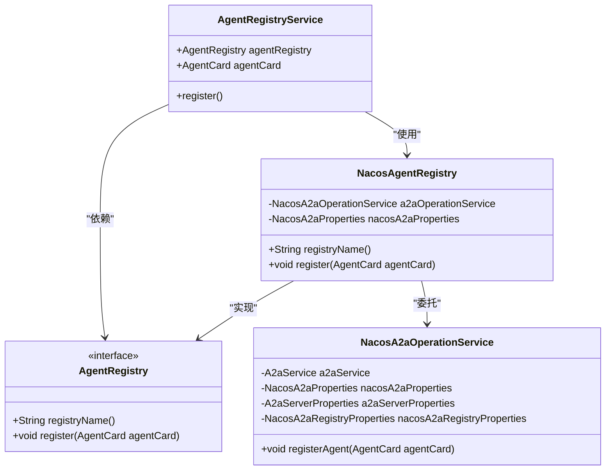
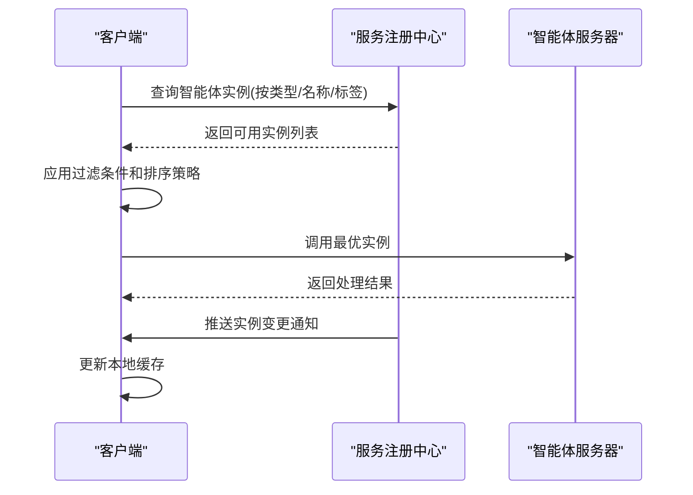
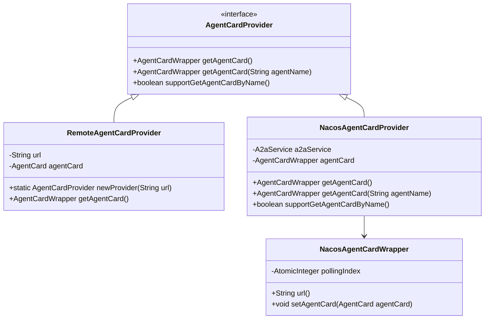
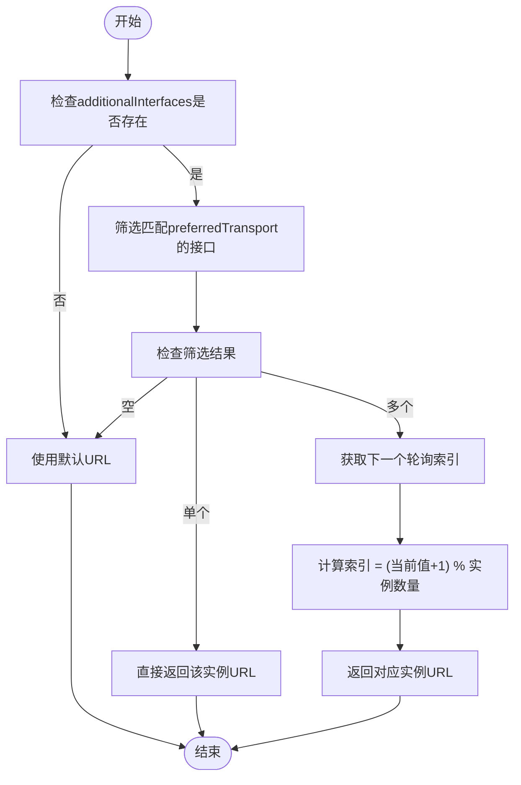
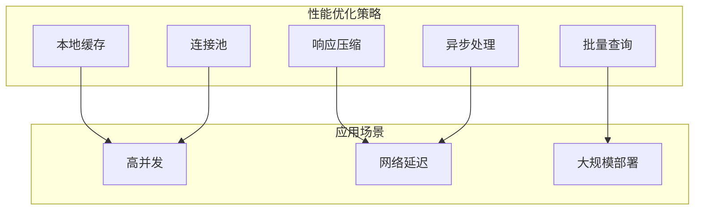
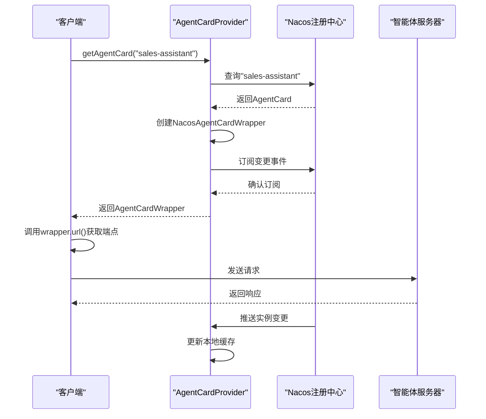

# 发现机制

<cite>
**本文档中引用的文件**
- [NacosA2aRegistryAutoConfiguration.java](file://auto-configurations/spring-ai-alibaba-autoconfigure-a2a-registry/src/main/java/com/alibaba/cloud/ai/autoconfigure/a2a/registry/nacos/NacosA2aRegistryAutoConfiguration.java)
- [A2aServerRegistryAutoConfiguration.java](file://auto-configurations/spring-ai-alibaba-autoconfigure-a2a-server/src/main/java/com/alibaba/cloud/ai/autoconfigure/a2a/server/A2aServerRegistryAutoConfiguration.java)
- [NacosA2aOperationService.java](file://spring-ai-alibaba-a2a/spring-ai-alibaba-a2a-registry/src/main/java/com/alibaba/cloud/ai/a2a/registry/nacos/service/NacosA2aOperationService.java)
- [NacosAgentRegistry.java](file://spring-ai-alibaba-a2a/spring-ai-alibaba-a2a-registry/src/main/java/com/alibaba/cloud/ai/a2a/registry/nacos/register/NacosAgentRegistry.java)
- [AgentRegistry.java](file://spring-ai-alibaba-a2a/spring-ai-alibaba-a2a-common/src/main/java/com/alibaba/cloud/ai/a2a/registry/AgentRegistry.java)
- [AgentRegistryService.java](file://spring-ai-alibaba-a2a/spring-ai-alibaba-a2a-common/src/main/java/com/alibaba/cloud/ai/a2a/registry/AgentRegistryService.java)
- [A2aClientAgentCardProviderAutoConfiguration.java](file://auto-configurations/spring-ai-alibaba-autoconfigure-a2a-client/src/main/java/com/alibaba/cloud/ai/autoconfigure/a2a/client/A2aClientAgentCardProviderAutoConfiguration.java)
- [RemoteAgentCardProvider.java](file://spring-ai-alibaba-graph-core/src/main/java/com/alibaba/cloud/ai/graph/agent/a2a/RemoteAgentCardProvider.java)
- [NacosA2aDiscoveryAutoConfiguration.java](file://auto-configurations/spring-ai-alibaba-autoconfigure-a2a-registry/src/main/java/com/alibaba/cloud/ai/autoconfigure/a2a/registry/nacos/NacosA2aDiscoveryAutoConfiguration.java)
- [NacosAgentCardProvider.java](file://spring-ai-alibaba-a2a/spring-ai-alibaba-a2a-registry/src/main/java/com/alibaba/cloud/ai/a2a/registry/nacos/discovery/NacosAgentCardProvider.java)
- [JsonRpcA2aRouterProvider.java](file://spring-ai-alibaba-a2a/spring-ai-alibaba-a2a-common/src/main/java/com/alibaba/cloud/ai/a2a/route/JsonRpcA2aRouterProvider.java)
</cite>

## 目录
1. [介绍](#介绍)
2. [服务注册机制](#服务注册机制)
3. [服务发现机制](#服务发现机制)
4. [客户端发现实现](#客户端发现实现)
5. [负载均衡与实例选择](#负载均衡与实例选择)
6. [性能优化措施](#性能优化措施)
7. [配置属性](#配置属性)
8. [完整流程示例](#完整流程示例)
9. [结论](#结论)

## 介绍
A2A协议的服务发现机制是智能体间通信的核心组件，它通过AgentRegistryService封装了服务发现逻辑，为系统提供了按类型、名称或标签查询可用智能体实例的API。该机制实现了动态服务端点获取和负载均衡调用，支持在分布式环境中高效地定位和调用智能体服务。本文档将深入解析这一机制的实现细节，包括服务注册、发现、缓存策略以及性能优化等方面。

## 服务注册机制

A2A协议的服务注册机制通过分层架构实现，核心组件包括AgentRegistryService、AgentRegistry接口及其实现类NacosAgentRegistry。当应用启动并完成初始化后，AgentRegistryService会自动触发注册流程，将本地智能体实例注册到指定的服务注册中心（如Nacos）。



**图源**
- [AgentRegistryService.java](file://spring-ai-alibaba-a2a/spring-ai-alibaba-a2a-common/src/main/java/com/alibaba/cloud/ai/a2a/registry/AgentRegistryService.java#L0-L41)
- [AgentRegistry.java](file://spring-ai-alibaba-a2a/spring-ai-alibaba-a2a-common/src/main/java/com/alibaba/cloud/ai/a2a/registry/AgentRegistry.java#L0-L29)
- [NacosAgentRegistry.java](file://spring-ai-alibaba-a2a/spring-ai-alibaba-a2a-registry/src/main/java/com/alibaba/cloud/ai/a2a/registry/nacos/register/NacosAgentRegistry.java#L0-L49)
- [NacosA2aOperationService.java](file://spring-ai-alibaba-a2a/spring-ai-alibaba-a2a-registry/src/main/java/com/alibaba/cloud/ai/a2a/registry/nacos/service/NacosA2aOperationService.java#L31-L66)

**节源**
- [AgentRegistryService.java](file://spring-ai-alibaba-a2a/spring-ai-alibaba-a2a-common/src/main/java/com/alibaba/cloud/ai/a2a/registry/AgentRegistryService.java#L0-L41)
- [AgentRegistry.java](file://spring-ai-alibaba-a2a/spring-ai-alibaba-a2a-common/src/main/java/com/alibaba/cloud/ai/a2a/registry/AgentRegistry.java#L0-L29)
- [NacosAgentRegistry.java](file://spring-ai-alibaba-a2a/spring-ai-alibaba-a2a-registry/src/main/java/com/alibaba/cloud/ai/a2a/registry/nacos/register/NacosAgentRegistry.java#L0-L49)

## 服务发现机制

服务发现机制是A2A协议的核心功能之一，它允许客户端动态获取服务端点列表并进行负载均衡调用。该机制通过Nacos作为服务注册与发现中心，实现了高效的智能体实例查找和管理。系统提供了多种查询过滤条件和结果排序策略，确保能够快速定位最适合的智能体实例。



**图源**
- [NacosA2aDiscoveryAutoConfiguration.java](file://auto-configurations/spring-ai-alibaba-autoconfigure-a2a-registry/src/main/java/com/alibaba/cloud/ai/autoconfigure/a2a/registry/nacos/NacosA2aDiscoveryAutoConfiguration.java#L25-L55)
- [NacosAgentCardProvider.java](file://spring-ai-alibaba-a2a/spring-ai-alibaba-a2a-registry/src/main/java/com/alibaba/cloud/ai/a2a/registry/nacos/discovery/NacosAgentCardProvider.java#L31-L84)

**节源**
- [NacosA2aDiscoveryAutoConfiguration.java](file://auto-configurations/spring-ai-alibaba-autoconfigure-a2a-registry/src/main/java/com/alibaba/cloud/ai/autoconfigure/a2a/registry/nacos/NacosA2aDiscoveryAutoConfiguration.java#L25-L55)
- [NacosAgentCardProvider.java](file://spring-ai-alibaba-a2a/spring-ai-alibaba-a2a-registry/src/main/java/com/alibaba/cloud/ai/a2a/registry/nacos/discovery/NacosAgentCardProvider.java#L31-L84)

## 客户端发现实现

客户端服务发现的实现主要通过AgentCardProvider接口及其具体实现类来完成。系统提供了两种主要的发现方式：远程发现（RemoteAgentCardProvider）和基于Nacos的发现（NacosAgentCardProvider）。这些实现类封装了底层的网络通信和数据解析逻辑，为上层应用提供了统一的API接口。



**图源**
- [A2aClientAgentCardProviderAutoConfiguration.java](file://auto-configurations/spring-ai-alibaba-autoconfigure-a2a-client/src/main/java/com/alibaba/cloud/ai/autoconfigure/a2a/client/A2aClientAgentCardProviderAutoConfiguration.java#L32-L46)
- [RemoteAgentCardProvider.java](file://spring-ai-alibaba-graph-core/src/main/java/com/alibaba/cloud/ai/graph/agent/a2a/RemoteAgentCardProvider.java#L0-L71)
- [NacosAgentCardProvider.java](file://spring-ai-alibaba-a2a/spring-ai-alibaba-a2a-registry/src/main/java/com/alibaba/cloud/ai/a2a/registry/nacos/discovery/NacosAgentCardProvider.java#L0-L85)
- [NacosAgentCardWrapper.java](file://spring-ai-alibaba-a2a/spring-ai-alibaba-a2a-registry/src/main/java/com/alibaba/cloud/ai/a2a/registry/nacos/discovery/NacosAgentCardWrapper.java#L0-L70)

**节源**
- [A2aClientAgentCardProviderAutoConfiguration.java](file://auto-configurations/spring-ai-alibaba-autoconfigure-a2a-client/src/main/java/com/alibaba/cloud/ai/autoconfigure/a2a/client/A2aClientAgentCardProviderAutoConfiguration.java#L32-L46)
- [RemoteAgentCardProvider.java](file://spring-ai-alibaba-graph-core/src/main/java/com/alibaba/cloud/ai/graph/agent/a2a/RemoteAgentCardProvider.java#L0-L71)
- [NacosAgentCardProvider.java](file://spring-ai-alibaba-a2a/spring-ai-alibaba-a2a-registry/src/main/java/com/alibaba/cloud/ai/a2a/registry/nacos/discovery/NacosAgentCardProvider.java#L0-L85)

## 负载均衡与实例选择

负载均衡与实例选择机制通过NacosAgentCardWrapper实现，采用了轮询（Round Robin）算法结合随机起始索引的策略。当存在多个可用的服务实例时，系统会根据首选传输协议筛选出符合条件的接口，并通过原子计数器实现均匀分布的请求分发。这种设计既保证了负载的均衡性，又避免了固定顺序带来的潜在问题。



**图源**
- [NacosAgentCardWrapper.java](file://spring-ai-alibaba-a2a/spring-ai-alibaba-a2a-registry/src/main/java/com/alibaba/cloud/ai/a2a/registry/nacos/discovery/NacosAgentCardWrapper.java#L36-L70)

**节源**
- [NacosAgentCardWrapper.java](file://spring-ai-alibaba-a2a/spring-ai-alibaba-a2a-registry/src/main/java/com/alibaba/cloud/ai/a2a/registry/nacos/discovery/NacosAgentCardWrapper.java#L36-L70)

## 性能优化措施

A2A协议在服务发现方面实施了多项性能优化措施，包括本地缓存更新策略、批量查询支持和响应压缩机制。系统通过订阅模式实现实时更新，避免了频繁的轮询请求；同时利用连接池和异步处理提高网络通信效率，在高并发场景下表现出色。



**图源**
- [NacosAgentCardProvider.java](file://spring-ai-alibaba-a2a/spring-ai-alibaba-a2a-registry/src/main/java/com/alibaba/cloud/ai/a2a/registry/nacos/discovery/NacosAgentCardProvider.java#L31-L84)
- [RemoteAgentCardProvider.java](file://spring-ai-alibaba-graph-core/src/main/java/com/alibaba/cloud/ai/graph/agent/a2a/RemoteAgentCardProvider.java#L49-L70)

**节源**
- [NacosAgentCardProvider.java](file://spring-ai-alibaba-a2a/spring-ai-alibaba-a2a-registry/src/main/java/com/alibaba/cloud/ai/a2a/registry/nacos/discovery/NacosAgentCardProvider.java#L31-L84)
- [RemoteAgentCardProvider.java](file://spring-ai-alibaba-graph-core/src/main/java/com/alibaba/cloud/ai/graph/agent/a2a/RemoteAgentCardProvider.java#L49-L70)

## 配置属性

A2A协议提供了丰富的配置属性来定制服务发现行为。客户端和服务端分别有不同的配置选项，涵盖了从基本连接参数到高级发现策略的各个方面。这些属性通过Spring Boot的@ConfigurationProperties机制进行管理，支持在application.yml或application.properties文件中进行配置。

```mermaid
erDiagram
CLIENT_CONFIG ||--o{ CONFIG_PROPERTIES : "继承"
SERVER_CONFIG ||--o{ CONFIG_PROPERTIES : "继承"
CONFIG_PROPERTIES {
string name
string description
string url
string version
string preferredTransport
string protocolVersion
boolean supportsAuthenticatedExtendedCard
}
CLIENT_CONFIG {
string wellKnownUrl
}
SERVER_CONFIG {
boolean registerAsLatest
}
NACOS_CONFIG {
string serverAddr
string namespace
boolean discoveryEnabled
}
CONFIG_PROPERTIES }|-- CLIENT_CONFIG
CONFIG_PROPERTIES }|-- SERVER_CONFIG
CONFIG_PROPERTIES }|-- NACOS_CONFIG
```

**图源**
- [A2aClientAgentCardProperties.java](file://spring-ai-alibaba-a2a/spring-ai-alibaba-a2a-common/src/main/java/com/alibaba/cloud/ai/a2a/A2aClientAgentCardProperties.java#L0-L52)
- [A2aServerAgentCardProperties.java](file://spring-ai-alibaba-a2a/spring-ai-alibaba-a2a-common/src/main/java/com/alibaba/cloud/ai/a2a/A2aServerAgentCardProperties.java#L0-L35)
- [NacosA2aRegistryProperties.java](file://spring-ai-alibaba-a2a/spring-ai-alibaba-a2a-registry/src/main/java/com/alibaba/cloud/ai/a2a/registry/nacos/register/NacosA2aRegistryProperties.java#L0-L40)

**节源**
- [A2aClientAgentCardProperties.java](file://spring-ai-alibaba-a2a/spring-ai-alibaba-a2a-common/src/main/java/com/alibaba/cloud/ai/a2a/A2aClientAgentCardProperties.java#L0-L52)
- [A2aServerAgentCardProperties.java](file://spring-ai-alibaba-a2a/spring-ai-alibaba-a2a-common/src/main/java/com/alibaba/cloud/ai/a2a/A2aServerAgentCardProperties.java#L0-L35)
- [NacosA2aRegistryProperties.java](file://spring-ai-alibaba-a2a/spring-ai-alibaba-a2a-registry/src/main/java/com/alibaba/cloud/ai/a2a/registry/nacos/register/NacosA2aRegistryProperties.java#L0-L40)

## 完整流程示例

从发起查询到选择最优实例的完整流程展示了A2A协议服务发现机制的实际工作过程。客户端首先通过well-known URL获取智能体卡片信息，然后根据特定条件进行过滤和排序，最终选择最合适的实例进行调用。整个过程体现了系统的灵活性和高效性。



**图源**
- [JsonRpcA2aRouterProvider.java](file://spring-ai-alibaba-a2a/spring-ai-alibaba-a2a-common/src/main/java/com/alibaba/cloud/ai/a2a/route/JsonRpcA2aRouterProvider.java#L37-L75)
- [NacosAgentCardProvider.java](file://spring-ai-alibaba-a2a/spring-ai-alibaba-a2a-registry/src/main/java/com/alibaba/cloud/ai/a2a/registry/nacos/discovery/NacosAgentCardProvider.java#L31-L84)
- [NacosAgentCardWrapper.java](file://spring-ai-alibaba-a2a/spring-ai-alibaba-a2a-registry/src/main/java/com/alibaba/cloud/ai/a2a/registry/nacos/discovery/NacosAgentCardWrapper.java#L36-L70)

**节源**
- [JsonRpcA2aRouterProvider.java](file://spring-ai-alibaba-a2a/spring-ai-alibaba-a2a-common/src/main/java/com/alibaba/cloud/ai/a2a/route/JsonRpcA2aRouterProvider.java#L37-L75)
- [NacosAgentCardProvider.java](file://spring-ai-alibaba-a2a/spring-ai-alibaba-a2a-registry/src/main/java/com/alibaba/cloud/ai/a2a/registry/nacos/discovery/NacosAgentCardProvider.java#L31-L84)
- [NacosAgentCardWrapper.java](file://spring-ai-alibaba-a2a/spring-ai-alibaba-a2a-registry/src/main/java/com/alibaba/cloud/ai/a2a/registry/nacos/discovery/NacosAgentCardWrapper.java#L36-L70)

## 结论
A2A协议的服务发现机制通过精心设计的分层架构和高效的实现策略，为智能体间的通信提供了可靠的基础。AgentRegistryService成功封装了复杂的服务发现逻辑，提供了灵活的查询API和强大的负载均衡能力。系统不仅支持多种发现方式，还通过本地缓存、批量查询等优化措施确保了在各种场景下的高性能表现。这一机制为构建可扩展、高可用的智能体应用生态系统奠定了坚实基础。