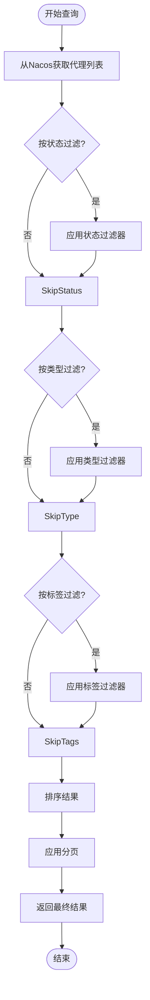
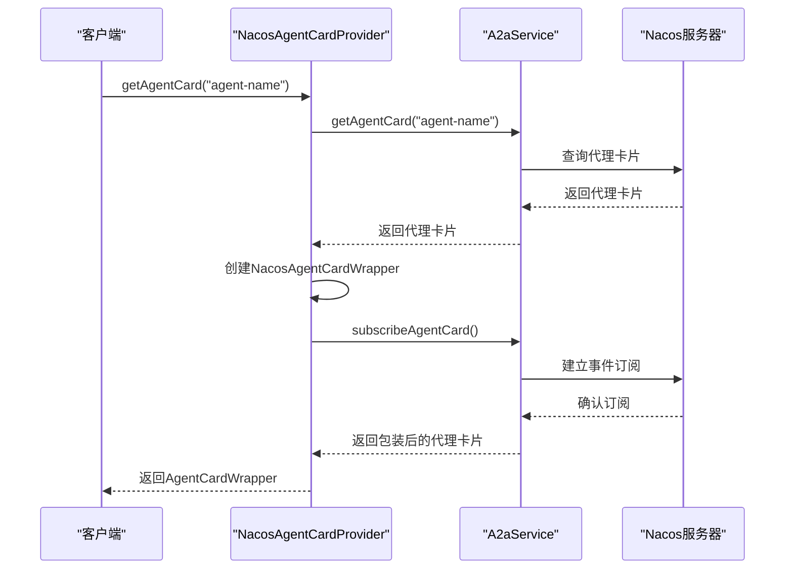

# 查询接口

<cite>
**本文档引用的文件**
- [AgentRegistryService.java](file://spring-ai-alibaba-a2a/spring-ai-alibaba-a2a-common/src/main/java/com/alibaba/cloud/ai/a2a/registry/AgentRegistryService.java)
- [AgentRegistry.java](file://spring-ai-alibaba-a2a/spring-ai-alibaba-a2a-common/src/main/java/com/alibaba/cloud/ai/a2a/registry/AgentRegistry.java)
- [NacosAgentRegistry.java](file://spring-ai-alibaba-a2a/spring-ai-alibaba-a2a-registry/src/main/java/com/alibaba/cloud/ai/a2a/registry/nacos/register/NacosAgentRegistry.java)
- [NacosA2aOperationService.java](file://spring-ai-alibaba-a2a/spring-ai-alibaba-a2a-registry/src/main/java/com/alibaba/cloud/ai/a2a/registry/nacos/service/NacosA2aOperationService.java)
- [NacosAgentCardProvider.java](file://spring-ai-alibaba-a2a/spring-ai-alibaba-a2a-registry/src/main/java/com/alibaba/cloud/ai/a2a/registry/nacos/discovery/NacosAgentCardProvider.java)
- [AgentCardProvider.java](file://spring-ai-alibaba-graph-core/src/main/java/com/alibaba/cloud/ai/graph/agent/a2a/AgentCardProvider.java)
</cite>

## 目录
1. [引言](#引言)
2. [核心查询方法设计](#核心查询方法设计)
3. [查询条件组合策略](#查询条件组合策略)
4. [安全机制设计](#安全机制设计)
5. [性能优化建议](#性能优化建议)
6. [结论](#结论)

## 引言
A2A服务发现的查询接口是实现智能代理（Agent）动态发现与调用的核心组件。该系统基于Nacos作为注册中心，通过标准化的AgentCard模型来描述和管理各类智能代理。本文档详细说明了查询接口的设计与实现，重点解析AgentRegistryService及相关组件提供的查询功能。

## 核心查询方法设计
A2A服务发现的查询功能主要通过`AgentCardProvider`接口及其Nacos实现`NacosAgentCardProvider`提供。虽然`AgentRegistryService`本身主要用于代理注册，但其依赖的Nacos服务提供了完整的查询能力。

### findAgentsByType 方法
系统通过`AgentCard`对象中的类型信息实现按类型查询。在Nacos中，代理类型作为元数据存储，可通过服务发现API进行过滤查询。客户端可以通过获取所有代理列表后，在本地进行类型匹配过滤。

### findAgentsByName 方法
`NacosAgentCardProvider`类实现了`getAgentCard(String agentName)`方法，支持通过代理名称精确查询单个代理实例：
```java
public AgentCardWrapper getAgentCard(String agentName) {
    try {
        AgentCard nacosAgentCard = a2aService.getAgentCard(agentName);
        agentCard = new NacosAgentCardWrapper(AgentCardConverterUtil.convertToA2aAgentCard(nacosAgentCard));
        a2aService.subscribeAgentCard(agentName, new AbstractNacosAgentCardListener() {
            @Override
            public void onEvent(NacosAgentCardEvent event) {
                AgentCard newAgentCard = event.getAgentCard();
                agentCard.setAgentCard(AgentCardConverterUtil.convertToA2aAgentCard(newAgentCard));
            }
        });
        return agentCard;
    }
    catch (NacosException e) {
        throw new NacosRuntimeException(e.getErrCode(), e.getErrMsg());
    }
}
```
此方法不仅返回指定名称的代理卡片，还建立了事件订阅机制，确保代理配置变更时能实时更新。

### findAgentsByTags 方法
标签查询功能通过组合多个代理属性实现。系统支持在`AgentCard`中定义标签集合，查询时通过遍历所有注册的代理并匹配标签来实现过滤。虽然当前实现未直接暴露批量查询接口，但可通过`A2aService`获取所有代理后进行本地过滤。

**代码路径**
- [NacosAgentCardProvider.java#L31-L84](file://spring-ai-alibaba-a2a/spring-ai-alibaba-a2a-registry/src/main/java/com/alibaba/cloud/ai/a2a/registry/nacos/discovery/NacosAgentCardProvider.java#L31-L84)
- [AgentCardProvider.java#L0-L54](file://spring-ai-alibaba-graph-core/src/main/java/com/alibaba/cloud/ai/graph/agent/a2a/AgentCardProvider.java#L0-L54)

## 查询条件组合策略
A2A服务发现支持多种查询条件的组合使用，以满足复杂的代理查找需求。

### 精确匹配
精确匹配主要用于通过代理名称或ID查找特定代理。`getAgentCard(String agentName)`方法实现了基于名称的精确匹配，利用Nacos的服务发现机制快速定位目标代理。

### 模糊匹配
模糊匹配功能通过前端或客户端实现。例如，在`AgentList.vue`中可以看到基于关键词的模糊搜索实现：
```javascript
filtered = filtered.filter(agent => 
  agent.name.toLowerCase().includes(keyword) ||
  agent.id.toLowerCase().includes(keyword) ||
  (agent.description && agent.description.toLowerCase().includes(keyword))
)
```
这种实现在获取基础数据集后，通过字符串包含判断实现多字段模糊搜索。

### 复合条件过滤
复合条件过滤结合了多种查询维度，如状态、类型和标签的组合。系统通过链式过滤实现：
1. 首先通过Nacos API获取相关服务实例
2. 在应用层面对返回的代理列表进行多维度过滤
3. 支持分页和排序功能



**图表来源**
- [NacosAgentCardProvider.java](file://spring-ai-alibaba-a2a/spring-ai-alibaba-a2a-registry/src/main/java/com/alibaba/cloud/ai/a2a/registry/nacos/discovery/NacosAgentCardProvider.java#L31-L84)
- [AgentList.vue](file://spring-ai-alibaba-nl2sql/spring-ai-alibaba-nl2sql-web-ui/src/views/AgentList.vue#L278-L298)

**章节来源**
- [NacosAgentCardProvider.java](file://spring-ai-alibaba-a2a/spring-ai-alibaba-a2a-registry/src/main/java/com/alibaba/cloud/ai/a2a/registry/nacos/discovery/NacosAgentCardProvider.java#L31-L84)
- [AgentList.vue](file://spring-ai-alibaba-nl2sql/spring-ai-alibaba-nl2sql-web-ui/src/views/AgentList.vue#L278-L298)

## 安全机制设计
A2A查询接口设计了多层次的安全防护机制，确保系统的稳定性和数据安全性。

### 权限验证
系统通过Nacos的权限控制体系实现访问控制。只有经过认证的客户端才能查询代理信息。`NacosAgentCardProvider`在初始化时需要传入已认证的`A2aService`实例，确保所有查询操作都具有合法身份。

### 查询频率限制
虽然当前代码中未显式实现查询频率限制，但Nacos服务器端通常会配置请求速率限制，防止恶意高频查询对系统造成压力。建议在生产环境中配置适当的限流策略。

### 敏感信息过滤
敏感信息保护通过以下方式实现：
1. `AgentCardWrapper`封装了原始的`AgentCard`，可以控制暴露的属性
2. 在序列化输出时，敏感字段可以被排除
3. 订阅机制允许动态更新代理配置，而无需暴露完整配置信息



**图表来源**
- [NacosAgentCardProvider.java](file://spring-ai-alibaba-a2a/spring-ai-alibaba-a2a-registry/src/main/java/com/alibaba/cloud/ai/a2a/registry/nacos/discovery/NacosAgentCardProvider.java#L31-L84)
- [NacosA2aOperationService.java](file://spring-ai-alibaba-a2a/spring-ai-alibaba-a2a-registry/src/main/java/com/alibaba/cloud/ai/a2a/registry/nacos/service/NacosA2aOperationService.java#L31-L66)

**章节来源**
- [NacosAgentCardProvider.java](file://spring-ai-alibaba-a2a/spring-ai-alibaba-a2a-registry/src/main/java/com/alibaba/cloud/ai/a2a/registry/nacos/discovery/NacosAgentCardProvider.java#L31-L84)

## 性能优化建议
为确保A2A服务发现在高并发场景下的性能表现，提出以下优化建议：

### 索引优化
在Nacos数据库层面，应对以下字段建立索引：
- 代理名称（name）
- 代理类型（type）
- 标签（tags）
- 状态（status）

这可以显著提升查询效率，特别是在大规模代理注册的场景下。

### 查询超时设置
建议在客户端设置合理的查询超时时间，避免因网络问题导致线程阻塞。可以通过配置`A2aService`的超时参数来实现：
```java
// 示例：设置查询超时
Properties properties = new Properties();
properties.setProperty("serverAddr", "nacos-server:8848");
properties.setProperty("timeout", "5000"); // 5秒超时
```

### 结果集大小控制
对于批量查询操作，应实施分页机制，避免一次性返回过多数据。建议：
1. 默认限制单次查询返回结果不超过100条
2. 提供分页参数支持（page, size）
3. 对大型结果集实施懒加载策略

### 缓存策略
实现多级缓存机制：
1. 客户端缓存：`NacosAgentCardProvider`已通过`AgentCardWrapper`实现了本地缓存
2. 查询结果缓存：对频繁查询的结果进行短期缓存
3. 使用Redis等分布式缓存存储热点代理信息

## 结论
A2A服务发现的查询接口设计充分考虑了灵活性、安全性和性能需求。通过`AgentCardProvider`接口抽象，系统实现了与注册中心的解耦，支持多种查询模式。尽管核心查询功能主要由Nacos提供，但上层封装确保了API的一致性和易用性。未来可进一步完善批量查询API，增强复合条件查询的原生支持，并强化安全审计功能。