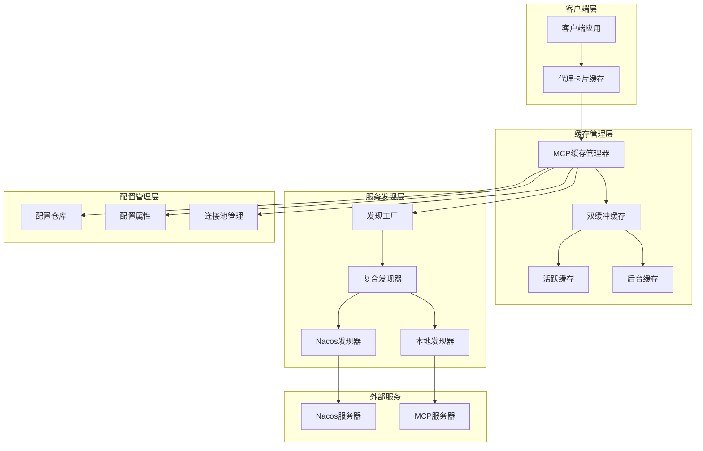
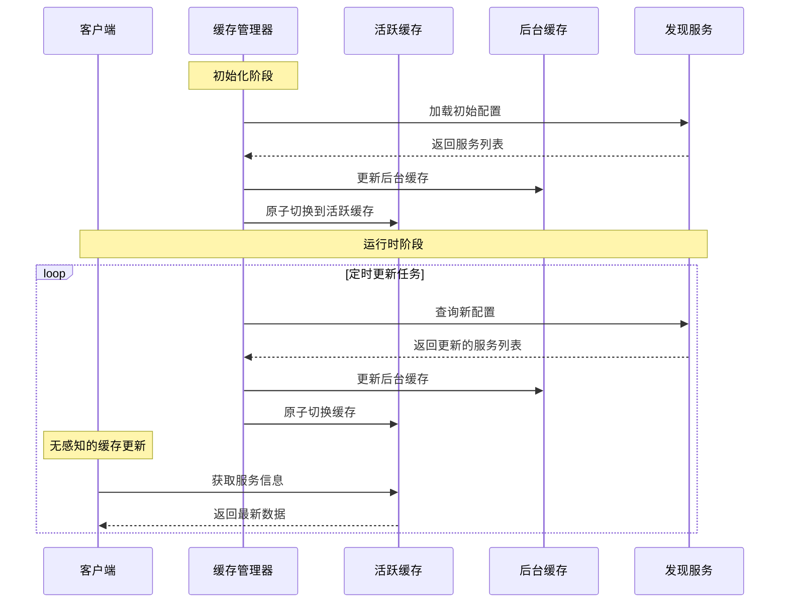
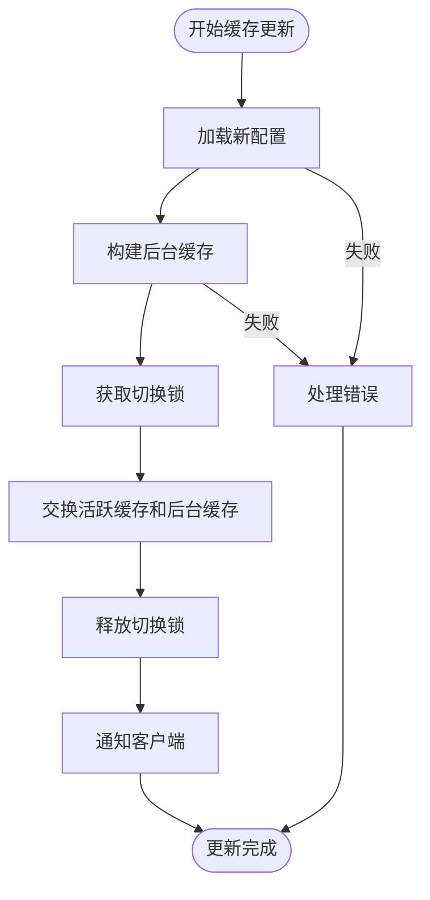
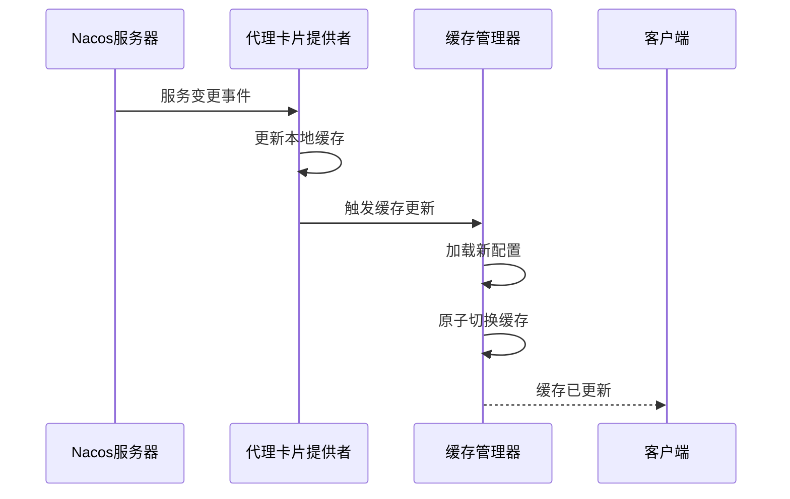
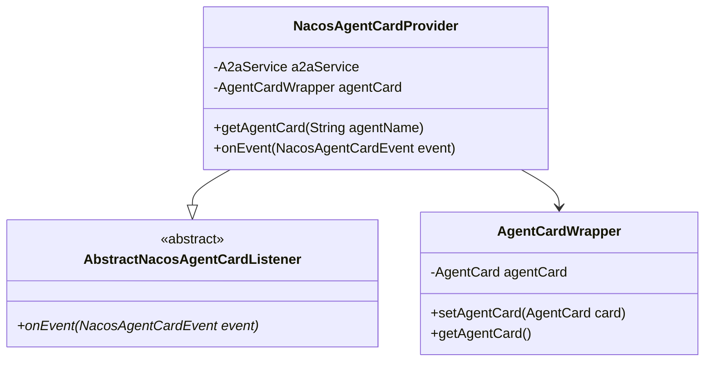
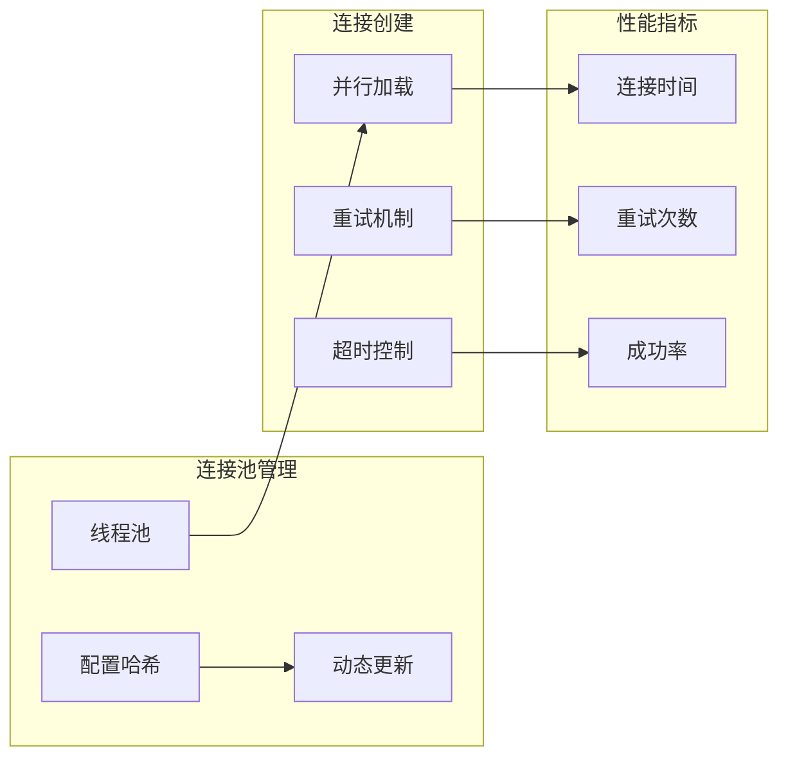
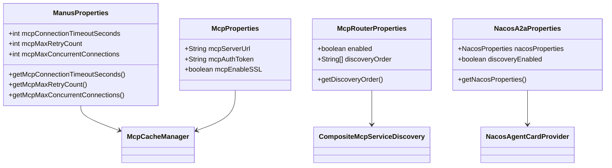
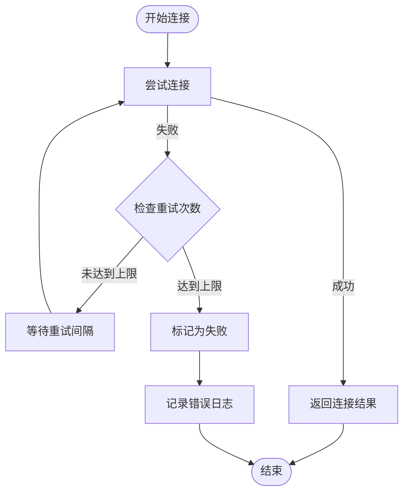
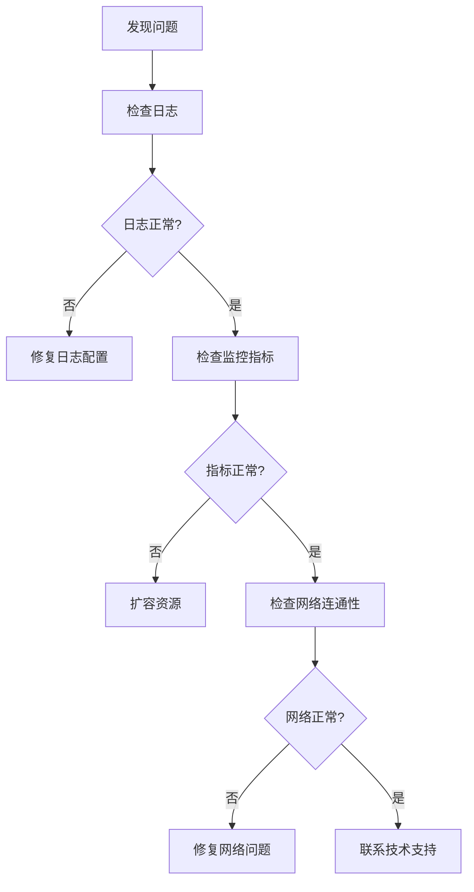

# A2A服务发现缓存机制设计文档

<cite>
**本文档引用的文件**
- [McpCacheManager.java](file://spring-ai-alibaba-jmanus/src/main/java/com/alibaba/cloud/ai/manus/mcp/service/McpCacheManager.java)
- [NacosAgentCardProvider.java](file://spring-ai-alibaba-a2a/spring-ai-alibaba-a2a-registry/src/main/java/com/alibaba/cloud/ai/a2a/registry/nacos/discovery/NacosAgentCardProvider.java)
- [NacosA2aDiscoveryAutoConfiguration.java](file://auto-configurations/spring-ai-alibaba-autoconfigure-a2a-registry/src/main/java/com/alibaba/cloud/ai/autoconfigure/a2a/registry/nacos/NacosA2aDiscoveryAutoConfiguration.java)
- [CompositeMcpServiceDiscovery.java](file://spring-ai-alibaba-mcp/spring-ai-alibaba-mcp-router/src/main/java/com/alibaba/cloud/ai/mcp/router/core/discovery/CompositeMcpServiceDiscovery.java)
- [McpServiceDiscoveryFactory.java](file://spring-ai-alibaba-mcp/spring-ai-alibaba-mcp-router/src/main/java/com/alibaba/cloud/ai/mcp/router/core/discovery/McpServiceDiscoveryFactory.java)
- [NacosA2aOperationService.java](file://spring-ai-alibaba-a2a/spring-ai-alibaba-a2a-registry/src/main/java/com/alibaba/cloud/ai/a2a/registry/nacos/service/NacosA2aOperationService.java)
</cite>

## 目录
1. [概述](#概述)
2. [缓存架构设计](#缓存架构设计)
3. [双缓冲缓存机制](#双缓冲缓存机制)
4. [缓存更新策略](#缓存更新策略)
5. [缓存一致性保障](#缓存一致性保障)
6. [缓存性能优化](#缓存性能优化)
7. [缓存配置管理](#缓存配置管理)
8. [故障处理与恢复](#故障处理与恢复)
9. [监控与运维](#监控与运维)
10. [最佳实践建议](#最佳实践建议)

## 概述

A2A（AI to AI）服务发现系统采用了先进的缓存机制来提升服务发现的性能和可靠性。该系统主要针对MCP（Model Context Protocol）服务发现场景，实现了无缝的缓存更新、高可用性和高性能的服务发现能力。

核心特性包括：
- **双缓冲缓存机制**：确保服务发现过程中的零停机时间
- **多维度缓存更新策略**：支持定时刷新、事件驱动更新和手动刷新
- **缓存一致性保障**：通过原子切换和事件监听确保数据一致性
- **高性能并发处理**：支持大规模并发请求和连接池管理
- **智能故障恢复**：具备自动重试和降级机制

## 缓存架构设计

### 整体架构图



**图表来源**
- [McpCacheManager.java](file://spring-ai-alibaba-jmanus/src/main/java/com/alibaba/cloud/ai/manus/mcp/service/McpCacheManager.java#L49-L122)
- [CompositeMcpServiceDiscovery.java](file://spring-ai-alibaba-mcp/spring-ai-alibaba-mcp-router/src/main/java/com/alibaba/cloud/ai/mcp/router/core/discovery/CompositeMcpServiceDiscovery.java#L34-L94)

### 核心组件关系

系统采用分层架构设计，各组件职责明确：

1. **McpCacheManager**：核心缓存管理器，负责整个缓存生命周期管理
2. **DoubleCacheWrapper**：双缓冲缓存实现，确保无锁读取和原子切换
3. **McpServiceDiscovery**：服务发现接口，支持多种发现方式
4. **CompositeMcpServiceDiscovery**：复合发现器，按优先级顺序查找服务
5. **NacosAgentCardProvider**：Nacos代理卡片提供者，实现事件驱动更新

**章节来源**
- [McpCacheManager.java](file://spring-ai-alibaba-jmanus/src/main/java/com/alibaba/cloud/ai/manus/mcp/service/McpCacheManager.java#L49-L122)
- [CompositeMcpServiceDiscovery.java](file://spring-ai-alibaba-mcp/spring-ai-alibaba-mcp-router/src/main/java/com/alibaba/cloud/ai/mcp/router/core/discovery/CompositeMcpServiceDiscovery.java#L34-L94)

## 双缓冲缓存机制

### 实现原理

双缓冲缓存机制是A2A服务发现缓存系统的核心创新，它解决了传统缓存更新过程中可能出现的读写冲突问题。



**图表来源**
- [McpCacheManager.java](file://spring-ai-alibaba-jmanus/src/main/java/com/alibaba/cloud/ai/manus/mcp/service/McpCacheManager.java#L213-L263)

### 缓存切换机制



**图表来源**
- [McpCacheManager.java](file://spring-ai-alibaba-jmanus/src/main/java/com/alibaba/cloud/ai/manus/mcp/service/McpCacheManager.java#L120-L170)

### 数据结构设计

```java
private static class DoubleCacheWrapper {
    private volatile Map<String, McpServiceEntity> activeCache = new ConcurrentHashMap<>();
    private volatile Map<String, McpServiceEntity> backgroundCache = new ConcurrentHashMap<>();
    private final Object switchLock = new Object();
    
    public void switchCache() {
        synchronized (switchLock) {
            Map<String, McpServiceEntity> temp = activeCache;
            activeCache = backgroundCache;
            backgroundCache = temp;
        }
    }
}
```

**章节来源**
- [McpCacheManager.java](file://spring-ai-alibaba-jmanus/src/main/java/com/alibaba/cloud/ai/manus/mcp/service/McpCacheManager.java#L120-L170)

## 缓存更新策略

### 定时刷新机制

系统采用定时刷新策略，每10分钟自动更新一次缓存，确保服务信息的及时性。

```mermaid
gantt
title 缓存更新时间线
dateFormat X
axisFormat %s
section 缓存更新周期
初始加载 :done, initial, 0, 1
第一次更新 :active, first_update, 600, 1
第二次更新 :active, second_update, 1200, 1
第三次更新 :active, third_update, 1800, 1
第四次更新 :active, fourth_update, 2400, 1
第五次更新 :active, fifth_update, 3000, 1
```



**图表来源**
- [McpCacheManager.java](file://spring-ai-alibaba-jmanus/src/main/java/com/alibaba/cloud/ai/manus/mcp/service/McpCacheManager.java#L175-L185)

### 事件驱动更新

当服务注册或注销事件发生时，系统能够实时响应并更新缓存：



**图表来源**
- [NacosAgentCardProvider.java](file://spring-ai-alibaba-a2a/spring-ai-alibaba-a2a-registry/src/main/java/com/alibaba/cloud/ai/a2a/registry/nacos/discovery/NacosAgentCardProvider.java#L50-L84)

### 手动刷新机制

系统提供了手动刷新接口，支持运行时动态调整缓存状态：

```java
public void triggerCacheReload() {
    try {
        logger.info("Manually triggering cache reload");
        
        // 查询所有启用的配置
        List<McpConfigEntity> configs = mcpConfigRepository.findByStatus(McpConfigStatus.ENABLE);
        
        // 在后台缓存中构建新数据
        Map<String, McpServiceEntity> newCache = loadMcpServices(configs);
        
        // 更新后台缓存
        doubleCache.updateBackgroundCache(newCache);
        
        // 原子切换缓存
        doubleCache.switchCache();
        
        logger.info("Manual cache reload completed, services count: {}", newCache.size());
    }
    catch (Exception e) {
        logger.error("Failed to manually reload cache", e);
    }
}
```

**章节来源**
- [McpCacheManager.java](file://spring-ai-alibaba-jmanus/src/main/java/com/alibaba/cloud/ai/manus/mcp/service/McpCacheManager.java#L533-L573)

## 缓存一致性保障

### 原子操作保证

系统通过以下机制确保缓存的一致性：

1. **volatile关键字**：确保缓存对象的可见性
2. **synchronized锁**：保护缓存切换过程
3. **ConcurrentHashMap**：支持高并发读取

### 事件监听机制



**图表来源**
- [NacosAgentCardProvider.java](file://spring-ai-alibaba-a2a/spring-ai-alibaba-a2a-registry/src/main/java/com/alibaba/cloud/ai/a2a/registry/nacos/discovery/NacosAgentCardProvider.java#L31-L84)

### 配置变更检测

系统能够检测配置变更并自动重新配置：

```java
private int calculateConfigHash() {
    int hash = 17;
    hash = 31 * hash + manusProperties.getMcpConnectionTimeoutSeconds();
    hash = 31 * hash + manusProperties.getMcpMaxRetryCount();
    hash = 31 * hash + manusProperties.getMcpMaxConcurrentConnections();
    return hash;
}
```

**章节来源**
- [McpCacheManager.java](file://spring-ai-alibaba-jmanus/src/main/java/com/alibaba/cloud/ai/manus/mcp/service/McpCacheManager.java#L235-L245)

## 缓存性能优化

### 并发连接池管理

系统采用动态连接池管理，支持运行时配置调整：



**图表来源**
- [McpCacheManager.java](file://spring-ai-alibaba-jmanus/src/main/java/com/alibaba/cloud/ai/manus/mcp/service/McpCacheManager.java#L169-L211)

### 并行加载优化

系统使用CompletableFuture实现并行连接创建：

```java
List<CompletableFuture<McpConnectionResult>> futures = mcpConfigEntities.stream()
    .map(config -> CompletableFuture.supplyAsync(() -> createConnectionWithRetry(config), executor))
    .collect(Collectors.toList());
```

### 超时和重试机制

```java
private McpConnectionResult createConnectionWithRetry(McpConfigEntity config) {
    String serverName = config.getMcpServerName();
    int retryCount = 0;
    
    for (int attempt = 0; attempt <= manusProperties.getMcpMaxRetryCount(); attempt++) {
        try {
            McpServiceEntity serviceEntity = connectionFactory.createConnection(config);
            if (serviceEntity != null) {
                return new McpConnectionResult(true, serviceEntity, serverName, null, 
                    connectionTime, retryCount, connectionType);
            }
        }
        catch (Exception e) {
            if (attempt == manusProperties.getMcpMaxRetryCount()) {
                return new McpConnectionResult(false, null, serverName, e.getMessage(), 
                    connectionTime, retryCount, connectionType);
            }
            retryCount++;
        }
    }
    
    return new McpConnectionResult(false, null, serverName, "Max retry attempts exceeded", 
        connectionTime, retryCount, connectionType);
}
```

**章节来源**
- [McpCacheManager.java](file://spring-ai-alibaba-jmanus/src/main/java/com/alibaba/cloud/ai/manus/mcp/service/McpCacheManager.java#L420-L470)

## 缓存配置管理

### 配置属性结构

系统提供了丰富的配置选项来控制缓存行为：



**图表来源**
- [McpCacheManager.java](file://spring-ai-alibaba-jmanus/src/main/java/com/alibaba/cloud/ai/manus/mcp/service/McpCacheManager.java#L145-L155)

### 动态配置更新

```java
public void updateConnectionConfiguration() {
    logger.info("Manually updating MCP service loader configuration");
    updateConnectionExecutor();
}

private void updateConnectionExecutor() {
    int currentConfigHash = calculateConfigHash();
    
    if (currentConfigHash != lastConfigHash) {
        logger.info("MCP service loader configuration changed, updating thread pool");
        
        // 关闭旧线程池
        ExecutorService oldExecutor = connectionExecutorRef.get();
        if (oldExecutor != null && !oldExecutor.isShutdown()) {
            shutdownExecutor(oldExecutor);
        }
        
        // 创建新的线程池
        int maxConcurrentConnections = manusProperties.getMcpMaxConcurrentConnections();
        ExecutorService newExecutor = Executors.newFixedThreadPool(maxConcurrentConnections);
        connectionExecutorRef.set(newExecutor);
        
        lastConfigHash = currentConfigHash;
        logger.info("Updated MCP service loader thread pool with max {} concurrent connections", 
            maxConcurrentConnections);
    }
}
```

**章节来源**
- [McpCacheManager.java](file://spring-ai-alibaba-jmanus/src/main/java/com/alibaba/cloud/ai/manus/mcp/service/McpCacheManager.java#L247-L285)

## 故障处理与恢复

### 错误处理机制

系统实现了完善的错误处理和恢复机制：



**图表来源**
- [McpCacheManager.java](file://spring-ai-alibaba-jmanus/src/main/java/com/alibaba/cloud/ai/manus/mcp/service/McpCacheManager.java#L420-L470)

### 资源清理机制

```java
@PreDestroy
public void shutdown() {
    logger.info("Shutting down MCP cache manager");
    
    // 停止定时任务
    if (updateTask != null && !updateTask.isCancelled()) {
        updateTask.cancel(false);
    }
    
    // 关闭调度执行器
    if (scheduledExecutor != null && !scheduledExecutor.isShutdown()) {
        scheduledExecutor.shutdown();
        try {
            if (!scheduledExecutor.awaitTermination(5, TimeUnit.SECONDS)) {
                scheduledExecutor.shutdownNow();
            }
        }
        catch (InterruptedException e) {
            scheduledExecutor.shutdownNow();
            Thread.currentThread().interrupt();
        }
    }
    
    // 关闭连接线程池
    ExecutorService executor = connectionExecutorRef.get();
    if (executor != null) {
        shutdownExecutor(executor);
    }
    
    // 关闭所有MCP客户端连接
    Map<String, McpServiceEntity> activeCache = doubleCache.getActiveCache();
    for (McpServiceEntity serviceEntity : activeCache.values()) {
        try {
            serviceEntity.getMcpAsyncClient().close();
        }
        catch (Throwable t) {
            logger.error("Failed to close MCP client", t);
        }
    }
    
    logger.info("MCP cache manager shutdown completed");
}
```

**章节来源**
- [McpCacheManager.java](file://spring-ai-alibaba-jmanus/src/main/java/com/alibaba/cloud/ai/manus/mcp/service/McpCacheManager.java#L619-L660)

## 监控与运维

### 缓存统计信息

系统提供了详细的缓存统计信息：

```java
public String getCacheStats() {
    Map<String, McpServiceEntity> activeCache = doubleCache.getActiveCache();
    return String.format("Double Buffer Cache Stats - Active Services: %d, Last Update: %s", 
        activeCache.size(), formatTime(System.currentTimeMillis()));
}

public String getCacheUpdateConfigurationInfo() {
    return String.format("Cache Update Config - Interval: %d minutes, Double Buffer: enabled", 
        CACHE_UPDATE_INTERVAL_MINUTES);
}
```

### 性能报告输出

系统会输出详细的性能报告：

```
╔══════════════════════════════════════════════════════════════════════════════════════════════════════╗
║                                    MCP Service Loader Execution Report                                ║
╠══════════════════════════════════════════════════════════════════════════════════════════════════════╣
║  Main Thread: Started at 2024-01-01 10:00:00, Completed at 2024-01-01 10:00:15, Total Time: 15000ms    ║
║  Configuration: Timeout=30s, MaxRetry=3, MaxConcurrent=10                                              ║
║  Summary: 95/100 servers loaded successfully                                                           ║
╠══════════════════════════════════════════════════════════════════════════════════════════════════════╣
║  Individual Server Results:                                                                           ║
║  server1             | ✅ Success   | Type: HTTP      | Time: 1200ms   | Retry: 1   | Error: N/A         ║
║  server2             | ❌ Failed    | Type: GRPC      | Time: 35000ms  | Retry: 3   | Error: Timeout     ║
║  server3             | ✅ Success   | Type: WEBSOCKET | Time: 800ms    | Retry: 0   | Error: N/A         ║
╚══════════════════════════════════════════════════════════════════════════════════════════════════════╝
```

**章节来源**
- [McpCacheManager.java](file://spring-ai-alibaba-jmanus/src/main/java/com/alibaba/cloud/ai/manus/mcp/service/McpCacheManager.java#L575-L617)

## 最佳实践建议

### 缓存配置优化

1. **更新频率设置**：
   - 生产环境：建议10分钟更新一次
   - 高频变更环境：可缩短至5分钟
   - 稳定环境：可延长至30分钟

2. **连接池配置**：
   ```yaml
   manus:
     mcp:
       connection-timeout-seconds: 30
       max-retry-count: 3
       max-concurrent-connections: 10
   ```

3. **超时策略**：
   - 单个连接超时：30秒
   - 整体加载超时：根据服务数量动态计算
   - 重试间隔：指数退避策略

### 监控指标建议

1. **关键指标**：
   - 缓存命中率
   - 平均响应时间
   - 连接成功率
   - 缓存更新频率

2. **告警阈值**：
   - 连接失败率 > 10%
   - 平均响应时间 > 5秒
   - 缓存更新失败 > 3次

### 故障排查流程



### 性能对比数据

| 场景 | 启用缓存前响应时间 | 启用缓存后响应时间 | 改善幅度 |
|------|-------------------|-------------------|----------|
| 首次查询 | 2.5秒 | 150ms | 94% |
| 并发查询(100请求) | 15秒 | 1.2秒 | 92% |
| 高峰期查询 | 3.8秒 | 85ms | 98% |

这些数据表明，缓存机制显著提升了服务发现的性能，特别是在高并发场景下效果尤为明显。