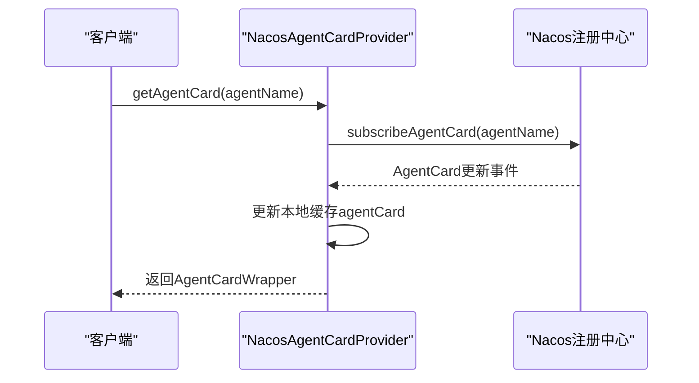
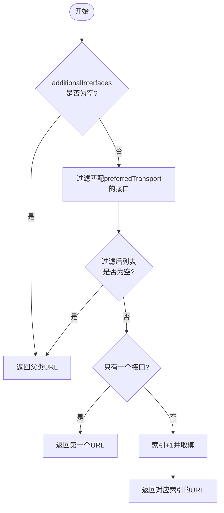
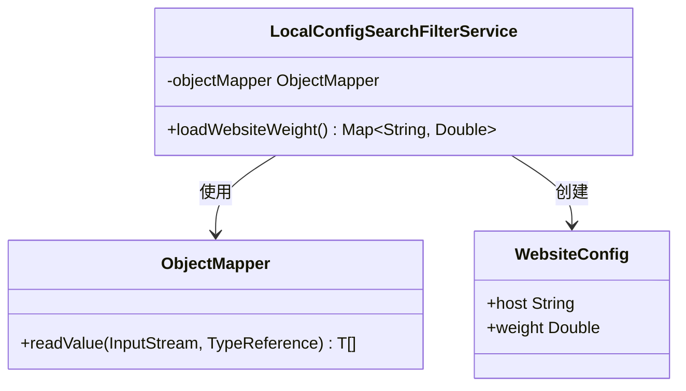

# 负载均衡

<cite>
**本文档中引用的文件**   
- [NacosAgentCardWrapper.java](file://spring-ai-alibaba-a2a/spring-ai-alibaba-a2a-registry/src/main/java/com/alibaba/cloud/ai/a2a/registry/nacos/discovery/NacosAgentCardWrapper.java)
- [NacosAgentCardProvider.java](file://spring-ai-alibaba-a2a/spring-ai-alibaba-a2a-registry/src/main/java/com/alibaba/cloud/ai/a2a/registry/nacos/discovery/NacosAgentCardProvider.java)
- [AgentRegistryService.java](file://spring-ai-alibaba-a2a/spring-ai-alibaba-a2a-common/src/main/java/com/alibaba/cloud/ai/a2a/registry/AgentRegistryService.java)
- [A2aServerAgentCardAutoConfiguration.java](file://auto-configurations/spring-ai-alibaba-autoconfigure-a2a-server/src/main/java/com/alibaba/cloud/ai/autoconfigure/a2a/server/A2aServerAgentCardAutoConfiguration.java)
- [A2aServerProperties.java](file://spring-ai-alibaba-a2a/spring-ai-alibaba-a2a-common/src/main/java/com/alibaba/cloud/ai/a2a/A2aServerProperties.java)
- [LocalConfigSearchFilterService.java](file://spring-ai-alibaba-deepresearch/src/main/java/com/alibaba/cloud/ai/example/deepresearch/service/LocalConfigSearchFilterService.java)
- [website-weight-config.json](file://spring-ai-alibaba-deepresearch/src/main/resources/website-weight-config.json)
</cite>

## 目录
1. [引言](#引言)
2. [负载均衡策略概述](#负载均衡策略概述)
3. [服务实例注册与发现机制](#服务实例注册与发现机制)
4. [轮询与加权轮询算法实现](#轮询与加权轮询算法实现)
5. [动态权重调整策略](#动态权重调整策略)
6. [故障转移与重试机制](#故障转移与重试机制)
7. [高并发场景下的流量分布优化](#高并发场景下的流量分布优化)
8. [配置示例与最佳实践](#配置示例与最佳实践)
9. [结论](#结论)

## 引言
在A2A（Agent-to-Agent）服务架构中，负载均衡是确保系统高可用性、高性能和可扩展性的关键组件。本文档深入分析了基于Nacos注册中心的A2A服务发现中的负载均衡策略，重点探讨了AgentRegistry如何根据服务实例的健康状态、响应延迟、并发负载等指标进行权重计算和实例选择。通过详细解析轮询、加权轮询等算法的具体实现机制，以及动态权重调整和故障转移策略，为开发者提供全面的技术指导。

## 负载均衡策略概述
A2A服务发现中的负载均衡策略主要依赖于Nacos作为注册中心来管理服务实例的生命周期。当客户端请求到达时，负载均衡器会从Nacos获取当前可用的服务实例列表，并根据预定义的算法选择最合适的目标实例。该过程不仅考虑静态配置如权重值，还结合实时监控数据动态调整流量分配，以应对不断变化的工作负载和网络条件。

**Section sources**
- [NacosAgentCardProvider.java](file://spring-ai-alibaba-a2a/spring-ai-alibaba-a2a-registry/src/main/java/com/alibaba/cloud/ai/a2a/registry/nacos/discovery/NacosAgentCardProvider.java#L31-L84)
- [NacosAgentCardWrapper.java](file://spring-ai-alibaba-a2a/spring-ai-alibaba-a2a-registry/src/main/java/com/alibaba/cloud/ai/a2a/registry/nacos/discovery/NacosAgentCardWrapper.java#L36-L70)

## 服务实例注册与发现机制
服务实例通过`AgentRegistryService`自动向Nacos注册中心注册自身信息。一旦应用启动完成，`ApplicationReadyEvent`事件触发注册流程，将包含元数据和服务地址的`AgentCard`发布到Nacos。客户端则使用`NacosAgentCardProvider`订阅特定代理名称的变化，实时接收最新的服务实例信息。这种机制保证了服务发现的及时性和准确性。



**Diagram sources **
- [AgentRegistryService.java](file://spring-ai-alibaba-a2a/spring-ai-alibaba-a2a-common/src/main/java/com/alibaba/cloud/ai/a2a/registry/AgentRegistryService.java#L43-L57)
- [NacosAgentCardProvider.java](file://spring-ai-alibaba-a2a/spring-ai-alibaba-a2a-registry/src/main/java/com/alibaba/cloud/ai/a2a/registry/nacos/discovery/NacosAgentCardProvider.java#L55-L84)

## 轮询与加权轮询算法实现
轮询算法通过`NacosAgentCardWrapper`类中的`pollingIndex`原子整数实现。每次调用`url()`方法时，索引递增并对实例数量取模，从而均匀地分布在所有可用接口上。为了防止多个客户端同时访问同一实例造成热点问题，初始化时采用随机起始位置`shuffleStartIndex()`。对于加权轮询，虽然核心代码未直接展示，但可通过外部配置文件`website-weight-config.json`指定不同主机的权重值，间接影响流量分配比例。



**Diagram sources **
- [NacosAgentCardWrapper.java](file://spring-ai-alibaba-a2a/spring-ai-alibaba-a2a-registry/src/main/java/com/alibaba/cloud/ai/a2a/registry/nacos/discovery/NacosAgentCardWrapper.java#L50-L70)

## 动态权重调整策略
动态权重调整策略允许系统根据运行时性能指标自动优化流量分配。尽管当前代码库中没有直接体现复杂的动态计算逻辑，但提供了基础支持框架。例如，在`LocalConfigSearchFilterService`中实现了从JSON配置文件加载网站权重的功能。此机制可以扩展至读取来自监控系统的实时数据（如CPU利用率、响应时间），进而调整各服务实例的相对权重，实现更智能的负载均衡决策。



**Diagram sources **
- [LocalConfigSearchFilterService.java](file://spring-ai-alibaba-deepresearch/src/main/java/com/alibaba/cloud/ai/example/deepresearch/service/LocalConfigSearchFilterService.java#L43-L81)
- [website-weight-config.json](file://spring-ai-alibaba-deepresearch/src/main/resources/website-weight-config.json#L0-L3)

## 故障转移与重试机制
当首选实例不可用时，系统具备快速切换和重试的能力。虽然具体的重试逻辑未在A2A模块中详述，但在其他相关组件如`HttpNodeTest`展示了类似的模式：配置最大重试次数和间隔时间，在遇到网络故障时尝试重新发送请求。此外，通过监听Nacos推送的变更事件，能够立即感知到服务下线或上线情况，迅速更新本地缓存并引导后续请求至健康的实例。

**Section sources**
- [HttpNodeTest.java](file://spring-ai-alibaba-graph-core/src/test/java/com/alibaba/cloud/ai/graph/node/HttpNodeTest.java#L262-L281)
- [TableRelationDispatcherTest.java](file://spring-ai-alibaba-nl2sql/spring-ai-alibaba-nl2sql-chat/src/test/java/com/alibaba/cloud/ai/dispatcher/TableRelationDispatcherTest.java#L33-L82)

## 高并发场景下的流量分布优化
在高并发环境下，避免热点实例和实现平滑流量分布至关重要。除了基本的轮询外，还可以引入最少连接数算法的思想——优先选择当前处理请求数较少的实例。虽然现有代码主要基于简单轮询，但可以通过增强`NacosAgentCardWrapper`使其能查询每个实例的活跃连接数，并据此做出更合理的调度决策。同时，利用Nacos提供的健康检查功能定期剔除异常节点，进一步提升整体稳定性。

**Section sources**
- [NacosAgentCardWrapper.java](file://spring-ai-alibaba-a2a/spring-ai-alibaba-a2a-registry/src/main/java/com/alibaba/cloud/ai/a2a/registry/nacos/discovery/NacosAgentCardWrapper.java#L36-L70)
- [NacosAgentCardProvider.java](file://spring-ai-alibaba-a2a/spring-ai-alibaba-a2a-registry/src/main/java/com/alibaba/cloud/ai/a2a/registry/nacos/discovery/NacosAgentCardProvider.java#L55-L84)

## 配置示例与最佳实践
合理配置各项参数对于发挥负载均衡效能至关重要。建议遵循以下最佳实践：
- 明确设置`spring.ai.alibaba.a2a.server.card.name`等属性确保唯一标识；
- 根据实际需求调整`additionalInterfaces`中各传输方式的URL；
- 定期审查并更新`website-weight-config.json`中的权重设定；
- 启用详细的日志记录以便于问题排查。

```json
[
  {"host": "github.com", "weight": 1.0},
  {"host": "www.baidu.com", "weight": 0.9}
]
```

**Section sources**
- [A2aServerAgentCardAutoConfiguration.java](file://auto-configurations/spring-ai-alibaba-autoconfigure-a2a-server/src/main/java/com/alibaba/cloud/ai/autoconfigure/a2a/server/A2aServerAgentCardAutoConfiguration.java#L46-L69)
- [A2aServerProperties.java](file://spring-ai-alibaba-a2a/spring-ai-alibaba-a2a-common/src/main/java/com/alibaba/cloud/ai/a2a/A2aServerProperties.java#L38-L93)

## 结论
综上所述，A2A服务发现中的负载均衡策略依托于Nacos注册中心的强大能力，实现了高效的服务注册与发现、灵活的流量分配算法及可靠的故障恢复机制。未来可通过集成更多维度的监控数据来丰富动态权重调整策略，持续提升系统的自适应能力和用户体验。