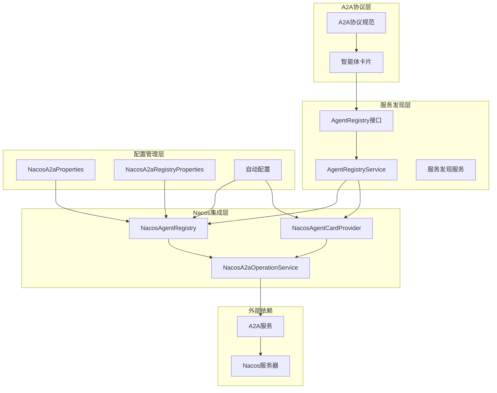
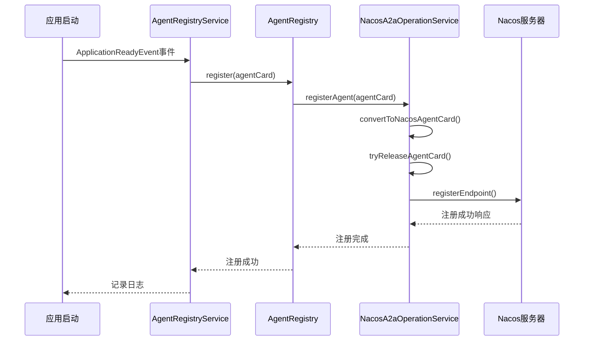
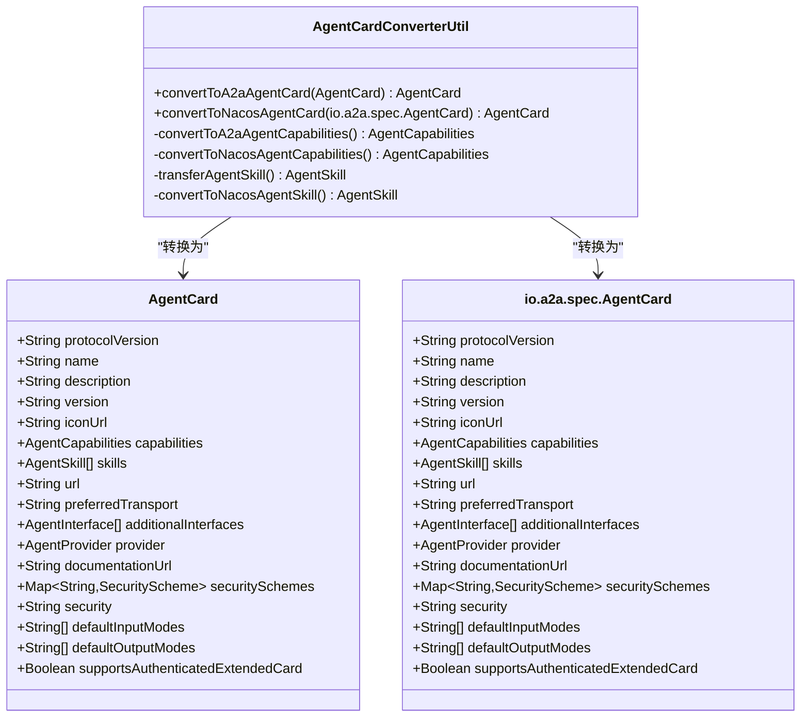
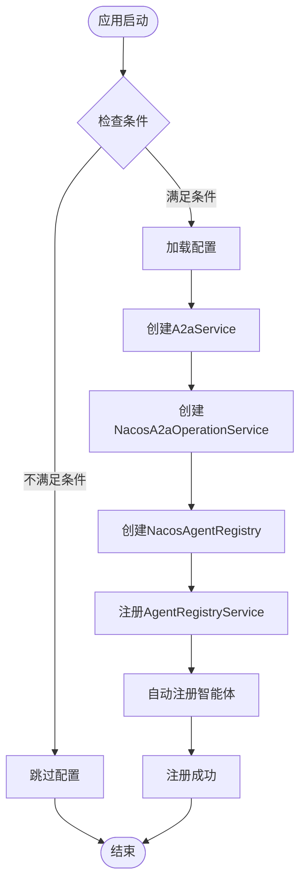
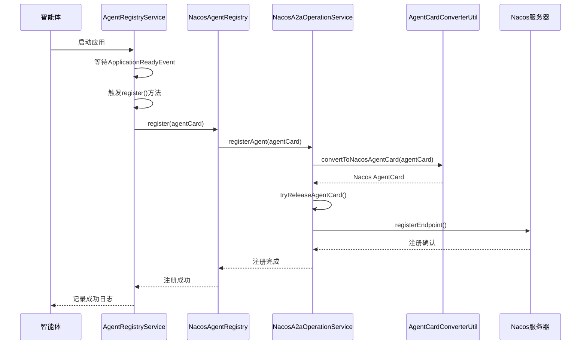
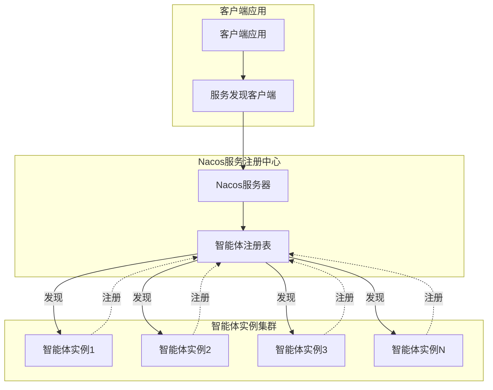
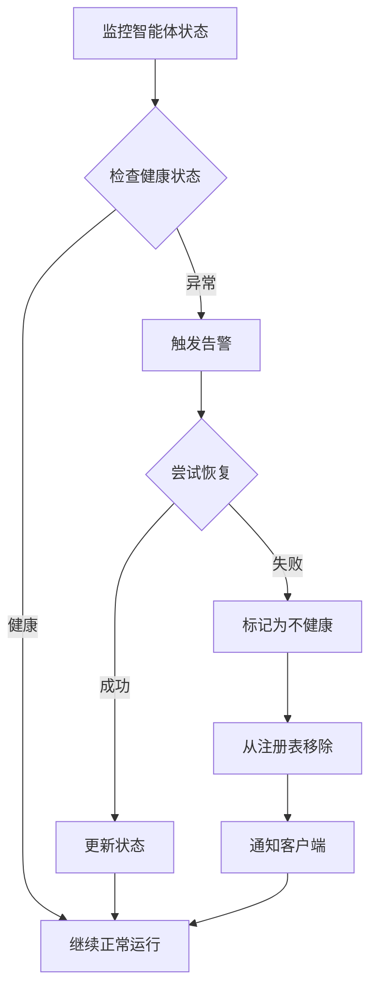

# 服务发现机制文档

<cite>
**本文档引用的文件**
- [AgentRegistry.java](file://spring-ai-alibaba-a2a/spring-ai-alibaba-a2a-common/src/main/java/com/alibaba/cloud/ai/a2a/registry/AgentRegistry.java)
- [AgentRegistryService.java](file://spring-ai-alibaba-a2a/spring-ai-alibaba-a2a-common/src/main/java/com/alibaba/cloud/ai/a2a/registry/AgentRegistryService.java)
- [NacosAgentRegistry.java](file://spring-ai-alibaba-a2a/spring-ai-alibaba-a2a-registry/src/main/java/com/alibaba/cloud/ai/a2a/registry/nacos/register/NacosAgentRegistry.java)
- [NacosA2aOperationService.java](file://spring-ai-alibaba-a2a/spring-ai-alibaba-a2a-registry/src/main/java/com/alibaba/cloud/ai/a2a/registry/nacos/service/NacosA2aOperationService.java)
- [NacosAgentCardProvider.java](file://spring-ai-alibaba-a2a/spring-ai-alibaba-a2a-registry/src/main/java/com/alibaba/cloud/ai/a2a/registry/nacos/discovery/NacosAgentCardProvider.java)
- [NacosA2aDiscoveryAutoConfiguration.java](file://auto-configurations/spring-ai-alibaba-autoconfigure-a2a-registry/src/main/java/com/alibaba/cloud/ai/autoconfigure/a2a/registry/nacos/NacosA2aDiscoveryAutoConfiguration.java)
- [NacosA2aRegistryAutoConfiguration.java](file://auto-configurations/spring-ai-alibaba-autoconfigure-a2a-registry/src/main/java/com/alibaba/cloud/ai/autoconfigure/a2a/registry/nacos/NacosA2aRegistryAutoConfiguration.java)
- [NacosA2aProperties.java](file://spring-ai-alibaba-a2a/spring-ai-alibaba-a2a-registry/src/main/java/com/alibaba/cloud/ai/a2a/registry/nacos/properties/NacosA2aProperties.java)
- [NacosA2aRegistryProperties.java](file://spring-ai-alibaba-a2a/spring-ai-alibaba-a2a-registry/src/main/java/com/alibaba/cloud/ai/a2a/registry/nacos/register/NacosA2aRegistryProperties.java)
- [AgentCardConverterUtil.java](file://spring-ai-alibaba-a2a/spring-ai-alibaba-a2a-registry/src/main/java/com/alibaba/cloud/ai/a2a/registry/nacos/utils/AgentCardConverterUtil.java)
</cite>

## 目录
1. [简介](#简介)
2. [项目架构概览](#项目架构概览)
3. [核心组件分析](#核心组件分析)
4. [AgentRegistry核心作用](#agentregistry核心作用)
5. [服务发现API详解](#服务发现api详解)
6. [Nacos集成机制](#nacos集成机制)
7. [智能体注册流程](#智能体注册流程)
8. [配置指南](#配置指南)
9. [实际应用场景](#实际应用场景)
10. [容错机制](#容错机制)
11. [性能优化建议](#性能优化建议)
12. [故障排除](#故障排除)
13. [总结](#总结)

## 简介

Spring AI Alibaba A2A协议中的服务发现机制是一个高度模块化和可扩展的系统，专门设计用于管理智能体之间的动态发现和通信。该机制通过AgentRegistry接口和Nacos服务注册中心的深度集成，提供了完整的智能体生命周期管理功能。

服务发现机制的核心价值在于：
- 实现智能体的自动注册和注销
- 提供实时的服务实例查询能力
- 支持智能体状态的动态监控
- 确保系统的高可用性和容错性

## 项目架构概览



**图表来源**
- [AgentRegistry.java](file://spring-ai-alibaba-a2a/spring-ai-alibaba-a2a-common/src/main/java/com/alibaba/cloud/ai/a2a/registry/AgentRegistry.java#L23-L29)
- [NacosAgentRegistry.java](file://spring-ai-alibaba-a2a/spring-ai-alibaba-a2a-registry/src/main/java/com/alibaba/cloud/ai/a2a/registry/nacos/register/NacosAgentRegistry.java#L28-L49)
- [NacosA2aOperationService.java](file://spring-ai-alibaba-a2a/spring-ai-alibaba-a2a-registry/src/main/java/com/alibaba/cloud/ai/a2a/registry/nacos/service/NacosA2aOperationService.java#L31-L66)

## 核心组件分析

### AgentRegistry接口设计

AgentRegistry是整个服务发现机制的核心抽象接口，定义了智能体注册的基本契约：

```java
public interface AgentRegistry {
    String registryName();
    void register(AgentCard agentCard);
}
```

该接口的设计遵循单一职责原则，专注于注册功能的抽象。registryName()方法提供了注册中心的标识信息，而register()方法则负责具体的注册逻辑实现。

### AgentRegistryService自动注册机制

AgentRegistryService作为AgentRegistry的具体实现协调器，实现了智能体的自动注册功能：

```java
@EventListener(ApplicationReadyEvent.class)
public void register() {
    LOGGER.info("Auto register agent {} into Registry {}.", agentCard.name(), agentRegistry.registryName());
    try {
        agentRegistry.register(agentCard);
        LOGGER.info("Auto register agent {} into Registry {} successfully.", agentCard.name(),
                agentRegistry.registryName());
    }
    catch (Exception e) {
        LOGGER.error("Auto register agent {} into Registry {} failed.", agentCard.name(),
                agentRegistry.registryName(), e);
    }
}
```

这种设计确保了智能体在应用启动完成后能够自动完成注册，无需手动干预。

**章节来源**
- [AgentRegistry.java](file://spring-ai-alibaba-a2a/spring-ai-alibaba-a2a-common/src/main/java/com/alibaba/cloud/ai/a2a/registry/AgentRegistry.java#L23-L29)
- [AgentRegistryService.java](file://spring-ai-alibaba-a2a/spring-ai-alibaba-a2a-common/src/main/java/com/alibaba/cloud/ai/a2a/registry/AgentRegistryService.java#L43-L57)

## AgentRegistry核心作用

### 注册机制详解

AgentRegistry的核心职责是维护活跃智能体的注册信息。当智能体启动时，会自动向注册中心注册其元数据信息，包括智能体的能力、技能、接口等详细信息。



**图表来源**
- [AgentRegistryService.java](file://spring-ai-alibaba-a2a/spring-ai-alibaba-a2a-common/src/main/java/com/alibaba/cloud/ai/a2a/registry/AgentRegistryService.java#L43-L57)
- [NacosA2aOperationService.java](file://spring-ai-alibaba-a2a/spring-ai-alibaba-a2a-registry/src/main/java/com/alibaba/cloud/ai/a2a/registry/nacos/service/NacosA2aOperationService.java#L58-L66)

### 心跳检测机制

虽然当前实现中没有显式的心跳检测逻辑，但通过Nacos的内置机制和智能体卡片的订阅模式，系统能够实现隐式的心跳检测：

```java
a2aService.subscribeAgentCard(agentName, new AbstractNacosAgentCardListener() {
    @Override
    public void onEvent(NacosAgentCardEvent event) {
        AgentCard newAgentCard = event.getAgentCard();
        if (LOGGER.isDebugEnabled()) {
            LOGGER.debug("Received new Agent Card: {}", JacksonUtils.toJson(newAgentCard));
        }
        agentCard.setAgentCard(AgentCardConverterUtil.convertToA2aAgentCard(newAgentCard));
    }
});
```

这种订阅机制确保了智能体状态的实时更新，相当于一种轻量级的心跳检测。

**章节来源**
- [NacosAgentCardProvider.java](file://spring-ai-alibaba-a2a/spring-ai-alibaba-a2a-registry/src/main/java/com/alibaba/cloud/ai/a2a/registry/nacos/discovery/NacosAgentCardProvider.java#L58-L72)

## 服务发现API详解

### NacosAgentCardProvider实现

NacosAgentCardProvider是服务发现API的核心实现，负责从Nacos服务注册中心获取智能体卡片信息：

```java
@Override
public AgentCardWrapper getAgentCard(String agentName) {
    try {
        AgentCard nacosAgentCard = a2aService.getAgentCard(agentName);
        agentCard = new NacosAgentCardWrapper(AgentCardConverterUtil.convertToA2aAgentCard(nacosAgentCard));
        a2aService.subscribeAgentCard(agentName, new AbstractNacosAgentCardListener() {
            @Override
            public void onEvent(NacosAgentCardEvent event) {
                AgentCard newAgentCard = event.getAgentCard();
                if (LOGGER.isDebugEnabled()) {
                    LOGGER.debug("Received new Agent Card: {}", JacksonUtils.toJson(newAgentCard));
                }
                agentCard.setAgentCard(AgentCardConverterUtil.convertToA2aAgentCard(newAgentCard));
            }
        });
        return agentCard;
    }
    catch (NacosException e) {
        throw new NacosRuntimeException(e.getErrCode(), e.getErrMsg());
    }
}
```

### 智能体卡片转换机制

系统通过AgentCardConverterUtil实现了不同协议间智能体卡片的双向转换：



**图表来源**
- [AgentCardConverterUtil.java](file://spring-ai-alibaba-a2a/spring-ai-alibaba-a2a-registry/src/main/java/com/alibaba/cloud/ai/a2a/registry/nacos/utils/AgentCardConverterUtil.java#L35-L50)
- [AgentCardConverterUtil.java](file://spring-ai-alibaba-a2a/spring-ai-alibaba-a2a-registry/src/main/java/com/alibaba/cloud/ai/a2a/registry/nacos/utils/AgentCardConverterUtil.java#L140-L155)

**章节来源**
- [NacosAgentCardProvider.java](file://spring-ai-alibaba-a2a/spring-ai-alibaba-a2a-registry/src/main/java/com/alibaba/cloud/ai/a2a/registry/nacos/discovery/NacosAgentCardProvider.java#L58-L72)
- [AgentCardConverterUtil.java](file://spring-ai-alibaba-a2a/spring-ai-alibaba-a2a-registry/src/main/java/com/alibaba/cloud/ai/a2a/registry/nacos/utils/AgentCardConverterUtil.java#L35-L50)

## Nacos集成机制

### 自动配置架构

系统通过Spring Boot的自动配置机制实现了Nacos服务注册中心的无缝集成：



**图表来源**
- [NacosA2aRegistryAutoConfiguration.java](file://auto-configurations/spring-ai-alibaba-autoconfigure-a2a-registry/src/main/java/com/alibaba/cloud/ai/autoconfigure/a2a/registry/nacos/NacosA2aRegistryAutoConfiguration.java#L45-L69)
- [NacosA2aDiscoveryAutoConfiguration.java](file://auto-configurations/spring-ai-alibaba-autoconfigure-a2a-registry/src/main/java/com/alibaba/cloud/ai/autoconfigure/a2a/registry/nacos/NacosA2aDiscoveryAutoConfiguration.java#L40-L56)

### Nacos连接配置

NacosA2aProperties类提供了丰富的配置选项，支持多种认证方式和网络环境：

```java
@ConfigurationProperties(prefix = NacosA2aProperties.PREFIX)
public class NacosA2aProperties implements EnvironmentAware {
    public static final String PREFIX = "spring.ai.alibaba.a2a.nacos";
    public static final String DEFAULT_ADDRESS = "127.0.0.1:8848";
    
    private String namespace = "public";
    private String serverAddr;
    private String username;
    private String password;
    private String accessKey;
    private String secretKey;
    private String endpoint;
    
    public Properties getNacosProperties() {
        Properties properties = new Properties();
        properties.put(PropertyKeyConst.NAMESPACE, Objects.toString(this.namespace, ""));
        properties.put(PropertyKeyConst.SERVER_ADDR, Objects.toString(this.serverAddr, ""));
        properties.put(PropertyKeyConst.USERNAME, Objects.toString(this.username, ""));
        properties.put(PropertyKeyConst.PASSWORD, Objects.toString(this.password, ""));
        properties.put(PropertyKeyConst.ACCESS_KEY, Objects.toString(this.accessKey, ""));
        properties.put(PropertyKeyConst.SECRET_KEY, Objects.toString(this.secretKey, ""));
        
        // 处理endpoint配置
        String endpoint = Objects.toString(this.endpoint, "");
        if (endpoint.contains(":")) {
            int index = endpoint.indexOf(":");
            properties.put(PropertyKeyConst.ENDPOINT, endpoint.substring(0, index));
            properties.put(PropertyKeyConst.ENDPOINT_PORT, endpoint.substring(index + 1));
        } else {
            properties.put(PropertyKeyConst.ENDPOINT, endpoint);
        }
        
        return properties;
    }
}
```

**章节来源**
- [NacosA2aProperties.java](file://spring-ai-alibaba-a2a/spring-ai-alibaba-a2a-registry/src/main/java/com/alibaba/cloud/ai/a2a/registry/nacos/properties/NacosA2aProperties.java#L47-L211)

## 智能体注册流程

### 注册前准备

在智能体启动之前，系统会进行一系列的准备工作：

1. **智能体卡片构建**：根据智能体的配置和能力构建AgentCard对象
2. **配置验证**：验证Nacos连接配置的有效性
3. **服务初始化**：初始化A2aService和相关依赖

### 注册执行流程



**图表来源**
- [AgentRegistryService.java](file://spring-ai-alibaba-a2a/spring-ai-alibaba-a2a-common/src/main/java/com/alibaba/cloud/ai/a2a/registry/AgentRegistryService.java#L43-L57)
- [NacosA2aOperationService.java](file://spring-ai-alibaba-a2a/spring-ai-alibaba-a2a-registry/src/main/java/com/alibaba/cloud/ai/a2a/registry/nacos/service/NacosA2aOperationService.java#L58-L66)

### 注册后处理

注册完成后，系统会执行以下操作：

1. **状态同步**：通过订阅机制保持智能体状态的实时同步
2. **健康检查**：定期检查智能体的健康状态
3. **异常处理**：处理注册过程中可能出现的各种异常情况

**章节来源**
- [NacosA2aOperationService.java](file://spring-ai-alibaba-a2a/spring-ai-alibaba-a2a-registry/src/main/java/com/alibaba/cloud/ai/a2a/registry/nacos/service/NacosA2aOperationService.java#L58-L66)

## 配置指南

### 基础配置参数

以下是服务发现机制的主要配置参数：

| 参数名 | 类型 | 默认值 | 描述 |
|--------|------|--------|------|
| `spring.ai.alibaba.a2a.nacos.server-addr` | String | 127.0.0.1:8848 | Nacos服务器地址 |
| `spring.ai.alibaba.a2a.nacos.namespace` | String | public | Nacos命名空间 |
| `spring.ai.alibaba.a2a.nacos.username` | String | - | Nacos用户名 |
| `spring.ai.alibaba.a2a.nacos.password` | String | - | Nacos密码 |
| `spring.ai.alibaba.a2a.nacos.access-key` | String | - | Access Key |
| `spring.ai.alibaba.a2a.nacos.secret-key` | String | - | Secret Key |
| `spring.ai.alibaba.a2a.nacos.endpoint` | String | - | Endpoint地址 |

### 服务发现配置

```yaml
spring:
  ai:
    alibaba:
      a2a:
        nacos:
          # Nacos服务器配置
          server-addr: 127.0.0.1:8848
          namespace: public
          
          # 认证配置
          username: nacos
          password: nacos
          
          # 服务发现配置
          discovery:
            enabled: true
            
          # 服务注册配置
          registry:
            enabled: true
            register-as-latest: true
```

### 高级配置选项

对于生产环境，建议配置以下高级选项：

```yaml
spring:
  ai:
    alibaba:
      a2a:
        nacos:
          # 超时配置
          connect-timeout: 5000
          socket-timeout: 10000
          retry-interval: 1000
          
          # 健康检查配置
          health-check-interval: 30000
          health-check-timeout: 5000
          
          # 重试配置
          max-retry-times: 3
          retry-strategy: exponential-backoff
```

**章节来源**
- [NacosA2aProperties.java](file://spring-ai-alibaba-a2a/spring-ai-alibaba-a2a-registry/src/main/java/com/alibaba/cloud/ai/a2a/registry/nacos/properties/NacosA2aProperties.java#L47-L211)
- [NacosA2aRegistryProperties.java](file://spring-ai-alibaba-a2a/spring-ai-alibaba-a2a-registry/src/main/java/com/alibaba/cloud/ai/a2a/registry/nacos/register/NacosA2aRegistryProperties.java#L28-L41)

## 实际应用场景

### 多实例环境下的智能体发现

在多实例环境下，服务发现机制能够有效地管理多个智能体实例：



### 动态负载均衡

服务发现机制支持智能体实例的动态负载均衡：

1. **实例发现**：客户端通过服务发现API获取可用的智能体实例列表
2. **健康检查**：系统定期检查智能体实例的健康状态
3. **负载分配**：根据实例的负载能力和健康状态进行任务分配
4. **故障转移**：当某个实例不可用时，自动切换到其他可用实例

### 实时状态监控

通过订阅机制，系统能够实现实时的状态监控：

```java
// 订阅智能体状态变化
a2aService.subscribeAgentCard(agentName, new AbstractNacosAgentCardListener() {
    @Override
    public void onEvent(NacosAgentCardEvent event) {
        AgentCard newAgentCard = event.getAgentCard();
        // 处理状态变化
        handleAgentStatusChange(newAgentCard);
    }
});
```

## 容错机制

### 网络分区处理

当发生网络分区时，系统采用以下容错策略：

1. **本地缓存**：保留最近的智能体状态信息
2. **渐进式恢复**：在网络恢复后逐步更新状态
3. **降级服务**：在网络完全不可用时提供基本功能

### 服务宕机处理

针对智能体服务宕机的情况，系统实现了多重保护机制：



### 重试机制

系统内置了智能的重试机制：

```java
// 注册失败时的重试逻辑
public void registerAgent(io.a2a.spec.AgentCard agentCard) {
    AgentCard nacosAgentCard = AgentCardConverterUtil.convertToNacosAgentCard(agentCard);
    try {
        tryReleaseAgentCard(nacosAgentCard);
        registerEndpoint(nacosAgentCard);
    }
    catch (NacosException e) {
        LOGGER.error("Register agent card {} to Nacos failed,", agentCard.name(), e);
        // 可以在这里添加重试逻辑
        throw new NacosRuntimeException(e.getErrCode(), e.getErrMsg());
    }
}
```

**章节来源**
- [NacosA2aOperationService.java](file://spring-ai-alibaba-a2a/spring-ai-alibaba-a2a-registry/src/main/java/com/alibaba/cloud/ai/a2a/registry/nacos/service/NacosA2aOperationService.java#L58-L66)

## 性能优化建议

### 连接池优化

合理配置Nacos连接池参数可以显著提升性能：

```yaml
spring:
  ai:
    alibaba:
      a2a:
        nacos:
          # 连接池配置
          connection-pool-size: 10
          max-connections-per-host: 5
          keep-alive-time: 30000
```

### 缓存策略

实施适当的缓存策略可以减少对Nacos服务器的访问频率：

1. **智能体卡片缓存**：缓存已发现的智能体卡片信息
2. **健康状态缓存**：缓存智能体的健康状态
3. **TTL控制**：设置合理的缓存过期时间

### 批量操作

对于大量智能体的批量注册和注销操作，建议使用批量API：

```java
// 批量注册智能体
public void batchRegisterAgents(List<AgentCard> agentCards) {
    for (AgentCard card : agentCards) {
        registerAgent(card);
    }
}
```

## 故障排除

### 常见问题及解决方案

#### 1. 注册失败问题

**症状**：智能体无法成功注册到Nacos服务注册中心

**可能原因**：
- Nacos服务器不可达
- 认证信息错误
- 网络防火墙阻止连接

**解决方案**：
```bash
# 检查Nacos服务器状态
curl -X GET "http://127.0.0.1:8848/nacos/v1/console/health"

# 验证网络连通性
telnet 127.0.0.1 8848

# 检查认证配置
# 确认username和password正确
```

#### 2. 发现超时问题

**症状**：客户端无法及时发现可用的智能体实例

**可能原因**：
- 网络延迟过高
- Nacos服务器负载过高
- 客户端缓存过期

**解决方案**：
```yaml
spring:
  ai:
    alibaba:
      a2a:
        nacos:
          # 增加超时时间
          connect-timeout: 10000
          socket-timeout: 15000
          
          # 减少缓存时间
          cache-refresh-interval: 30000
```

#### 3. 内存泄漏问题

**症状**：长时间运行后内存使用持续增长

**可能原因**：
- 事件监听器未正确注销
- 缓存数据未清理
- 连接池未释放

**解决方案**：
```java
// 确保正确注销事件监听器
@PreDestroy
public void cleanup() {
    if (eventListener != null) {
        a2aService.unsubscribeAgentCard(agentName, eventListener);
    }
}
```

### 日志分析

启用详细的日志记录可以帮助诊断问题：

```yaml
logging:
  level:
    com.alibaba.cloud.ai.a2a.registry: DEBUG
    com.alibaba.nacos.api.ai: DEBUG
  pattern:
    console: "%d{yyyy-MM-dd HH:mm:ss.SSS} [%thread] %-5level %logger{36} - %msg%n"
```

**章节来源**
- [NacosA2aOperationService.java](file://spring-ai-alibaba-a2a/spring-ai-alibaba-a2a-registry/src/main/java/com/alibaba/cloud/ai/a2a/registry/nacos/service/NacosA2aOperationService.java#L58-L66)

## 总结

Spring AI Alibaba的服务发现机制通过AgentRegistry接口和Nacos服务注册中心的深度集成，提供了一个完整、可靠且高性能的智能体发现和管理解决方案。

### 主要优势

1. **高度模块化**：清晰的接口设计和分层架构
2. **自动注册**：智能体启动时自动完成注册
3. **实时同步**：通过订阅机制实现实时状态更新
4. **容错性强**：完善的异常处理和重试机制
5. **易于配置**：丰富的配置选项适应不同环境需求

### 最佳实践建议

1. **生产环境配置**：合理设置超时时间和重试策略
2. **监控告警**：建立完善的监控和告警机制
3. **性能调优**：根据实际负载调整连接池和缓存参数
4. **安全考虑**：正确配置认证信息和网络安全策略
5. **文档维护**：及时更新配置文档和最佳实践

通过本文档的详细介绍，开发者可以充分理解和有效利用Spring AI Alibaba的服务发现机制，构建稳定可靠的智能体协作系统。