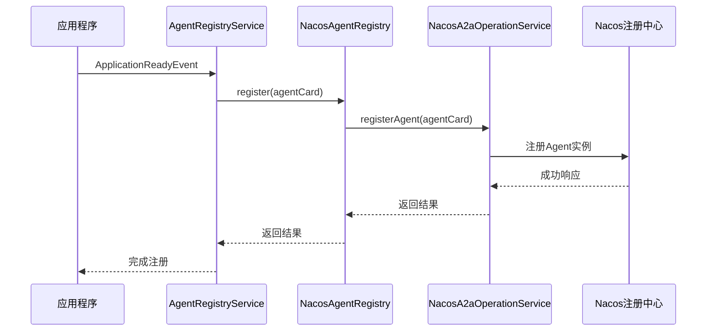

# 心跳维护

<cite>
**本文档中引用的文件**
- [NacosAgentRegistry.java](file://spring-ai-alibaba-a2a/spring-ai-alibaba-a2a-registry/src/main/java/com/alibaba/cloud/ai/a2a/registry/nacos/register/NacosAgentRegistry.java)
- [NacosA2aOperationService.java](file://spring-ai-alibaba-a2a/spring-ai-alibaba-a2a-registry/src/main/java/com/alibaba/cloud/ai/a2a/registry/nacos/service/NacosA2aOperationService.java)
- [NacosA2aProperties.java](file://spring-ai-alibaba-a2a/spring-ai-alibaba-a2a-registry/src/main/java/com/alibaba/cloud/ai/a2a/registry/nacos/properties/NacosA2aProperties.java)
- [NacosA2aRegistryProperties.java](file://spring-ai-alibaba-a2a/spring-ai-alibaba-a2a-registry/src/main/java/com/alibaba/cloud/ai/a2a/registry/nacos/register/NacosA2aRegistryProperties.java)
- [AgentRegistryService.java](file://spring-ai-alibaba-a2a/spring-ai-alibaba-a2a-common/src/main/java/com/alibaba/cloud/ai/a2a/registry/AgentRegistryService.java)
- [A2aServerProperties.java](file://spring-ai-alibaba-a2a/spring-ai-alibaba-a2a-common/src/main/java/com/alibaba/cloud/ai/a2a/A2aServerProperties.java)
</cite>

## 目录
1. [引言](#引言)
2. [心跳机制概述](#心跳机制概述)
3. [核心组件分析](#核心组件分析)
4. [心跳配置参数](#心跳配置参数)
5. [客户端与服务端协同工作机制](#客户端与服务端协同工作机制)
6. [故障处理与重试策略](#故障处理与重试策略)
7. [性能调优建议](#性能调优建议)
8. [结论](#结论)

## 引言
在A2A协议中，智能体（Agent）的心跳维护机制是确保服务注册中心能够准确感知服务实例存活状态的关键。通过定期向Nacos注册中心发送心跳信号，Agent可以维持其在服务注册表中的活跃状态，防止因网络抖动或短暂故障导致的服务误判下线。本文将深入剖析AgentRegistry如何实现这一机制，并探讨相关配置参数对系统稳定性的影响。

## 心跳机制概述
A2A协议中的心跳维护机制主要依赖于`AgentRegistry`组件与Nacos注册中心的交互。当应用启动并准备就绪后，`AgentRegistryService`会监听`ApplicationReadyEvent`事件，在此事件触发时自动执行注册逻辑。该过程包括构建包含Agent元数据的`AgentCard`对象，并通过`NacosA2aOperationService`将其注册到Nacos服务中。

**图表来源**
- [AgentRegistryService.java](file://spring-ai-alibaba-a2a/spring-ai-alibaba-a2a-common/src/main/java/com/alibaba/cloud/ai/a2a/registry/AgentRegistryService.java#L43-L57)
- [NacosAgentRegistry.java](file://spring-ai-alibaba-a2a/spring-ai-alibaba-a2a-registry/src/main/java/com/alibaba/cloud/ai/a2a/registry/nacos/register/NacosAgentRegistry.java#L0-L49)
- [NacosA2aOperationService.java](file://spring-ai-alibaba-a2a/spring-ai-alibaba-a2a-registry/src/main/java/com/alibaba/cloud/ai/a2a/registry/nacos/service/NacosA2aOperationService.java#L31-L66)

## 核心组件分析
### AgentRegistryService
`AgentRegistryService`是负责管理Agent注册的核心服务类。它通过监听Spring的`ApplicationReadyEvent`事件来确定何时进行注册操作。一旦接收到事件通知，便会调用`agentRegistry.register(agentCard)`方法完成注册流程。

**代码片段路径**
- [SPEC SYMBOL](file://spring-ai-alibaba-a2a/spring-ai-alibaba-a2a-common/src/main/java/com/alibaba/cloud/ai/a2a/registry/AgentRegistryService.java#L43-L57)

### NacosAgentRegistry
`NacosAgentRegistry`实现了`AgentRegistry`接口，专门用于与Nacos注册中心通信。其`register`方法接收一个`AgentCard`对象，并委托给`NacosA2aOperationService`执行具体的注册任务。

**代码片段路径**
- [SPEC SYMBOL](file://spring-ai-alibaba-a2a/spring-ai-alibaba-a2a-registry/src/main/java/com/alibaba/cloud/ai/a2a/registry/nacos/register/NacosAgentRegistry.java#L0-L49)

### NacosA2aOperationService
`NacosA2aOperationService`封装了与Nacos A2A服务交互的所有底层细节。它不仅处理Agent的注册，还涉及释放旧版本Agent卡等清理工作。具体而言，`registerAgent`方法首先尝试释放同名但不同版本的Agent卡，然后调用`registerEndpoint`方法将新的端点信息提交至Nacos。

**代码片段路径**
- [SPEC SYMBOL](file://spring-ai-alibaba-a2a/spring-ai-alibaba-a2a-registry/src/main/java/com/alibaba/cloud/ai/a2a/registry/nacos/service/NacosA2aOperationService.java#L31-L88)

## 心跳配置参数
心跳机制的有效性很大程度上取决于几个关键配置参数的合理设置：

| 配置项 | 默认值 | 描述 |
| --- | --- | --- |
| `spring.ai.alibaba.a2a.nacos.serverAddr` | 127.0.0.1:8848 | Nacos服务器地址 |
| `spring.ai.alibaba.a2a.nacos.namespace` | public | 命名空间标识符 |
| `spring.ai.alibaba.a2a.server.address` | 自动检测 | Agent服务绑定IP地址 |
| `spring.ai.alibaba.a2a.server.port` | server.port | Agent服务监听端口 |

这些参数定义了Agent如何连接到Nacos以及自身对外暴露的服务地址和端口。特别是`serverAddr`和`namespace`对于多环境部署尤为重要，它们允许在同一物理集群上隔离不同的逻辑环境。

**代码片段路径**
- [NacosA2aProperties.java](file://spring-ai-alibaba-a2a/spring-ai-alibaba-a2a-registry/src/main/java/com/alibaba/cloud/ai/a2a/registry/nacos/properties/NacosA2aProperties.java#L0-L211)
- [A2aServerProperties.java](file://spring-ai-alibaba-a2a/spring-ai-alibaba-a2a-common/src/main/java/com/alibaba/cloud/ai/a2a/A2aServerProperties.java#L38-L93)

## 客户端与服务端协同工作机制
为了保证高可用性和容错能力，A2A协议设计了一套完善的客户端与服务端协同工作机制。客户端定期发送心跳以证明自己的存在；而服务端则根据预设的超时时间判断某个实例是否已经失效。如果连续多个周期未收到心跳，则认为该实例已离线，并从服务列表中移除。

此外，考虑到网络波动可能导致暂时性的通信中断，系统采用了基于指数退避算法的重连策略。这意味着即使初次尝试失败，后续重试间隔也会逐渐增加，从而避免在网络恢复初期造成过多不必要的请求压力。

## 故障处理与重试策略
当心跳发送失败时，系统并不会立即放弃，而是按照预定的重试计划再次尝试。这通常涉及到以下几个步骤：
1. 捕获异常并记录错误日志；
2. 根据当前重试次数计算下次尝试的时间间隔；
3. 使用定时器安排下一次重试任务；
4. 如果达到最大重试次数仍未成功，则标记为不可用状态。

这种机制有效提高了系统的鲁棒性，尤其是在面对临时性网络问题时表现尤为突出。

**代码片段路径**
- [NacosA2aOperationService.java](file://spring-ai-alibaba-a2a/spring-ai-alibaba-a2a-registry/src/main/java/com/alibaba/cloud/ai/a2a/registry/nacos/service/NacosA2aOperationService.java#L68-L87)

## 性能调优建议
针对心跳维护机制，以下几点优化措施有助于提升整体性能：
- **调整心跳频率**：过高的心跳频率会增加Nacos的压力，建议根据实际需求适当降低。
- **合理设置超时时间**：太短的超时时间容易引发误判，而过长又会影响故障发现速度。
- **启用批量操作**：若存在大量Agent需要同时注册，考虑使用批处理方式减少网络往返次数。
- **监控与告警**：建立全面的监控体系，及时发现潜在问题并采取相应措施。

## 结论
综上所述，A2A协议中智能体的心跳维护机制是一个复杂但至关重要的组成部分。通过对`AgentRegistry`、`NacosA2aOperationService`等核心组件的深入理解，结合合理的配置参数设定及有效的故障应对策略，我们可以构建出既稳定又高效的分布式服务体系。未来工作中应持续关注相关技术的发展趋势，不断探索更优解决方案。