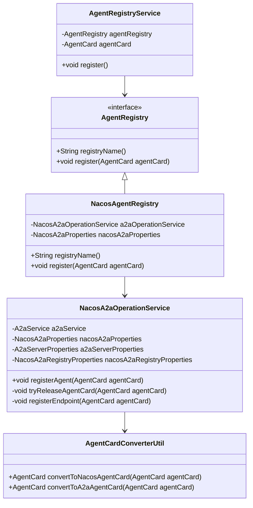
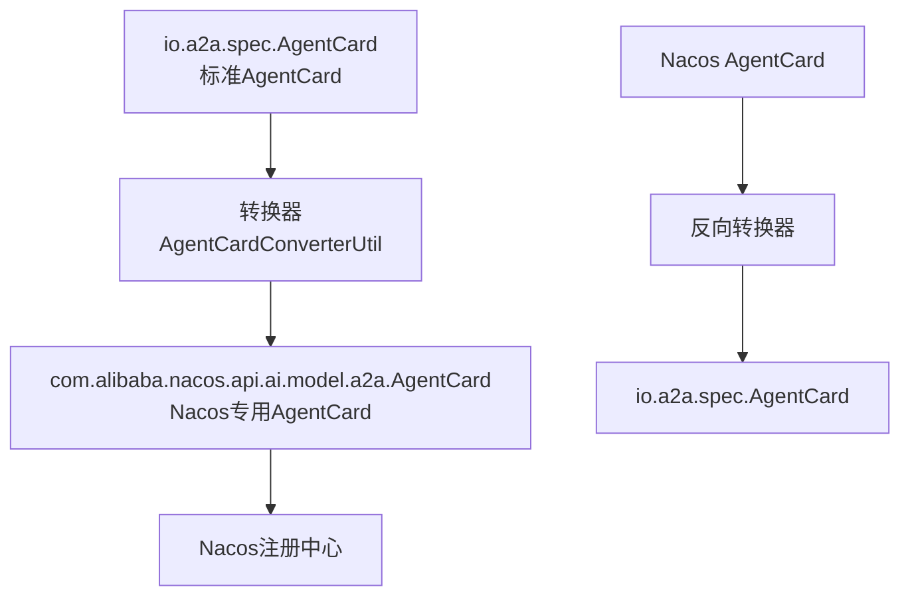
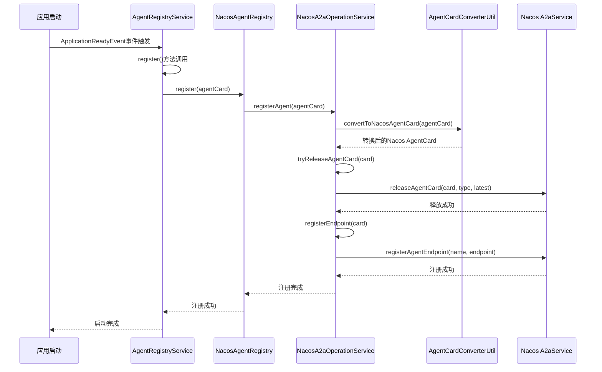
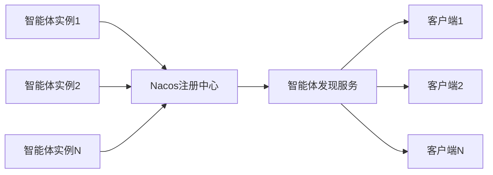

# 注册机制

<cite>
**本文档引用的文件**
- [AgentRegistry.java](file://spring-ai-alibaba-a2a/spring-ai-alibaba-a2a-common/src/main/java/com/alibaba/cloud/ai/a2a/registry/AgentRegistry.java)
- [NacosAgentRegistry.java](file://spring-ai-alibaba-a2a/spring-ai-alibaba-a2a-registry/src/main/java/com/alibaba/cloud/ai/a2a/registry/nacos/register/NacosAgentRegistry.java)
- [NacosA2aOperationService.java](file://spring-ai-alibaba-a2a/spring-ai-alibaba-a2a-registry/src/main/java/com/alibaba/cloud/ai/a2a/registry/nacos/service/NacosA2aOperationService.java)
- [AgentCardConverterUtil.java](file://spring-ai-alibaba-a2a/spring-ai-alibaba-a2a-registry/src/main/java/com/alibaba/cloud/ai/a2a/registry/nacos/utils/AgentCardConverterUtil.java)
- [NacosA2aRegistryAutoConfiguration.java](file://auto-configurations/spring-ai-alibaba-autoconfigure-a2a-registry/src/main/java/com/alibaba/cloud/ai/autoconfigure/a2a/registry/nacos/NacosA2aRegistryAutoConfiguration.java)
- [NacosA2aProperties.java](file://spring-ai-alibaba-a2a/spring-ai-alibaba-a2a-registry/src/main/java/com/alibaba/cloud/ai/a2a/registry/nacos/properties/NacosA2aProperties.java)
- [A2aServerProperties.java](file://spring-ai-alibaba-a2a/spring-ai-alibaba-a2a-common/src/main/java/com/alibaba/cloud/ai/a2a/A2aServerProperties.java)
- [AgentRegistryService.java](file://spring-ai-alibaba-a2a/spring-ai-alibaba-a2a-common/src/main/java/com/alibaba/cloud/ai/a2a/registry/AgentRegistryService.java)
</cite>

## 目录
1. [简介](#简介)
2. [核心组件架构](#核心组件架构)
3. [AgentRegistry接口设计](#agentregistry接口设计)
4. [Nacos注册机制详解](#nacos注册机制详解)
5. [注册流程分析](#注册流程分析)
6. [配置参数详解](#配置参数详解)
7. [异常处理策略](#异常处理策略)
8. [集群环境下的注册管理](#集群环境下的注册管理)
9. [最佳实践与故障排除](#最佳实践与故障排除)
10. [总结](#总结)

## 简介

A2A（Agent-to-Agent）协议中的智能体注册机制是整个分布式智能体系统的核心基础设施。该机制负责将智能体的元数据和服务信息注册到服务发现中心（如Nacos），使其他智能体能够发现和定位目标智能体，从而实现跨智能体的协作和通信。

本文档深入分析了智能体注册机制的设计原理、实现细节以及在实际应用中的配置和使用方法，重点关注AgentRegistry接口的register方法设计与实现，以及通过NacosA2aDiscoveryAutoConfiguration自动配置向Nacos注册中心发起注册请求的技术细节。

## 核心组件架构

A2A协议的智能体注册机制采用分层架构设计，主要包含以下核心组件：



**图表来源**
- [AgentRegistry.java](file://spring-ai-alibaba-a2a/spring-ai-alibaba-a2a-common/src/main/java/com/alibaba/cloud/ai/a2a/registry/AgentRegistry.java#L1-L29)
- [NacosAgentRegistry.java](file://spring-ai-alibaba-a2a/spring-ai-alibaba-a2a-registry/src/main/java/com/alibaba/cloud/ai/a2a/registry/nacos/register/NacosAgentRegistry.java#L1-L51)
- [NacosA2aOperationService.java](file://spring-ai-alibaba-a2a/spring-ai-alibaba-a2a-registry/src/main/java/com/alibaba/cloud/ai/a2a/registry/nacos/service/NacosA2aOperationService.java#L1-L89)

**章节来源**
- [AgentRegistry.java](file://spring-ai-alibaba-a2a/spring-ai-alibaba-a2a-common/src/main/java/com/alibaba/cloud/ai/a2a/registry/AgentRegistry.java#L1-L29)
- [NacosAgentRegistry.java](file://spring-ai-alibaba-a2a/spring-ai-alibaba-a2a-registry/src/main/java/com/alibaba/cloud/ai/a2a/registry/nacos/register/NacosAgentRegistry.java#L1-L51)

## AgentRegistry接口设计

AgentRegistry接口是智能体注册机制的核心抽象，定义了统一的注册契约：

```java
public interface AgentRegistry {
    String registryName();
    void register(AgentCard agentCard);
}
```

### 接口设计特点

1. **简洁性**：接口只包含两个方法，职责单一明确
2. **可扩展性**：支持多种注册后端（目前主要支持Nacos）
3. **标准化**：所有注册实现都遵循相同的接口规范

### register方法实现

NacosAgentRegistry实现了register方法，其核心逻辑如下：

```java
@Override
public void register(AgentCard agentCard) {
    a2aOperationService.registerAgent(agentCard);
}
```

这个实现体现了依赖注入的设计原则，将具体的注册逻辑委托给NacosA2aOperationService处理。

**章节来源**
- [AgentRegistry.java](file://spring-ai-alibaba-a2a/spring-ai-alibaba-a2a-common/src/main/java/com/alibaba/cloud/ai/a2a/registry/AgentRegistry.java#L20-L29)
- [NacosAgentRegistry.java](file://spring-ai-alibaba-a2a/spring-ai-alibaba-a2a-registry/src/main/java/com/alibaba/cloud/ai/a2a/registry/nacos/register/NacosAgentRegistry.java#L40-L43)

## Nacos注册机制详解

### 自动配置机制

NacosA2aRegistryAutoConfiguration类负责自动配置整个注册流程：

```java
@ConditionalOnClass({ A2aServerAgentCardAutoConfiguration.class, A2aServerRegistryAutoConfiguration.class })
@AutoConfiguration(after = A2aServerAgentCardAutoConfiguration.class,
        before = { A2aServerRegistryAutoConfiguration.class })
@EnableConfigurationProperties({ NacosA2aProperties.class, NacosA2aRegistryProperties.class })
@ConditionalOnProperty(prefix = NacosA2aRegistryProperties.PREFIX, value = ".enabled", havingValue = "true",
        matchIfMissing = true)
```

### 核心组件初始化

自动配置类提供了三个关键的Spring Bean：

1. **A2aService**：通过AiFactory创建Nacos AI服务实例
2. **NacosA2aOperationService**：负责具体的注册操作
3. **NacosAgentRegistry**：最终的注册服务实现

```java
@Bean
@ConditionalOnMissingBean
public A2aService a2aService(NacosA2aProperties nacosA2aProperties) throws NacosException {
    return AiFactory.createAiService(nacosA2aProperties.getNacosProperties());
}

@Bean
public NacosA2aOperationService nacosA2aOperationService(A2aService a2aService,
        NacosA2aProperties nacosA2aProperties, A2aServerProperties a2aServerProperties,
        NacosA2aRegistryProperties nacosA2aRegistryProperties) {
    return new NacosA2aOperationService(a2aService, nacosA2aProperties, a2aServerProperties,
            nacosA2aRegistryProperties);
}

@Bean
public NacosAgentRegistry nacosAgentRegistry(NacosA2aOperationService nacosA2aOperationService,
        NacosA2aProperties nacosA2aProperties) {
    return new NacosAgentRegistry(nacosA2aOperationService, nacosA2aProperties);
}
```

### AgentCard转换机制

AgentCardConverterUtil类负责在不同AgentCard格式之间进行转换：



**图表来源**
- [AgentCardConverterUtil.java](file://spring-ai-alibaba-a2a/spring-ai-alibaba-a2a-registry/src/main/java/com/alibaba/cloud/ai/a2a/registry/nacos/utils/AgentCardConverterUtil.java#L1-L206)

**章节来源**
- [NacosA2aRegistryAutoConfiguration.java](file://auto-configurations/spring-ai-alibaba-autoconfigure-a2a-registry/src/main/java/com/alibaba/cloud/ai/autoconfigure/a2a/registry/nacos/NacosA2aRegistryAutoConfiguration.java#L1-L71)
- [NacosAgentRegistry.java](file://spring-ai-alibaba-a2a/spring-ai-alibaba-a2a-registry/src/main/java/com/alibaba/cloud/ai/a2a/registry/nacos/register/NacosAgentRegistry.java#L30-L43)

## 注册流程分析

### 完整注册流程



**图表来源**
- [AgentRegistryService.java](file://spring-ai-alibaba-a2a/spring-ai-alibaba-a2a-common/src/main/java/com/alibaba/cloud/ai/a2a/registry/AgentRegistryService.java#L43-L57)
- [NacosA2aOperationService.java](file://spring-ai-alibaba-a2a/spring-ai-alibaba-a2a-registry/src/main/java/com/alibaba/cloud/ai/a2a/registry/nacos/service/NacosA2aOperationService.java#L50-L89)

### 关键步骤详解

#### 1. AgentCard转换

```java
public static AgentCard convertToNacosAgentCard(io.a2a.spec.AgentCard agentCard) {
    AgentCard card = new AgentCard();
    card.setProtocolVersion(agentCard.protocolVersion());
    card.setName(agentCard.name());
    card.setDescription(agentCard.description());
    card.setVersion(agentCard.version());
    // ... 其他字段映射
    return card;
}
```

#### 2. 释放现有卡片

```java
private void tryReleaseAgentCard(AgentCard agentCard) throws NacosException {
    LOGGER.info("Register agent card {} to Nacos namespace {}. ", agentCard.getName(),
            nacosA2aProperties.getNamespace());
    a2aService.releaseAgentCard(agentCard, AiConstants.A2a.A2A_ENDPOINT_TYPE_SERVICE,
            nacosA2aRegistryProperties.isRegisterAsLatest());
    LOGGER.info("Register agent card {} to Nacos namespace {} successfully. ", agentCard.getName(),
            nacosA2aProperties.getNamespace());
}
```

#### 3. 注册服务端点

```java
private void registerEndpoint(AgentCard agentCard) throws NacosException {
    AgentEndpoint endpoint = new AgentEndpoint();
    endpoint.setVersion(agentCard.getVersion());
    endpoint.setPath(a2aServerProperties.getMessageUrl());
    endpoint.setTransport(agentCard.getPreferredTransport());
    endpoint.setAddress(a2aServerProperties.getAddress());
    endpoint.setPort(a2aServerProperties.getPort());
    a2aService.registerAgentEndpoint(agentCard.getName(), endpoint);
}
```

**章节来源**
- [NacosA2aOperationService.java](file://spring-ai-alibaba-a2a/spring-ai-alibaba-a2a-registry/src/main/java/com/alibaba/cloud/ai/a2a/registry/nacos/service/NacosA2aOperationService.java#L50-L89)
- [AgentCardConverterUtil.java](file://spring-ai-alibaba-a2a/spring-ai-alibaba-a2a-registry/src/main/java/com/alibaba/cloud/ai/a2a/registry/nacos/utils/AgentCardConverterUtil.java#L130-L150)

## 配置参数详解

### Nacos连接配置

NacosA2aProperties类提供了丰富的配置选项：

```java
@ConfigurationProperties(prefix = NacosA2aProperties.PREFIX)
public class NacosA2aProperties implements EnvironmentAware {
    public static final String PREFIX = "spring.ai.alibaba.a2a.nacos";
    public static final String DEFAULT_ADDRESS = "127.0.0.1:8848";

    private String namespace = "public";
    private String serverAddr;
    private String username;
    private String password;
    private String accessKey;
    private String secretKey;
    private String endpoint;
}
```

### 注册行为配置

NacosA2aRegistryProperties控制注册的具体行为：

```java
@ConfigurationProperties(prefix = NacosA2aRegistryProperties.PREFIX)
public class NacosA2aRegistryProperties {
    public static final String PREFIX = "spring.ai.alibaba.a2a.nacos.registry";

    private boolean registerAsLatest = true;
}
```

### 服务器配置

A2aServerProperties定义了智能体服务器的基本信息：

```java
@ConfigurationProperties(prefix = A2aServerProperties.CONFIG_PREFIX)
public class A2aServerProperties implements EnvironmentAware {
    public static final String CONFIG_PREFIX = "spring.ai.alibaba.a2a.server";

    private String type = A2aConstants.AGENT_TRANSPORT_TYPE_JSON_RPC;
    private String agentCardUrl = JsonRpcA2aRouterProvider.DEFAULT_WELL_KNOWN_URL;
    private String messageUrl = JsonRpcA2aRouterProvider.DEFAULT_MESSAGE_URL;
    private String address;
    private Integer port;
    private String version = A2aConstants.DEFAULT_AGENT_VERSION;
}
```

### 配置示例

```yaml
spring:
  ai:
    alibaba:
      a2a:
        nacos:
          registry:
            enabled: true
            register-as-latest: true
          server-addr: 127.0.0.1:8848
          namespace: public
          username: nacos
          password: nacos
        server:
          address: 192.168.1.100
          port: 8080
          message-url: /a2a/message
```

**章节来源**
- [NacosA2aProperties.java](file://spring-ai-alibaba-a2a/spring-ai-alibaba-a2a-registry/src/main/java/com/alibaba/cloud/ai/a2a/registry/nacos/properties/NacosA2aProperties.java#L26-L84)
- [A2aServerProperties.java](file://spring-ai-alibaba-a2a/spring-ai-alibaba-a2a-common/src/main/java/com/alibaba/cloud/ai/a2a/A2aServerProperties.java#L30-L130)

## 异常处理策略

### 注册过程中的异常处理

NacosA2aOperationService采用了多层次的异常处理策略：

```java
public void registerAgent(io.a2a.spec.AgentCard agentCard) {
    AgentCard nacosAgentCard = AgentCardConverterUtil.convertToNacosAgentCard(agentCard);
    try {
        tryReleaseAgentCard(nacosAgentCard);
        registerEndpoint(nacosAgentCard);
    }
    catch (NacosException e) {
        LOGGER.error("Register agent card {} to Nacos failed,", agentCard.name(), e);
        throw new NacosRuntimeException(e.getErrCode(), e.getErrMsg());
    }
}
```

### 错误分类与处理

1. **转换错误**：AgentCard转换失败时抛出运行时异常
2. **网络错误**：Nacos连接失败时记录错误日志并重新抛出
3. **业务错误**：注册冲突或其他业务逻辑错误时提供详细的错误信息

### 日志记录策略

```java
// 成功日志
LOGGER.info("Register agent card {} to Nacos namespace {}. ", agentCard.getName(),
        nacosA2aProperties.getNamespace());
LOGGER.info("Register agent card {} to Nacos namespace {} successfully. ", agentCard.getName(),
        nacosA2aProperties.getNamespace());

// 错误日志
LOGGER.error("Register agent card {} to Nacos failed,", agentCard.name(), e);
```

**章节来源**
- [NacosA2aOperationService.java](file://spring-ai-alibaba-a2a/spring-ai-alibaba-a2a-registry/src/main/java/com/alibaba/cloud/ai/a2a/registry/nacos/service/NacosA2aOperationService.java#L50-L89)

## 集群环境下的注册管理

### 唯一性保证

在集群环境中，通过以下机制保证注册的唯一性：

1. **命名空间隔离**：每个应用使用独立的namespace
2. **版本控制**：通过version字段区分不同版本的智能体
3. **最新版本标记**：registerAsLatest参数控制是否覆盖旧版本

```java
a2aService.releaseAgentCard(agentCard, AiConstants.A2a.A2A_ENDPOINT_TYPE_SERVICE,
        nacosA2aRegistryProperties.isRegisterAsLatest());
```

### 高可用性设计

1. **多实例部署**：支持多个智能体实例同时注册
2. **负载均衡**：Nacos会自动处理多个实例的负载均衡
3. **故障转移**：当某个实例不可用时，其他实例可以继续提供服务

### 集群同步机制



### 配置最佳实践

```yaml
spring:
  ai:
    alibaba:
      a2a:
        nacos:
          registry:
            register-as-latest: false  # 生产环境建议设置为false
          namespace: ${DEPLOY_ENV:dev}-a2a  # 使用环境变量区分不同环境
        server:
          address: ${POD_IP:}  # 使用Pod IP或容器IP
          port: ${SERVER_PORT:8080}
```

## 最佳实践与故障排除

### 配置最佳实践

1. **生产环境配置**
```yaml
spring:
  ai:
    alibaba:
      a2a:
        nacos:
          registry:
            register-as-latest: false
          server-addr: ${NACOS_SERVER_ADDR}
          namespace: prod-a2a
          username: ${NACOS_USERNAME}
          password: ${NACOS_PASSWORD}
        server:
          address: ${POD_IP}
          port: ${SERVER_PORT}
```

2. **开发环境配置**
```yaml
spring:
  ai:
    alibaba:
      a2a:
        nacos:
          registry:
            register-as-latest: true
          server-addr: localhost:8848
          namespace: dev-a2a
        server:
          address: localhost
          port: 8080
```

### 故障排除指南

#### 常见问题及解决方案

1. **连接超时**
   - 检查Nacos服务器地址和端口配置
   - 确认网络连通性
   - 检查防火墙设置

2. **认证失败**
   - 验证用户名和密码配置
   - 检查accessKey和secretKey设置
   - 确认用户权限配置

3. **注册失败**
   - 检查AgentCard格式是否正确
   - 验证namespace是否存在
   - 查看Nacos控制台日志

#### 调试技巧

```java
// 启用调试日志
logging:
  level:
    com.alibaba.cloud.ai.a2a.registry.nacos: DEBUG
    com.alibaba.nacos.api.ai: DEBUG
```

### 性能优化建议

1. **批量注册**：对于大量智能体，考虑批量注册机制
2. **缓存策略**：合理设置注册信息的缓存时间
3. **异步处理**：在高并发场景下使用异步注册

## 总结

A2A协议中的智能体注册机制是一个设计精良、功能完善的分布式系统基础设施。通过AgentRegistry接口的抽象设计，结合Nacos作为服务发现中心，实现了智能体的自动化注册和发现。

### 主要优势

1. **模块化设计**：清晰的接口分离和职责划分
2. **自动配置**：基于Spring Boot的自动配置机制
3. **异常处理**：完善的错误处理和日志记录
4. **配置灵活**：丰富的配置选项适应不同环境需求
5. **高可用性**：支持集群部署和故障转移

### 技术亮点

1. **双向转换**：AgentCardConverterUtil实现了标准格式与Nacos格式的双向转换
2. **版本管理**：通过registerAsLatest参数控制版本覆盖策略
3. **命名空间隔离**：支持多环境部署和资源隔离
4. **生命周期管理**：完整的注册、更新、注销生命周期

### 应用建议

在实际应用中，建议根据具体场景选择合适的配置参数，特别是在生产环境中要注意设置register-as-latest为false以避免意外覆盖。同时，合理的监控和日志配置对于系统的稳定运行至关重要。

通过本文档的详细分析，开发者可以深入理解A2A协议智能体注册机制的工作原理，并能够根据实际需求进行相应的配置和优化。