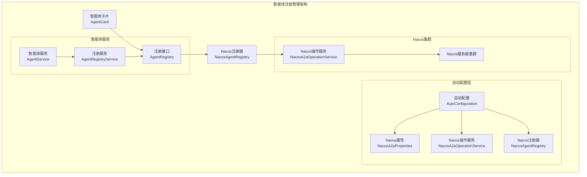
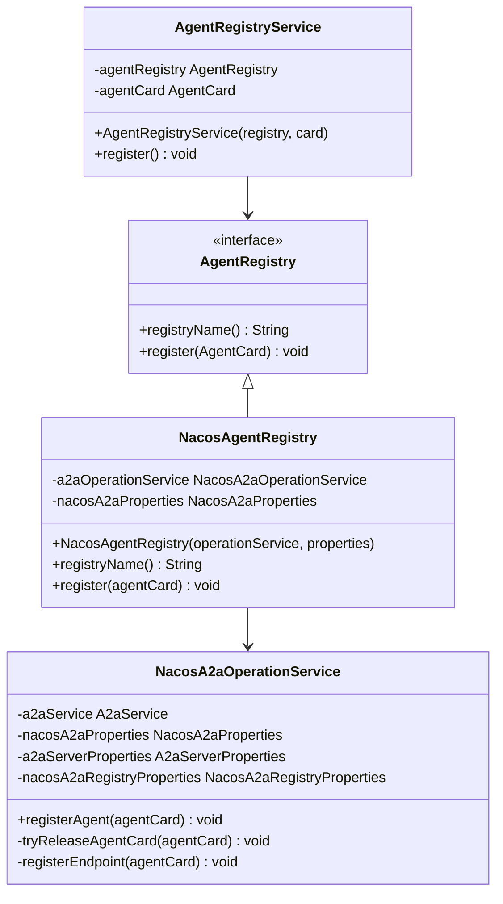
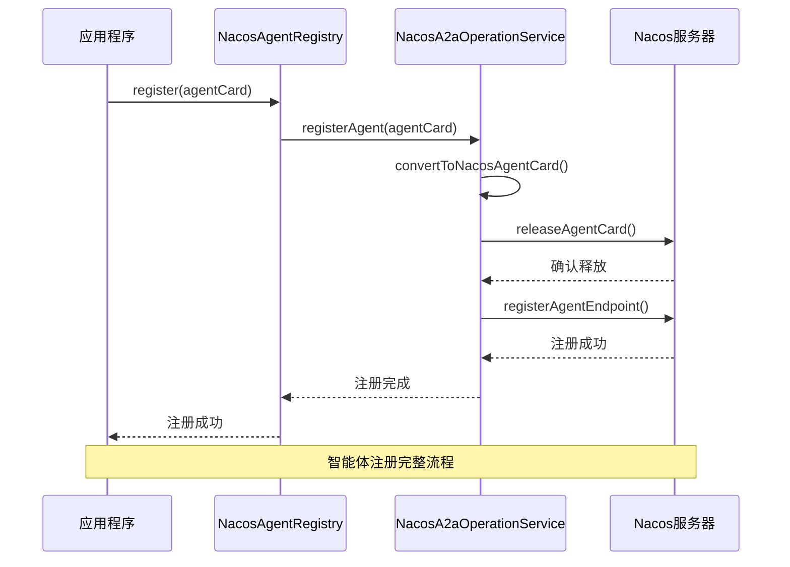
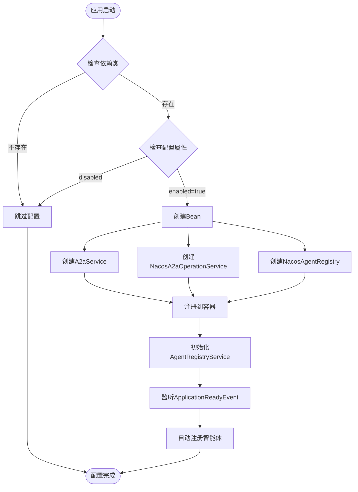
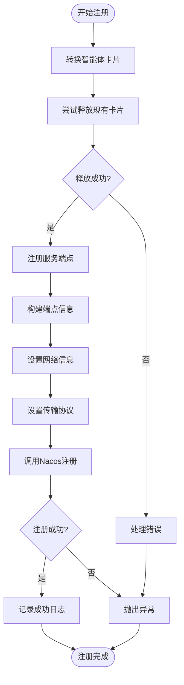
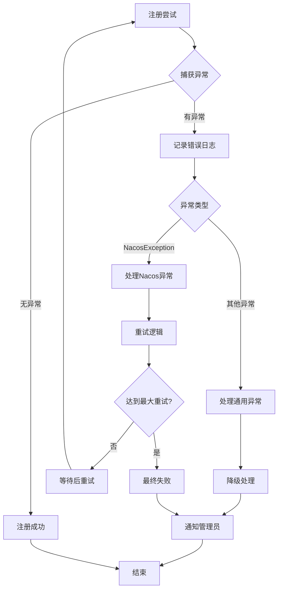

# 注册管理

<cite>
**本文档引用的文件**
- [AgentRegistry.java](file://spring-ai-alibaba-a2a/spring-ai-alibaba-a2a-common/src/main/java/com/alibaba/cloud/ai/a2a/registry/AgentRegistry.java)
- [AgentRegistryService.java](file://spring-ai-alibaba-a2a/spring-ai-alibaba-a2a-common/src/main/java/com/alibaba/cloud/ai/a2a/registry/AgentRegistryService.java)
- [NacosAgentRegistry.java](file://spring-ai-alibaba-a2a/spring-ai-alibaba-a2a-registry/src/main/java/com/alibaba/cloud/ai/a2a/registry/nacos/register/NacosAgentRegistry.java)
- [NacosA2aOperationService.java](file://spring-ai-alibaba-a2a/spring-ai-alibaba-a2a-registry/src/main/java/com/alibaba/cloud/ai/a2a/registry/nacos/service/NacosA2aOperationService.java)
- [NacosA2aProperties.java](file://spring-ai-alibaba-a2a/spring-ai-alibaba-a2a-registry/src/main/java/com/alibaba/cloud/ai/a2a/registry/nacos/properties/NacosA2aProperties.java)
- [NacosA2aRegistryAutoConfiguration.java](file://auto-configurations/spring-ai-alibaba-autoconfigure-a2a-registry/src/main/java/com/alibaba/cloud/ai/autoconfigure/a2a/registry/nacos/NacosA2aRegistryAutoConfiguration.java)
- [NacosA2aDiscoveryAutoConfiguration.java](file://auto-configurations/spring-ai-alibaba-autoconfigure-a2a-registry/src/main/java/com/alibaba/cloud/ai/autoconfigure/a2a/registry/nacos/NacosA2aDiscoveryAutoConfiguration.java)
- [A2aServerProperties.java](file://spring-ai-alibaba-a2a/spring-ai-alibaba-a2a-common/src/main/java/com/alibaba/cloud/ai/a2a/A2aServerProperties.java)
- [A2aAgentCardProperties.java](file://spring-ai-alibaba-a2a/spring-ai-alibaba-a2a-common/src/main/java/com/alibaba/cloud/ai/a2a/A2aAgentCardProperties.java)
</cite>

## 目录
1. [简介](#简介)
2. [核心架构](#核心架构)
3. [AgentRegistry接口设计](#agentregistry接口设计)
4. [Nacos注册中心集成](#nacos注册中心集成)
5. [自动配置机制](#自动配置机制)
6. [注册流程详解](#注册流程详解)
7. [配置参数说明](#配置参数说明)
8. [分布式环境处理策略](#分布式环境处理策略)
9. [异常处理机制](#异常处理机制)
10. [最佳实践建议](#最佳实践建议)

## 简介

A2A（Agent-to-Agent）协议中的智能体注册管理系统是整个分布式智能体网络的核心基础设施。该系统负责智能体的生命周期管理，包括智能体的注册、注销、心跳维护以及状态监控等功能。通过统一的AgentRegistry接口和Nacos注册中心的深度集成，系统能够实现智能体在分布式环境中的动态发现和服务治理。

## 核心架构



**图表来源**
- [AgentRegistry.java](file://spring-ai-alibaba-a2a/spring-ai-alibaba-a2a-common/src/main/java/com/alibaba/cloud/ai/a2a/registry/AgentRegistry.java#L1-L31)
- [NacosAgentRegistry.java](file://spring-ai-alibaba-a2a/spring-ai-alibaba-a2a-registry/src/main/java/com/alibaba/cloud/ai/a2a/registry/nacos/register/NacosAgentRegistry.java#L1-L51)

## AgentRegistry接口设计

AgentRegistry接口是整个注册管理系统的核心抽象，它定义了智能体注册管理的基本契约。



**图表来源**
- [AgentRegistry.java](file://spring-ai-alibaba-a2a/spring-ai-alibaba-a2a-common/src/main/java/com/alibaba/cloud/ai/a2a/registry/AgentRegistry.java#L20-L29)
- [NacosAgentRegistry.java](file://spring-ai-alibaba-a2a/spring-ai-alibaba-a2a-registry/src/main/java/com/alibaba/cloud/ai/a2a/registry/nacos/register/NacosAgentRegistry.java#L25-L50)

### 接口方法详解

**registryName() 方法**
- 返回注册中心的名称标识
- 对于Nacos实现，格式为：`Nacos[serverAddr]`
- 用于日志记录和调试

**register(AgentCard) 方法**
- 接收智能体卡片对象进行注册
- 执行完整的注册流程，包括预释放和端点注册
- 抛出异常时由上层服务捕获处理

**节来源**
- [AgentRegistry.java](file://spring-ai-alibaba-a2a/spring-ai-alibaba-a2a-common/src/main/java/com/alibaba/cloud/ai/a2a/registry/AgentRegistry.java#L20-L29)

## Nacos注册中心集成

Nacos作为主流的服务注册与配置管理平台，在A2A协议中扮演着关键角色。系统通过NacosAgentRegistry实现对Nacos注册中心的深度集成。



**图表来源**
- [NacosAgentRegistry.java](file://spring-ai-alibaba-a2a/spring-ai-alibaba-a2a-registry/src/main/java/com/alibaba/cloud/ai/a2a/registry/nacos/register/NacosAgentRegistry.java#L42-L47)
- [NacosA2aOperationService.java](file://spring-ai-alibaba-a2a/spring-ai-alibaba-a2a-registry/src/main/java/com/alibaba/cloud/ai/a2a/registry/nacos/service/NacosA2aOperationService.java#L50-L65)

### 注册信息结构

智能体注册信息包含以下核心元数据：

**基础信息**
- `name`: 智能体唯一标识符
- `version`: 智能体版本号
- `description`: 智能体功能描述
- `url`: 智能体访问地址

**能力描述**
- `capabilities`: 智能体支持的功能能力
- `defaultInputModes`: 默认输入模式
- `defaultOutputModes`: 默认输出模式
- `skills`: 具体技能列表

**网络信息**
- `address`: 服务主机地址
- `port`: 服务端口号
- `transport`: 传输协议类型
- `preferredTransport`: 偏好的传输方式

**安全信息**
- `securitySchemes`: 安全方案配置
- `supportsAuthenticatedExtendedCard`: 是否支持认证扩展卡片

**节来源**
- [A2aAgentCardProperties.java](file://spring-ai-alibaba-a2a/spring-ai-alibaba-a2a-common/src/main/java/com/alibaba/cloud/ai/a2a/A2aAgentCardProperties.java#L25-L175)

## 自动配置机制

系统采用Spring Boot的自动配置机制，通过条件注解实现智能体注册功能的按需启用。



**图表来源**
- [NacosA2aRegistryAutoConfiguration.java](file://auto-configurations/spring-ai-alibaba-autoconfigure-a2a-registry/src/main/java/com/alibaba/cloud/ai/autoconfigure/a2a/registry/nacos/NacosA2aRegistryAutoConfiguration.java#L35-L70)

### 配置类层次结构

**NacosA2aRegistryAutoConfiguration**
- 负责注册中心相关的Bean创建
- 条件注解确保只有在需要时才生效
- 依赖关系明确：先创建A2aService，再创建其他组件

**NacosA2aDiscoveryAutoConfiguration**
- 负责智能体发现功能的配置
- 与注册功能相互配合
- 提供智能体卡片的获取能力

**节来源**
- [NacosA2aRegistryAutoConfiguration.java](file://auto-configurations/spring-ai-alibaba-autoconfigure-a2a-registry/src/main/java/com/alibaba/cloud/ai/autoconfigure/a2a/registry/nacos/NacosA2aRegistryAutoConfiguration.java#L35-L70)
- [NacosA2aDiscoveryAutoConfiguration.java](file://auto-configurations/spring-ai-alibaba-autoconfigure-a2a-registry/src/main/java/com/alibaba/cloud/ai/autoconfigure/a2a/registry/nacos/NacosA2aDiscoveryAutoConfiguration.java#L25-L55)

## 注册流程详解

智能体注册是一个多步骤的复杂过程，涉及多个组件的协调工作。



**图表来源**
- [NacosA2aOperationService.java](file://spring-ai-alibaba-a2a/spring-ai-alibaba-a2a-registry/src/main/java/com/alibaba/cloud/ai/a2a/registry/nacos/service/NacosA2aOperationService.java#L50-L88)

### 关键步骤解析

**智能体卡片转换**
- 将标准AgentCard转换为Nacos兼容格式
- 保持元数据完整性的同时适配Nacos模型

**预释放机制**
- 在注册新卡片前尝试释放同名卡片
- 防止重复注册导致的冲突
- 支持latest版本策略控制

**端点信息构建**
- 设置智能体的网络访问地址
- 配置消息处理URL路径
- 指定传输协议和版本信息

**节来源**
- [NacosA2aOperationService.java](file://spring-ai-alibaba-a2a/spring-ai-alibaba-a2a-registry/src/main/java/com/alibaba/cloud/ai/a2a/registry/nacos/service/NacosA2aOperationService.java#L50-L88)

## 配置参数说明

系统提供了丰富的配置选项来满足不同部署环境的需求。

### Nacos连接配置

```yaml
spring:
  ai:
    alibaba:
      a2a:
        nacos:
          server-addr: 127.0.0.1:8848
          namespace: public
          username: 
          password: 
          access-key: 
          secret-key: 
          endpoint: 
```

**参数说明：**
- `server-addr`: Nacos服务器地址，默认为本地8848端口
- `namespace`: 命名空间，用于环境隔离
- `username/password`: 用户认证凭据
- `access-key/secret-key`: AK/SK认证方式
- `endpoint`: 外部访问端点配置

### 注册行为配置

```yaml
spring:
  ai:
    alibaba:
      a2a:
        nacos:
          registry:
            register-as-latest: true
```

**参数说明：**
- `register-as-latest`: 是否注册为最新版本，默认true

### 服务配置

```yaml
spring:
  ai:
    alibaba:
      a2a:
        server:
          type: json-rpc
          message-url: /a2a/message
          address: ${server.address:}
          port: ${server.port:}
          version: 1.0.0
```

**参数说明：**
- `type`: 传输协议类型
- `message-url`: 消息处理路径
- `address/port`: 服务网络地址配置
- `version`: 协议版本号

**节来源**
- [NacosA2aProperties.java](file://spring-ai-alibaba-a2a/spring-ai-alibaba-a2a-registry/src/main/java/com/alibaba/cloud/ai/a2a/registry/nacos/properties/NacosA2aProperties.java#L40-L199)
- [A2aServerProperties.java](file://spring-ai-alibaba-a2a/spring-ai-alibaba-a2a-common/src/main/java/com/alibaba/cloud/ai/a2a/A2aServerProperties.java#L38-L93)

## 分布式环境处理策略

在分布式环境中，智能体注册面临诸多挑战，系统提供了完善的处理策略。

### 重复注册处理

**预释放机制**
- 在注册新智能体前自动释放同名智能体
- 避免因网络分区或重启导致的重复注册
- 支持版本控制和latest策略

**幂等性保证**
- 注册操作具有幂等性特征
- 同一智能体多次注册不会产生副作用
- 通过智能体名称和版本进行去重

### 异常注销处理

**优雅关闭**
- 应用正常关闭时触发智能体注销
- 等待当前请求处理完成
- 通知其他节点智能体即将下线

**强制清理**
- 应用异常终止时的清理机制
- 心跳超时自动清理
- 支持手动强制注销

### 会话过期处理

**心跳机制**
- 定期发送心跳信号维持会话
- 心跳间隔可配置，默认值根据业务需求调整
- 超时后自动标记为不活跃状态

**故障转移**
- 主节点故障时的自动切换
- 备用节点接管服务
- 智能体列表的动态更新

## 异常处理机制

系统实现了多层次的异常处理机制，确保注册过程的健壮性。



### 错误分类处理

**网络异常**
- 连接超时、DNS解析失败
- 自动重试机制，指数退避策略
- 最大重试次数限制

**认证异常**
- 凭据无效或过期
- 触发重新认证流程
- 记录认证失败次数

**业务异常**
- 智能体信息不合法
- 版本冲突或权限不足
- 返回具体错误码和提示信息

### 日志记录策略

**分级记录**
- INFO级别：正常注册流程
- WARN级别：异常但可恢复的情况
- ERROR级别：严重错误需要人工干预

**上下文信息**
- 包含智能体名称、版本、注册时间
- 网络地址和端口信息
- 异常堆栈和错误码

**节来源**
- [AgentRegistryService.java](file://spring-ai-alibaba-a2a/spring-ai-alibaba-a2a-common/src/main/java/com/alibaba/cloud/ai/a2a/registry/AgentRegistryService.java#L43-L57)
- [NacosA2aOperationService.java](file://spring-ai-alibaba-a2a/spring-ai-alibaba-a2a-registry/src/main/java/com/alibaba/cloud/ai/a2a/registry/nacos/service/NacosA2aOperationService.java#L50-L65)

## 最佳实践建议

基于系统的设计和实现，以下是智能体注册管理的最佳实践建议。

### 配置优化

**连接池配置**
```yaml
spring:
  ai:
    alibaba:
      a2a:
        nacos:
          server-addr: nacos-cluster.example.com:8848
          max-retries: 3
          connect-timeout: 5000
          read-timeout: 10000
```

**资源隔离**
- 不同环境使用不同的命名空间
- 智能体版本控制策略
- 网络隔离和安全组配置

### 监控告警

**关键指标监控**
- 注册成功率
- 注册延迟分布
- 心跳丢失率
- Nacos连接状态

**告警规则**
- 注册失败率达到阈值
- 心跳超时频率过高
- Nacos连接异常
- 磁盘空间不足

### 故障排查

**诊断工具**
- 智能体状态查询接口
- 注册历史记录查询
- 网络连通性测试
- 性能基准测试

**常见问题**
- Nacos连接超时
- 智能体卡片格式错误
- 端口被占用
- 权限配置不当

通过遵循这些最佳实践，可以确保智能体注册管理系统的稳定运行和高效运维。系统的设计充分考虑了分布式环境的复杂性，提供了完善的容错机制和监控手段，能够满足生产环境的各种需求。