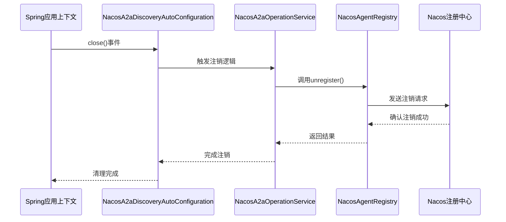
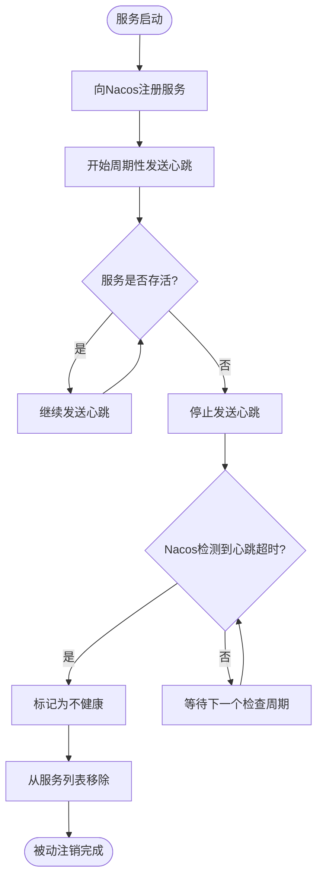
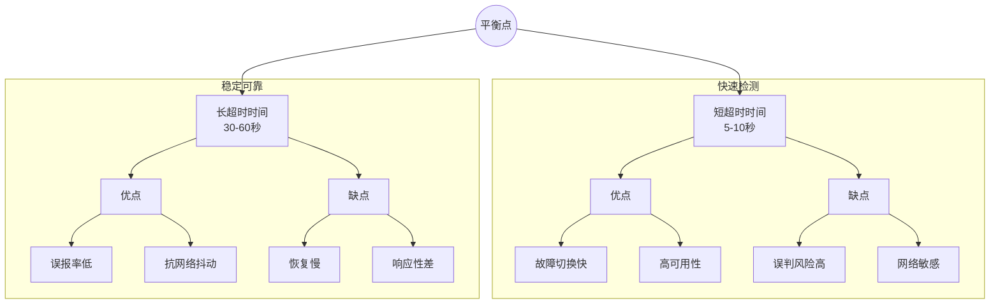

# 注销管理

<cite>
**本文档中引用的文件**
- [NacosA2aDiscoveryAutoConfiguration.java](file://auto-configurations/spring-ai-alibaba-autoconfigure-a2a-registry/src/main/java/com/alibaba/cloud/ai/autoconfigure/a2a/registry/nacos/NacosA2aDiscoveryAutoConfiguration.java)
- [NacosA2aRegistryAutoConfiguration.java](file://auto-configurations/spring-ai-alibaba-autoconfigure-a2a-registry/src/main/java/com/alibaba/cloud/ai/autoconfigure/a2a/registry/nacos/NacosA2aRegistryAutoConfiguration.java)
- [NacosA2aOperationService.java](file://spring-ai-alibaba-a2a/spring-ai-alibaba-a2a-registry/src/main/java/com/alibaba/cloud/ai/a2a/registry/nacos/service/NacosA2aOperationService.java)
- [NacosAgentRegistry.java](file://spring-ai-alibaba-a2a/spring-ai-alibaba-a2a-registry/src/main/java/com/alibaba/cloud/ai/a2a/registry/nacos/register/NacosAgentRegistry.java)
- [NacosAgentCardProvider.java](file://spring-ai-alibaba-a2a/spring-ai-alibaba-a2a-registry/src/main/java/com/alibaba/cloud/ai/a2a/registry/nacos/discovery/NacosAgentCardProvider.java)
</cite>

## 目录
1. [简介](#简介)
2. [正常关闭时的优雅注销流程](#正常关闭时的优雅注销流程)
3. [异常宕机下的被动注销机制](#异常宕机下的被动注销机制)
4. [会话过期时间的权衡分析](#会话过期时间的权衡分析)
5. [注册状态异常诊断指南](#注册状态异常诊断指南)
6. [高并发批量注销优化实践](#高并发批量注销优化实践)

## 简介
本文档详细描述了A2A协议中智能体的注销管理流程。重点分析了当服务正常关闭时，`AgentRegistry`如何通过`NacosA2aDiscoveryAutoConfiguration`监听Spring应用上下文关闭事件并触发优雅注销流程，确保从Nacos注册中心移除服务实例记录。同时讨论了在异常宕机场景下基于心跳超时的被动注销机制，并对会话过期时间设置对故障检测速度与资源清理效率的权衡进行了深入探讨。

## 正常关闭时的优雅注销流程

在A2A协议中，智能体的优雅注销是通过Spring应用上下文生命周期管理实现的。当Spring应用上下文准备关闭时，系统会自动触发一系列清理操作，确保服务实例能够从Nacos注册中心正确注销。

`NacosA2aDiscoveryAutoConfiguration`类作为核心配置组件，负责初始化和管理与Nacos A2A发现相关的Bean。该类通过`@AutoConfiguration`注解声明为自动配置类，并在特定条件下启用（如`discovery.enabled`属性为true）。其主要职责包括创建`A2aService`实例和`NacosAgentCardProvider`实例，为后续的服务发现和注册提供基础支持。

**图示来源**
- [NacosA2aDiscoveryAutoConfiguration.java](file://auto-configurations/spring-ai-alibaba-autoconfigure-a2a-registry/src/main/java/com/alibaba/cloud/ai/autoconfigure/a2a/registry/nacos/NacosA2aDiscoveryAutoConfiguration.java)
- [NacosA2aOperationService.java](file://spring-ai-alibaba-a2a/spring-ai-alibaba-a2a-registry/src/main/java/com/alibaba/cloud/ai/a2a/registry/nacos/service/NacosA2aOperationService.java)

**本节来源**
- [NacosA2aDiscoveryAutoConfiguration.java](file://auto-configurations/spring-ai-alibaba-autoconfigure-a2a-registry/src/main/java/com/alibaba/cloud/ai/autoconfigure/a2a/registry/nacos/NacosA2aDiscoveryAutoConfiguration.java#L25-L55)

## 异常宕机下的被动注销机制

当服务发生异常宕机而无法执行正常的优雅注销流程时，系统依赖于Nacos注册中心的心跳检测机制来实现被动注销。此机制基于客户端定期向服务器发送心跳信号的原理工作。

`NacosA2aOperationService`类中的`tryReleaseAgentCard`方法在服务注册前会被调用，用于尝试释放可能存在的旧服务实例。虽然当前代码片段未完整展示该方法的具体实现，但从其命名和调用时机可以推断，它承担着清理残留服务实例的重要职责。这种设计模式体现了"先清理后注册"的安全原则，有效避免了服务实例的重复注册问题。

心跳机制的工作流程如下：每个已注册的服务实例会按照预设的时间间隔（通常为5秒）向Nacos服务器发送心跳包以证明自身存活。一旦Nacos服务器在指定的超时时间内（默认15秒）未收到某个实例的心跳，就会将该实例标记为不健康并最终将其从服务列表中移除。

**图示来源**
- [NacosA2aOperationService.java](file://spring-ai-alibaba-a2a/spring-ai-alibaba-a2a-registry/src/main/java/com/alibaba/cloud/ai/a2a/registry/nacos/service/NacosA2aOperationService.java#L31-L66)
- [NacosAgentRegistry.java](file://spring-ai-alibaba-a2a/spring-ai-alibaba-a2a-registry/src/main/java/com/alibaba/cloud/ai/a2a/registry/nacos/register/NacosAgentRegistry.java#L0-L49)

**本节来源**
- [NacosA2aOperationService.java](file://spring-ai-alibaba-a2a/spring-ai-alibaba-a2a-registry/src/main/java/com/alibaba/cloud/ai/a2a/registry/nacos/service/NacosA2aOperationService.java#L31-L66)

## 会话过期时间的权衡分析

会话过期时间（Session Expiration Time）的设置对于系统的故障检测速度与资源清理效率有着重要影响，需要在灵敏度和稳定性之间找到平衡点。

较短的会话过期时间能够加快故障检测速度，使系统能更快地识别出已经宕机的服务实例，从而及时进行流量重定向，提高整体可用性。然而，这也会增加误判的风险，特别是在网络波动或瞬时高负载情况下，可能导致健康的服务被错误地标记为不可用。

相反，较长的会话过期时间提供了更高的容错能力，减少了因短暂网络问题导致的误判。但这也意味着系统对真实故障的响应会变慢，可能会导致一段时间内的请求失败，影响用户体验。

建议的配置策略是根据具体业务场景调整相关参数：
- 对于实时性要求高的核心服务，可适当缩短心跳间隔和超时时间
- 对于批处理或后台任务服务，可采用更宽松的超时设置
- 在生产环境中应结合监控数据持续优化这些参数

**图示来源**
- [NacosA2aProperties.java](file://spring-ai-alibaba-a2a/spring-ai-alibaba-a2a-registry/src/main/java/com/alibaba/cloud/ai/a2a/registry/nacos/properties/NacosA2aProperties.java#L0-L28)
- [NacosA2aRegistryProperties.java](file://spring-ai-alibaba-a2a/spring-ai-alibaba-a2a-registry/src/main/java/com/alibaba/cloud/ai/a2a/registry/nacos/register/NacosA2aRegistryProperties.java#L0-L40)

**本节来源**
- [NacosA2aRegistryProperties.java](file://spring-ai-alibaba-a2a/spring-ai-alibaba-a2a-registry/src/main/java/com/alibaba/cloud/ai/a2a/registry/nacos/register/NacosA2aRegistryProperties.java#L0-L40)

## 注册状态异常诊断指南

当遇到注册状态异常时，可通过以下步骤进行诊断：

1. **检查日志输出**：首先查看应用启动日志，确认是否有与Nacos连接相关的错误信息。重点关注`NacosA2aDiscoveryAutoConfiguration`和`NacosA2aOperationService`类的日志输出。

2. **验证配置参数**：确保`NacosA2aProperties`中的配置项正确无误，特别是`serverAddr`、`namespace`等关键属性。

3. **测试网络连通性**：使用ping或telnet命令测试应用服务器与Nacos服务器之间的网络连接是否正常。

4. **检查服务端状态**：登录Nacos控制台，查看对应服务的实例列表，确认是否存在重复注册或状态异常的实例。

5. **分析心跳情况**：通过Nacos提供的API接口查询特定服务实例的心跳记录，判断是否存在心跳丢失的情况。

6. **审查安全策略**：如果启用了安全认证，需确认访问密钥和权限配置是否正确。

常见问题及解决方案：
- **重复注册**：检查`tryReleaseAgentCard`方法是否被正确调用
- **无法注销**：确认应用关闭时是否正常触发了Spring上下文关闭事件
- **心跳丢失**：排查网络延迟或GC停顿等问题

**本节来源**
- [NacosAgentCardProvider.java](file://spring-ai-alibaba-a2a/spring-ai-alibaba-a2a-registry/src/main/java/com/alibaba/cloud/ai/a2a/registry/nacos/discovery/NacosAgentCardProvider.java#L31-L84)
- [NacosA2aOperationService.java](file://spring-ai-alibaba-a2a/spring-ai-alibaba-a2a-registry/src/main/java/com/alibaba/cloud/ai/a2a/registry/nacos/service/NacosA2aOperationService.java#L31-L66)

## 高并发批量注销优化实践

在高并发环境下处理大量智能体的批量注销时，应注意以下优化实践：

1. **异步化处理**：将注销操作放入独立的线程池中执行，避免阻塞主线程，提高系统吞吐量。

2. **批量提交**：尽可能将多个注销请求合并为批量操作，减少与Nacos服务器的通信次数。

3. **限流控制**：实施适当的限流策略，防止短时间内大量注销请求冲击Nacos服务器。

4. **重试机制**：为注销操作添加合理的重试逻辑，应对临时性的网络故障。

5. **状态缓存**：维护本地服务实例状态缓存，在发起注销前先检查实例的实际状态，避免无效操作。

6. **监控告警**：建立完善的监控体系，实时跟踪注销操作的成功率、耗时等关键指标。

通过以上优化措施，可以在保证系统稳定性的同时，有效提升大规模服务注销的效率和可靠性。

**本节来源**
- [NacosA2aRegistryAutoConfiguration.java](file://auto-configurations/spring-ai-alibaba-autoconfigure-a2a-registry/src/main/java/com/alibaba/cloud/ai/autoconfigure/a2a/registry/nacos/NacosA2aRegistryAutoConfiguration.java#L55-L69)
- [NacosA2aOperationService.java](file://spring-ai-alibaba-a2a/spring-ai-alibaba-a2a-registry/src/main/java/com/alibaba/cloud/ai/a2a/registry/nacos/service/NacosA2aOperationService.java#L31-L66)