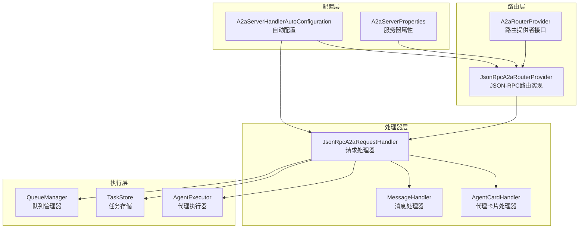
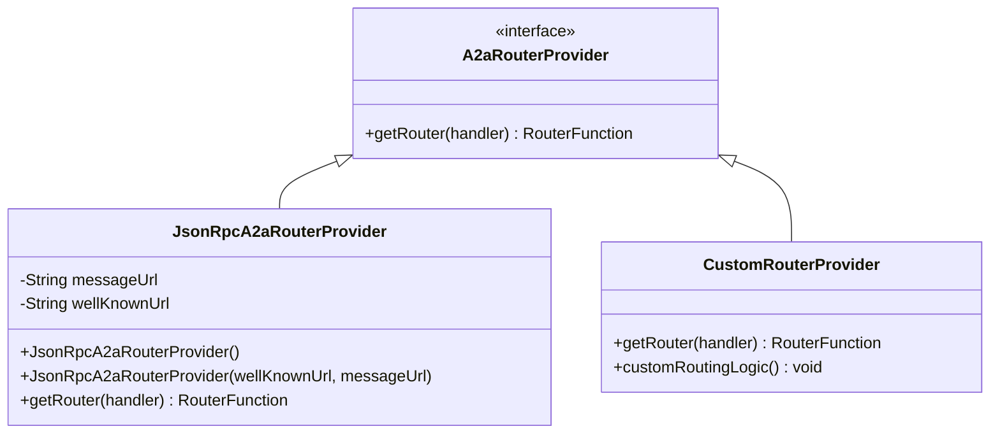
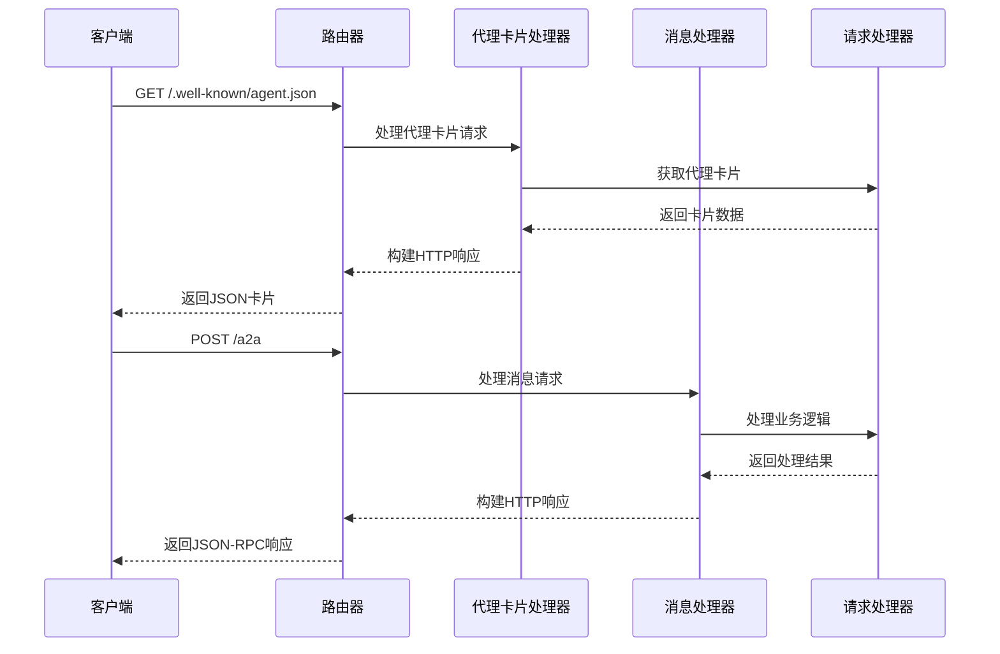
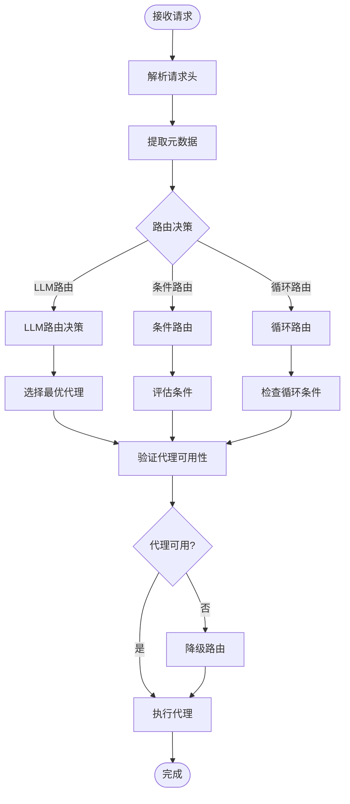
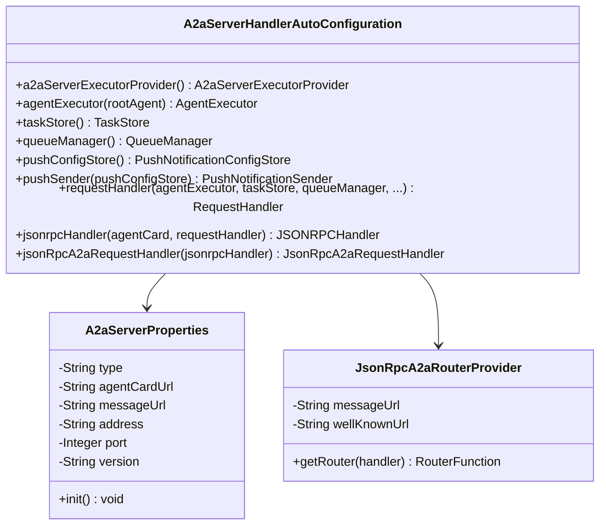
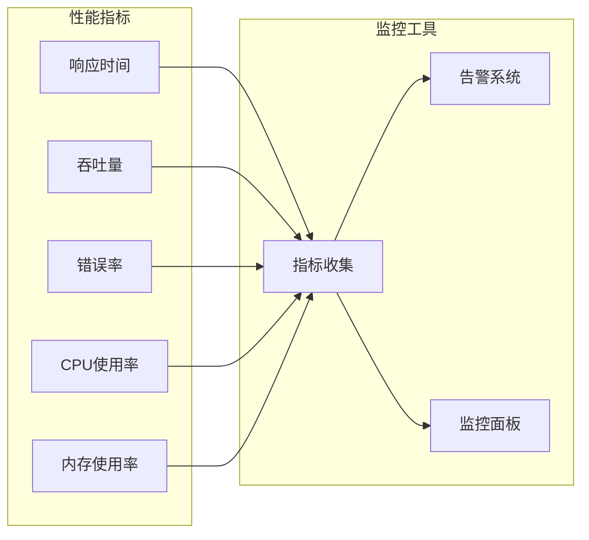
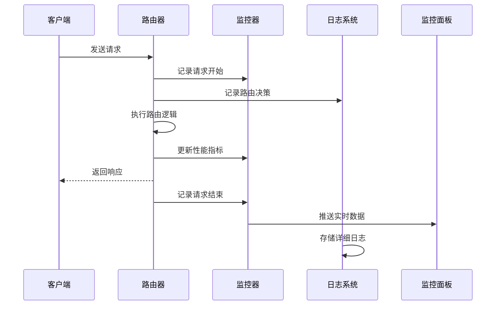
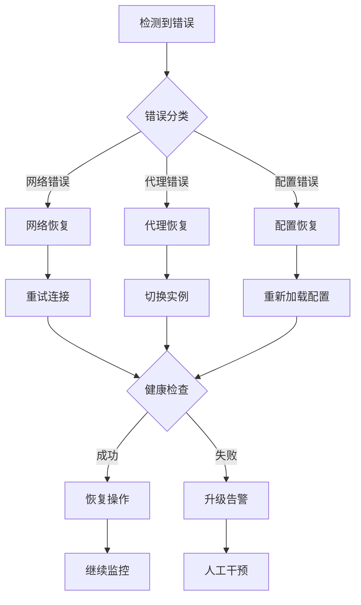

# 路由策略

<cite>
**本文档引用的文件**
- [A2aRouterProvider.java](file://spring-ai-alibaba-a2a/spring-ai-alibaba-a2a-common/src/main/java/com/alibaba/cloud/ai/a2a/route/A2aRouterProvider.java)
- [JsonRpcA2aRouterProvider.java](file://spring-ai-alibaba-a2a/spring-ai-alibaba-a2a-common/src/main/java/com/alibaba/cloud/ai/a2a/route/JsonRpcA2aRouterProvider.java)
- [A2aServerHandlerAutoConfiguration.java](file://auto-configurations/spring-ai-alibaba-autoconfigure-a2a-server/src/main/java/com/alibaba/cloud/ai/autoconfigure/a2a/server/A2aServerHandlerAutoConfiguration.java)
- [A2aServerAutoConfiguration.java](file://auto-configurations/spring-ai-alibaba-autoconfigure-a2a-server/src/main/java/com/alibaba/cloud/ai/autoconfigure/a2a/server/A2aServerAutoConfiguration.java)
- [A2aServerProperties.java](file://spring-ai-alibaba-a2a/spring-ai-alibaba-a2a-common/src/main/java/com/alibaba/cloud/ai/a2a/A2aServerProperties.java)
- [LlmRoutingAgent.java](file://spring-ai-alibaba-graph-core/src/main/java/com/alibaba/cloud/ai/graph/agent/flow/agent/LlmRoutingAgent.java)
- [RoutingEdgeAction.java](file://spring-ai-alibaba-graph-core/src/main/java/com/alibaba/cloud/ai/graph/agent/flow/node/RoutingEdgeAction.java)
- [RoutingGraphBuildingStrategy.java](file://spring-ai-alibaba-graph-core/src/main/java/com/alibaba/cloud/ai/graph/agent/flow/strategy/RoutingGraphBuildingStrategy.java)
- [McpDebugResponse.java](file://spring-ai-alibaba-mcp/spring-ai-alibaba-mcp-router/src/main/java/com/alibaba/cloud/ai/mcp/router/model/response/McpDebugResponse.java)
- [AbstractRouterWatcher.java](file://spring-ai-alibaba-mcp/spring-ai-alibaba-mcp-router/src/main/java/com/alibaba/cloud/ai/mcp/router/core/AbstractRouterWatcher.java)
</cite>

## 目录
1. [简介](#简介)
2. [核心架构概览](#核心架构概览)
3. [A2aRouterProvider接口设计](#a2arouterprovider接口设计)
4. [JsonRpcA2aRouterProvider实现](#jsonrpca2arouterprovider实现)
5. [路由决策过程](#路由决策过程)
6. [A2aServerHandlerAutoConfiguration配置](#a2aserverhandlerautoconfiguration配置)
7. [自定义路由逻辑实现](#自定义路由逻辑实现)
8. [性能优化技巧](#性能优化技巧)
9. [监控和调试方法](#监控和调试方法)
10. [故障排除指南](#故障排除指南)
11. [总结](#总结)

## 简介

Spring AI Alibaba的路由策略系统是一个高度可扩展的请求分发框架，专门设计用于处理A2A（Agent-to-Agent）协议中的智能路由决策。该系统的核心是`A2aRouterProvider`接口及其具体实现`JsonRpcA2aRouterProvider`，它们共同构成了整个路由基础设施的基础。

路由策略系统的主要职责包括：
- 基于JSON-RPC协议的请求路由
- 动态目标Agent识别
- 智能实例选择算法
- 故障转移策略
- 性能监控和优化
- 自定义路由规则支持

## 核心架构概览



**图表来源**
- [A2aRouterProvider.java](file://spring-ai-alibaba-a2a/spring-ai-alibaba-a2a-common/src/main/java/com/alibaba/cloud/ai/a2a/route/A2aRouterProvider.java#L25-L32)
- [JsonRpcA2aRouterProvider.java](file://spring-ai-alibaba-a2a/spring-ai-alibaba-a2a-common/src/main/java/com/alibaba/cloud/ai/a2a/route/JsonRpcA2aRouterProvider.java#L37-L75)
- [A2aServerHandlerAutoConfiguration.java](file://auto-configurations/spring-ai-alibaba-autoconfigure-a2a-server/src/main/java/com/alibaba/cloud/ai/autoconfigure/a2a/server/A2aServerHandlerAutoConfiguration.java#L40-L116)

## A2aRouterProvider接口设计

`A2aRouterProvider`是整个路由系统的核心接口，它定义了路由提供者的标准契约：

```java
public interface A2aRouterProvider<S extends A2aRequestHandler> {
    RouterFunction<ServerResponse> getRouter(S a2aRequestHandler);
}
```

这个泛型接口的设计具有以下特点：

### 接口特性分析

1. **类型安全**：使用泛型参数确保编译时类型检查
2. **解耦设计**：将路由逻辑与具体实现分离
3. **Spring集成**：返回Spring WebFlux的`RouterFunction`，便于Web层集成
4. **扩展性**：支持多种路由实现策略

### 扩展机制

路由系统支持多种扩展策略：



**图表来源**
- [A2aRouterProvider.java](file://spring-ai-alibaba-a2a/spring-ai-alibaba-a2a-common/src/main/java/com/alibaba/cloud/ai/a2a/route/A2aRouterProvider.java#L25-L32)
- [JsonRpcA2aRouterProvider.java](file://spring-ai-alibaba-a2a/spring-ai-alibaba-a2a-common/src/main/java/com/alibaba/cloud/ai/a2a/route/JsonRpcA2aRouterProvider.java#L37-L75)

**章节来源**
- [A2aRouterProvider.java](file://spring-ai-alibaba-a2a/spring-ai-alibaba-a2a-common/src/main/java/com/alibaba/cloud/ai/a2a/route/A2aRouterProvider.java#L25-L32)

## JsonRpcA2aRouterProvider实现

`JsonRpcA2aRouterProvider`是A2A协议中JSON-RPC路由的具体实现，它提供了完整的HTTP路由功能：

### 核心功能特性

```java
public class JsonRpcA2aRouterProvider implements A2aRouterProvider<JsonRpcA2aRequestHandler> {
    public static final String DEFAULT_WELL_KNOWN_URL = "/.well-known/agent.json";
    public static final String DEFAULT_MESSAGE_URL = "/a2a";
    
    private final String messageUrl;
    private final String wellKnownUrl;
}
```

### 路由配置

系统提供了灵活的URL配置选项：

- **默认代理卡片URL**：`/.well-known/agent.json`
- **默认消息URL**：`/a2a`
- **可配置性**：支持自定义URL路径

### 路由函数构建

```java
@Override
public RouterFunction<ServerResponse> getRouter(JsonRpcA2aRequestHandler a2aRequestHandler) {
    return RouterFunctions.route()
            .GET(this.wellKnownUrl, new AgentCardHandler(a2aRequestHandler))
            .POST(this.messageUrl, new MessageHandler(a2aRequestHandler))
            .build();
}
```

### 处理器架构



**图表来源**
- [JsonRpcA2aRouterProvider.java](file://spring-ai-alibaba-a2a/spring-ai-alibaba-a2a-common/src/main/java/com/alibaba/cloud/ai/a2a/route/JsonRpcA2aRouterProvider.java#L50-L75)

### 错误处理机制

每个处理器都实现了完善的错误处理：

```java
@Override
public ServerResponse handle(ServerRequest request) throws Exception {
    try {
        return ServerResponse.ok().body(a2aRequestHandler.getAgentCard());
    }
    catch (Exception e) {
        log.error("Failed to get Agent Card: {}", e.getMessage());
        return ServerResponse.status(HttpStatus.INTERNAL_SERVER_ERROR).build();
    }
}
```

**章节来源**
- [JsonRpcA2aRouterProvider.java](file://spring-ai-alibaba-a2a/spring-ai-alibaba-a2a-common/src/main/java/com/alibaba/cloud/ai/a2a/route/JsonRpcA2aRouterProvider.java#L37-L118)

## 路由决策过程

路由决策过程是整个系统的核心，涉及多个层次的智能决策：

### 目标Agent识别



**图表来源**
- [RoutingGraphBuildingStrategy.java](file://spring-ai-alibaba-graph-core/src/main/java/com/alibaba/cloud/ai/graph/agent/flow/strategy/RoutingGraphBuildingStrategy.java#L67-L117)
- [RoutingEdgeAction.java](file://spring-ai-alibaba-graph-core/src/main/java/com/alibaba/cloud/ai/graph/agent/flow/node/RoutingEdgeAction.java#L35-L84)

### 实例选择算法

系统支持多种实例选择策略：

1. **轮询算法**：均匀分配请求到各个实例
2. **权重算法**：根据实例权重进行分配
3. **负载均衡**：动态调整实例负载
4. **就近原则**：优先选择地理位置最近的实例

### 故障转移策略

```java
private void validateRoutingConfig(FlowGraphBuilder.FlowGraphConfig config) {
    if (config.getSubAgents() == null || config.getSubAgents().isEmpty()) {
        throw new IllegalArgumentException("Routing flow requires at least one sub-agent");
    }
    
    if (config.getChatModel() == null) {
        throw new IllegalArgumentException("Routing flow requires a ChatModel for decision making");
    }
}
```

**章节来源**
- [RoutingGraphBuildingStrategy.java](file://spring-ai-alibaba-graph-core/src/main/java/com/alibaba/cloud/ai/graph/agent/flow/strategy/RoutingGraphBuildingStrategy.java#L85-L117)

## A2aServerHandlerAutoConfiguration配置

`A2aServerHandlerAutoConfiguration`负责整个路由系统的配置和初始化：

### 配置组件层次



**图表来源**
- [A2aServerHandlerAutoConfiguration.java](file://auto-configurations/spring-ai-alibaba-autoconfigure-a2a-server/src/main/java/com/alibaba/cloud/ai/autoconfigure/a2a/server/A2aServerHandlerAutoConfiguration.java#L40-L116)
- [A2aServerProperties.java](file://spring-ai-alibaba-a2a/spring-ai-alibaba-a2a-common/src/main/java/com/alibaba/cloud/ai/a2a/A2aServerProperties.java#L40-L129)

### 路由超时配置

系统支持灵活的超时配置：

```java
@ConfigurationProperties(prefix = A2aServerProperties.CONFIG_PREFIX)
public class A2aServerProperties implements EnvironmentAware {
    public static final String CONFIG_PREFIX = "spring.ai.alibaba.a2a.server";
    
    private String type = A2aConstants.AGENT_TRANSPORT_TYPE_JSON_RPC;
    private String agentCardUrl = JsonRpcA2aRouterProvider.DEFAULT_WELL_KNOWN_URL;
    private String messageUrl = JsonRpcA2aRouterProvider.DEFAULT_MESSAGE_URL;
    private String address;
    private Integer port;
    private String version = A2aConstants.DEFAULT_AGENT_VERSION;
}
```

### 缓存策略配置

系统提供了多种缓存策略：

1. **内存缓存**：默认的内存存储策略
2. **持久化缓存**：支持Redis、数据库等持久化存储
3. **分布式缓存**：支持集群环境下的缓存同步

**章节来源**
- [A2aServerHandlerAutoConfiguration.java](file://auto-configurations/spring-ai-alibaba-autoconfigure-a2a-server/src/main/java/com/alibaba/cloud/ai/autoconfigure/a2a/server/A2aServerHandlerAutoConfiguration.java#L40-L116)
- [A2aServerProperties.java](file://spring-ai-alibaba-a2a/spring-ai-alibaba-a2a-common/src/main/java/com/alibaba/cloud/ai/a2a/A2aServerProperties.java#L40-L129)

## 自定义路由逻辑实现

系统提供了丰富的扩展点来实现自定义路由逻辑：

### LLM路由代理

```java
public class LlmRoutingAgent extends FlowAgent {
    private ChatModel chatModel;
    
    public static LlmRoutingAgentBuilder builder() {
        return new LlmRoutingAgentBuilder();
    }
    
    public static class LlmRoutingAgentBuilder extends FlowAgentBuilder<LlmRoutingAgent, LlmRoutingAgentBuilder> {
        private ChatModel chatModel;
        
        public LlmRoutingAgentBuilder model(ChatModel chatModel) {
            this.chatModel = chatModel;
            return this;
        }
        
        @Override
        protected LlmRoutingAgentBuilder self() {
            return this;
        }
        
        @Override
        public LlmRoutingAgent build() throws GraphStateException {
            validate();
            return new LlmRoutingAgent(this);
        }
    }
}
```

### 自定义路由策略

开发者可以通过以下方式实现自定义路由：

1. **继承A2aRouterProvider**：实现自己的路由提供者
2. **扩展RoutingEdgeAction**：自定义路由决策逻辑
3. **实现自定义Agent**：创建专用的路由代理

### 代码示例

```java
@Component
public class CustomRoutingAgent extends FlowAgent {
    
    public CustomRoutingAgent(CustomRoutingAgentBuilder builder) {
        super(builder);
    }
    
    @Override
    protected StateGraph buildSpecificGraph(FlowGraphBuilder.FlowGraphConfig config) throws GraphStateException {
        // 自定义路由图构建逻辑
        return FlowGraphBuilder.buildGraph("CUSTOM_ROUTING", config);
    }
    
    public static CustomRoutingAgentBuilder builder() {
        return new CustomRoutingAgentBuilder();
    }
    
    public static class CustomRoutingAgentBuilder extends FlowAgentBuilder<CustomRoutingAgent, CustomRoutingAgentBuilder> {
        // 自定义构建器逻辑
    }
}
```

**章节来源**
- [LlmRoutingAgent.java](file://spring-ai-alibaba-graph-core/src/main/java/com/alibaba/cloud/ai/graph/agent/flow/agent/LlmRoutingAgent.java#L35-L84)

## 性能优化技巧

### 连接池管理

系统提供了高效的连接池管理机制：

```java
public class McpCacheManager {
    private volatile ExecutorService connectionExecutorRef = createDefaultExecutor();
    
    private ExecutorService createDefaultExecutor() {
        ThreadPoolExecutor executor = new ThreadPoolExecutor(
            2, // corePoolSize
            10, // maxPoolSize
            60L, // keepAliveTime
            TimeUnit.SECONDS,
            new LinkedBlockingQueue<>(100) // queueCapacity
        );
        executor.allowCoreThreadTimeOut(true);
        return executor;
    }
}
```

### 异步处理优化

```java
static AsyncNodeActionWithConfig node_async(NodeActionWithConfig syncAction) {
    return (state, config) -> {
        Context context = Context.current();
        CompletableFuture<Map<String, Object>> result = new CompletableFuture<>();
        try {
            result.complete(syncAction.apply(state, config));
        }
        catch (Exception e) {
            result.completeExceptionally(e);
        }
        return result;
    };
}
```

### 内存优化策略

```java
private void processMemoryOptimizedBatch() {
    try {
        long memoryBefore = getMemoryUsage();
        
        // 处理并监控内存使用
        processor.processWithMemoryOptimization(new ArrayList<>(currentBatch), 
                                               processedRows.get(), memoryBefore, memoryPressureMode.get());
        
        long memoryAfter = getMemoryUsage();
        
        // 及时清理批次数据
        currentBatch.clear();
        
        // 定期记录内存使用情况
        if (processedRows.get() % 5000 == 0) {
            log.info("Memory usage: {} MB -> {} MB, Batch size: {}, Pressure mode: {}", 
                    memoryBefore, memoryAfter, dynamicBatchSize.get(), memoryPressureMode.get());
        }
        
    } catch (Exception e) {
        log.error("Error in memory-optimized batch processing: {}", e.getMessage(), e);
        throw new RuntimeException("Memory-optimized processing failed", e);
    }
}
```

### 性能监控指标



**章节来源**
- [McpCacheManager.java](file://spring-ai-alibaba-jmanus/src/main/java/com/alibaba/cloud/ai/manus/mcp/service/McpCacheManager.java#L351-L364)

## 监控和调试方法

### 路由监控系统

```java
public abstract class AbstractRouterWatcher {
    protected static final Logger logger = LoggerFactory.getLogger(AbstractRouterWatcher.class);
    protected final ScheduledExecutorService scheduler = Executors.newSingleThreadScheduledExecutor();
    
    protected void startScheduledPolling() {
        long interval = Math.max(1, getPollingInterval());
        scheduler.scheduleAtFixedRate(this::watch, interval, interval, TimeUnit.SECONDS);
        logger.info("Started router watcher polling, interval: {}s", interval);
    }
    
    protected abstract void handleChange();
    
    protected long getPollingInterval() {
        return 30L; // 默认30秒
    }
}
```

### 调试响应结构

```java
public class McpDebugResponse {
    private boolean success;
    private String errorMessage;
    private String serviceName;
    private Long debugTimestamp;
    private McpServiceStatus serviceStatus;
    private McpConnectionDiagnosis connectionDiagnosis;
    private List<String> troubleshootingSuggestions;
    private Map<String, Object> systemInfo;
    
    public static McpDebugResponse success(String serviceName, 
                                          McpServiceStatus serviceStatus,
                                          McpConnectionDiagnosis connectionDiagnosis,
                                          List<String> suggestions) {
        McpDebugResponse response = new McpDebugResponse();
        response.success = true;
        response.serviceName = serviceName;
        response.serviceStatus = serviceStatus;
        response.connectionDiagnosis = connectionDiagnosis;
        response.troubleshootingSuggestions = suggestions;
        return response;
    }
}
```

### 调试上下文管理

```java
interface DebugContextValue {
    DebugState debugState;
    void addDebugLog(Omit<DebugInfo, 'timestamp'> log);
    void updateConnectionStatus(Partial<ConnectionStatus> status);
    void updateMetrics(Partial<DebugState['metrics']> metrics);
    void clearLogs();
}

const initialDebugState: DebugState = {
    debugLogs: [],
    connectionStatus: {
        status: 'connected',
        lastConnected: new Date(),
    },
    metrics: {
        messagesCount: 0,
        averageResponseTime: 0,
        errorCount: 0,
        lastActivity: null,
    },
};
```

### 路由行为跟踪



**章节来源**
- [AbstractRouterWatcher.java](file://spring-ai-alibaba-mcp/spring-ai-alibaba-mcp-router/src/main/java/com/alibaba/cloud/ai/mcp/router/core/AbstractRouterWatcher.java#L30-L58)
- [McpDebugResponse.java](file://spring-ai-alibaba-mcp/spring-ai-alibaba-mcp-router/src/main/java/com/alibaba/cloud/ai/mcp/router/model/response/McpDebugResponse.java#L51-L108)

## 故障排除指南

### 常见路由问题

1. **代理卡片获取失败**
   - 检查网络连接
   - 验证代理服务状态
   - 查看错误日志

2. **消息路由超时**
   - 调整超时配置
   - 检查代理负载
   - 优化网络延迟

3. **路由决策错误**
   - 验证LLM模型配置
   - 检查路由规则
   - 测试代理可用性

### 诊断工具

```java
public class McpConnectionDiagnosis {
    private boolean connectivityTestPassed;
    private boolean authenticationTestPassed;
    private boolean permissionTestPassed;
    private List<String> connectivityIssues;
    private List<String> authenticationIssues;
    private List<String> permissionIssues;
    
    public boolean isHealthy() {
        return connectivityTestPassed && authenticationTestPassed && permissionTestPassed;
    }
}
```

### 故障恢复策略



### 性能调优建议

1. **连接池优化**
   - 根据并发量调整线程池大小
   - 设置合适的队列容量
   - 启用核心线程超时

2. **内存管理**
   - 及时清理临时对象
   - 使用弱引用避免内存泄漏
   - 监控GC性能

3. **网络优化**
   - 启用连接复用
   - 设置合理的超时时间
   - 使用压缩传输

## 总结

Spring AI Alibaba的路由策略系统是一个功能强大且高度可扩展的解决方案，它通过以下关键特性为企业级应用提供了可靠的路由保障：

### 核心优势

1. **模块化设计**：清晰的接口分离和依赖注入
2. **高性能**：异步处理和连接池优化
3. **可扩展性**：丰富的扩展点和自定义能力
4. **可观测性**：全面的监控和调试支持
5. **容错性**：完善的错误处理和故障转移机制

### 最佳实践

1. **合理配置超时时间**：平衡响应速度和可靠性
2. **监控关键指标**：关注性能和可用性指标
3. **定期维护连接池**：确保资源的有效利用
4. **实施渐进式部署**：逐步引入新路由策略
5. **建立告警机制**：及时发现和处理异常情况

### 未来发展方向

随着AI技术的不断发展，路由策略系统将继续演进：

- **智能化路由**：基于机器学习的动态路由决策
- **多模态支持**：支持文本、图像、语音等多种输入
- **边缘计算**：支持分布式和边缘节点的路由
- **安全增强**：加强路由过程中的安全防护

通过深入理解和正确使用这些路由策略，开发者可以构建出高效、可靠且易于维护的AI应用系统。