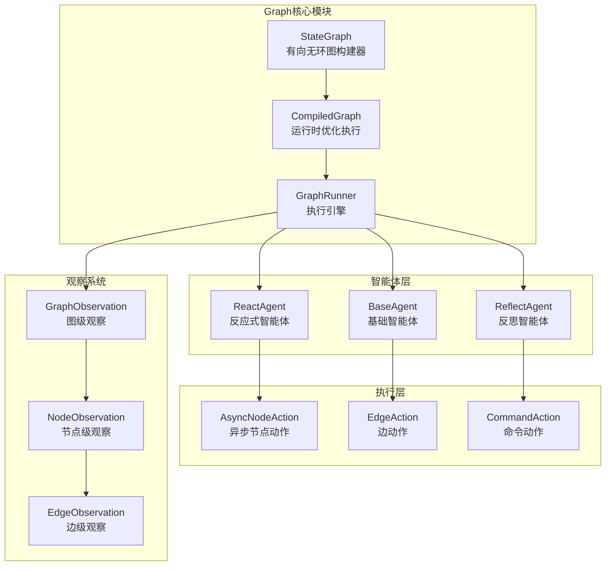
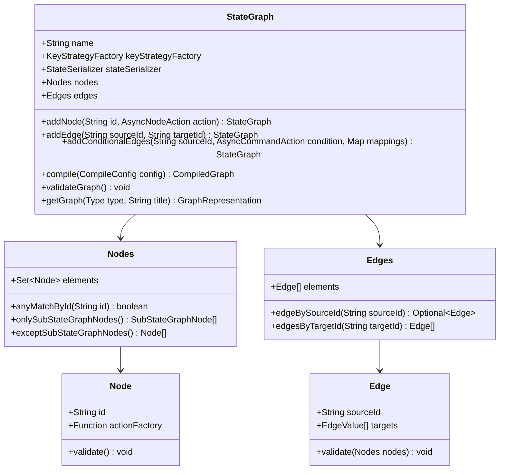
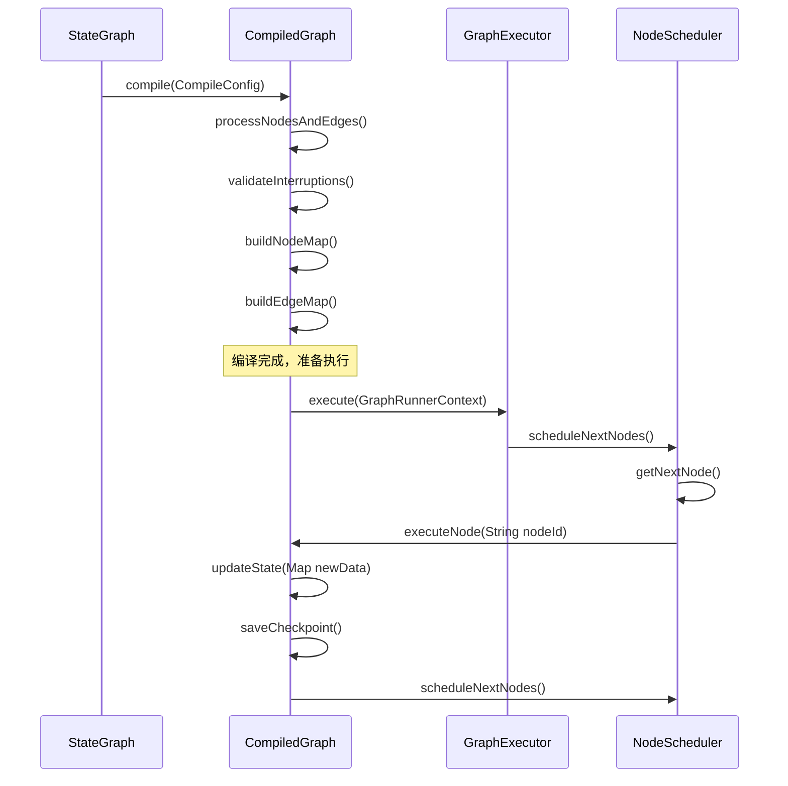
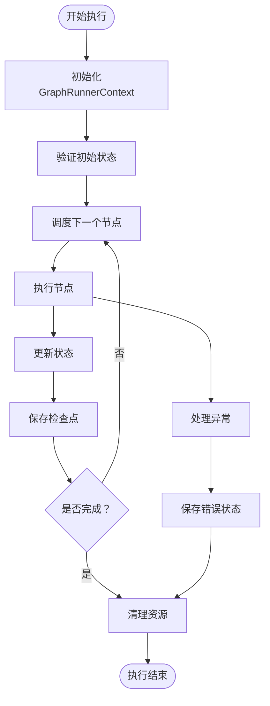
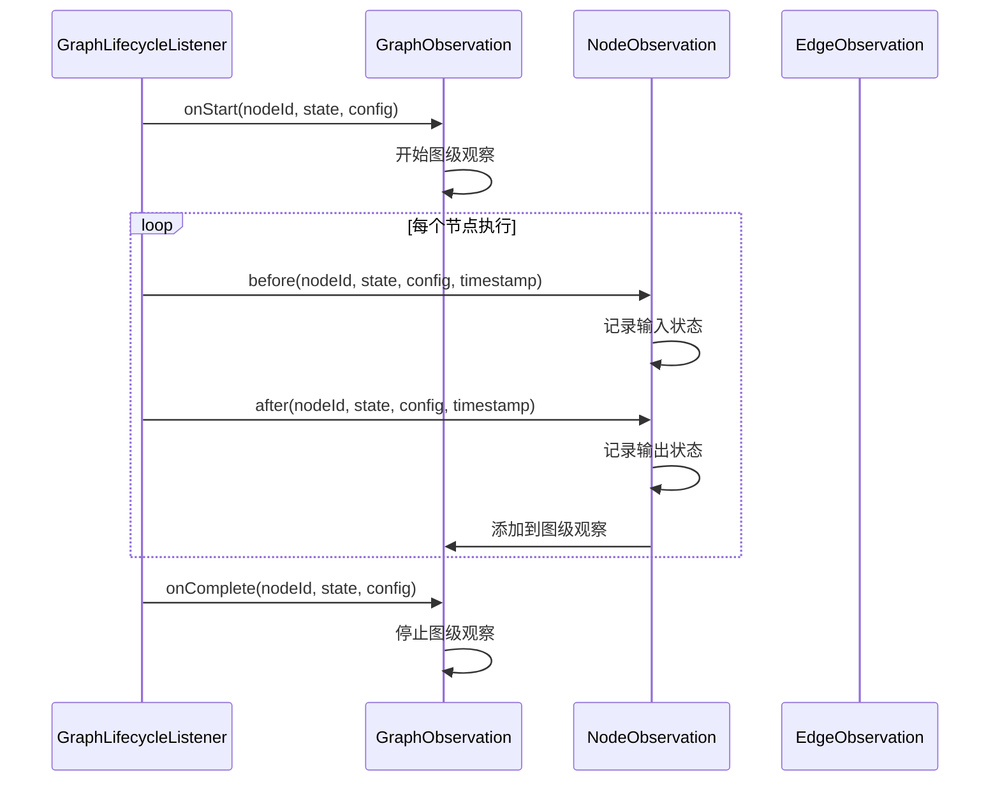
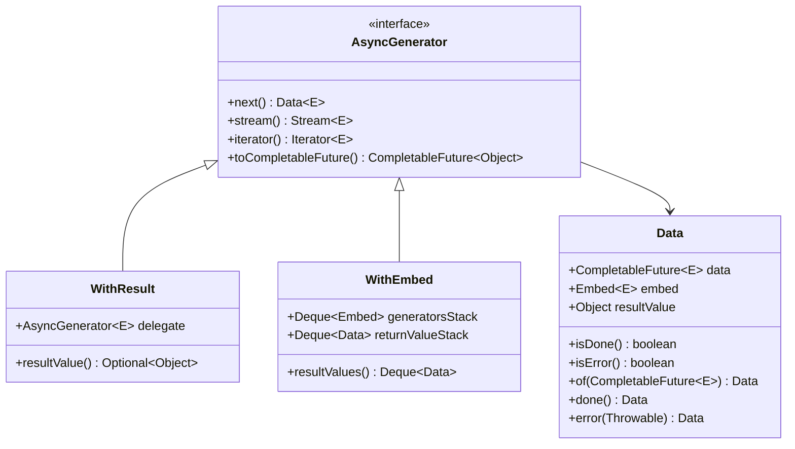

# Graph多智能体框架

<cite>
**本文档引用的文件**
- [StateGraph.java](file://spring-ai-alibaba-graph-core/src/main/java/com/alibaba/cloud/ai/graph/StateGraph.java)
- [CompiledGraph.java](file://spring-ai-alibaba-graph-core/src/main/java/com/alibaba/cloud/ai/graph/CompiledGraph.java)
- [GraphRunner.java](file://spring-ai-alibaba-graph-core/src/main/java/com/alibaba/cloud/ai/graph/GraphRunner.java)
- [GraphObservationAutoConfiguration.java](file://auto-configurations/spring-ai-alibaba-autoconfigure-graph-observation/src/main/java/com/alibaba/cloud/ai/autoconfigure/graph/GraphObservationAutoConfiguration.java)
- [GraphObservationLifecycleListener.java](file://spring-ai-alibaba-graph-core/src/main/java/com/alibaba/cloud/ai/graph/observation/GraphObservationLifecycleListener.java)
- [AsyncNodeAction.java](file://spring-ai-alibaba-graph-core/src/main/java/com/alibaba/cloud/ai/graph/action/AsyncNodeAction.java)
- [AsyncGenerator.java](file://spring-ai-alibaba-graph-core/src/main/java/com/alibaba/cloud/ai/graph/async/AsyncGenerator.java)
- [StateGraphTest.java](file://spring-ai-alibaba-graph-core/src/test/java/com/alibaba/cloud/ai/graph/StateGraphTest.java)
</cite>

## 目录
1. [简介](#简介)
2. [项目架构概览](#项目架构概览)
3. [核心组件详解](#核心组件详解)
4. [StateGraph：有向无环图构建器](#stategraph有向无环图构建器)
5. [CompiledGraph：运行时优化执行](#compiledgraph运行时优化执行)
6. [GraphRunner：执行引擎](#graphrunner执行引擎)
7. [观察系统集成](#观察系统集成)
8. [异步处理与流式响应](#异步处理与流式响应)
9. [实际应用示例](#实际应用示例)
10. [性能优化与最佳实践](#性能优化与最佳实践)
11. [故障排除指南](#故障排除指南)
12. [总结](#总结)

## 简介

Spring AI Alibaba的Graph多智能体框架是一个强大的工作流编排引擎，专门设计用于构建复杂的AI智能体协作流程。该框架基于有向无环图（DAG）模型，提供了完整的状态管理、节点调度、检查点保存和监控追踪功能。

框架的核心设计理念是将复杂的AI工作流分解为可组合的节点和边，每个节点代表一个独立的智能体或处理单元，而边则定义了节点之间的数据流转和控制流转移。这种设计使得开发者能够轻松构建从简单的线性流程到复杂的分支合并流程的各种工作流模式。

## 项目架构概览



**图表来源**
- [StateGraph.java](file://spring-ai-alibaba-graph-core/src/main/java/com/alibaba/cloud/ai/graph/StateGraph.java#L1-L601)
- [CompiledGraph.java](file://spring-ai-alibaba-graph-core/src/main/java/com/alibaba/cloud/ai/graph/CompiledGraph.java#L1-L199)
- [GraphRunner.java](file://spring-ai-alibaba-graph-core/src/main/java/com/alibaba/cloud/ai/graph/GraphRunner.java#L1-L69)

## 核心组件详解

### StateGraph：有向无环图构建器

StateGraph是整个框架的核心构建器，负责定义和验证有向无环图的工作流结构。它提供了丰富的API来添加节点、连接边以及配置图的行为。



**图表来源**
- [StateGraph.java](file://spring-ai-alibaba-graph-core/src/main/java/com/alibaba/cloud/ai/graph/StateGraph.java#L50-L601)

### CompiledGraph：运行时优化执行

CompiledGraph是对StateGraph的编译版本，包含了运行时所需的优化信息和预处理数据。它负责管理节点执行、状态转换和检查点保存。



**图表来源**
- [CompiledGraph.java](file://spring-ai-alibaba-graph-core/src/main/java/com/alibaba/cloud/ai/graph/CompiledGraph.java#L89-L199)
- [GraphRunner.java](file://spring-ai-alibaba-graph-core/src/main/java/com/alibaba/cloud/ai/graph/GraphRunner.java#L39-L67)

**章节来源**
- [StateGraph.java](file://spring-ai-alibaba-graph-core/src/main/java/com/alibaba/cloud/ai/graph/StateGraph.java#L427-L459)
- [CompiledGraph.java](file://spring-ai-alibaba-graph-core/src/main/java/com/alibaba/cloud/ai/graph/CompiledGraph.java#L89-L126)

## StateGraph：有向无环图构建器

StateGraph类是整个框架的基础，它提供了声明式的API来构建复杂的AI工作流。该类支持多种类型的节点添加和边连接方式，包括普通节点、条件节点和子图节点。

### 基本节点添加

```java
// 添加普通节点
StateGraph workflow = new StateGraph(keyStrategyFactory)
    .addEdge(START, "agent_1")
    .addNode("agent_1", AsyncNodeAction.node_async(state -> {
        // 节点逻辑
        return Map.of("result", "processed_data");
    }))
    .addEdge("agent_1", END);
```

### 条件边连接

```java
// 添加条件边
workflow.addConditionalEdges("agent_1", AsyncCommandAction.node_async((state, config) -> {
    // 条件判断逻辑
    return "agent_2";
}), Map.of(
    "condition_true", "agent_2",
    "condition_false", "agent_3"
));
```

### 子图嵌套

```java
// 创建子图
StateGraph childGraph = new StateGraph()
    .addNode("child_step_1", childNode1)
    .addNode("child_step_2", childNode2)
    .addEdge(START, "child_step_1")
    .addEdge("child_step_1", "child_step_2")
    .addEdge("child_step_2", END);

// 将子图作为节点添加到主图
workflow.addNode("subgraph", childGraph);
```

**章节来源**
- [StateGraph.java](file://spring-ai-alibaba-graph-core/src/main/java/com/alibaba/cloud/ai/graph/StateGraph.java#L236-L352)

## CompiledGraph：运行时优化执行

CompiledGraph是StateGraph的编译版本，它在编译阶段进行各种优化和验证，确保运行时的高效执行。编译过程包括节点映射构建、边关系解析和中断点验证。

### 编译配置

```java
// 创建编译配置
CompileConfig config = CompileConfig.builder()
    .checkpointSaver(checkpointSaver)
    .interruptsBefore(Arrays.asList("node_1", "node_2"))
    .interruptsAfter(Arrays.asList("node_3"))
    .releaseThread(true)
    .build();

// 编译StateGraph
CompiledGraph compiledGraph = stateGraph.compile(config);
```

### 运行时执行

```java
// 执行编译后的图
Optional<OverAllState> result = compiledGraph.call(inputData);

// 流式执行
Flux<NodeOutput> stream = compiledGraph.fluxStream(inputData);
```

### 检查点管理

```java
// 获取状态历史
Collection<StateSnapshot> history = compiledGraph.getStateHistory(config);

// 恢复执行
Optional<StateSnapshot> lastSnapshot = compiledGraph.lastStateOf(config);
```

**章节来源**
- [CompiledGraph.java](file://spring-ai-alibaba-graph-core/src/main/java/com/alibaba/cloud/ai/graph/CompiledGraph.java#L561-L593)

## GraphRunner：执行引擎

GraphRunner是框架的执行引擎，基于Project Reactor构建，提供响应式的执行能力。它负责协调整个图的执行过程，包括节点调度、状态管理和错误处理。

### 执行流程



**图表来源**
- [GraphRunner.java](file://spring-ai-alibaba-graph-core/src/main/java/com/alibaba/cloud/ai/graph/GraphRunner.java#L39-L67)

### 异步执行

```java
// 创建GraphRunner
GraphRunner runner = new GraphRunner(compiledGraph, initialState, config);

// 异步执行
Flux<GraphResponse<NodeOutput>> response = runner.run();

// 处理响应流
response.doOnNext(System.out::println)
    .doOnError(error -> log.error("Execution failed", error))
    .blockLast();
```

**章节来源**
- [GraphRunner.java](file://spring-ai-alibaba-graph-core/src/main/java/com/alibaba/cloud/ai/graph/GraphRunner.java#L39-L67)

## 观察系统集成

框架提供了完整的观察系统集成，通过GraphObservationAutoConfiguration自动配置监控和追踪功能。这使得开发者能够轻松地监控工作流的执行情况并进行性能分析。

### 自动配置

```java
@AutoConfiguration
@ConditionalOnClass({ StateGraph.class, ObservationRegistry.class })
@EnableConfigurationProperties(GraphObservationProperties.class)
@ConditionalOnProperty(prefix = "graph.observation", name = "enabled", havingValue = "true")
public class GraphObservationAutoConfiguration {
    // 自动配置观察监听器和处理器
}
```

### 生命周期监听



**图表来源**
- [GraphObservationLifecycleListener.java](file://spring-ai-alibaba-graph-core/src/main/java/com/alibaba/cloud/ai/graph/observation/GraphObservationLifecycleListener.java#L60-L120)

### 监控指标

观察系统提供了以下监控维度：
- 图级执行时间
- 节点执行统计
- 边跳转频率
- 错误率统计
- 内存使用情况

**章节来源**
- [GraphObservationAutoConfiguration.java](file://auto-configurations/spring-ai-alibaba-autoconfigure-graph-observation/src/main/java/com/alibaba/cloud/ai/autoconfigure/graph/GraphObservationAutoConfiguration.java#L40-L128)
- [GraphObservationLifecycleListener.java](file://spring-ai-alibaba-graph-core/src/main/java/com/alibaba/cloud/ai/graph/observation/GraphObservationLifecycleListener.java#L40-L247)

## 异步处理与流式响应

框架内置了强大的异步处理能力，支持流式响应和并发执行。通过AsyncGenerator接口，可以实现高效的异步数据流处理。

### 异步节点动作

```java
// 定义异步节点动作
AsyncNodeAction asyncAction = AsyncNodeAction.node_async(state -> {
    // 异步处理逻辑
    CompletableFuture<Map<String, Object>> future = CompletableFuture.supplyAsync(() -> {
        // 长时间运行的任务
        return processData(state);
    });
    return future;
});
```

### 流式生成器



**图表来源**
- [AsyncGenerator.java](file://spring-ai-alibaba-graph-core/src/main/java/com/alibaba/cloud/ai/graph/async/AsyncGenerator.java#L40-L150)

### 并发执行

```java
// 并行节点执行
StateGraph workflow = new StateGraph(keyStrategyFactory)
    .addNode("parallel_1", node1)
    .addNode("parallel_2", node2)
    .addNode("parallel_3", node3)
    .addEdge("parallel_1", "merge_node")
    .addEdge("parallel_2", "merge_node")
    .addEdge("parallel_3", "merge_node")
    .addEdge(START, "parallel_1");
```

**章节来源**
- [AsyncGenerator.java](file://spring-ai-alibaba-graph-core/src/main/java/com/alibaba/cloud/ai/graph/async/AsyncGenerator.java#L40-L485)

## 实际应用示例

### 简单线性流程

```java
// 构建简单的线性工作流
StateGraph linearWorkflow = new StateGraph(keyStrategyFactory)
    .addEdge(START, "data_ingestion")
    .addNode("data_ingestion", ingestDataNode)
    .addEdge("data_ingestion", "data_processing")
    .addNode("data_processing", processDataNode)
    .addEdge("data_processing", "data_analysis")
    .addNode("data_analysis", analyzeDataNode)
    .addEdge("data_analysis", END);

CompiledGraph compiled = linearWorkflow.compile();
Optional<OverAllState> result = compiled.call(inputData);
```

### 复杂分支合并流程

```java
// 构建包含条件分支的工作流
StateGraph complexWorkflow = new StateGraph(keyStrategyFactory)
    .addEdge(START, "decision_node")
    .addNode("decision_node", decisionNode)
    .addConditionalEdges("decision_node", conditionAction, Map.of(
        "high_priority", "priority_handler",
        "medium_priority", "medium_handler",
        "low_priority", "low_handler"
    ))
    .addNode("priority_handler", priorityNode)
    .addNode("medium_handler", mediumNode)
    .addNode("low_handler", lowNode)
    .addEdge("priority_handler", "merge_node")
    .addEdge("medium_handler", "merge_node")
    .addEdge("low_handler", "merge_node")
    .addEdge("merge_node", END);
```

### 多智能体协作流程

```java
// 构建多智能体协作工作流
StateGraph agentCollaboration = new StateGraph(keyStrategyFactory)
    .addEdge(START, "planner")
    .addNode("planner", plannerAgent)
    .addNode("researcher", researcherAgent)
    .addNode("writer", writerAgent)
    .addNode("reviewer", reviewerAgent)
    .addEdge("planner", "researcher")
    .addEdge("researcher", "writer")
    .addEdge("writer", "reviewer")
    .addEdge("reviewer", "planner") // 循环协作
    .addEdge("reviewer", END);
```

**章节来源**
- [StateGraphTest.java](file://spring-ai-alibaba-graph-core/src/test/java/com/alibaba/cloud/ai/graph/StateGraphTest.java#L100-L400)

## 性能优化与最佳实践

### 1. 合理设置检查点策略

```java
// 配置检查点保存策略
SaverConfig saverConfig = SaverConfig.builder()
    .register(SaverEnum.MEMORY.getValue(), new MemorySaver())
    .register(SaverEnum.FILESYSTEM.getValue(), new FileSystemSaver("/tmp/checkpoints"))
    .build();

CompileConfig config = CompileConfig.builder()
    .saverConfig(saverConfig)
    .checkpointInterval(10) // 每10个节点保存一次
    .build();
```

### 2. 优化节点执行顺序

```java
// 使用并行节点提高执行效率
StateGraph workflow = new StateGraph(keyStrategyFactory)
    .addNode("parallel_tasks", parallelNode)
    .addEdge(START, "parallel_tasks")
    .addEdge("parallel_tasks", END);
```

### 3. 合理使用中断机制

```java
// 配置中断点
CompileConfig config = CompileConfig.builder()
    .interruptsBefore(Arrays.asList("critical_node_1", "critical_node_2"))
    .interruptsAfter(Arrays.asList("validation_node"))
    .build();
```

### 4. 监控和调优

```java
// 启用观察系统
GraphObservationProperties props = new GraphObservationProperties();
props.setEnabled(true);
props.setMetricsEnabled(true);

// 配置观察监听器
GraphObservationLifecycleListener listener = new GraphObservationLifecycleListener(observationRegistry);
```

## 故障排除指南

### 常见问题及解决方案

#### 1. 图验证失败

**问题**: `GraphStateException: missing Entry Point`

**解决方案**: 确保图至少有一个起始节点和结束节点

```java
StateGraph workflow = new StateGraph(keyStrategyFactory)
    .addEdge(START, "first_node")  // 必须有起始边
    .addNode("first_node", node)
    .addEdge("first_node", END);   // 必须有结束边
```

#### 2. 节点重复定义

**问题**: `GraphStateException: duplicate node error`

**解决方案**: 确保节点ID唯一

```java
// 正确的做法
workflow.addNode("unique_node_id", node1);
workflow.addNode("another_unique_id", node2);

// 错误的做法
workflow.addNode("duplicate_id", node1);
workflow.addNode("duplicate_id", node2); // 会抛出异常
```

#### 3. 条件边映射为空

**问题**: `GraphStateException: edge mapping is empty`

**解决方案**: 为条件边提供有效的映射

```java
workflow.addConditionalEdges("source", condition, Map.of(
    "condition_key", "target_node"
)); // 映射不能为空
```

### 调试技巧

#### 1. 启用详细日志

```java
// 在application.properties中启用调试日志
logging.level.com.alibaba.cloud.ai.graph=DEBUG
```

#### 2. 使用图形表示

```java
// 获取图形表示用于可视化
GraphRepresentation representation = stateGraph.getGraph(GraphRepresentation.Type.DOT, "My Workflow");
System.out.println(representation.content());
```

#### 3. 检查点调试

```java
// 查看状态历史
Collection<StateSnapshot> history = compiledGraph.getStateHistory(config);
history.forEach(snapshot -> {
    System.out.println("State: " + snapshot.state().data());
    System.out.println("Timestamp: " + snapshot.timestamp());
});
```

**章节来源**
- [StateGraphTest.java](file://spring-ai-alibaba-graph-core/src/test/java/com/alibaba/cloud/ai/graph/StateGraphTest.java#L80-L150)

## 总结

Spring AI Alibaba的Graph多智能体框架提供了一个强大而灵活的工作流编排平台。通过StateGraph的声明式API、CompiledGraph的运行时优化、GraphRunner的响应式执行引擎以及完整的观察系统集成，开发者可以轻松构建复杂的AI智能体协作流程。

框架的主要优势包括：

1. **模块化设计**: 清晰的组件分离，便于维护和扩展
2. **异步处理**: 基于Reactor的响应式编程模型
3. **状态管理**: 完整的状态跟踪和检查点保存机制
4. **监控集成**: 自动化的观察和追踪功能
5. **灵活配置**: 支持多种执行策略和优化选项

无论是简单的线性流程还是复杂的多智能体协作场景，该框架都能提供优雅的解决方案。通过合理的配置和最佳实践，开发者可以构建高性能、可维护的AI工作流系统。